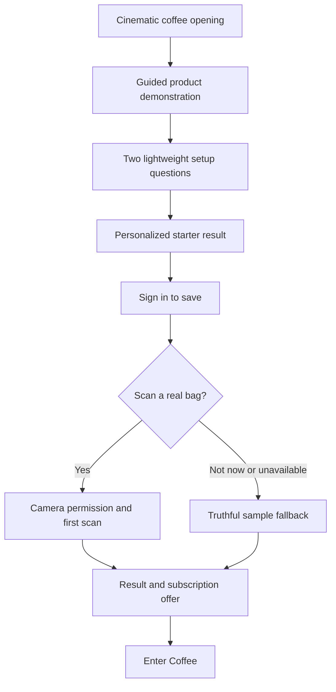

# Premium Cinematic Onboarding

## Summary

Rebuild Coffee's onboarding around a proven value-before-auth journey, expressed through cinematic specialty-coffee imagery and a cohesive editorial 3D Professor Ruphus. The work includes the complete design-production and validation lifecycle required to ship a premium result, not just a functional flow or visual reskin.

---

## Problem Frame

Coffee already has a technically capable onboarding system with persistence, personalization, scanning, subscription handling, automated scenarios, and device evidence. Despite that investment, the current experience feels assembled rather than art-directed: many screens repeat the same mascot portrait, speech bubble, headline, card stack, and cream backdrop. The length and repetition make the experience feel like a form instead of an introduction to a premium specialty-coffee product.

The most damaging visual defect is the mascot asset treatment. Existing videos contain a near-white background that does not match the app's cream canvas. Attempts to hide it through runtime masking proved unreliable on physical iPhones, leaving visible boxes or forcing the character into framed portrait cards. The result breaks visual continuity and makes otherwise polished work appear cheap.

The app itself has a stronger identity than its onboarding: warm editorial typography, restrained cream and brown surfaces, real coffee photography, crafted bean artifacts, and a product experience centered on understanding and brewing coffee. Onboarding should introduce that product identity rather than adopting a separate mascot-heavy storybook language.

---

## User Flow

The prose requirements govern if this conceptual diagram and later implementation details diverge.

---

## Actors

- A1. New coffee user: wants to understand the product quickly and see a useful result before creating an account or considering payment.
- A2. Returning or already-entitled user: may encounter a replay or restored onboarding state and should not be forced through irrelevant subscription or permission steps.
- A3. Product and creative team: produces, critiques, and approves the visual system and assets before the complete flow is built.

---

## Key Flows

- F1. Premium first-run journey
  - **Trigger:** A1 launches Coffee without a completed onboarding profile.
  - **Actors:** A1
  - **Steps:** Experience a cinematic opening, watch or interact with a concise product demonstration, answer two setup questions, receive a personalized starter result, sign in to save it, optionally scan a real bag, and encounter the subscription offer only after useful value is visible.
  - **Outcome:** The user enters Coffee understanding what it does, with saved preferences and a credible first artifact or fallback result.
  - **Covered by:** R1, R2, R3, R4, R5, R6

- F2. Permission or scan escape path
  - **Trigger:** A1 declines camera access, has no bag available, encounters an unavailable scanner, or chooses not to scan.
  - **Actors:** A1
  - **Steps:** Decline or skip without pressure, receive a clearly labeled sample experience, retain prior answers, and continue without a dead end.
  - **Outcome:** The narrative remains coherent and premium without pretending a sample was generated from the user's coffee.
  - **Covered by:** R6, R18

- F3. Returning or entitled-user path
  - **Trigger:** A2 replays onboarding, resumes a partial journey, or already owns the relevant entitlement.
  - **Actors:** A2
  - **Steps:** Resume safely when appropriate, skip irrelevant purchase pressure, preserve account separation, and enter the app without duplicate completion side effects.
  - **Outcome:** The rebuilt presentation preserves existing reliability and subscription correctness.
  - **Covered by:** R7, R18

- F4. Creative approval path
  - **Trigger:** A3 has an initial Ruphus direction and representative screen concepts.
  - **Actors:** A3
  - **Steps:** Review the character art bible and three representative screens, reject generic or inconsistent work, verify compositing on an actual iPhone, and approve the system before full-flow production.
  - **Outcome:** Major art-direction failures are found before they are multiplied across every screen.
  - **Covered by:** R8, R9, R10, R11, R12, R13, R16, R17

---

## Requirements

**Narrative and activation**

- R1. The journey must use a value-before-auth structure modeled on Cal AI's proven activation order: demonstrate the product, collect only essential context, deliver a result, then request sign-in and present the subscription decision.
- R2. The opening must immediately communicate Coffee's sensory and product identity through a concise cinematic coffee moment rather than a questionnaire, feature list, or mascot speech.
- R3. Before sign-in, the user should answer only two lightweight setup questions: their primary brewing method and the outcome they most want help improving. Any additional information must be collected later or only when contextually necessary.
- R4. The pre-auth product demonstration must show a believable transformation from coffee bag information into a polished Coffee artifact and useful brewing guidance. It must be interactive or feel directly connected to the product, not resemble a marketing carousel.
- R5. The personalized starter result must be visibly derived from the user's answers and use real Coffee product language. It must not rely on arbitrary personality archetypes, fabricated precision, or praise unsupported by user input.
- R6. Sign-in must be framed as saving the value the user has already created or previewed. Camera permission and the first real scan must be requested contextually and remain skippable without breaking the journey.
- R7. The subscription offer must appear only after useful value is visible. Existing subscribers must bypass irrelevant purchase pressure, and all completion paths must remain truthful and recoverable.

**Professor Ruphus and visual direction**

- R8. Professor Ruphus must be rebuilt as a coherent editorial 3D character family with a single approved art bible covering silhouette, proportions, materials, wardrobe, lighting, camera language, expression range, scale, and environmental treatment.
- R9. Ruphus must appear in a small number of narratively meaningful moments, approximately introduction, product guidance, and result celebration. He must not become a repeated portrait-card template or compete with the coffee and product artifacts on every screen.
- R10. No mascot or generated asset may show a visible white box, mismatched matte, halo, cutout edge, unintended background, or compositing seam against its final environment. Runtime masking cannot be the primary strategy for repairing unsuitable source assets.
- R11. The visual language must take its cues from Kitchen Stories: full-bleed sensory imagery, disciplined editorial typography, generous negative space, restrained controls, authentic materials, and one dominant visual idea per screen. It must remain recognizably part of Coffee's existing cream, brown, serif-led product identity.
- R12. Coffee equipment, beans, packaging, labels, hands, and brewing actions must look physically credible. Malformed objects, impossible mechanisms, inconsistent anatomy, invented branding, and meaningless generated text are asset failures rather than acceptable AI artifacts.
- R13. Generated imagery or motion is source material, not automatically finished production art. Every asset must pass human art direction, consistency review, compositing cleanup, color treatment, crop testing, and device inspection before approval.

**Motion, interaction, and native quality**

- R14. Motion must concentrate on a few signature moments, especially the product demonstration and personalized reveal. Transitions should feel physical and purposeful; continuous decorative movement, excessive parallax, generic glowing gradients, and animation on every element are prohibited.
- R15. The complete flow must respect native iPhone expectations across compact and large devices, including safe areas, Dynamic Island and notch clearance, home-indicator clearance, minimum touch targets, readable text sizing, edge gestures, reduced motion, and smooth performance.

**Design-production and validation**

- R16. Full implementation must not begin until A3 approves an art-direction package containing the Ruphus art bible and representative concepts for the cinematic opening, an interactive question or demonstration state, and the personalized result or subscription state.
- R17. The design plan must specify each screen's hierarchy, composition, typography, copy density, imagery, character role, interaction, motion, transition, loading behavior, fallback behavior, and evidence required for approval. "Make it premium" cannot remain an unresolved implementation instruction.
- R18. The rebuilt experience must preserve the proven functional contracts underneath the current flow, including account-scoped resume, atomic completion, truthful scan fallback, permission escape paths, entitlement handling, reduced-motion behavior, error recovery, and prevention of duplicate side effects.
- R19. Visual validation must include repeated comparison against the approved reference board, adversarial AI-slop critique, representative simulator sizes, and physical-iPhone inspection throughout production rather than only at the end.
- R20. Final acceptance requires a continuous real-device recording of the principal journey and its important fallback states, supported by functional regression evidence. Isolated screenshots or automated layout checks alone cannot establish premium finish.

---

## Acceptance Examples

- AE1. **Covers R1, R2, R3, R4, R6.** Given a new signed-out user, when Coffee launches, the user can understand and experience the core bag-to-guidance transformation before being asked to authenticate, with no more than two setup questions beforehand.
- AE2. **Covers R5.** Given that the user selected pour-over and wants greater sweetness, when the starter result appears, its recommendations visibly reflect those choices without inventing unsupported taste data or a personality label.
- AE3. **Covers R6, R18.** Given that the user declines camera permission or has no bag available, when the scan moment arrives, the user can choose a clearly labeled sample result and continue without losing answers, encountering an error loop, or being told the sample came from their coffee.
- AE4. **Covers R7, R18.** Given an already-entitled user replays onboarding, when the subscription moment is reached, the user proceeds without an irrelevant purchase pitch or duplicate entitlement action.
- AE5. **Covers R8, R10, R12, R13.** Given a newly generated Ruphus animation placed in its intended cream environment, when reviewed frame by frame on a physical iPhone, any visible matte, halo, inconsistent model detail, malformed prop, or unexplained background change causes the asset to be rejected.
- AE6. **Covers R14, R15.** Given Reduce Motion is enabled, when the user completes the product demonstration and result reveal, the information remains complete through restrained crossfades or stable key art without autoplay-dependent meaning.
- AE7. **Covers R16, R17.** Given that only a mood board and broad adjectives exist, when implementation is proposed, the concept gate fails until the three representative screen compositions and Ruphus art bible are reviewable and approved.
- AE8. **Covers R19, R20.** Given that automated scenarios and simulator screenshots pass, when the physical-iPhone recording still shows a compositing seam, clipped safe-area content, jank, or visually incoherent transition, the onboarding is not accepted.

---

## Success Criteria

- A new user can describe Coffee's core value and reach a believable personalized artifact before sign-in without enduring a long questionnaire.
- The principal journey contains roughly six narrative beats and no more than four meaningful interactions before sign-in.
- Professor Ruphus is immediately recognizable across every appearance while remaining integrated into the same premium visual world as the coffee imagery.
- No approved frame contains a visible asset background, cutout defect, malformed generated detail, or unexplained visual-style shift.
- Independent adversarial review finds no high-confidence AI-slop, template-onboarding, or native-iOS quality blockers.
- The three-screen concept gate passes before full production, and the complete real-device journey passes visual, motion, fallback, accessibility, and functional acceptance afterward.
- Planning can proceed without inventing the product's flow, visual premise, mascot role, design-quality threshold, or evidence standard.

---

## Scope Boundaries

### Deferred for later

- Broader redesign of the signed-in Coffee application beyond any narrowly necessary transition into the existing home experience.
- Ongoing multivariate experimentation or conversion optimization after the initial premium flow ships and establishes a trustworthy analytics baseline.
- Additional seasonal Ruphus wardrobes, environments, or extended narrative content beyond the approved onboarding asset family.
- Real-time 3D character rendering if high-quality pre-rendered or illustrated motion can deliver the approved experience with less complexity.

### Outside this product's identity

- A long health-app-style questionnaire designed primarily to manufacture commitment.
- Childlike storybook presentation, repeated speech bubbles, or Professor Ruphus as a talking head on every screen.
- Generic AI-product motifs such as purple gradient fog, excessive glass cards, glowing orbs, floating dashboards, or decorative particle fields unrelated to coffee.
- Fake testimonials, fabricated social proof, deceptive progress, intentionally false processing delays, or unsupported claims of personalization.
- Hiding flawed assets with frames, masks, blur, or shadows and calling the workaround an intentional design system.

---

## Key Decisions

- Cal AI provides the activation backbone because it demonstrates value before auth and delays monetization until trust exists; its 34-screen length is not being copied.
- Kitchen Stories provides the primary visual grammar because full-bleed food cinematography and restrained editorial composition naturally fit Coffee's category and existing app identity.
- Headspace provides the mascot-integration principle because its character belongs to a consistent environment rather than appearing as an imported media rectangle.
- Professor Ruphus remains central but is rebuilt as editorial 3D, with fewer and more meaningful appearances.
- The existing onboarding's functional reliability is an asset to preserve, while its presentation structure and media library may be replaced wholesale.
- Design approval is staged so the project cannot invest in a complete flow before proving the visual system on its hardest representative moments.

---

## Dependencies / Assumptions

- The project can create new imagery and motion using image generation, Higgsfield, conventional image or video editing, and other suitable production tools.
- The existing scanner, demo data, personalization, authentication, profile, and subscription capabilities can support the chosen narrative with bounded changes; planning must verify their exact pre-auth constraints.
- A physical iPhone is available for repeated compositing, motion, safe-area, and performance review.
- Required App Store disclosures, AI data consent, subscription terms, restoration, and permission explanations remain mandatory even when their presentation becomes more contextual.
- Premium finish may require discarding generated assets or revising the art direction; asset-generation effort already spent is not a reason to approve weak work.

---

## Outstanding Questions

### Deferred to Planning

- [Affects R1, R4, R6][Technical] Determine which parts of the product demonstration can run before authentication and where a truthful preloaded sample is required.
- [Affects R7][Technical] Determine the cleanest subscription placement around the optional real scan while preserving entitlement and App Store behavior.
- [Affects R8, R10, R13][Needs research] Select production formats and post-processing methods that preserve clean transparency or full-scene compositing in WKWebView without device-specific masking tricks.
- [Affects R14, R15][Technical] Establish performance budgets for video, key art, transitions, and loading on the oldest supported iPhone class.
- [Affects R19, R20][Technical] Define the exact device and simulator evidence matrix once supported-device constraints are verified.
