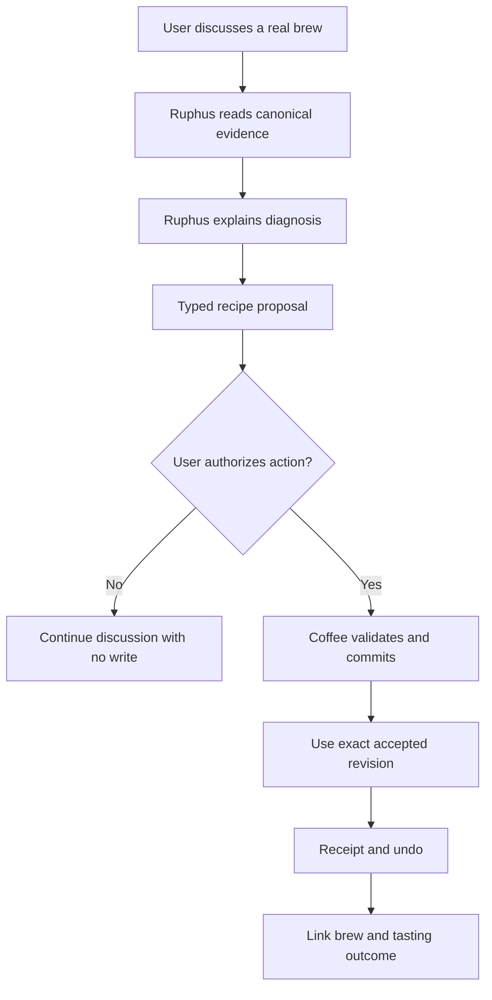

# Ruphus Agent v3

## Summary

After the separate model evaluation selects a production configuration, turn Ruphus into a provider-neutral Coffee agent that can discuss real brew evidence, propose bounded recipe changes, apply approved edits across Aiden and manual methods, and preserve receipts, provenance, and undo.

---

## Problem Frame

Ruphus currently receives a client-built context snapshot and returns prose plus marker-based artifacts. A recipe discussed in chat is not guaranteed to become the exact recipe saved, brewed, handed toward Fellow, or connected to the next tasting. The chat can appear actionable while remaining advisory underneath.

The April v2 requirements improved brewer context, recipe recall, and grinder semantics but intentionally excluded tool calling, action chips, and recipe mutation. That kept the earlier change bounded, but it prevents the product behavior now desired: a user should be able to report a bitter or burnt cup, understand Ruphus's reasoning, approve a controlled adjustment, brew the accepted revision, and continue learning from the outcome.

Public Coach Max evidence demonstrates the observable value of contextual coaching, native proposal artifacts, and explicit application. It does not establish Maxed's private model or implementation, so Coffee must use its own canonical services and safety boundaries.

The prose requirements govern if the diagram and text ever diverge.

---

## Actors

- A1. Coffee user: Discusses brews, reviews proposals, authorizes actions, brews accepted recipes, and records outcomes.
- A2. Ruphus agent: Retrieves evidence, reasons conversationally, proposes changes, calls permitted Coffee actions, and reports outcomes truthfully.
- A3. Coffee domain services: Remain authoritative for recipes, grinder conversions, analytics, permissions, entitlements, revisions, persistence, and handoff preparation.
- A4. Fellow handoff: Accepts supported Aiden profile handoffs but does not prove to Coffee that a physical brewer was updated.

---

## Key Flows

- F1. Discuss without changing
  - **Trigger:** A user asks about a coffee, recipe, statistic, or taste outcome without requesting a write.
  - **Actors:** A1, A2, A3
  - **Steps:** Ruphus retrieves the relevant canonical evidence, explains what it finds, identifies uncertainty, and continues the conversation without creating persistent state.
  - **Outcome:** The user receives grounded coaching without pressure to act.
  - **Covered by:** R2-R4

- F2. Propose and apply a recipe adjustment
  - **Trigger:** A user reports a brew result or asks for a recipe change.
  - **Actors:** A1, A2, A3
  - **Steps:** Ruphus reads the exact brew and recipe history, explains a diagnosis, creates a bounded visible difference, waits for authority, commits through Coffee, returns a receipt, and offers undo.
  - **Outcome:** The app and conversation agree on one accepted canonical recipe revision.
  - **Covered by:** R5-R10

- F3. Brew and learn
  - **Trigger:** A user chooses to brew an accepted Aiden or manual recipe.
  - **Actors:** A1, A2, A3, A4
  - **Steps:** Coffee uses the exact accepted revision, records the attempt, handles any handoff failure truthfully, and links the next tasting to the recipe and originating proposal.
  - **Outcome:** Ruphus can reason from what was actually brewed rather than an inferred or regenerated recipe.
  - **Covered by:** R9-R13

---

## Requirements

**Phase gate and model independence**

- R1. Agent v3 planning and implementation must not begin until `docs/brainstorms/2026-08-28-ruphus-model-evaluation-requirements.md` records a winning configuration or an explicit decision to retain the current model.
- R2. The selected configuration becomes the initial default, but Ruphus's product contract must remain provider-neutral enough that a later model change does not require redesigning user flows or Coffee actions.

**Conversation and evidence**

- R3. Ruphus must be able to discuss and explain a coffee, recipe, brew, tasting, or statistic without requiring or implying a write.
- R4. Ruphus must retrieve relevant canonical Coffee records rather than treating conversational memory or a complete client-built prompt snapshot as the source of truth.
- R5. Coffee's deterministic services must remain authoritative for recipe validity, grinder conversion, canonical analytics, permissions, entitlements, revisions, persistence, and external-handoff preparation.

**Proposal and commit**

- R6. Actionable recipe changes must appear as typed proposals that identify the coffee, method, source revision, current values, proposed values, unchanged controls, and rationale.
- R7. Persistent recipe changes and Fellow handoff require explicit user approval unless the current user message itself gives clear and specific authority for that exact action. Ambiguity must produce a question or proposal, not a write.
- R8. Approved changes must commit through the same canonical behavior used by the app, carry stale-state and duplicate-action protection, and return a truthful receipt with undo or revert.
- R9. A brew started from chat must use the exact accepted recipe revision. Regenerating a similar recipe is not equivalent.

**Methods, provenance, and recovery**

- R10. The initial release must support Aiden and the app's supported manual-brew methods through one shared proposal-and-approval contract with method-specific validation underneath.
- R11. Brew attempts and subsequent tastings must preserve enough provenance to connect the outcome, exact recipe revision, and originating Ruphus proposal.
- R12. Fellow receipts may confirm only Coffee-observable stages such as profile preparation or opening Fellow. Ruphus must not claim that a brewer was updated without authoritative confirmation.
- R13. Ruphus must expose actionable failure and recovery behavior for missing evidence, ambiguous targets, validation rejection, stale state, interruption, provider failure, entitlement denial, and external-handoff failure. Partial turns must not be represented as complete.
- R14. Production rollout must begin in observable shadow or dogfood mode, preserve a safe fallback, and expand only while real traces continue to satisfy the model evaluation's critical safety and recipe-integrity gates.

---

## Acceptance Examples

- AE1. **Covers R3-R5.** Given a user asks for the current recipe, when Ruphus answers, it retrieves and quotes canonical parameters rather than reconstructing them from conversation.
- AE2. **Covers R6-R9.** Given a bitter V60 brewed at 94°C, when Ruphus recommends 92°C, the proposal visibly preserves other controls; after approval, Coffee commits and brews that exact revision; undo restores the prior recipe.
- AE3. **Covers R7-R8.** Given a user says only "what would you change?", when Ruphus responds, it may create a proposal but does not persist it as the active recipe without further authority.
- AE4. **Covers R7, R13.** Given a user says "change that one" while multiple coffees match, when the target cannot be safely resolved, Ruphus asks which coffee rather than guessing.
- AE5. **Covers R8, R13.** Given the source recipe changes after proposal creation, when approval later arrives, the stale proposal is rejected or refreshed instead of overwriting newer state.
- AE6. **Covers R9-R11.** Given the user accepts a Kalita recipe, when the timer starts and a tasting is later saved, both refer to the exact accepted revision and originating proposal.
- AE7. **Covers R10-R12.** Given Coffee prepares an Aiden profile but Fellow fails to open or does not confirm machine state, when Ruphus reports the result, it describes only the confirmed Coffee-side state and offers recovery.
- AE8. **Covers R13-R14.** Given the selected provider fails mid-turn during dogfood, when the action cannot complete safely, the user receives a recoverable failure or configured safe fallback and no hidden partial mutation remains.

---

## Success Criteria

- A user can discuss a real brew, understand a grounded diagnosis, approve a visible recipe difference, and use that exact revision without chat and app state diverging.
- Aiden and manual-brew users receive the same proposal, approval, receipt, provenance, and undo guarantees.
- Ruphus never silently mutates a recipe, invents canonical evidence, accepts stale state, or overstates Fellow success.
- Subsequent tasting evidence is connected to what was actually brewed, enabling meaningful continued coaching.
- The selected model can later be replaced without redesigning the product contract.
- Planning does not need to invent approval semantics, mutation boundaries, provenance behavior, method coverage, or rollout gates.

---

## Scope Boundaries

- Agent v3 does not begin before the separate model decision gate passes.
- Ruphus does not receive arbitrary database access or permission to bypass Coffee validation, entitlement, revision, or persistence behavior.
- The initial release uses one default model configuration; complex automatic routing is deferred until production evidence supports it.
- Fellow machine-state confirmation remains outside Coffee's claims unless the integration later exposes authoritative confirmation.
- Voice conversation, proactive background coaching, community sharing, and autonomous unattended recipe changes are deferred.
- The project does not reproduce or make claims about Maxed's private implementation.

---

## Key Decisions

- Separate model decision from product implementation: the agent is built only after its operating model passes Coffee-specific evidence gates.
- Conversation remains first-class: Ruphus can coach without turning every answer into an action.
- Proposal before commit: reasoning, authority, and persistence remain visible and separable.
- Canonical services over model arithmetic: deterministic Coffee behavior remains consistent across UI and agent actions.
- Exact revision continuity: a recipe discussed, accepted, brewed, tasted, and reverted is one traceable object rather than a series of similar regenerations.
- Shared contract across methods: Aiden and manual brewing differ in validation, not in safety or user trust.
- Provider-neutral agent contract: model choice remains replaceable operational configuration.
- Historical v2 preservation: its useful context and persona work remain available, while its advisory-only and no-tool boundaries are superseded.

---

## Dependencies / Assumptions

- The separate model evaluation completes before this document enters implementation planning.
- Existing recipe generation, validation, timing, persistence, tasting, authentication, entitlement, and Fellow-handoff behavior can be reused after planning verifies their current seams.
- Coffee can represent recipe revisions, proposals, brew attempts, and tastings with stable identities and safe conflict behavior.
- The selected model supports the structured action and streaming behavior required by the final plan.

---

## Outstanding Questions

### Resolve Before Planning

- [Affects R1, R2][Model decision] Which model configuration passed `docs/brainstorms/2026-08-28-ruphus-model-evaluation-requirements.md`?

### Deferred to Planning

- [Affects R3-R5][Technical] Define the bounded context-retrieval strategy and refresh behavior for long conversations.
- [Affects R5-R10][Technical] Map existing app actions and domain services to the smallest safe Agent v3 capability set.
- [Affects R6-R9][Technical] Define proposal lifetime, stale-state protection, duplicate-action protection, receipt, and undo behavior using existing canonical seams where possible.
- [Affects R9-R11][Technical] Verify the current identity and provenance path across recipes, timers, brew attempts, and tastings for every supported method.
- [Affects R12][Technical] Verify the strongest Fellow-side state Coffee can truthfully observe.
- [Affects R13-R14][Technical] Define checkpoint, interruption recovery, shadow telemetry, and rollout thresholds.

