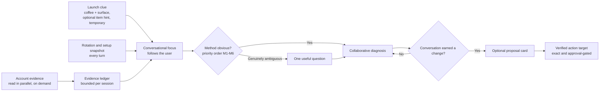

# Ruphus Conversation-First Reset

## Summary

Redefine Professor Ruphus as a warm, experienced coffee friend in a natural multi-turn mobile conversation. Ruphus retrieves the user's account evidence on its own, infers obvious context, asks at most one genuinely useful follow-up when the evidence cannot answer, accepts corrections and topic switches, and offers a recipe proposal only when the conversation has earned it. The product outcome is enforced by a measurable conversation contract whose runtime part is deliberately narrow (so enforcement cannot make Ruphus robotic), and proven by staged real-provider conversations over frozen Dev fixtures, a blind calibrated feel judge, and unscripted owner conversations on the physical Dev device. The existing safety boundaries are preserved unchanged; architecture is subordinate to the conversation.

---

## Problem Frame

The current Agent v3 experience can retrieve records and produce safe recipe artifacts, but its conversational behavior is too rigid to feel like an intelligent coffee assistant. Context supplied by the launch surface can become a cage: a chat opened from an Aiden recipe remains focused on Aiden even when the user changes coffees or refers to another jar. Normal human references such as a jar number, a near-match coffee name, or "that one" can lead to refusal or contradiction instead of a natural focus change.

The imbalance originated in `docs/brainstorms/2026-08-28-ruphus-agent-v3-requirements.md`. That document specifies proposals, approvals, provenance, receipts, external handoff, and recovery in detail, but leaves natural multi-turn conversation and entity resolution as broad aspirations. Passing endpoint, contract, and rendered-interface tests therefore did not prove that Ruphus could conduct a useful conversation against real account history.

Observed dogfood conversations exposed the resulting product failure: Ruphus anchored on the wrong method, failed to resolve an obvious coffee reference, claimed relevant history was unavailable, later used that same history without acknowledging the correction, exposed raw formatting, and spoke in defensive system language. These are failures of the product contract and acceptance standard, not isolated copy defects.

The current implementation also carries user-visible seams that no prompt change can hide: model prose is rewritten mid-stream to strip authority claims, a coffee read emits an automatic "Coffee context" card, a missing recipe emits a "No executable recipe found" card, proposals can surface as JSON in prose, the proposal card shows disabled "Available soon" actions and an "All controls" block that dumps the recipe as JSON, and failures offer "Continue in standard chat." Each of these leaks the machine into the friendship.

A reset that over-corrects carries its own risk: a contract enforced as prompt checklists, mandatory phrasing, and aggressive regeneration produces a stilted, formulaic Ruphus. This document therefore separates a narrow runtime enforcement set from the broader evaluation rules.

---

## Actors

- A1. Coffee user: Talks naturally about coffees and brews on a phone, answers useful follow-up questions, challenges Ruphus's reasoning, changes subject, and explicitly authorizes any persistent change.
- A2. Professor Ruphus: Resolves conversational references, retrieves relevant account evidence without being asked, infers obvious context, maintains a coherent working focus, diagnoses collaboratively, and proposes bounded actions only when the conversation has earned them.
- A3. Coffee app: Supplies authoritative owner-scoped records, presents Ruphus's replies as polished mobile prose, and preserves the existing validation, approval, persistence, receipt, provenance, and undo guarantees.

---

## Product Model

The launch clue, conversational focus, and action target are deliberately different concepts. The launch clue helps Ruphus begin. It carries a coffee reference and the name of the surface, and, only when the surface was visibly displaying a specific recipe, brew, or tasting, one typed item hint (M1b) that is temporary and non-authoritative. The conversational focus follows the user and is never announced by machinery. The action target becomes exact and immutable only when a concrete change is proposed or authorized.

Launch context shape: `{ coffeeRef?, surface, launchItem? }` where `launchItem` is `{ kind: 'recipe' | 'brew' | 'tasting', ref, method? }`. `method` is a method identity as defined under Method Inference Priority (a recipe slot such as Aiden, hot Kalita, or iced V60); it is required for kind `recipe` and optional for `brew` and `tasting`, and a tasting hint carries a method only when that tasting or its linked brew attempt actually records one, never one derived from the coffee's recipes or profile. There is no `slotKey` field anywhere in launch context, and a method is admissible only inside a typed `launchItem`. Direct Chat, bean-card, and unsaved tasting-wizard-reveal launches carry a coffee reference and surface only; the wizard's scores, flavors, one-word summary, and notes enter the first turn as the user's own evidence, never as a tasting reference or method.

---

## Key Flows

- F1. Open or return to Ruphus
  - **Trigger:** The user opens Chat directly or launches Ruphus from a coffee, tasting, recipe, or brewing surface.
  - **Actors:** A1, A2, A3
  - **Steps:** Ruphus treats the launch item as a coffee clue plus, when present, one temporary item hint for that coffee only; determines the age of the last conversation; and either continues it, continues it with awareness of elapsed time, or opens fresh with the prior conversation one tap away. A direct opening greets the user without calling the model: a neutral greeting until app data has loaded, then a short rotation-aware line.
  - **Outcome:** The user can begin naturally without losing history, inheriting stale assumptions, or seeing a false claim about an empty rotation.
  - **Covered by:** R1-R4, R23

- F2. Diagnose a brew through conversation
  - **Trigger:** The user describes an experience such as a Kalita 155 brew tasting weak or watered down.
  - **Actors:** A1, A2, A3
  - **Steps:** Ruphus reads the recipe, recent brews, and tastings for the coffee in parallel, responds in plain coffee language with a specific observation from the user's own numbers, asks one discriminating question only if recorded evidence cannot explain the problem, remembers the answer, and lets the user challenge or redirect the reasoning. It does not force an action card before the diagnosis is shared.
  - **Outcome:** The user reaches a credible shared diagnosis through a natural back-and-forth.
  - **Covered by:** R5, R9-R12, R19-R21

- F3. Change coffee or subject mid-conversation
  - **Trigger:** The user mentions another coffee, jar, method, tasting, or goal in the same conversation, or corrects Ruphus.
  - **Actors:** A1, A2, A3
  - **Steps:** Ruphus resolves an obvious reference through the coffee resolver (rotation snapshot first, inventory lookup when needed), names the new coffee naturally, discards any launch item hint, and continues with the relevant evidence. If two plausible matches remain and the difference changes the answer, it asks one concise question instead of guessing. A correction is acknowledged in one sentence and never re-argued.
  - **Outcome:** Conversation changes focus without starting over, silently retaining the old target, or inventing identity.
  - **Covered by:** R2, R5-R8, R19 (C8, C10)

- F4. Move from discussion to a recipe change
  - **Trigger:** The conversation produces a sufficiently grounded, concrete improvement and the user asks for or agrees to a change.
  - **Actors:** A1, A2, A3
  - **Steps:** Ruphus explains the proposed change and expected effect in prose, presents a bounded proposal card as the natural conclusion, keeps discussing it if challenged, and waits for explicit approval. Coffee applies only the verified target through its existing safety contract. Conversation continues freely after the card; a later topic change never rebinds it.
  - **Outcome:** The proposal feels earned and optional, and no persistent change occurs without authority.
  - **Covered by:** R13-R15, R19 (C9)

- F5. Continue when evidence is unavailable
  - **Trigger:** An account read times out or fails during a turn.
  - **Actors:** A2, A3
  - **Steps:** Ruphus says in plain language what it could not check, answers from what it has plus general coffee knowledge, does not claim the missing history does not exist, and retries the read on the next turn.
  - **Outcome:** An outage degrades gracefully and truthfully; it never becomes a false claim or a card.
  - **Covered by:** R20-R21

---

## Conversation Contract

Every user-visible Ruphus reply is graded against the following rules in evaluation and tests. They are measurable so deterministic graders can enforce them; the feel rubric (G1-G8) covers what cannot be measured. Word counts exclude a proposal card.

Two boundaries keep enforcement from making Ruphus robotic:

- **Runtime versus evaluation.** Only the C1 hard cap, C6a hard machine tokens, JSON or proposal-shaped prose, markup, leaked opaque references, and false authority claims are checked at runtime (see Runtime Enforcement RT1-RT5). C2 paragraph shape, C3, C4, C5, C7, C8, C9 timing, and C10 are evaluation and test rules. They shape the prompt's few hard rules and exemplars; they are never rendered into the prompt as templates, checklists, or required phrasings.
- **Prompt design.** The prompt is a persona, three short exemplar exchanges in the target voice, and only the essential hard rules (one question at most, do not ask for what the app already knows, acknowledge a correction in one sentence, name the coffee when you switch, propose only after the user agrees, no markup, no machine words). It never instructs the model to echo a token from the user's message, to phrase changes in a from/to/delta form, or to satisfy a grader.

| ID | Rule | Measure |
|----|------|---------|
| C1 Length | Replies are phone-sized. | Default reply ≤ 90 words. Diagnosis or comparison reply ≤ 140 words. Prose before a proposal card ≤ 60 words. Opening line ≤ 40 words. Any reply > 160 words is a hard cap (runtime regeneration trigger; an ordinary run failure if delivered). |
| C2 Shape | Plain sentences, scannable on one screen. | ≤ 3 paragraphs, ≤ 3 sentences per paragraph. No headings, bullets, numbered lists, bold/italic markers, code fences, tables, emoji, or raw identifiers. Enumerations live inside a sentence ("two things could do that: ..."). Markup and code fences are runtime triggers; paragraph and sentence counts are evaluation only. |
| C3 Questions | Ask only what the evidence cannot answer. | ≤ 1 question mark per reply. Never ask for data the account already holds for the coffee in focus (method, dose, grind, ratio, temperature, drawdown, tasting notes, jar contents). Exemption: a question that offers the coffee's method candidates by name under M6 conditions is not a held-data question, even though the app knows the methods. A question-only reply (no observation, recommendation, or direct answer) is allowed at most once per topic and never in two consecutive replies. The reply after the user answers a follow-up must contain a concrete recommendation or diagnosis. |
| C4 Value | Every reply moves the brew forward. | Each reply after the opening contains at least one of: a specific observation grounded in the user's data, a recommendation with a direction and magnitude, or a direct answer. Pure acknowledgments ("I can help with that", "Let me look into it") and restatements fail. |
| C5 Numbers | Numbers read like a barista, in the user's own units. | Grams as "15g", water as the recipe records it ("250g" or "250ml"), ratios as "1:16", temperature in the user's preference ("94°C" or "201°F"), time as "2:45" or "45 seconds", grind in the user's grinder terms ("Ode 4.2", "one step finer"), microns only if the user used microns. A recommended change makes its direction and size unmistakable ("one gram up, to 16g", "a step finer than 4.2"); explicit from/to/delta wording is one natural option, never a required form. No decimals beyond the grinder's precision. No hashes, IDs, or revision numbers. |
| C6a Hard machine tokens | The machine never shows (runtime). | Never in delivered text: opaque reference keys, hashes, database or document IDs, JSON braces or `"key":` structures, code fences, tool names (`resolve_coffee`, `read_coffee_evidence`, `read_recipe`, `propose_recipe_change`), internal field names (`coffeeId`, `coffeeGrams`, `waterGrams`, `waterTemp`, `grindSize`, `slotKey`, `revisionId`, `sourceHash`, `recipeHash`), internal slot keys, "as an AI", "language model". Checked at runtime and in evaluation. |
| C6b Context-sensitive phrases | The machine never shows (evaluation). | Flagged in user-visible text unless used in a natural coffee sense: canonical, executable, owner, slot, revision, data gap, resolver, tool, artifact, context, session, record, database, query, ID, JSON, payload, schema, fetch, snapshot, ledger, agent, system, "standard chat", "your account data", "I don't have access". The grader carries a versioned allowlist of natural collocations ("recorded brew", "you recorded", "tasting session", "brewing session", "your grinder and kettle") and flags only uses outside it. Refer to coffees, jars, methods, and recipes as the user would. No third-person self-reference. Evaluation only; never a runtime trigger. |
| C7 Tone | Warm, direct, opinionated, curious. | Second person. States a preference when asked to compare ("I'd go finer before adding dose"). ≤ 1 exclamation per reply. No apology unless Ruphus was wrong, and then once. No praise of the question, no disclaimers, no repeated greetings mid-conversation. Whether Ruphus engages with the specifics of the user's latest message is judged under G5, not counted by a token-echo grader. |
| C8 Correction repair | Corrections land in one beat. | When the user corrects a name, coffee, method, or fact, or when new evidence contradicts an earlier statement, the very next reply acknowledges the change in ≤ 1 sentence, does not repeat the earlier wrong claim, continues from the corrected state, and apologizes at most once. Silent use of the new fact is a catastrophic failure (CF3); re-arguing the old fact or a second apology is an ordinary failure. |
| C9 Proposal timing | A card is a conclusion, not an opener. | A proposal card may appear only after at least one substantive diagnosis reply on the topic, and only after the user asked for a change or agreed with the diagnosis. Never in the first reply on a topic, never while Ruphus's own follow-up is unanswered, never more than one open proposal per topic, never as JSON or text. |
| C10 Focus acknowledgment | Focus changes are spoken, not displayed. | When focus moves to a different coffee, the next reply names that coffee naturally at least once. The grader checks that the name is present after a switch; it never counts for exactly one mention. No narration of internal state, no persistent header, no card. |

---

## Runtime Enforcement

The runtime post-check is narrow by design so that enforcement never produces stilted prose.

- RT1. **Buffer, then check.** Provider text is buffered server-side until the post-check passes. Rejected text is never emitted as `text_delta`; the client shows the lifecycle caption meanwhile and may reveal the checked text progressively as presentation. No in-stream prose mutation, sentence rewriting, or token substitution exists anywhere.
- RT2. **Regeneration triggers only.** One regeneration with a short corrective instruction is triggered only by: (a) a reply over 160 words; (b) markup or a code fence; (c) JSON or proposal-shaped prose; (d) a leaked opaque reference key, hash, or ID; (e) any other C6a hard machine token; (f) a false authority claim (stating a change was made, saved, or sent when no approved action exists). Nothing else is checked at runtime.
- RT3. **Second failure.** If the regenerated reply fails on length or markup, it is delivered as is (the client's defensive Markdown stripping remains a fallback) and the failure is recorded. If it fails on a leak, JSON or proposal-shaped prose, or false authority, it is replaced by one short product-written line in Ruphus's voice with no machine words (for example, "I lost my train of thought there. Ask me that again and I'll keep it short.") and the failure is recorded.
- RT4. **Latency accounting.** The lifecycle caption must be visible within 1 second of send; the checked reply must be visible within 8 seconds p50 and 15 seconds p90 including any regeneration. Because text is buffered, there is no first-token metric.
- RT5. **Recorded honestly.** Every regeneration and replacement is written to the server-side turn trace and counts as an ordinary run failure in evaluation, so the gate measures first-pass quality, never the post-check's ability to hide it.

---

## Method Inference Priority

Ruphus determines the brew method for a coffee in this order and stops at the first tier that yields one answer. A method identity is a recipe slot: Aiden, V60 hot, V60 iced, Kalita hot, or Kalita iced. The snapshot's recipe list, M6 candidates, the method resolver, `read_recipe`, the fixtures, a `launchItem` method, and the proposal target all use this slot identity; the resolver returns the slot plus a display name, and user-visible language says "iced V60" or "your hot Kalita recipe," never an internal slot key. Mode resolves inside the same tiers: an explicit user mode wins; otherwise M2-M5 may infer iced from the recent or only saved evidence (a sole or most recent iced recipe or brew yields the iced slot); hot is only the final fallback when mode remains unspecified and the evidence does not distinguish it, and it never overrides a sole or recent iced recipe. The launch surface name is not a tier; a surface can influence method only through a typed `launchItem` (M1b).

- M1. The user's explicit statement in the current topic ("the Kalita 155 recipe", "on the Aiden").
- M1b. A typed launch item the surface was visibly displaying (a specific recipe, brew, or tasting), when the item carries a method, for the launch coffee only. A tasting item without a recorded method contributes the tasting as evidence but no method, and inference continues at M2; a method is never derived for it from the coffee's recipes or profile. The hint is stated once in passing so it can be corrected, discarded immediately on any coffee change or method correction, never transferred to another coffee, and never write authority.
- M2. A recorded brew, attempt, or tasting for the coffee in focus within the last 14 days that names a method. If every such record names the same method, that method. If the records name two or more methods, M2 yields no answer and inference continues: M4 for a general question, M6 for a change request or method-dependent recommendation.
- M3. The coffee's only saved recipe.
- M4. For a general question that is not a change request, the coffee's most recently brewed or edited saved recipe.
- M5. The user's default method from the setup line of the rotation snapshot (E1) when the coffee has no saved recipe and no recorded brew.
- M6. Ask, in one sentence, only when the request is a change request or a method-dependent recommendation and two or more of the coffee's recipe slots were each used within the 14-day window, or the coffee has no recipe, no brew, and no default method. When Ruphus asks, it offers the candidates by display name ("the hot V60 or the iced one").

A method inferred at M1b-M5 is stated once in passing ("on your Kalita recipe", "on the iced V60") so the user can correct it.

---

## Evidence Model

- E1. **Rotation and setup snapshot.** Every turn carries a compact snapshot: one setup line with the user's default method, grinder, and units; jars 1-3 with coffee name, roaster, origin and process, days off roast, saved recipe slots in display language (Aiden, hot or iced V60, hot or iced Kalita), and last brew date; sealed and recently finished counts. Bounded to 12 lines and about 600 characters. Each coffee carries an opaque short reference key for tool calls so the model never needs to speak a database ID. There is no separate profile-setup read; the setup line is the only profile data the model sees, drawn from the existing allowlist that excludes contact, subscription, consent, token, and integration fields.
- E2. **Domain-language tool results.** Reads return short barista-language summaries with bounded structured fields ("Kalita 155: 15g to 250g (1:16.7), Ode 4.2, 94°C, 2:50 total, last brewed 3 days ago. Last tasting: thin and a little sour, 3 stars."), never raw record-shaped JSON with internal keys. An empty or windowed result states its scope in domain language ("no tastings in the last two weeks"), never a bare "none."
- E3. **Evidence ledger.** Each conversation keeps a bounded ledger (at most 8 entries, about 4 KB) of what was read, when, the window it covered, and its summary, replayed into later turns so Ruphus does not re-read, forget, or contradict evidence. Oldest entries evict first. A new chat clears it. A stale resumption rebuilds it because the data may have changed. Pronouns ("that one", "the first one") resolve against the coffees named in the ledger.
- E4. **Parallel independent reads.** When a turn needs recipe, recent brews, and tastings for one coffee, they are read concurrently in one round. The default history read covers the last 14 days (the same window as M2); Ruphus widens it when the user asks for or refers to older history, or when a correction implies it. The first turn's composite read includes a launch item by its ref regardless of the window. Per-turn budget: at most 6 reads and 2 tool rounds before Ruphus answers.
- E5. **Unavailable-data degradation and scoped absence.** A failed or timed-out read is recorded in the ledger as unavailable, not as empty. Ruphus says what it could not check in plain language, answers from what it has, and retries next turn. "Couldn't check" is never rendered as "doesn't exist," and never as a card. When only a bounded window was read, Ruphus never makes an unqualified absence claim; it names the window it checked ("nothing in the last two weeks"). An unqualified absence claim about a recipe, brew, or tasting that the fixture data holds is an ordinary evidence-scope failure in evaluation.
- E6. **Coffee resolution.** Reference resolution is a model-called `resolve_coffee({ reference })` capability over the reference language the model extracts from the user's turn ("jar 1", "El Virgil", "the Colombian one", "the first one"). Inside it, deterministic matching handles exact references, unique jar ordinals, normalized name, roaster, and origin tokens, bounded close spelling, and pronouns from named ledger coffees, reusing the existing inventory listing when the snapshot is insufficient. There is no regex pre-parser over raw user turns, and no second overlapping search tool.

---

## Session Age Behavior

Thresholds are configurable and clock-injected. Initial defaults follow; final tuning is deferred to focused UX dogfood.

- S1. **Fresh (under 6 hours):** the thread resumes silently.
- S2. **Recent (6 hours to 7 days):** the thread resumes visibly; Ruphus's next reply may reference elapsed time naturally ("Back to the El Vergel?") and does not assume the old topic is still the question.
- S3. **Stale (over 7 days):** Chat opens fresh with the direct opening (R23); the prior conversation is collapsed behind one "Continue previous conversation" affordance showing its date and first line; the ledger is discarded and rebuilt on resumption.
- S4. **New chat boundary.** Starting a new chat creates a conversation boundary and clears the ledger. It never deletes messages: in the existing single active document the messages before the boundary remain stored and reachable behind the same Continue affordance; when durable per-conversation storage exists, the prior conversation is its own document. One Continue affordance is the whole disclosure surface for this reset; recent-conversation lists, search, and rename are deferred.

---

## Requirements

**Conversation and sessions**

- R1. Ruphus must provide one coherent conversational surface across coffees, recipes, brew methods, tastings, inventory, equipment, and brewing goals.
- R2. A launch surface may supply at most a coffee reference, the surface name, and, only when the surface was visibly displaying a specific recipe, brew, or tasting, one typed `launchItem` hint (M1b) whose method is required for a recipe and optional for a brew or tasting; a tasting hint carries a method only when the tasting or its linked brew attempt records one, never one derived from the coffee's recipes or profile. Direct Chat, bean-card, and unsaved tasting-wizard-reveal launches carry a coffee reference and surface only. No launch context may carry a `slotKey` field or a bare method; a method is admissible only inside a typed `launchItem`, and no read may default a method or slot from launch context. The hint is stated once, discarded on any coffee change or method correction, never transferred to another coffee, and never write authority. Ruphus must change conversational focus when the user clearly changes subject, and focus machinery must stay invisible: no focus card, no persistent context header, no narration of internal state.
- R3. Ruphus must preserve conversation history while creating a natural session boundary by age per S1-S3. A stale exchange must not reopen as though it is still active, and the prior conversation must remain available to continue.
- R4. Starting a new chat must create a boundary and clear chat-level assumptions and the evidence ledger (S4) without deleting any message and without removing Ruphus's ability to retrieve the user's authoritative Coffee data. The prior exchange remains behind the Continue affordance.

**Retrieval, reference resolution, and truthfulness**

- R5. Ruphus must automatically retrieve the owner-scoped Coffee evidence needed to answer the current question, per E1-E4, rather than expecting the user to select or restate information already in the app. A coffee read must never generate an unsolicited card.
- R6. Ruphus must resolve obvious human references through E6, including jar ordinals, close coffee-name matches, roaster or origin references, and recent conversational pronouns, then name the resolved coffee naturally (C10).
- R7. When more than one plausible match remains and the distinction materially affects the answer, Ruphus must ask one concise clarification that offers the candidates by name instead of guessing or refusing broadly.
- R8. When new evidence or a user correction changes Ruphus's earlier understanding, Ruphus must repair per C8. It must not silently contradict an earlier claim, invent missing history, or continue from a disproven assumption.

**Natural diagnosis**

- R9. Ruphus must determine method by the priority order M1-M6 (including M1b) over recipe-slot identities (Aiden, V60 hot, V60 iced, Kalita hot, Kalita iced), applying the mode rule: an explicit user mode wins, M2-M5 may infer iced from the recent or only saved evidence, and hot is only the final fallback and never overrides a sole or recent iced recipe. It must not ask for a method when one recent or only saved method is the obvious assumption, and must ask only for genuine ambiguity on a method-dependent request.
- R10. Ruphus must use recorded evidence before asking. When recorded drawdown, dose, grind, ratio, or tasting notes already explain the problem, it must diagnose without a follow-up. Otherwise it asks at most one discriminating question per reply, never two question-only replies in a row, and must give a concrete recommendation in the reply after the user answers (C3-C4).
- R11. Ruphus must support multi-turn reasoning in which the user can answer, disagree, compare alternatives, change coffees, ask "what if," or return to an earlier coffee without losing the established conversation.
- R12. Ruphus must speak like an experienced coffee friend per C1, C2, C5, C6, and C7: warm, concise, curious, appropriately opinionated, and technical only when the detail helps the user decide or learn.

**Proposals and authority**

- R13. Ruphus may present a recipe proposal only when the conversation has earned it per C9. The proposal is optional and conversational, rendered only as the native card, never as JSON or prose, and never required as proof that Ruphus worked. Conversation continues before and after it. The card shows only the changed values in the user's units; it never exposes a raw recipe dump. In read-only Dev dogfood the card shows the suggested change with no disabled or placeholder actions.
- R14. A persistent recipe change must require explicit user approval and must identify an exact verified coffee, recipe slot (method and mode), and source recipe. Conversational focus and launch hints are never sufficient authority for a write. Nothing applies without explicit user action.
- R15. The reset must preserve the existing owner scope, validation, stale-state protection, idempotency, receipt, provenance, undo, account-deletion coverage, and truthful external-handoff boundaries from Agent v3.

**Product-quality gate**

- R16. Conversation quality must be proven by the real-provider evaluation gate defined below: staged full conversations over frozen Dev fixtures, deterministic graders with catastrophic and ordinary failure classes, a blind calibrated LLM feel judge, explicit thresholds, latency budgets, and separately reported evidence categories. Scripted or injected-provider tests prove plumbing only and cannot satisfy this requirement.
- R17. The fixture set is exactly fourteen conversations: eleven critical (AE1-AE10 and AE14) and three supporting (AE11-AE13). The critical set is: Aiden launch then jar #1 (AE1); typo correction with two Colombian coffees (AE2); method inference, infer branch (AE3); method inference, ask branch (AE4); watery Kalita diagnosis, debate, and proposal (AE5); scoped no-tastings claim, then an older tasting (AE6); two-week stale session (AE7); evidence-reader outage (AE8); proposal timing with a post-proposal topic change (AE9); pronouns and topic return (AE10); recipe launch hint versus latest recorded brew (AE14). Failures found in owner conversations (R29) are appended as AE15 onward.
- R18. User-visible responses must satisfy C2 and C6: polished app content with no exposed formatting syntax, internal terminology, database-oriented refusals, unexplained contradictions, or unsupported claims about available evidence.

**Conversation contract and evidence**

- R19. Every user-visible reply is graded against the Conversation Contract C1-C10 in evaluation. Runtime enforcement is limited to RT1-RT5, and the prompt is persona plus three exemplars plus essential hard rules; graders, checklists, and reply templates never enter the prompt. Catastrophic failures (CF1-CF6) fail an entire gate run; all other contract violations are ordinary run failures.
- R20. Evidence outages must degrade per E5; an outage may never be rendered as absence, a contradiction, or a card.
- R21. The evidence ledger (E3) must be bounded, replayed into subsequent turns, cleared on new chat, and rebuilt on stale resumption.

**Failure seams**

- R22. The seven user-visible seams in the table below must be removed or replaced as specified: mid-stream prose mutation for authority claims, the "No executable recipe found" card, automatic coffee-context cards, JSON proposal disclosures in prose, disabled "Available soon" actions, the proposal card's "All controls" JSON dump, and "Continue in standard chat" recovery language.

**Opening, photos, and captions**

- R23. A direct Chat opening with no fresh session must be assembled deterministically without a provider call, in three states: while app data is not yet loaded, a neutral greeting (≤ 40 words) that makes no claim about the rotation; once loaded with coffees in rotation, a short rotation-aware line (≤ 40 words) whose wording varies by meaningful state (jar count, days off roast, last brew recency), not by random rotation; once loaded with an empty rotation, a generic line that invites the user to add a coffee. The app must never flash or assert an empty rotation before data is loaded. The opening is recomputed on each fresh open or new chat and is not persisted until the user sends a message. Existing tappable starter prompts remain.
- R24. A photo sent in Chat continues through the existing image-description path; the description enters the ledger as the user's evidence, Ruphus comments only on what the description supports, image bytes never reach the agent provider, and the existing bean-scan card flow is unchanged. Expanded photo understanding stays deferred.
- R25. While Ruphus works, the existing thinking indicator shows in-character captions from a fixed map keyed by read category ("Checking your recent brews", "Looking at the El Vergel recipe"), never tool names or internal words, visible within 1 second of send and rotating no faster than every 2 seconds. An interrupted turn shows "Professor Ruphus got cut off" with one "Try again" action.

**Evaluation hygiene**

- R26. Evaluation fixtures must be a frozen, manifest-hashed Dev fixture account (coffees, jars, recipes, tastings, attempts, profile) seeded into a dedicated Dev UID with dates rewritten relative to run time, containing no contact, subscription, consent, token, or integration fields. Production data is never used.
- R27. Evaluation must inject provider keys and Dev authentication non-printingly, never echo or persist them, store transcripts redacted of identifiers, and persist raw provider prompts only as redacted diagnostics under the authorized 30-day Dev policy. That retention applies to diagnostic traces only; user-visible conversation history is product data and is never expired by it.
- R28. Each critical fixture must have a gold transcript expressing the target feel and a known-bad transcript expressing an observed failure shape. Both are human and calibration references only: they are never shown to the scoring judge and never used for exact-prose matching. Supporting fixtures need neither.
- R29. Before Dev-dogfood-ready is declared, the product owner must hold at least five unscripted conversations with Ruphus in the installed Dev app on a physical device, across at least three launch surfaces (direct Chat, bean card, Kalita/V60 recipe, Aiden recipe, tasting card, tasting wizard reveal) including at least one tasting surface, against Dev data only (the seeded fixture account or the owner's own Dev account), read and proposal only. Each conversation is logged with its surface, date, every failure observed, and the owner's verdict: good, acceptable, or bad. Every failure observed becomes a new fixture (AE15 onward, with a manifest version bump). Product PASS requires zero bad verdicts and every appended fixture run at full cadence (5 runs critical, 3 supporting) and passed on the final code; a bad verdict or any unpassed appended fixture returns the work to a smoke regardless of whether the failure is catastrophic or ordinary. This is recorded as its own evidence category and is never inferred from scripted click-throughs.

---

## Failure Seams Removed

| Current seam | Replacement | Requirement |
|--------------|-------------|-------------|
| Orchestrator rewrites model prose mid-stream to strip authority claims, producing mangled sentences. | No prose mutation. Provider text is buffered until the narrow runtime post-check passes (RT1-RT3); rejected text is never emitted. Only the RT2 triggers cause one regeneration; a second failure delivers an overlength or marked-up reply as is, or replaces a leak, JSON, or false-authority reply with one short in-character line. Every regeneration is recorded as an ordinary run failure. | R19, R22 |
| Missing recipe emits a "No executable recipe found" card with "Choose a brew method." | Ruphus says in prose which recipes the coffee has, or that it has none, and proceeds by M1-M6. No card. | R9, R22 |
| A coffee read emits an automatic "Coffee context" card and the client derives focus from it. | Coffee reads return evidence only. Focus is derived server-side from successful reads, recorded in the server-side turn trace only (no streamed frame), and spoken naturally per C10. No card, no header. | R2, R5, R22 |
| Proposals can appear as JSON or structured text inside prose. | Proposals exist only through the proposal tool and render only as the native card. Any JSON or proposal-shaped text in prose is a runtime trigger and a catastrophic evaluation failure (CF6). | R13, R22 |
| The proposal card (`src/components/chat/artifacts/RecipeProposalCard.jsx:3`) labels its actions "Available soon" when actions are unavailable. | The labels and their disabled buttons are deleted. Cards show only actions that work in the current mode; in read-only Dev dogfood a proposal card shows the suggested change with no action buttons at all. | R13, R22 |
| The same card (`src/components/chat/artifacts/RecipeProposalCard.jsx:3`) renders an "All controls" `
` whose `<pre>` dumps the after-recipe as JSON (`JSON.stringify(after, null, 2)`). | The block is deleted, not hidden or collapsed. The card shows only the changed values as from → to rows in the user's units. The rendered card contains no `<pre>` element and no internal key names (`coffeeGrams`, `waterTemp`, `celsius`, `grindSize`, `setting`, `ratio` as keys). | R13, R18, R22 |
| Failure UI says "Continue in standard chat" (`src/tabs/ChatTab.jsx:1321-1322`). | In-character retry: "Professor Ruphus lost the thread. Try again." Signed-in Agent users never see a mode switch; only demo mode uses the legacy route. | R22, R25 |

---

## Acceptance Fixtures

Each fixture is a full multi-turn conversation over the frozen Dev fixture account (R26). The set is exactly fourteen: eleven critical (AE1-AE10, AE14) and three supporting (AE11-AE13). Critical fixtures gate release; supporting fixtures must pass deterministic graders. Fixtures grade invariants, not prose. Method references in fixtures are recipe slots; where a fixture says Kalita or V60 without a mode, the fixture account holds the hot slot for that coffee, and any candidates are offered by display name. For AE7 and AE12 the runner grades every conversational turn live at the backend checkpoint; their opening, hydration, boundary, and Continue assertions are rendered-browser-harness evidence required only for the post-surface checkpoint and Product PASS.

- AE1 (critical). **Aiden launch, then jar #1.** Covers R2, R5-R6, M1b, C10. Given Chat launches from the Aiden recipe of the coffee in jar #3 (`launchItem` kind recipe, method Aiden), when the user says "Use the bean in jar #1 instead," Ruphus names the jar #1 coffee naturally, discards the Aiden hint rather than carrying it to the new coffee, continues with jar #1's evidence, and neither Aiden nor jar #3 remains an unstated assumption. When the user then says "what should I change," method follows M1-M6 for the jar #1 coffee, not Aiden.
- AE2 (critical). **Typo correction with two Colombian coffees.** Covers R6-R8, E6, C8. Given the account holds "El Vergel" and a second Colombian coffee, when the user says "El Virgil," Ruphus resolves El Vergel by close name match (origin alone does not create ambiguity), names it, and continues. When the user later says "the Colombian one," Ruphus asks one question naming both coffees. When the user answers, the next reply gives a concrete recommendation.
- AE3 (critical). **Method inference, infer branch.** Covers R9 (M2-M3). Given the coffee in focus has one saved recipe or one recent recorded brew, when the user asks "what should I change for this coffee," Ruphus states the method once in passing and recommends without asking.
- AE4 (critical). **Method inference, ask branch.** Covers R9 (M6), R10, C3 exemption. Given the coffee in focus was brewed on both Kalita and V60 within 14 days, when the user asks for a change, Ruphus asks once, naming both; after the answer the next reply contains the recommendation, and no proposal appears before that.
- AE5 (critical). **Watery Kalita: diagnosis, debate, proposal.** Covers R5, R9-R13, C1-C5, C9. Branch A: given a recorded Kalita 155 attempt with drawdown, dose, and grind that explain a thin cup, when the user says "I did the Kalita 155 recipe but it didn't have much flavor and felt watered down," Ruphus cites the user's own numbers and diagnoses without a follow-up. Branch B: given no recorded attempt, Ruphus reads the recipe, explains the leading possibilities briefly, and asks one discriminating question (thin and clean versus sour and hollow). In both branches, when the user asks whether more dose beats a finer grind, Ruphus compares them with a stated preference; a proposal card appears only after the user agrees or asks for the change, preceded by ≤ 60 words of prose, and changes nothing.
- AE6 (critical). **Scoped no-tastings claim, then an older tasting.** Covers R8, R20-R21, E4-E5, C8. Given the coffee's only tasting is older than the default 14-day read window, when Ruphus says it found no tastings in the last two weeks and the user replies "I did taste it, three weeks ago," Ruphus widens the read, acknowledges the correction in one sentence, uses the tasting, and never repeats the earlier claim. An unqualified "no tastings" claim before the widened read is an ordinary evidence-scope failure; using the tasting afterward without acknowledgment is CF3.
- AE7 (critical). **Two-week stale session.** Covers R3-R4, R23, S3-S4. Given the last conversation ended 14 days ago, when the user reopens Chat, the app shows the direct opening with the prior conversation behind one continue affordance; Ruphus does not act as though the old troubleshooting is ongoing; continuing the prior conversation rebuilds the ledger before answering; starting a new chat instead leaves the prior exchange intact behind the same affordance. The runner grades the conversational turns (the resumed reply and the reply after Continue with a rebuilt ledger); the opening, Continue affordance, and new-chat assertions run in the rendered harness.
- AE8 (critical). **Evidence-reader outage.** Covers R20-R21, E5. Given the tastings read times out on the first turn, Ruphus says it couldn't check recent brews, answers from the recipe and general knowledge, shows no card, and does not claim no tastings exist; on the next turn the read succeeds and Ruphus folds the tasting in without contradiction.
- AE9 (critical). **Proposal timing and post-proposal topic change.** Covers R11, R13-R14, C9. Given a diagnosis the user agrees with, Ruphus presents one proposal card; when the user then asks about a different coffee, Ruphus switches focus, the card stays bound to its original coffee and recipe, no second proposal appears unasked, and nothing is applied.
- AE10 (critical). **Pronouns and topic return.** Covers R6, R11, E6, C8, C10. Given the conversation moved from coffee A to coffee B, "that one" resolves to B; "back to the first one" returns to A with A's evidence from the ledger; Ruphus names the coffee naturally on each switch.
- AE11 (supporting). **No plausible match.** Covers R7, R18. Given no record plausibly matches the reference, Ruphus says what it looked for in coffee language and asks for the smallest useful detail, without any C6 vocabulary.
- AE12 (supporting). **Direct-chat opening and delayed hydration.** Covers R23. Branch A: given Chat opens with app data already loaded, no launch clue, and no fresh session, the opening line names the current rotation naturally, arrives without a provider call, and starter prompts work. Branch B: given app data arrives after Chat has opened, the neutral greeting shows first with no claim about the rotation; when data loads, the rotation-aware line replaces it; at no point does an empty-rotation statement appear; nothing is persisted until the user sends; a new chat recomputes the opening. The runner grades the starter-prompt turn as a conversational turn; the opening and hydration assertions run in the rendered harness.
- AE13 (supporting). **Photo in chat.** Covers R24. Given the user sends a photo of a brew, its description enters the ledger and Ruphus comments only on what the description supports.
- AE14 (critical). **Recipe launch hint versus latest recorded brew.** Covers R2, R8, R9 (M1, M1b), C8, C10. Given Chat launches from the coffee's Kalita recipe screen (`launchItem` kind recipe, method Kalita) while the coffee's most recent recorded brew, within 14 days, was on the V60, when the user says "this tasted flat," Ruphus talks about the Kalita recipe, mentions it once in passing so it can be corrected, and does not silently substitute the V60 brew. When the user says "actually I brewed it on the V60 this morning," Ruphus acknowledges in one sentence, drops the Kalita hint, reads the V60 brew and recipe, and diagnoses from that evidence; the Kalita hint does not reappear in later turns, no card appears, and nothing is applied. Both replies read as ordinary conversation, not as a mode switch.

Failures observed in owner conversations (R29) are appended as AE15 onward with a manifest version bump; a catastrophic-class failure joins the critical set, any other joins the supporting set. Every appended fixture must be run at its set's full cadence (5 runs critical, 3 supporting) and pass on the final code before Product PASS; an unpassed appended fixture returns the work to a smoke regardless of its class.

---

## Gold-Standard Feel Rubric

The LLM judge scores each full transcript 1-5 per dimension, with a one-line rationale. The judge is blind: it sees only the user-visible transcript, a one-line statement of the fixture's intent, and the fixture fact sheet (the coffees, jars, recipe numbers, recorded brews, and tastings in the fixture account, generated from the manifest). It never sees the gold transcript, the known-bad transcript, the tool trace, or the grader output.

- G1. Friend, not form: reads like a knowledgeable friend texting, not a report or a form.
- G2. Knows my coffee: uses the user's actual coffees, recipes, and history correctly and unprompted where relevant, as checked against the fact sheet.
- G3. Earns its questions: asks only what it cannot know; never asks what the app already knows.
- G4. Moves the brew forward: every reply leaves the user with something more actionable or clearer.
- G5. Listens: engages with the specifics of what the user just said; takes corrections and topic switches in stride; keeps pronouns straight.
- G6. Sized for a phone: short paragraphs, readable without scrolling back.
- G7. Confident, not bossy: has opinions, explains briefly, accepts pushback.
- G8. Proposal feels earned: the card arrives as a natural conclusion, optional, never a demand or a proof of work.

**Judge calibration (before any scoring counts).** For each gate run the judge first scores, blind and in randomized order, the eleven gold transcripts and the eleven known-bad transcripts (R28). Every gold transcript must score ≥ 4.5 mean across G1-G8 and every known-bad transcript ≤ 2.5 mean. If calibration fails, the judge prompt version is fixed and recalibrated; no candidate scores from an uncalibrated judge are accepted.

**Pairwise check.** For every critical-fixture run, the judge also compares the candidate transcript against the fixture's known-bad transcript, blind and in randomized order, and states which is the better coffee-friend conversation. The candidate must win; a tie or loss is an ordinary run failure.

---

## Real-Provider Evaluation Gate

- **What runs.** Every fixture in AE1-AE14 is run as a complete conversation through the real Agent endpoint, real provider, and real Dev Firestore reads against the seeded fixture account (R26), at the stage cadence below. User turns are scripted with branch-aware answers (for example, "if Ruphus asked which method, answer 'the Kalita'"). Launch fixtures (AE1, AE14) pass the launch context exactly as the app would. For AE7 and AE12 the runner grades the conversational turns, with session age and the direct surface injected exactly as the app would send them; their opening, hydration, boundary, and Continue assertions are rendered-browser-harness evidence (category 3) that counts toward the post-surface checkpoint and Product PASS, never toward the backend conversation checkpoint.
- **Deterministic graders** (pure, shared with tests): C1-C10 checks, C6a tokens and C6b phrases with the allowlist, raw markup or JSON, correct focus (from the tool trace and the coffee named), evidence-before-claim (a read precedes any claim about history), evidence-scope (an absence claim about a recipe, brew, or tasting is qualified by the window actually read; an unqualified absence claim where the fixture data holds the item is ordinary), method tier and slot applied, consecutive question-only replies, proposal timing, zero mutation dispatch, regeneration occurred, latency.
- **Catastrophic failures** (zero tolerance; any single occurrence in any run fails the entire gate run and blocks every downstream declaration until fixed and re-run): CF1 wrong coffee after a reference the fixture marks unambiguous (a unique jar ordinal, the sole close-name match, an explicitly named coffee); CF2 fabricated evidence (a recipe, brew, or tasting fact absent from the fixture data and the tool trace); CF3 silent reversal (using evidence that contradicts an earlier Ruphus claim without the C8 acknowledgment); CF4 any mutation or command dispatch; CF5 a leaked secret, opaque reference key, database ID, or hash in user-visible text; CF6 a proposal rendered as text or JSON in prose.
- **Ordinary run failures** (fail that run only and count against thresholds): any C1 cap, C2 shape or markup, a C3 held-data question or consecutive question-only replies, a C4 no-value reply, C5 unit defects, a C6b phrase outside the allowlist, C7 tone counts, non-silent C8 defects, a C9 premature or duplicate proposal, a missing coffee name after a switch (C10), an unqualified absence claim about a recipe, brew, or tasting that the fixture data holds (evidence-scope), a wrong method tier or slot (including mode) where it was inferable, any regeneration or replacement having occurred (RT5), a latency budget miss, any turn over 25 seconds, or a pairwise judge loss.
- **Pass semantics.** A run is *clean* when it has no catastrophic and no ordinary failure. A smoke is *clean* when it has zero catastrophic failures and at most one of its 11 runs has an ordinary failure; two consecutive clean smokes on unchanged code (same commit) unlock a full gate. A critical fixture passes when ≥ 4 of its 5 runs are clean and ≥ 4 of 5 runs have judge mean ≥ 4.0 with no dimension below 3 and a pairwise win. A supporting fixture passes when ≥ 2 of its 3 runs are clean (judged for information, not gating). A full gate run passes only when there are zero catastrophic failures across all 64 runs, every critical and supporting fixture passes, and ≥ 90% of all runs are clean (at least 58 of 64). Run counts are stated for the fourteen-fixture set; fixtures appended under R29 extend them by the same 5-per-critical, 3-per-supporting formula. Thresholds may be raised freely; lowering any threshold requires a recorded decision and is never silent.
- **Staged cadence.**
  - *Smoke:* one run of each critical fixture (11 conversations), deterministic graders only, no judge. Runs after any change that touches conversation behavior. A catastrophic failure stops work on that change; ordinary failures are triaged. A smoke is clean with zero catastrophic failures and at most one of its 11 runs carrying an ordinary failure.
  - *Calibration:* the first live run after the vertical slice lands: 3 runs per critical and 1 per supporting fixture (36 conversations), judge calibrated first. It establishes whether graders, budgets, and the judge behave and records any recalibration decision. It never counts as PASS, regardless of its numbers.
  - *Full gate:* 5 runs per critical and 3 per supporting fixture (64 conversations) with judge scoring and pairwise checks. It runs only after two consecutive clean smokes on unchanged code (same commit). It establishes the backend conversation checkpoint and, later, the post-surface checkpoint.
  - *Targeted rerun:* after a UI or session unit lands, the fixtures whose surfaces changed run at full cadence (5 or 3 runs) plus one smoke across all critical fixtures. A targeted rerun never substitutes for the final full gate.
  - *Final full gate:* exactly one full gate on the final code before Product PASS is declared, covering every fixture appended under R29 by then. Any code change afterward restarts the cycle at a smoke. A fixture appended after that gate must be run at full cadence on the same final commit and pass before Product PASS; if fixing it changes code, the cycle restarts at a smoke.
- **LLM feel judge:** a different model family from the agent's provider, frozen versioned judge prompt, blind inputs per the rubric section, calibrated against gold and known-bad transcripts before every scoring pass, pairwise candidate versus known-bad.
- **Latency budgets** (measured from send): lifecycle caption visible ≤ 1s; checked reply visible ≤ 8s p50 and ≤ 15s p90 including any regeneration, for turns within the E4 read budget; each parallel read round ≤ 1.5s p90. There is no first-token metric because text is buffered until checked (RT1).
- **Secrets and retention:** provider keys and Dev auth injected non-printingly; transcripts stored redacted of UIDs, emails, and tokens; raw prompts kept only as redacted diagnostics for 30 days under the authorized Dev policy; a per-run cost cap stops the run.
- **Evidence categories, reported separately and never inferred from one another:** (1) source and deterministic tests; (2) live-provider conversation gate; (3) rendered browser harness; (4) simulator; (5) physical Dev device, scripted click-through of the critical fixtures; (6) owner unscripted conversations on the physical Dev device (R29); (7) preview deployment identity; (8) production, which stays untouched.
- **Completion semantics.** *Backend conversation checkpoint:* the first full gate PASS on the vertical slice through the runner, before the Chat surface work lands; AE7 and AE12 count by their conversational turns only, and their rendered-harness assertions are not part of it. It proves the backend conversation and nothing about the product. *Product PASS (equals Dev-dogfood-ready):* the final full gate PASS on the final code after the Chat surface unit, plus the AE7 and AE12 rendered-harness assertions from the post-surface checkpoint, plus proven environment identity, plus the scripted physical-device pass on the critical fixtures, plus R29 owner unscripted conversations logged with zero bad verdicts and every fixture appended from them (AE15 onward) run at full cadence and passed on the final code. A bad verdict or an unpassed appended fixture returns the work to a smoke regardless of catastrophic classification. Durable multi-session storage is not required for Product PASS.

---

## Success Criteria

- Users can talk to Ruphus naturally, change coffees or methods mid-conversation, correct it, and receive answers grounded in the correct account evidence without managing context manually.
- The Kalita "weak and watered down" scenario supports a credible multi-turn diagnosis from recorded numbers, a user challenge, and an optional earned proposal without premature action UI.
- Every critical fixture selects the correct coffee or asks a genuinely necessary question; no critical fixture continues with the wrong coffee or method or asks for information the app holds.
- Every critical fixture uses available history accurately or truthfully explains what it could not check; none fabricates, overlooks retrievable evidence, claims absence beyond the window it read, or reverses a claim without acknowledgment.
- A launch hint helps the first turn and disappears the moment the user changes coffee or method (AE1, AE14).
- The final full gate passes at its stated thresholds and latency budgets with zero catastrophic failures, and the product owner's unscripted conversations log zero bad verdicts, with every fixture appended from them run at full cadence and passed on the final code.
- Ruphus does not sound enforced: regeneration is rare enough to stay within the clean-run thresholds, and no reply reads as a filled-in template.
- Stale sessions feel intentionally resumable rather than accidentally persistent; a direct opening feels like being greeted by someone who knows what's on the counter, and never claims an empty counter before looking.
- No user-visible text in any run contains hard machine tokens, exposed formatting, JSON, placeholder actions, a recipe dump, or mode-switch recovery language.
- Planning can proceed without inventing how launch clues, focus, action targets, method inference, follow-ups, session age, outages, proposal timing, or acceptance should behave.

---

## Scope Boundaries

### Deferred for later

- Additional Fellow, Aiden execution, or mutation capabilities beyond those already supported safely.
- Voice conversation, proactive background coaching, and expanded photo understanding beyond the existing description path.
- Final tuning of the S1-S3 thresholds and session-boundary presentation after focused UX dogfood; initial defaults are fixed here.
- Durable per-conversation storage and any recent-conversations list, search, or rename. One Continue affordance is the whole disclosure surface for this reset; durable multi-session storage may land after Dev-dogfood-ready and never blocks proving or dogfooding the conversation.
- Model or provider changes, considered only after the evaluation gate isolates remaining failures to model behavior rather than context or contract.
- Production rollout, production data changes, and broad user enablement.

### Outside this product's identity

- Autonomous or unattended recipe mutation without explicit user approval.
- A collection of isolated per-coffee bots that cannot hold one coherent conversation across the user's coffee life.
- A rigid troubleshooting questionnaire that asks for information already available in Coffee.
- A generic chatbot disconnected from authoritative Coffee records and actions.
- A proposal card as the mandatory output of every diagnosis.
- A Ruphus that satisfies graders by sounding like a form.
- Reproduction of or claims about Coach Max's private implementation.

---

## Key Decisions

- Conversation before artifacts: Native proposals and receipts support the conversation; they do not define it and are never mandatory proof of work.
- One conversation, mutable focus: Users move naturally across coffees and methods without opening a new bot or resetting context.
- Three context roles: The launch clue carries a coffee, the surface, and at most one temporary typed item hint; conversational focus follows the dialogue and stays invisible; an action target is exact and approval-gated.
- Retrieval before interrogation: Ruphus reads the account, in parallel, before asking the user to repeat information Coffee already knows.
- Infer the obvious, ask the genuine: Method follows M1-M6; questions are reserved for ambiguity that changes the answer.
- The contract is measurable, and enforcement is narrow: C1-C10 are graded in evaluation; only RT2's triggers act at runtime; the prompt is persona, three exemplars, and essential hard rules. Feel is judged blind across repeated real-model runs, never inferred from injected providers.
- Domain language everywhere: The model sees barista-language evidence and a compact rotation and setup snapshot, not record-shaped JSON.
- Resolution is a tool, not a parser: The model calls `resolve_coffee` with the reference it extracted; deterministic matching lives inside the tool.
- Outages are honest: "Couldn't check" is never "doesn't exist," and "nothing in the last two weeks" is never "none at all."
- Smart continuity: History stays available; age produces a fresh social opening rather than a stale ongoing exchange; a new chat is a boundary, never a deletion.
- Safety work remains valuable: The reset changes the conversational contract without weakening mutation authority or data boundaries.
- Product proof over plumbing proof: The staged real-provider gate plus owner conversations on a physical device are the release evidence; source, contract, build, simulator, device, deployment, and production evidence stay separate.

---

## Dependencies / Assumptions

- Existing Agent v3 safety behavior remains available to reuse and can be held stable while the conversational layer is reset.
- A frozen Dev fixture account can cover multiple coffees, jar locations, recipes, methods, tastings, attempts, and ambiguous references without modifying production, including a coffee whose Kalita recipe is saved while its latest recorded brew is V60 (AE14).
- The current provider can meet the latency budgets with parallel reads within the E4 budget and buffered delivery; if it cannot, the failure is isolated by the gate before any model change is considered.
- A second model family is available as the feel judge with non-printing key injection and can pass calibration against gold and known-bad transcripts.
- The product owner is available for the R29 unscripted physical-device conversations before Dev-dogfood-ready.
- The existing Agent v3 requirements remain historical evidence. This document supersedes their conversational product definition and acceptance priority, not their valid safety guarantees.

---

## Outstanding Questions

### Deferred to Planning

- [Affects R3, S1-S4][UX validation] Confirm the 6-hour and 7-day defaults and the continue affordance after the first stale-session dogfood.
- [Affects R5-R7][Technical] Confirm which current reads already support the rotation snapshot and the inventory listing reused inside `resolve_coffee`, and the smallest change to return domain-language results.
- [Affects R16, R28][Needs research] Write the gold and known-bad transcripts for the eleven critical fixtures from the observed dogfood failures and consumer-agent patterns without copying another product's private behavior.
- [Affects R16][Technical] Calibrate graders, budgets, and the judge in the calibration run without lowering thresholds silently; record any recalibration as a decision.
