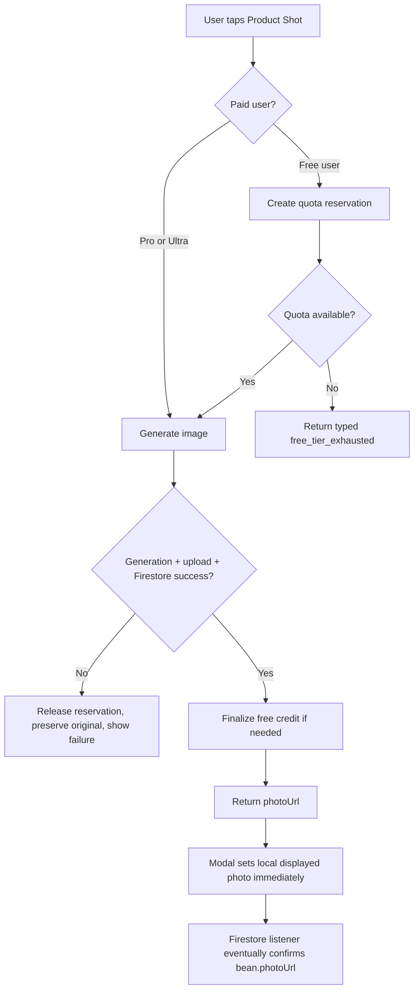
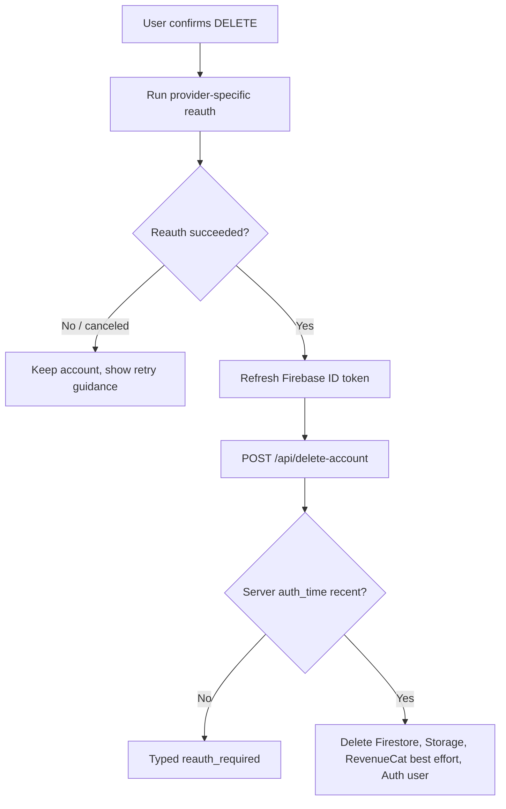

# fix: App Store launch blockers for account deletion and product shots

## Summary

Final App Store testing exposed three launch-blocking failures:

1. Account deletion can fail for App Review because the client refreshes a Firebase token but does not perform a real provider reauthentication.
2. Paid users can successfully generate a product shot on the server, but the new-bean modal can show the photo as removed because it clears local pending state and renders a stale bean prop.
3. Free users can lose their limited product-shot allowance on failed generation attempts and then see a generic failure instead of a paywall.

The fix must treat these as one launch-readiness bundle because the product-shot failures share state, storage, quota, paywall, and upload-race surfaces. A narrow patch to only one symptom would leave another App Review or first-user failure path open.

---

## Requirements

### R1. Account deletion passes App Review reauth expectations

- Deleting an account from Settings must prompt the signed-in user through a real Google or Apple reauth flow when the Firebase `auth_time` is stale.
- The server-side recent-login gate in `api/delete-account.js` must remain intact.
- A user who cancels reauth must keep their account and see a recoverable message.
- A disposable test account must be deletable end-to-end without deleting or modifying the owner's main account.

### R2. Paid product shots remain visible after success

- If `/api/product-shot` returns a `photoUrl`, the modal must immediately show that image.
- The image must still be visible after closing and reopening the modal.
- New-bean flows from Inventory and Rotation must not depend on a stale `newBeanEntry.photoUrl`.
- A late original-photo upload must not overwrite a generated product shot.

### R3. Free users get three completed product-shot generations

- Free users get exactly three successful product-shot generations.
- Failed generation, failed image extraction, failed Storage upload, or failed Firestore write must not spend a completed-generation credit.
- The fourth completed-generation attempt must open the product-shot paywall rather than show "Photo generation failed."
- Pro and Ultra users bypass the free product-shot quota but remain protected by rate limits.

### R4. Existing photo behavior remains compatible

- `bean.photoUrl` remains the display field for current bean cards and archive surfaces.
- Existing beans with `users/{uid}/bean-photos/{beanId}.jpg` URLs continue to render.
- "Use This Photo" still lets any authenticated user choose their original photo as the bean card image.
- Product shots still replace the displayed bean image when they complete successfully.

---

## Current Evidence

- `src/components/SettingsPage.jsx` calls `auth.currentUser?.getIdToken(true)` before deletion, but its own comment notes this is not real OAuth reauth.
- `api/delete-account.js` rejects stale tokens with `error: 'reauth_required'` when `decodedToken.auth_time` is older than five minutes.
- `src/lib/fetchWithRetry.js` handles 403 typed errors before friendly errors, but 401 friendly handling can hide the server's typed `reauth_required` body.
- `src/components/EditBeanModal.jsx` clears `pendingPhoto` after product-shot success and then renders `bean.photoUrl`; in new-bean flows, `bean` is the frozen `newBeanEntry`.
- `src/tabs/InventoryTab.jsx` and `src/tabs/RotationTab.jsx` pass `newBeanEntry` directly to `EditBeanModal`.
- `api/product-shot.js` currently uploads both original photos and generated product shots to `users/{uid}/bean-photos/{beanId}.jpg`.
- `src/components/ScanSheet.jsx` fire-and-forgets an original-photo upload after bean creation, which can overlap with a modal-triggered product shot.
- `api/product-shot.js` increments `subscription.freeUsage.productShots` before generation.
- `src/contexts/SubscriptionContext.jsx` does not currently read `freeUsage.productShots`.
- `src/components/PaywallSheet.jsx` has no `product_shot` context copy.

---

## Key Technical Decisions

### D1. Use real Firebase reauthentication, not token refresh

`getIdToken(true)` is only a token refresh. It cannot guarantee recent user presence because Firebase `auth_time` can remain old. The client should run provider-specific reauth:

- Google: use the existing Capgo Google login flow, force a prompt/account selection where supported, create a Google credential, then reauthenticate the current Firebase user.
- Apple: use the same nonce pattern as sign-in, create an Apple OAuth credential, then reauthenticate the current Firebase user.
- Web fallback: preserve the existing web sign-in provider behavior where practical, but prioritize iOS native correctness because App Review exercises the Capacitor build.

After successful reauth, refresh the ID token and call `/api/delete-account`. The server gate remains the authoritative security check.

Rejected alternative: removing the server `auth_time` check. That would make deletion easier but weaker exactly where App Review and user-security expectations are strictest.

### D2. Preserve one display field but separate storage write paths

Keep `bean.photoUrl` as the display field for compatibility, but stop using one physical Storage object for both original and generated images during active flows.

Recommended storage convention:

- Generated product shot: `users/{uid}/bean-photos/{beanId}.jpg`
- Original user photo: `users/{uid}/bean-photos/{beanId}-original.jpg`

This preserves current product-shot URLs while preventing late original uploads from overwriting generated images. It also avoids a schema migration because display state still lives in `bean.photoUrl`.

Rejected alternative: continue sharing the same path and rely on timing. That is the current race.

### D3. Original uploads need explicit write intent

`upload-original` should know whether it is a fallback/background upload or an explicit user choice.

- Scan background upload: write original file and update `bean.photoUrl` only if the bean has no photo yet.
- "Use This Photo": write original file and replace `bean.photoUrl`.
- Product shot: write generated file and replace `bean.photoUrl`.

This makes the original photo a safety net without letting it clobber a finished product shot.

### D4. Free product-shot metering must reserve then finalize

The quota invariant is "three completed generations," not "three attempts." The server should create a short-lived reservation before expensive generation, then finalize it only after generated image extraction, Storage upload, and Firestore write all succeed.

Reservation requirements:

- Stored server-side under the user's document tree, not writable by clients.
- Prunes stale reservations so a crashed request does not permanently block a user.
- Counts active reservations against the limit so concurrent requests cannot exceed three.
- Releases the reservation on known failure.
- Finalizes by incrementing `subscription.freeUsage.productShots` only after success.

Rejected alternative: simply increment after success. That fixes failed attempts but leaves concurrent requests able to overrun the free cap.

### D5. Product-shot paywall handling should use typed errors

The client should branch on `err.code`, not message substring matching. `fetchWithRetry` already assigns `free_tier_exhausted` and `subscription_required` for 403 responses; `EditBeanModal` should use those codes and open `product_shot` paywall context.

### D6. Display state should not depend only on Firestore catch-up

On successful product-shot or original upload, `EditBeanModal` should set a local displayed photo URL immediately. It should also sync that local display state when `bean.photoUrl` changes. Parent tabs can still improve by passing a live bean object when available, but the modal must be resilient on its own.

---

## High-Level Technical Design

Directional flow, not implementation code:

Deletion flow:

---

## Implementation Units

Recommended sequencing:

1. U1 first, because account deletion is independent and security-sensitive.
2. U3 before U2, because the UI should display the correct returned URL only after storage write semantics are safe.
3. U4 before U5, because typed paywall UX depends on authoritative server quota responses.
4. U6 last, because release verification depends on the complete fixed surface.

### U1. Provider reauth for account deletion

**Files:**

- `src/components/SettingsPage.jsx`
- `src/hooks/useAuth.js` or a new `src/lib/reauth.js`
- `src/firebase.js`
- `src/lib/fetchWithRetry.js`

**Approach:**

Add a provider-specific reauth helper that uses the same credential construction patterns as sign-in. `SettingsPage` should call it before delete, refresh the token after reauth, and then call the existing endpoint. `fetchWithRetry` should preserve typed 401 errors for `reauth_required` so Settings can distinguish stale auth from generic network failure.

**Test scenarios:**

- Existing Google test account with old session taps Delete Account, completes reauth, and account deletion succeeds.
- Existing Apple test account with old session taps Delete Account, completes reauth, and account deletion succeeds.
- User cancels reauth; account remains signed in and no deletion request succeeds.
- Server returns `reauth_required`; Settings shows reauth guidance rather than generic support copy.
- Recent-login account deletes without unnecessary extra loops.

### U2. Product-shot display state in the modal

**Files:**

- `src/components/EditBeanModal.jsx`
- `src/tabs/InventoryTab.jsx`
- `src/tabs/RotationTab.jsx`

**Approach:**

Add modal-local displayed photo state that is set immediately from a successful upload/generation response and synced from `bean.photoUrl`. Parent tabs may pass a live bean if available, but the modal should not require parent refresh timing to avoid showing "Add Photo" after success.

**Test scenarios:**

- Ultra user creates a new bean from scan, taps Product Shot, receives success, and sees the generated image immediately.
- The same modal remains correct after `pendingPhoto` is cleared.
- Closing and reopening the bean shows the generated image from Firestore.
- Manual/new bean flow from Rotation behaves the same as Inventory.
- Removing a photo clears both local display state and persisted `photoUrl`.

### U3. Separate original and generated photo writes

**Files:**

- `api/product-shot.js`
- `src/lib/storage.js`
- `src/components/ScanSheet.jsx`
- `src/components/EditBeanModal.jsx`
- `src/hooks/useAppData.js`

**Approach:**

Change `upload-original` to write to the original-photo path. Add explicit write intent so background scan uploads only fill empty `photoUrl`, while "Use This Photo" replaces it. Keep generated product shots at the existing generated path. Update cleanup to delete generated, original, and legacy PNG/JPG variants where relevant.

**Test scenarios:**

- Scan background original upload completes after a product shot; generated product shot remains the bean image.
- Scan background original upload completes before product shot; original appears until product shot succeeds, then generated image replaces it.
- User explicitly chooses "Use This Photo"; original becomes the bean image.
- Deleting a bean cleans up generated and original photo objects.
- Removing a photo from the modal deletes relevant objects and clears `photoUrl`.
- Existing beans with generated `beanId.jpg` continue rendering.

### U4. Server-side quota reservation for free product shots

**Files:**

- `api/product-shot.js`
- `api/_lib/cors-auth.js`
- `src/lib/subscriptionConfig.js`
- `src/contexts/SubscriptionContext.jsx`
- `firestore.rules`

**Approach:**

Set the free product-shot limit to 3 in the shared config and server logic. Add server-only quota reservation/finalization for free users. The server remains authoritative; the client counter is only a UX optimization. If reservation storage uses a user subcollection, keep it inaccessible to clients under current default-deny rules or add explicit deny comments if useful for clarity.

The existing generic metered wrapper in `api/_lib/cors-auth.js` still increments before work for other AI surfaces. This plan should not silently refactor every metered endpoint during the launch fix; product-shot needs a custom completed-generation counter because the user-facing promise is specifically three completed generated photos.

**Test scenarios:**

- New free user completes product shots 1, 2, and 3 successfully.
- Product shot 4 returns typed `free_tier_exhausted` and opens paywall.
- Simulated generation failure releases the reservation and does not increment `productShots`.
- Simulated Storage or Firestore write failure releases the reservation and does not increment `productShots`.
- Two concurrent free product-shot attempts cannot produce more than the remaining quota.
- Pro and Ultra users do not increment `subscription.freeUsage.productShots`.

### U5. Product-shot paywall and error UX

**Files:**

- `src/components/EditBeanModal.jsx`
- `src/components/PaywallSheet.jsx`
- `src/lib/paywallHelpers.js`
- `src/lib/fetchWithRetry.js`

**Approach:**

Use typed errors from `fetchWithRetry`. Add product-shot-specific paywall copy. Make product-shot quota errors open the paywall and make true generation failures preserve the original image and show "Photo generation failed" only when it is actually a generation failure.

**Test scenarios:**

- Free user at product-shot cap taps Product Shot and sees product-shot paywall copy.
- Subscription-required response opens paywall rather than failure toast.
- Real generation failure shows failure toast and leaves original photo visible.
- Rate-limit response remains distinct from paywall response.

### U6. Launch verification and release handoff

**Files / surfaces:**

- `package.json`
- `ios/`
- Vercel production deployment
- Capgo production channel
- App Store Connect / TestFlight

**Approach:**

After implementation, run repository build/lint verification, then verify on a disposable free account and a disposable paid/sandbox account where possible. Because the app is going to App Review, ship both backend and app bundle surfaces: Vercel for API changes and a fresh iOS build/TestFlight/App Store Connect upload for bundled JS/native review safety.

**Test scenarios:**

- Disposable free account: scan bean, product shots 1-3 succeed, product shot 4 paywalls.
- Disposable free account: delete account from Settings succeeds after reauth.
- Paid/Ultra account or sandbox paid entitlement: product shot succeeds and remains visible after close/reopen.
- Network/provider failure during product shot does not spend a free completed-generation credit.
- Fresh uploaded build contains the fixed JS bundle and points to the fixed backend.

---

## System-Wide Impact

### Data model

No required visible schema migration. `bean.photoUrl` remains the display URL. Optional reservation state is server-managed and can be created lazily.

### Storage

The storage model changes from one physical object per bean to up to two physical objects per bean. Storage rules already permit hyphenated filenames in `users/{uid}/bean-photos/{fileName}`, so `beanId-original.jpg` fits the current filename pattern if the generated bean ID stays within the existing length constraints.

### Subscription state

`subscription.freeUsage.productShots` becomes a real client-observed counter. Existing users without the field default to zero.

### API behavior

`/api/product-shot` will have stronger action semantics:

- `upload-original` is authenticated and write-intent aware.
- default generation is quota-reserved for free users and unlimited for paid users subject to rate limits.
- delete cleanup removes both original and generated objects.

### Security and privacy

Account deletion becomes stronger because real reauth is required before a destructive action. Product-shot quota reservation is server-only and must not expose client-writeable quota fields.

### Cost control

The reservation model prevents failed attempts from charging the user while still preventing concurrent free overuse. Existing rate limits remain necessary for paid accounts and abuse protection.

---

## Risks and Mitigations

| Risk | Impact | Mitigation |
|---|---:|---|
| Provider reauth behaves differently between web and iOS native | Delete account can still fail App Review | Reuse existing sign-in credential flows and test on device/TestFlight with Google and Apple disposable accounts |
| Apple reauth nonce mismatch | Apple deletion flow fails | Use the same raw nonce and hashed nonce pattern already used in `useAuth.js` |
| Reservation stuck after crashed request | Free user temporarily blocked | Use TTL pruning and release reservations on caught failures |
| Too-short reservation TTL expires during slow generation | Free user could get inconsistent quota result | Use a TTL longer than the product-shot timeout and Vercel function duration |
| Original upload no longer updates card in some flow | Free users lose original photo benefit | Distinguish background `if-empty` from explicit `replace`; test scan and manual flows |
| Cleanup misses legacy files | Storage clutter | Delete generated JPG, original JPG, and legacy PNG/JPG variants best-effort |
| Client pre-gate state stale | Wrong paywall timing | Treat client gate as advisory; server response remains authoritative |
| App Review tests old bundled JS | Reviewer sees unfixed bug | Upload a fresh iOS build after backend/app changes, not only an OTA update |

---

## Open Questions

### Resolved During Planning

- **Should product shots and originals keep sharing one Storage path?** No. That caused the overwrite race.
- **Should free product shots count attempts or completed generations?** Completed generations.
- **Should account deletion weaken the server gate?** No. The client should meet the gate with real reauth.
- **Does this require deleting the owner's account for testing?** No. Only disposable test accounts should be used.

### Deferred to Implementation

- Choose the exact reservation document shape. The requirement is invariant-based: active reservations plus finalized successes cannot exceed 3.
- Confirm the best Capgo/App Store release sequence after the code diff is complete and the current build number is known.

---

## Verification Plan

### Static verification

- Lint the changed code.
- Build the web bundle.
- Build/sync the iOS bundle before App Store upload.
- Confirm no secret values are introduced into tracked files.
- There is no existing repository test harness or `test` script in `package.json`; automated coverage is optional for this launch fix unless the implementation adds a small targeted harness.
- If targeted characterization tests are added, candidate paths are `api/product-shot.quota.test.js` for quota invariants and `src/components/EditBeanModal.product-shot.test.jsx` for modal display state.

### Manual device verification

- Free disposable account: first product shot succeeds and remains visible.
- Free disposable account: second and third product shots succeed and remain visible.
- Free disposable account: fourth product-shot attempt opens product-shot paywall.
- Free disposable account: failed product-shot attempt preserves original image and does not increment completed-generation count.
- Paid/Ultra account: product shot succeeds and remains visible after close/reopen.
- New-bean Inventory flow and Rotation flow both behave correctly.
- Delete account with stale session prompts reauth and succeeds after reauth.
- Delete account cancellation does not delete data.

### Release verification

- Vercel production endpoint reflects the new API behavior.
- Uploaded iOS build contains the fixed bundle.
- App Store Connect build processing completes.
- TestFlight smoke test uses the uploaded build, not only local dev or web preview.

---

## Scope Boundaries

### In Scope

- Account deletion reauth and error handling.
- Product-shot visibility and storage overwrite race.
- Free product-shot quota, typed paywall behavior, and client usage state.
- Launch verification needed for App Review confidence.

### Out of Scope

- Redesigning the paywall.
- Changing subscription pricing or RevenueCat products.
- Migrating existing photo URLs.
- Replacing the image-generation provider.
- Broad security audit work unrelated to these launch blockers.

---

## Sources and References

- `src/components/SettingsPage.jsx`
- `api/delete-account.js`
- `src/lib/fetchWithRetry.js`
- `src/components/EditBeanModal.jsx`
- `src/tabs/InventoryTab.jsx`
- `src/tabs/RotationTab.jsx`
- `src/components/ScanSheet.jsx`
- `src/lib/storage.js`
- `api/product-shot.js`
- `src/contexts/SubscriptionContext.jsx`
- `src/lib/subscriptionConfig.js`
- `src/components/PaywallSheet.jsx`
- `storage.rules`
- `docs/plans/2026-04-12-004-feat-plain-photo-upload-for-beans-plan.md`
- `docs/brainstorms/2026-04-21-bug-fixes-spring-cleanup-requirements.md`
- `docs/plans/2026-04-19-002-feat-app-store-launch-plan.md`
