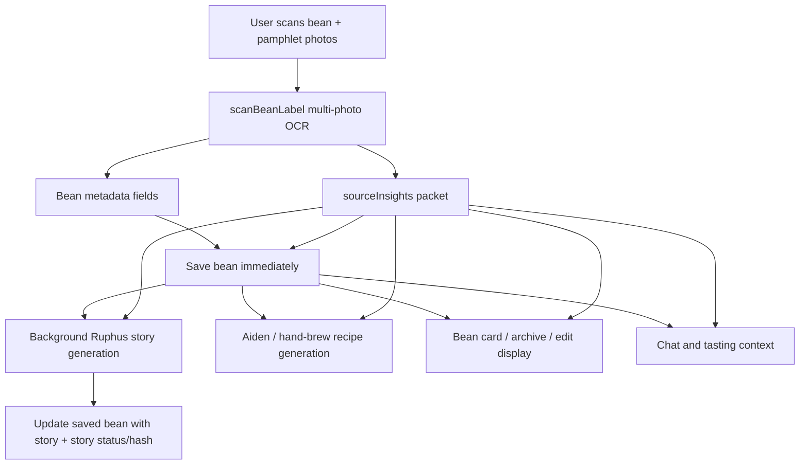

# Pamphlet Source Insights

## Summary

Add a durable source insight packet for roaster pamphlets, cards, and inserts so the app treats them as primary coffee evidence instead of flattening them into a few note fields. The plan extends the existing scan, bean save, Ruphus, recipe, tasting, chat, and bean-card paths so source context is preserved, prioritized, and regenerated safely when it changes.

---

## Problem Frame

Specialty beans often arrive with a pamphlet or selector card that contains the richest interpretation of the coffee: tasting committee notes, sensory axes, producer context, brew suggestions, and the roaster's intent. The current app can read extra photos during the main scan flow, but most of that information is compressed into `bagNotes`, `brewingRec`, and a few scalar bean fields. As a result, Professor Ruphus, recipe generation, tasting guidance, and bean-card display have access to only a thin shadow of the source material.

There is also a known orchestration flaw in scan-time story generation: `ScanSheet` starts a fire-and-forget Ruphus story, then immediately saves the bean with whatever story happens to be available at that instant. Story generation should become a derived background artifact that writes back after save, rather than a race the initial save may or may not catch.

---

## Requirements

- R1. Scanning multiple bean/pamphlet photos extracts and persists a structured source insight packet, not only `bagNotes` and `brewingRec`.
- R2. The source packet captures roaster/selector/tasting-committee context, sensory descriptors, sensory axes, brew guidance, provenance, and bounded extracted text or summary suitable for later prompts.
- R3. Bean save remains fast and reliable; a bean can be saved even while Ruphus story generation is still pending.
- R4. Ruphus story generation writes back to the saved bean after save, can retry on later Learn opens, and invalidates/regenerates when the source packet or relevant bean context changes.
- R5. Professor Ruphus uses pamphlet/source insights as higher-priority evidence than online enrichment or generic origin/process knowledge.
- R6. Aiden and hand-brew recipe generation receive pamphlet/source context as advisory brew and sensory evidence, while preserving brewer-specific constraints and existing deterministic safety rules.
- R7. Bean cards and detail surfaces expose source insights in a concise, trustworthy way without overwhelming the card.
- R8. Tasting/chat guidance can compare user perceptions against the roaster/selector's expected profile and use source insights when explaining dial-in adjustments.
- R9. Existing beans without source insights continue to work unchanged.
- R10. User-controlled OCR/source text is sanitized and bounded before entering LLM prompts.

---

## Scope Boundaries

- This plan does not store every pamphlet image forever as a document archive. It stores the extracted source packet and only preserves existing photo behavior unless implementation reveals a low-risk way to retain additional source image references.
- This plan does not add an OCR review/diff UI before save.
- This plan does not replace the deterministic Aiden grind-band philosophy; source context can influence advisory recipe shape, ratio, temperature, pulse/brew decisions, and explanatory context, but not blindly override enforced grind-family safety.
- This plan does not rework the whole Firestore schema or migration system beyond the bean fields and validation needed for source insights and derived artifact state.
- This plan does not require a backend job queue. Background story generation remains client-orchestrated unless implementation reveals that a server route is already necessary.

### Deferred to Follow-Up Work

- Full source-document archive UI: a later pass can let users browse all scanned pamphlet photos and raw OCR pages.
- Human review/edit flow for extracted source insights: a later pass can add explicit correction UI if users want to curate the packet before recipes or Ruphus use it.
- Bulk backfill of source insights for existing beans: this plan only handles newly scanned or newly enriched beans and natural regeneration on user action.

---

## Context & Research

### Relevant Code and Patterns

- `src/lib/gemini.js` already supports multi-photo scan input in `scanBeanLabel(photos)` and asks Gemini to read all text across images. The current schema returns bean metadata, `bagNotes`, `brewingRec`, `cupScore`, `shelfLife`, and related fields.
- `src/components/ScanSheet.jsx` already lets users add up to three photos and passes all of them to `scanBeanLabel(photos)`, then saves the first photo as the bean image and passes all scan photos back to the caller.
- `src/components/QuickRecipeFlow.jsx` currently calls `scanBeanLabel([photoObj])`, so quick recipe is single-photo even though the underlying scanner can handle more.
- `src/lib/beanBuilder.js` centralizes new bean construction and loops through `ENRICHABLE_FIELDS`, making it the right place to persist source insight fields that are part of the bean document.
- `src/lib/beanResearch.js` builds the shared bean description used by Aiden and hand-brew research/recipe flows. This is the right shared prompt boundary for source insight context.
- `src/lib/aiden.js` already instructs Aiden recipes to treat bag/roaster brewing recommendations as advisory and then enforces schema, deterministic grind, and clarity rules after model generation.
- `src/lib/handbrew.js` uses the same `buildBeanDescription(bean)` context and adds device-specific recipe generation and repair logic.
- `src/lib/professorRuphus.js` currently uses basic bean fields, bag notes, and limited external research context; it does not give roaster/selector source insights explicit priority.
- `src/hooks/useProfessorRuphus.js` already contains the Learn cache gate, in-flight guard, enrichment, stale re-read, and story persistence path. This is the right place to make stories derived and self-healing.
- `src/lib/claude.js` builds chat/tasting context and already carries `bagNotes`, `cupScore`, and `brewingRec`; it should include source insight summaries without bloating prompts.
- `src/components/BeanCard.jsx`, `src/components/EditBeanModal.jsx`, and `src/components/ArchiveDetailSheet.jsx` already surface enriched bean facts and should be extended for a concise source insight display.
- `firestore.rules` allows bean documents with a top-level field count cap, so new fields do not require an allowlist change today, but the persisted shape still needs explicit size and prompt-safety tests.

### Institutional Learnings

- `docs/solutions/security-issues/llm-prompt-sanitization-patterns.md` says sanitization should happen at shared prompt-building boundaries, not only individual call sites. This matters because OCR/pamphlet text is user-controlled and will feed several prompts.
- `docs/solutions/database-issues/firestore-settings-phase2-write-patterns.md` says one logical change should be one Firestore write, and multi-field persisted changes need deliberate write shape. Source packet save and derived story update should be separate logical writes with clear status fields.
- Prior review memory for Ruphus enrichment flagged stale-read protection, free-tier metering gates, and meaningful `enrichedAt` semantics as recurring hazards. The plan preserves the current real-promise `.finally()` guard pattern and avoids stamping completion on empty/no-op success.
- Prior chat-context review memory noted that prompt sanitizers can corrupt domain strings when too blunt. Source insight sanitization must preserve useful coffee punctuation such as ratios, temperatures, flavor separators, and units while still bounding/inerting instructions.

### External References

- External research skipped. The app already has local scan, LLM prompt, Firestore, recipe, and Ruphus patterns; the work is primarily cross-surface integration and prompt/data-shape design inside this codebase.

---

## Key Technical Decisions

- Treat pamphlets as a **source insight packet** on the bean, not as longer `bagNotes`. This preserves roaster/selector evidence in a form every downstream feature can use consistently.
- Store source insight text as bounded structured fields plus a source/context hash, not as unbounded raw OCR. This balances utility, prompt safety, Firestore size, and future regeneration.
- Keep initial bean save independent from Ruphus story completion. The bean and source packet are durable truth; story is a derived artifact that writes back later.
- Use a source priority order across LLM features: source packet and bag text first, user tastings second, stored recipe/brew history third, online enrichment fourth, generic coffee knowledge last.
- Preserve existing recipe safety: Aiden and hand-brew prompts should consume source insights, but post-generation enforcement and device-specific adaptation still decide final profile validity.
- Prefer shared context builders over duplicated prompt snippets. `buildBeanDescription` and a new source insight formatter should feed Aiden, hand brew, Ruphus, chat, and tasting to avoid drift.
- Add cache invalidation via a context hash/version for derived artifacts. Stories and generated recipes should be able to tell whether the source packet changed after they were created.

---

## Open Questions

### Resolved During Planning

- Should recipe generation and bean-card enrichment use pamphlet context? Yes. The user explicitly clarified that recipes and bean-card enrichment should have source context, even though Aiden recipes must adapt rather than copy V60-style instructions.
- Should save wait for Ruphus story? No. Save should persist the bean and source packet first; Ruphus fills in afterward on the saved bean.
- Should source photos be archived forever in this pass? No. Extracted source insights are the durable product artifact for this pass.

### Deferred to Implementation

- Exact source insight field names and maximum lengths: choose final names while implementing the shared normalizer, then keep them stable across prompt builders and display.
- Exact sensory-axis mapping: implementation should support the pamphlet examples seen here, but may adjust final axis names to match `SpiderChart` and `flavorProfile`.
- Whether Quick Recipe should reuse `ScanSheet` UI or add a local multi-photo picker: decide after inspecting component ergonomics during implementation.

---

## High-Level Technical Design

> *This illustrates the intended approach and is directional guidance for review, not implementation specification. The implementing agent should treat it as context, not code to reproduce.*

The packet is persisted before derived artifacts. Derived artifacts store enough context identity to know when they should regenerate.

---

## Implementation Units

- U1. **Source Insight Data Shape and Normalization**

**Goal:** Define the persisted source insight packet, safe prompt/display formatters, and context hash helpers.

**Requirements:** R1, R2, R4, R9, R10

**Dependencies:** None

**Files:**
- Create: `src/lib/sourceInsights.js`
- Modify: `src/lib/beanFields.js`
- Modify: `src/lib/beanBuilder.js`
- Modify: `firestore.rules`
- Test: `scripts/source-insights-regression.test.mjs`

**Approach:**
- Introduce a bounded `sourceInsights` bean field with structured subsections for source summary, roaster/selector/tasting committee notes, sensory descriptors, sensory axes, brew guidance, provenance, and extraction metadata.
- Add a `sourceContextHash` or equivalent helper that hashes the source packet plus recipe/story-relevant bean fields.
- Add prompt-safe and display-safe formatters that bound text length, preserve coffee-useful notation, and avoid passing raw OCR into system prompts.
- Add `sourceInsights`, `sourceContextHash`, and derived story status/hash fields to shared bean field constants where appropriate.
- Keep `firestore.rules` compatible with the new top-level fields and add regression coverage around the bean document field-count/shape assumptions if rules remain size-capped rather than allowlisted.

**Patterns to follow:**
- `src/lib/beanFields.js` for shared bean field constants.
- `src/lib/beanBuilder.js` for central save shaping.
- `src/lib/beanResearch.js` sanitization style, while avoiding over-stripping ratios and units.
- `docs/solutions/security-issues/llm-prompt-sanitization-patterns.md` for shared prompt-boundary sanitization.

**Test scenarios:**
- Happy path: source packet with pamphlet summary, sensory notes, sensory axes, and brew guidance normalizes into bounded persisted fields and a stable context hash.
- Edge case: missing pamphlet/source data returns null or an empty packet without changing existing beans.
- Edge case: very long OCR text is clipped per field and does not exceed intended prompt/display budgets.
- Edge case: coffee notation such as `1:17`, `95C`, `1800-2100 masl`, `red grapefruit / black tea` remains intelligible after sanitization.
- Error path: prompt-injection-like OCR text is retained only as inert factual text and cannot introduce instruction-looking sections into source formatters.
- Integration: `buildNewBeanData` persists `sourceInsights` and hash fields when provided while existing beans without those fields retain current shape.

**Verification:**
- A standalone regression script proves normalization, sanitization, hashing, and bean-builder persistence behavior.
- Existing scan/add flows can still build a bean without `sourceInsights`.

---

- U2. **Multi-Photo Scan Extraction and Save Orchestration**

**Goal:** Extend scan output to produce source insights and make initial save durable before any story/recipe derived work completes.

**Requirements:** R1, R2, R3, R4, R9

**Dependencies:** U1

**Files:**
- Modify: `src/lib/gemini.js`
- Modify: `src/components/ScanSheet.jsx`
- Modify: `src/components/QuickRecipeFlow.jsx`
- Modify: `src/tabs/ChatTab.jsx`
- Modify: `src/lib/claude.js`
- Test: `scripts/bean-source-scan-regression.test.mjs`

**Approach:**
- Extend the scan JSON contract to include source insights when non-bag source material is present, while still filling the existing bean fields for compatibility.
- Make the scan prompt explicitly distinguish bag label facts from pamphlet/source claims and prefer roaster/selector language when extracting sensory and brew guidance.
- Preserve the existing `ScanSheet` multi-photo flow and ensure all photos contribute to source insights.
- Add quick-recipe parity so users can include pamphlet images before generating an immediate recipe, either by supporting multiple selected photos directly or by reusing an existing multi-photo picker pattern.
- Update chat photo scanning markers to include source insights when the user scans through Professor Ruphus chat, so saving from chat does not lose pamphlet context.
- Save the bean and source packet first. Do not include story in `buildNewBeanData` unless already available; story persistence is handled by U3 after a real bean id exists.

**Patterns to follow:**
- `src/lib/gemini.js` multi-photo `scanBeanLabel(photos)` image-part pattern.
- `src/components/ScanSheet.jsx` generation counter and cancel cleanup patterns.
- `src/tabs/ChatTab.jsx` `parseBeanScan` marker parsing and save-to-inventory shape.
- Existing `scripts/bean-scan-*` artifacts for scan prompt regression style.

**Test scenarios:**
- Happy path: one bag photo plus one pamphlet photo extracts normal bean fields and a populated source insight packet.
- Happy path: pamphlet text with explicit brew guidance lands in source brew guidance and existing `brewingRec` where appropriate.
- Edge case: bag-only scan returns current fields with no disruptive empty source packet.
- Edge case: pamphlet mentions another coffee on the same sheet; extraction associates only matching bean sections where possible and avoids contaminating the target bean.
- Error path: malformed source insight JSON from Gemini is handled with the same friendly scan error behavior as existing malformed scan output.
- Integration: full `ScanSheet` save writes bean data immediately and passes source insights into the saved bean without depending on Ruphus story completion.
- Integration: quick recipe can consume multiple photos and start recipe generation from the enriched ephemeral bean context.
- Integration: chat scan marker parsing preserves source insights through Save to Inventory.

**Verification:**
- Scan regression script covers representative bag + pamphlet fixtures.
- Manual smoke path: add a bean with two or three photos and confirm the saved bean includes source insights before any story completes.

---

- U3. **Derived Ruphus Story Lifecycle**

**Goal:** Make Ruphus story generation source-aware, background-fill after save, retryable, and invalidated by source/context changes.

**Requirements:** R3, R4, R5, R9, R10

**Dependencies:** U1, U2

**Files:**
- Modify: `src/lib/professorRuphus.js`
- Modify: `src/hooks/useProfessorRuphus.js`
- Modify: `src/components/ScanSheet.jsx`
- Modify: `src/components/EditBeanModal.jsx`
- Test: `scripts/ruphus-source-story-regression.test.mjs`

**Approach:**
- Update `generateRuphusStory` to receive formatted source insight context and explicitly prioritize roaster/selector/pamphlet evidence over online enrichment and generic origin/process knowledge.
- Make `flavorProfile` draw from source sensory axes when available, falling back to expected variety/process/origin estimates only when source axes are absent.
- Replace scan-time story races with a post-save update: after `addBean` returns a real id, run the story generator using the saved bean/source packet and update that bean with story, status, generated-at, and context hash.
- In `useProfessorRuphus`, keep the existing `bean.story?.intro` cache gate but add context-hash awareness so old stories regenerate when source insights or relevant bean fields change.
- Preserve stale-read safety: before writing story/enrichment status, ensure the bean still exists and write only derived story fields, not a whole stale bean snapshot.
- Treat story failure as non-fatal to bean save. Store a retryable failed/pending status only if it helps the Learn surface decide what to do later.

**Patterns to follow:**
- `src/hooks/useProfessorRuphus.js` in-flight guard and `.finally()` cleanup on the real enrichment promise.
- `src/components/EditBeanModal.jsx` AI Fill story generation write path, but avoid fire-and-forget catch gaps.
- Prior Ruphus enrichment requirements in `docs/brainstorms/2026-04-12-ruphus-bean-enrichment-requirements.md` for silent, non-blocking enrichment UX.

**Test scenarios:**
- Happy path: saved bean with source insights but no story gets a story update after save using the source packet.
- Happy path: Learn opens on a bean with matching story hash and displays cached story without extra generation.
- Happy path: Learn opens on a bean whose source hash changed and regenerates the story.
- Edge case: bean save succeeds and story generation fails; the bean remains saved, Learn can retry later, and no scan error is shown.
- Edge case: user edits source-related fields while story generation is in flight; story write uses the intended derived fields only and does not overwrite user edits.
- Error path: source insight text containing instruction-like content remains factual context and does not change Ruphus output contract.
- Integration: scan flow no longer depends on `storyRef.current` being set before `buildNewBeanData`.

**Verification:**
- Regression script exercises story cache/invalidation decisions with and without source insights.
- Manual smoke path: scan a bean, immediately see it saved, then see Ruphus story appear later or regenerate on Learn.

---

- U4. **Source-Aware Recipe Context**

**Goal:** Feed pamphlet/source insights into Aiden and hand-brew recipes as meaningful advisory context while retaining brewer-specific adaptation and current enforcement.

**Requirements:** R6, R9, R10

**Dependencies:** U1, U2

**Files:**
- Modify: `src/lib/beanResearch.js`
- Modify: `src/lib/aiden.js`
- Modify: `src/lib/handbrew.js`
- Modify: `src/hooks/useAidenBrew.js`
- Modify: `src/hooks/useHandBrew.js`
- Test: `scripts/source-recipe-context-regression.test.mjs`

**Approach:**
- Extend `buildBeanDescription(bean)` or a sibling recipe-context helper to include source insight summary, sensory expectations, and brew guidance with clear provenance labels.
- Update research and recipe prompts so roaster/selector source insights are primary sensory evidence, and online research fills gaps rather than overriding pamphlet claims.
- For Aiden, preserve deterministic grind enforcement and schema repairs. Source brew guidance should inform ratio, bloom, temperature curve, pulse structure, and explanation, but final profile still adapts to Aiden pulse-pour constraints.
- For hand brew, include source guidance more directly when the guidance matches the selected brewer, and adapt it when the guidance was written for a different method.
- Persist recipe context hash on generated recipes so regenerate/cache decisions can detect stale source context where applicable.

**Patterns to follow:**
- `src/lib/aiden.js` existing "bag/roaster recommendations are advisory" philosophy.
- `src/lib/handbrew.js` device-specific recipe generation and repair structure.
- `src/lib/beanResearch.js` shared `buildBeanDescription` path so source context reaches both Aiden and hand brew consistently.

**Test scenarios:**
- Happy path: source brew guidance saying higher ratio and high acidity appears in generated recipe context for both Aiden and hand brew.
- Happy path: Aiden prompt receives source context but deterministic grind repair still overrides an unsafe or incompatible model grind.
- Happy path: V60/hand-brew prompt can use source guidance more directly when the pamphlet guidance is pour-over compatible.
- Edge case: source guidance references espresso or cupping; recipe context labels it as advisory and does not copy incompatible parameters blindly.
- Edge case: no source insights produces the same recipe context shape as today.
- Error path: source insight formatting failure does not block recipe generation; the recipe falls back to existing bean fields.
- Integration: cached recipe generated before source insights are added is detectable as stale and can be regenerated when the user requests a fresh recipe.

**Verification:**
- Regression script asserts source context inclusion, fallback behavior, and Aiden enforcement boundaries.
- Manual smoke path: scan bag + pamphlet, generate Aiden and hand-brew recipes, and confirm the recipe rationale/parameters reflect source guidance without violating existing constraints.

---

- U5. **Bean Card, Detail, Chat, and Tasting Consumption**

**Goal:** Surface and use source insights across everyday app surfaces without turning the UI into a document viewer.

**Requirements:** R5, R7, R8, R9, R10

**Dependencies:** U1, U2

**Files:**
- Modify: `src/components/BeanCard.jsx`
- Modify: `src/components/EditBeanModal.jsx`
- Modify: `src/components/ArchiveDetailSheet.jsx`
- Modify: `src/components/ProfessorRuphusSlideUp.jsx`
- Modify: `src/lib/claude.js`
- Modify: `src/tabs/TastingTab.jsx`
- Test: `scripts/source-context-display-regression.test.mjs`

**Approach:**
- Add a concise bean-card/detail display for source insights, such as a collapsed "Roaster Packet" or "Source Notes" section that shows sensory summary and brew guidance when present.
- Keep the main card scannable by showing a short source-derived summary and leaving longer text to expanded/detail surfaces.
- Update chat context to include source insight summaries for active and selected beans within strict token budgets.
- Update tasting prompt context so Ruphus can compare user tasting notes against source expectations and teach the gap.
- Update Professor Ruphus slide-up if needed so source-derived expected profile feels explainable and not disconnected from the visible packet.

**Patterns to follow:**
- `src/components/BeanCard.jsx` existing expandable details and `brewingRec` display.
- `src/components/ArchiveDetailSheet.jsx` detail row pattern.
- `src/lib/claude.js` static/dynamic prompt split and selected bean profile block.
- Prior memory about `buildChatContext` sanitization preserving coffee-specific punctuation.

**Test scenarios:**
- Happy path: bean with source insights shows a concise source section on expanded card/detail views.
- Happy path: chat selected-bean context includes source sensory summary and brew guidance without raw unbounded OCR.
- Happy path: tasting chat can reference source expectations when the user's perception matches or diverges.
- Edge case: bean without source insights renders exactly as before.
- Edge case: source insights exist but no brew guidance exists; UI hides that row rather than showing empty labels.
- Error path: very long source summary is clipped in display and prompt context.
- Integration: editing bean fields/source-related fields invalidates stale story/recipe context where the relevant hash changes.

**Verification:**
- Regression script covers display formatter and prompt-context inclusion.
- Manual smoke path: expanded bean card, archive detail, chat, and tasting all show/use the same source packet consistently.

---

- U6. **Cache, Status, and Native/Web Consistency Hardening**

**Goal:** Ensure source insights, derived stories, and stale recipe/story states behave consistently across Firestore live web updates and native polling/cache.

**Requirements:** R3, R4, R9

**Dependencies:** U1, U3, U4, U5

**Files:**
- Modify: `src/hooks/useAppData.js`
- Modify: `src/lib/offlineCache.js`
- Modify: `src/hooks/useProfessorRuphus.js`
- Modify: `src/hooks/useAidenBrew.js`
- Modify: `src/hooks/useHandBrew.js`
- Test: `scripts/source-derived-cache-regression.test.mjs`

**Approach:**
- Confirm `normalizeBean` and offline cache pass through source insight and derived status fields without stripping or legacy migration conflicts.
- Add derived artifact status/hash checks where stories and recipes are read from cache.
- Ensure native refetch/poll paths pick up background story updates after save. If current native polling delay is too slow for this UX, use existing post-mutation refetch patterns after background story update.
- Keep one logical change per Firestore write: initial bean/source save, story update, and recipe update remain separate writes with explicit fields.

**Patterns to follow:**
- `src/hooks/useAppData.js` native refetch coalescing and monotonic fetch ID pattern.
- `docs/solutions/database-issues/firestore-settings-phase2-write-patterns.md` one-logical-change/one-write guidance.
- `src/hooks/useProfessorRuphus.js` current in-flight guard and cache gate.

**Test scenarios:**
- Happy path: source insights survive read normalization and offline cache hydration.
- Happy path: background story update appears on web through listener and on native through refetch/poll.
- Edge case: deleted bean while story update is in flight aborts safely.
- Edge case: two rapid Learn opens on the same bean do not launch duplicate story/enrichment chains.
- Error path: recipe/story hash mismatch prompts regeneration only when the user opens the relevant surface, not during passive render.
- Integration: scan save, background story update, and later recipe generation produce separate non-conflicting Firestore updates.

**Verification:**
- Regression script covers derived cache decisions.
- Manual smoke path on web and iOS dev app confirms saved bean appears immediately and source-aware story/recipe updates follow.

---

## System-Wide Impact

- **Interaction graph:** `ScanSheet`, `QuickRecipeFlow`, and `ChatTab` feed source insights into bean data; `beanBuilder` persists them; `professorRuphus`, `beanResearch`, `aiden`, `handbrew`, `claude`, and display components consume the shared formatted context.
- **Error propagation:** Scan extraction failures continue to use existing scan error UI. Background story/source-derived updates fail silently or with existing Learn/recipe errors depending on the surface; they must not roll back the saved bean.
- **State lifecycle risks:** The main risks are stale derived stories, stale recipes, duplicate background generation, and user edits racing with post-save updates. Context hashes, re-read checks, and field-scoped updates mitigate these.
- **API surface parity:** Full Scan, Quick Recipe, and Chat photo scan should preserve source context consistently. Any surface that can save a scanned bean should carry the packet.
- **Integration coverage:** Unit-style helper tests are not enough; manual web/native smoke checks should verify post-save story fill-in, source-aware recipes, and visible card/detail context.
- **Unchanged invariants:** Existing beans without source insights, existing stored recipes, Aiden push behavior, deterministic grind repair, product-shot upload, and current single-bean delete/archive flows should remain compatible.

---

## Risks & Dependencies

| Risk | Mitigation |
|------|------------|
| Source OCR text introduces prompt-injection risk | Bound and sanitize source text in shared formatters; label all source text as factual claims, not instructions. |
| Firestore bean docs grow too large | Store structured summaries and bounded excerpts, not raw full OCR pages or base64 images. |
| Source insights make recipes overfit pamphlet guidance | Keep source guidance advisory and preserve existing Aiden/hand-brew enforcement/repair layers. |
| Story/recipe caches become stale | Store source/context hashes on derived artifacts and regenerate on user-triggered surfaces when mismatched. |
| Initial scan feels slower | Persist bean/source packet before derived story; keep story generation background and retryable. |
| Multiple scan entry points drift | Centralize packet normalization/formatting and update Full Scan, Quick Recipe, and Chat scan together. |
| New fields are not visible enough to build trust | Add concise bean-card/detail source display and ensure Ruphus/recipe outputs visibly reflect source claims. |

---

## Alternative Approaches Considered

- Put richer pamphlet text into `bagNotes` and `brewingRec`: Rejected because it preserves compatibility but loses source provenance, sensory axes, and structured guidance needed by Ruphus, recipes, tasting, and display.
- Wait for Ruphus story generation before saving the bean: Rejected because it makes scan/save slower and more failure-prone on mobile. The saved bean plus source packet should be the durable truth; story is a derived artifact that can catch up.
- Store raw pamphlet photos as the primary artifact: Deferred because it adds storage, privacy, and UI complexity before the app needs it. Extracted source insights solve the immediate product gap.
- Add a server-side background job for story generation: Deferred because the existing client orchestration can support post-save updates with less infrastructure. Revisit only if retries or offline behavior prove unreliable.

---

## Success Metrics

- Bag + pamphlet scans produce visibly richer bean records than bag-only scans, with source summaries and brew guidance available after save.
- Ruphus lessons for beans with source insights explicitly reflect the roaster/selector packet and no longer default primarily to generic origin/process expectations.
- Aiden and hand-brew recipes generated after source insight capture visibly reflect relevant pamphlet context while preserving existing repair/enforcement constraints.
- Saving a scanned bean is not blocked by story generation; a failed story does not lose the bean or the source packet.
- Existing beans without source insights still render, brew, chat, and taste normally.

---

## Documentation / Operational Notes

- Update any internal scan/prompt notes if the scan schema changes materially.
- Add a short QA checklist for bag-only, bag-plus-pamphlet, Quick Recipe, and Chat scan paths.
- No app-store-facing copy changes are required for this implementation plan, though future marketing can claim richer pamphlet reading once verified.

---

## Sources & References

- Related requirements context: `docs/brainstorms/2026-04-12-ruphus-bean-enrichment-requirements.md`
- Existing scan path: `src/lib/gemini.js`, `src/components/ScanSheet.jsx`, `src/components/QuickRecipeFlow.jsx`, `src/tabs/ChatTab.jsx`
- Existing bean persistence: `src/lib/beanBuilder.js`, `src/hooks/useAppData.js`, `firestore.rules`
- Existing Ruphus path: `src/lib/professorRuphus.js`, `src/hooks/useProfessorRuphus.js`, `src/components/ProfessorRuphusSlideUp.jsx`
- Existing recipe paths: `src/lib/beanResearch.js`, `src/lib/aiden.js`, `src/lib/handbrew.js`, `src/hooks/useAidenBrew.js`, `src/hooks/useHandBrew.js`
- Existing chat/tasting context: `src/lib/claude.js`, `src/tabs/TastingTab.jsx`
- Prompt safety pattern: `docs/solutions/security-issues/llm-prompt-sanitization-patterns.md`
- Firestore write pattern: `docs/solutions/database-issues/firestore-settings-phase2-write-patterns.md`
