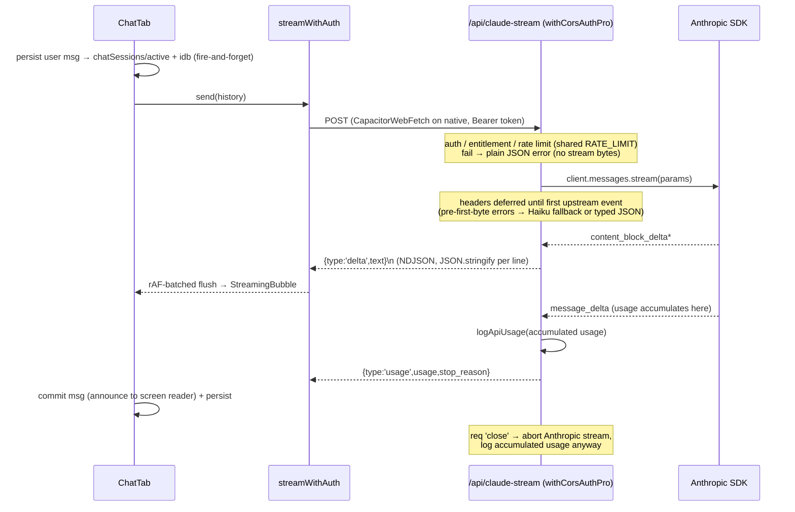
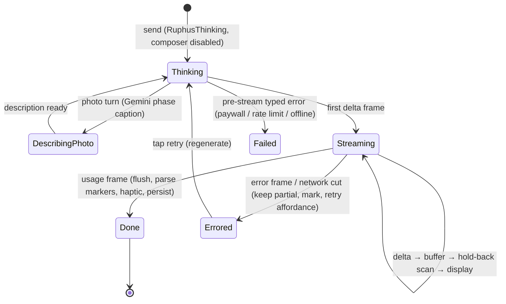
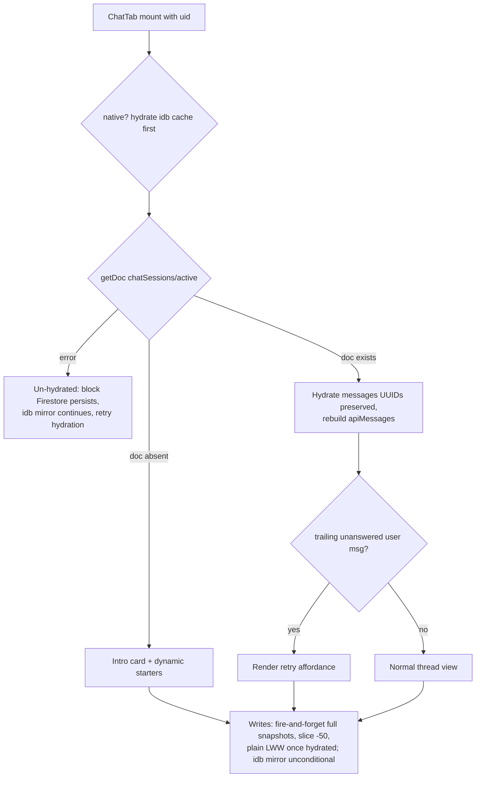

# feat: Chat Professor Ruphus 100x — intelligence, streaming, persistence

## Summary

Upgrade the Chat tab in three phased tiers: (A) intelligence quick wins — current-gen model, full knowledge injection into the cached prompt, personalized naming, fixed starter-chip and guided-tasting entry points, rotation-aware starters, scan-truncation guard; (B) the premium layer — true token streaming from a new Vercel streaming endpoint into WKWebView, a persistent resumable conversation in Firestore, structured recipe cards; (C) deeper context — palate trends and live web answers via Gemini search grounding. Packaged as an overnight /goal loop with per-tier gates, fresh-codex review, and a device-evidence gate. One item ships ahead of the loop: the "Tal" naming fix hotfixes to production immediately.

## Problem Frame

Professor Ruphus chat runs on Haiku (the client hardcodes it; the server already defaults to Sonnet 4.6), sees only half of the curated coffee knowledge, calls every user "Tal", and wastes its best starter prompts ("Scan a bag" sends literal text; "Guided Tasting" dead-ends in a chat flow that can't save a tasting). The experience layer is a full-response wait behind a loader, a conversation that evaporates on every app launch, and plain-text-only answers. The app already has the pieces this plan connects: a wizard that owns guided tasting, a prompt cache that makes knowledge injection cheap, 6-axis tasting scores chat never sees, and a Gemini grounding proxy chat can't use.

---

## Requirements

**Intelligence**

- R1. Chat turns run on `claude-sonnet-5` with thinking disabled; the Haiku 4.5 fallback applies only before the first streamed byte, and the `thinking` param is rebuilt per the final model on each attempt (Haiku is expected to reject Sonnet 5's param — the edge test verifies). Token budgets are re-baselined against Sonnet 5's tokenizer via `count_tokens` on measured fixtures, not inherited from Haiku/4.6-era numbers. Tasting coach and `reactToTastingStep` stay on their current models.
- R2. The cached static chat prompt additionally carries `RUPHUS_KNOWLEDGE` and `TASTING_KNOWLEDGE`; prompt-cache hits are preserved and verified (cache-read tokens > 0 on consecutive turns — via response headers on the JSON path, via the terminal usage frame on the stream path).
- R3. The dynamic block carries the user's first name (from `profile.displayName`), origin context for the origins in the active rotation, and (phase C) a palate summary with per-axis `tastingScores` averages. Nothing user-specific enters a cached block, and every user-derived value passes `sanitize()` with a tight cap (first name ≤30, descriptors ≤50, origin echo sanitized) — a display name like `---BEAN_SCAN---…` must not survive into the prompt.
- R4. Photo turns get a raised max-tokens budget (sized from a measured scan fixture) and a `stop_reason` check; a truncated or malformed `BEAN_SCAN` payload never renders raw marker text to the user.

**Entry points**

- R5. The "Scan a bag" starter chip opens the camera/photo picker (native camera prompt, web file input) instead of sending text; in demo mode it routes to `onDemoAction`.
- R6. "Coach my tasting" opens the Tasting Wizard with the first active bean. With zero active beans it posts a brief in-character assistant line ("No beans in your rotation yet — let's fix that") and then navigates to the Tasting tab via a dedicated `onNavigateToTasting` prop. The shared `onStartTastingSession` contract is NOT overloaded — its falsy-id no-op stays intact for existing callers (BrewTimer passes an undefined id for ephemeral scanned beans and depends on the no-op).
- R7. The scanned-bean "Guided Tasting" button saves the bean first (deduped by exact name+roaster match against existing inventory), then hands off via `onStartTastingSession(id)`; the button shows a busy/disabled state while the save is in flight, the handler is double-tap guarded, and an `addBean` failure keeps the card visible with an error toast.

**Streaming**

- R8. A new `api/claude-stream.js` endpoint streams NDJSON: `{type:'delta',text}` frames, a terminal `{type:'usage',usage,stop_reason}`, and `{type:'error',code,message}` for mid-stream failures. Each frame is one `JSON.stringify(obj) + '\n'` line — model text can never spoof a control frame (fixture-tested). `api/claude.js` is untouched except the U1 model allowlist entry; real incremental delivery is proven by a `curl -N` transcript kept as loop evidence.
- R9. The client streams through the original WKWebView fetch (`window.CapacitorWebFetch` on native — `CapacitorHttp` is enabled in this app and buffers whole responses); if that global is absent the client flags buffered-transport mode rather than failing silently. No retry after the first byte; pre-stream HTTP errors parse as the existing typed JSON errors (`subscription_required`, `free_tier_exhausted`, `rate_limited`).
- R10. Tokens render progressively in an isolated streaming bubble (ref buffer + rAF flush); `RuphusThinking` shows until the first token and spans the Gemini image-description phase on photo turns with a phase-appropriate caption. Reduce Motion gates bubble chrome, never text cadence. Screen readers: the thread container is `role="log"` with `aria-live="polite"`; completed messages are announced on commit, never per token flush. The composer stays disabled while a response is in flight (carrying today's `!loading` behavior into the streaming path).
- R11. Autoscroll sticks to bottom during a stream with a user-scroll override armed by `touchstart`/`wheel` (not `scroll` events, which existing programmatic scrolls would trip); keyboard handling code is untouched.
- R12. A mid-stream failure keeps partial text visible and marked errored, excludes it from API history, and retry regenerates the reply. The server aborts the upstream Anthropic stream on client disconnect (verified in the spike; `supportsCancellation` becomes required config if `close` doesn't fire) and still logs usage — accumulated from `message_delta` events, not only from a final message that an aborted stream never yields.
- R13. Streamed text never shows a partial structured marker or an unpaired `**`; the hold-back buffer has an explicit terminal-flush policy (malformed marker at stream end → hide the marker, show fallback prose). All marker families are defined in one exported constant consumed by every parser.

**Persistence**

- R14. The conversation persists to `users/{uid}/chatSessions/active` — a single rolling-window doc with a `messages` array capped at 50, no base64. Persists are fire-and-forget full snapshots from local state (never awaited on the send path); any single write failure is corrected by the next persist. Every persist attempt also mirrors to the idb cache unconditionally — including while offline or hydration-blocked — so an offline session survives an app kill locally. The rules block enforces what rules can express: owner-only read/write/delete, doc id pinned to `active`, `keys().hasOnly(['messages','updatedAt'])`, `messages is list && messages.size() <= 50`, `updatedAt is number`. Per-message text caps are client-side; the 1MB doc limit is the accepted backstop.
- R15. Cold launch resumes the conversation; API history is rebuilt from persisted text; a trailing unanswered user message renders the retry affordance; the scanned-bean card state is not restored. A failed hydration (`getDoc` error ≠ doc absent) blocks all Firestore persists (idb mirroring continues) until a retried hydration succeeds — an offline mount must never overwrite remote history. Native hydrates from the house idb cache first, matching every other surface.
- R16. A "New chat" affordance clears the doc, the idb cache entry, and all in-memory chat state, restoring the intro card and starter prompts.
- R17. Multi-device writes are plain last-writer-wins full snapshots once hydrated — no per-write freshness compare (a compare that skips-on-conflict silences every subsequent persist for the session, losing the losing device's entire conversation; unconditional LWW plus the hydration gate covers the dangerous un-hydrated clobber). Accepted loss mode, stated: two sessions active simultaneously on one account resolve to whichever wrote last; the next cold launch reads the winner.

**Cards, starters, polish**

- R18. Brew-recipe answers can emit a recipe-card marker (same family as `BEAN_SCAN`) rendered as a structured card; malformed payloads fall back to plain text. "Save to bean notes" shows a saving/disabled state during the write and a success or failure toast (mirroring the R7 pattern); card fields are length-capped client-side before the write (steps ≤12, ≤200 chars each).
- R19. Starter prompts are rotation-aware (peak windows, opened bags, unanswered scans), with the static set as fallback for zero beans and demo mode. Ships in Phase A (no dependency on streaming).
- R20. Error bubbles are tap-to-retry; a light haptic fires on reply completion; message list keys are stable ids unique across hydration (a fresh counter must not collide with persisted ids).

**Live answers (phase C)**

- R21. A `NEEDS_SEARCH` two-pass flow reconciled with streaming: the prompt instructs that a search response is marker-ONLY (no preceding prose), and any pass-one prose that streamed before the marker is replaced by the pass-two answer in the same bubble — never appended; exactly one visible answer per user message. Controls: the extracted query is capped (~120 chars, control chars stripped) and shown in the loader caption; one search per user message (client-enforced; server-side the only bound is the existing Gemini rate limit); the second-pass prompt frames grounded web content explicitly as untrusted data, not instructions (SEO-poisonable pages reach this context); the sources footer is built only from the client-held `groundingChunks` (never parsed from model text) with an `https:`-only scheme allowlist — disallowed schemes render zero rows. Gemini failure → answer from knowledge with a disclaimer. The marker instruction stays out of the prompt until this unit ships.

**Gates and design**

- R22. `scripts/verify-chat.mjs` is updated in the same change (its Pass 2 currently clicks "Scan a bag" and asserts a sent bubble — rewrite to a text-sending starter and assert the picker opens instead) and extended to cover streaming, cards, and dynamic starters; all prior `verify-*.mjs` gates keep passing. The evidence gate is per-tier: the Phase A/B checkpoint passes without any Phase C frame, so a Phase C stall still ships A+B. Overnight frames come from the simulator (sim-from-vite recipe, per house convention); the real device is the v5 human sign-off. The codex rubric is pre-briefed on approved patterns.
- R23. The chat surface stays monochrome + single accent and gradient-free (the existing zero-`linear-gradient` gate assertion is retained); all entrance/visibility rendering is plain DOM + CSS keyframes; framer is used only for `whileTap`/`layoutId`; the design-bank preship checklist runs before ship.

---

## Key Technical Decisions

- **`claude-sonnet-5` for chat, thinking disabled:** current-gen, priced below Sonnet 4.6 through 2026-08-31 ($2/$10 vs $3/$15 per MTok). Sonnet 5 runs adaptive thinking by default, so `thinking: { type: 'disabled' }` must be explicit or chat pays for thinking tokens — and the param must be rebuilt per attempt so the Haiku fallback doesn't inherit it. Sonnet 5's tokenizer differs from the 4.6/Haiku baseline all existing budget numbers were sized against — re-baseline via `count_tokens` on real fixtures rather than inheriting, and treat the 2026-08-31 pricing flip as a scheduled model-default decision, not a rate update. Server `ALLOWED_MODELS` gains the new id; `api/_lib/costLogger.js` gains its rates. The fallback chain survives, but only pre-first-byte — never silently swap models after partial text has streamed.
- **The "Tal" naming fix does not wait for the loop:** every external Pro subscriber is greeted as "Tal" on a paid surface today. The user-agnostic prompt wording (U2's naming half) ships as an immediate standalone hotfix through the normal deploy path before the loop launches; the loop treats it as landed baseline.
- **Separate streaming endpoint (`api/claude-stream.js`), not a branch in `api/claude.js`:** the existing proxy is the single funnel for four non-chat callers (tasting coach, recommendations, wizard reactions, chat) — an overnight agent iterating on stream framing inside that file is exactly the blast radius the scope guard exists to prevent. A new file makes "non-stream path untouched" structurally guaranteed, costs one middleware-wrapper line (`withCorsAuthPro` — chat is unmetered Pro-only), and gets its own `vercel.json` `maxDuration`. Shared constants move to `api/_lib/claudeShared.js` — including the rate-limit config as the FULL exported constant `RATE_LIMIT = { key: 'claude', limit: 120, windowMs: 60 * 60 * 1000 }` imported by both endpoints: the middleware silently disables rate limiting when `windowMs` is falsy, so the constant must be impossible to half-copy.
- **NDJSON over a chunked response, not SSE framing:** the client is a custom `fetch()` consumer sending a Firebase bearer header (`EventSource` can't), so `data:`/`event:` ceremony buys nothing. Classic `(req, res)` + `res.write()` streams fine on Vercel Fluid Compute — no handler migration. Usage/cache telemetry moves from response headers (locked after first write) to the terminal NDJSON frame. Status and headers are deferred until the first upstream event arrives, which keeps the pre-first-byte Haiku fallback and typed JSON errors reachable.
- **Bypass CapacitorHttp for the streaming call only:** this app has `CapacitorHttp: { enabled: true }` in `capacitor.config.ts` (boilerplate from the foundation commit, but load-bearing by inertia), which patches `window.fetch` with a native bridge that buffers entire responses. Use the preserved original `window.CapacitorWebFetch` on native (confirmed present in the installed @capacitor/core 8.2.0 bridge) rather than flipping the config. It's an undocumented internal: detect its absence, flag buffered-transport mode, and assert its existence in the device spike and the loop scope guard so a Capacitor upgrade turns into a gate failure, not a silent regression.
- **Single rolling-window doc for persistence, not a per-message subcollection:** one continuous conversation capped at 50 display messages ≈ 30KB — nowhere near the 1MB doc limit. One doc read on mount, fire-and-forget full-snapshot writes (self-healing: the next persist repairs any failed one), whole-array overwrite with slice(-50), plain LWW once hydrated. The idb mirror is decoupled from the Firestore write so offline sessions stay locally durable. Follows the house native pattern (no `onSnapshot`; local state authoritative; idb cache hydrate on native, where the Firestore SDK runs memory-cache-only). A new explicit rules block is required — `firestore.rules` is default-deny with no catch-all — and must deploy before the client path lands, under an additive-only guard (see Risks).
- **Prompt-cache discipline:** all knowledge additions go in the cached static block (cheap after first turn per 5-min cache window; turns arriving after the TTL pay the 1.25x cache-write on the enlarged block — bounded, watched via usage telemetry); the name, rotation, origin, and palate context go in the dynamic block, each user-derived value through `sanitize()`. Per-user bytes in a cached block would turn every request into a cache write.
- **Marker streaming via a hold-back buffer with structural preflight:** the tail of the accumulated stream is scanned for partial marker prefixes and unpaired `**`; held-back content is excluded from display until it resolves. At stream end, an unresolved marker is rejected whole (per the documented regex-fallthrough lesson) — never rendered raw. The marker families (open/close token pairs for `BEAN_SCAN`, recipe card, `NEEDS_SEARCH`) live in one exported constant so the hold-back buffer, `parseBeanScan`, and future parsers cannot drift.
- **CSS for entrance, framer for interaction only:** framer `animate()` entrances are documented-dead in this WKWebView. Streaming text, bubbles, cards, and the caret are plain DOM, visible-by-default, with CSS keyframes; `whileTap`/`layoutId` remain fine.
- **Chat thread stays gradient-free:** the verify-chat zero-gradient assertion is a stricter gate than codex and it stays. No `GlassButton`/glass material inside the thread; premium reads come from type hierarchy, hairline borders, and motion restraint, per the design bank.
- **Two-pass search marker, not tool-calling infrastructure:** reuses the existing marker idiom and the Gemini proxy as-is (it already passes `tools` through and returns `groundingMetadata`; the client already uses the correct `googleSearch` key). A proxy tool-use loop stays out of scope, consistent with the April brainstorm's explicit exclusion. Under streaming, the search turn is marker-only and pass two replaces pass one — the two-pass shape was inherited from the JSON era and needs this reconciliation to avoid a visible double answer.
- **Mid-stream failure policy:** keep partial text visible and errored (users distrust vanishing text), exclude it from `apiMessages` (the existing invariant: error/partial content never becomes canonical model history), retry regenerates in place.
- **Scanned bean → wizard is save-then-handoff:** `addBean` → new id → `onStartTastingSession(id)` rides the existing retry-until-in-beans effect in TastingTab. An ephemeral-bean wizard path would touch bean resolution, draft keying, and record linkage for no user-visible gain. Chat's zero-bean navigation gets its own `onNavigateToTasting` prop rather than overloading the shared handler, whose falsy-id no-op is load-bearing for BrewTimer.
- **Harness testability is designed in, not retrofitted:** `useChatSession` takes an injectable storage adapter (Firestore+idb in the app, localStorage-backed in the harness) so the persistence round-trip is gate-testable without a Firebase emulator. Rules-denial checks run once as a recorded manual verification at deploy time (loop-log evidence), not as an automated gate — keeping Java/emulator out of the overnight toolchain.

---

## High-Level Technical Design

Streaming turn, end to end:



Streamed-message lifecycle (client):



Cold-launch resume:



## Output Structure

New files only (everything else modifies in place):

```
api/claude-stream.js         # NDJSON streaming endpoint (withCorsAuthPro)
api/_lib/claudeShared.js     # ALLOWED_MODELS, MAX_TOKENS_CAP, RATE_LIMIT (full constant), params assembly
src/components/chat/
  StreamingBubble.jsx        # isolated streaming leaf (ref buffer, rAF flush, CSS caret)
  RecipeCard.jsx             # structured brew-recipe card from marker payload
  ChatMessage.jsx            # extracted bubble renderer (stable ids, retry affordance)
src/lib/streamChat.js        # streamWithAuth + NDJSON reader + marker hold-back buffer + marker-family constant
src/hooks/useChatSession.js  # rolling-doc hydrate/write-through via injectable storage adapter + idb + New chat
scripts/verify-stream-parse.mjs   # unit gate: hold-back buffer + marker preflight (created in U4)
scripts/stream-mock-server.mjs    # side HTTP server emitting genuinely delayed NDJSON chunks for the harness
scripts/verify-chat-evidence.mjs  # per-tier device-evidence gate (chat frame list)
docs/loops/chat-100x/        # loop.yaml + LOOP_PROMPT.md (via /loop-prompt)
```

---

## Implementation Units

### Phase A — intelligence quick wins

### U1. Model switch to Sonnet 5

- **Goal:** Chat runs on `claude-sonnet-5`; docs stop lying about model routing.
- **Requirements:** R1
- **Dependencies:** none
- **Files:** `src/lib/claude.js`, `api/claude.js`, `api/_lib/costLogger.js`, `.claude/rules/ai-models.md`, `.claude/rules/api-proxies.md`, `CLAUDE.md`
- **Approach:** `sendChatMessage` passes `model: 'claude-sonnet-5'` explicitly (the client's `callClaude` default is Haiku and other callers rely on that — do not change the default). Proxy: add `claude-sonnet-5` to `ALLOWED_MODELS`; build `params.thinking = { type: 'disabled' }` conditionally per the final model on each attempt (Sonnet 5 only — Haiku is expected to reject it; the edge test verifies); keep the 429/529 → Haiku fallback. costLogger: add Sonnet 5 rates (re-check the pricing page at implementation; intro $2/$10 per MTok through 2026-08-31). Re-baseline token budgets with `count_tokens` against `claude-sonnet-5` on real fixtures — its tokenizer differs from the 4.6/Haiku baseline the current numbers were sized against. Update the two stale rules files (chat model, Gemini `googleSearch` key, Sonnet fallback description) and the CLAUDE.md model table.
- **Test scenarios:**
  - Happy: a chat turn responds and `apiUsage` logs `claude-sonnet-5` with non-zero cache fields on the second consecutive turn.
  - Edge: a request naming a model outside `ALLOWED_MODELS` still coerces to the server default.
  - Error: simulated 529 on Sonnet 5 falls back to Haiku pre-stream, the `thinking` param is absent on the Haiku attempt, and the response completes.
- **Verification:** curl the deployed endpoint with a chat-shaped body; confirm model + usage in the response and in the `apiUsage` log entry; `count_tokens` fixture numbers recorded in the loop log.

### U2. Knowledge + personalization in the prompt

- **Goal:** Ruphus knows everything the app knows, and greets the actual user.
- **Requirements:** R2, R3 (name + origin context; palate lands in U10)
- **Dependencies:** none
- **Execution note:** The naming half is a pre-loop hotfix: replace "Tal" with user-agnostic phrasing in both static blocks and ship it to production through the normal deploy path BEFORE the loop launches (every external Pro subscriber is being greeted as "Tal" today). The loop treats that commit as landed baseline; this unit's remaining scope is the knowledge injection + dynamic personalization.
- **Files:** `src/lib/claude.js`, `src/tabs/ChatTab.jsx`, `src/App.jsx`
- **Approach:** Append `RUPHUS_KNOWLEDGE` and `TASTING_KNOWLEDGE` to `buildChatContext`'s static block (cached). Add first name to the dynamic block via `sanitize(firstName, 30)`. App.jsx already computes `firstName` from `profile.displayName` — thread `profile` (and `uid`, needed by U8) into ChatTab. Dynamic block also gains `getOriginContext()` lines for each distinct active-rotation origin (bounded: ≤3 jars; any echoed origin string sanitized). `buildTastingSystemPrompt`'s "Tal is learning to taste" gets the same hotfix treatment — call this out to codex so the tasting-prompt touch doesn't read as a scope-guard violation.
- **Test scenarios:**
  - Happy: asking "what's SL-28?" answers from the curated variety knowledge; the greeting uses the profile first name.
  - Edge: null/empty `displayName` omits the name line (no "Hey, !"); a bean with an unmapped origin adds no origin line.
  - Injection: a fixture profile with `displayName: '---BEAN_SCAN---x'` produces a prompt containing no triple-dash run.
  - Cache: two consecutive turns show `cache_read_input_tokens > 0` (headers on the JSON path now; re-pointed at the usage frame once U7 lands).
- **Verification:** harness turn with a seeded profile shows the name; usage telemetry confirms cache reads.

### U3. Entry-point fixes + rotation-aware starters

- **Goal:** Every chat entry point does the intelligent thing, and the empty state sells the product — all shippable without streaming.
- **Requirements:** R5, R6, R7, R19, R22 (Pass 2 rewrite)
- **Dependencies:** none
- **Files:** `src/tabs/ChatTab.jsx`, `src/App.jsx`, `scripts/verify-chat.mjs`
- **Approach:** "Scan a bag" chip → the existing `onPickPhoto` path (native camera prompt / web file input); demo mode → `onDemoAction`. "Coach my tasting" → `onStartTastingSession(firstActiveBean.id)`; zero active beans → post a brief in-character assistant line, then a new `onNavigateToTasting` prop (threaded from App.jsx) switches tabs — do NOT overload the shared handler's falsy-id no-op, which BrewTimer's ephemeral-bean path depends on. Scanned-bean "Guided Tasting": dedupe (case-insensitive exact name+roaster match against `beans` → reuse existing id), else `await addBean(...)` → new id → handoff; the button shows a busy/disabled state while the save is in flight; a `handoffRef` guards double-tap; failure keeps `scannedBean` and shows the toast. The taste-cap paywall firing after the bean save is accepted (chat is Pro-only; the bean staying saved is correct). Starters: derive up to 3 from live state via `getPeakStatus`/`daysOpen` ("Jar 2 hits peak today — brew it?", plus one evergreen); zero beans or demo → current static trio; scan chip always present. verify-chat Pass 2: click a text starter instead, and add assertions that the scan chip triggers the picker with no user bubble and that starter derivation reflects seeded beans.
- **Test scenarios:**
  - Happy: scan chip opens picker with zero messages sent; coach chip calls `onStartTastingSession` with the first active bean's id (harness spy — end-to-end wizard opening is device evidence); scanned-bean tasting saves once and hands off; starters reflect seeded rotation state.
  - Edge: zero active beans → assistant line + `onNavigateToTasting` fired (spy), shared handler untouched; re-scanning an owned bag reuses the existing bean id; double-tap fires one save; button disabled during the awaited save; empty rotation → static starter trio.
  - Error: `addBean` rejection (offline) keeps the card, re-enables the button, and toasts.
- **Verification:** updated `verify-chat.mjs` passes (prop-spy + starter assertions); wizard handoff confirmed in device evidence.

### U4. Scan truncation guard + parse gate

- **Goal:** A truncated bean scan degrades to a graceful message, never raw marker text.
- **Requirements:** R4
- **Dependencies:** none
- **Files:** `src/lib/claude.js`, `src/tabs/ChatTab.jsx`, `scripts/verify-stream-parse.mjs` (new)
- **Approach:** Photo turns request a higher max-tokens budget sized from a measured scan fixture via `count_tokens` (not the inherited ~2000 guess — Sonnet 5 tokenizes differently, and the sourceInsights JSON alone exceeded the old 800 budget). Surface `stop_reason` from the response; on `max_tokens` with an unclosed `BEAN_SCAN`, strip the partial marker and append a short "the scan ran long — try again" line. `parseBeanScan` gains a structural preflight: text that contains the opening marker but fails to parse cleanly rejects the whole marker region (no partial fallthrough). Create `verify-stream-parse.mjs` here with the truncation fixtures; U6 extends it with streaming chunk fixtures.
- **Test scenarios:**
  - Happy: normal scan parses and shows the card.
  - Edge: response with opening marker but no closer → clean prose, no raw `---BEAN_SCAN---` visible, no card.
  - Edge: marker JSON with trailing garbage → rejected whole, plain text shown.
- **Verification:** `node scripts/verify-stream-parse.mjs` green.

### U13. Message renderer extraction + stable ids

- **Goal:** A prune-safe, hydration-safe message list — landed and gated before any streaming code exists, so regressions are attributable.
- **Requirements:** R20 (ids/keys half)
- **Dependencies:** none
- **Files:** `src/tabs/ChatTab.jsx`, `src/components/chat/ChatMessage.jsx` (new)
- **Approach:** Extract the bubble renderer (currently index-keyed `m.div`s under `AnimatePresence`) into `ChatMessage`; message ids come from `crypto.randomUUID()` (globally unique — a monotonic counter would collide with hydrated ids from a prior session once U8 lands). Pure refactor: no visual change, gated by the current `verify-chat.mjs` unchanged.
- **Test scenarios:**
  - Happy: existing verify-chat passes with zero assertion changes.
  - Edge: crossing the 50-message display cap prunes without re-animating remaining messages (stable keys).
- **Verification:** `verify-chat.mjs` green before and after; visual diff none.

### Phase B — streaming, persistence, premium surface

### U5. Streaming endpoint (spike-gated)

- **Goal:** A dedicated NDJSON streaming endpoint; `api/claude.js` and every existing caller untouched.
- **Requirements:** R8, R12 (server half)
- **Dependencies:** U1
- **Files:** `api/claude-stream.js` (new), `api/_lib/claudeShared.js` (new), `api/claude.js` (import shared constants only), `vercel.json`
- **Execution note:** Spike first: a minimal `res.write()` NDJSON endpoint deployed to preview, proven with `curl -N` (multi-timestamp incremental arrival — the transcript is a typed evidence artifact for R8) and a kill-mid-stream disconnect check (upstream abort observed in logs; if `req 'close'` doesn't fire, add `supportsCancellation` to `vercel.json` as required config), then Playwright WebKit against the dev URL, before any client UI work. If Vercel or the WebView buffers irreparably: fallback is progressive reveal of the buffered response — but shipping in fallback mode requires an explicit contract flag in the loop, not a log line.
- **Approach:** Extract `ALLOWED_MODELS`, `MAX_TOKENS_CAP`, the FULL rate-limit constant (`RATE_LIMIT = { key: 'claude', limit: 120, windowMs: 60 * 60 * 1000 }` — the middleware silently disables limiting when `windowMs` is falsy, so both endpoints import the constant rather than restating it), and params assembly (including the per-model `thinking` rule from U1) into `api/_lib/claudeShared.js`; both endpoints consume it. Wrap with `withCorsAuthPro` + the shared `RATE_LIMIT`. Stream via `client.messages.stream()`; defer status + headers until the first upstream event (keeps pre-first-byte Haiku fallback and typed JSON errors reachable); forward `text_delta` as `{type:'delta',text}` — each frame exactly `JSON.stringify(obj) + '\n'` so embedded newlines/braces in model text can't spoof control frames. Accumulate usage from `message_delta` events; on completion emit `{type:'usage',…}`, call `logApiUsage`, end. Mid-stream Anthropic `error` event → `{type:'error',code,message}` then end (no model swap after first byte). `req.on('close')` aborts upstream and logs accumulated usage. Raise this function's `maxDuration` in `vercel.json` sized to the stream token cap at realistic tok/s with margin (the current 60s can kill a long Sonnet turn mid-stream — silent truncation plus a metering hole).
- **Test scenarios:**
  - Happy: `curl -N` shows deltas arriving incrementally; terminal usage frame includes cache fields; one `apiUsage` doc written; `thinking` disabled visible in the transcript.
  - Edge: existing `/api/claude` JSON path byte-identical for a tasting-coach-shaped request; rate limit fires at the shared threshold on the stream endpoint (verifiable via repeated preview calls or a lowered test config).
  - Error: free user → pre-stream 403 JSON `subscription_required` (no NDJSON bytes); kill mid-stream → upstream aborted AND an `apiUsage` doc still exists; delta text containing `\n{"type":"error",…}` arrives as literal text inside one JSON-escaped frame.
- **Verification:** curl transcript + disconnect-abort log attached as loop evidence; all existing verify gates green (proves the shared-constants refactor changed nothing).

### U6. Client stream transport + hold-back parser

- **Goal:** A reusable streaming helper that survives WKWebView, typed errors, and half-arrived markers.
- **Requirements:** R9, R13
- **Dependencies:** U5
- **Files:** `src/lib/streamChat.js` (new), `src/lib/fetchWithRetry.js` (extract token + typed-error helpers — behavior-preserving, guarded by the v3 regression gate), `scripts/verify-stream-parse.mjs` (extend)
- **Approach:** `streamWithAuth({url, body, onDelta, onDone, onError})`: `fetchWithRetry` is currently a sealed monolith imported by every AI client lib — extract its token-injection and typed-error-parsing internals into exported helpers (no behavior change) rather than duplicating them. On native use `window.CapacitorWebFetch ?? window.fetch`, and when the global is absent set a buffered-transport flag (surfaced to the loop/device evidence — silent degradation is the failure mode to prevent). Non-200 → parse JSON body → typed errors exactly as today. On 200, `response.body.getReader()` + manual line splitting (`for await` over the body is unreliable in WebKit). Retry (2x, backoff) only before the first byte. Define `MARKER_FAMILIES` (open/close token pairs: `BEAN_SCAN`, recipe card, `NEEDS_SEARCH`) as the single exported constant; `parseBeanScan` and all future parsers consume it. The hold-back buffer is a pure function over accumulated text: returns `{display, held}` where `held` covers a trailing partial marker prefix or unpaired `**`; terminal flush resolves `held` per the U4 preflight (parse or reject whole). `stripMarkdown` runs over `display` on each flush.
- **Test scenarios (unit gate, node):**
  - Marker split across arbitrary chunk boundaries (every split point of a fixture) never leaks marker chars to `display`.
  - Unpaired `**` at tail is held; pairs resolve; text ending in a legit lone `*` eventually flushes.
  - Stream ending mid-marker → terminal flush hides the marker, keeps preceding prose.
  - A delta whose text contains a fake `{"type":"usage"}` line renders as literal text (framing spoof fixture).
  - Non-200 with `subscription_required` body → typed error, zero deltas emitted; disconnect after first byte → `onError` without retry.
- **Verification:** `node scripts/verify-stream-parse.mjs` green; v3 regression gates green (fetchWithRetry extraction changed nothing).

### U7. Streaming UI in ChatTab

- **Goal:** The premium turn: loader → first token → live text, without touching keyboard code.
- **Requirements:** R10, R11, R12 (client half), R20 (retry + haptic)
- **Dependencies:** U6, U13
- **Files:** `src/tabs/ChatTab.jsx`, `src/components/chat/StreamingBubble.jsx` (new), `src/components/tasting/RuphusThinking.jsx` (add `captions` prop), `src/styles/global.css`, `scripts/stream-mock-server.mjs` (new)
- **Approach:** `StreamingBubble` is an isolated leaf: deltas accumulate in a ref, flush to state once per rAF; plain DOM, visible-by-default, CSS-keyframe entrance; caret is a CSS-blink pseudo-element (ambient, reduce-motion-gated as chrome — text cadence is not). Accessibility: the thread container is `role="log"` + `aria-live="polite"`; the streaming bubble itself is NOT a live region (per-flush announcement is unusable) — the completed message announces once on commit. The composer stays disabled during the in-flight turn (today's `!loading` behavior carried over). `RuphusThinking` gains a `captions` prop (don't fork) covering pre-first-token and the Gemini describe phase on photo turns ("Reading your labels…"). Stick-to-bottom: sentinel + at-bottom flag; the override arms only on `touchstart`/`wheel` so the three existing programmatic `scrollTop` effects (keyboard, messages, isActive) never latch it; a quiet "jump to latest" pill appears when disengaged. On `onDone`: commit the message into the list, haptic `light`, persist (U8). On `onError`: partial text stays, bubble gets an errored hairline treatment + tap-to-retry; retry regenerates in place and never contaminates `apiMessages`. Tab-hidden streams keep accumulating; commit works under `display:none`. Harness transport: Playwright's `route.fulfill` cannot emit chunks over time, so the progressive-render gate runs against `scripts/stream-mock-server.mjs` — a small node HTTP server writing NDJSON lines with real `setTimeout` gaps via `res.write()`; the harness points `API_BASE` at it.
- **Test scenarios:**
  - Happy: starter tap → loader → progressive text → committed message; haptic on completion; no console errors; composer disabled during the stream, re-enabled after.
  - Edge: scroll up mid-stream stops autoscroll and shows the jump pill; returning to bottom re-arms; switching tabs mid-stream and back shows the completed message.
  - Edge: reduce-motion run — entrances static, streaming text still progressive.
  - Error: killed stream mid-response leaves partial text + retry; retry replaces the errored bubble.
- **Verification:** extended `verify-chat.mjs` polls against the stream-mock server and asserts text length strictly grows across polls before completion; the R2 cache assertion re-points at the usage frame here; device evidence frames for stream-in-progress.

### U8. Chat persistence + New chat

- **Goal:** The conversation with the professor survives app launches — without ever clobbering remote history, online or offline.
- **Requirements:** R14, R15, R16, R17
- **Dependencies:** U13 (id/shape); rules deploy precedes client code
- **Files:** `firestore.rules`, `src/hooks/useChatSession.js` (new), `src/lib/offlineCache.js` (add chat key + include in `cacheClear`), `src/tabs/ChatTab.jsx`, `src/App.jsx` (thread `uid`)
- **Execution note:** Sequence inside the unit: rules block → deploy → client. The deploy command is fully specified: `npx firebase-tools deploy --only firestore:rules --project <VITE_FIREBASE_PROJECT_ID>`, with `firebase-tools` pinned in devDependencies (the repo has no `.firebaserc` and no pinned CLI — an authed CLI still fails with "no active project" without the flag). The loop pre-flight runs a dry-run of that exact command AND verifies non-interactive credentials. The rules edit is additive-only under a loop-enforced guard: the diff to `firestore.rules` must be exactly one new `chatSessions` match block (any change to existing blocks fails the gate), and a post-deploy smoke check confirms an existing denial (cross-uid bean read) still denies — a production rules deploy is the one place this loop's blast radius escapes the dev channel.
- **Approach:** Rules block (what rules can actually express — they cannot iterate arrays, so no per-message text caps): owner-only read/write/delete on `users/{userId}/chatSessions/{sessionId}` with the doc id pinned (`sessionId == 'active'`), `keys().hasOnly(['messages','updatedAt'])`, `messages is list && messages.size() <= 50`, `updatedAt is number`. Hook: `useChatSession` takes an injectable storage adapter (Firestore+idb in the app; localStorage-backed in the harness) so the round-trip is gate-testable without an emulator. On native, hydrate from the idb cache first (house pattern — the native Firestore SDK is memory-cache-only), then one-shot `getDoc`; a `getDoc` **error is not "doc absent"** — mark un-hydrated, block Firestore persists (idb mirroring continues), retry hydration (mirror useUserProfile's retry) before the first remote write, or an offline mount followed by one message would overwrite 50 messages of history. Local state authoritative afterward; `persist(messages)` is a fire-and-forget full snapshot (never awaited on the send path; any failed write is repaired by the next persist): map display messages to `{id, role, text, createdAt}` (markers stripped, `[photo]` placeholder, per-message text capped client-side), slice to 50, stamp `updatedAt` (client millis), write plain LWW once hydrated — no per-write freshness compare (a skip-on-conflict scheme silences every subsequent persist after the first conflict, losing the session; concurrent multi-device sessions resolve to whichever wrote last, accepted). **Mirror every persist attempt into the idb cache unconditionally** — including while offline or hydration-blocked — so offline conversations survive an app kill locally. Resume rebuilds `apiMessages.current` from persisted text (accepting lost scan-JSON context); ids from hydration are UUIDs (U13) so fresh ids can't collide; a trailing user message with no assistant reply renders with the retry affordance. "New chat": quiet masthead text action → confirm → delete doc + clear idb entry + reset `messages`/`apiMessages`/`scannedBean` → intro + starters return. Sign-out `cacheClear` gains the chat key (no cross-account leak on a shared device). Demo mode: the hook is inert when `isDemo` (key off the existing prop). Account deletion needs no work — `api/delete-account.js` sweeps subcollections via `listCollections()`.
- **Test scenarios:**
  - Happy: send + reply → reload (harness adapter) → both messages restored in order; intro suppressed; key uniqueness holds after resume-then-send.
  - Edge: kill after user msg persisted but before reply → resume shows the question with retry; retry produces a reply that then persists.
  - Edge: 60 messages → doc holds the latest 50; New chat empties doc + idb → offline relaunch shows intro, not a resurrected thread.
  - Edge: mount `getDoc` fails (offline) → Firestore persists blocked, idb mirror still captures the session; offline mid-session send → app relaunch offline → messages present from idb; hydration retried before first remote write.
  - Error: rules manual verification at deploy time (recorded in loop log): cross-uid read/write denied; extra top-level field denied; 51-element array denied; write to `chatSessions/other-id` denied; post-deploy smoke check on an existing denial passes; sign-out `cacheClear` removes the chat entry.
- **Verification:** harness reload round-trip via the injectable adapter; rules deploy + additive-only diff + denial checks recorded in the loop log.

### U9. Recipe cards + polish

- **Goal:** Answers become artifacts.
- **Requirements:** R18, R20 (retry affordance shared with U7)
- **Dependencies:** U7 (cards render post-stream), U2 (prompt)
- **Files:** `src/lib/claude.js` (prompt: card marker spec), `src/components/chat/RecipeCard.jsx` (new), `src/tabs/ChatTab.jsx`
- **Approach:** Prompt gains a `---RECIPE_CARD---{json}---END_RECIPE---` instruction (emit only for concrete brew-recipe answers; fields: title, method, ratio, temp, grind + direction words, steps[], one reasoning line; marker registered in `MARKER_FAMILIES`). Parsed post-stream by the U6 machinery; card renders below the prose bubble: editorial layout — Fraunces title, hairline dividers, `tabular-nums` on every number, monochrome + one accent, zero gradients; actions: "Brew this" (existing Aiden/hand-brew handoff) and "Save to bean notes" when a rotation bean matches — the save button shows a saving/disabled state during the write and a success or failure toast mirroring the R7 pattern; card fields length-capped before the write (steps ≤12, ≤200 chars each; bean rules cap field count, not size).
- **Test scenarios:**
  - Happy: "give me a recipe for jar 1" renders a card with correct numbers; Brew handoff opens the right modal; Save shows saving state then success toast.
  - Edge: malformed card JSON → prose only, no card, no raw marker; oversized steps[] truncated before bean-note save.
  - Error: save failure → failure toast, button re-enabled, card intact.
  - Design: card passes the gate's no-gradient assertion; numbers use tabular-nums.
- **Verification:** extended `verify-chat.mjs` asserts a card from a mocked marker payload including save-state transitions.

### Phase C — deeper intelligence

### U10. Palate + tasting-trend context

- **Goal:** Ruphus knows the user's palate, not just their inventory.
- **Requirements:** R3 (palate part)
- **Dependencies:** U2
- **Files:** `src/lib/claude.js`, `src/lib/palate.js` (read-only reuse)
- **Approach:** Dynamic block gains a 3-5 line palate summary: `palateLevel(tastings)` (level/title/cups) + per-axis means over `tastings[].tastingScores` (guard: many records lack the field; require ≥3 scored tastings before emitting axis lines) + top recurring `oneWord` descriptors — each descriptor through `sanitize(…, 50)` (user-written text entering the prompt). Token budget ≤120; static-block rule telling Ruphus to use it for recommendations, not to recite it.
- **Test scenarios:**
  - Happy: with seeded scored tastings, "what should I buy next?" references the palate trend.
  - Edge: zero/two scored tastings → level line only, no axis lines; malformed scores (tampered doc) coerce or drop via `Number.isFinite`.
  - Injection: a `oneWord` of `---EXTRACT---` survives nowhere in the assembled prompt.
- **Verification:** prompt-assembly unit check in the verify harness (assert block presence/absence by fixture).

### U11. Live web answers (search two-pass)

- **Goal:** "What should I order from Apollon's Gold right now?" gets a real, sourced answer — as one answer, not two.
- **Requirements:** R21
- **Dependencies:** U5-U7 (streams), U2 (prompt)
- **Files:** `src/lib/claude.js`, `src/lib/gemini.js`, `src/tabs/ChatTab.jsx`, `src/components/chat/ChatMessage.jsx` (sources footer)
- **Approach:** Static block (added only in this unit) teaches the `NEEDS_SEARCH` marker with a hard rule: a response that needs search is marker-ONLY — no prose before the marker. Client: on marker (held back by U6, never displayed), any pass-one prose that streamed anyway is REPLACED by the pass-two answer in the same bubble (never appended — exactly one visible answer per user message). Extract the query, cap ~120 chars + strip newlines/control chars, and show it in the loader caption ("Searching the web: *best Kenyan releases 2026*…") — visible queries make injection-driven exfiltration observable. Call `searchWeb(query)` (`callGemini` with `tools:[{googleSearch:{}}]`, unmetered, new feature string), then a second Claude call with the grounded summary + `groundingChunks` injected as a user-turn context block that is explicitly framed as untrusted web data, not instructions (grounded pages are attacker-reachable via SEO); the second pass is forbidden from emitting the marker and the client enforces one search per user message (server-side, the existing Gemini 120/hr rate limit is the only bound — accepted). Sources footer: built exclusively from the client-held `groundingChunks` array (never parsed from model text); each URI must parse via `new URL()` with scheme exactly `https:` or it is dropped (not rendered disabled); up to 3 tappable `{title, uri}` rows opening in the system browser, hairline-separated, caption-scale with row padding meeting the 44pt tap-target rule. Gemini failure → second pass proceeds with "search unavailable" instruction → answer from knowledge + one-line disclaimer.
- **Test scenarios:**
  - Happy: a "what's new from X roaster" question searches once and answers with ≥1 tappable source; exactly one visible answer bubble.
  - Edge: prose-then-marker fixture in verify-stream-parse → pass-one prose replaced, never shown alongside pass two; second pass emitting the marker again → answered without another search; non-web question → no search.
  - Security: groundingChunks containing `javascript:alert(1)` and `someapp://x` render zero tappable rows; a 500-char injected query is truncated in both the caption and the Gemini call.
  - Error: Gemini 500 → disclaimed knowledge answer, no dangling loader.
- **Verification:** harness with mocked Gemini route; device evidence of the search caption + sources footer.

### Phase D — packaging

### U12. Gates, evidence, loop contract

- **Goal:** The overnight loop cannot pass without proving all of the above on the real surfaces — and cannot strand shippable tiers behind unshipped ones.
- **Requirements:** R22, R23
- **Dependencies:** all prior units (authored first, enforced throughout)
- **Files:** `scripts/verify-chat.mjs` (extended), `scripts/verify-stream-parse.mjs` (U4/U6), `scripts/stream-mock-server.mjs` (U7), `scripts/verify-chat-evidence.mjs` (new, cloned from `verify-polish-evidence.mjs` with per-tier frame lists), `chat-harness.jsx`/`chat-harness.html` (extended), `docs/loops/chat-100x/loop.yaml` + `LOOP_PROMPT.md` (via /loop-prompt)
- **Approach:** Gate stack per house convention: v1 `vite build`; v2 `verify-chat.mjs` (extended: picker assertion, starter derivation, progressive-stream assertion via the stream-mock server, recipe card + save states, persistence reload round-trip via the injectable adapter, reduced-motion pass, zero gradients, zero console errors); v2b `verify-stream-parse.mjs`; v3 regression = all existing `verify-*.mjs`; v4 fresh-codex judge with a pre-briefed rubric (Liquid Glass gradients are approved material elsewhere but the chat thread is intentionally gradient-free; ambient loops exempt from the 300ms rule; the `buildTastingSystemPrompt` naming edit is in-scope; review whole-file behavior, not just the diff; spawn fresh codex per re-review); v5 human device sign-off (checklist includes: keyboard opens/closes cleanly while a response streams — device-only, the sim suppresses the keyboard). **Evidence gate is per-tier:** `verify-chat-evidence.mjs` takes a `--tier` argument with separate frame lists — tier A/B frames (thinking loader, stream-in-progress two frames with text visibly longer in the second, recipe card, dynamic starters, resumed conversation after relaunch, New chat, scan-chip camera prompt) and tier C frames (search caption + sources) — so a Phase C stall cannot block shipping A+B. Overnight frames are simulator captures (sim-from-vite recipe, house convention); the real device pass is v5. Evidence-map notes: R8's evidence is the U5 `curl -N` multi-timestamp transcript (frames alone can't distinguish true streaming from buffered reveal); shipping in buffered-fallback mode requires an explicit contract flag, surfaced as a first-class outcome; R2's cache check has two implementations (headers pre-U7, usage frame after). Pre-flight brakes: dry-run of the exact rules-deploy command (`npx firebase-tools deploy --only firestore:rules --project <id>`) with non-interactive credentials verified; `window.CapacitorWebFetch` existence asserted on native. Scope guard: keyboard code, `reactToTastingStep` call shape, paywall flow, `useNativeKeyboard`, `api/claude.js` beyond the U1/U5 named edits, non-chat proxies, and `firestore.rules` additive-only (diff must be exactly one new `chatSessions` block; post-deploy smoke check on an existing denial). Budget/brakes per house defaults (cycle cap, no-progress stop 2).
- **Test scenarios:** Test expectation: none — this unit is the test infrastructure; its verification is the gates running red-then-green against seeded fixtures.
- **Verification:** `loop.yaml` passes the vendored linter via /loop-prompt; every R maps to a gate in the evidence map; the per-tier evidence gate demonstrably passes tier A/B with zero tier-C frames present.

---

## Scope Boundaries

**Deferred to follow-up work**

- `@google/genai` SDK migration for `api/gemini.js` (`@google/generative-ai` is past its 2025-08-31 EOL — real, but a mechanical rewrite that shouldn't ride an overnight loop touching chat).
- Multi-thread conversation history (list of past chats). The single resumable thread is the product shape for now; revisit when a user hits the 50-message cliff looking for old content.
- Removing the unreachable legacy chat-takeover block in `TastingTab.jsx` (~280 dead lines) — tangential cleanup.
- Streaming for the tasting coach / wizard reactions (JSON path stays).
- Markdown rendering in bubbles — structured cards won; the plain-text prompt rules stay.
- Chat engagement telemetry (opens, resumed sessions, card saves, search invocations) — worth adding before judging whether Phase B/C earned its maintenance surface, but not part of this loop.

**Outside this product's identity**

- Tool-calling infrastructure in the proxy; voice input; server-side stream resumability (Anthropic's own guidance: retry, don't resume).

**No-touch zones (loop scope guard)**

- `useNativeKeyboard`, input-bar positioning, and scroll math; `reactToTastingStep` call shape; paywall/demo gating semantics; `api/claude.js` beyond the U1 allowlist entry and U5 shared-constants import; all non-claude proxies except the U11 client helper; existing `firestore.rules` blocks (additive-only).

---

## Risks & Dependencies

- **Vercel or WKWebView buffers the stream (highest risk):** mitigated by the U5 spike ordering (curl → disconnect check → WebKit → device) before UI work, and the `CapacitorWebFetch` bypass for the enabled `CapacitorHttp` plugin — with absence-detection so a missing global flags buffered-transport mode instead of degrading silently. Fallback if a layer buffers irreparably: keep the NDJSON protocol, render the buffered response via the same rAF reveal — UI code is identical; only latency-to-first-token differs. Shipping in fallback mode is a first-class, flagged outcome and a deliberate go/no-go (the spike records the measured time-to-first-token delta so the concession is informed); only the curl transcript distinguishes the modes.
- **Production rules deploy is the one blast-radius escape:** `firebase deploy --only firestore:rules` replaces the entire prod ruleset instantly, for all users, outside the dev channel. Mitigations are load-bearing, not optional: additive-only diff assertion on `firestore.rules`, post-deploy denial smoke check, fully specified deploy command with project binding, and a pre-flight dry-run — all in U8/U12. A pre-deploy diff of the repo file against the live ruleset closes the drift risk.
- **`maxDuration` vs stream length:** the current 60s cap can kill a long Sonnet turn mid-stream — silent truncation plus a metering hole (usage logging must therefore accumulate from `message_delta`, not wait for a final message). U5 raises the stream endpoint's cap with margin (verify the account's plan-tier ceiling accommodates the computed value). Cost envelope is unchanged by streaming: the shared 120/hr per-uid rate limit × token cap bounds worst-case spend; streams just hold connections longer (no per-uid concurrency cap — accepted at personal-app scale).
- **Persistence integrity:** the dangerous failure is an un-hydrated session overwriting remote history (offline mount → 1-message clobber). The hydration-gate invariant, plain-LWW-once-hydrated semantics, unconditional idb mirroring, and fire-and-forget self-healing snapshots in U8 exist specifically for this; the U8 test scenarios assert each. Accepted loss mode: simultaneous sessions on two devices resolve to the last writer.
- **Prompt-cache regression:** the static block grows (knowledge) while dynamic grows (name/origin/palate). Watch cache-read tokens in usage telemetry; the proxy's existing cache-health warning is the canary — and it should distinguish Haiku-fallback re-caches (expected, 2.5x input on the enlarged block) from genuine cache regressions. Real-world chat cadence often exceeds the 5-minute cache TTL, so many turns pay the cache-write, not the read — the "cheap knowledge" claim is bounded, not free.
- **Sonnet 5 pricing flip on 2026-08-31** is a scheduled decision, not a rate update: with the new tokenizer, an equivalent request costs more than the sticker comparison suggests. The loop's completion report includes a dated TODO for the costLogger re-check and model-default revisit.
- **codex false-positive patterns** (gradients, ambient loops, element-location confusion, stale resume) are pre-briefed in the v4 rubric per prior loops.
- **App backgrounding mid-stream** (iOS suspends WKWebView networking) surfaces as the mid-stream error path (partial + retry) — v5 device sign-off includes a background-and-return check.

---

## Design Contract

The chat surface must clear the design bank, not just the functional gates:

- Monochrome cream ramp + the single caramel accent (`C.accent`), accent at scarcity (user bubbles, send button, retry tap). No new hues, no gradients anywhere in the thread (gate-enforced), no glow shadows.
- Type hierarchy does the premium work: Fraunces for the masthead and card titles, Nunito body, real scale contrast, `tabular-nums` on every number in recipe cards.
- Hairline borders (`C.hairline`) and the e1/e2 shadow ladder — no thick strokes, no colored left-stripes.
- Motion: CSS keyframes for every entrance (`.chat-*` classes following the `.wiz-*` convention, each with a `prefers-reduced-motion` disable); framer only `whileTap`/`layoutId`; ambient loops (caret blink, RuphusThinking) exempt from the 300ms rule; token cadence is rendering, not decoration — never gated by Reduce Motion.
- Accessibility is part of premium: `role="log"` thread with commit-time announcements, 44pt tap targets everywhere including the sources footer, contrast ≥4.5:1 on all new text including the errored-bubble treatment.
- Continuity: `RuphusThinking` is the one thinking-hardware idiom across the app — extend with captions, don't fork.
- Copy: "Professor Ruphus" in all user-facing strings, never bare "Ruphus".
- `principles/08-preship-checklist.md` runs before ship.

---

## Sources & Research

- Session analysis (this conversation): client hardcodes Haiku at `src/lib/claude.js:43`; knowledge blocks unused by chat; hardcoded "Tal"; scan-chip and guided-tasting dead ends; 800-token scan truncation risk; index keys under `AnimatePresence`.
- Repo research: proxy already defaults Sonnet 4.6; `withCorsAuthMetered`/`withCorsAuthPro` gate pre-handler (stream-compatible, errors are pre-stream JSON); `checkUserRateLimit` silently allows-all when `windowMs` is falsy (`api/_lib/cors-auth.js:40`); `firestore.rules` default-deny; BrewTimer calls `onStartTasting` with a falsy id for ephemeral beans (`src/components/BrewTimer.jsx:755`); `window.CapacitorWebFetch` requirement discovered via `capacitor.config.ts` (`CapacitorHttp.enabled: true`) and confirmed present in @capacitor/core 8.2.0; wizard handoff contract at `src/tabs/TastingTab.jsx:629-645`; native Firestore is memory-cache-only (`src/firebase.js`) — idb `offlineCache` is the house hydration pattern; account deletion sweeps subcollections via `listCollections()` (`api/delete-account.js`); no `.firebaserc` / pinned `firebase-tools`; harness/gate conventions from `docs/loops/tasting-polish-2/`.
- External (load-bearing): Anthropic streaming — `client.messages.stream()`, usage on `message_start`/`message_delta`, cache fields survive streaming, mid-stream `overloaded_error` semantics (platform.claude.com streaming docs); Sonnet 5 tokenizer change vs 4.6/Haiku baselines (re-baseline budgets via `count_tokens`); Vercel — classic `(req,res)` + `res.write()` streams on Fluid Compute, headers lock at first write, `supportsCancellation` for disconnect propagation (vercel.com/docs/functions/streaming-functions); Playwright `route.fulfill` cannot emit time-separated chunks (hence the stream-mock server); WKWebView — CapacitorHttp buffers (`ionic-team/capacitor#7032`, `#6582`, `#7746`), `getReader()` loop over async iteration in WebKit; Firestore single-doc rolling window vs subcollection cost math (firebase.google.com/docs/firestore/billing-example); streaming render batching per Vercel AI SDK `smoothStream`.
- Institutional: `lessons.md` — framer `animate()` dead in portal overlays on WKWebView; native `onSnapshot` unreliable; sim-from-vite + Playwright WebKit verification recipe; `docs/solutions/` — prompt sanitization at the builder, regex structural preflight, Capgo OTA overrides local builds.
- Prior art: `docs/brainstorms/2026-04-12-chat-intelligence-overhaul-requirements.md` (shipped; its cache-placement convention and tool-calling exclusion carry forward), `docs/plans/2026-06-28-004-feat-chat-ruphus-study-100x-plan.md` (gate conventions).
