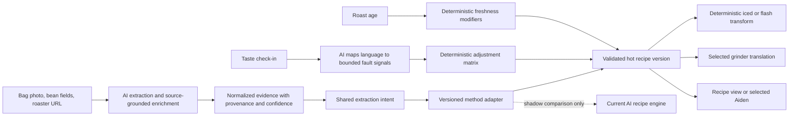
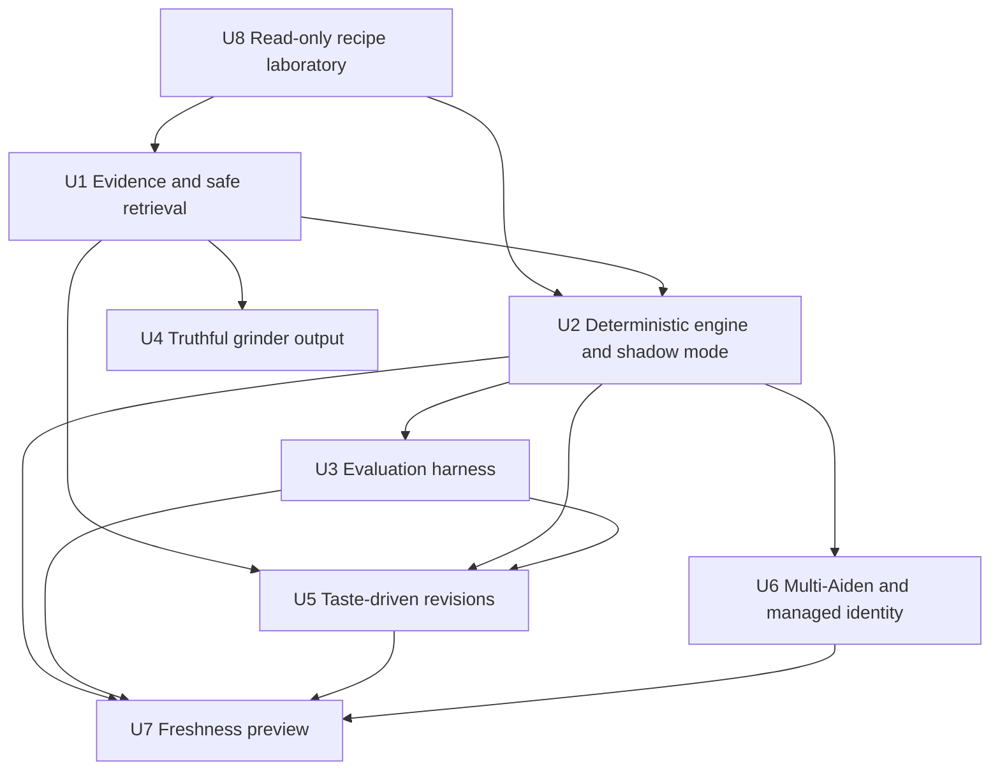

# Hybrid AI and Deterministic Cross-Method Recipe Engine

## Summary

Keep AI where it creates differentiated value—reading bags and roaster pages, resolving incomplete coffee metadata, classifying cup structure, interpreting tasting language, and explaining recommendations—while moving production recipe parameters behind versioned, testable method adapters. First build a read-only recipe laboratory that compares current and candidate output across every registered method, grinder, bean family, freshness state, and hot/iced mode. Roll each method out independently only after shadow evidence supports it, then add truthful grinder translation, taste-driven revisions, selectable Aiden devices, and a narrowly scoped freshness pilot.

---

## Problem Frame

Coffee Hub currently asks `researchBean()` to infer coffee attributes from the saved bean description, then asks either `generateAidenRecipe()` or `generateHandBrewRecipe()` to produce a complete method-specific recipe. Deterministic repair clamps device limits and some grind/family constraints, while flash-brew transforms are already deterministic. This preserves flexibility, but model behavior and model updates can still change ratio, bloom, temperature, timing, technique, and step structure for the same evidence.

The deployed Fellow Aiden Profiler exposes a different public contract: AI reads label/page evidence while an in-house deterministic engine owns device-validated settings. Public derived profiles cite a rules specification, roaster-stated ratios or temperature ceilings, roast/process anchors, micron targets, and repeatable pulse patterns. Its private C# source is not available, so this plan borrows the architectural boundary rather than copying unknown formulas.

---

## Requirements

- R1. Preserve AI-powered bag interpretation, source enrichment, cup-structure classification, sensory reasoning, and user-facing explanations.
- R2. Every production recipe parameter moved to a candidate adapter must be reproducible from a normalized evidence record, an engine version, a method version, and explicit adjustment inputs.
- R3. Research claims must carry provenance and confidence; model memory alone must not be presented as live web research.
- R4. Existing cached recipes and brew links must remain readable during migration, with no forced regeneration.
- R5. The deterministic engine must cover single-serve and batch ratio, bloom, temperatures, pulse counts, intervals, grind target, and device validation.
- R6. AI may advise or critique parameters in shadow evaluation, but it must not silently override the production engine.
- R7. Grinder output must show a setting on the selected grinder or an explicitly approximate micron/directional fallback; raw Ode values must never be labeled as another grinder.
- R8. Structured tasting feedback must create an explainable, bounded Aiden recipe revision from the prior version; cross-method tasting revisions are deferred until the respective adapters pass comparison and brew trials.
- R9. Users with multiple Aidens must choose a target device; server code must not silently select the first device.
- R10. Freshness adjustments must be deterministic, idempotent, opt-in, and observable before any scheduled automatic pushes are enabled.
- R11. Duplicate-title handling must never delete an existing Fellow profile based only on its display title.
- R12. Before any production cutover, a read-only comparator must cover Aiden, V60, Kalita Wave, Chemex, AeroPress, and French Press, plus their iced/flash transforms, across representative bean families, freshness states, doses, and grinder mappings. Each method receives an independent cutover decision.

---

## Scope Boundaries

- No attempt to reproduce the private Fellow Aiden Profiler algorithm without source access.
- No removal of Professor Ruphus, bean research, source insights, or explanatory AI copy.
- No public community coffee catalog in this plan. Canonical roaster identities, provenance, moderation, privacy, and abuse controls require a separate product plan.
- No autonomous recipe changes based on free-form model output.
- No scheduled Freshness AutoPilot production rollout until the shadow evaluation and managed-profile lifecycle are proven.
- No broad subscription or paywall redesign; existing Pro/Ultra gates remain.

### Deferred to Follow-Up Work

- Public or shared recipe catalog with votes/comments and official-source markers.
- Bulk import of the other app's catalog or data; its terms and data quality make this inappropriate.
- New brewer families beyond the methods already registered in Coffee Hub. Espresso and true cold brew are not current recipe engines and are outside this comparison.
- Taste-driven automatic revisions for V60, Kalita Wave, Chemex, AeroPress, or French Press; this plan validates their candidate adapters first and keeps the initial closed-loop revision feature Aiden-only.

---

## Context & Research

### What Coffee Hub Does Today

- `src/lib/beanResearch.js` builds a source context from bean fields, freshness status, roaster category, and stored source insights, then asks GPT to infer altitude, roast, density, extraction notes, cup family, and reference matches.
- Despite its name, `researchBean()` does not currently fetch the live web. Claims not supplied through `sourceInsights` come from model knowledge and inference.
- `src/lib/aiden.js` asks GPT for complete recipe JSON. `repairRecipe()` deterministically validates the schema, replaces grind, and adds washed/Kenya guardrails, but most ratio/bloom/temperature/pulse decisions originate in the model response.
- `src/lib/handbrew.js` asks GPT for complete V60, Kalita Wave, Chemex, AeroPress, and French Press recipe JSON, then applies deterministic device bounds and repair.
- `src/lib/flashBrewTransform.js` already derives iced Aiden, pour-over, and immersion variants deterministically from the hot recipe.
- `src/lib/brewMethods.js` translates Ode steps through approximate linear micron scales. `src/components/AidenModal.jsx` bypasses that translation and labels raw values with the selected grinder name.
- `src/hooks/useAidenBrew.js` caches recipes by source-context hash, but does not include linked tastings as recipe inputs.
- `api/aiden.js` uses the first device returned by Fellow and deletes title-matching profiles when resolving a duplicate.
- The existing cross-method audit and Aiden grind regression are not yet a trustworthy baseline: the manual audit fails while loading its temporary module, and the grind regression imports formatter exports that are not present. Repair these before interpreting candidate deltas.

### What Is Publicly Knowable About Fellow Aiden Profiler

- Its public copy says AI reads bag/page content and every brew number comes from a deterministic engine.
- Sampled derived profiles explicitly cite a rules specification and expose evidence precedence such as “roaster-stated ratio,” “roaster-stated temperature ceiling,” and fallback roast anchors.
- Observed light-natural profiles use a high bloom ratio, multiple declining-temperature pulses, and separate batch behavior; medium/darker profiles use lower temperatures and different bloom/pulse patterns.
- Official Fellow profiles are preserved as official sources rather than blended indistinguishably with community-derived recipes.
- The product supports taste check-ins, recipe versions, micron-first grinder translation, multiple registered grinders, multiple Aidens, and an age curve.
- Exact thresholds, source precedence rules, adjustment matrices, validation code, job scheduling, and database design are not present in browser assets and remain unknown without repository access.

### Institutional Learnings

- Follow `docs/solutions/logic-errors/grind-size-display-toggle-unwired.md`: grinder labels and formatted values need one shared formatter, not component-local fallback chains.
- Follow the source normalization and prompt-injection boundary in `src/lib/sourceInsights.js` when introducing evidence provenance.
- Preserve the request cancellation and stale-result protections already present in `src/hooks/useAidenBrew.js`.

### External References

- Fellow Aiden Profiler product behavior: https://fellowaidenprofiler.com/
- Freshness and premium behavior: https://fellowaidenprofiler.com/premium
- Public sample profiles used only for architectural comparison, not copied data:
  - https://fellowaidenprofiler.com/coffees/d0e805b7-475e-4008-91af-74c77baf01b0
  - https://fellowaidenprofiler.com/coffees/21e6826c-0699-4d29-b03a-0c2cdaf45df5
  - https://fellowaidenprofiler.com/coffees/8bc4ac76-597b-476e-a648-79876dfe8eeb

---

## Key Technical Decisions

- **Use a hybrid boundary, not “AI versus no AI.”** AI creates a normalized evidence/advice layer; deterministic code owns machine parameters.
- **Make evidence explicit.** Each fact records source type, value, confidence, and provenance so the engine can prefer bag/roaster/official facts over inference.
- **Treat AI inference as lower confidence.** Missing facts may be inferred, but the UI and engine can distinguish them from sourced facts and choose conservative defaults.
- **Version both evidence and recipes.** Persist `evidenceVersion`, `engineVersion`, and adjustment lineage so the same historical recipe can be explained or reproduced.
- **Share intent, not device formulas.** Normalize each bean into a common extraction intent—cup family, solubility/energy target, clarity/body target, freshness modifier, and confidence—then let each brewer adapter own its physically different ratio, grind, temperature, timing, technique, and step rules.
- **Shadow before cutover.** Generate deterministic and legacy-AI profiles side by side without changing what reaches the brewer; compare safety, stability, and taste outcomes first.
- **Cut over per method, never as one global switch.** Aiden can pass while Chemex or AeroPress remains on the current engine. Hot and iced variants require separate gates because iced transforms amplify grind, temperature, and dilution changes.
- **Use deterministic adjustment matrices.** AI translates free-form tasting text into structured fault signals; bounded rules decide which recipe variables change.
- **Separate ephemeral shares from managed profiles.** Existing brew-link behavior can remain ephemeral, while freshness automation requires one explicitly managed profile per bean/device with a stored remote ID.
- **Defer community features.** Recipe quality and the closed-loop personal experience are higher-value and lower-risk than building a public moderation platform now.

---

## High-Level Technical Design

> *This illustrates the intended approach and is directional guidance for review, not implementation specification. The implementing agent should treat it as context, not code to reproduce.*

---

## Implementation Units

- U8. **Build and freeze the read-only cross-method recipe laboratory**

**Goal:** Establish exactly what the current engine produces and make every candidate change visible before any recipe is saved, shown as production, or sent to Fellow.

**Requirements:** R4, R7, R12

**Dependencies:** None

**Files:**
- Create: `scripts/lib/recipeEvaluationContract.mjs`
- Create: `scripts/recipe-engine-baseline.mjs`
- Create: `scripts/recipe-engine-compare.mjs`
- Create: `scripts/recipe-engine-compare.test.mjs`
- Create: `docs/data/recipe-evaluation-beans.json`
- Create: `docs/data/recipe-engine-current-baseline.json`
- Modify: `scripts/manual-recipe-quality-audit.mjs`
- Modify: `scripts/aiden-grind-display-regression.test.mjs`

**Approach:**
- Repair the two currently failing recipe/grind audits first and make them part of the baseline gate.
- Define one normalized comparison shape for ratio, dose/water, grind in native notation and approximate microns, temperature, bloom, pulse/step timing, technique, total brew time, iced dilution, explanation, repairs, and validation failures.
- Curate representative beans across all nine classifier outputs, sparse/contradictory metadata, decaf, roast levels, dense/high-altitude cases, and fresh/peak/fading/stale states. Explicitly expose that `generic-washed` and `body-natural` currently fall through to the hand-brew default because manual-brewer tables define only seven families. Include a small set of real Coffee Hub beans only after redacting user-private fields.
- Run the current AI engine multiple times per bean and method during an explicit networked baseline-capture command. Record output spread as current-engine variance; never call external models from the deterministic regression test suite.
- Freeze reviewed current outputs as immutable fixtures with prompt/model/version metadata. Tests replay the fixtures through normalization, device repair, grinder formatting, scaling, and iced transforms without API, Firestore, or Fellow writes.
- Enumerate methods from `BREW_METHODS`, excluding only the deprecated `handbrew` alias, so a newly registered method cannot silently escape the matrix.
- Compare a candidate adapter against the frozen baseline over method × hot/iced × bean case × supported grinder × representative dose. Generate JSON plus a human-readable Markdown/HTML report; do not persist candidate recipes to beans.

**Diff report for every case:**
- Before and after native grinder setting, approximate microns, and mapping confidence.
- Ratio, dose, total water, temperature, bloom, pulse/step count and timing, technique, total brew time, and iced water/ice split.
- Evidence/reason code for each changed parameter, whether the change is within device limits, and whether it moves extraction energy up or down.
- Hard-gate result, current-engine variance band, and whether the candidate delta is larger than the current model's own run-to-run variation.

**Test scenarios:**
- All six registered methods appear in both hot and iced coverage; the deprecated alias does not create duplicate cases.
- Every supported grinder is rendered in its native notation when calibrated and as an explicitly approximate micron/directional fallback otherwise.
- A candidate change that only renames explanation text does not register as a physical recipe change.
- A grind change is reported in both native setting and microns; cross-grinder comparisons never compare raw dial numbers directly.
- Missing research, missing roast date, unknown grinder, malformed current fixture, and failed candidate generation remain visible as unknown/error rather than being scored as wins.
- `generic-washed` and `body-natural` report their current manual-brewer fallback and cannot be marked equivalent to an explicit family rule.
- The comparator cannot import Firestore mutation helpers or the Fellow push endpoint and produces no network traffic in replay mode.

**Verification:**
- One command produces a complete, side-by-side report for the current engine and any candidate across every registered recipe path.
- The baseline suite is green and deterministic before U1 or U2 changes recipe behavior.
- Product cutover remains impossible from this laboratory; its output is evidence only.

- U1. **Establish evidence, retrieval, and recipe contracts**

**Goal:** Create the normalized, versioned contracts that separate sourced facts, inferred advice, engine inputs, and recipe outputs.

**Requirements:** R1, R2, R3, R4, R6

**Dependencies:** U8

**Files:**
- Create: `src/lib/recipeEvidence.js`
- Create: `src/lib/recipeContracts.js`
- Create: `api/bean-source.js`
- Modify: `src/lib/sourceInsights.js`
- Modify: `src/lib/beanResearch.js`
- Test: `scripts/aiden-evidence-contract.test.mjs`
- Test: `scripts/bean-source-retrieval.test.mjs`

**Approach:**
- Normalize bag fields, stored source insights, roaster-page evidence, official-profile evidence, and model inferences into one bounded evidence record.
- Record provenance and confidence per fact, with deterministic source precedence.
- Add an authenticated server-side retrieval path for a user-supplied roaster URL. Permit only public HTTP(S) destinations; revalidate every redirect and resolved address; reject loopback, link-local, private-network, credential-bearing, and non-web URLs; enforce content-type, response-size, redirect-count, and timeout limits; and rate-limit requests per user.
- Extract factual page content into sanitized source insights while retaining the canonical URL, retrieval timestamp, and a content hash. Treat retrieved text as untrusted data, never as model or system instructions.
- On blocked, unavailable, oversized, or unsupported pages, preserve the user's manual bean fields and downgrade cleanly to labeled inference instead of failing recipe generation.
- Rename or reframe the current model-only “research” path so it cannot imply live verification when no external source was retrieved.
- Keep existing bean fields and cached recipes backward-compatible.

**Execution note:** Implement the contracts and precedence scenarios test-first because every later unit depends on their stability.

**Patterns to follow:**
- Sanitization, normalization, and stable hashing in `src/lib/sourceInsights.js`.
- Source-context cache invalidation in `src/hooks/useAidenBrew.js`.

**Test scenarios:**
- Happy path: bag and roaster page agree on process and roast -> sourced values win and retain both provenance entries.
- Edge case: model inference conflicts with a bag value -> bag value wins and inference remains advisory.
- Edge case: no external source exists -> evidence marks inferred fields as inferred instead of verified.
- Error path: malformed or instruction-like source text -> sanitization preserves factual content and removes executable instructions.
- Error path: redirects to a private address, DNS rebinding, an oversized response, unsupported media, timeout, and rate-limit exhaustion are rejected without leaking fetched content or internal network details.
- Fallback: roaster page unavailable -> user-entered facts remain sourced to the user and model-derived fields remain explicitly inferred.
- Migration: a legacy bean without evidence metadata still produces a valid conservative input record.

**Verification:**
- Any recipe input can be traced to a source or explicitly labeled inference.
- Changing recipe-relevant evidence changes the stable input hash; presentation-only changes do not.

- U2. **Build the shared intent engine, deterministic method adapters, and shadow evaluator**

**Goal:** Produce a common extraction intent and complete device-specific candidate recipes deterministically while retaining the current AI generators as the production control during shadow evaluation.

**Requirements:** R2, R4, R5, R6, R12

**Dependencies:** U8, U1

**Files:**
- Create: `src/lib/aidenRuleEngine.js`
- Create: `src/lib/aidenRuleTables.js`
- Create: `src/lib/recipeIntentEngine.js`
- Create: `src/lib/handBrewRuleEngine.js`
- Create: `src/lib/handBrewRuleTables.js`
- Create: `src/lib/aidenShadowEvaluation.js`
- Modify: `src/lib/aiden.js`
- Modify: `src/lib/handbrew.js`
- Modify: `src/hooks/useAidenBrew.js`
- Modify: `src/hooks/useHandBrew.js`
- Test: `scripts/aiden-rule-engine.test.mjs`
- Test: `scripts/handbrew-rule-engine.test.mjs`
- Test: `scripts/aiden-shadow-evaluation.test.mjs`

**Approach:**
- Convert normalized evidence into a versioned shared extraction intent, then encode Aiden, pour-over, immersion-pressure, and full-immersion rules as separate pure adapters.
- Keep method physics separate: Aiden owns single/batch pulses; V60/Kalita/Chemex own pour structure and drawdown targets; AeroPress owns steep/press/bypass behavior; French Press owns full-immersion timing and settling.
- Encode recipe families, source precedence, roast/process anchors, age inputs, ratio/bloom/pulse/step rules, grind targets, and device limits as versioned data plus pure transforms.
- Prefer explicit roaster/official guidance within safe bounds; otherwise use conservative family baselines.
- Produce explanation codes alongside parameters so UI copy can explain the result without asking a model to reconstruct causality.
- During shadow mode, record deterministic-versus-current differences without changing the recipe shown/saved or the profile sent to Fellow. Enable shadow and cutover flags independently per method and hot/iced mode.

**Execution note:** Use golden characterization fixtures from current reference profiles before moving any production behavior.

**Patterns to follow:**
- Current schema repair and family classification in `src/lib/aiden.js` and `src/lib/beanFields.js`.
- Pure deterministic expectations in `src/lib/tastingExpectations.js`.

**Test scenarios:**
- Happy paths: washed floral, washed Kenya, washed Ethiopia, clean natural, body natural, processed clarity, generic washed, medium washed, dark roast, and decaf cases produce complete valid profiles through all six method adapters.
- Evidence precedence: safe roaster-stated ratio/temperature overrides a family default; unsafe guidance is bounded with an explanation.
- Stability: identical evidence and engine version always produce byte-equivalent parameter output.
- Boundary: every Fellow minimum/maximum, pulse-array length, and allowed grind step is respected.
- Aiden batch: batch output is independently derived and never a blind copy of single-serve.
- Manual methods: technique, steps, and target time remain physically appropriate to the selected brewer rather than sharing a generic pour-over script.
- Iced: deterministic transforms preserve dilution totals and surface any inherited hot-recipe delta.
- Migration: existing cached AI recipe remains displayable; regeneration creates a new deterministic recipe version.
- Shadow: large divergence is recorded for review but never silently switches the production output.

**Verification:**
- A fixed evaluation corpus produces stable outputs across repeated runs.
- Production cutover is feature-flagged and reversible per method and hot/iced mode without deleting cached recipes.

- U3. **Score cross-method recipe quality and run blind brew trials**

**Goal:** Decide per method whether deterministic, current AI, or a revised rule table is better using repeatable machine checks and blinded tasting evidence rather than intuition.

**Requirements:** R2, R5, R6, R12

**Dependencies:** U8, U2

**Files:**
- Create: `scripts/recipe-engine-evaluation.mjs`
- Create: `docs/data/recipe-engine-evaluation-fixtures.json`
- Create: `docs/data/recipe-engine-evaluation-rubric.md`
- Create: `docs/data/recipe-blind-brew-protocol.md`
- Modify: `scripts/aiden-ab-test.mjs`
- Test: `scripts/recipe-engine-evaluation.test.mjs`

**Approach:**
- Reuse the U8 matrix spanning roast, process, origin, density, age, sparse data, method, hot/iced mode, dose, grinder, and official-reference cases.
- Score device validity, deterministic stability, evidence fidelity, family appropriateness, grind plausibility, water/dose consistency, timing coherence, and taste feedback when available.
- For real brews, randomize current/candidate labels, hold bean, water, dose, grinder, and operator constant, repeat disputed cases, and capture structured tasting axes before revealing the recipe identity.
- Separate hard safety/correctness gates from sensory preferences. A technically valid recipe is not declared better without brew evidence, and a preferred cup cannot excuse an invalid or mislabeled recipe.
- Keep public Aiden Profiler samples as qualitative comparison points only; do not ingest its catalog.

**Test scenarios:**
- Golden fixtures fail when an engine change unexpectedly alters a protected profile.
- Deliberately unsafe input is rejected or bounded and scored as safe.
- Evaluation distinguishes sourced facts from inferred claims.
- Missing tasting outcomes are reported as unknown, not treated as successful brews.

**Verification:**
- The team can compare engine versions and current AI on one report with explicit regressions and unresolved cases for every registered method.
- Cutover criteria and blind-brew minimums are documented per method before any deterministic adapter becomes authoritative.

- U4. **Make grinder output truthful and support multiple grinders**

**Goal:** Show consistent grinder-specific values across every Aiden surface and allow users to save more than one grinder.

**Requirements:** R7

**Dependencies:** U1

**Files:**
- Modify: `src/lib/brewMethods.js`
- Modify: `src/components/AidenModal.jsx`
- Modify: `src/components/SettingsPage.jsx`
- Modify: `src/hooks/useUserProfile.jsx`
- Modify: `firestore.rules`
- Test: `scripts/aiden-grind-display-regression.test.mjs`
- Test: `scripts/multi-grinder-preferences.test.mjs`

**Approach:**
- Replace component-local raw values with one canonical formatter returning grinder setting, microns, approximation status, and display label.
- Replace unverified linear conversions with calibrated mappings or explicitly approximate fallbacks.
- Store a grinder list plus default grinder while reading the legacy single preference during migration.

**Test scenarios:**
- Each supported grinder shows the expected setting and never an Ode value under another label.
- Micron mode is consistent across cards, Aiden modal, archive, edit, and chat context.
- Unknown/custom grinder shows microns and direction rather than invented clicks.
- Legacy single-grinder preference migrates without losing the selected grinder.
- Existing broken Aiden grind regression test imports and executes successfully.

**Verification:**
- One formatter supplies every Aiden grind display surface.
- Saved multi-grinder preferences pass Firestore validation and preserve old profiles.

- U5. **Add deterministic taste-driven Aiden recipe revisions**

**Goal:** Turn an existing tasting into a transparent Aiden v2 recipe without allowing free-form AI output to change machine settings directly.

**Requirements:** R1, R2, R8

**Dependencies:** U1, U2, U3

**Files:**
- Create: `src/lib/aidenTasteSignals.js`
- Create: `src/lib/aidenTasteAdjustments.js`
- Modify: `src/hooks/useAidenBrew.js`
- Modify: `src/components/AidenModal.jsx`
- Modify: `src/components/TastingDetailCard.jsx`
- Modify: `src/hooks/useAppData.js`
- Test: `scripts/aiden-taste-adjustments.test.mjs`
- Test: `scripts/aiden-recipe-versioning.test.mjs`

**Approach:**
- Map structured tasting axes directly; use AI only to translate optional prose into bounded signals such as sour/under-extracted, bitter/over-extracted, astringent, weak, heavy, or hollow.
- Apply a deterministic, one-change-at-a-time adjustment matrix with conflict resolution and device bounds.
- Persist parent version, tasting ID, changed parameters, and explanation codes.

**Test scenarios:**
- Sour/weak feedback makes the allowed extraction-increasing change and records why.
- Bitter/astringent feedback chooses a bounded extraction-reducing change without compounding every parameter.
- Conflicting signals produce a clarification/no-change result rather than arbitrary output.
- Replaying the same tasting against the same recipe is idempotent.
- A tasting for another bean cannot affect the active recipe.

**Verification:**
- Users can see what changed from v1 to v2 and which tasting caused it.
- AI-produced text signals cannot bypass the deterministic adjustment allowlist.

- U6. **Add safe multi-Aiden targeting and managed-profile identity**

**Goal:** Let users choose the correct brewer and eliminate destructive title-based profile cleanup.

**Requirements:** R9, R11

**Dependencies:** U2

**Files:**
- Modify: `api/fellow.js`
- Modify: `api/aiden.js`
- Modify: `src/components/SettingsPage.jsx`
- Modify: `src/components/AidenModal.jsx`
- Modify: `src/hooks/useUserProfile.jsx`
- Modify: `firestore.rules`
- Test: `scripts/aiden-device-selection.test.mjs`
- Test: `scripts/aiden-profile-lifecycle.test.mjs`

**Approach:**
- Discover and store safe device metadata, with a selected default and per-push override.
- Validate that requested device IDs belong to the authenticated Fellow account.
- Never delete a profile found only by title. Track remote IDs created or managed by Coffee Hub and clean up only those IDs.
- Preserve ephemeral brew-link creation as the default lifecycle; introduce managed identity only where future updates require it.

**Test scenarios:**
- One-device account defaults correctly; multi-device account requires or respects an explicit selection.
- Stale/deleted selected device triggers rediscovery and a user-facing choice.
- Caller-supplied device ID from another account is rejected.
- Duplicate title never deletes an untracked existing profile.
- Failed share/delete leaves a recoverable tracked state rather than guessing by title.

**Verification:**
- Every push is attributable to a selected device and tracked lifecycle record.
- The existing profile-deletion hazard is removed before managed profiles are introduced.

- U7. **Pilot deterministic freshness adjustments in shadow mode**

**Goal:** Prove an age-based recipe curve and managed-profile update lifecycle without automatically changing a real brewer at first.

**Requirements:** R2, R10

**Dependencies:** U2, U3, U5, U6

**Files:**
- Create: `src/lib/aidenFreshnessAdjustments.js`
- Create: `api/aiden-freshness-preview.js`
- Modify: `src/components/AidenModal.jsx`
- Modify: `vercel.json`
- Test: `scripts/aiden-freshness-adjustments.test.mjs`
- Test: `scripts/aiden-freshness-idempotency.test.mjs`

**Approach:**
- Start with preview-only age modifiers derived from explicit freshness phases and engine-versioned rules.
- Show today’s versus future parameter changes and explanations without pushing automatically.
- Instrument opt-in, eligibility, intended update, skipped update, and failure states.
- Treat scheduled automatic push as a later rollout gate requiring authorization, idempotency, locking, retry policy, and alerting.

**Test scenarios:**
- Fresh, peak, resting/fading, frozen, future roast date, and missing roast date produce safe outcomes.
- Same bean/day/engine version cannot create duplicate updates.
- Manual taste revision becomes the new baseline for later age adjustments.
- Preview endpoint rejects unauthenticated requests and cannot mutate Fellow state.
- Device or credential failure produces an observable skipped state.

**Verification:**
- Users can preview and understand freshness changes before any automatic write is enabled.
- A production-autopilot decision can be made from shadow metrics and failure data rather than assumption.

---

## Phased Delivery

### Phase 0: Measurement before behavior change

- U8 repair the existing audits, freeze current-engine fixtures and variance, and produce the read-only all-method diff report
- No Firestore writes, Fellow pushes, cached-recipe replacement, UI cutover, or production recipe changes

### Phase 1: Correctness foundation

- U1 evidence contract
- U2 shared intent and deterministic method adapters in shadow mode
- U3 cross-method evaluation and blinded brew protocol
- U4 truthful grinder output
- Immediate safety portion of U6: remove title-based deletion

### Phase 2: Closed-loop personal brewing

- U5 taste-driven revisions
- Remaining U6 multi-device targeting and managed identity

### Phase 3: Freshness pilot

- U7 preview and shadow instrumentation
- Separate go/no-go decision before scheduled brewer mutation

---

## System-Wide Impact

- **Interaction graph:** Bag scan, source insights, recipe generation, caching, tasting persistence, grinder preferences, Fellow credentials/devices, and recipe push all gain a shared evidence/version contract.
- **Error propagation:** Source retrieval failure must degrade to labeled inference; engine failure must stop before push; device failure must preserve the recipe and actionable recovery state.
- **State lifecycle risks:** Legacy recipe migration, duplicated revisions, stale device IDs, unmanaged remote profiles, and concurrent freshness/taste updates require explicit lineage and idempotency.
- **API surface parity:** Quick Recipe, Rotation, Inventory, archive, chat context, and native/web views must format the same recipe version and grinder values.
- **Integration coverage:** Cross-layer tests must prove evidence changes invalidate recipes, tasting revisions persist, selected device reaches the server, and no untracked profile is deleted.
- **Unchanged invariants:** Existing beans, tastings, cached recipes, brew links, Firebase ownership boundaries, and Pro/Ultra gates remain valid throughout rollout.

---

## Risks & Dependencies

| Risk | Mitigation |
|------|------------|
| Deterministic rules initially taste worse than the current model | Shadow evaluation, golden corpus, feature-flagged cutover, and version rollback |
| A shared intent accidentally erases real brewer differences | Keep device physics in separate adapters and gate each method independently |
| The test matrix becomes too expensive because current recipes call AI | Capture networked current outputs explicitly, cache immutable fixtures, measure variance on a bounded anchor subset, and replay all grinder/dose/iced combinations offline |
| “Research” still hallucinates facts | Provenance/confidence contract and source-grounded retrieval before verified claims |
| Rule tables become another opaque prompt | Data-driven versioned rules, explanation codes, focused fixtures, and documented precedence |
| Grinder conversions imply false precision | Calibrated mappings where supported; explicit approximation/microns otherwise |
| Taste feedback causes over-correction | One-change-at-a-time bounded matrix and deterministic conflict handling |
| Freshness automation modifies the wrong profile/device | Explicit device selection, managed remote IDs, opt-in preview, idempotency, and delayed mutation rollout |
| Fellow's unofficial API changes | Timeouts, rediscovery, circuit-breaker behavior, observable failures, and brew-link fallback |
| Roaster-page retrieval is abused as an SSRF or prompt-injection path | Authenticated/rate-limited retrieval, public-address enforcement across redirects and DNS resolution, strict response limits, sanitized extraction, and untrusted-source boundaries |
| Scope expands into a social network | Community catalog remains a separate follow-up plan |

---

## Success Metrics

- Identical evidence and engine version produce identical profiles in 100% of repeated evaluations.
- Every registered method appears in hot and iced comparison coverage, and a missing method fails the matrix test.
- No candidate recipe is saved, displayed as production, or pushed during Phase 0.
- Zero raw Ode settings are labeled as another grinder in regression coverage.
- Zero profile deletions occur without a Coffee Hub-tracked remote profile ID.
- Shadow evaluation has no Fellow-device validity regressions against the legacy generator.
- Every production recipe exposes evidence provenance, engine version, and explanation codes.
- Taste revisions are attributable to one tasting and reproducible from stored inputs.
- Freshness preview produces no duplicate intended updates for the same bean/day/version.
- Each method has an independent hard-gate result and blinded-brew decision; passing Aiden cannot authorize a V60, Chemex, AeroPress, or French Press cutover.

---

## Open Questions

### Resolved During Planning

- **Should AI be removed from recipes entirely?** No. Keep it for extraction, classification, uncertainty handling, tasting-language translation, critique, and explanation; remove its authority to directly set production machine parameters.
- **Can the other app's browser code reveal its algorithm?** No. It is Blazor Server; its private C# services and rule tables are not sent to the browser. Public profile outputs support architectural inference only.
- **Should the community catalog ship with the engine?** No. It is valuable but materially different work with moderation and data-governance requirements.

### Deferred to Implementation

- Final rule-table values after the evaluation corpus exposes where current family bands are weak.
- Which grinder mappings have sufficiently reliable calibration data to be labeled exact rather than approximate.
- Whether source-grounded roaster-page retrieval extends an existing enrichment endpoint or needs a dedicated server endpoint after SSRF and content-limit review.
- Production Freshness AutoPilot scheduling architecture; preview/shadow evidence must precede that choice.
- Exact cutover thresholds for deterministic versus legacy AI, to be set before U2 leaves shadow mode.

---

## Documentation / Operational Notes

- Document the distinction between sourced fact, model inference, engine decision, and user adjustment in user-facing privacy/AI copy.
- Record engine and rule-table version in support diagnostics without exposing private bean data.
- Add monitoring for source retrieval failures, engine validation failures, legacy-versus-engine divergence, Fellow API errors, and managed-profile cleanup.
- Obtain the Fellow Aiden Profiler repository or an architecture note from its owner if an exact algorithm comparison is still desired; update this plan only with verified findings.

---

## Sources & References

- Existing Fellow integration requirements: `docs/brainstorms/2026-04-05-fellow-multi-user-aiden-requirements.md`
- Existing multi-user implementation plan: `docs/plans/2026-04-05-009-feat-multi-user-fellow-aiden-integration-plan.md`
- Existing prompt investigation: `docs/prds/aiden-prompt-fix-prd.md`
- Existing grinder display learning: `docs/solutions/logic-errors/grind-size-display-toggle-unwired.md`
- Current research layer: `src/lib/beanResearch.js`
- Current recipe generation and repair: `src/lib/aiden.js`
- Current Aiden orchestration: `src/hooks/useAidenBrew.js`
- Current Fellow server integration: `api/aiden.js`, `api/fellow.js`
- Current source normalization: `src/lib/sourceInsights.js`
- Current grinder translation: `src/lib/brewMethods.js`
