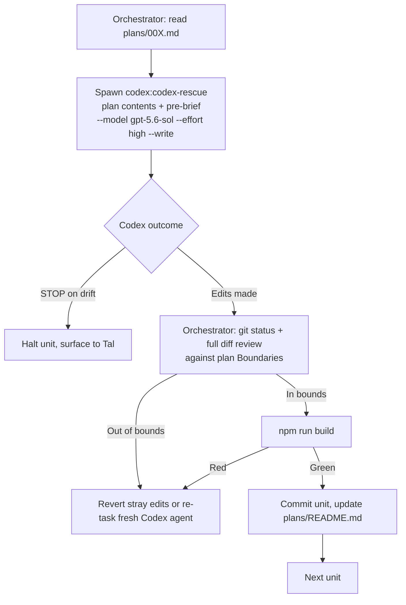

# feat: Animation polish master plan (orchestrated execution of plans/001-007)

## Summary

Execute the seven self-contained animation plans in `plans/` (repo root, distinct from `docs/plans/`) as one coordinated run: Claude Fable 5 orchestrates (branching, sequencing, diff review, builds, commits, ship), and one Codex subagent (GPT-5.6 Sol, effort high, write-capable) implements each plan. The per-plan files stay the source of truth for exact values, code excerpts, and boundaries; this plan owns sequencing, the orchestration contract, and verification gates.

## Problem Frame

The seven plans (Settings sheet presentation, scan-save arrival, success-feedback wiring, card press feedback, Ruphus slide-up exit, Quick Recipe menu pop-in, ScanSheet step transitions) were written for zero-context executors, but they share files, carry ordering constraints, and need an orchestration layer: who implements, who verifies, what gates a commit, and how device-only behavior (haptics, WKWebView) gets checked. Without a master plan, the file conflicts (ScanSheet.jsx in both 002 and 007) and the WKWebView portal risk in 001 are easy to trip.

---

## Requirements

**Motion outcomes** (each defined in full by its source plan; the plan file is the requirement)

- R1. `plans/001-settings-sheet-presentation.md` implemented: SettingsPage scrim/sheet enter and exit, inner dialogs animated, dead transition removed.
- R2. `plans/002-scan-save-arrival.md` implemented: success haptic on scan-save plus the `isNewBean` CSS cascade.
- R3. `plans/003-success-feedback-wiring.md` implemented: haptics and confirmations on the five silent success paths.
- R4. `plans/004-card-press-feedback.md` implemented: 0.985 press on ShelfCard, ArchiveEntry, CupCardSmall.
- R5. `plans/005-ruphus-slideup-exit.md` implemented: symmetric CSS exit for the lesson sheet.
- R6. `plans/006-quick-recipe-menu-popin.md` implemented: BrewMethodMenu-parity pop-in and row press.
- R7. `plans/007-scan-sheet-step-transitions.md` implemented: fadeUp steps and popIn error in ScanSheet.

**Orchestration**

- R8. Every implementation edit is made by a Codex subagent (GPT-5.6 Sol, effort high, write-capable), one plan per task, fresh agent per task, prompt self-contained.
- R9. The orchestrator reviews each Codex diff against the source plan's Boundaries section before committing; any STOP-on-drift report from Codex halts that unit and is surfaced to Tal rather than improvised around.
- R10. Work lands on a fresh branch; the pre-existing uncommitted changes are preserved in a `wip(pre-existing-baseline)` commit at the branch root and are never edited or mixed into an animation commit.

**Verification**

- R11. `npm run build` is green after every unit; each plan lands as its own commit.
- R12. The run ends with `/ship-dev` and a device feel-check checklist covering all seven plans, since haptics and WKWebView behavior only verify on Tal's iPhone.
- R13. `plans/README.md` statuses are updated as units land (DONE for code-complete and build-green, with device verification noted as pending until Tal signs off).

---

## Key Technical Decisions

- **Fresh branch off the current checkout**: the seven plans' line references and verbatim excerpts were verified against this exact working tree (HEAD `ec777a5` plus local modifications). Branching elsewhere (e.g. `redesign`) would invalidate them. The pre-existing dirty state is parked as a clearly-labeled `wip(pre-existing-baseline)` commit at the branch root (excluded from animation-diff review scope; dropped or cherry-picked away at merge time) so every unit diff is clean and the protected hunks can neither be mixed into an animation commit nor destroyed by a revert. The `plans/` directory (currently untracked) is committed as the branch's first content commit so the run's inputs exist in git history.
- **Serial Codex execution, one task at a time**: all tasks share one working tree and each commit gates the next unit's line-reference validity. No parallel Codex runs.
- **Codex is code-only; the orchestrator owns everything else**: Codex sandboxes cannot bind ports or deploy, and may leave work uncommitted. Codex edits files and runs `npm run build`; the orchestrator checks `git status` (not just `git log`) after every task, reviews the diff, commits, and ships.
- **Codex invocation shape**: spawn the `codex:codex-rescue` subagent once per unit. The forwarded task text embeds the full source plan contents plus the pre-brief pack (below) and the flags `--model gpt-5.6-sol --effort high --write --wait` (`--wait` forces foreground execution so the subagent's return is the actual Codex outcome, not a background-launch acknowledgment). Fresh agent per unit — Codex resume goes stale in this repo. Verify the exact model string against the installed Codex CLI's model list during U1; if `gpt-5.6-sol` is not the accepted identifier, use the CLI's listed name for GPT-5.6 Sol.
- **Pre-brief pack in every Codex prompt**: (1) CSS keyframes for entrance/visibility on portalled surfaces, framer only for interaction; (2) Liquid Glass tint/sheen gradients and `filter: brightness` press are approved patterns, ambient infinite loops are exempt from the 300ms micro-interaction rule; (3) new CSS keyframes need their own `prefers-reduced-motion` guards even though `MotionConfig reducedMotion="user"` covers framer; (4) no new dependencies; (5) if the code does not match the plan's verbatim excerpts, STOP and report instead of improvising — the excerpts are the drift authority, not the `ec777a5` commit stamp; (6) finish by running `npm run build` and leave all changes uncommitted.
- **Plan 001 proceeds with AnimatePresence-in-portal despite the lessons.md portal warning**: the wizard's framer-in-portal failure is real, but `Modal.jsx` uses the exact target pattern and is device-verified across every sheet in the app. The plan's own device gate (sheet visible after 5 consecutive opens on device) is the arbiter; if it fails, fall back to the CSS closing-class pattern from plan 005. This risk is why 001 runs first — earliest device signal on the riskiest pattern.
- **Ordering**: 001 first (risk), then the independent small units (004, 006, 005), then 007 before 002 (both touch `src/components/ScanSheet.jsx`; 007 edits the render tree, 002 the save handler), then 003 last (five files of small insertions; running last minimizes line drift).

---

## High-Level Technical Design

Per-unit orchestration loop (directional guidance, not implementation specification):

Unit sequence: U1 preflight, then U2 (001), U3 (004), U4 (006), U5 (005), U6 (007), U7 (002), U8 (003), U9 ship. Strictly serial.

---

## Implementation Units

### U1. Branch and preflight

- **Goal**: a clean, verified starting point for the run.
- **Requirements**: R10, R11 baseline.
- **Dependencies**: none.
- **Files**: none modified (git branch operation plus read-only checks).
- **Approach**: create the working branch from the current checkout; park the pre-existing dirty state as a `wip(pre-existing-baseline)` commit at the branch root; commit the `plans/` directory (all seven plans plus README) as the first content commit. Confirm the baseline build is green before any edits. Spot-check one cited excerpt per source plan (seven checks) to confirm no drift since the plans were written — the excerpt text is authoritative for drift, not the `ec777a5` stamp (excerpts were read from the dirty tree). Confirm the Codex CLI is available and resolve the exact GPT-5.6 Sol model identifier.
- **Test scenarios**: Test expectation: none — scaffolding/preflight; the checks themselves are the outcomes.
- **Verification**: baseline `npm run build` green; all seven spot-checks match; Codex CLI ready with the model identifier resolved; branch created with the wip-baseline and `plans/` commits in place and `git status` clean.

### U2. Execute plan 001 — SettingsPage sheet presentation (Codex)

- **Goal**: R1 landed as a commit.
- **Requirements**: R1, R8, R9, R11.
- **Dependencies**: U1.
- **Files**: `src/components/SettingsPage.jsx` (see `plans/001-settings-sheet-presentation.md` for exact edits).
- **Approach**: one Codex task carrying plan 001 verbatim plus the pre-brief pack. Orchestrator reviews the diff against the plan's Boundaries (no drag-to-dismiss, no z-index/portal-target changes, `data-settings-page` preserved), builds, commits.
- **Test scenarios**: as enumerated in plan 001's Verification section — key ones: sheet slides up with scrim fade on open and reverses on close; Delete Account dialog scales in from 0.94 and animates out; nothing gets stuck invisible. Device check (5 consecutive opens) is deferred to U9's device pass.
- **Verification**: diff within boundaries, build green, commit landed, `plans/README.md` status updated.

### U3. Execute plan 004 — card press feedback (Codex)

- **Goal**: R4 landed as a commit.
- **Requirements**: R4, R8, R9, R11.
- **Dependencies**: U1 (independent of U2 but run after it, serial rule).
- **Files**: `src/components/ShelfCard.jsx`, `src/tabs/ArchiveTab.jsx` (see `plans/004-card-press-feedback.md`).
- **Approach**: one Codex task; boundaries emphasize scale 0.985 only and no touches to the hero-morph, ParallaxBag, or scroll-reveal code.
- **Test scenarios**: per plan 004 — press-and-hold settles to 98.5% and springs back; tap-through (flip morph, archive open) still fires; `reduce` prop disables press on ArchiveTab cards.
- **Verification**: diff within boundaries, build green, commit landed, README status updated.

### U4. Execute plan 006 — Quick Recipe menu pop-in (Codex)

- **Goal**: R6 landed as a commit.
- **Requirements**: R6, R8, R9, R11.
- **Dependencies**: U1.
- **Files**: `src/components/QuickRecipeActionMenu.jsx` (see `plans/006-quick-recipe-menu-popin.md`).
- **Approach**: one Codex task; the plan's template is `src/components/BrewMethodMenu.jsx`, with `transformOrigin: 'top right'` (mirrored, not copied).
- **Test scenarios**: per plan 006 — menu grows from its top-right corner on long-press; exit shrinks back on outside tap; rows dip to 0.97 and fire exactly once.
- **Verification**: diff within boundaries, build green, commit landed, README status updated.

### U5. Execute plan 005 — Ruphus slide-up exit (Codex)

- **Goal**: R5 landed as a commit.
- **Requirements**: R5, R8, R9, R11.
- **Dependencies**: U1.
- **Files**: `src/components/ProfessorRuphusSlideUp.jsx`, `src/styles/global.css` (see `plans/005-ruphus-slideup-exit.md`).
- **Approach**: one Codex task; CSS closing-class exit with `animationend` unmount and the reduced-motion timeout fallback. This unit also serves as the reference implementation should U2's pattern need the CSS fallback.
- **Test scenarios**: per plan 005 — X, scrim tap, and loading-state close all slide down symmetrically; spam-tapping X neither double-fires nor wedges; reopen plays a fresh entrance; reduced-motion still dismisses within ~300ms.
- **Verification**: diff within boundaries, build green, commit landed, README status updated.

### U6. Execute plan 007 — ScanSheet step transitions (Codex)

- **Goal**: R7 landed as a commit, before plan 002 touches the same file.
- **Requirements**: R7, R8, R9, R11.
- **Dependencies**: U1; must precede U7.
- **Files**: `src/components/ScanSheet.jsx` (see `plans/007-scan-sheet-step-transitions.md`).
- **Approach**: one Codex task; entrance-only `fadeUp` per step, `popIn` error, explicitly no AnimatePresence between steps.
- **Test scenarios**: per plan 007 — each of the four steps rises in with no blank frame; forced error pops in from 0.94; rapid retakes never stack entrances.
- **Verification**: diff within boundaries, build green, commit landed, README status updated.

### U7. Execute plan 002 — scan-save arrival (Codex)

- **Goal**: R2 landed as a commit.
- **Requirements**: R2, R8, R9, R11.
- **Dependencies**: U6 (shared `src/components/ScanSheet.jsx`; Codex must re-verify plan 002's cited lines against the post-U6 file and STOP on mismatch beyond the U6 edits).
- **Files**: `src/components/ScanSheet.jsx`, `src/components/EditBeanModal.jsx`, `src/styles/global.css` (see `plans/002-scan-save-arrival.md`).
- **Approach**: one Codex task; CSS-only cascade (portalled modal), no animation when `isNewBean` is false.
- **Test scenarios**: per plan 002 — new-bean review cascades top-to-bottom in under a second with fields interactive during it; existing-bean edit shows no cascade; reduced-motion shows the form fully with no animation. Haptic lands in U9's device pass.
- **Verification**: diff within boundaries, build green, commit landed, README status updated.

### U8. Execute plan 003 — success-feedback wiring (Codex)

- **Goal**: R3 landed as a commit.
- **Requirements**: R3, R8, R9, R11.
- **Dependencies**: U1 (no file overlap with U2-U7; ordered last only to minimize line drift across its five files, serial rule).
- **Files**: `src/components/QuickRecipeFlow.jsx`, `src/tabs/TastingTab.jsx`, `src/components/FinishBagPrompt.jsx`, `src/components/PaywallSheet.jsx`, `src/components/StarRating.jsx` (see `plans/003-success-feedback-wiring.md`).
- **Approach**: one Codex task; insert-only feedback wiring, no haptics on error paths, tasting wizard untouched.
- **Test scenarios**: per plan 003 — quick-rate save shows "Rating saved" toast; no success signal added to any error branch (verify by reading the diff); star-tap clearing (tap same bean) still works. Haptic feel lands in U9's device pass.
- **Verification**: diff within boundaries, build green, commit landed, README status updated.

### U9. Consolidated verification and dev ship

- **Goal**: R12, R13 — the run ends verified on the web and shipped to Tal's device with a checklist.
- **Requirements**: R11, R12, R13.
- **Dependencies**: U2-U8.
- **Files**: `plans/README.md` (final status sweep); no source edits.
- **Approach**: orchestrator-only. Full-run web feel-check sweep on the dev server against each plan's Verification section, checking reduced motion for each of the seven surfaces individually (plans 006 and 007 carry explicit reduce-motion lines for this). Then `/ship-dev` (Vercel preview plus Capgo dev channel, `-devapp.<ts>` bundle label). Deliver Tal a device checklist ordered by risk: Settings sheet 5-open visibility check (the plan 001 WKWebView gate), Ruphus close with iOS Reduce Motion ON (the plan 005 timeout-fallback dismissal — the stuck-sheet failure class), Ruphus exit symmetry, haptics across scan-save, tasting save, bag finish, star taps, and paywall (sandbox), the new-bean cascade, menu pop-in, ScanSheet steps, card presses, and a Reduce Motion pass across the remaining surfaces.
- **Test scenarios**: Test expectation: none — this unit executes the feel-check scenarios defined in U2-U8 and the source plans rather than defining new ones.
- **Verification**: build green at HEAD, all seven commits present, ship completed with the bundle label reported, checklist delivered. Device sign-off from Tal is the final acceptance and stays pending until he reviews.

---

## Scope Boundaries

- Only the seven plans' changes; no new animation decisions, no scope additions, no cleanup of adjacent code.
- Pre-existing changes in the checkout are out of bounds — parked in the `wip(pre-existing-baseline)` root commit, never edited, never mixed into an animation commit. Exception: the `plans/` directory is this run's own working documents and is committed in U1.
- No production ship; `/ship-dev` only. Merging the branch waits for Tal's device sign-off.

### Deferred to Follow-Up Work

- The below-the-line opportunities from the sweep report (jar-slot runtime enter/exit in RotationTab, EditBeanModal accordion height animation, `fadeUp` on the Tasting/Archive empty states).
- If U2's device gate fails, the CSS fallback rework for SettingsPage becomes its own follow-up unit rather than an improvised patch.

---

## Risks & Dependencies

- **WKWebView portal risk (plan 001)**: mitigated by running it first, the 5-open device gate, and the plan 005 CSS pattern as the designated fallback. Not resolvable before device testing; `npm run build` proves nothing about WKWebView behavior.
- **Line drift between units**: each Codex task re-verifies its plan's excerpts and STOPs on mismatch; ordering (007 before 002, 003 last) minimizes exposure.
- **Codex sandbox limits**: no ports, no deploys, work possibly uncommitted — orchestrator owns builds, `git status` checks, commits, and ship.
- **Model identifier**: `gpt-5.6-sol` is taken from Tal's instruction; U1 confirms the exact string the installed Codex CLI accepts.
- **Device-only verification**: haptics are no-ops on web; final acceptance depends on Tal's device pass after `/ship-dev`.

---

## Sources & Research

- `plans/001-...md` through `plans/007-...md` and `plans/README.md` — source of truth for all edits, values, boundaries, and feel checks (written this session from verbatim reads of this working tree).
- `lessons.md` — framer-in-portal failure and CSS-for-entrance rule; sim unreliability and the sim-from-vite technique; Codex sandbox constraints (no ports/deploys, possibly-uncommitted work); verify-script hygiene.
- `src/components/Modal.jsx` — the device-verified AnimatePresence-in-portal precedent that justifies plan 001's approach.
- `src/lib/motion.js`, `src/styles/theme.js`, `src/styles/global.css` — the shared motion vocabulary all plans draw from.
