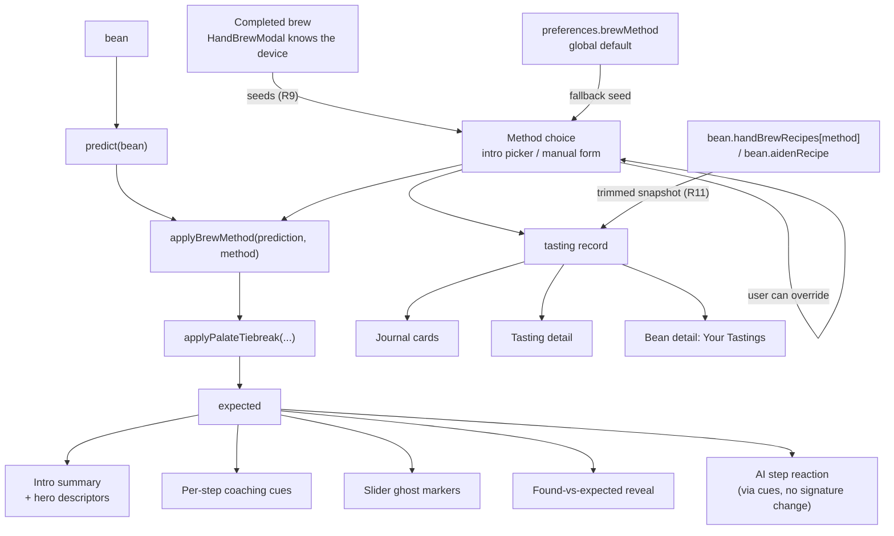

# feat: Brew-method-aware tasting wizard

## Summary

Capture how the cup was actually brewed at the **start** of a guided tasting — seeded from the real device when a brew just finished, from the saved preference otherwise, and visibly changeable either way — and let that choice inform what Professor Ruphus expects and what he coaches the taster to notice. Persist the method *and the recipe that produced the cup* on the tasting record, from every live write path, so past cups stay readable and same-bean-different-method entries stop reading as contradictions.

The whole feature hangs off one seam: `src/components/tasting/TastingWizard.jsx:65` computes a single `expected` object that already feeds the intro summary, the per-step coaching cues, the slider ghost markers, the found-vs-expected reveal, and the AI reaction. A brew-method modifier layered onto that object propagates to every surface without touching any of them individually.

---

## Problem Frame

On 2026-07-26 Tal tasted a bean he had tasted before, but brewed it on Kalita Wave instead of Aiden. The cup was noticeably different. The tasting record has no method field, so two tastings of the same bean now sit in the journal disagreeing with nothing in the data explaining why.

This is not a missing nice-to-have. The history is actively misleading: it attributes a brew-method difference to the bean.

Two facts make this worse than a plain missing field:

1. `preferences.brewMethod` (`src/hooks/useUserProfile.jsx:11`, default `aiden`) is a single **global** default. It is exactly what was wrong on the day. Silently stamping it onto tastings would manufacture wrong data at scale rather than leaving an honest blank.
2. Method plausibly changes *what is worth noticing*, not just what to record. A full-immersion metal-mesh brew and a thick-paper Chemex brew of the same coffee should be coached differently.

### Grounding (not invented)

The cup-effect knowledge already exists in the repo and in the reference library, so the deltas are derived rather than made up:

- `BREW_DEVICE_CONFIGS` (`src/lib/handbrew.js`) already records `filterType`, `type`, and `drainSpeed` per device: thin paper cone (V60), wavy paper flat-bed (Kalita), thick bonded paper (Chemex), paper or metal disc (Aeropress), metal mesh / no paper (French Press).
- World Atlas of Coffee, "Body/Mouthfeel": *"Metal/cloth filters allow oils through = more body"* and *"Paper filters remove oils = lighter body"*.
- World Atlas of Coffee, "Filter Types": paper = *"Cleanest cup, removes all suspended material and oils"*; metal = *"allows oils and small particles through. Richer body, some sediment, slightly cloudy."*

Filter material drives body and clarity. That is the axis the model encodes.

---

## Requirements

- **R1.** The guided tasting asks for brew method **before** the tasting beats begin.
- **R2.** The method defaults from `preferences.brewMethod` but is visibly presented and changeable in one tap. It is never silently applied.
- **R3.** The chosen method shifts the **expected axis levels** (the ghost markers), so a legitimately heavier immersion cup is not flagged as off-expectation.
- **R4.** The chosen method adjusts the **per-step coaching cues**, so the taster is pointed at what that brew actually surfaces.
- **R5.** The method is persisted on the tasting record, additively, without disturbing existing tastings.
- **R6.** Past tastings display their method where they are read; records without one degrade gracefully rather than guessing.
- **R7.** No existing tasting is backfilled or inferred.
- **R8.** `scripts/verify-wizard.mjs` stays green and is extended to cover the new behavior.
- **R9.** When the tasting is entered from a completed brew, the method is seeded from the device that was actually brewed, not from the global preference.
- **R10.** Every live path that writes a tasting captures the method, so a blank method means "logged before this feature" and nothing else.
- **R11.** The tasting also records the recipe that was live for that bean and method at save time, so the cup can later be explained by what produced it.

---

## High-Level Technical Design

One modifier layer, many downstream surfaces. This is the reason the change stays small.



The `expected` memo at `src/components/tasting/TastingWizard.jsx:65` is the single junction. Its dependency array is load-bearing: omitting the method there is the one mistake that makes the whole feature silently inert.

Note the two seeds. A tasting entered from a completed brew takes its method from the device that was actually used; a tasting entered cold from the list falls back to the global preference. Only the second is a guess.

**Directional guidance, not implementation specification** — the cup-effect model's shape:

```
methodProfile(methodKey) -> {
  category,                  // machine | pourover | immersion
  filterClass,               // thick-paper | paper | metal-mesh | disc
  axisDelta: { body, finish, acidity, flavor },   // small signed nudges, clamped
  cueOverrides: { body: "...", finish: "...", ... },
  blurb                      // one line for the intro, e.g. "metal mesh, so expect
                             // more body and a little sediment"
}
```

Deltas are deliberately small nudges on top of the bean prediction, not replacements. The bean still dominates; the brew tilts it.

---

## Key Technical Decisions

**Explicit cup-effect table, not derived from `BREW_DEVICE_CONFIGS` at runtime.** The existing fields (`filterType`, `promptContext`) are prose strings written for LLM prompts, not machine-readable values. Parsing them into numeric deltas would be brittle and would couple the tasting model to prompt copy that changes freely. A small explicit table cross-referenced to those configs in comments keeps both honest. It also gives `aiden` a home, which `BREW_DEVICE_CONFIGS` lacks entirely (it is the machine path, handled in `src/lib/aiden.js`).

**A separate `applyBrewMethod()` layer rather than a second `predict()` parameter.** Mirrors the existing `applyPalateTiebreak(prediction, onboardingPalate)` composition already in `src/lib/tastingExpectations.js`. Keeps `predict(bean)` a pure bean function, makes the method contribution independently testable, and means a missing method is a no-op pass-through that reproduces today's output byte-for-byte.

**Method lives on the wizard intro phase, not a new phase.** The wizard already has `phase: 'intro' | 'steps' | 'reveal'` with an `IntroCard`. Tal's "ask first" is satisfied by the existing intro, so no new phase machinery, no change to progress math, no new back-navigation edge case. Back from step 0 already returns to intro, which becomes the natural "change my mind" path.

**Reuse `SlideSelect`, with three overrides.** `src/components/tasting/SlideSelect.jsx` is already the wizard's single-select control: shared-element highlight, synchronous haptic, reduced-motion snap. It sidesteps the WKWebView entrance-animation trap since it animates on interaction only. But it was sized and defaulted for low-stakes quick-picks, and this control is higher-stakes, so it needs `allowDeselect={false}` (its default clears the selection on re-tap), a 44pt chip height (its default 40 is under the project's iOS minimum), and its own short parallel label set (its option strings double as keys and labels). See U3.

**Blank means blank.** Records without a method render as unrecorded. Inferring from the current global preference would reproduce the exact failure that motivated the feature.

---

## Implementation Units

### U1. Brew-method cup-effect model

**Goal:** A pure, grounded model mapping each brew method to its effect on the cup and to per-step coaching language.

**Requirements:** R3, R4

**Dependencies:** none

**Files:**
- `src/lib/brewMethodProfile.js` (new)
- `scripts/brew-method-profile.test.mjs` (new)

**Approach:** Export a table keyed by the six **canonical** method keys plus a resolver. Note that `BREW_METHODS` actually has **seven** keys: `src/lib/brewMethods.js:219` adds `handbrew` as a deprecated alias of `v60`, which `useUserProfile.jsx:348-353` normalizes away and which `BREW_DEVICES` (line 223) filters out. Build the table over the canonical six and let the resolver map `handbrew` → `v60`.

Each entry carries category, filter class, small signed axis deltas, per-step cue overrides, and a one-line blurb. Anchor every delta with a source comment pointing at either the `BREW_DEVICE_CONFIGS` field it reflects or the Atlas passage. Metal mesh (French Press) is the body-heavy pole; thick bonded paper (Chemex) is the body-light pole; V60 and Aiden sit near neutral as the baselines. Deltas must be small enough that bean character still dominates.

**"Clarity" is not its own axis.** `predict()` has no clarity key. Filter-driven cleanliness is expressed through the **`acidity`** delta (brightness reads as clarity to a novice) and, inversely, through `body`. Every test below names a real axis key rather than the word "clarity".

**Patterns to follow:** the constant-table-plus-resolver shape in `src/lib/brewMethods.js`; the small pure-module style of `src/lib/palate.js`.

**Test scenarios:**
- Every key in `BREW_DEVICES` plus `aiden` resolves to a profile (guards against a method being added without a profile). Do **not** iterate raw `Object.keys(BREW_METHODS)` — the `handbrew` alias would fail it.
- `handbrew` resolves to the same profile as `v60`.
- An unknown or absent method key resolves to a neutral profile with all-zero deltas.
- French Press `body` delta is positive and strictly greater than Chemex's.
- Chemex `acidity` delta is the highest of the six; French Press the lowest.
- Deltas stay within the documented bound so no single method can swing an axis more than the bean prediction itself.
- Cue overrides exist for the axes a method actually changes and are absent (not empty strings) elsewhere.
- Cue-override keys are restricted to steps that actually have a bean-derived cue today (`smell`, `acidity`, `sweetness`, `body`, `flavor`, `finish`). `predict()` emits no cue for `firstsip` or `balance`, so an override on those two would surface nowhere.

---

### U2. Method-aware expectations layer

**Goal:** Fold a method profile into a bean prediction without changing behavior when no method is supplied.

**Requirements:** R3, R4

**Dependencies:** U1

**Files:**
- `src/lib/tastingExpectations.js`
- `scripts/tasting-expectations.test.mjs` (new — no expectations-level test exists today)

**Approach:** Add `applyBrewMethod(prediction, methodKey)` alongside the existing `applyPalateTiebreak`. It clamps adjusted axis levels to the same range `predict()` uses, merges `cueOverrides` over `cues`, and appends the method blurb to the summary. `predict()` itself is untouched.

**Relabel only the axes that carry a label.** `LABELS` in `src/lib/tastingExpectations.js:91-97` defines exactly four axes: `acidity`, `sweetness`, `body`, `finish`. `labelFor()` does `LABELS[axis].find(...)`, so `labelFor('flavor', n)` is a **TypeError on undefined** and would crash the whole wizard overlay. `predict()` deliberately returns `fragranceAroma`, `flavor`, and `balance` as level-only axes with no `label`. So: regenerate a label only for the four labelled axes, and leave level-only axes label-free.

**Composition order is fixed, not open.** `applyBrewMethod` runs **first**, then `applyPalateTiebreak`: method deltas are integer nudges on the bean prediction, palate applies fractional half-steps, and running palate last keeps the existing tiebreak semantics intact at the clamp boundaries.

**Execution note:** Write the no-method pass-through equivalence test first — it is the regression guard for every existing tasting flow.

**Test scenarios:**
- `applyBrewMethod(p, null)` and `applyBrewMethod(p, undefined)` deep-equal the input prediction.
- An unknown method key is a pass-through, not a throw.
- A method carrying a non-zero `flavor` delta returns a `flavor` axis with **no `label` key** and does not throw.
- French Press raises the expected `body` level relative to the same bean with no method.
- Chemex does not raise `body`; its `acidity` level moves instead.
- A labelled axis whose level changed also has a regenerated label consistent with the new level.
- Cue overrides replace only their own step keys; untouched steps keep the bean-derived cue.
- `applyPalateTiebreak(applyBrewMethod(p, m), palate)` is the asserted order; the reverse is not relied on.
- Clamping holds at both ends: a bean already at max body plus an immersion delta stays in range.

---

### U3. Capture the method on the wizard intro

**Goal:** Ask for the method first, seeded from preferences, visibly changeable, and wire it into the expectations seam and the draft.

**Requirements:** R1, R2, R3, R4, R9

**Dependencies:** U1, U2

**Files:**
- `src/components/tasting/TastingWizard.jsx` (draft shape: the local `normalizeDraft` at line 642)
- `src/lib/tastingWizardSteps.js` (`initialAnswers`)
- `src/components/HandBrewModal.jsx` (widen the `onStartTasting` payload)
- `src/components/BrewTimer.jsx` (pass the device through the completion CTA)
- `src/App.jsx` (`handleStartTastingSession`, the `pendingTastingBeanId` bridge)
- `src/tabs/TastingTab.jsx` (consume the seeded method)

**Approach:** Render a `SlideSelect` of the six methods on `IntroCard`, seeded from `usePreferences().brewMethod` (the wizard currently takes props only and does not read preferences; the harness already wraps in `UserPreferencesProvider`, so the hook works there). Hold the choice in wizard state, thread it into the `expected` memo **and its dependency array**, and persist it into the draft so a resumed tasting keeps its method. A resumed older draft with no method falls back to the preference default.

**Do not touch `reactToTastingStep`.** It already receives `expected` and reads `expected.cues[step.key]` (`src/lib/claude.js:679`), so once U2 merges `cueOverrides` into `cues`, the AI reaction becomes method-aware with no signature change and no edit to `claude.js`. Adding a `method` argument would be silently dropped by that function's destructuring — a second instance of the exact "looks wired, silently inert" failure this plan already warns about.

**Placement is load-bearing, not cosmetic.** `canAdvance` is `phase === 'intro' || ...` (`TastingWizard.jsx:175`), so the footer CTA is enabled the instant intro mounts. A picker placed below the existing "What to expect" and "Your palate" cards can be scrolled past and never seen, which satisfies R2 on paper while reproducing the silent-default failure. Render the picker as the **first card in the intro stack**, above "What to expect", with an eyebrow label matching the existing card pattern that states the value came from the saved preference and can be changed. Additionally, have the intro CTA name the current selection ("Let's taste it · Kalita Wave") so accepting the default is a read act rather than an omission.

**`SlideSelect` needs two non-default props here.** It defaults to `allowDeselect = true` and does `onChange(active && allowDeselect ? '' : opt)` (`SlideSelect.jsx:13,22`), so re-tapping the pre-seeded method **clears it** and writes no method at all — the direct opposite of R2. Pass `allowDeselect={false}` and a `groupId` distinct from the step-input groups. The component also keys and compares raw option strings with no key/label split, so pass short parallel display labels and map back to `BREW_METHODS` keys locally.

**Chip labels must be grammatically parallel.** Raw `BREW_METHODS` labels mix five device phrases ending in "Recipe" with `aiden`'s verb phrase "Brew with Aiden". Use a dedicated short set for the picker: `V60`, `Kalita Wave`, `Chemex`, `Aeropress`, `French Press`, `Aiden`.

**Draft persistence has a gate to widen.** `onDraftChange` is gated on `hasProgress` (`TastingWizard.jsx:76`) and `hasWizardProgress` returns false at intro with empty answers, so a method chosen and nothing else would not persist. Count a method that differs from the preference default as progress, and carry the method through `normalizeDraft` (line 642), which currently returns a fixed key set that would drop it.

**Tap targets.** `SlideSelect` chips are `minHeight: 40`, under the project's own 44pt iOS minimum (`.claude/rules/ios-layout.md`). Raise this instance to 44 — a mis-tap here silently records the wrong method, the exact error class the feature exists to prevent.

**Seed from the brew that actually happened (R9).** `HandBrewModal.jsx:200` already holds `const device = deviceKey || recipe?.device || 'v60'` and renders `BrewTimer`, but its `onStartTasting` at line 652 forwards only `beanId`; `BrewTimer.jsx:755` likewise calls `onStartTasting(bean?.id)`, and `App.jsx:84 handleStartTastingSession(beanId)` accepts only that. On this path the app knows the ground truth and currently discards it, so seeding from the global preference would guess wrong on the one entry point that cannot be wrong. Widen the payload to carry the device alongside the bean id, store it beside `pendingTastingBeanId`, and have the wizard prefer it over `preferences.brewMethod`. The plain list-CTA entry (no brew just happened) still falls back to the preference. The Aiden path has no equivalent signal — pushing a profile to Fellow is not evidence a brew occurred — so it keeps the preference default.

A seeded value is a strong default, not a lock: keep the picker visible and editable, since the user may have deviated from the recipe.

**Patterns to follow:** `SlideSelect` usage already in the wizard's step inputs; the eyebrow-label treatment on the existing "What to expect" / "Your palate" intro cards; the draft round-trip through `onDraftChange` / `normalizeDraft`.

**Test scenarios:** (harness-level, see U6, plus component-reachable assertions)
- The method control renders above the "What to expect" card, so it is on-screen at intro load without scrolling.
- The control preselects the value from preferences.
- Re-tapping the already-selected method leaves it selected (guards the `allowDeselect` default).
- The intro CTA label names the currently selected method and updates when the selection changes.
- Changing the method updates the intro's expected summary in place.
- Changing the method changes a downstream slider's ghost-marker position for a method with a body delta.
- The method survives a draft save and restore.
- A draft saved before this feature (no method key) restores without error and falls back to the preference.
- Backing out of step 0 returns to intro with the chosen method still selected.
- Reduced motion: the control renders and selects without animation error.
- Entering from a completed Kalita brew seeds the picker to Kalita, not to the `aiden` preference.
- Entering from the plain list CTA (no preceding brew) seeds from the preference.
- A seeded method is still editable, and editing it moves the ghost markers like any other change.
- A stale seed does not leak: starting a brew-entered tasting, abandoning it, then entering from the list CTA seeds from the preference rather than the previous brew's device.

---

### U4. Persist the method and the live recipe on the tasting record

**Goal:** Store the method and the recipe that produced the cup, additively, so the record explains itself later.

**Requirements:** R5, R7, R11

**Dependencies:** U3

**Files:**
- `src/lib/tastingWizardSteps.js` (`buildTastingFromAnswers`)
- `src/components/tasting/TastingWizard.jsx` (pass the method into the record build)
- `scripts/verify-wizard.mjs` (widen the save-shape allowlist — see below)

**Approach:** Add a single `brewMethod` string field holding the canonical `BREW_METHODS` key. Omit the field entirely when unknown rather than writing an empty string, so absence is distinguishable from "recorded as unset". No Firestore rules change is needed: the tastings rule caps at 100 top-level fields and this is one more on a record well under that. No migration, no backfill.

**Also stamp the recipe (R11).** Recipes are latest-wins: regenerating overwrites `bean.handBrewRecipes[device]` with no version history (see origin note). Combined with R7's no-backfill rule, any tasting saved without a stamp can *never* be told what recipe produced it, because that recipe no longer exists to reconstruct. Since the method key is known at exactly the moment of save, select the matching slot and write a compact snapshot onto the record: `bean.handBrewRecipes[method]` for hand-brew methods, `bean.aidenRecipe` for `aiden`.

Store a **trimmed** snapshot, not the whole object — the fields that explain a cup (grind setting and microns, dose, ratio, water temp, total time, technique, and the recipe's own `generatedAt`). The full recipe carries prose (`tips`, `reasoning`, step arrays) that would bloat every tasting doc. Omit the field entirely when the bean has no recipe for that method, exactly as with an unknown `brewMethod`.

**The existing gate is a strict allowlist and will go red.** `scripts/verify-wizard.mjs:335` holds `const ALLOWED = new Set(['beanId','date',...,'tastingScores'])` and then `if (extra.length) fail('R8: saved record has non-schema fields: ...')`. Adding `brewMethod` and `brewRecipe` therefore **fails R8 the moment U4 lands** unless the allowlist is widened in the same unit. This is why the gate script is in U4's file list rather than deferred to U6 — an implementer working unit-by-unit would otherwise ship a red gate and debug a failure the plan told them could not happen.

**Test scenarios:**
- A tasting saved with a method includes `brewMethod` set to the canonical method key.
- A tasting saved without a method omits the key rather than writing empty or null.
- All pre-existing record fields are unchanged in shape and value.
- The save-shape allowlist accepts `brewMethod` and `brewRecipe` and still fails on any other unexpected key.
- A bean with a Kalita recipe, tasted as Kalita, stamps that recipe's parameters and not the V60 slot's.
- A bean with no recipe for the chosen method omits `brewRecipe` rather than writing null or an empty object.
- The stamped snapshot carries only the trimmed parameter fields, not the recipe's prose or step array.
- Firestore doc size stays well inside the 100-field cap with the snapshot attached.

---

### U5. Surface the method where tastings are read

**Goal:** Make a past cup's method visible so same-bean-different-method entries read as different brews rather than contradictions.

**Requirements:** R6

**Dependencies:** U4

**Files:**
- `src/components/TastingDetailCard.jsx`
- `src/tabs/TastingTab.jsx` (journal cards)
- `src/components/BeanDetailCard.jsx` ("Your Tastings" section)

**Approach:** Render the method's short label near the existing date metadata on each surface. Records without a method render nothing extra rather than a placeholder. This is a small additive metadata line, not a redesign of any card.

Per-surface specifics, because the three cards genuinely differ:

- **`BeanDetailCard.jsx:702`** already renders `{formatDate(t.date)}{t.method ? ` · ${t.method}` : ''}` — a **dormant method slot on the exact row this unit targets**, reading a `t.method` key that nothing in the codebase ever writes. Repoint that expression at `t.brewMethod` resolved through `BREW_METHODS`; do not add a parallel element beside it and do not leave the dead read in place.
- **`TastingDetailCard.jsx`** has **no combined date/rating row** — the date renders alone at line 121 inside the drag zone, and the rating separately at line 132 inside the scroll zone. Append the method to the existing centered date line at ~121; do not invent a new row.
- **`TastingTab.jsx`** journal cards: follow the existing card meta treatment.

**Gates to re-run:** `TastingDetailCard` is shared by the Inventory, Rotation, Archive, and Tasting surfaces, so this unit's single edit changes all four. Re-run `scripts/verify-tasting.mjs` and `scripts/verify-archive.mjs` in addition to the wizard gate.

**Patterns to follow:** the dormant slot at `BeanDetailCard.jsx:702` is the intended shape; the journal card meta treatment in `TastingTab.jsx`.

**Test scenarios:**
- A tasting with a method shows its label on the detail card, the journal card, and the bean detail list.
- A tasting without a method shows no method affordance and no empty chip or stray separator on any of the three surfaces.
- Two tastings of the same bean with different methods are visually distinguishable in the journal.
- Long method labels do not break the card layout at the narrow viewport the harness uses.

---

### U7. Capture the method on the manual tasting form

**Goal:** Close the other live write paths so a blank method means "logged before this feature" and nothing else.

**Requirements:** R10, R5

**Dependencies:** U4 (record shape settled)

**Files:**
- `src/components/TastingForm.jsx`
- `src/components/FinishBagPrompt.jsx` (passes the bean through to the form)

**Approach:** The manual form is not a legacy path. It is reachable from three live places: `FinishBagPrompt.jsx:152` renders it as "Save & Finish" when a bag is finished, `TastingTab.jsx:420` offers "or log a tasting manually", and the wizard's own `onSwitchToManual` (`TastingTab.jsx:234`) routes into it. Without this unit, a cup logged through any of them produces a method-less record, which makes a blank method ambiguous on precisely the surfaces U5 builds — the reader cannot tell pre-feature from manually-logged.

Add the same method control to the form, seeded from `preferences.brewMethod`, writing the same `brewMethod` key through the same field contract as U4. Apply the same recipe stamp (R11) so both entry paths produce identical record shapes.

The form is a plain field list rather than a coached flow, so the control does not need the intro's eyebrow framing or CTA-naming treatment — but it does need the same `allowDeselect={false}` and 44pt sizing.

**Patterns to follow:** the existing field rows in `TastingForm.jsx`; the record contract established in U4.

**Test scenarios:**
- A tasting saved from the manual form carries `brewMethod`.
- A tasting saved from the finish-bag flow carries `brewMethod`.
- Switching from the wizard to manual mid-tasting carries the already-chosen method into the form rather than resetting to the preference.
- The manual and wizard paths produce the same record shape for the same inputs.
- The form's method control cannot be cleared by re-tapping.

---

### U6. Extend the wizard verification gate

**Goal:** Lock the new behavior into the existing permanent gate.

**Requirements:** R8

**Dependencies:** U3, U4, U5, U7

**Files:**
- `scripts/verify-wizard.mjs`
- `wizard-harness.jsx` (fixture: add a tasting carrying a method, and a bean whose prediction has headroom to move)
- `package.json` (npm scripts for the two new unit-test files)

**Approach:** Extend rather than replace. Add assertions for method-first presence, preference-seeded default, ghost-marker movement on method change, record shape carrying the method, and graceful absence on a legacy fixture tasting. Keep the existing 30 checks intact and passing.

**Execution note:** Per `lessons.md`, every `verify-*.mjs` must close the browser in `finally` and end with an explicit process exit, and ports must be swept before the run. Follow the file's existing structure.

**The new unit tests need a runner.** U1 and U2 each add a `.test.mjs`, but `package.json` has no generic test script — only `test:recipe-scaling` pointing at one file. Without new scripts mirroring that pattern, the relative-ordering and pass-through-equivalence tests the Risks section relies on would never execute in any gate run.

**Marker-movement assertion needs a fixture with headroom.** `predict()` clamps axis levels to integers and `applyPalateTiebreak` adds half-steps, so a small method delta on a bean already near an axis boundary can round back to the same level and the ghost marker will not visibly move. Choose the fixture bean so the asserted axis has genuine room, or the check is flaky rather than wrong.

**Verification:** `scripts/verify-wizard.mjs`, `scripts/verify-tasting.mjs`, and `scripts/verify-archive.mjs` all pass; both new unit-test scripts pass; `npx eslint .` reports zero problems; `npm run build` succeeds.

**Test scenarios:**
- Existing 30 checks still pass unmodified.
- Method control is present and preselected on intro.
- Selecting a different method visibly moves a slider's expected marker.
- Saved record carries the method key.
- A fixture tasting without a method renders cleanly on the journal card.

---

## Scope Boundaries

**In scope:** method capture on the wizard intro and the manual form, device seeding from a completed brew, method-aware expectations and cues, persistence of both method and recipe snapshot, display on the three read surfaces, harness coverage.

**Not in scope:**
- Changing how recipes are *generated*. Feeding tasting history back into `generateHandBrewRecipe` / the Aiden path remains parked in the origin note. This plan makes that possible by recording the inputs; it does not consume them yet.
- Any backfill or inference of method onto existing tastings (R7).

### Deferred to Follow-Up Work

- **Consuming the stamped history.** Now that method and recipe land on the record, the follow-up is feeding the last few tastings plus their `changeTomorrow` notes into recipe generation. That is the payoff the origin note describes, and it is a separate change to the generators.
- **Technique capture.** `BREW_DEVICE_CONFIGS` already tracks per-device technique variants (V60 Hoffmann vs. Kasuya 4:6; Aeropress standard / inverted / bypass). Tal's original note said "recipe/technique," so this is wanted eventually, but it adds a second tap on every tasting and a second dimension to the model. Partly mitigated by R11: the stamped recipe already carries the technique that was live.
- **Same-bean-different-method comparison view.** Once methods accumulate, an explicit "this bean, by method" surface in Archive or on the bean detail.
- **Method-aware `changeTomorrow`.** Advice should eventually differ by brew method.

---

## Risks & Dependencies

**Three silent-failure modes, all of the same shape: looks built, is inert.**

1. *The `expected` memo dependency array.* Threading the method into the memo but omitting it from the deps produces a feature that passes a casual click-through and never updates the markers. U3's marker-movement scenario is the guard.
2. *Passing a `method` argument to `reactToTastingStep`.* That function destructures a fixed parameter set and would drop it silently. U3 now forbids touching it; the cue merge is the real mechanism.
3. *A picker rendered below the fold.* The intro CTA is enabled from mount, so an unscrolled picker is functionally a silent default. U3 pins it to the first card and names the selection on the CTA.

**Two hard crashes if the units are implemented literally as first drafted.** `labelFor()` throws on `flavor`/`fragranceAroma`/`balance` (no `LABELS` entry), and the save-shape allowlist in the wizard gate fails on any new record key. Both are now called out in U2 and U4 respectively; both would have surfaced as a red gate or a blank overlay rather than a subtle bug, which is the better failure mode but still a wasted debugging cycle.

**Delta calibration drifting into invention.** The Atlas supports the *direction* (metal mesh = more body, paper = less) far more strongly than any specific magnitude. Keeping deltas small nudges with sourced comments, and asserting only relative ordering in tests rather than absolute values, keeps the model honest about what is actually known.

**Motion regressions in the WKWebView portal.** Per `lessons.md`, framer's `animate` does not run inside the wizard's `createPortal` overlay and entrance visibility must come from CSS. `SlideSelect` animates on interaction only, which is the safe category, but any new intro chrome must be visible by default rather than faded in by framer.

**Wizard file size.** `TastingWizard.jsx` is already 704 lines. U3 should add the control and the state thread without growing the component's responsibilities; if the intro grows further, extracting `IntroCard` becomes worthwhile.

---

## Open Questions

**Deferred to implementation:**
- Exact delta magnitudes per method, settled against the U1 relative-ordering tests rather than guessed up front.
- Whether the method label reads better as a chip or an inline meta line on each of the three display surfaces; decide against the real cards.

**Resolved in review round 1 (2026-07-26), now folded into the units:** the BrewTimer bridge carries the real device (R9, U3); the manual `TastingForm` is in scope (R10, U7); recipe stamping moves into the same write as the method (R11, U4).

**Product question, not blocking:** should choosing a non-default method offer to update the global `preferences.brewMethod`? Probably not, since the point is that method varies cup to cup. A stronger variant surfaced in review: default to the last method used *on this bean* rather than the global preference — worth revisiting once there is enough stamped history to tell which produces fewer corrections.

---

## Sources & Research

- `docs/brainstorms/2026-07-25-recipe-tasting-feedback-loop.md` — origin note; establishes that recipes already persist and that the missing link is tasting-to-recipe association, plus why a brew-event log is the wrong shape on the Aiden path.
- `docs/brainstorms/2026-04-21-brew-methods-expansion-requirements.md` — established the six-device taxonomy and the immersion-vs-percolation framing this model builds on.
- World Atlas of Coffee (`~/.claude/books/world-atlas-coffee.md`), "Filter Types" and "Body/Mouthfeel" — the filter-material-drives-body-and-clarity grounding.
- `src/lib/handbrew.js` `BREW_DEVICE_CONFIGS` — per-device `filterType`, `type`, `drainSpeed`; the in-repo source for each method's physical character.
- `lessons.md` — WKWebView portal motion constraints; verify-script hang and port-zombie rules.
