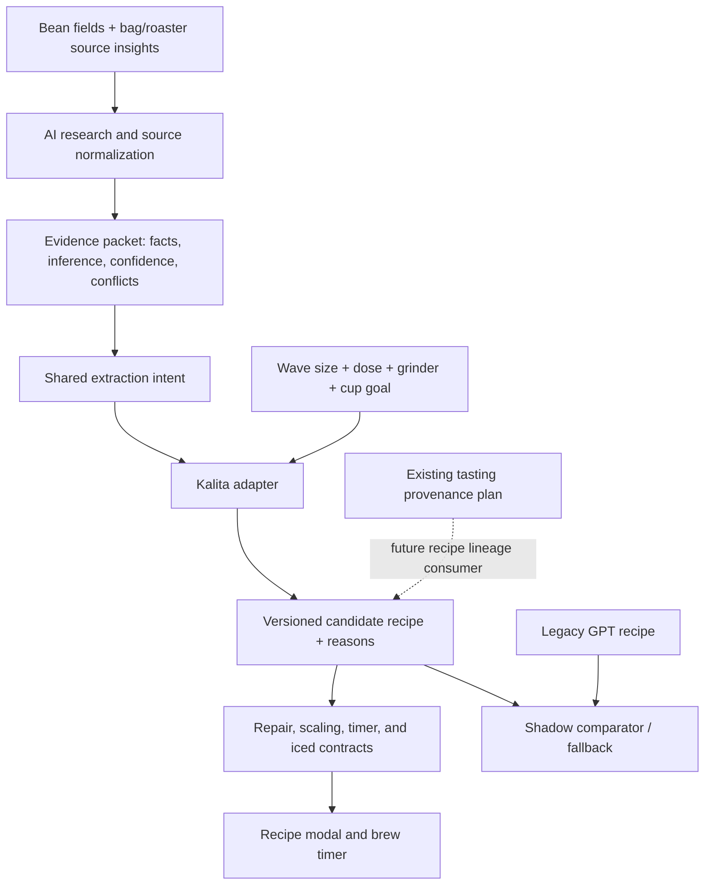
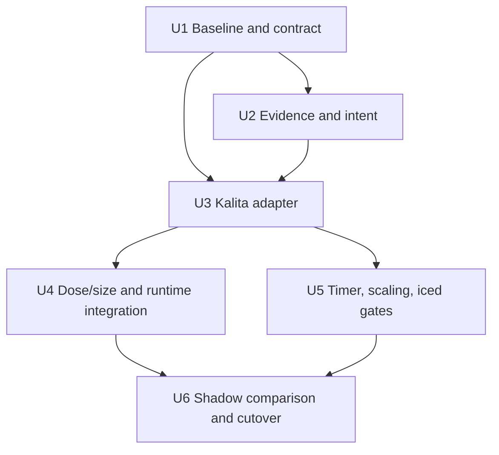

# Bean-Specific Kalita Wave Recipe Engine

## Summary

Build a Kalita Wave recipe path that chooses ratio, temperature, grind direction, dose profile, drawdown target, and pour technique from a normalized bean profile and the user's brewer configuration. AI will interpret incomplete bean information and explain the recommendation; a versioned deterministic adapter will own the physical recipe parameters.

The implementation starts in shadow/read-only mode, preserves existing recipes and GPT fallback behavior, and cuts over only after offline comparison and representative blind brew trials.

---

## Problem Frame

The current hand-brew path asks GPT to generate the complete recipe, then applies shared repair rules. Kalita is represented as one restricted-flow device with a single `center-pour` technique and a static drawdown band. Dose scaling preserves step times, so different doses can display the same target duration even though public professional recipes use different batch sizes and drawdown windows.

The desired Koffee Mameya-style experience is a repeatable decision process: identify what the particular coffee needs, choose the appropriate technique for the brewer and dose, explain the choice, and retain enough provenance to learn from later tasting feedback.

---

## Requirements

- R1. A Kalita recipe must be selected from bean evidence, cup-structure intent, brewer size, dose, grinder, and user cup preference—not from one universal Kalita template.
- R2. Source-backed facts, model inference, conflicts, unknowns, evidence confidence, and engine/rules versions must remain distinguishable and reproducible.
- R3. Kalita Wave 155 and 185 must be treated as different physical configurations, with dose-aware starting profiles and timing/drawdown guidance.
- R4. The engine must choose among conditional Kalita techniques, including low-agitation center pours, center-to-spiral/pulse pours, and conditional finishing agitation; no single pour geometry may be presented as universally correct.
- R5. Every candidate recipe must satisfy the existing recipe contract: finite dose/water/temperature values, valid grinder output, monotonic water totals, strictly ascending timer steps, and a total duration after the last step.
- R6. Existing cached recipes, legacy `handBrewRecipe` data, source-hash invalidation, user dose edits, iced transforms, and stale-request protections must remain readable and safe during migration.
- R7. Candidate output must be comparable with the current GPT path without writing candidate recipes to Firestore, Fellow, or production cache during shadow evaluation.
- R8. The current GPT recipe path must remain a bounded fallback when evidence or candidate generation is unavailable; failure must be visible as fallback/unknown rather than silently scored as a candidate win.
- R9. Recipe output must carry a human-readable decision rationale and structured reason codes suitable for future tasting-linked revisions.
- R10. This slice must provide the provenance/version handoff needed by the active tasting plan; it must not independently consume tasting history or create a second recipe-version persistence model.
- R11. Community evidence from Reddit must be included as a clearly labeled, low-confidence popularity and practical-failure gut check—not as proof of a recipe's correctness.
- R12. Hoffmann-authored principles, Hoffmann-derived Kalita adaptations, and Gota's independent/curated recipes must retain accurate authorship and derivation labels; an adaptation must not be presented as a direct original recipe.

---

## Scope Boundaries

- Do not claim to reproduce Koffee Mameya's private internal recipe system; public recipes are evidence for decision patterns, not a proprietary algorithm specification.
- Do not replace every brewer in one change. V60, Chemex, AeroPress, French Press, and Aiden remain on their existing paths until their own adapters pass independent gates.
- Do not run a live web search on every recipe generation. Use existing explicit source enrichment and cached source insights; model-only claims remain inference.
- Do not make free-form chat or model output directly mutate production recipe parameters.
- Do not backfill historical recipes or tastings. Recipe snapshots and tasting writers are covered by `docs/plans/2026-07-26-001-feat-brew-method-aware-tasting-plan.md`.
- Do not build a public recipe marketplace, community catalog, or shared recipe voting system.
- Do not globally rewrite `scaleRecipeForDose` timing for legacy recipes. Candidate recipes may opt into a versioned dose/timing policy; legacy display behavior remains backward-compatible.

### Deferred to Follow-Up Work

- Feed the last two or three stamped tastings into Kalita generation and apply bounded one-variable revisions after the tasting provenance plan lands.
- Add deterministic adapters for the other registered brew methods and make cross-method cutover decisions.
- Add a richer chat recipe editor with confirmation, diff preview, and undo/version history.
- Repair and broaden the historical all-method manual recipe-quality audit after this focused Kalita harness is established.

---

## Context & Research

### Relevant Code and Patterns

- `src/hooks/useHandBrew.js` owns request-token cancellation, keyed device caching, source-context invalidation, legacy recipe fallback, recipe persistence, and user dose persistence.
- `src/lib/handbrew.js` is the current hand-brew source of truth: device configuration, family defaults, grinder starts, GPT generation, repair, and timer normalization are co-located there.
- `src/lib/sourceInsights.js` already provides bounded sanitization, provenance text, structured sensory axes, and a stable source-context hash. Extend this contract rather than creating a second source packet format.
- `src/lib/brewMethods.js` is the single source for grinder calibration, native setting translation, and canonical brew-method keys.
- `src/lib/recipeScaling.js` is the pure render-time derivation consumed by both `HandBrewModal` and `BrewTimer`; `src/hooks/useBrewTimer.js` is the strict timer contract.
- `src/lib/flashBrewTransform.js` derives iced Kalita recipes deterministically from the hot recipe and must receive a valid candidate contract.
- `src/components/HandBrewModal.jsx` already renders technique, reasoning, tips, dose, steps, and the shared derived recipe; any new rationale must remain sanitized plain text.
- Existing standalone Node regression scripts use `node:assert/strict`, immutable fixtures, and explicit PASS/FAIL output. There is no generic `npm test` script.

### Institutional Learnings

- Keep AI additive and deterministic code authoritative for physical parameters (see `docs/plans/2026-07-11-001-feat-hybrid-cross-method-recipe-engine-plan.md`).
- Sanitize all model inputs at the shared boundary and validate structured model output before any loose fallback parsing (`docs/solutions/security-issues/llm-prompt-sanitization-patterns.md`, `docs/solutions/logic-errors/regex-parser-malformed-structural-fallthrough.md`).
- Verify downstream `buildTimerSteps`, finite totals, monotonic times, and actual rendered contracts—not only source strings or helper regexes.
- Recipe data is currently latest-wins; immutable recipe lineage must be stamped by the active tasting plan before tasting feedback is used for generation (`docs/brainstorms/2026-07-25-recipe-tasting-feedback-loop.md`).
- The current manual audit is not a trustworthy candidate gate because its temporary module rewrite fails under Node and it assumes fields absent from the live config. The focused Kalita harness must be independent of that audit.

### External References

- [Koffee Mameya owner interview](https://www.timeout.com/bangkok/blog/omotesando-koffee-has-been-reincarnated-as-koffee-mameya-012717): bean selection, customer purpose, grind/use matching, and per-coffee recipe cards.
- [Koffee Mameya barista Takamasa Miki recipe](https://gota.cafe/en/recipes/bird/takamasa-miki): public example of a no-agitation, coffee-specific recipe; not a universal Kalita recipe.
- [Kalita USA dripper guidance](https://kalitausa.com/blogs/news/find-the-perfect-dripper): Wave geometry and 155/185 intended batch sizes.
- [Drop Coffee Kalita guide](https://www.dropcoffee.com/pages/this-is-how-we-brew-kalita-wave): different 155 and 185 dose/time profiles.
- [Vibrant Kalita 155 guide](https://www.vibrantcoffeeroasters.com/kalitawave155): total time varies with fines; taste and drawdown behavior matter more than one fixed duration.
- [Barista Hustle drawdown lesson](https://www.baristahustle.com/lesson/p-1-07-drawdown/): grind, filter, bed depth, and agitation interact; excessive agitation can migrate fines and clog.
- [SCA flat-vs-cone research](https://sca.coffee/sca-news/25-magazine/issue-8/english/flat-vs-cone-basket-shape-is-as-important-as-grind-size-in-drip-brew-coffee-25-magazine-issue-8-lpgsg): brewer geometry changes extraction and sensory outcomes.
- [James Hoffmann's Ultimate V60 Technique](https://www.youtube.com/watch?v=AI4ynXzkSQo): primary source for his general pour-over principles and V60 method; it is not a direct Kalita Wave recipe.
- [Gota Kalita Wave 155 library](https://gota.cafe/en/recipes/kalita-wave-155) and [Wave 185 library](https://gota.cafe/en/recipes/kalita-wave-185): curated recipe indexes with Kalita, George Howell, Kurasu, Onyx, Counter Culture, Verve, and a clearly labeled Hoffmann-principles Wave 155 adaptation.
- [Gota's Hoffmann-principles Wave 155 adaptation](https://gota.cafe/en/recipes/kalita-wave-155/kalita-155-hoffmann): useful secondary adaptation, not evidence that Hoffmann published a dedicated Kalita recipe.
- [Reddit Kurasu recipe collection](https://www.reddit.com/r/pourover/comments/1hw2fp9/the_kurasu_v60_and_kalita_wave_recipes/): community interest in Kurasu's 14g/200g Wave recipe and its coarse, lower-temperature, staged-pour profile.
- [Reddit Wave 155 vs. 185 discussion](https://www.reddit.com/r/pourover/comments/12beuzk/can_i_use_46_in_a_kalita_wave_and_other_questions/): practical user reports favoring 155 for smaller doses and 185 for roughly 18g-plus, with bed-depth and stalling caveats.
- [Reddit favorite-recipes thread](https://www.reddit.com/r/pourover/comments/17etfe6/favorite_kalita_wave_recipes/): repeated community mentions of George Howell and Coffee Chronicler as starting points, but limited vote volume and no controlled tasting evidence.
- [Reddit Wave clogging report](https://www.reddit.com/r/Coffee/comments/c5repa/kalita_wave_woes/): practical failure report connecting 185 stalling/clogging with hole flow, grind, filter, and recipe interaction.

---

## Key Technical Decisions

- **Use a hybrid boundary.** AI extracts and explains bean characteristics; deterministic Kalita code owns ratio, temperature, grind target, dose profile, technique, step schedule, and validation.
- **Use evidence precedence.** Roaster/bag/source-insight facts outrank structured bean fields; structured fields outrank model inference. Conflicts and missing evidence remain explicit and produce conservative defaults.
- **Use Reddit as a gut check only.** Reddit can surface repeated recipes, popular starting points, equipment-specific failure modes, and user language, but upvotes and anecdotes cannot establish extraction truth. Community findings enter the research artifact with low confidence and never override roaster, brewer-manufacturer, controlled-theory, or blind-trial evidence.
- **Preserve authorship and source relationships.** Hoffmann's V60 method is a primary technique source; Gota's Wave adaptation is a secondary interpretation; Gota's other recipe cards are curated entries, not automatically independent corroboration. The source registry records those relationships.
- **Treat size and dose as physical inputs.** Wave 155 and 185 are not cosmetic labels. The adapter receives the configured size and requested dose, selects a profile, and records the input used to produce the recipe.
- **Treat timing as a band and feedback signal, not a universal finish time.** Candidate schedules may produce different total durations for 15g, 20g, and 30g profiles; a drawdown target and taste correction remain more authoritative than a hard timer number.
- **Make technique conditional and explainable.** Technique selection is a bounded matrix driven by fines risk, solubility, desired clarity/body, and observed flow risk. “Always center,” “always spiral,” “always swirl,” and “always hotter” are not valid universal rules.
- **Preserve the existing runtime contracts.** Candidate output must flow through the current repair, scaling, timer, grinder, cache, and flash-brew seams. Any new timing behavior is opt-in by engine/rules version and cannot alter legacy recipes.
- **Version every candidate.** Store evidence context, engine version, rules version, size, dose profile, adjustment lineage, and reason codes with the recipe so a later tasting can identify what was actually brewed.
- **Shadow before cutover.** Candidate and legacy output are compared offline and, where enabled, generated side-by-side without changing the saved recipe. Cutover is Kalita-specific and reversible.

---

## Open Questions

### Resolved During Planning

- **What is the first production target?** Kalita Wave only; the broader hybrid plan remains the architectural parent.
- **What is the first physical configuration surface?** Wave 155/185, requested dose, grinder, and hot/iced mode.
- **What happens when evidence is sparse or conflicting?** Preserve the uncertainty, use a safe default, and retain the legacy GPT fallback; do not invent web verification.
- **How is Reddit used?** As a dated, link-backed popularity/practical-failure sample with low confidence; it informs what to test and what failure modes to watch, not what the production adapter must do.
- **How is Hoffmann used?** As a primary general pour-over/theory anchor and a separately labeled secondary Kalita adaptation where applicable; never as a blanket attribution for every app rule.
- **How does tasting feedback enter this work?** Through the existing recipe snapshot/method-aware tasting plan first; feedback consumption is deferred until immutable lineage exists.

### Deferred to Implementation

- Exact numeric score weights and thresholds for each technique branch; these require execution-time comparison and blind brew trials.
- Final UI placement for the persistent Kalita size preference versus a per-brew configuration control; the implementation must keep the choice visible and editable.
- Whether candidate timing should adjust on a post-generation dose edit or only when a new dose profile is generated; legacy behavior remains unchanged until the candidate contract proves a safe policy.
- Final feature-flag/configuration mechanism for shadow and cutover; the repo has no established feature-flag abstraction.

---

## High-Level Technical Design

> *This illustrates the intended approach and is directional guidance for review, not implementation specification. The implementing agent should treat it as context, not code to reproduce.*



---

## Implementation Units



- U1. **Freeze the current Kalita baseline and candidate contract**

**Goal:** Establish a reproducible, read-only measurement surface before changing production generation.

**Requirements:** R5, R6, R7, R8, R11, R12

**Dependencies:** None

**Files:**
- Create: `scripts/kalita-recipe-contract.test.mjs`
- Create: `scripts/kalita-recipe-baseline.mjs`
- Create: `scripts/kalita-recipe-compare.mjs`
- Create: `scripts/kalita-recipe-compare.test.mjs`
- Create: `docs/data/kalita-recipe-evaluation-beans.json`
- Create: `docs/data/kalita-recipe-current-baseline.json`
- Create: `docs/data/kalita-source-registry.md`
- Create: `docs/data/kalita-reddit-gut-check.md`

**Approach:**
- Define the normalized comparison vocabulary for dose/water, ratio, temperature, native and micron grind, technique, bloom/pours, step timing, total duration, drawdown band, rationale, repairs, provenance, and validation failures.
- Capture current GPT output in a separately invoked networked baseline step, including model/prompt metadata and run-to-run variance. Replay frozen fixtures offline; never call OpenAI, Gemini, Firestore, or Fellow from deterministic tests.
- Cover representative washed floral, washed Kenya, natural, processed, medium, dark, sparse, contradictory, and unknown beans across Wave 155/185, 15/20/30g profiles, supported grinders, and hot/iced paths.
- Add a dated Reddit gut-check artifact: sample relevant `r/pourover`/`r/Coffee` threads, record score/comment context, dose/size/ratio/temperature/pour technique, repeated recommendations, and reported failure modes. Mark each item as anecdotal/low confidence and keep it separate from validated recipe rules.
- Add a source registry: record author, original URL, brewer/size, dose, ratio, temperature, pour schedule, timing, evidence tier, and whether each entry is original, adapted, or merely aggregated. Do not count Gota's republished cards as independent corroboration when they point to the same underlying recipe.
- Treat missing or malformed candidate/current output as unknown/error, not as a passing comparison.

**Patterns to follow:** `scripts/recipe-scaling.test.mjs`, `scripts/verify-brew-params.mjs`, and the read-only laboratory described in the hybrid engine plan.

**Test scenarios:**
- Happy path — a frozen current recipe normalizes to finite, comparable fields without changing the fixture.
- Happy path — the matrix includes both Kalita sizes, multiple doses, all supported grinders, and hot/iced variants.
- Happy path — the Reddit artifact records source URL, community context, recipe variables, popularity signal, and confidence for every included thread; repeated themes become test candidates rather than automatic rules.
- Happy path — the source registry distinguishes Hoffmann's primary V60 source from Gota's Kalita adaptation and preserves authorship for every recipe card.
- Edge case — missing research, missing roast date, unknown grinder, missing size, and contradictory source facts remain explicitly unknown.
- Error path — malformed recipe JSON, non-monotonic steps, invalid ratio, or non-finite values fail structural validation before scoring.
- Integration — a comparator report distinguishes physical recipe changes from explanation-only changes and records the reason for each delta.

**Verification:**
- The current baseline can be regenerated and replayed without production writes.
- The comparator produces stable JSON/Markdown output and never labels unknown/error as a candidate win.

---

- U2. **Normalize bean evidence into extraction intent**

**Goal:** Give the deterministic adapter a bounded, provenance-aware description of what the coffee is likely to need.

**Requirements:** R1, R2, R8, R9

**Dependencies:** U1

**Files:**
- Create: `src/lib/recipeEvidence.js`
- Create: `src/lib/extractionIntent.js`
- Create: `scripts/recipe-evidence.test.mjs`
- Create: `scripts/extraction-intent.test.mjs`
- Modify: `src/lib/beanResearch.js` only where shared output metadata or failure normalization is required

**Approach:**
- Reuse `sourceInsights` normalization and `buildSourceContextHash`; do not create a parallel source-text format.
- Normalize source-backed facts, stored bean fields, `researchBean()` inference, roast/process/density, sensory direction, and brewing guidance into explicit fact records with source kind, confidence, and conflict state.
- Keep `researchBeanOnline()` as an explicit enrichment operation. A model-only `researchBean()` result must never be labeled as verified web research.
- Produce a shared extraction intent with cup direction (clarity/body/sweetness), solubility/fines risk, energy/temperature tendency, desired strength, and uncertainty. The intent is guidance for the Kalita adapter, not a final recipe.
- Sanitize all model-controlled and user-controlled text at the shared boundary, and reject malformed structured output before any fallback interpretation.

**Execution note:** Implement the pure normalization and intent tests before wiring them into recipe generation.

**Test scenarios:**
- Happy path — a roaster/source brew recommendation outranks a conflicting model inference and records the provenance.
- Happy path — a sparse bean still yields a safe intent with explicit low confidence and a reason for the fallback.
- Edge case — source text containing prompt-injection markers is sanitized and treated as factual text only.
- Edge case — `body-natural` and `generic-washed` classifications do not silently disappear because the existing handbrew family table lacks them.
- Error path — invalid model JSON produces a recoverable research failure and does not fabricate a high-confidence intent.
- Integration — changing source insights changes the evidence hash and invalidates a candidate recipe context.

**Verification:**
- The same normalized evidence and engine inputs produce byte-equivalent intent output.
- The intent clearly distinguishes sourced, inferred, conflicted, and unknown values for downstream rationale and comparison.

---

- U3. **Build the deterministic Kalita adapter and technique matrix**

**Goal:** Generate a reproducible Kalita recipe from extraction intent and physical configuration without asking the model to choose production parameters.

**Requirements:** R1, R3, R4, R5, R9

**Dependencies:** U1, U2

**Files:**
- Create: `src/lib/kalitaAdapter.js`
- Create: `scripts/kalita-adapter.test.mjs`
- Modify: `src/lib/handbrew.js` only to share/route existing device validation and repair contracts without duplicating Kalita constants
- Modify: `src/lib/brewMethods.js` only if a canonical size/configuration registry is needed by both UI and adapter

**Approach:**
- Keep device physics separate from shared intent: restricted three-hole flat bed, Wave size, dose/bed depth, grinder calibration, and drawdown guardrails belong to the Kalita adapter.
- Use evidence-backed starting bands rather than hard-coded universal truths. Initial comparison bands should cover approximately 12–18g on Wave 155, 18–30g on Wave 185, and a separate large-dose profile above that range.
- Select a bounded technique family conditionally: low-agitation center pour, center-to-spiral/pulse, bloom-led pulse, or low-agitation/no-swirl. A final swirl is a separate conditional adjustment, not an implicit property of every technique.
- Use ratio, temperature, grind direction, bloom, and pulse choices as coupled but explainable decisions. Separate grind, heat, and agitation corrections so a stall does not automatically trigger every lever.
- Generate dose-aware schedules and drawdown bands. The schedule should allow 15g, 20g, and 30g profiles to differ, while taste and observed flow remain the correction authority.
- Emit reason codes and a concise rationale alongside the physical recipe. Preserve native grinder notation and calibrated microns through `brewMethods.js`.
- Enforce water totals, ratio, temperature, step times, timer readiness, and maximum duration through the existing repair contract; a candidate must fail closed if it cannot satisfy the contract.

**Technical design:**

The adapter is directional guidance for a pure transformation:

```text
evidence + extraction intent + {size, dose, grinder, cup goal}
    -> technique branch + parameter bands + reason codes
    -> normalized hot recipe
    -> existing repair/timer contract
```

**Test scenarios:**
- Happy path — the same intent/configuration produces byte-equivalent recipes across repeated calls.
- Happy path — Wave 155 and Wave 185 produce different bed/dose/timing profiles when the same bean intent is used.
- Happy path — 15g, 20g, and 30g profiles can have distinct drawdown targets and step schedules without violating ratio or timer constraints.
- Happy path — high-fines/slow-flow intent selects lower late agitation or coarser direction; fast/under-extracted intent selects a bounded extraction increase; each change has a reason code.
- Edge case — unknown process/density uses conservative technique selection and exposes low confidence instead of selecting an aggressive branch.
- Edge case — conflicting source guidance cannot push ratio, temperature, grinder setting, or timing outside device bounds.
- Error path — an adapter result with non-finite values, non-monotonic totals, or invalid timer sequence is rejected rather than repaired into an unexplained recipe.
- Negative control — changing only explanation text does not change the physical recipe comparison.

**Verification:**
- Candidate output is deterministic, device-valid, dose-aware, and explainable across the evaluation matrix.
- No unconditional “always center,” “always hotter,” or “always swirl” rule remains in the candidate path.

---

- U4. **Integrate size, dose, cache identity, and production fallback**

**Goal:** Make the candidate usable through the existing hand-brew flow without breaking legacy recipes or silently serving a candidate for the wrong configuration.

**Requirements:** R3, R6, R8, R9, R10

**Dependencies:** U2, U3

**Files:**
- Modify: `src/hooks/useHandBrew.js`
- Modify: `src/lib/handbrew.js`
- Modify: `src/hooks/useUserProfile.jsx`
- Modify: `src/components/SettingsPage.jsx` or the existing brew-method configuration surface, depending on the chosen UI placement
- Modify: `src/components/HandBrewModal.jsx`
- Create: `scripts/handbrew-kalita-integration.test.mjs`

**Approach:**
- Add an explicit Kalita size/configuration input with a visible, editable default. If the user has a persisted target dose, use it; otherwise choose a size-appropriate starting dose and record that it was defaulted.
- Include device, size, requested dose/profile, grinder, source/evidence hash, engine version, and rules version in candidate cache identity. Existing recipes without these fields remain readable and are not forcibly regenerated.
- Preserve the current request-token guard and stale-result behavior. Candidate failure, source failure, or contract failure falls back to the legacy GPT path with an explicit fallback marker.
- Keep persistence latest-wins for the current recipe slot, but include enough lineage for the active tasting plan to snapshot the recipe later. Do not add a second tasting writer or version store here.
- Extend `HandBrewModal` labels/metadata so new techniques and rationale are visible, sanitized, and not silently omitted by the current limited technique label map.
- Keep the existing user dose stepper and render-time scaling contract. A versioned candidate schedule may opt into dose-aware timing; legacy recipes preserve current timing fields.

**Test scenarios:**
- Happy path — a selected Wave size and requested dose reach the adapter and are stored on the candidate recipe.
- Happy path — changing the size/dose or evidence context does not reuse a cache entry created for a different input.
- Happy path — legacy `handBrewRecipe` and keyed recipes without engine metadata still open and render normally.
- Edge case — an unknown persisted size or dose falls back to a documented default without crashing or silently selecting a different brewer.
- Error path — candidate generation failure uses the GPT fallback and marks the result as fallback; it does not overwrite a valid cached candidate.
- Error path — source retrieval failure does not look like “no source” and does not trigger destructive regeneration.
- Integration — a stale request cannot write a candidate recipe after the user switches beans, devices, or closes the modal.
- Integration — a candidate recipe reaches `HandBrewModal` and `BrewTimer` through the same shared derived recipe path.

**Verification:**
- Existing saved recipes remain readable, candidate cache identity is complete, and fallback behavior is observable.
- The UI shows the selected physical configuration and the reason for the chosen technique.

---

- U5. **Close dose, timer, scaling, and iced-recipe gates**

**Goal:** Prove that dose-aware candidate schedules remain coherent through every downstream consumer.

**Requirements:** R3, R5, R6

**Dependencies:** U3, U4

**Files:**
- Modify: `src/lib/recipeScaling.js` only for opt-in candidate timing metadata; preserve legacy behavior
- Modify: `src/lib/flashBrewTransform.js` only where candidate version/size metadata must be carried through
- Create: `scripts/kalita-runtime-contract.test.mjs`
- Extend: `scripts/recipe-scaling.test.mjs` where shared invariants are affected
- Extend: `scripts/verify-brew-params.mjs` with candidate-specific negative controls

**Approach:**
- Keep `scaleRecipeForDose` pure and non-mutating. If candidate timing changes on a dose edit, make that behavior explicit in the candidate version rather than silently changing every saved recipe.
- Assert that step actions, cumulative water totals, dose/water ratio, timer start/duration pairs, total duration, and displayed drawdown metadata remain aligned.
- Feed candidate hot recipes through `transformToFlashBrew` and verify iced grind/temperature/time adjustments remain finite, monotonic, and device-aware.
- Reject candidate recipes that are structurally valid JSON but fail downstream `buildTimerSteps` or flash-brew gates.

**Test scenarios:**
- Happy path — 15g, 20g, and 30g candidate profiles preserve consistent ratio, action copy, cumulative totals, and timer steps.
- Happy path — `buildTimerSteps` returns valid durations with total time strictly after the final step.
- Edge case — a candidate with a long 185 drawdown remains within the configured maximum and reports its target band rather than being silently clipped.
- Edge case — invalid/missing timing metadata leaves a legacy recipe unchanged and disables the timer instead of inventing a schedule.
- Integration — the exact derived recipe consumed by `HandBrewModal` is the one consumed by `BrewTimer`.
- Integration — hot candidate to iced transform preserves size/dose metadata and passes all timer/finite-value gates.

**Verification:**
- Runtime contract tests cover the path from adapter output through scaling, timer, modal display data, and iced transform.
- No candidate can display gram instructions that disagree with structured totals or start a timer with invalid steps.

---

- U6. **Run shadow comparison, blind trials, and the Kalita cutover gate**

**Goal:** Decide whether the candidate is better and safer than the current GPT path before changing production behavior.

**Requirements:** R1, R2, R4, R7, R8, R9

**Dependencies:** U1, U3, U4, U5

**Files:**
- Modify: `scripts/kalita-recipe-baseline.mjs`
- Modify: `scripts/kalita-recipe-compare.mjs`
- Modify: `scripts/kalita-recipe-compare.test.mjs`
- Create: `docs/data/kalita-recipe-shadow-report.md`
- Create: `docs/data/kalita-blind-trial-protocol.md`
- Modify: the selected configuration/flag surface from U4

**Approach:**
- Compare current GPT and deterministic candidates on structural correctness, evidence fidelity, family/intent fit, grind plausibility, water/dose consistency, timing coherence, technique rationale, and current-model run-to-run variance.
- Keep hard correctness gates separate from sensory preference. A recipe cannot pass because it tastes promising if its timer or water totals are invalid.
- Run blind trials across representative washed, natural, processed, and dark/medium profiles and both Kalita sizes. Record cup outcomes, drawdown observations, and one-variable changes without exposing which engine produced the recipe.
- Cut over Kalita independently, with a reversible fallback path and explicit engine/rules metadata. Do not cut over iced mode until hot mode passes its own evidence and runtime gates.

**Test scenarios:**
- Happy path — repeated candidate generation is byte-equivalent while legacy GPT variance is recorded separately.
- Happy path — a candidate that improves rationale text but not physical parameters is reported as explanation-only.
- Edge case — a candidate outside the current model variance band is flagged for human review even when structurally valid.
- Error path — missing trial data, failed generation, or unknown sensory result remains unknown and cannot increase the score.
- Integration — disabling the candidate flag immediately returns the user to the legacy cached/GPT path without data loss.

**Verification:**
- A reviewed shadow report documents the cutover decision, known divergences, trial outcomes, and rollback condition.
- Production cutover is blocked until hot Kalita passes structural/runtime gates and representative blind trials; iced remains separately gated.

---

## System-Wide Impact

- **Interaction graph:** `useHandBrew` continues to orchestrate research, cache, generation, persistence, and stale-request cancellation; the candidate adapter sits between evidence/research and the existing repair/scaling/timer consumers.
- **Error propagation:** source or model failures become explicit unknown/fallback states; adapter contract failures reject candidate output; timer-invalid recipes remain non-startable; legacy fallback remains available.
- **State lifecycle risks:** cache identity must include evidence/configuration/engine lineage; stale requests must not write; old recipes must not be invalidated solely because new metadata is absent; dose edits must remain render-time or explicitly persisted through the existing path.
- **API surface parity:** no new public API or Firestore collection is required. Existing API proxy and source-enrichment boundaries remain unchanged.
- **Integration coverage:** offline comparator tests are necessary but insufficient; the plan requires browser/runtime proof for modal/timer consumers and separate blind brew evidence for sensory preference.
- **Unchanged invariants:** canonical brew-method keys, grinder calibration, legacy recipe readability, source sanitization, request-token cancellation, shared `displayRecipe`, and deterministic flash-brew behavior remain intact.

---

## Risks & Dependencies

| Risk | Mitigation |
|------|------------|
| Public recipes are overgeneralized into false universal rules | Keep source claims tied to confidence/provenance and test conditional technique branches rather than copying one recipe. |
| Deterministic rules encode the same unsupported assumptions as the prompt | Require reason codes, negative controls, and source-backed rule references; keep hotter/coarser/swirl adjustments independently testable. |
| Wave size/dose selection adds UI and cache complexity | Make configuration explicit, include it in cache identity, default visibly, and preserve legacy recipes. |
| Candidate output differs from legacy GPT but is not objectively better | Compare against model variance, separate hard correctness from sensory preference, and require blind trials. |
| Timing changes break existing dose scaling or iced transforms | Gate timing behavior by engine/rules version and exercise the full downstream contract. |
| Recipe lineage is lost before tasting feedback is added | Treat the active method-aware tasting plan as a prerequisite; never consume latest mutable recipe state as historical truth. |
| Network failures are mistaken for missing source or missing recipe | Preserve explicit load/error states and fallback without destructive overwrite. |

---

## Phased Delivery

### Phase 0: Measurement

- U1 freezes the current Kalita baseline and validates the comparison contract.

### Phase 1: Decision engine

- U2 establishes provenance-aware evidence and extraction intent.
- U3 builds and tests the deterministic Kalita adapter.

### Phase 2: Product integration

- U4 exposes size/dose configuration, candidate cache identity, rationale, and fallback.
- U5 proves scaling, timer, and iced downstream behavior.

### Phase 3: Evidence-gated rollout

- U6 runs shadow comparison and blind trials, then makes an explicit hot-Kalita cutover decision.

---

## Success Metrics

- Repeated candidate generation with identical inputs is byte-equivalent.
- 100% of candidate recipes either pass the runtime contract or are rejected/marked fallback; no malformed candidate reaches the timer.
- Candidate comparisons show dose/size-specific schedules rather than one copied total duration across all profiles.
- Every physical parameter delta has an evidence or rule reason, and unsupported/unknown inputs remain visible.
- Legacy saved recipes open unchanged during the migration.
- Blind trials cover both Wave sizes and at least four materially different bean behavior profiles before cutover.
- The cutover report identifies whether the candidate improves cup preference without trading away structural correctness.

---

## Documentation / Operational Notes

- Keep the public-source notes and confidence decisions in the plan/evaluation artifacts; do not present the Mameya example recipe as a universal standard.
- Add a short in-app or recipe-card explanation of why the chosen Kalita technique was selected, using sanitized reason text.
- Record engine/rules version and fallback status in shadow reports and candidate recipe metadata.
- Keep source/static checks, focused Node tests, browser/runtime proof, and physical blind-trial evidence as separate verification layers.

---

## Sources & References

- Related architecture: `docs/plans/2026-07-11-001-feat-hybrid-cross-method-recipe-engine-plan.md`
- Related tasting provenance: `docs/plans/2026-07-26-001-feat-brew-method-aware-tasting-plan.md`
- Origin idea note: `docs/brainstorms/2026-07-25-recipe-tasting-feedback-loop.md`
- Current audit: `docs/data/algo-audit-2026-07-19/verdict-handbrew.md`, `docs/data/algo-audit-2026-07-19/verdict-knowledge.md`
- Current source: `src/lib/handbrew.js`, `src/hooks/useHandBrew.js`, `src/lib/sourceInsights.js`, `src/lib/recipeScaling.js`, `src/hooks/useBrewTimer.js`
- External research: [Koffee Mameya interview](https://www.timeout.com/bangkok/blog/omotesando-koffee-has-been-reincarnated-as-koffee-mameya-012717), [Takamasa Miki recipe](https://gota.cafe/en/recipes/bird/takamasa-miki), [Kalita USA](https://kalitausa.com/blogs/news/find-the-perfect-dripper), [Drop Coffee](https://www.dropcoffee.com/pages/this-is-how-we-brew-kalita-wave), [Vibrant](https://www.vibrantcoffeeroasters.com/kalitawave155), [Barista Hustle](https://www.baristahustle.com/lesson/p-1-07-drawdown/)
