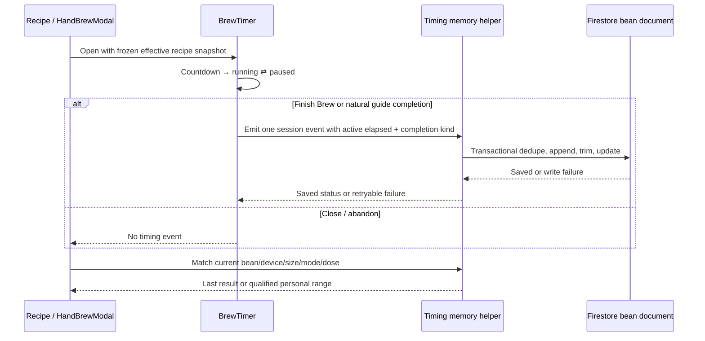

# feat: Bean-specific hand-brew timing memory

## Summary

Extend the existing hand-brew timer with an explicit, idempotent completion event and a bounded timing memory stored with the bean. Derive a compact, configuration-matched hint for the recipe view while leaving the generated extraction controls unchanged.

---

## Problem Frame

The timer currently owns accurate wall-clock elapsed time but loses it when the session ends. It auto-completes at the generated guide finish, has no intentional early-finish action, and cannot distinguish an abandoned session from a completed brew. The implementation must preserve the calm recipe flow while making actual bean-specific timing useful.

---

## Requirements

- R1. Add an explicit Finish Brew action for running or paused hand-brew timers and retain the actual active elapsed time.
- R2. Save one compact, deduplicated timing event per completed hand brew, keyed to the bean and immutable timer configuration (device, Kalita size when applicable, hot/iced mode, dose, recipe lineage, target, actual time, and completion kind).
- R3. Treat natural guide completion and intentional Finish Brew as completed samples; do not treat close/abandon as a sample, and mark skip-to-complete separately so it cannot silently train the personal range.
- R4. Show at most one relevant prior-brew hint on the recipe, matched by bean/device/size/mode/dose. A cross-dose hint must label the prior dose and keep the current recipe guide as primary.
- R5. After at least three comparable completed samples, allow a bean-specific actual-time range to appear; timing must not alter grind, water temperature, ratio, or technique.
- R6. Keep writes online-only and honest: failed timing persistence stays visibly unsaved with a retry path, and no offline queue is introduced.
- R7. Preserve current timer invariants, hot/iced effective recipe snapshots, and existing Start Tasting behavior without adding tasting linkage in this release.

**Origin actors:** A1 (Brewer), A2 (Recipe and timer experience)
**Origin flows:** F1 (Finish and remember a hand brew), F2 (Use timing context on the next recipe)
**Origin acceptance examples:** AE1, AE2, AE3, AE4

---

## Scope Boundaries

- No global “your Kalitas usually take…” statistic.
- No automatic Aiden timing capture; Aiden execution remains externally unobservable.
- No full analytics dashboard in the primary recipe flow.
- No automatic grind, temperature, ratio, or technique changes from timing alone.
- No tasting-history linkage or recipe feedback consumption in this release.
- No mutation queue or offline sync protocol; preserve the current read-only offline cache behavior.
- QuickRecipeFlow sessions without a durable bean ID may display completion time but do not persist a bean timing event.

### Deferred to Follow-Up Work

- A bean-detail “View brew history” surface with the full event list.
- Linking a timing event and immutable recipe snapshot into the tasting record.
- Using tasting feedback plus timing history to change future extraction parameters.
- Cross-dose prediction beyond showing the prior dose and the current generated guide.

---

## Context & Research

### Relevant Code and Patterns

- `src/hooks/useBrewTimer.js`: reducer plus `Date.now()` refs are the source of truth; paused time is already excluded from active elapsed time.
- `src/components/BrewTimer.jsx`: full-screen portal, completion overlay, close confirmation, step navigation, and existing Start Tasting CTA.
- `src/components/HandBrewModal.jsx`: owns the effective render-time recipe, including scaled dose and iced transform; this exact derived recipe must be frozen when the timer starts.
- `src/hooks/useHandBrew.js`: request-token/cache pattern, per-bean recipe persistence, and current bean ownership.
- `src/hooks/useAppData.js`: Firestore bean updates, native IDB hydration, web snapshots, and 60-second native polling. Mutations are online-only.
- `src/lib/recipeScaling.js`: shared render-time dose derivation consumed by both the recipe view and timer.
- `scripts/recipe-scaling.test.mjs`, `scripts/kalita-runtime-contract.test.mjs`, and `scripts/verify-brew-params.mjs`: existing timer/recipe contract coverage to extend.

### Institutional Learnings

- `docs/solutions/database-issues/firestore-settings-phase2-write-patterns.md`: one logical persistence change should be atomic/idempotent; do not treat an unknown commit as a reason to create a second record.
- `docs/solutions/runtime-errors/async-side-effect-during-react-render.md`: save from explicit lifecycle callbacks, never render-time effects that can repeat.
- `docs/solutions/logic-errors/native-profile-load-failure-indistinguishable-from-missing.md`: preserve the distinction between missing data and load failure; a failed timing write must not look like an empty history.
- `docs/brainstorms/2026-07-25-recipe-tasting-feedback-loop.md`: do not create a generic brew-event collection for Aiden; timing memory is explicitly limited to app-observed hand brews.
- `docs/plans/2026-07-26-001-feat-brew-method-aware-tasting-plan.md`: preserve recipe lineage and method identity for future tasting linkage, but do not make that later feature a hidden dependency of this release.

### External References

- None. The repository already has the relevant timer, Firestore, and offline behavior patterns; adding external guidance would not improve this bounded implementation.

---

## Key Technical Decisions

- **Store a bounded additive history on the bean document:** keep a compact `handBrewTimingMemory` field rather than a new collection or mutable recipe-slot nesting. This keeps the memory per-bean, follows existing bean reads, is naturally removed with the bean, and avoids inventing a second top-level workflow.
- **Use a transaction-backed merge/trim writer:** read the latest bean document, normalize malformed/missing history, deduplicate by a client-generated session ID, append the event, retain only the newest bounded set, and write one update. This prevents the read-modify-write race that a plain `updateBean` array replacement would introduce.
- **Snapshot the derived timer recipe at start:** store the effective hot or iced recipe after dose scaling, not the latest mutable bean recipe. The event keeps the generated timestamp plus engine/rules/profile metadata so regenerated recipes do not contaminate historical comparisons.
- **Separate completion kinds:** `natural`, `manualEarly`, and `skipped` are distinct. Natural and intentional Finish Brew samples feed the personal range; skipped completion is retained for audit/context but excluded from learning; abandon produces no event.
- **Qualify personal ranges conservatively:** require three exact configuration matches before showing a range. With fewer matches, show only the most recent relevant result and the current guide. Use transparent actual min–max/median language rather than a hidden prediction model.
- **Keep save state explicit:** completion is shown immediately, but the UI distinguishes saving, saved, and failed/unsaved. Retry reuses the same session ID; it never creates a fresh event for the same brew.

---

## Open Questions

### Resolved During Planning

- **Where does memory live?** On the existing bean document as bounded additive data, not in a new collection or recipe slot.
- **What is comparable?** Same bean, device, Kalita size when applicable, mode, dose, and recipe lineage/profile; cross-dose history is context only.
- **What qualifies for learning?** Three exact completed samples; skipped and abandoned sessions do not qualify.
- **What happens offline?** The app does not claim persistence; it exposes retry and preserves the current online-only mutation boundary.

### Deferred to Implementation

- Exact compact event key names and the final per-bean retention count, subject to Firestore field-size and existing rules checks.
- Exact copy and visual placement of the save-status/retry state, subject to the existing iOS design system and a device visual pass.
- Whether a full range should display min–max or a median-centered interval after the first three samples; the pure helper must make this choice deterministic and test it.

---

## High-Level Technical Design

> *This illustrates the intended approach and is directional guidance for review, not implementation specification. The implementing agent should treat it as context, not code to reproduce.*

---

## Implementation Units

- U1. **Timing-memory domain helpers and deterministic matching**

**Goal:** Define the compact event contract, normalization, bounded merge, comparable-history selection, and personal-range qualification without UI or Firestore dependencies.

**Requirements:** R2, R3, R4, R5

**Dependencies:** None

**Files:**
- Create: `src/lib/brewTimingMemory.js`
- Test: `scripts/brew-timing-memory.test.mjs`

**Approach:**
- Normalize missing or malformed legacy history to an empty set without treating a load/write failure as empty data.
- Build events from an immutable timer snapshot with finite nonnegative active elapsed/target values, a unique session ID, completion kind, and compact recipe lineage metadata.
- Merge newest-first with session-ID deduplication and a bounded retention policy.
- Match exact current configuration first; expose the most recent same-bean/device/size/mode record as a labeled cross-dose context only.
- Qualify a range only after three exact completed samples and exclude skipped/abandoned events.

**Patterns to follow:** Pure-module style in `src/lib/recipeScaling.js`; strict finite/monotonic validation in `src/lib/brewMethods.js` and `src/lib/kalitaAdapter.js`.

**Test scenarios:**
- Happy path — valid natural and manual-early snapshots produce compact events with distinct session IDs and preserved recipe lineage.
- Happy path — exact matching never crosses bean, device, Kalita size, hot/iced mode, dose, or recipe profile.
- Edge case — missing/undefined/malformed history normalizes safely; newest retention cap evicts only the oldest event.
- Edge case — the same session ID merged twice yields one event.
- Edge case — one or two exact samples produce a last-result hint but no personal range; three exact samples produce a deterministic range.
- Edge case — same bean/device/size with a different dose returns labeled context but not an exact match.
- Error path — nonfinite, negative, missing target, or invalid completion values are rejected rather than persisted.
- Error path — skipped and abandoned events are excluded from personal-range statistics.

**Verification:** The helper’s tests define the comparison and learning contract independently of React and Firestore.

---

- U2. **Transactional per-bean persistence and hook wiring**

**Goal:** Persist one timing event safely on the current bean while preserving native polling, web snapshots, and online-only write semantics.

**Requirements:** R2, R3, R6, R7

**Dependencies:** U1

**Files:**
- Modify: `src/hooks/useAppData.js`
- Modify: `src/hooks/useHandBrew.js`
- Modify: `src/tabs/InventoryTab.jsx`
- Modify: `src/tabs/RotationTab.jsx`
- Modify: `src/tabs/ChatTab.jsx`
- Modify: `src/components/QuickRecipeFlow.jsx`
- Test: `scripts/brew-timing-persistence.test.mjs`

**Approach:**
- Add a narrowly scoped bean timing writer that performs a Firestore transaction or equivalent latest-document merge, dedupes by session ID, trims history, updates the bean timestamp, and refetches through the existing data path.
- Expose the writer through the hand-brew hook so all durable-bean call sites share one callback; QuickRecipeFlow passes no-op/ephemeral behavior when no bean ID exists.
- Guard the callback against in-flight duplicate submissions and surface rejected writes to the timer completion UI instead of pretending the record is saved.
- Do not add a mutation queue, new subcollection, tasting write, or Firestore rule expansion.

**Patterns to follow:** `useAppData.updateBean` and existing refetch coalescing; `QuickRecipeFlow`’s in-flight save guard; current native IDB cache/polling behavior.

**Test scenarios:**
- Happy path — a valid event is merged onto the correct bean, retained after refetch, and visible to the next recipe open.
- Happy path — concurrent/retried writes with the same session ID result in one event.
- Edge case — missing bean ID skips durable persistence without creating a fake record.
- Error path — Firestore rejection returns an unsaved/retryable result and does not mutate optimistic history.
- Integration — native/web data refresh consumes the updated bean timing field without changing existing bean/tasting cache behavior.

**Verification:** Persistence tests prove idempotent writes and explicit failure semantics; no offline mutation behavior changes.

---

- U3. **Timer completion lifecycle and Finish Brew interaction**

**Goal:** Add explicit early completion while preserving the existing wall-clock, pause, rewind, visibility, and timer-ready invariants.

**Requirements:** R1, R2, R3, R6, R7

**Dependencies:** U1

**Files:**
- Modify: `src/hooks/useBrewTimer.js`
- Modify: `src/components/BrewTimer.jsx`
- Test: `scripts/brew-timer-lifecycle.test.mjs`
- Modify: `scripts/kalita-runtime-contract.test.mjs`

**Execution note:** Add characterization coverage for the current reducer/ref timing semantics before changing completion transitions.

**Approach:**
- Expose a single finish transition that accepts an explicit completion kind and emits one immutable session payload. Keep a one-shot reported guard so the final-step interval, Finish Brew tap, skip-forward, retry, or unmount cannot double-report.
- Start the session ID and recipe snapshot when the timer opens/starts, after render-time dose scaling and iced transformation are complete.
- Add a 44pt Finish Brew control for running/paused states. Natural guide completion reports `natural`; explicit early finish reports `manualEarly`; skip-to-final is marked `skipped` and excluded from learning.
- Close during countdown, running, or paused uses the same abandon confirmation. Reset/unmount/recipe replacement emits no event.
- Keep active elapsed based on existing `Date.now()` minus paused time. Ensure final-step skip captures a fresh elapsed reading rather than stale React display state.
- Surface save status through the completion screen: saving, saved, retryable failure, and no durable save for ephemeral beans. Preserve the existing Start Tasting CTA after completion without adding timing/tasting linkage.

**Patterns to follow:** Existing `useBrewTimer` refs/reducer, portal safe-area layout, `CompletionScreen`, `handleCloseRequest`, and `useLayoutEffect` ring synchronization.

**Test scenarios:**
- Happy path — countdown begins active elapsed only after `beginRunning`; Finish Brew at 3:02 reports one manual-early event and shows 3:02.
- Happy path — natural final-step completion reports one natural event with finite active elapsed.
- Edge case — pause/resume excludes paused seconds; rewind changes step timing but not global active elapsed.
- Edge case — Finish Brew double-tap, final-step auto transition race, and retry reuse one session ID/event.
- Edge case — skip-to-final is visibly distinct and excluded from learning statistics.
- Edge case — closing from countdown, running, or paused confirms abandon and reports no completed event.
- Edge case — visibility/background catch-up and recipe replacement do not leak or duplicate a prior session.
- Error path — a failed save keeps completion visible with retry and never labels the event saved.
- Integration — hot and iced timer snapshots preserve the effective dose, mode, size, target, and recipe version that were actually run.

**Verification:** Lifecycle tests prove one-shot completion, no-save abandon, accurate active elapsed, and truthful save state without weakening timer validation.

---

- U4. **Recipe-context memory hint and iOS presentation**

**Goal:** Add the minimal contextual memory to the recipe surface without making it a dashboard or changing recipe controls.

**Requirements:** R4, R5, R6, R8

**Dependencies:** U1, U2, U3

**Files:**
- Modify: `src/components/HandBrewModal.jsx`
- Modify: `src/components/BrewTimer.jsx`
- Test: `scripts/handbrew-timing-memory-integration.test.mjs`

**Approach:**
- Derive the current context from the same `displayRecipe` passed to the timer, including effective dose and iced transform, then ask the pure helper for the most relevant result/range.
- Show nothing when there is no relevant memory. Otherwise show one compact card near the existing guide-finish/tasting context: prior actual time, prior dose/size/mode, and—only when qualified—an honest personal range.
- Keep the generated guide visible as the primary expectation for cross-dose comparisons; label prior results clearly so a 15g result cannot read as a 20g promise.
- Keep text at body-readable size, preserve 44pt controls, and use existing warm-card tokens/safe-area layout. Do not add a persistent chart or new navigation surface.
- Ensure the iced start path persists/uses the exact effective dose snapshot before the timer begins, without changing unrelated iced recipe behavior.

**Patterns to follow:** Existing `HandBrewModal` parameter cards, `SectionLabel`, `type.body`, `C.amberBg`, `radius.lg`, and the existing timer completion copy.

**Test scenarios:**
- Happy path — one Bombe Bensa 15g result shows a compact prior-result hint when reopening the bean.
- Happy path — a current 20g recipe labels the prior 15g result and keeps the 20g guide as primary.
- Happy path — three exact matches show the personal range; different beans never cross-contaminate.
- Edge case — 155/185, hot/iced, device, dose, and recipe-profile changes hide stale exact memory or label it as context.
- Edge case — no history renders no empty dashboard/card noise.
- Error path — malformed history or failed refresh degrades to the generated recipe without claiming a memory result.
- Integration — the timer and recipe card consume the same derived effective recipe/dose snapshot.

**Verification:** UI consistency and integration checks confirm compact copy, correct matching, no global average, and no change to recipe parameters.

---

- U5. **Cross-layer verification and release gate**

**Goal:** Make the timing-memory behavior runnable in the existing test suite and prove the unchanged recipe/timer contracts.

**Requirements:** R1–R7

**Dependencies:** U1, U2, U3, U4

**Files:**
- Modify: `package.json`
- Modify: `scripts/verify-brew-params.mjs`
- Modify: `scripts/recipe-scaling.test.mjs`
- Modify: `scripts/handbrew-kalita-integration.test.mjs`
- Create or modify: `scripts/brew-timing-memory.test.mjs`, `scripts/brew-timing-persistence.test.mjs`, `scripts/brew-timer-lifecycle.test.mjs`, `scripts/handbrew-timing-memory-integration.test.mjs`

**Approach:**
- Wire the new pure/lifecycle/persistence harnesses into the project’s existing test entry points so they cannot silently remain unrun.
- Add static guards for callback idempotence, no persistence on abandon, finite active elapsed, and use of the shared derived timer recipe.
- Run lint, production Dev build, all focused timing tests, existing Kalita/runtime/scaling tests, UI consistency checks, and `git diff --check`.
- Stop at a merge-ready branch with no Capgo upload or production/dev release unless separately authorized after review.

**Test scenarios:**
- Happy path — the complete 15g/20g and Wave 155/185 matrix records and displays only bean-matched timing context.
- Regression — existing Kalita candidate generation, recipe scaling, timer readiness, and tasting bridge tests remain green.
- Failure gate — any test that shows duplicate save, stale recipe snapshot, false saved state, or global cross-bean memory blocks completion.

**Verification:** All required checks pass, the worktree contains only scoped changes, and the branch is ready for review without a release claim.

---

## System-Wide Impact

- **Interaction graph:** HandBrewModal starts BrewTimer; BrewTimer emits one completion payload; the hand-brew hook delegates persistence; useAppData transactionally updates the bean; snapshot/refetch feeds the next recipe’s hint.
- **Error propagation:** Timer completion remains visible while a timing write is pending or failed; retry reuses the session identity; no optimistic “saved” state is shown before commit.
- **State lifecycle risks:** Double Finish, auto/Finish races, abandon during countdown, recipe replacement, background catch-up, and hot/iced dose changes are guarded by one-shot session ownership and immutable snapshots.
- **API surface parity:** All HandBrewModal call sites must pass the same completion/persistence seam; QuickRecipeFlow remains ephemeral when it has no bean ID.
- **Integration coverage:** Timer → persistence → bean refresh → next recipe hint must be exercised beyond pure helper tests.
- **Unchanged invariants:** Existing generated recipe controls, Kalita engine/cache behavior, tasting navigation, Aiden flows, and read-only offline cache semantics remain unchanged.

---

## Risks & Dependencies

| Risk | Mitigation |
|------|------------|
| Manual Finish and natural auto-completion report twice | One session ID plus one-shot completion guard and idempotent transactional merge |
| A failed Firestore write is mistaken for saved memory | Explicit pending/failed state with retry; no offline queue or optimistic history |
| 15g/20g, Wave size, iced/hot, or regenerated recipes contaminate one another | Immutable timer snapshot and exact matching fingerprint |
| Existing timer behavior regresses while adding Finish Brew | Characterization tests around reducer/ref timing and existing runtime contracts |
| Timing hint overloads the recipe | At most one contextual card; full history deferred |
| QuickRecipeFlow has no durable bean ID | Display-only completion; skip durable timing persistence |

---

## Documentation / Operational Notes

- No Firebase migration or new Firestore rules are expected because timing memory remains an additive bean field.
- No Capgo or TestFlight release is part of this plan; physical-device verification is a later release gate.
- The final handoff must distinguish local/build evidence from real-device tasting evidence.

---

## Sources & References

- **Origin document:** [docs/brainstorms/2026-08-01-bean-brew-timing-memory-requirements.md](../brainstorms/2026-08-01-bean-brew-timing-memory-requirements.md)
- Related code: `src/hooks/useBrewTimer.js`, `src/components/BrewTimer.jsx`, `src/components/HandBrewModal.jsx`, `src/hooks/useHandBrew.js`, `src/hooks/useAppData.js`, `src/lib/recipeScaling.js`
- Related prior plan: `docs/plans/2026-04-12-001-feat-hand-brew-timer-plan.md`
- Related future plan: `docs/plans/2026-07-26-001-feat-brew-method-aware-tasting-plan.md`
