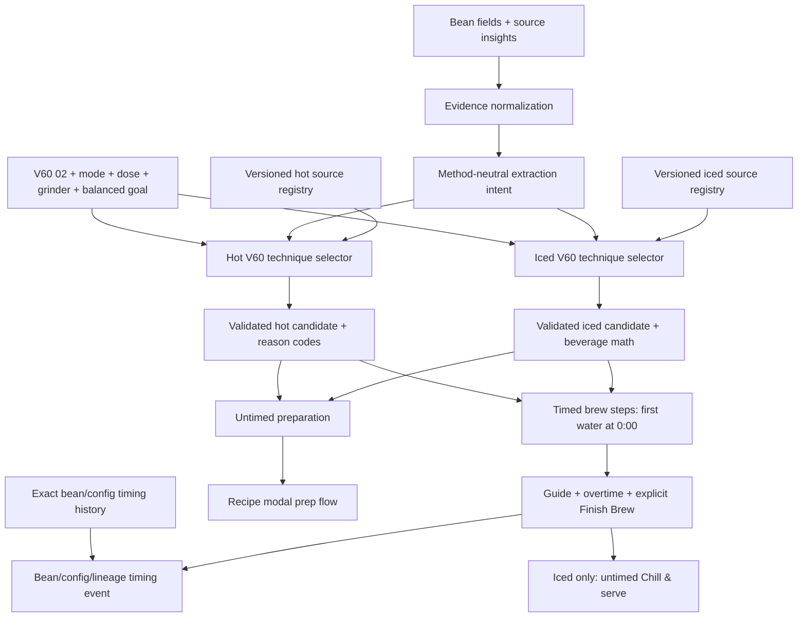
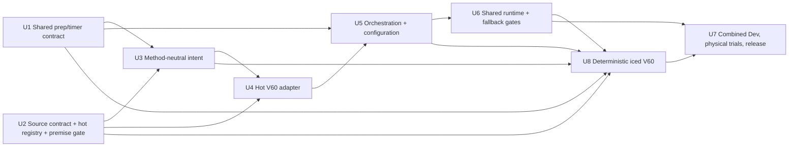

# Source-Backed Bean-Specific Hot and Iced V60 Recipe Engine

## Summary

Build deterministic hot and iced V60 02 recipe paths that select the most appropriate source-backed technique family for the coffee, requested dose, grinder, mode, and extraction demand. The first version uses a named balanced cup goal instead of adding another user control. The experience should feel like a professional chose a recipe for this bean and use case: the app explains the important reason for the choice, gives concise but explicit pour geometry and agitation instructions, and remembers completed-brew timing for this bean without pretending that drawdown time alone proves taste quality.

Before V60 cutover, establish one shared timer contract for all hand brews: preparation is untimed, the first water starts `0:00`, the displayed finish is guidance, the timer continues into overtime, and only the brewer's explicit Finish Brew action completes and saves the brew.

The hot and iced V60 02 adapters become the primary production paths together only after deterministic contract tests, a full read-only current-inventory evaluation at each bean's normal configuration, Dev delivery proof, and mode-specific physical brew trials. New-generation failure falls back to a conservative source-backed deterministic baseline for that mode; legacy GPT/transform recipes remain readable but do not author new V60 production recipes after cutover. There is no user-facing engine selector and no shadow-comparison product feature. Hot and iced share evidence normalization, phase validation, orchestration, and delivery, but retain independent source registries, technique selectors, lineage, and acceptance evidence so a sound hot recipe cannot silently authorize an unsound iced transform.

---

## Problem Frame

The current V60 path asks GPT to author physical recipe parameters from broad family defaults. It exposes only two named techniques, uses a static timing band, and render-time dose scaling changes grams while retaining grind, pour schedule, step times, and guide duration. That can make a 15g and 30g brew appear more similar than professional V60 practice supports.

The repository now has a stronger Kalita pattern—normalized evidence, extraction intent, a versioned deterministic adapter, explicit reason codes, recipe lineage, strict timer validation, and per-bean timing memory—but several seams remain Kalita-specific. Reusing them unchanged would leak flat-bed assumptions into V60, make cache matching depend on Kalita versions, and retain preparation as a timed phase in some hot and iced recipes.

The goal is not to manufacture cosmetic recipe differences or turn iced brewing into a fixed percentage transform. It is to select among bounded hot and iced V60 technique families, adapt only the variables supported by evidence, and preserve uncertainty when bean data is weak. For iced recipes, the system must also model hot extraction water, brew ice, expected final beverage water, and serving ice unambiguously.

---

## Requirements

### Recipe Selection and Provenance

- **R1. Bean-specific selection:** Choose a hot or iced V60 02 technique and starting parameters from evidence precedence, requested dose, grinder, mode, extraction demand, and a named balanced cup goal—not from one universal V60 recipe, one universal flash-brew split, or superficial origin labels. This slice records timing history but does not use elapsed time or deferred taste history to change technique.
- **R2. Source provenance:** Preserve original author, canonical URL, publication context, brewer size, dose, ratio, temperature, grind description, pour geometry, cadence, agitation, guide time, and whether the app uses an original, scaled, or adapted recipe. An aggregator is not independent corroboration.
- **R3. Technique coverage:** Support small, versioned, mode-specific technique sets. Hot covers balanced small-dose pulses, dedicated large-batch brewing, coarse 4:6-style pulses, high-extraction two-stage brewing, low-agitation continuous/main-pour brewing, and coarse controlled pulses. Iced covers a classic 60/40 flash-concentrate family and a pulse-driven approximately 67/33 flash family, with Kurasu's higher-agitation staged extraction as a supported subprofile. Every selected technique must state where to pour, how hard to pour, whether to agitate, and how to complete chilling.
- **R4. Dose and geometry:** Treat dose profile as a physical input for V60 02. Every V60 dose change must regenerate the deterministic recipe rather than merely rescale water totals while preserving the old schedule. V60 01/03 are follow-up configurations after demand validation.

### Timing and Runtime Contracts

- **R5. Timing semantics:** Rinse, preheat, load coffee, level the bed, and place server ice are preparation. The first brew water begins timed `0:00`; guide finish never auto-completes; overtime continues; explicit Finish Brew records actual drawdown time. Iced post-brew chilling or ice-removal instructions occur after the clock stops and never inflate drawdown history.
- **R6. Timing memory:** Match prior drawdown context by bean, device, V60 size, hot/iced mode, exact dose, technique/profile, and recipe lineage. This slice records and displays timing only as an observed `Last drawdown`; it cannot change the source guide, technique, grind, ratio, temperature, agitation, or any other extraction variable and is not taste feedback.
- **R7. Deterministic safety:** Candidate output must have finite physical values, compatible V60 02 dose/profile, a closed technique identifier, monotonic water totals, strictly ascending timed steps, a guide after the final instruction, explicit step copy, and reproducible engine/rules/source versions.
- **R8. Runtime compatibility:** Preserve readable legacy recipes, stale-request protection, source-hash invalidation, grinder translation, Firestore persistence, bounded hot and iced fallback, Quick Recipe behavior, and existing Kalita output while generalizing candidate matching and timing configuration by method and mode.

### Explanation and Evidence Use

- **R9. Honest rationale:** Show one compact, bean-specific “why this technique” explanation. Do not expose raw confidence labels such as “low confidence,” claim scientific certainty for expert convention, or imply customization through arbitrary numeric variation.
- **R10. Community gut check:** Use Reddit only to identify popular starting points, understandable user language, and recurring failures such as clogging or swirl-induced stalls. Community anecdotes remain low-confidence and cannot override primary sources, physical constraints, or observed user results.
- **R11. Independent iced truth:** Build deterministic iced V60 from iced-specific primary sources and an independent adapter, not by transforming a deterministic hot candidate. A hot V60 candidate is not proof that flash brew is sound. Iced receives its own source registry, engine/rules versions, technique identifiers, contract tests, inventory evaluation, Dev evidence, and physical brew gate.
- **R13. Iced beverage math:** Store coffee dose, hot brew water, initial brew ice, final beverage-water target, and serving ice as distinct recipe fields. Store measured melted/remaining ice, actual final beverage mass, and actual final temperature only when the user or a calibration record supplies those observations. Brew ice is recipe water and post-extraction bypass; serving ice is excluded from the recipe-water ratio. Initial ice mass must never be presented as guaranteed melted dilution.

### Delivery

- **R12. Delivery proof:** Validate on Dev first with exact app variant, OTA/channel, bundle identity, and device adoption evidence. Production requires explicit acceptance after physical brews; release reporting must distinguish source review, deterministic tests, build proof, OTA publication, and observed device adoption.

---

## Scope Boundaries

- No per-generation web search. Recipe generation uses versioned local source records plus existing bean/source insights.
- No public recipe marketplace, voting system, or raw source browser in the primary recipe flow.
- No user-facing “legacy vs. bean-specific” engine control and no shadow-comparison product surface.
- No arbitrary recipe diversity. Identical inputs may correctly produce identical recipes when the evidence does not justify a different branch.
- No filter picker in this first slice. Use the standard Hario-paper assumption, keep filter/flow limitations explicit in metadata, and defer a visible filter control until it materially improves decisions.
- No automatic multi-variable optimization from elapsed time. Timing is a flow observation; tasting remains the authority for flavor direction.
- No historical recipe or timing-event rewrite. Legacy records remain readable under their original lineage.
- No hot or iced V60 production cutover until both modes pass their own Dev and physical-brew acceptance gates; the release is combined, while the evidence remains independently reviewable.
- No external chiller, removable ice chamber, cold brew, or multi-hour ice-percolation workflow in this V60 02 direct-to-server slice.
- No unsupported claims that flash brewing “locks in aromatics,” “stops oxidation,” or preserves flavor through scientifically proven shock chilling. Product copy may say only that coffee is brewed hot directly over ice for rapid cooling.
- No claim to reproduce Koffee Mameya's private system; the product adopts the public decision pattern of matching a recipe to a coffee and use case.

### Deferred Follow-Up

- Link structured tasting outcomes to the exact recipe/timing event and apply one bounded revision at a time.
- Add V60 01/03, filter, and dripper-material inputs if field data shows they change branch selection enough to justify UI cost.
- Extend the method-neutral adapter registry to Chemex, AeroPress, French press, and other methods after independent research and brew gates.
- Add a full bean brew-history surface; the recipe remains intentionally compact.

---

## Context & Research

### Repository Architecture

- `src/hooks/useHandBrew.js` owns stale-request cancellation, source-aware cache reuse, candidate/fallback orchestration, recipe persistence, and size changes. Its candidate matcher is currently hard-coded to Kalita engine/rules versions and `kalitaSize`.
- `src/lib/recipeEvidence.js` and `src/lib/extractionIntent.js` provide the evidence-to-intent boundary, but the intent vocabulary and one family rule still contain Kalita technique assumptions.
- `src/lib/kalitaAdapter.js` is the production pattern for a deterministic method adapter: versioned inputs, dose profiles, technique reason codes, explicit steps, closed validation, and recipe lineage.
- `src/lib/handbrew.js` remains the legacy GPT recipe generator and still instructs some recipes to put filter rinse at timed `0:00`.
- `src/lib/recipeScaling.js` scales dose, water, and step copy but intentionally preserves technique, grind, step anchors, and total duration. That is safe for legacy display but insufficient as the primary V60 dose policy.
- `src/lib/flashBrewTransform.js` currently hard-codes a 60/40 split, inserts server ice as timed `0:00`, shifts the recipe by ten seconds, scales structured water totals without reliably rewriting action copy, often fails to shift string-valued grind settings, can desynchronize Celsius/Fahrenheit text, and inherits hot engine/source metadata. It cannot remain the production iced V60 generator.
- `src/lib/brewTimingMemory.js` already stores bean/device/mode/dose/lineage context but names the method configuration `kalitaSize`; this must become a generic configuration identity without invalidating historical events.
- `src/lib/brewTimerSteps.js`, `src/hooks/useBrewTimer.js`, and `src/components/BrewTimer.jsx` already support guide overtime and explicit user finish. The missing contract is an untimed preparation phase before the timer begins.
- `src/components/HandBrewModal.jsx` already provides a single rationale area and a clear recipe-to-timer transition. V60 02 should preserve that simplicity: no size or cup-goal control in the first slice.
- `src/lib/sourceInsights.js` currently carries brew guidance mostly as normalized text; it does not provide the structured direct-recipe fields needed to rank an exact roaster recipe above an adapter baseline.
- `src/components/HandBrewModal.jsx` currently derives iced recipes synchronously from the displayed hot recipe and freezes the result for the timer. The new path must request a separately validated `(device, mode)` candidate from orchestration and keep hot and iced snapshots/cache slots distinct.
- `docs/data/japanese-iced-pour-over-research.md` contains useful prior research but also conflicting examples: Kurasu's 16g/150g hot/70g ice recipe sits beside a later universal 60/40 framing. It is an audit input, not production truth.
- The default `npm test` aggregate excludes existing Kalita/evidence/intent recipe-engine suites. This work needs one named recipe-engine gate included in the default aggregate.

### Source-Backed Technique Families

| Technique family | Canonical starting evidence | Best starting use | Important limits |
|---|---|---|---|
| Hoffmann one-cup pulses | James Hoffmann, 15g/250g, 50g bloom plus four 50g additions | Balanced 12–18g default with ordinary flow risk | Not the same schedule as his large-batch technique; exact finish varies |
| Hoffmann large-batch | James Hoffmann/Hario, 30g/500g, bloom then two larger staged pours | 25–30g batches | Requires a dedicated grind and schedule; do not scale the one-cup timer |
| Kasuya 4:6 | Tetsu Kasuya/Hario, 20g/300g, coarse five-pour structure | Sweetness/body preference and coarse, repeatable pulses | Flavor-control claims are expert convention, not controlled scientific law |
| Rao two-stage | Scott Rao/Hario, 20g/330g, aggressive bloom plus two-stage main pour | Dense/light, low-fines coffee with a capable grinder and high-extraction goal | Spin/agitation can migrate fines and stall unsuitable coffees |
| Bloom plus continuous/main pour | Heart, Stumptown, Counter Culture patterns | High-fines or stalling coffee; lower agitation and simpler execution | “Center only” is not universal; stream must still wet the bed evenly |
| Coarse controlled pulses | Kurasu and April staged-pour patterns | Very light, low-fines coffees or a clarity/body target that benefits from staged energy | Exact cadence is source-specific; avoid attributing one author's recipe to another |

The adapter owns these as internal technique families with versioned source links. UI naming should describe the action (“gentle main pour,” “controlled pulses”) before invoking personalities or unsupported sensory promises.

### Source-Backed Iced Technique Families

There is no SCA-standard iced V60 recipe. Primary sources support two direct-to-server flash families; equipment-specific ice chambers, flat-bed recipes, and multi-hour ice percolation remain comparison evidence rather than production V60 families.

| Iced technique family | Canonical starting evidence | Best starting use | Important limits |
|---|---|---|---|
| Classic 60/40 flash concentrate | James Hoffmann, 65g/L total with 60% hot water and 40% brew ice; corroborated by Market Lane | Approximately 25–33g, two-serving workflows where the larger dose supports a 60/40 extraction budget | Hoffmann's original 500g example is 32.5g, not the commonly transcribed 30g; exact pour geometry is incomplete; do not blindly scale this down to 15g |
| Pulse-driven approximately 67/33 flash | Partners Coffee 20g/200g hot/100g ice; Counter Culture 30g/335g hot/165g ice; Kurasu 16g/150g hot/70g ice | Strongest single-cup baseline, especially 15–20g | Each source has its own cadence and agitation; source-version differences must remain visible rather than averaged into a fake canonical recipe |
| Kurasu staged extraction subprofile | Kurasu light-roast 16g/150g/70g and Fairfield medium/dark variants | A compatible single-cup branch when roast/evidence supports its staged agitation and bounded dose/temperature changes | English/Japanese grind descriptions conflict; preserve the conflict and do not invent precision. Technique family stays stable while roast tunes dose, temperature, and grind |

Slow ice percolation from Tetsu Kasuya/Philocoffea is authoritative but a separate 4–15-hour beverage. Hario's removable ice chamber is equipment-specific. April and Onyx provide flat-bed controls only. None may be silently treated as direct V60 flash evidence.

### Evidence Strength and Selection Priority

Use inputs in this order:

1. A compatible, exact roaster recipe for the same coffee and V60 02 configuration, as the cold-start candidate. Repeated successful same-user tasting history may outrank it only after the deferred tasting-linkage work exists.
2. Dose and V60 02 geometry.
3. Roast development and extraction demand.
4. Evidence-backed fines/stall tendency from bean and grinder characteristics; elapsed-time history is display context only in this slice.
5. The v1 balanced cup goal.
6. Roast age and observed bloom behavior.
7. Process, variety, altitude/density proxy, origin, and tasting-note language only as soft tie-breakers.

For iced mode, choose the 60/40 versus approximately 67/33 family primarily from dose, bed depth, desired beverage size, and hot-water extraction budget. Bean/roast evidence tunes dose, temperature, grind, cadence, and agitation within a supported family; it does not hard-route `light = one family` and `dark = another`. Iced family selection never consumes a hot technique identifier.

Strong physical evidence supports treating pour energy, fines/permeability, roast structure, bed depth, and user pouring repeatability as interacting variables. Lighter-hotter, darker-gentler, Ethiopia/decaf-fines tendencies, exact time targets, and named-technique cup labels remain useful professional starting conventions, not laws.

### External References

- [James Hoffmann one-cup V60](https://www.youtube.com/watch?v=1oB1oDrDkHM) and [follow-up Q&A](https://www.youtube.com/watch?v=v5WQ1sZzW4o)
- [James Hoffmann large-batch V60 via Hario](https://www.hario-usa.com/blogs/recipes-and-more-from-friends/james-hoffmann-uitimate-v60-technique)
- [Tetsu Kasuya 4:6 via Hario](https://www.hario-europe.com/blogs/hario-community/v60-ambassadors-tetsu-kasuya) and [original video](https://www.youtube.com/watch?v=wmCW8xSWGZY)
- [Scott Rao V60 recipe via Hario](https://www.hario.co.uk/blogs/hario-ambassadors/hario-v60-recipe-interview-with-hario-ambassador-scott-rao) and [2026 grind-setting guidance](https://www.scottrao.com/blog/how-to-choose-a-grind-setting)
- [Kurasu current brew guide](https://kurasu.kyoto/blogs/kurasu-journal/kurasu-coffee-brew-guide-2022) and [dose-scaling field notes](https://kurasu.kyoto/blogs/kurasu-journal/how-to-brew-2-cups-at-once-how-we-do-it-at-kurasu)
- [April V60 recipe](https://www.youtube.com/watch?v=otk2jFRCcmE)
- [Heart V60](https://www.heartroasters.com/pages/v60), [Stumptown V60](https://www.stumptowncoffee.com/pages/brew-guide-hario-v60), and [Counter Culture pour-over](https://counterculturecoffee.com/blogs/counter-culture-coffee/guide-to-pour-over-coffee)
- [Hario V60 sizes](https://www.hario-europe.com/pages/the-v60-dripper)
- [SCA two-cup pour-over best practices](https://sca.coffee/s/best-practices-two-cup-pour-over-brewer.pdf): preparation precedes the timer; first water begins the brew clock
- [Barista Hustle on the Rao spin](https://www.baristahustle.com/the-rao-spin/) and [drawdown](https://www.baristahustle.com/lesson/p-1-07-drawdown/)
- [Coffee ad Astra on brewing better coffee](https://coffeeadastra.com/2018/11/30/brewing-better-coffee/) and [fines/clogging](https://coffeeadastra.com/2020/04/02/why-cant-we-grind-coffee-finer-for-pour-over/)
- [Pour dynamics, Physics of Fluids (2025)](https://doi.org/10.1063/5.0257924), [roast structure and extraction](https://pmc.ncbi.nlm.nih.gov/articles/PMC7404565/), [temperature at matched extraction](https://pmc.ncbi.nlm.nih.gov/articles/PMC7536440/), and [pouring reproducibility](https://www.sciencedirect.com/science/article/pii/S0889157523005720)
- [Gota V60 02 library](https://gota.cafe/en/recipes/v60-02), used for discovery and range coverage—not as automatic recipe truth. Its [Hoffmann-labeled card](https://gota.cafe/en/recipes/v60-02/hoffmann-v60) differs from Hoffmann's newer official one-cup method, so provenance must retain version and derivation.
- [James Hoffmann iced filter coffee](https://www.youtube.com/watch?v=PApBycDrPo0): original 65g/L, 60/40 flash family; secondary 30g/500g transcriptions are not canonical.
- [Kurasu Japanese iced V60](https://kurasu.kyoto/blogs/recipe/japanese-brew-guide-on-iced-pour-over-coffee), [detailed Japanese recipe](https://jp.kurasu.kyoto/blogs/kurasu-journal/iced-pourover-coffee-hariov60), [Q&A](https://jp.kurasu.kyoto/blogs/kurasu-journal/iced-pourover-coffee-hariov60-q-a), and [medium/dark Fairfield variants](https://jp.kurasu.kyoto/blogs/kurasu-journal/fairfield-recipe)
- [Partners Coffee flash brew](https://help.partnerscoffee.com/en-US/flash-brew-413883): current compact 20g/200g hot/100g ice baseline with a 2:40–3:20 guide.
- [Counter Culture flash brew](https://counterculturecoffee.com/pages/flash-brew): 30g/335g hot/165g ice pulse recipe; internal timing-summary conflict must be retained as a source warning.
- [Market Lane iced pour over](https://marketlane.com.au/pages/how-to-make-iced-pour-over-coffee): independent 60/40 professional corroboration.
- [Hario VIC-02B manual](https://global.hario.com/product/VIC-02B.pdf): manufacturer guidance for a removable ice chamber, retained as equipment-specific comparison rather than a scalable direct-server recipe.
- [Tetsu Kasuya/Philocoffea slow ice brew](https://en.philocoffea.com/blogs/blog/cold-ice-brew-coffee-recipe-tips): authoritative non-flash exclusion.
- [Temperature/TDS/EY at matched extraction](https://doi.org/10.1038/s41598-020-73341-4), [pour-over extraction kinetics](https://doi.org/10.1111/jfpe.13748), [V60 pour dynamics](https://doi.org/10.1063/5.0257924), and [fines/permeability](https://doi.org/10.1038/s41598-024-55831-x) support physical bounds but do not establish an optimal iced fraction.
- [Hot versus cold extracted coffee served cold](https://doi.org/10.3390/foods11162440) and [shock-chill pilot](https://doi.org/10.3390/foods10040865) do not justify strong aroma-preservation or universal rapid-chill superiority claims.

### Reddit Gut Check

The dated research artifact should preserve these threads and any updated sample context:

- [Common V60 recipes](https://www.reddit.com/r/pourover/comments/173cyy2)
- [Favorite daily V60 approach](https://www.reddit.com/r/pourover/comments/1i5rt73)
- [Hoffmann recipe experience](https://www.reddit.com/r/pourover/comments/1cwg514)
- [Two-pour recipe discussion](https://www.reddit.com/r/pourover/comments/11jylo9)
- [Hoffmann method troubleshooting](https://www.reddit.com/r/JamesHoffmann/comments/16olxns)
- [Recent recipe comparison discussion](https://www.reddit.com/r/pourover/comments/1r6wvtw)
- [How users make iced pour-over](https://www.reddit.com/r/pourover/comments/1tqbgtp/how_do_you_guys_do_your_iced_pourovers/)
- [Japanese-style iced coffee discussion](https://www.reddit.com/r/Coffee/comments/13pygdb/whats_the_deal_with_japanese_style_iced_coffee/)
- [Iced V60 troubleshooting](https://www.reddit.com/r/pourover/comments/1jtssvc)
- [Why drawdown misses three minutes](https://www.reddit.com/r/pourover/comments/1udmax7/how_do_you_guys_get_3_min_drawdown_times/)
- [Scaling pour-over recipes](https://www.reddit.com/r/Coffee/comments/oi18un/scaling_up_pourover_recipes/)

Repeated low-confidence signals are: five-pour methods can stall fines-heavy coffees; bloom/final swirls can worsen some stalls; Hoffmann is not universal; 4:6 is popular for sweetness and repeatability; simpler two-pour recipes are popular for clarity and reduced clogging; published finish times are often over-treated as hard targets; larger doses usually need their own grind and longer drawdown expectations. For iced brews, users frequently disagree on 60/40 versus roughly 67/33, report remaining brew ice and dilution changes, and struggle when hot recipes are merely scaled down. These are test prompts, not numeric authority.

---

## Key Technical Decisions

- **Fix the shared clock boundary before adding V60.** A recipe cannot teach useful drawdown or personal timing if preparation is counted as brewing. New versioned recipes carry untimed preparation separately from timed brew steps; first water is always timed `0:00`.
- **Keep deterministic code authoritative for physical parameters.** AI/source research normalizes bean facts and produces explainable intent. Mode-specific V60 adapters select technique, ratio, temperature, grind direction, water/ice schedule, agitation, nominal guide target, and optional tasting range from closed rules.
- **Select from technique families instead of generating arbitrary recipes.** This provides professional variety where the evidence supports it while keeping output reproducible and testable.
- **Prefer exact compatible roaster recipes as a cold-start branch, with provenance.** Add a structured direct-recipe source contract rather than parsing arbitrary prose. An exact recipe can become a bounded direct-source branch only when its equipment, dose, and fields are parseable. Any app adaptation records what changed and why; malformed or absent structured data falls through to the adapter baseline.
- **Regenerate for every V60 dose or mode change.** A 15g, 20g, and 30g V60 may require different grind and cadence, and iced mode changes the extraction-water budget itself. Deterministic regeneration is fast and avoids physically unproven within-profile scaling in the first release; legacy and Kalita policies remain unchanged.
- **Ship V60 02 first.** This proves the bean-specific selector without adding a 01/02/03 UI and its cache/test matrix before demand is known. V60 01/03 remain explicit follow-ups.
- **Generalize adapter and timing identities.** Candidate matching dispatches by method, mode, engine/rules/source-registry versions, and a canonical physical `configurationKey`. Historical `kalitaSize` fields remain readable; new V60 events record `v60:02:standard-paper`, hot/iced mode, dose profile, and technique lineage separately.
- **Record timing without promoting it to guidance in v1.** Exact-lineage timing appears only as `Last drawdown`, secondary to the source guide. It does not participate in candidate selection until tasting linkage defines whether a slow or fast brew was actually desirable.
- **Generate iced independently; never transform a deterministic hot candidate.** `v60IcedAdapter` consumes neutral evidence and the requested iced configuration directly. It may share sanitization, grinder translation, phase validation, and orchestration primitives with hot V60, but it cannot import a hot technique schedule or treat the legacy 60/40 transformer as production logic.
- **Model iced water honestly.** Store hot brew water, initial brew ice, final beverage-water target, and serving ice separately. Initial brew ice is post-extraction bypass and may not fully melt by drawdown; serving ice is not included in the recipe ratio. UI labels both the hot extraction ratio and final beverage ratio without implying measured melt when none exists.
- **Separate drawdown from chilling.** Finish Brew stops and saves actual drawdown when drainage ends. A compact untimed `Chill & serve` state then instructs the user to swirl/stir until the recipe's brew ice melts—or remove it for a future supported chamber—and serve over fresh ice. It adds no timer ring, no second recipe explanation, and no extra persistent navigation level.
- **Keep fallback invisible, deterministic, and bounded.** Each V60 mode uses its deterministic selector by default. Candidate construction failure invokes one conservative source-backed baseline owned by that mode and records the reason; it never invokes new GPT authorship or transforms a hot candidate. Legacy records remain readable, and a deterministic hot candidate is structurally rejected by the compatibility transformer.
- **Validate hot and iced independently, release them together.** Hot and iced retain separate registries, fixtures, physical matrices, lineage, and pass/fail evidence. The combined release waits until both pass, preventing one mode's success from authorizing the other.
- **Cut over directly after gates, without shadow product work.** Deterministic fixtures, inventory evaluation, Dev adoption proof, and physical brews replace a legacy-vs-candidate shadow feature the user does not need.

---

## High-Level Technical Design

> This is a directional boundary map, not implementation code. Unit-level decisions and tests remain authoritative.

### Implementation Dependency Map

---

## Implementation Units

### U1. Establish untimed preparation and timed-brew contracts

**Goal:** Make first water the universal hand-brew `0:00`, prevent guide time from completing a brew, and separate iced drawdown from untimed chilling.

**Requirements:** R5, R7, R8, R11

**Dependencies:** None

**Files:**
- Modify: `src/lib/handbrew.js`
- Modify: `src/lib/kalitaAdapter.js`
- Modify: `src/lib/flashBrewTransform.js`
- Modify: `src/lib/brewTimerSteps.js`
- Modify: `src/hooks/useBrewTimer.js`
- Modify: `src/components/HandBrewModal.jsx`
- Modify: `src/components/BrewTimer.jsx`
- Modify: `src/lib/recipeScaling.js`
- Test: `scripts/brew-timer-lifecycle.test.mjs`
- Test: `scripts/kalita-runtime-contract.test.mjs`
- Create: `scripts/handbrew-prep-contract.test.mjs`

**Approach:**
- Introduce a versioned recipe phase contract that separates `prepSteps`, timed `steps`, and optional `postBrewSteps`. New candidates put rinse/preheat, dry dose/loading, leveling, and server ice in preparation; iced chilling/serving instructions occur after Finish Brew; legacy recipes remain readable without a destructive migration.
- Define `phaseContractVersion: 1`. For older records, derive a non-persisted effective snapshot through a pure legacy normalizer: move only unambiguous rinse/preheat/load/ice actions into preparation, re-anchor the first identifiable water step at `0:00`, and disable the timer with a Regenerate action when the first water cannot be identified safely. Never save prep-contaminated legacy timing into the new memory.
- Moving Kalita loading out of timed steps and bloom to `0:00` changes timing identity. Bump Kalita rules/lineage and require new exact-lineage events so old prep-contaminated samples cannot match the phase-v1 recipe.
- Define timed step zero as the bloom/first water. Keep `buildTimerSteps` strict: every timed step ascends and guide duration follows the final timed instruction.
- Show preparation as a short, calm pre-start checklist in `HandBrewModal`. One deliberate primary action—`Start Bloom & Timer`—transitions directly to a timer screen already showing bloom target and cue, and starts at `0:00`; there is no second confirmation.
- Keep one `guideTargetSeconds` value for ring/overtime behavior and a separate optional diagnostic range for tasting copy. Overtime begins at the target, not at an ambiguous range boundary, and never completes the brew.
- Preserve the current explicit Finish Brew, guide reached, overtime, pause exclusion, abandonment, and idempotent timing-save behavior. A step-navigation tap may never complete the brew.
- After an iced Finish Brew tap, snapshot drawdown exactly once, then always show one compact untimed `Chill & serve` card. The card states the source-backed melt/stir instruction and has one primary `Coffee chilled` action leading to the existing completion screen where `Start Tasting Session` and `Done` remain available. Its secondary status is truthful: `Drawdown saved` after a successful write, the existing retry-save affordance after failure, or `Timing not saved · Quick Recipe` for an ephemeral session. `Coffee chilled` remains available in all three states. Closing preserves any successful event and returns through the existing completion dismissal path; reopening cannot save twice. VoiceOver announces timing status, instruction, then action. The card preserves safe-area padding, Dynamic Type, 44pt controls, and the current single-primary-action hierarchy.
- Remove the ten-second timed ice-prep shift for versioned flash recipes while retaining safe interpretation of historical iced recipes.
- Define the final timer sequence: final pour active; drawdown waiting with `Let it drain; finish when dripping ends`; guide exceeded with a secondary `Past guide by …` label while elapsed time continues. Only Finish Brew uses completion styling.
- Keep active-step presentation to three bounded layers—primary action, weight target, and one short technique cue. Full explanation stays in the pre-brew recipe view; target weight and pattern remain visible without scrolling on supported iPhones and Dynamic Type sizes.

**Test scenarios:**
- A new hot Kalita candidate renders rinse/load as preparation and bloom as timed `0:00`.
- A new iced recipe places server ice in preparation while first brew water remains timed `0:00`; guide time excludes prep.
- Reaching guide time shows overtime and does not transition to completion or save timing.
- Skipping the load/prep instruction does not subtract from or advance elapsed brew time.
- A user finishing at 4:42 against a 5:10 guide saves 4:42 and does not appear to have auto-ended.
- An iced brew finished at 2:42 saves 2:42 even when the user spends another 25 seconds swirling to melt brew ice; post-brew completion cannot mutate the timing event.
- From `Chill & serve`, `Coffee chilled` reaches the existing tasting/done completion state; close/dismiss preserves the already-saved drawdown and never duplicates it.
- Saved, failed-then-retried, and ephemeral Quick Recipe iced completions all expose `Coffee chilled`; only successful persisted sessions claim `Drawdown saved`.
- Legacy hot and iced recipes without `prepSteps` remain renderable and do not corrupt stored data.
- An unambiguous cached legacy recipe normalizes at read time and saves brew-only elapsed time; an ambiguous legacy recipe stays viewable but cannot start a timer until regeneration.
- VoiceOver announces preparation order, guide versus actual elapsed time, drawdown/overtime state, and the Finish Brew action; the flow does not rely on color alone and retains 44pt targets.
- Non-monotonic timed steps or a guide at/before the final instruction fail the timer-ready gate.

**Verification:** Timer tests prove the phase boundary and explicit completion lifecycle; Kalita output remains structurally and behaviorally compatible.

### U2. Build the shared source contract, hot registry, provenance audit, and premise matrix

**Goal:** Turn hot V60 research into versioned, reviewable recipe evidence and define the shared structured-source contract used by both mode-specific registries.

**Requirements:** R1, R2, R3, R9, R10, R11

**Dependencies:** None

**Files:**
- Create: `docs/data/v60-source-registry.md`
- Create: `src/data/v60SourceRegistry.js`
- Create: `docs/data/v60-reddit-gut-check.md`
- Create: `docs/data/v60-recipe-evaluation-beans.json`
- Create: `docs/data/v60-premise-trial-results.md`
- Create: `scripts/v60-source-registry.test.mjs`
- Modify: `src/lib/sourceInsights.js`
- Modify: `src/lib/gemini.js`
- Modify: `src/lib/claude.js`
- Modify: `src/lib/recipeEvidence.js`

**Approach:**
- Make `src/data/v60SourceRegistry.js` the machine-readable authority for source/rule records consumed directly by adapters and registry tests. Treat `docs/data/v60-source-registry.md` as the human-audited explanatory view; tests fail when the view/version/IDs drift from executable truth.
- Record original author and canonical source before aggregators. Capture source version/date, equipment, canonical dose, ratio, temperature, grind language, exact pours, geometry, agitation, guide time, and allowed adaptation boundaries.
- Add a versioned structured `sourceInsights.brewRecipes` contract carrying those fields plus `mode` and physical configuration. Extend both extraction schemas, source normalization/hash, and recipe evidence so direct-source matching never depends on parsing arbitrary prose. A valid recipe-only source counts as structured evidence even when surrounding prose is absent; missing, empty, or malformed arrays simply make the direct-source branch unavailable.
- Bump structured-source normalization and source-context hash versions when the recipe contract lands so newly added/changed direct recipes invalidate previously cached candidates.
- Label each record `original`, `scaled`, `adapted`, or `aggregated`; record every changed field for adaptations. Encode the Gota/Hoffmann one-cup mismatch as a provenance regression fixture.
- Give every production parameter class—ratio, dose band, grind direction, temperature, bloom, cadence, geometry, agitation, and guide target—a rule/source ID. Cross-source combinations must record an adaptation rationale and allowed bounds rather than passing on family-level citation alone.
- Define evidence tiers: primary author/manufacturer; physical/controlled research; established professional convention; aggregator/discovery; community anecdote.
- Build redacted evaluation fixtures spanning light/medium/dark, washed/natural/experimental/decaf, dense/low-density proxies, high/low/unknown fines risk, sparse/conflicting data, V60 02 doses from 12–30g, and all supported/unknown grinders.
- Keep Reddit observations dated and separate from production truth; promote only repeated failure modes into tests.
- Before U3–U8 implementation, manually prototype representative hot and iced source-backed candidates for four existing beans: ordinary washed, fines/stall-risk, natural/processed, and developed. Run one randomized-order three-cup comparison per mode and bean against both current GPT output and a simple fixed dose/roast/fines baseline, for 24 cups total. Proceed when the source-backed selection is preferred in at least 6 of 8 mode/bean comparisons or clearly avoids the failure named by its reason code without creating a new defect; otherwise simplify the selector premise before building adapters. Record exact recipes, anonymized bean class, preference/failure outcome, and stop/go decision.

**Test scenarios:**
- Every production technique/rule points to at least one registry entry and declares evidence type.
- Every candidate parameter points to its specific rule/source ID; an unsupported cross-source mixture fails provenance validation.
- Structured exact-roaster data matches only compatible V60 02 records; missing or malformed recipe arrays fall through to the adapter baseline without failing generation.
- Gota's Hoffmann card cannot be labeled as the official newer one-cup recipe.
- Aggregated cards do not increment independent-source counts for the same underlying recipe.
- A Reddit-only claim cannot set a production numeric parameter or outrank a primary source.
- Evaluation fixtures contain sparse and contradictory inputs, not only ideal beans.
- The premise trial records all 24 brews, prevents recipe labeling during tasting, uses consistent water/grinder/brewer within each comparison, and produces an explicit stop/go decision before U3 begins.

**Verification:** A deterministic registry audit fails for missing authorship, unsupported rules, broken source relationships, or incomplete evaluation coverage.

### U3. Generalize extraction intent without changing Kalita behavior

**Goal:** Give every method shared physical/sensory intent while leaving technique mapping inside the method adapter.

**Requirements:** R1, R6, R8, R9

**Dependencies:** U1, U2

**Files:**
- Modify: `src/lib/extractionIntent.js`
- Modify: `src/lib/recipeEvidence.js`
- Modify: `src/lib/sourceInsights.js` only if an existing normalized field cannot carry required provenance
- Test: `scripts/extraction-intent.test.mjs`
- Test: `scripts/recipe-evidence.test.mjs`
- Modify: `scripts/kalita-adapter.test.mjs`

**Approach:**
- Keep method-neutral output to extraction demand, balanced cup direction, temperature/energy tendency, evidence-backed fines/stall tendency, bloom/freshness behavior, confidence by fact, conflicts, and soft priors.
- Capture comprehensive redacted Kalita intent/adapter snapshots across current roast/process/fines/data-quality branches before refactoring; the post-refactor suite must prove fixture-equivalent physical output apart from the explicitly versioned phase migration.
- Remove Kalita technique names and flat-bed-only family rules from shared intent. Kalita maps the neutral intent back to its existing techniques and must retain fixture-equivalent results unless the shared timer contract explicitly changes them.
- Keep elapsed-time history out of extraction intent in this slice. Timing remains a separately matched display/history contract until tasting linkage can say whether a drawdown outcome was desirable.
- Preserve evidence precedence and prompt-injection sanitization. Missing data yields conservative unknowns, not invented precision.

**Test scenarios:**
- The same neutral intent can be consumed by Kalita and V60 without containing either method's technique identifier.
- Existing Kalita fixtures retain technique, ratio, temperature, grind, and reason codes after the refactor.
- Exact-lineage timing can change the displayed `Last drawdown` observation but cannot alter the source guide, intent, or candidate selection.
- Timing from another bean, size, dose, mode, technique, or lineage is excluded from exact matching; cross-dose history may remain stored but is not shown in v1.
- Process/origin/tasting notes alone cannot force a technique branch.

**Verification:** Shared intent is deterministic and method-neutral; Kalita regression tests prove no accidental recipe drift.

### U4. Implement the deterministic hot V60 adapter and technique selector

**Goal:** Generate a source-traceable, dose-aware hot V60 candidate with explicit actions and closed validation.

**Requirements:** R1, R2, R3, R4, R6, R7, R9, R10

**Dependencies:** U2, U3

**Files:**
- Create: `src/lib/v60Adapter.js`
- Create: `scripts/v60-adapter.test.mjs`
- Create: `scripts/v60-recipe-contract.test.mjs`

**Approach:**
- Define hot V60 engine/rules/source-registry versions, `mode: "hot"`, V60 02 dose profiles from 12–30g, technique identifiers, reason codes, parameter bounds, and a closed candidate validator.
- Define one conservative hot baseline inside the same registry/validator for valid configurations whose specialized candidate construction fails. It carries explicit fallback reason/lineage and satisfies the same phase, provenance, timer, grinder, and source contracts; orchestration errors rather than invoking GPT if even the baseline cannot validate.
- Keep this adapter hot-only. It exposes no “convert to iced” path and emits metadata that the legacy flash transformer must reject.
- Selection order: compatible structured exact-roaster cold start; dose profile; extraction demand; evidence-backed fines/stall tendency; balanced cup goal; age/bloom; soft tie-breakers. Use a balanced small-dose pulse baseline for unknown ordinary-flow cases. Elapsed-time history is not a selector input in v1.
- Implement bounded branches for Hoffmann-style small pulses, dedicated large batch, 4:6/coarse pulses, Rao-style two stage, gentle continuous/main pour, and Kurasu/April-inspired controlled pulses. Preserve authorship by describing app adaptations rather than falsely presenting them as exact originals.
- State pour geometry in every relevant action: center start, spiral radius, keep water off paper, stream height/flow, rest/drain threshold, and swirl/no-swirl condition.
- Emit a single nominal `guideTargetSeconds` from source/profile and an optional tasting range. Record both as diagnostic guidance, not universal finish; only the nominal target controls the ring/overtime state. Validate final output through the same downstream timer contract used by the UI.
- For known grinders, use the shared native-setting translation. For missing or custom/`other` grinders, emit a validated micron range and descriptor without silently showing an Ode-derived numeric setting.
- Emit parameter-level source/rule IDs and concise lineage such as `Adapted from James Hoffmann's one-cup method`; full URLs remain outside the active timer.
- Prefer stable rules over fake precision. Two beans with the same relevant evidence should receive the same recipe and explanation.

**Test scenarios:**
- 15g V60 02, ordinary flow, balanced goal selects the small-dose pulse baseline with an explicit bloom and pour geometry.
- 30g V60 02 selects a dedicated large-dose schedule and coarser grind direction, not a scaled 15g timer.
- A bean with evidence-backed high-fines/stall tendency selects the low-agitation main-pour branch and avoids an automatic final swirl; elapsed time alone cannot trigger it.
- Dense, very light, low-fines input can select a higher-energy two-stage or controlled-pulse branch with evidence-backed reason codes.
- Compatible direct-source guidance or bean evidence favoring a sweeter, fuller starting profile can select a coarse 4:6-style branch without claiming its flavor-control theory is scientific law.
- Dark/developed coffee starts cooler/gentler only as a labeled professional convention within safe bounds.
- Sparse, conflicting, or unknown inputs yield a conservative validated baseline; invalid physical inputs fail closed and invoke orchestration fallback.
- Known grinder fixtures produce valid native settings; missing and custom grinders produce micron-only guidance with no Ode fallback.
- All fixtures have finite parameters, correct final water, monotonic totals/times, guide after final instruction, source lineage, parameter-level derivation, and explicit agitation language.

**Verification:** Offline adapter and contract suites cover all technique branches, V60 02 dose profiles, boundary values, grinders, direct-source fallthrough, and invalid inputs with deterministic snapshots.

### U5. Generalize orchestration, cache identity, recipe rationale, and timing lineage

**Goal:** Make mode-specific V60 candidates the automatic production paths while preserving cache correctness and a simple recipe experience.

**Requirements:** R4, R6, R8, R9

**Dependencies:** U1, U4

**Files:**
- Modify: `src/hooks/useHandBrew.js`
- Modify: `src/components/HandBrewModal.jsx`
- Modify: `src/lib/brewTimingMemory.js`
- Modify: `src/lib/recipeScaling.js`
- Create: `scripts/handbrew-v60-integration.test.mjs`
- Modify: `scripts/brew-timing-memory.test.mjs`
- Modify: `scripts/handbrew-timing-memory-integration.test.mjs`

**Approach:**
- Replace Kalita-only candidate checks with a small adapter descriptor/registry keyed by `(device, mode)`. Hot V60 02 uses U4 automatically; iced V60 02 is registered by U8. Each descriptor exposes its conservative deterministic baseline and retryable error behavior; legacy GPT/transform is compatibility-only after V60 cutover.
- Make each `(device, mode)` descriptor own its canonical physical `configurationKey`: hot V60 uses `v60:02:standard-paper`, while iced direct-to-server uses `v60:02:standard-paper:direct-server`. Continue to normalize historical `kalitaSize` on reads without rewriting stored records; new candidates cannot omit their descriptor-owned configuration key.
- Build a pre-selection input fingerprint from normalized evidence/intent, mode, structured direct-recipe hash, exact dose profile, configuration, grinder translation, source-insight hash, source-registry version, engine version, rules version, and phase contract. Technique/profile is selector output: store it only in validated candidate lineage and verify it after cache retrieval, never require it to construct the lookup key. Every selector input gets an invalidation test.
- Regenerate deterministically on every V60 dose change; do not route V60 candidates through render-time dose scaling. Legacy and Kalita recipes retain their existing policies.
- Generalize timing-memory configuration while continuing to read historical `kalitaSize`. Exact V60 guide matches include mode, V60 size, exact dose, technique/profile, engine/rules/source-registry versions, phase contract, and recipe/source lineage. Cross-dose context may remain stored and visibly labeled but is excluded from exact matching and recipe selection.
- Preserve `handBrewRecipe` as the latest-hot compatibility slot and `handBrewRecipes[device]` as the hot map. Add a sibling `handBrewIcedRecipes[device]` for iced candidates/fallbacks; do not overwrite hot state when switching modes and do not backfill historical records.
- Regeneration/caching may update on a settled requested dose, but must not write to Firestore on every intermediate dose-stepper tap.
- Define mode-explicit request state in `useHandBrew`: every request carries bean, device, mode, dose, and configuration; hot and iced retain separate recipe/loading/error slots; request tokens include mode; and a stale response can write neither the visible snapshot nor the other mode's persistence slot. An iced failure leaves the valid hot candidate and hot UI state untouched.
- A dose tap immediately marks the requested mode recipe `Updating for 18g…`, disables Start Brew and mode switching, and debounces regeneration to the settled value. Only a candidate whose fingerprint matches the visible requested dose re-enables brewing and persists once. Failure restores the last valid dose/recipe together and offers Retry, so copy and physical parameters can never disagree.
- Bound deterministic V60 02 controls to the adapter's evidenced 12–30g range by passing method-specific `min={12}` and `max={30}` into `DoseStepperCard`. Saved legacy V60 recipes at 10–11g or 31–40g remain readable, but Regenerate offers one explicit transition to the nearest supported dose before candidate generation; it never enters a failing retry loop.
- Render one short “why this technique” sentence from sanitized reason codes plus compact secondary lineage (`Adapted from …` or `App profile based on …`) with optional source access outside the active timer. Do not render raw confidence or an omnibus research explanation.
- Define the timing presentation matrix in the pre-brew recipe view: source `Guide finish` remains primary; an exact match appears beneath it as `Last drawdown · same bean, dose & recipe`; cross-dose history is stored but not shown in v1; no history renders no placeholder. Previous actuals never change the timer target or use recommendation language.

**Test scenarios:**
- Opening the same bean/config/source reuses a matching V60 candidate; an evidence/intent, direct-recipe, dose/profile, grinder, source-hash, source-registry, engine, or rules change invalidates it.
- Moving from 15g to 16g or 30g regenerates the deterministic recipe; no V60 dose change silently preserves an old schedule.
- Boundary fixtures prove 12g and 30g generate, 10g/11g/31g/40g legacy records remain readable, and deterministic regeneration moves them only after the user accepts the nearest supported 12g/30g dose.
- Candidate failure attempts the mode-owned conservative deterministic baseline once, records the reason, respects stale-request cancellation, and does not cache malformed output as a specialized candidate; baseline failure becomes a retryable error with no GPT request.
- Existing Kalita cache, size switch, and timing history still work.
- Hot candidate loading/error and stale-response tests prove the shared descriptor/request-state infrastructure without requiring the U8 adapter.
- UI shows a concise rationale and source lineage without a size, cup-goal, engine, or raw “low confidence” control.

**Verification:** Integration tests execute real adapter output through cache matching, dose/profile transitions, timing matching, recipe repair, and persistence boundaries.

### U6. Validate shared runtime execution and isolate legacy compatibility

**Goal:** Prove that each regenerated recipe the user sees is the exact snapshot the timer executes, while legacy records remain readable without becoming new-production fallback truth.

**Requirements:** R4, R5, R7, R8, R11, R13

**Dependencies:** U5

**Files:**
- Modify: `src/lib/recipeScaling.js`
- Modify: `src/lib/flashBrewTransform.js`
- Modify: `src/hooks/useHandBrew.js`
- Modify: `src/components/HandBrewModal.jsx`
- Modify: `src/components/BrewTimer.jsx`
- Create: `scripts/v60-runtime-contract.test.mjs`
- Create: `scripts/handbrew-iced-prep-contract.test.mjs`
- Modify: `package.json`

**Approach:**
- Pass generated V60 02 candidates, every supported dose profile, custom/known grinders, and each technique through effective-recipe derivation, `buildTimerSteps`, timer navigation, guide overtime, and timing-event snapshot construction.
- Ensure displayed action grams equal structured water totals and final total water. Reject stale action copy, missing geometry, nonfinite grinder values, and duration collisions.
- Retain legacy GPT/flash code only for reading/repairing historical recipes and non-V60 methods still outside deterministic cutover. Its compatibility transform must rewrite structured totals and human action copy together, preserve consistent temperature units, and record truthful grind adaptation. Hard-reject every deterministic hot V60 candidate at this boundary. New V60 candidate failure routes to the mode-owned conservative deterministic baseline; if that also fails, show a mode-specific retryable error while leaving the other mode available.
- Add a named `test:recipe-engine` aggregate containing evidence, intent, Kalita, V60, runtime, prep/timer, and iced contracts; include it in the default test aggregate.

**Test scenarios:**
- A V60 dose edit regenerates, and modal and timer consume byte-equivalent snapshots of the new hot candidate.
- Every final timed action and structured water total agree; all timed intervals are positive.
- Early step navigation cannot end the timer; guide reach only starts overtime; Finish Brew snapshots the fresh actual elapsed time.
- Iced preparation is untimed, structured hot-water/ice/final-water fields agree with visible copy, and the iced guide excludes server-ice setup and post-brew chilling.
- Historical legacy iced records retain distinct lineage, server-ice preparation normalizes outside the timer, and no deterministic hot candidate reaches the compatibility transformer.
- A failed iced candidate and failed conservative baseline show an iced-specific retryable error without replacing or disabling the valid hot candidate; no new GPT/transform request is made.

**Verification:** The named recipe-engine gate passes independently and as part of the default suite; production build completes without weakening existing tests. The existing flash-transform suite is executable and included rather than silently omitted.

### U8. Build and independently gate deterministic iced V60

**Goal:** Generate source-traceable iced V60 02 candidates from iced-specific evidence, honest beverage math, and mode-owned technique profiles.

**Requirements:** R1, R2, R3, R4, R5, R6, R7, R9, R10, R11, R13

**Dependencies:** U1, U2, U3, U5, U6

**Files:**
- Create: `src/lib/v60IcedAdapter.js`
- Create: `src/data/v60IcedSourceRegistry.js`
- Create: `docs/data/v60-iced-source-registry.md`
- Create: `docs/data/v60-iced-reddit-gut-check.md`
- Create: `scripts/v60-iced-source-registry.test.mjs`
- Create: `scripts/v60-iced-adapter.test.mjs`
- Create: `scripts/v60-iced-recipe-contract.test.mjs`
- Modify: `src/hooks/useHandBrew.js`
- Modify: `src/components/HandBrewModal.jsx`
- Modify: `src/components/BrewTimer.jsx`
- Modify: `src/lib/brewTimingMemory.js`
- Modify: `scripts/handbrew-v60-integration.test.mjs`
- Modify: `scripts/v60-runtime-contract.test.mjs`
- Modify: `package.json`

**Approach:**
- Make `src/data/v60IcedSourceRegistry.js` the machine-readable authority consumed by the adapter/tests and keep `docs/data/v60-iced-source-registry.md` as its audited explanatory view. Build it from original author/manufacturer sources: Hoffmann's original 65g/L 60/40 method, Partners' 20g/200g/100g pulse recipe, Kurasu's 16g/150g/70g staged recipe and roast variants, and Counter Culture's source-versioned 30g/335g/165g recipe. Record incomplete fields and conflicts instead of filling them from aggregators.
- Define independent iced engine/rules/source-registry versions, `mode: "iced"`, configuration `v60:02:standard-paper:direct-server`, phase contract version, technique/profile IDs, reason codes, and a closed validator. The adapter consumes neutral evidence and requested iced configuration; it does not import hot selection or hot schedules.
- Start with two production families: classic 60/40 for supported larger-dose/two-serving extraction budgets, and approximately 67/33 for supported single-cup doses. Keep Kurasu staged extraction as a source-bounded subprofile, not a third universal ratio. Choose family primarily by dose/bed depth/final beverage size/hot-water extraction budget, then tune roast-supported dose, temperature, grind, cadence, and agitation within strict source bounds.
- Emit distinct `coffeeGrams`, `hotWaterGrams`, `initialBrewIceGrams`, `finalBeverageWaterTargetGrams`, `hotExtractionRatio`, `finalBeverageRatio`, and `servingIceExcluded: true`. Do not emit measured melt, actual final mass, or actual temperature unless a user/calibration record supplies it; describe expected completion as an instruction, not a measured fact.
- Emit prep steps for rinse/preheat, brew ice in the server, and dry coffee loading; timed steps beginning with first water at `0:00`; a guide target/range that ends at drawdown; and an untimed post-brew step to swirl/stir until source-required brew ice melts, then serve over fresh ice. The app says “brewed hot directly over ice for rapid cooling” and excludes unsupported aroma/oxidation claims.
- Make every timed pour explicit about center/spiral geometry, radius, paper avoidance, flow/agitation, and conditional swirl/stir. Preserve source-specific cadence rather than averaging recipes. Known grinders use shared native translation; missing/custom grinders use descriptor/micron guidance without Ode defaults.
- Register iced V60 through U5's `(device, mode)` descriptor and sibling persistence slot. Timing identity includes bean, iced configuration, exact dose, iced technique/profile, phase contract, and iced engine/rules/source lineage. Finish Brew persists drawdown before the compact `Chill & serve` state.
- Keep slow Kasuya/Philocoffea ice-percolation, Hario removable-chamber recipes, April flat-bed, Onyx Kalita, and serving-ice dilution out of this adapter. Retain them in the registry as explicit exclusions/controls.
- Define one conservative iced baseline in the iced registry for valid configurations whose specialized selection fails. It must satisfy the full iced phase, provenance, beverage-math, and lineage contract; if it cannot validate, show a mode-specific retryable error rather than invoking the legacy transformer.

**Test scenarios:**
- A 15–20g single-cup request selects a supported approximately 67/33 profile, not a shrunken 60/40 large-dose schedule; ordinary sparse evidence lands on the conservative Partners-style baseline.
- A supported larger-dose request can select the classic 60/40 family with Hoffmann's original 65g/L math; a 30g/500g secondary transcription cannot masquerade as the canonical original.
- Compatible light-roast evidence can select the Kurasu staged subprofile; medium/dark fixtures preserve the family while applying only source-backed dose/temperature changes. The cross-language grind conflict prevents false precision.
- Every candidate has internally consistent hot-water, brew-ice, final-water, and dual-ratio math; serving ice is excluded and initial brew ice is never labeled as measured melted water.
- Prep is untimed; first water is exactly `0:00`; drawdown Finish Brew saves before post-brew chilling; another 25 seconds of swirling does not alter saved timing.
- Every pour states geometry and agitation. Source-required stirring is explicit; unsupported universal swirl behavior fails validation.
- A deterministic hot candidate, hot source record, external-chiller configuration, removable chamber, flat-bed recipe, or slow ice-percolation recipe is rejected.
- Sparse/conflicting/invalid inputs either produce a bounded iced baseline or an explicit iced fallback reason without changing the valid hot candidate.
- Switching hot to iced and back restores each mode's own matching candidate without converting or overwriting the other; an iced source/profile/version change invalidates only iced, and rapid hot→iced→hot requests cannot display or persist a stale response.
- Known/custom grinders, all supported doses, source versions, lineage invalidation, stale requests, Quick Recipe, and hot↔iced switching pass integration coverage.

**Verification:** Iced registry, adapter, recipe-contract, runtime, cache/persistence, timing, UI phase, and hot-candidate rejection tests pass inside the named recipe-engine gate before any iced Dev cutover.

### U7. Evaluate inventory, brew on Dev, tune versioned rules, and release deliberately

**Goal:** Validate professional usefulness of both hot and iced V60 with the user's actual beans and physical brews before one combined production cutover.

**Requirements:** R1, R9, R11, R12, R13

**Dependencies:** U6, U8

**Files:**
- Create: `docs/data/v60-recipe-evaluation-results.md`
- Create: `docs/data/v60-iced-calibration-results.md`
- Create: `scripts/v60-evaluate-inventory.mjs`
- Modify: `docs/data/v60-source-registry.md` only when review finds a provenance error
- Modify: `src/lib/v60Adapter.js` and its rules version only for evidence-backed tuning discovered by the gate
- Modify: `src/lib/v60IcedAdapter.js` and its rules version only for evidence-backed tuning discovered by the gate
- Use existing Dev and production ship scripts without adding a second release path

**Approach:**
- Add an explicit read-only inventory evaluator that requires an authorized target UID/credentials, fails closed when either is absent, redacts user/bean identifiers before serialization, invokes the real adapter, and never writes to Firebase.
- Generate hot and iced candidates for the full current inventory at each bean's current/default V60 02 dose and grinder, and review branch choice, rationale, numeric bounds, explicit instructions, beverage math, and repeated-output legitimacy by mode. Use exhaustive redacted U2/U8 fixture matrices—not private inventory—to cover every dose profile/technique boundary. This is deterministic evaluation, not a legacy shadow feature.
- Ship to Dev using the repository's Dev workflow. Record build/app variant, Capgo channel/bundle, updater event, installed OTA label, and device-visible behavior; “bundle uploaded” is not device adoption proof.
- Physically brew a fixed six-brew hot matrix: one ordinary-flow washed, one evidence-backed fines/stall-risk, one natural/processed, and one developed coffee at their normal dose, plus one large-dose repeat for the ordinary-flow and stall-risk coffees. Record actual drawdown, branch, ease of following geometry, and taste result.
- Physically calibrate iced behavior separately. First measure 15g, 20g, and 30g baselines across 30%, 40%, and 50% initial brew-ice fractions on a representative coffee to record drawdown, hot beverage yield, remaining ice at drawdown, final beverage mass, final temperature, followability, and taste; TDS/extraction yield are recorded when a refractometer is available but are not invented or made a hidden release prerequisite. Use those measurements to validate supported family/dose boundaries, not to create nine production families.
- Then brew a fixed four-brew iced bean matrix: one bright/light, one natural/processed, one developed, and one evidence-backed fines/stall-risk coffee at its supported dose/family. Record actual drawdown separately from chill time, remaining/melted brew ice, final mass/temperature, explicit-geometry usability, and taste. Serving ice is excluded from all brew-water measurements.
- For at most four specialized branches actually selected in current inventory, run one randomized-order selected-versus-simple-dose/roast/fines-baseline pair using the same bean, dose, water, grinder, and brewer. If the first pair is tied or compromised by execution, repeat once; this caps the confirmation gate at 16 cups. Retain a branch only when it is preferred or solves the failure its reason code claims in the valid pair(s); otherwise revise/remove it and rerun only the affected pair. This is validation evidence, not a user-facing shadow mode.
- Tune one bounded rule at a time, bump versions, rerun all deterministic and physical gates, and preserve the reason for every change. Do not optimize to timing without taste.
- Cut hot and iced V60 02 to production together only after both mode-specific evidence sets and user acceptance pass. Before any Capgo publication, compare the diff against native manifests, plugins, Pods/Swift dependencies, entitlements, native assets, and Capacitor configuration; bind OTA eligibility to supported native build identifiers and require a native release for native-affecting changes. Record the currently adopted production bundle and channel assignment as the rollback target, verify it can read the additive recipe/timing fields, publish, and prove production device adoption separately from Dev. If production-only behavior fails, restore that exact compatible bundle/channel assignment and require observed phone re-adoption before rollback is called complete.

**Test scenarios:**
- Inventory evaluation explains why identical recipes are legitimate or flags unjustified sameness across materially different intent/config inputs.
- Every bean produces a valid candidate or an explicit bounded fallback reason; none silently inherits Kalita technique metadata.
- Every iced candidate has source-backed family/dose selection and consistent hot-water/brew-ice/final-water math; none is a generic transform of its hot candidate.
- Dev phone shows correct variant/version in both modes, technique rationale/lineage, prep flow, explicit pour copy, overtime, saved actual drawdown, and the iced post-brew `Chill & serve` handoff.
- A physical stall case can be corrected with one documented lever and version bump; prior timing history remains tied to the old lineage.
- Selected-versus-baseline trials show that specialized branches are preferred or solve their claimed failure mode; otherwise the branch is revised or removed.
- The iced calibration matrix either supports the planned dose/family boundaries or triggers a versioned revision before acceptance; unmeasured ice melt is never asserted.
- The physical gate stays within six hot matrix brews, nine iced calibration brews, four iced bean brews, and at most sixteen specialized-branch comparison cups per rule version; any failed branch is revised or removed rather than extending the gate indefinitely.
- Production is not reported live until both modes pass, OTA eligibility is proven, and the production app actually adopts the intended compatible bundle.
- A rollback rehearsal identifies the previous compatible bundle/channel target, proves old-client readability of additive fields, and defines observed device re-adoption as the recovery completion gate.

**Verification:** Archive hot and iced source audits, deterministic pass counts, build evidence, Dev OTA/device adoption, mode-specific physical brew/calibration notes, user acceptance, and—only then—production publication/adoption as separate proof layers.

---

## System-Wide Impact

- **Generation:** Hot and iced V60 move from GPT physical authorship/hot transformation to independent deterministic adapters with conservative source-backed baselines; GPT remains evidence interpretation only, while legacy generated recipes remain readable.
- **Caching:** Candidate identity becomes method-and-mode-aware and includes adapter/rules/configuration/dose-profile/source/phase context. Legacy cache records remain readable; hot and iced candidates cannot overwrite one another.
- **Persistence:** Recipe snapshots gain V60 02 configuration, mode, beverage math, and parameter-level source lineage. Timing events gain generic method configuration while preserving historical Kalita fields; timing does not alter V60 selection in this slice.
- **Timer lifecycle:** New versioned recipes separate prep, timed drawdown, and optional untimed post-brew chilling. The clock, guide, overtime, explicit finish, abandonment, and timing-save states remain one coherent lifecycle.
- **Dose edits:** Every V60 dose edit regenerates; legacy and Kalita recipes retain existing policies. UI and timer must always share the same effective snapshot.
- **Iced:** A mode-owned adapter replaces the generic hot transform after its independent gates. Hot extraction water, brew ice, final beverage water, serving ice, drawdown, and chilling are distinct concepts throughout generation, UI, persistence, and tests.
- **UI:** The recipe adds one concise rationale plus compact source lineage. Iced adds one post-finish `Chill & serve` card, not another settings surface. Size, cup-goal, engine, filter, and confidence controls remain out of the first slice.
- **Testing:** A first-class recipe-engine aggregate closes the current gap where core adapter/intent contracts are absent from `npm test`.
- **Release:** Dev and production channels require variant, bundle, and device adoption evidence to avoid repeating stale-OTA confusion.

---

## Risks and Mitigations

| Risk | Mitigation |
|---|---|
| Source recipes conflict or aggregators misattribute authorship | Canonical-source registry, derivation labels, and provenance tests; no independent-source credit for reposts |
| “Bean-specific” becomes arbitrary variation | Closed technique families, deterministic inputs/reason codes, fixture snapshots, and acceptance of legitimate identical outputs |
| Shared intent leaks Kalita assumptions into V60 | Method-neutral intent contract plus Kalita regression fixtures before V60 cutover |
| Dose scaling preserves an unsuitable schedule | Regenerate deterministically on every V60 dose change; do not use render-time V60 scaling in v1 |
| Agitation stalls fines-heavy coffees | Flow-risk branch, conditional/no swirl, exact-config timing context, and physical stall-case trials |
| Timing is mistaken for taste | Label it `Last drawdown`, keep source guide primary, and defer taste-linked changes until structured tasting exists |
| Prep/timer migration breaks old recipes | Versioned phase contract, legacy interpretation tests, and no historical backfill |
| Iced transform inherits invalid hot assumptions | Independent `v60IcedAdapter`; reject deterministic hot candidates at the compatibility transformer; separate mode cache, lineage, registry, and gates |
| Initial ice is mistaken for guaranteed dilution | Store initial and measured/remaining ice separately, exclude serving ice, and never claim measured melt without a measurement |
| Iced science claims outrun evidence | Use primary professional recipes for starting conventions, physical studies for bounds, and restrained rapid-cooling copy; do not claim proven aroma locking or one optimal ice fraction |
| UI becomes crowded | One short rationale and one compact iced post-finish card; no engine/filter/source controls in v1; preserve 44pt targets, safe areas, and Dynamic Type |
| Dev OTA appears published but phone is stale | Require app variant, Capgo channel/bundle, updater logs, visible OTA label, and device behavior before claiming adoption |
| Production ships a Dev/native dependency patch | Verify and restore the production native dependency/config baseline before production packaging/OTA |
| Production cutover fails after adoption | Record and compatibility-check the prior bundle/channel target before release; rollback requires observed device re-adoption |

---

## Open Questions

### Resolved During Planning

- **Should all V60 beans use one technique?** No. Select from a bounded source-backed set using physical configuration and relevant bean evidence.
- **Should every bean receive visibly different numbers?** No. Identical relevant inputs may correctly yield identical recipes; rationale and provenance must explain why.
- **Should elapsed time determine the next recipe in v1?** No. It is saved and shown only as exact-lineage `Last drawdown`, secondary to the source guide; future recipe changes require tasting linkage.
- **Should users select legacy or bean-specific engines?** No. V60 becomes automatic after gates; conservative deterministic fallback stays invisible and recorded, while old recipes remain readable.
- **Should V60 01/02/03 ship together?** No. Ship V60 02 first without a size control; validate demand before expanding the adapter/UI matrix.
- **Should Reddit decide recipes?** No. It supplies popularity/failure-mode gut checks only.
- **Should Gota be used?** Yes, as a discovery/index and provenance-check source; original authors remain canonical.
- **Should hot success authorize deterministic iced V60?** No. Hot and iced are implemented in one plan and released together, but iced has its own registry, adapter, contracts, physical calibration, and pass/fail evidence.
- **Should iced be a fixed 60/40 transform?** No. Primary sources support at least a 60/40 larger-dose family and an approximately 67/33 single-cup family. Dose/extraction budget chooses the family; bean/roast evidence tunes bounded variables within it.
- **Should post-brew swirling count in drawdown?** No. Finish Brew saves the drainage time; chilling/melting is an untimed `Chill & serve` step.
- **Does brew ice equal melted water?** Not automatically. Initial brew ice, remaining/measured melt, final beverage water, and serving ice remain distinct.
- **Should prep count toward brew time?** No. First water starts `0:00`.
- **Should guide finish end the timer?** No. The brewer explicitly finishes when drawdown ends.

### Deferred Until Physical Evaluation

- Exact numeric boundaries between evidence-backed ordinary-flow and stall-risk priors. Start conservatively from sources and calibrate only from selected-versus-baseline physical evidence, not elapsed time alone.
- Whether V60 01 and 03 are common enough to justify a follow-up adapter/UI matrix.
- Whether standard Hario-paper assumption is sufficient or filter identity becomes a high-impact configuration in actual brews.
- Exact measured melt/final-temperature boundaries for each iced dose/family. Resolve through the U7 calibration matrix; do not infer them from initial ice mass.

---

## Acceptance Gate

- Hot and iced machine-readable source registries and their Markdown audit views are complete, dated, source-versioned, provenance-audited, and drift-tested; Reddit gut checks remain separate.
- The 24-cup premise trial reaches the predeclared 6-of-8 comparison threshold or documents a selector simplification before U3 begins.
- Shared phase/timer contract passes hot, deterministic iced, conservative iced baseline, Kalita, legacy normalization/disablement, overtime, navigation, post-brew chilling, accessibility, and explicit-finish cases.
- Method-neutral intent passes Kalita regression with no unexplained recipe drift.
- Hot and iced V60 02 adapters independently cover all supported technique branches, dose profiles, grinders, structured direct-source inputs, sparse/conflicting inputs, parameter-level provenance, and invalid input failures.
- Iced contracts reject hot candidates and unsupported equipment/methods, preserve consistent hot-water/brew-ice/final-water/dual-ratio math, exclude serving ice, and never represent initial ice as measured melt.
- Recipe-engine aggregate and default test suite pass; production build succeeds.
- Current inventory evaluation contains no unjustified universal hot recipe, universal iced transform, or unexplained malformed fallback.
- Dev device adopts the exact intended OTA and demonstrates both modes' rationale/lineage, concise pour geometry, prep-to-bloom handoff, drawdown/overtime states, manual finish, iced `Chill & serve`, accessibility, and correct timing memory.
- Hot physical brew matrix produces followable recipes and acceptable cups; specialized branches are preferred over the fixed balanced baseline or demonstrably solve their claimed failure mode. Any rule tuning is versioned and evidence-backed.
- Iced 3-dose × 3-ice-fraction calibration plus representative-bean trials record drawdown separately from chilling, remaining ice, final mass/temperature, followability, and taste; production family boundaries match the measured results or are revised and re-gated.
- User explicitly accepts both hot and iced V60 on Dev.
- OTA-native compatibility and production dependency/config baseline are verified, the prior compatible bundle/channel rollback target is recorded and rehearsed, production OTA is published, and the production phone adopts the intended supported bundle before release is called complete.
