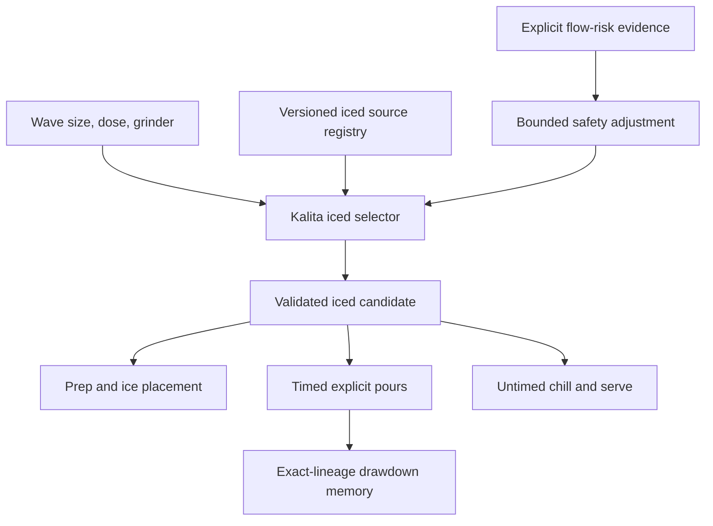
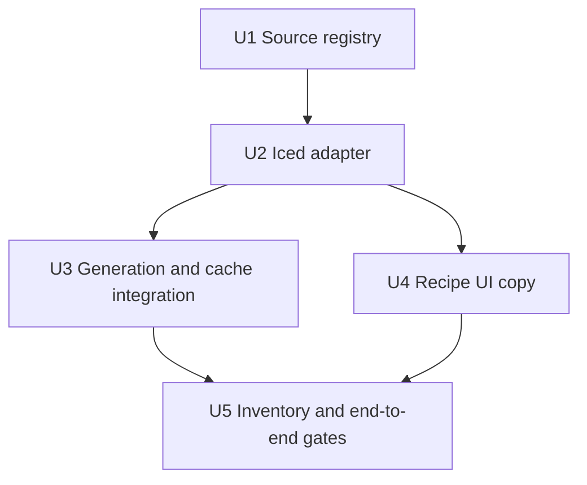

# Add source-backed Kalita iced recipes

## Summary

Replace Kalita's generic hot-to-iced conversion with an independent, source-backed iced engine. Wave size and dose select the professional source family; explicit flow-risk evidence may apply a conservative safety adjustment. Bean-specific language appears only when bean evidence materially changes the output. The UI then renders an explicit brew-and-chill flow with honest water, ice, timing, technique, and provenance.

---

## Problem Frame

Hot Kalita recipes are now selected independently for each bean, but iced Kalita still inherits the hot candidate and applies a fixed 60/40 transform. Professional Kalita iced recipes do not support that universal rule: trusted sources use both direct-over-ice and ice-after-brew workflows, substantially different ice fractions, different agitation, and different size/dose envelopes.

---

## Requirements

- R1. Generate Kalita iced recipes independently from the hot candidate using Wave 155/185, dose, grinder, and normalized evidence. Size and dose own family selection; only explicit flow-risk evidence may apply a conservative bean-specific adjustment in v1.
- R2. Select only from closed, source-backed technique families; Reddit observations may create failure tests but cannot set production numeric parameters.
- R3. Preserve exact verified source recipes at their native configuration and record every bounded adaptation for other supported configurations.
- R4. Keep hot brew water, recipe ice, final beverage-water target, serving ice, ice placement, and chill timing semantically distinct.
- R5. Make every timed step explicit about pour geometry, target weight, and permitted agitation; first water begins at `0:00`, and the guide never auto-finishes the brew.
- R6. Treat Wave 155 and Wave 185 as separate physical configurations and regenerate iced candidates when size, dose, grinder, source context, or rules change.
- R7. Preserve legacy iced records for reading while preventing deterministic hot Kalita candidates from entering the generic transformer.
- R8. Validate the selector across representative and real inventory beans, supported dose boundaries, grinders, sparse/conflicting evidence, and timer/UI contracts.
- R9. Never present a configuration-only or sparse-evidence baseline as bean-specific. The rationale names a conservative source-backed starting point unless bean evidence actually changed a bounded parameter.

---

## Scope Boundaries

- No arbitrary AI-authored iced recipes or free-form technique combinations.
- No claim that a published drawdown is a universal finish time or taste verdict.
- No automatic learning from a single timing event; existing exact-lineage timing memory remains observational.
- No technique-family selection from tasting-note prose, origin, or process labels alone.
- No redesign of the modal navigation or timer hierarchy beyond copy and data required to represent the chosen source family truthfully.
- Physical tasting remains a release gate that requires a human brew; deterministic and browser tests cannot substitute for it.

### Deferred to Follow-Up Work

- Learn selector preferences from tasting outcomes after enough exact-lineage events exist.
- Support material/filter-specific Wave configurations beyond the existing 155/185 choice.

---

## Context & Research

### Relevant Code and Patterns

- `src/lib/v60IcedAdapter.js` and `src/data/v60IcedSourceRegistry.js` establish the independent-mode adapter, provenance, fallback, and physical-math contracts.
- `src/lib/kalitaAdapter.js` provides the existing bean intent, grinder translation, Wave size, and timer conventions.
- `src/hooks/useHandBrew.js` owns candidate matching, source-context invalidation, generation, persistence, size changes, and dose regeneration.
- `src/components/HandBrewModal.jsx` already renders preparation, water/ice semantics, timed steps, post-brew chilling, and timing memory.

### External References

- [Kurasu: Kalita Wave iced coffee](https://kurasu.kyoto/blogs/recipe/new-kalita-wave-iced-coffee-recipe) — any Wave, 16g/150g hot/140g ice after brewing, 90°C, medium-coarse, three slow circular center pours, avoid spirals, 1:37–1:40.
- [Frothy Monkey: iced Kalita Wave](https://frothymonkey.com/blog/iced-kalita-wave-brewing-guide/) — large direct-over-ice profile, 33g/300g hot/200g ice, medium-fine, staged outward spirals, 2:30–3:00.
- [Espresso Parts: Wave 185 iced](https://www.espressoparts.com/blogs/news/kalita-wave-iced-coffee-tutorial) — 20g/160g hot/160g ice, medium grind, bloom plus continuous controlled circles, 1:30–2:00.
- [Little Waves: Wave 185 iced](https://littlewaves.coffee/products/iced-coffee-brew-guide) — direct-over-ice three-stage professional profile and taste-led dial-in guidance.
- [Apollon's Gold: iced pour-over](https://shop.apollons-gold.com/pages/iced-pourover-recipe) — Origami Air S with a Wave 155 filter, not a Kalita dripper. It remains contextual evidence only and cannot supply production numeric parameters until separately validated on a Wave 155.
- [Gota: Iced 155](https://gota.cafe/en/recipes/kalita-wave-155/kalita-155-iced) — aggregator/discovery record only; its attribution does not match the linked Frothy Monkey parameters and cannot count as primary corroboration.
- Reddit gut checks include recent and historical Kalita iced workflows, inconsistent 22–50% ice preferences, and repeated Wave stalling reports tied to fines, many pours, filter/dripper geometry, and agitation.

---

## Key Technical Decisions

| Decision | Rationale |
| --- | --- |
| Independent iced registry and adapter | Hot technique and fixed 60/40 math are not evidence for the iced configuration. |
| Closed families: low-agitation ice-after, high-extraction ice-after, and direct-over-ice | These capture verified professional differences without generating arbitrary hybrids. |
| Size and dose are first-class configuration inputs | The 155/185 beds and supported doses materially change cadence, capacity, and drawdown. |
| Exact source preservation before adaptation | A verified native recipe should remain intact; scaled outputs must disclose changed fields and use bounded rules. |
| Configuration selects the source family | The sources establish viable Kalita iced techniques, not causal bean-to-technique mappings. Wave size and dose are the defensible v1 selectors. |
| Bean evidence is a narrow safety input | Only explicit flow/stall/fines evidence may reduce agitation inside source bounds; tasting notes, origin, and process labels cannot select a family. |
| Existing iced UI pattern is extended, not redesigned | It already separates prep, brew, drawdown, and chill while meeting iOS safe-area and touch-target rules. |

### Supported configurations

| Wave | Dose range | Default | Intended source envelope |
| --- | --- | --- | --- |
| 155 | 12–20g | 15g | Kurasu any-Wave ice-after family, preserving the exact 16g source recipe |
| 185 | 15–36g | 20g | Espresso Parts 185 direct-over-ice through 30g; Frothy Monkey large direct-over-ice above 30g |

Both hot and iced dose controls consume these bounds. Unsupported values surface unavailable instead of silently changing dose. Existing legacy records remain readable at their stored dose.

---

## High-Level Technical Design

> This illustrates the intended approach and is directional guidance for review, not implementation specification.

---

## Implementation Units

- U1. **Create the Kalita iced evidence registry**

**Goal:** Make every production family and parameter auditable to a verified source or bounded rule.

**Requirements:** R2, R3, R8

**Dependencies:** None

**Files:**
- Create: `src/data/kalitaIcedSourceRegistry.js`
- Create: `docs/data/kalita-iced-source-registry.md`
- Create: `docs/data/kalita-iced-reddit-gut-check.md`
- Create: `scripts/kalita-iced-source-registry.test.mjs`

**Approach:**
- Encode canonical source values, equipment/configuration, authorship, evidence tier, ice placement, cadence, agitation, drawdown, and adaptation limits.
- Explicitly downgrade Gota to discovery/aggregator evidence and document the source-attribution mismatch.
- Define narrow rules for dose scaling, Wave-size adaptation, temperature/grind bounds, and fallback provenance.
- Treat Apollon's, Gota, and Reddit records as non-executable context. The validator rejects them as production parameter sources.
- Synchronize the human registry against every executable auditable field: canonical values, configuration, authorship, evidence tier, ice placement, cadence, agitation, guide, and adaptation bounds—not just IDs and URLs.

**Test scenarios:**
- Every executable family has a known primary/professional source and complete physical math.
- Every adaptation rule lists allowed fields, bounds, and supporting sources.
- A Reddit-only or aggregator-only source cannot become executable numeric authority.
- Human-readable registry IDs and URLs stay synchronized with executable data.

**Verification:** Registry validation passes and no production parameter lacks traceable authority.

- U2. **Build the independent Kalita iced selector and adapter**

**Goal:** Generate structurally valid, configuration-specific iced recipes without reading a hot candidate, and apply bean-specific wording only when explicit bean evidence changes a bounded safety parameter.

**Requirements:** R1, R2, R3, R4, R5, R6

**Dependencies:** U1

**Files:**
- Create: `src/lib/kalitaIcedAdapter.js`
- Create: `src/lib/kalitaIcedGeneration.js`
- Create: `scripts/kalita-iced-adapter.test.mjs`
- Create: `scripts/kalita-iced-recipe-contract.test.mjs`
- Create: `scripts/kalita-iced-technique-copy.test.mjs`

**Approach:**
- Normalize Wave size, dose, grinder, and configuration identity against the shared 155 `12–20g` and 185 `15–36g` table; reject unsupported boundaries rather than silently changing them.
- Select the source family from Wave size and dose. Explicit high-confidence fines/stall evidence may only reduce agitation inside the selected source family's bounds; it cannot invent a new family.
- The only bean-personalization allowlist in v1 is an explicit observed stall/slow-flow or high-fines field from stored brew evidence at high confidence. Model-inferred density, roast/process labels, origin, tasting notes, and low-confidence research cannot change family, agitation, temperature, grind, guide, or ice split. Unknown/conflicting evidence remains configuration-only.
- Preserve exact native source configurations, then adapt dose/size through versioned bounded rules with complete changed-field provenance.
- Represent `hotWaterGrams`, `recipeIceGrams`, `finalBeverageWaterTargetGrams`, `servingIceExcluded`, `icePlacement`, and `iceTiming` as distinct fields. Direct-over-ice uses `initialBrewIceGrams`; ice-after uses `postBrewIceGrams`; the inactive field is `null`. Final beverage water and final ratio are numeric only when the source explicitly requires complete melt; otherwise both remain unknown rather than assuming all chill ice melted.
- Validate water plus ice math, source lineage, explicit technique copy, phase separation, timer monotonicity, personalization truth, and conservative fallback.

**Test scenarios:**
- Exact Kurasu 16g output preserves its 150g hot water, 140g post-brew ice, 90°C, three 50g center-circle pours, and guide range.
- Exact Kurasu output does not claim a 290g final beverage-water target or final ratio because the source says stir until cold, not melt all ice.
- A fines-heavy 155 bean chooses low agitation and never instructs a wide spiral or unnecessary swirl.
- A 185 bean chooses a direct-over-ice family from its size/dose envelope, with server ice in preparation and correct post-brew instruction.
- 15g, 20g, and 30g candidates differ where size/dose evidence requires it; all final ratios and water totals remain valid.
- Unsupported configuration rejects and surfaces unavailable. For a supported configuration only, invalid source math, non-monotonic time/water, or missing provenance fails closed to the conservative independent fallback.

**Verification:** Adapter and contract suites prove that hot candidate fields are neither accepted nor required.

- U3. **Wire generation, persistence, and invalidation**

**Goal:** Make Kalita iced generation automatic and keep caches correct across bean, source, size, dose, grinder, and version changes.

**Requirements:** R1, R6, R7, R8

**Dependencies:** U2

**Files:**
- Modify: `src/hooks/useHandBrew.js`
- Modify: `src/lib/flashBrewTransform.js`
- Modify: `scripts/kalita-runtime-contract.test.mjs`
- Create: `scripts/handbrew-kalita-iced-integration.test.mjs`
- Create: `scripts/handbrew-kalita-iced-cutover-contract.test.mjs`

**Approach:**
- Generate hot and iced Kalita candidates independently from the same normalized intent during open/regenerate.
- Generalize iced candidate matching and retry for V60 and Kalita without weakening method-specific version/configuration validation.
- Regenerate both modes for Kalita size and dose changes; persist to the existing per-device iced recipe map.
- Reject deterministic hot Kalita recipes at the generic flash transformer boundary while retaining legacy compatibility.
- Guard deterministic hot Kalita recipes in the modal before calling the generic transformer. When independent candidate and fallback are absent, render the existing iced-unavailable/retry state without throwing or changing hot state.
- Keep hot and iced loading/error snapshots separate. Every asynchronous request and stale-response check includes bean, device, mode, size, dose, and grinder identity.
- Serialize recipe persistence per bean. Re-check latest-request ownership before each queued write; if an older write is already in flight, the newest matching write must run after it. Deferred-promise tests resolve old size/dose/grinder writes after newer requests and prove only the latest pair remains persisted.

**Test scenarios:**
- A cached Kalita iced recipe is reused only when bean source hash, Wave size, dose, grinder, engine, rules, registry, and phase versions match.
- Switching 155 to 185 replaces both hot and iced configurations and default dose.
- Changing Kalita dose regenerates rather than visually scaling a stale iced schedule.
- A stale or invalid iced candidate exposes retry while hot remains usable.
- A missing independent Kalita iced candidate never invokes or throws from the generic transformer during render.
- Legacy non-candidate Kalita records remain viewable; deterministic hot Kalita transformation throws.

**Verification:** Integration tests prove independent generation and zero generic-transform fallback for deterministic Kalita.

- U4. **Make iced Kalita instructions truthful and effortless on iPhone**

**Goal:** Reuse the current modal hierarchy while making source family, ice placement, technique, and drawdown/chilling boundaries obvious.

**Requirements:** R4, R5, R8

**Dependencies:** U2

**Files:**
- Modify: `src/components/HandBrewModal.jsx`
- Modify: `src/components/BrewTimer.jsx` only if the smallest-viewport copy proof exposes clipping
- Modify: `scripts/handbrew-iced-prep-contract.test.mjs`
- Modify: `scripts/handbrew-v60-cutover-contract.test.mjs`

**Approach:**
- Support both `server before brew` and `glass/carafe after Finish Brew` ice placement without implying all recipe ice melts during extraction.
- Keep one primary start action, 44pt minimum controls, existing safe-area behavior, and no added settings screen.
- Use concise technique copy in each timed step and source-family rationale in the iced recipe view; do not display confidence labels.
- Use recipe-provided `icedModeLabel` and `icedEntryLabel` copy so ice-after recipes are never mislabeled as flash brew. Use `Iced Pour Over` as the neutral fallback label.
- If no bean signal changed the output, say `Source-backed starting point for this Wave size and dose.` If a verified flow-risk guard changed it, name only that bounded adjustment.
- Keep `Wave 155` or `Wave 185` visible in the iced header through timer start. Size changes remain on the hot view via Back, avoiding a second switch.
- On any dose or size change, immediately clear the stale iced schedule, show `Updating iced recipe…`, disable its start action, and accept only the latest matching request. Failure shows Retry while retaining the new requested size/dose and the valid hot state; repeated taps coalesce into the final request.

**Test scenarios:**
- Direct-over-ice recipes put ice in preparation; ice-after recipes do not.
- Ice-after recipes tell the user exactly when and where to add ice after drawdown.
- Direct-over-ice and ice-after fixtures render distinct, truthful headings and entry labels.
- The UI contract rejects `bean-specific` copy when personalization did not affect the candidate.
- The smallest supported iPhone viewport and 200% text scaling show the complete active-step geometry, target, and agitation instruction without clipping; current-step changes are announced through an accessible live region.
- Every timer step names center/circle/spiral geometry and agitation permission without overflowing the existing mobile hierarchy.
- V60 iced rendering and behavior remain unchanged.

**Verification:** A phone-sized end-to-end flow reaches prep, bloom, every pour, overtime/manual finish, chill, completion, and timing save with correct copy.

- U5. **Run inventory, counterexample, and release gates**

**Goal:** Demonstrate useful variation on real beans and prevent structurally valid but professionally implausible recipes from shipping.

**Requirements:** R8

**Dependencies:** U3, U4

**Files:**
- Create: `src/lib/kalitaIcedInventoryEvaluation.js`
- Create: `scripts/kalita-iced-evaluate-inventory.mjs`
- Create: `scripts/kalita-iced-evaluate-inventory.test.mjs`
- Create: `docs/data/kalita-iced-calibration-results.md`
- Modify: `package.json`

**Approach:**
- Add a fail-closed, read-only, redacted inventory evaluator following the V60 Firestore access pattern, while also rejecting an empty inventory or incomplete coverage as a failed gate.
- Cover washed/floral, natural/processed, developed, sparse, high-fines, and conflicting evidence with 155/185 and dose boundaries.
- Record deterministic output separately from physical tasting; do not claim sensory readiness without completed cups.

**Test scenarios:**
- Redacted evaluation output cannot expose bean IDs, names, roasters, or credentials.
- Representative beans produce valid recipes and meaningful family/parameter variation when evidence differs.
- Sparse evidence yields the conservative independent baseline and configuration-only copy rather than unsupported personalization claims.
- Full recipe, timer-memory, lint, build, and end-to-end UI gates pass without changing hot Kalita or V60 behavior.

**Verification:** Automated gates pass, the live inventory evaluation reads at least one real bean and is read-only/redacted, and physical-brew status is reported honestly. Missing credentials or zero matching beans keep the live gate open.

### Physical and delivery gate

- Implementation may merge only after deterministic, UI, lint, and build gates pass.
- Dev proof sequence is: verify the exact Capgo dev-channel pointer, ask for one controlled foreground launch, then verify the app-visible OTA build string and updater adoption event before claiming delivery or starting the physical brew.
- Production delivery requires at least one Wave 155 ice-after cup and one Wave 185 direct-over-ice cup, with no overflow/stall, truthful phase copy, manual Finish Brew behavior, and an explicit user acceptance note recorded in `docs/data/kalita-iced-calibration-results.md`.
- Physical tasting and production OTA are separate follow-up gates; automated success is not sensory or live-device proof.

---

## System-Wide Impact

- **Interaction graph:** Bean research feeds shared extraction intent; hot and iced adapters then branch independently before modal rendering, timing memory, and Firestore persistence.
- **Error propagation:** Iced candidate failure must leave the hot recipe usable and expose retry; independent fallback failure surfaces as unavailable rather than invoking the generic transformer.
- **State lifecycle risks:** Size/dose changes can race generation and persistence; existing request tokens and configuration fingerprints must reject stale results.
- **API surface parity:** Inventory, Rotation, and Chat tabs all consume the same hook and modal props, so the shared hook is the only generation cutover point.
- **Integration coverage:** Real-component modal flow and read-only inventory evaluation complement pure adapter tests.
- **Unchanged invariants:** Hot Kalita, V60 hot/iced, timing-event semantics, and the existing size switch remain intact.

---

## Risks & Dependencies

| Risk | Mitigation |
| --- | --- |
| Sparse exact Kalita iced evidence at every dose/size | Preserve exact recipes, use narrow adaptation rules, and label all changed fields. |
| Over-personalization from weak bean metadata | Use conservative defaults and reason codes; do not convert tasting notes into unsupported physics. |
| Wave stalling from fines, filters, or brewer material | Let fines risk select lower agitation; treat guide time as observational and surface taste-led dial-in. |
| Ice placement changes the workflow | Model direct-over-ice and ice-after as explicit families with different prep/post-brew steps. |
| Existing cache returns generic transformed output | Version and validate independent candidates; reject deterministic hot Kalita at the transformer boundary. |

---

## Documentation / Operational Notes

- The dated source registry is the audit trail; the executable registry is production truth.
- Dev delivery must be verified by both Capgo pointer and the visible OTA build string before asking for phone testing.
- Production delivery and merge are separate follow-up actions after automated and physical gates; implementation alone is not live proof.
