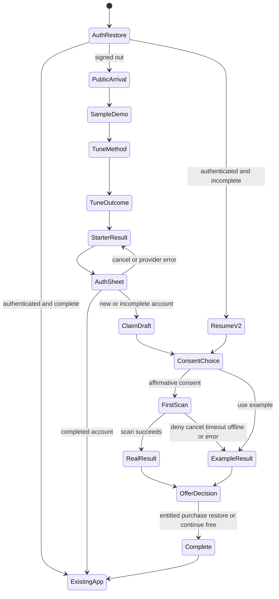
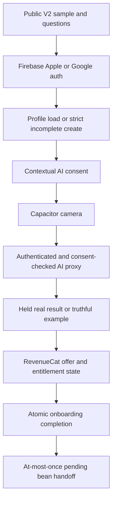
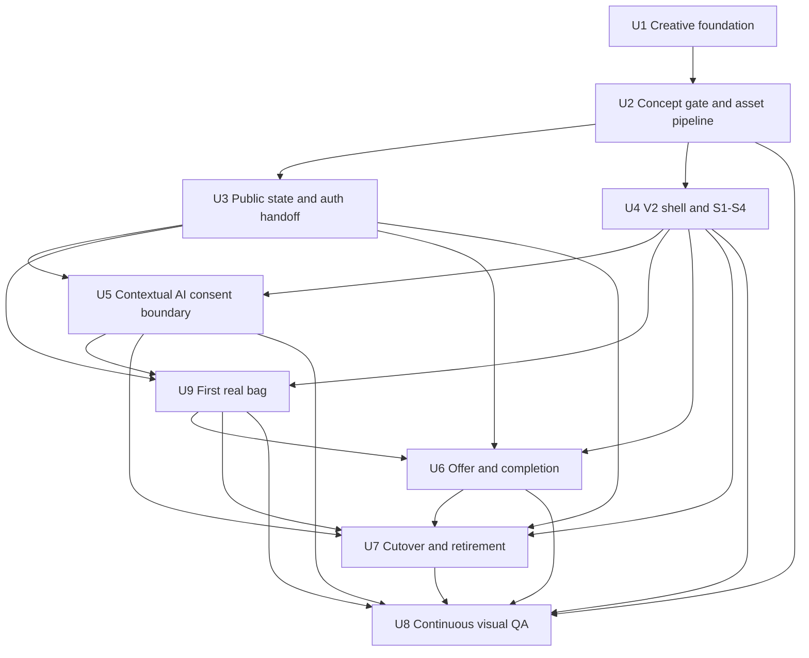
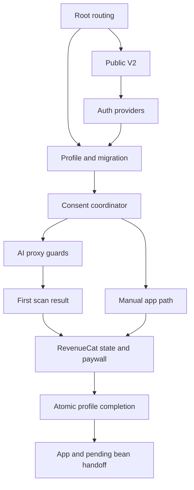

# Premium Cinematic Onboarding V2

## Summary

Build a parallel onboarding V2 that proves its art direction on three representative, device-rendered concepts before expanding into the complete flow. The implementation replaces the auth-first, 14-screen presentation and legacy mascot library while extending Coffee's existing profile, scan, consent, entitlement, completion, and verification patterns instead of rebuilding those systems.

---

## Problem Frame

The current onboarding is functionally mature but visually repetitive and structurally too long. Its most visible defect is fundamental rather than cosmetic: the mascot videos are RGB media with near-white backgrounds, so they cannot sit cleanly on Coffee's cream canvas and have already forced unreliable masks and conspicuous white portrait cards. A premium result requires a new narrative and a production-grade asset family, not another styling pass over the same screen spine.

---

## Requirements

### Narrative and activation

- R1. Deliver value before authentication: demonstrate the product, collect only essential context, show a result, then request sign-in and offer a subscription.
- R2. Open with a concise sensory coffee moment rather than a questionnaire, feature list, fake loader, or mascot monologue.
- R3. Ask only two pre-auth setup questions: primary brewing method and the outcome the user most wants to improve.
- R4. Use a truthful, believable pre-auth demonstration of bag information becoming a polished Coffee artifact and useful guidance; do not imply that an AI scan occurred when it did not.
- R5. Derive the starter result visibly from the two answers without inventing a taste profile, personality label, precision, or unsupported praise.
- R6. Frame authentication as saving value already created. Request AI consent and camera permission only when they become relevant, and preserve a pressure-free sample/manual continuation.
- R7. Show the subscription offer only after useful value; preserve live RevenueCat pricing, restore/legal behavior, entitled-user bypass, cancellation, and recoverable completion.

### Professor Ruphus and visual direction

- R8. Create one approved editorial 3D Professor Ruphus art bible covering identity, materials, wardrobe, lighting, camera, expressions, scale, environments, and props.
- R9. Use Professor Ruphus approximately three times: introduction, real-scan guidance, and completion celebration. He must not become a portrait-card template.
- R10. Reject any visible white box, matte mismatch, halo, cutout edge, unintended background, or runtime masking dependency.
- R11. Use Kitchen Stories as the visual grammar: sensory imagery, editorial type, negative space, authentic materials, restrained controls, and one focal idea per scene, expressed through Coffee's existing cream, espresso, caramel, and serif-led identity.
- R12. Require physical credibility in beans, bags, equipment, labels, paws/hands, glassware, brewing actions, and lighting. Meaningless generated text, invented marks, broken anatomy, or impossible equipment is a failed asset.
- R13. Treat generated media as source material that needs selection, retouching, compositing, color, cropping, compression, and device review before approval.

### Motion, interaction, and native quality

- R14. Concentrate motion in the sample bag-to-artifact transformation and result/completion reveal. Avoid perpetual decorative motion, generic gradient fog, particles, and animation on every element.
- R15. Respect safe areas, Dynamic Island/notch clearance, the home indicator, 44-point targets, 16-pixel inputs, back behavior, reduced motion, readable scaling, and smooth WKWebView performance from iOS 15 onward.

### Design production and validation

- R16. Block full-flow implementation until the art bible and three representative concepts pass the creative concept gate on a physical iPhone.
- R17. Specify hierarchy, composition, typography, copy density, imagery, mascot role, interaction, motion, loading, fallback, and evidence for every principal beat.
- R18. Preserve account-safe resume, atomic completion, truthful scan fallback, permission escape paths, entitlement correctness, error recovery, and duplicate-side-effect prevention.
- R19. Require repeated reference comparison, AI-slop critique, simulator coverage, and physical-device inspection throughout production.
- R20. Require one continuous real-device recording of the principal journey plus functional evidence for important fallback states before acceptance.

**Origin actors:** A1 (new coffee user), A2 (returning or entitled user), A3 (product and creative team)

**Origin flows:** F1 (premium first-run journey), F2 (permission or scan escape path), F3 (returning or entitled-user path), F4 (creative approval path)

**Origin acceptance examples:** AE1 (value before auth), AE2 (truthful personalization), AE3 (camera/scan escape), AE4 (entitled-user bypass), AE5 (asset rejection), AE6 (reduced motion), AE7 (concept gate), AE8 (physical-device veto)

---

## Scope Boundaries

### Deferred for later

- Broader redesign of the signed-in Coffee application beyond any narrowly necessary transition into the existing home experience.
- Ongoing multivariate experimentation or conversion optimization after the initial premium flow ships and establishes a trustworthy analytics baseline.
- Additional seasonal Ruphus wardrobes, environments, or extended narrative content beyond the approved onboarding asset family.
- Real-time 3D character rendering if high-quality pre-rendered or illustrated motion can deliver the approved experience with less complexity.

### Outside this product's identity

- A long health-app-style questionnaire designed primarily to manufacture commitment.
- Childlike storybook presentation, repeated speech bubbles, or Professor Ruphus as a talking head on every screen.
- Generic AI-product motifs such as purple gradient fog, excessive glass cards, glowing orbs, floating dashboards, or decorative particle fields unrelated to coffee.
- Fake testimonials, fabricated social proof, deceptive progress, intentionally false processing delays, or unsupported claims of personalization.
- Hiding flawed assets with frames, masks, blur, or shadows and calling the workaround an intentional design system.

### Deferred to Follow-Up Work

- Funnel experimentation and optimization: begin only after V2 establishes stable first-run and completion analytics.
- Broader contextual AI-consent polish outside the identified AI entry surfaces: track separately if implementation discovers additional background-only AI call sites.
- Removal of unrelated legacy demo assets: this plan removes only files proven exclusive to the retired onboarding presentation.
- Production rollout: this plan prepares and proves a dev build; a production OTA/TestFlight decision remains a separate explicit shipping action.

---

## Context & Research

### Relevant Code and Patterns

- `src/main.jsx` owns the current auth-first gate order, profile-load distinction, existing-user migration, provider stack, onboarding mount, AI-consent wall, and final app entry. V2 must change the order without collapsing “profile missing” and “profile failed to load.”
- `src/components/onboarding/OnboardingFlow.jsx` contains the proven pure reducer, single persistence seam, atomic terminal branch, timeout handling, and dev replay behavior to adapt.
- `src/components/onboarding/onboardingState.js` establishes UID-scoped storage, corrupt-state recovery, quota failure tolerance, and device-local replay. V2 adds a bounded anonymous draft and explicit auth handoff rather than weakening account scoping.
- `src/hooks/useAuth.js` already implements native/web Apple and Google sign-in, provider-name recovery, cancellation/error behavior, and Firebase credential establishment.
- `src/hooks/useUserProfile.jsx` provides the strict create-profile shape and atomic `completeOnboarding` path. A new user needs an incomplete profile document before a metered scan can be consented and recorded safely.
- `src/lib/gemini.js`, `src/lib/fetchWithRetry.js`, `api/gemini.js`, and `api/_lib/cors-auth.js` prove that production AI calls require Firebase auth and that free scans are metered against `users/{uid}`. A real pre-auth scan would violate the established security and cost boundary.
- `src/components/ScanSheet.jsx` and `src/components/onboarding/screens/R10Demo.jsx` contain the native camera, image compression, scan timeout, typed paywall error, and truthful fallback patterns to reuse.
- `src/components/PaywallSheet.jsx`, `src/hooks/usePaywall.jsx`, `src/contexts/SubscriptionContext.jsx`, and `src/components/onboarding/useOnboardingPaywall.js` provide the single purchase surface, dual-source entitlement state, immediate post-purchase unlock, and purchase-versus-dismiss disambiguation.
- `src/App.jsx` consumes `pendingScanBean` and `postCompleteAction` at most once after onboarding completion. V2 should preserve this handoff and its cross-device duplicate belt.
- `src/styles/theme.js`, `src/lib/motion.js`, `src/lib/haptics.js`, and `src/styles/global.css` are the visual and interaction foundation. V2 may add onboarding-specific tokens but must not fork the app into a second brand system.
- `src/components/BeanDetailCard.jsx`, `src/components/BeanCard.jsx`, and `src/hooks/useDemoAppData.js` provide real product artifacts and truthful seeded bean data that can inform the pre-auth sample.
- `onboarding-harness.jsx`, `scripts/verify-onboarding.mjs`, and `scripts/verify-onboarding-evidence.mjs` establish the WebKit harness, injectable seams, scenario matrix, and simulator evidence gates to replace rather than discard.
- `vite.config.js`, `src/lib/assetUrl.js`, and `scripts/build-ota-slim.mjs` control lazy chunking, CDN media, PWA caching, and OTA size; V2 media must be designed with those delivery paths in mind.

### Institutional Learnings

- `docs/solutions/runtime-errors/react-lazy-inside-render-destroys-state.md`: keep lazy component references at module scope so provider updates do not reset onboarding.
- `docs/solutions/logic-errors/native-profile-load-failure-indistinguishable-from-missing.md`: never route a failed profile read into the new-user create path.
- `docs/solutions/integration-issues/capgo-ota-overrides-local-builds-and-native-deploy-path.md`: device review must distinguish the locally copied bundle from a Capgo-delivered bundle; native configuration changes require TestFlight rather than OTA.
- `docs/internal/liquid-glass-button-spec.md`: use prefixed backdrop filters, never animate blur, avoid SVG displacement and blend-mode effects in WKWebView, and reserve glass for functional chrome instead of multiplying translucent cards.
- `docs/loops/onboarding-100x/REPORT.md`: the prior rebuild proved functional reliability but still awaited the human device gate; automated completion and screenshot evidence are necessary but do not establish taste.
- `docs/loops/onboarding-100x/CREATIVE_SPEC.md`: the prior plan locked the same repeated top-bar/mascot/content/CTA structure and prohibited new media. V2 intentionally reverses that premise and proves the art system before multiplying it.
- Existing mascot media is approximately 67 MB, uses H.264 `yuv420p` without alpha, and is mostly 720×1280. The visible near-white background is part of the pixels, not a transparency bug that CSS can repair.

### External References

- Kitchen Stories onboarding: https://mobbin.com/flows/256edd82-2dc8-485e-adfa-68e3c826b96d
- Cal AI value-first onboarding: https://mobbin.com/flows/579da5dd-453a-4e7c-9c11-d20708a4db82
- Cal AI concise demo/auth flow: https://mobbin.com/flows/503e0e0a-f7c4-4740-bfd4-883bad79a2fc
- Headspace mascot integration: https://mobbin.com/flows/31b21791-dec6-448a-8253-648f5ebbba3e
- Aidan Mao onboarding thread supplied by the user: https://x.com/aidanmaoz/status/2066645845026787747
- Apple HIG, Onboarding: https://developer.apple.com/design/human-interface-guidelines/onboarding
- Apple App Review Guidelines, including 5.1.2(i) third-party AI consent: https://developer.apple.com/app-store/review/guidelines/
- Apple HEVC video with alpha: https://developer.apple.com/documentation/avfoundation/using-hevc-video-with-alpha
- Apple HEVC-with-alpha interoperability profile: https://developer.apple.com/av-foundation/HEVC-Video-with-Alpha-Interoperability-Profile.pdf

---

## Creative North Star

The target is an editorial specialty-coffee film that becomes a real product experience, with Professor Ruphus living inside the same world. Kitchen Stories supplies the confidence and sensory restraint; Coffee supplies the warm paper, espresso ink, authentic bag imagery, and product artifacts. The experience should feel authored by a small team with very specific taste, not assembled from a mobile onboarding template.

`2manybeans` is the user-facing brand and wordmark. “Coffee” is shorthand for the product/codebase in this plan, not alternate UI branding; visible concepts and copy use 2manybeans consistently.

### Non-negotiable visual laws

- One dominant visual idea per beat. No screen may combine a mascot portrait, speech bubble, feature grid, multiple card stacks, and decorative background simultaneously.
- Coffee and the user's eventual product artifact are the hero. Professor Ruphus supplies character at three narrative turns; he is never a persistent presenter.
- Use real or rights-cleared photography for bags, beans, equipment, and any human brewing action. AI may build the Ruphus character and environmental extensions, but it does not get trusted with label text, logos, hands, glassware geometry, or mechanical brewing details without manual reconstruction.
- No text is baked into generated imagery. All language remains native HTML so it is sharp, accessible, localizable, and immune to generated gibberish.
- Generated character scenes are either complete, edge-to-edge compositions or properly retouched RGBA stills. A white seamless background is never an accepted source for a cream composition.
- Surfaces use the existing paper/cream/espresso palette. Caramel marks the primary action or one selected state; it is not ambient decoration.
- Negative space is deliberate. Every scene must retain safe crop zones for 375×667 through 430×932 portrait viewports without shrinking the focal subject into irrelevance.

### Typography

- Fraunces remains the display voice, generally 34–42 CSS pixels depending on viewport, 600 weight, tight negative tracking, and no more than two lines for the principal headline.
- Nunito remains the interaction and reading face, normally 16–18 pixels for body and 15–17 pixels for controls. DM Sans is reserved for dense product metadata and numeric labels where the app already uses it.
- Use at most three text levels in a single scene: display, body, and metadata/control. Do not stack eyebrow, title, subtitle, note bubble, feature labels, and helper copy.
- Keep body copy to roughly 18–28 words per principal beat. Authentication, privacy, and subscription disclosures may be longer but must use progressive disclosure and scannable grouping.
- Do not use Caveat, faux handwriting, gratuitous all-caps, center alignment for long paragraphs, isolated single-word wraps, or colored headline fragments as decoration.

### Composition and materials

- Media-led beats may run under the status bar and occupy 55–70% of the viewport, fading or cutting cleanly into a warm paper content zone. Content-led beats keep 24-pixel side margins and a maximum readable width near 390 pixels.
- Cards are reserved for actual product artifacts, auth/consent sheets, and the RevenueCat offer. Decorative information should use open layout, hairlines, or aligned rows.
- Use walnut, matte ceramic, brushed steel, linen paper, glass, roasted coffee, and warm daylight as the material family. Avoid glossy toy plastic, chrome sci-fi surfaces, floating glass panes, and neon.
- Controls use one strong primary action and at most one quiet secondary action. The back affordance, “Already have an account?”, “Use the example”, and paywall close remain immediately reachable with 44-point hit areas.
- The opening can use a clear glass control over imagery, but the remaining flow defaults to solid or near-solid Coffee controls. Glass is chrome, not page structure.

### Professor Ruphus art bible

- **Identity:** preserve the recognizable copper-and-white Jack Russell, white forehead blaze, white muzzle/chest, floppy ears, round matte-black glasses, and professor's coat. The character must remain identifiable in silhouette and at thumbnail scale.
- **3D treatment:** tactile editorial stop-motion quality rather than Pixar imitation, plush-toy fuzz, hyperreal animal compositing, or glossy game-character rendering. Fur is short and groomed; the warm-ivory coat is textured twill, not bright white plastic.
- **Proportions:** lock one approved model sheet with front, three-quarter, and side views before scene generation. Eye size, muzzle length, blaze width, ear shape, glasses diameter, coat lapels, and body scale cannot drift between scenes.
- **Anatomy:** paws remain paws; do not add human fingers. Avoid complex held objects unless the final composite reconstructs the contact and prop geometry manually.
- **Lighting:** soft north-window key, warm walnut bounce, restrained rim separation, physically coherent shadows, and no unexplained glow. Match the exact final scene grade before animation.
- **Camera:** eye-level or slightly low, roughly 50 mm-equivalent perspective for character moments. Avoid fisheye distortion, heroic low angles, or shallow focus that turns the set into synthetic blur.
- **Expressions:** quiet welcome, focused attention, and restrained delight. Avoid open-mouth mascot shouting, exaggerated eyebrows, meme reactions, and a different facial structure for each emotion.
- **Environment:** Professor Ruphus occupies a coherent coffee study/lab with walnut, paper, ceramic, and real reference equipment. The set may change crop or action, but architecture, lighting direction, and material palette stay consistent.
- **Appearances:** introduction in S1, scan guidance in S5, neutral celebration in S6. If a fourth appearance is proposed, it must replace—not supplement—one of these beats or pass an explicit creative review.

### Asset production pipeline

1. Build a reference board for lighting, character materials, coffee cinematography, product composition, and motion. References guide principles; no proprietary Mobbin screen is copied pixel for pixel.
2. Generate multiple model-sheet candidates, select one, and manually normalize anatomy, glasses, coat, fur markings, and color. The approved turnaround becomes the only generation reference.
3. Create locked keyframes for all three Ruphus appearances before animating any of them. Review the family side by side to catch identity drift.
4. Composite authentic bag/equipment photography and rebuild malformed physical details manually. Remove generated text and logos rather than attempting to disguise them.
5. Color-grade keyframes as a family, then animate approved frames through Higgsfield or another image-to-video tool. Prefer restrained character motion and a mostly locked camera.
6. Retouch motion frame by frame at entrances, hand/paw contacts, glasses edges, coat edges, and loop/end transitions. Any morphing identity or prop defect rejects the take.
7. Export silent, broadly compatible full-scene H.264 MP4 as the default motion format, with local still key art for immediate and reduced-motion rendering. HEVC alpha is an optional spike only; it never ships without a full-scene fallback proven in the target WKWebView.
8. Record prompt lineage, source rights, model/tool, human edits, final owner, target screen, dimensions, duration, codec, size, checksum, and approval state in the asset manifest.

No generated or photographed bag/brand asset enters the concept gate until A3 records its usage basis in the manifest. If provenance for an existing bag cannot be confirmed, replace it with another rights-cleared real asset rather than inventing a label or assuming internal possession grants marketing rights.

### Media and runtime budgets

- Local key art required to render every scene offline: no more than 2 MB total, with the opening poster no more than 350 KB.
- Remote motion package for the complete V2 flow: no more than 10 MB total; individual motion assets no more than 4 MB.
- Motion: silent, 24 fps preferred, no dimension larger than needed for the rendered slot, and no upscaling beyond 1.2× on the largest supported viewport.
- At most one video decodes or plays at once. Offscreen media pauses and releases; the next asset may preload only after the current scene is interactive.
- V2 JavaScript remains within the current onboarding chunk target of 120 KB gzip unless a measured exception is approved.
- First meaningful paint never waits for remote video. A locally bundled poster appears immediately and motion crossfades only after it can play without a blank frame.
- Network failure, offline launch, Low Power Mode, and Reduce Motion all produce a complete still-led experience rather than a degraded placeholder.

---

## Screen-by-Screen Experience Specification

The principal journey contains six beats. The two setup questions are states within one composition; authentication is a sheet over the already-visible starter result. This keeps the perceived journey light while preserving all required decisions and disclosures.

| Beat | Value delivered | Required interaction | Professor Ruphus | Monetization/auth |
|---|---|---|---|---|
| S1 Arrival | Product identity and promise | Start or returning-user shortcut | Integrated introduction | None |
| S2 Sample transformation | Bag-to-artifact proof | Trigger/advance the sample | None | None |
| S3 Tune the setup | Method and desired outcome | Two explicit selections | None | None |
| S4 Starter result | Personalized product artifact | Save/continue | None | Sign-in sheet |
| S5 First bag | Real scan or truthful example | Consent, camera, retry/skip | Contextual guide | None |
| S6 Keep the setup | Result recap and entry | Offer, dismiss, restore/purchase | Neutral celebration | RevenueCat after value |

### S0. Native launch handoff

- **Purpose:** remove the visible discontinuity between the Capacitor splash, local key art, and S1 without inventing a loading performance.
- **Composition:** splash/background and the first poster share one approved edge color and luminance. The wordmark may appear once, never in both splash and S1 as a repeated logo animation.
- **Behavior:** no artificial timer. Render S1's poster as soon as React mounts; remote motion may join afterward. Auth restoration retains the existing longer native timeout only for devices with a remembered UID.
- **Status bar:** opening media uses light status-bar content only if the approved crop provides verified contrast; transition to dark content before cream-led scenes.
- **Fallback:** profile/auth/network work cannot strand the app on a fake cinematic loader. Existing authenticated users continue through the established loading and profile-error gates.
- **Evidence:** cold-launch screen recording from a terminated app, with and without network, proving no cream flash, black frame, old sign-in flash, or stale Capgo bundle.

### S1. Arrival — “Every bag has a better cup in it”

- **Hierarchy:** small 2manybeans wordmark; one two-line Fraunces promise; one short explanatory line; primary “Show me”; quiet “Already have an account?” in the top safe area.
- **Composition:** full-bleed sensory coffee image or film occupies roughly the upper two-thirds and extends beneath the status bar. The type and CTA sit in a clean lower paper zone or on a carefully contrast-graded portion of the scene, selected during the concept gate.
- **Imagery:** authentic macro coffee footage or photography, with Professor Ruphus integrated naturally into the environment as the introduction—not pasted over the image and not framed in a card. No speech bubble or feature list.
- **Motion:** one restrained 2–4 second character/camera action that settles rather than looping conspicuously. Copy enters after the focal image is stable, using a 240–320 ms opacity/translate transition.
- **Interaction:** “Show me” advances to S2. “Already have an account?” opens the same auth sheet used in S4 but returns completed users directly to the app.
- **Reduced motion:** render the final approved keyframe with identical hierarchy; no autoplay and no delayed meaning.
- **Evidence:** concept-gate frame on compact, standard, and large simulator sizes plus physical-device inspection for crop, contrast, character identity, and status-bar safety.

### S2. Sample transformation — “See what 2manybeans reads”

- **Hierarchy:** a short setup line, the authentic sample bag, and the resulting Coffee artifact. Avoid explanatory paragraphs; the transformation demonstrates the product.
- **Sample truth:** use one rights-cleared bag image already owned or licensed for the app, with real metadata from `src/lib/seedData.js`. Label the experience “Example bag” before interaction and never show a camera shutter, AI provider mark, or language implying a live scan.
- **Composition:** begin with the bag as the single focal object. On activation, transform its position and scale while real HTML product fields resolve into a Coffee bean artifact: roaster, bean, origin/process, notes, and peak guidance. Reuse product visual language without mounting the full signed-in app.
- **Signature motion:** 900–1200 ms total. Use transform/opacity and shared geometry; do not animate layout dimensions, blur, or backdrop filters. The bag remains visually traceable into the artifact, and the final result is usable—not a disappearing marketing animation.
- **Interaction:** the deterministic transformation begins once on scene entry after the poster is stable; it is a product demonstration, not a fake network operation. One “Make it mine” action appears with the completed artifact and advances. Replay may be a quiet secondary control, not a second mandatory gate.
- **Loading:** none. All sample data is local and deterministic. Do not insert processing percentages or staged fake captions.
- **Fallback:** if animation or media cannot play, the bag crossfades to the completed artifact in 200–280 ms and all information remains available.
- **Evidence:** concept-gate start/mid/end frames, reduced-motion capture, 60-second device interaction to check for jank, and proof that no AI network call occurs while signed out.

### S3. Tune the setup — two questions, one chapter

- **Hierarchy:** small “1 of 2” or “2 of 2” indicator, one question, up to six choices, and explicit Continue. No mascot, testimonial, note bubble, or promotional copy.
- **Question 1:** “How do you brew most often?” with Pour over, Espresso, AeroPress, French press, Fellow Aiden, and A bit of everything. Final wording and iconography lock in the concept gate.
- **Question 2:** “What would make tomorrow's cup better?” with outcomes mapped to real Coffee behavior: consistency, flavor, freshness/peak timing, tasting confidence, and getting more from every bag.
- **Composition:** keep one consistent editorial grid. A restrained real equipment crop or diagram can anchor the upper area, while choices sit in open rows or one grouped paper surface. Do not build a grid of glossy feature cards.
- **Selection:** espresso outline and subtle paper elevation, with caramel used once for the selected indicator. Selection haptic only; no auto-advance. Continue remains disabled until one choice is explicit.
- **Motion:** state change at 160–220 ms; question transition at 240–320 ms. Preserve back navigation and retain the previous answer.
- **Accessibility:** 44-point rows, visible focus, selected semantics, readable labels without icon dependence, and layout survival at large text sizes.
- **Evidence:** every answer at least once in harness fixtures; compact-height, long-label, large-text, back-navigation, refresh/resume, and reduced-motion captures.

### S4. Personalized starter result and save sheet

- **Hierarchy:** “Your starter setup” label, method-specific title, one actual Coffee artifact, one outcome-specific explanation, and “Save my setup.” The result must remain visible when authentication appears.
- **Personalization:** method controls the brewing context; outcome controls the benefit and guidance. Example: Pour over + consistency yields a repeatable pour-over starter, while Aiden + freshness foregrounds peak timing. Do not infer acidity preference, tasting archetype, skill level, or personal identity.
- **Product artifact:** render a credible sample recipe/peak/shelf card using local, pre-auth-safe data and existing Coffee component language. If an exact recipe is precomputed, label it as guidance for the example bag rather than a live personalized AI recipe.
- **Composition:** this is the third concept-gate screen. Give the product artifact visual authority; authentication enters as a bottom sheet with a calm scrim, leaving enough of the result visible to preserve causality.
- **Auth sheet:** “Save this setup and scan your own bag”; Sign in with Apple first and black, Google second, legal links, busy state, and inline provider-specific error. Avoid a separate blank sign-in page.
- **Returning accounts:** a completed account discards the anonymous draft and enters the app. An incomplete account resumes its UID-scoped V2 state. A new account claims the draft without leaking it to another account on the same device.
- **Cancellation/error:** dismissing native auth or closing the sheet returns to the intact result. Network/provider failure leaves both choices retryable; it does not clear the public draft.
- **Post-auth back behavior:** after a new or incomplete account claims the draft, back from S5 returns to this result in a visibly saved/authenticated state. It must not reopen authentication, restore anonymous ownership, or sign the user out.
- **Evidence:** concept-gate result and auth-sheet frames, Apple/Google success/cancel/error harness paths, account-switch isolation, existing-completed-account bypass, and reload while the sheet is open.

### S5. First bag — consent, camera, real result, or example

- **Hierarchy:** “Read your first bag” with one sentence of context, real-scan primary action, and immediately visible “Use the example” secondary action. Professor Ruphus appears in the approved guidance scene, integrated into the coffee study rather than as a video card.
- **Profile boundary:** after successful auth, create the strict incomplete profile for a genuinely new user before recording consent or invoking metered AI. Never run this path after a profile-load error or overwrite an existing profile.
- **Consent:** if `aiDataConsent` is not true, open a contextual sheet before the camera. Name the third-party providers and uses plainly, link the privacy policy, and offer “Continue with AI” plus “Use the example instead.” Consent is affirmative; skipping records the disabled choice and proceeds without blocking the app.
- **Server defense:** Gemini, Claude, and OpenAI proxy calls must verify stored AI consent before sending user data to third parties. Client gating improves UX; the server check is the invariant that prevents missed call sites from transmitting after opt-out.
- **Camera:** request permission only after AI consent and a direct scan action. Reuse the native CameraSource prompt, compression bounds, cancellation detection, and 12-second scan timeout. Camera cancellation leaves the screen unchanged; denial, unavailable plugin, offline state, exhausted credit, timeout, or unreadable photo offers retry and a truthful example.
- **Real loading:** show the captured bag image and a quiet indeterminate “Reading your bag” state only while the request is genuinely in flight. Do not show fake percentages or fabricated sub-steps.
- **Result:** render the actual parsed fields in the same artifact shape established in S2. Hold the compact bean in onboarding state; do not create it until profile completion succeeds.
- **Example branch:** reuse the S2 sample and visibly label it “Example.” Do not claim it is saved to the user's shelf or derived from their photo.
- **Consent after onboarding:** users who chose the example can enter the manual app. Later AI actions invoke the same contextual consent sheet; Settings can disable AI without trapping the user behind the old global wall.
- **Evidence:** consent accept/decline/write-failure, server rejection without consent, camera granted/denied/cancelled/unavailable, scan success/timeout/unreadable/offline/free-tier-exhausted, retry, example, reduced-motion, and post-revocation AI call tests.

### S6. Keep the setup — offer, completion, and app handoff

- **Hierarchy:** show the real scan result when present; otherwise show the personalized starter artifact. Recap three concrete values tied to method/outcome. The primary action opens the existing RevenueCat sheet; “Continue without Pro” is visible without a timer.
- **Entitled users:** wait for Firestore and RevenueCat hydration using the established timeout/escape behavior. Pro/Ultra users bypass the offer and continue directly.
- **Purchase:** `PaywallSheet` remains the only price/purchase surface. Do not duplicate live prices in custom HTML. Restore, terms, privacy, close-at-time-zero, purchase errors, and cancellation remain native/current.
- **Completion:** purchase success, entitled bypass, and free continuation all converge on the atomic profile completion path. Persist only supported answers and the compact pending bean. Keep the existing at-most-once `App.jsx` handoff and duplicate check.
- **Celebration:** one neutral Professor Ruphus scene works for paid and free users—“Your setup is ready,” not a deceptive purchase celebration. Use one success haptic and a short 500–800 ms transition; do not force a long video dwell before entering Coffee.
- **Destination:** scanned users land on Inventory with the saved bean exactly once. Example/manual users land in the normal app without a fake bean and can add or scan later.
- **Failure:** terminal profile writes remain retryable without repeating purchase, consent, scan, or bean creation. The anonymous/UID draft is cleared only after confirmed completion.
- **Evidence:** already-entitled, purchase, restore, dismiss, purchase error, web/no-RevenueCat, entitlement hydration timeout, completion-write timeout/retry, exact-once scan handoff, duplicate-bean belt, and continuous real-device recordings.

---

## Anti-Slop Approval Rubric

Every representative concept and final scene is scored 1–5 in the following dimensions. A scene fails if any dimension is below 4; identity, compositing, physical credibility, or native fit below 4 is an automatic rejection regardless of average.

| Dimension | Passing evidence | Automatic rejection |
|---|---|---|
| Brand authorship | Looks specifically like Coffee/2manybeans and uses real product language | Could be reskinned into any AI app |
| Ruphus identity | Same face, markings, glasses, coat, proportions, and material treatment | Character drift, plush/Pixar imitation, uncanny anatomy |
| Compositing | No matte, halo, box, edge mismatch, or unexplained background change | Any seam concealed by card, shadow, mask, or blur |
| Physical credibility | Realistic bags, coffee, equipment, shadows, contacts, and labels | Broken equipment, gibberish text, extra digits/toes, invented marks |
| Typography | Optical hierarchy, clean wraps, appropriate density, sharp native text | Baked-in text, six-level hierarchy, orphaned words, decorative type effects |
| Motion | One clear purpose, stable identity, smooth device playback, clean settle/end | Morphing model, loop jump, camera wobble, particles, decorative perpetual motion |
| Native fit | Safe areas, targets, contrast, large text, reduced motion, no jank | Simulator-only success, clipped controls, home-indicator collision, autoplay-dependent meaning |
| Truthfulness | Sample, personalization, AI use, and offer are represented accurately | Fake scan, fake processing, unsupported personalization, hidden subscription escape |

### Creative concept gate

The gate package contains:

- Approved Ruphus turnaround and art-bible sheet.
- S1 arrival on compact, standard, and large iPhone frames.
- S2 sample transformation start, midpoint, and completed product artifact.
- S4 personalized result with authentication sheet visible.
- Reduced-motion versions of all three concepts.
- Physical-iPhone recording of the prototype, not only exported comps.
- Asset manifest entries and automated technical checks for every included file.
- Completed anti-slop rubric with no score below 4 and explicit A3 approval recorded in `docs/design/onboarding-v2/approval-log.md`.

No work in U3–U7 begins until this package is approved. If the gate fails, revise or replace the art direction and assets; do not weaken the rubric or proceed with placeholders that define the wrong layout.

---

## Key Technical Decisions

| Decision | Rationale |
|---|---|
| Build V2 in `src/components/onboarding-v2/` beside V1 until final cutover | Allows side-by-side review, keeps the proven flow available during production, and makes rollback possible without preserving failed presentation constraints inside the new code. |
| Replace auth-first routing with a public V2 entry while retaining existing authenticated safety gates | Delivers value before auth without weakening profile-load, migration, subscription-provider, or account-isolation behavior. |
| Use a local deterministic sample before auth | The production AI proxy correctly requires Firebase auth and meters usage. A sample is faster, cheaper, available offline, and truthful. |
| Persist a versioned anonymous draft with a seven-day TTL, then claim it into UID-scoped state after auth | Supports resume and auth cancellation while bounding stale state and preventing another signed-in account from inheriting answers. The draft contains only method, outcome, stage, and non-sensitive sample state. |
| Resolve resume sources in the order server completion, existing UID draft/profile answers, then anonymous draft | A public draft may seed a genuinely new or empty incomplete account, but it must never overwrite a more authoritative account-owned journey. Re-import after a crash remains idempotent. |
| Create an incomplete profile only after verified auth and confirmed profile absence | AI consent and metering need a user document, while the existing strict create rules require a complete create payload. This avoids terminal-only profile creation without risking overwrite after load failures. |
| Replace the global AI wall with contextual consent plus server enforcement | Users can decline AI and still use manual Coffee features; the server remains the final protection before third-party transmission, including after consent revocation. |
| Keep full-scene H.264 plus local still key art as the production default | Full scenes eliminate alpha/compositing fragility across WKWebView and web. Alpha video remains an optional spike, never a dependency. |
| Reuse existing product artifacts and RevenueCat surface rather than inventing mock UI | The preview should demonstrate the real product language, and live prices/purchases must remain authoritative and review-safe. |
| Preserve the pending-bean completion bridge | It already enforces at-most-once behavior and cross-device duplicate protection; V2 changes narrative timing, not persistence guarantees. |
| Make visual and physical-device evidence blocking implementation artifacts | Prior efforts passed functional and simulator gates while still looking weak or breaking on a physical device. Taste and compositing need explicit gates, not a final polish task. |

---

## Alternative Approaches Considered

| Approach | Why not chosen |
|---|---|
| Reskin the existing 14-screen flow | Repeats the failed information architecture and mascot-per-screen template; styling cannot make the flow light or remove the source-media defect. |
| Run a real AI scan before sign-in | Requires weakening production auth/cost controls or inventing anonymous quota infrastructure; it also introduces permission and privacy friction before trust. |
| Embed the full existing `DemoRoot` before auth | Demonstrates breadth but not the core bag-to-guidance value, creates navigation detours, and feels like a product sandbox instead of authored onboarding. |
| Depend on transparent video for every character scene | Cross-browser codec support and edge quality create unnecessary risk. Full-scene compositions produce a cleaner art-directed result with reliable still fallback. |
| Replace V1 in place from the first commit | Removes comparison and rollback, encourages placeholder-led layout decisions, and violates the creative gate's purpose. |
| Keep mandatory global AI consent | Prevents manual app use after opt-out and contradicts Settings' existing claim that manual beans/tastings remain available. Contextual consent is both clearer and more truthful. |

---

## Open Questions

### Resolved During Planning

- **Can the pre-auth demo call the real scanner?** No. Production proxy authentication and metering require Firebase identity; V2 uses a deterministic, labeled sample.
- **Where does the real scan sit relative to the offer?** After authentication and contextual consent, before the offer, so the strongest available value precedes monetization.
- **How is flawed mascot transparency handled?** It is not repaired at runtime. Default delivery is full-scene motion with local key art; true RGBA/alpha media is accepted only after automated and physical-device proof.
- **What happens when AI consent is declined?** The user receives the sample/manual branch and may enter Coffee; later AI actions re-present contextual consent, and the server rejects third-party calls without a stored affirmative choice.
- **How much media can ship?** Local stills are capped at 2 MB, remote V2 motion at 10 MB, each motion asset at 4 MB, and the onboarding JavaScript target remains 120 KB gzip.
- **What evidence is sufficient?** Automated WebKit flows, three simulator size classes, reduced-motion/offline/large-text states, repeated physical-iPhone checkpoints, and final continuous device recordings.

### Deferred to Implementation

- **Which existing real bag becomes the canonical example?** Choose among rights-cleared owned assets after verifying provenance, crop quality, label legibility, and whether the roaster permits use in onboarding. The data and image must match.
- **Does any approved scene benefit from HEVC alpha?** Run a time-boxed spike only after the full-scene concept passes. Ship it only when both the target physical iPhone and web fallback are visually superior.
- **Which physical device and oldest simulator runtime form the final matrix?** Record available hardware/runtime identifiers at execution start; include one compact viewport, one standard viewport, one large viewport, and at least one physical iPhone on the deployment-supported path.
- **What are the final public copy strings?** The intent and density are fixed here; A3 locks exact strings during the concept gate after viewing real line wraps in the approved compositions.

---

## Output Structure

    docs/design/onboarding-v2/
      README.md
      reference-board.md
      ruphus-art-bible.md
      screen-spec.md
      copy-matrix.md
      asset-manifest.md
      anti-slop-rubric.md
      approval-log.md
    public/images/onboarding-v2/
      keyart/
      sample/
      motion/
      posters/
    src/components/onboarding-v2/
      OnboardingV2Flow.jsx
      OnboardingV2Context.jsx
      OnboardingV2Shell.jsx
      OnboardingV2Media.jsx
      onboardingV2State.js
      onboardingV2Constants.js
      starterResult.js
      screens/
    src/contexts/
      AiConsentContext.jsx
    src/components/
      AiConsentSheet.jsx
    scripts/
      onboarding-v2-state.test.mjs
      ai-consent.test.mjs
      verify-onboarding-v2-assets.mjs
      verify-onboarding-v2.mjs
      verify-onboarding-v2-evidence.mjs
    sim/onboarding-v2/

This tree is directional. Final asset names should describe scenes and versions rather than tool prompts, and high-resolution source masters remain in the designated creative archive rather than bloating the application repository.

---

## High-Level Technical Design

> *This illustrates the intended approach and is directional guidance for review, not implementation specification. The implementing agent should preserve the behavioral boundaries rather than reproduce names or transitions literally.*



### State and ownership rules

- **Anonymous draft:** device-local, versioned, seven-day TTL, no UID, no photos, no scanned data, no consent value, and no provider identifiers. It stores only current public stage, method, outcome, and sample completion.
- **Auth claim:** after Firebase auth resolves, suspend public mutation while profile and app data resolve. Completed profiles clear the draft; genuinely missing profiles receive the strict incomplete profile create; incomplete profiles merge only the allowed public answers into UID-scoped V2 state.
- **UID state:** owns consent decision, camera/scan stage, compact pending bean, offer/completion state, and retry information. Never load one UID's state under another UID.
- **Firestore profile:** remains authoritative for completion, preferences, onboarding answers, AI consent, and entitlements. Local state is a resume aid, not proof that a server write succeeded.
- **Bean creation:** remains post-completion and at most once through the current `App.jsx` handoff.

### Cross-surface interaction



---

## Implementation Units



- U1. **Creative foundation and production contract**

**Goal:** Turn the approved product direction into a reviewable art system, copy system, screen contract, and asset-governance package before generating the production flow.

**Requirements:** R2, R8–R13, R16, R17, R19; F4; AE5, AE7

**Dependencies:** None

**Files:**
- Create: `docs/design/onboarding-v2/README.md`
- Create: `docs/design/onboarding-v2/reference-board.md`
- Create: `docs/design/onboarding-v2/ruphus-art-bible.md`
- Create: `docs/design/onboarding-v2/screen-spec.md`
- Create: `docs/design/onboarding-v2/copy-matrix.md`
- Create: `docs/design/onboarding-v2/asset-manifest.md`
- Create: `docs/design/onboarding-v2/anti-slop-rubric.md`
- Create: `docs/design/onboarding-v2/approval-log.md`
- Reference: `src/styles/theme.js`
- Reference: `src/components/BeanDetailCard.jsx`
- Reference: `src/hooks/useDemoAppData.js`

**Approach:**
- Build the reference board around lighting, composition, materials, product artifacts, and character integration—not around copying complete competitor screens.
- Lock the Ruphus model sheet before scene keyframes. Record immutable identity anchors and explicit “never” examples.
- Turn S0–S6 into a production board with safe crops, hierarchy, real-data source, provisional copy, interaction, motion, reduced-motion state, loading/fallback, and evidence requirement.
- Establish the source-rights and prompt/provenance manifest before assets are approved. A missing provenance or mismatched bag/data pair blocks use.
- Maintain a single copy matrix that maps method/outcome combinations to truthful starter-result language and contains all sample, consent, scan, paywall, error, and completion copy.

**Execution note:** Creative-contract first. Do not create full-flow production components or animate unapproved character scenes in this unit.

**Patterns to follow:**
- `docs/loops/onboarding-100x/CREATIVE_SPEC.md` for explicit screen contracts, while replacing its fixed repeated layout premise.
- `docs/plans/2026-06-23-001-design-100x-warm-editorial-plan.md` for the warm editorial identity and anti-slop language.
- `src/styles/theme.js` for existing palette/type/material compatibility.

**Test scenarios:**
- Test expectation: none — this unit creates non-runtime design governance. Review uses the anti-slop rubric and approval log rather than executable behavior.

**Verification:**
- Every R8–R17 requirement is mapped to a specific art-bible or screen-spec rule.
- Every planned asset has an intended scene, rights owner, fallback, and approval state.
- A3 can reject a screen or asset using objective criteria rather than “doesn't feel premium.”

---

- U2. **Three-screen concept gate and technical asset pipeline**

**Goal:** Produce and render the hardest representative scenes, validate media technically, and secure physical-device approval before full implementation.

**Requirements:** R8–R16, R19; F4; AE5–AE8

**Dependencies:** U1

**Files:**
- Create: `public/images/onboarding-v2/keyart/*`
- Create: `public/images/onboarding-v2/sample/*`
- Create: `public/images/onboarding-v2/motion/*`
- Create: `public/images/onboarding-v2/posters/*`
- Create: `onboarding-v2-harness.html`
- Create: `onboarding-v2-harness.jsx`
- Create: `scripts/verify-onboarding-v2-assets.mjs`
- Modify: `docs/design/onboarding-v2/asset-manifest.md`
- Modify: `docs/design/onboarding-v2/approval-log.md`
- Test: `scripts/verify-onboarding-v2-assets.mjs`

**Approach:**
- Generate and retouch the approved Ruphus turnaround, then create the S1 introduction, S2 transformation prototype, and S4 result/auth composition.
- Use authentic sample-bag photography and real local metadata. Optimize a dedicated onboarding rendition rather than loading the existing multi-megabyte demo PNG directly.
- Build a dev-only preview using real theme, type, buttons, and product primitives so review reflects WKWebView rather than a static design export.
- Validate dimensions, aspect/crop coverage, RGBA claims, MP4 codec/pixel format/frame rate/duration/audio absence, poster presence, per-file size, total budget, manifest completeness, and duplicate/orphaned files.
- Record physical-device video and the rubric outcome. Approval is explicit and versioned; “looks okay in exported PNG” is insufficient.

**Execution note:** Prototype only the three gate compositions. If the gate fails, iterate here; do not start U3–U7.

**Patterns to follow:**
- `onboarding-harness.jsx` for an isolated app-real preview.
- `src/lib/assetUrl.js` for delivery-aware media references.
- `sharp` in `package.json` plus `ffprobe`/media metadata for deterministic asset checks.

**Test scenarios:**
- Happy path: approved manifest references a local poster, sample asset, and motion file within budget -> asset verification passes.
- Edge case: a still declared transparent has RGB channels only -> verification fails with the specific asset path.
- Edge case: compact and large safe-crop metadata is missing -> gate fails before device approval.
- Error path: motion contains audio, unsupported pixel format, excessive duration/size, or a missing poster -> verification fails.
- Error path: manifest contains a generated asset without source/tool/rights/owner/approval fields -> verification fails.
- Integration: WebKit preview renders S1, S2 start/end, and S4/auth using repository fonts and theme with zero console errors.
- Integration: Reduce Motion renders only final key art and retains all meaning.

**Verification:**
- The three representative concepts score at least 4 in every anti-slop dimension.
- A physical iPhone shows no white media boxes, halos, crop failures, jank, or status-bar collision.
- `approval-log.md` records A3 approval before U3–U7 begin.

---

- U3. **Public V2 state, routing, and authentication handoff**

**Goal:** Reverse the auth-first entry safely, persist the signed-out journey, and hand the draft to the correct authenticated profile without state loss or account leakage.

**Requirements:** R1, R3, R6, R15, R18; F1, F3; AE1, AE4

**Dependencies:** U2 approved

**Files:**
- Create: `src/components/onboarding-v2/OnboardingV2Flow.jsx`
- Create: `src/components/onboarding-v2/OnboardingV2Context.jsx`
- Create: `src/components/onboarding-v2/onboardingV2State.js`
- Create: `src/components/onboarding-v2/onboardingV2Constants.js`
- Modify: `src/main.jsx`
- Modify: `src/components/SignInScreen.jsx`
- Modify: `src/hooks/useUserProfile.jsx`
- Modify: `vite.config.js`
- Create: `scripts/onboarding-v2-state.test.mjs`
- Test: `scripts/onboarding-v2-state.test.mjs`
- Test: `scripts/verify-onboarding-v2.mjs`

**Approach:**
- Keep the lazy V2 component reference at module scope and expose the public entry before the unauthenticated SignInScreen gate.
- Model public, auth-handoff, and UID-owned stages explicitly. Avoid a single long list of screen keys whose validity changes under authentication.
- Store a minimal anonymous draft with schema version and updated time. Validate shape and TTL on load; corrupt, expired, or impossible-stage data restarts safely.
- Allowlist stage, method, and outcome values and cap all strings before they can enter UID state, Firestore profile answers, copy lookup, or analytics. Treat localStorage as untrusted input even though the UI authored it.
- Freeze and snapshot the anonymous draft during auth. After auth, resolve profile state before deciding: completed profile -> clear and enter app; load error -> retry without create; missing new profile -> strict incomplete create; incomplete profile -> claim answers into UID state.
- Use an explicit authority order when more than one resume source exists: server completion always wins; an existing UID draft or stored incomplete-profile answers beat the anonymous draft; the anonymous draft seeds only a genuinely new/empty account. Include method/outcome in the incomplete-profile create so a crash between profile creation and local claim can reconstruct the journey.
- Preserve the existing bean-data migration path for authenticated accounts with data but no profile. Do not let V2 create over that case.
- Refactor SignInScreen's provider controls into a reusable sheet/body while retaining its standalone compatibility until cutover.
- Keep dev replay device-local and introduce a V2 preview/replay selector without mutating Firestore completion.

**Execution note:** Characterization-first for current auth/profile gate branches and strict profile create behavior.

**Technical design:**

```text
Signed out
  -> validate anonymous draft
  -> public S1-S4 only
  -> begin auth with frozen draft

Auth resolves
  -> wait for profile + bean-data classification
  -> load error: retry, never create
  -> completed profile: discard draft, enter app
  -> existing-data migration: preserve current migration path
  -> missing new profile: strict incomplete create, then claim draft
  -> incomplete profile: merge valid public answers into UID state
```

**Patterns to follow:**
- `src/components/onboarding/onboardingState.js` for validation, quota tolerance, and UID keying.
- `src/components/onboarding/OnboardingFlow.jsx` for pure state transitions and one persistence seam.
- `src/hooks/useAuth.js` for provider errors/cancellation.
- `docs/solutions/runtime-errors/react-lazy-inside-render-destroys-state.md` and `docs/solutions/logic-errors/native-profile-load-failure-indistinguishable-from-missing.md` as hard guardrails.

**Test scenarios:**
- Happy path: new signed-out user completes S1–S4, signs in, has no profile/data -> one incomplete profile is created and the draft becomes UID-scoped.
- Happy path: returning completed account uses “Already have an account?” -> public draft clears and app opens without onboarding or offer.
- Happy path: a genuinely new account authenticates from the S1 returning-user shortcut -> strict incomplete profile is created and the user continues at the earliest valid value beat rather than entering the app or reopening auth.
- Happy path: incomplete authenticated account relaunches -> resumes UID stage without importing another anonymous account's state.
- Edge case: app terminates at S2, S3 question 2, starter result, or auth sheet -> reload resumes the last safe stage and answers.
- Edge case: anonymous draft is older than seven days, corrupt, wrong-versioned, or names an authenticated-only stage -> restart at S1 without crashing.
- Edge case: tampered draft contains unknown choices, oversized strings, extra keys, or prototype-like properties -> reject or normalize to the allowlisted public shape before any profile write.
- Edge case: Apple/Google auth is cancelled or errors -> starter result and draft remain intact and provider controls re-enable.
- Edge case: user A signs out, user B signs in on the same device -> no method/outcome/scan state leaks between UIDs.
- Error path: profile load exhausts retries -> connection recovery UI appears and `createProfile` is never invoked.
- Error path: strict incomplete profile create times out or is denied -> retry remains available and no consent/scan/paywall action runs.
- Integration: authenticated user with beans but no profile still follows `migrateExistingUser` and never sees new-user V2.
- Integration: provider and subscription mounts do not reset V2 local state during auth/profile updates.
- Integration: back from S5 after draft claim returns to S4's saved/authenticated state and never reopens the provider sheet or restores anonymous ownership.

**Verification:**
- No signed-out path invokes Firebase AI proxies, RevenueCat purchase UI, profile writes, or onboarding event writes.
- Auth, profile missing/error, migration, completion, and account-switch branches are deterministic and covered.
- Existing completed users experience no new first-run flash.

---

- U4. **V2 visual shell and public value journey (S0–S4)**

**Goal:** Implement the approved cinematic opening, truthful sample transformation, two-question setup, personalized result, and auth-sheet presentation using the gate-approved system.

**Requirements:** R1–R5, R8–R17; F1; AE1, AE2, AE6, AE7

**Dependencies:** U2 approved; U3 state contract available

**Files:**
- Create: `src/components/onboarding-v2/OnboardingV2Shell.jsx`
- Create: `src/components/onboarding-v2/OnboardingV2Media.jsx`
- Create: `src/components/onboarding-v2/starterResult.js`
- Create: `src/components/onboarding-v2/screens/ArrivalScreen.jsx`
- Create: `src/components/onboarding-v2/screens/SampleDemoScreen.jsx`
- Create: `src/components/onboarding-v2/screens/TuneSetupScreen.jsx`
- Create: `src/components/onboarding-v2/screens/StarterResultScreen.jsx`
- Modify: `src/styles/global.css`
- Modify: `src/styles/theme.js` only for additive onboarding tokens that are genuinely shared
- Modify: `capacitor.config.ts` only if the approved splash handoff requires it
- Modify: `src/lib/assetUrl.js`
- Modify: `vite.config.js`
- Test: `scripts/verify-onboarding-v2.mjs`
- Test: `scripts/verify-onboarding-v2-evidence.mjs`

**Approach:**
- Translate the approved concepts directly; do not improvise a reusable “mascot screen” abstraction.
- Build a minimal shell for safe areas, media lifecycle, back behavior, status-bar theme, CTA placement, reduced motion, and scroll/compact-height behavior. Each scene owns its composition.
- Reuse or extract the real bag/product subcomponents needed for S2/S4 without mounting the full app or duplicating the entire trading-card implementation.
- Keep sample data local and deterministic, derived from one verified bag/metadata pair. `starterResult.js` maps the two answers to authored, truthful result content and an existing product mode.
- Make motion use transform/opacity and approved springs/CSS entrances. Stop media on unmount/background and render the still immediately under reduced motion, offline, or media failure.
- Manage focus as part of every transition: move screen-reader focus to the new scene headline, trap and restore focus for auth/consent/paywall sheets, announce completed dynamic results once, and keep decorative media out of the accessibility tree.
- Treat `capacitor.config.ts` as a native-delivery boundary: if it changes, mark the result TestFlight-required rather than OTA-only.

**Patterns to follow:**
- `src/styles/theme.js` for typography, palette, radii, and shadows.
- `src/lib/motion.js` for reduce-aware motion and press behavior.
- `src/components/BeanDetailCard.jsx` for product hierarchy, not for a wholesale nested mount.
- `docs/internal/liquid-glass-button-spec.md` for the one permissible media-overlaid glass control.

**Test scenarios:**
- Happy path: every method/outcome pair produces a non-empty starter result whose method and outcome language both change observably.
- Happy path: sample transformation starts once after scene stability, ends in the expected real product fields, exposes one advance action, and makes no network request.
- Edge case: compact-height viewport keeps headline, active choice/result, primary action, back, and home-indicator clearance reachable without overlap.
- Edge case: largest viewport does not over-enlarge or strand the focal asset in dead space.
- Edge case: long copy and large text reflow without clipped CTAs, overlapping media, or hidden legal links.
- Error path: poster or remote motion fails -> still-led scene remains complete and console records at most a bounded diagnostic, not an uncaught error.
- Integration: “Already have an account?” and S4 auth use the same provider component and preserve the result underneath.
- Integration: Reduce Motion, offline, background/foreground, and back navigation preserve information and state.
- Integration: keyboard and VoiceOver focus enter each new scene/sheet at the intended heading, return to the invoking action on dismiss, and do not announce decorative video or duplicate result content.
- Visual: no scene renders a speech bubble, white mascot card, generic feature-card grid, decorative particles, or unapproved color/font.

**Verification:**
- S1–S4 match the approved composition family at all three viewports.
- The sample remains explicitly truthful and performs zero AI calls.
- Physical-device review confirms smooth sample transformation, stable video end states, and correct status-bar/safe-area behavior.

---

- U5. **Contextual AI consent boundary**

**Goal:** Replace the global AI wall with contextual opt-in while enforcing stored consent before any authenticated third-party AI transmission.

**Requirements:** R6, R13, R15, R18; F2; AE3, AE6

**Dependencies:** U3, U4

**Files:**
- Create: `src/contexts/AiConsentContext.jsx`
- Create: `src/components/AiConsentSheet.jsx`
- Create: `api/_lib/checkAiConsent.js`
- Modify: `src/main.jsx`
- Modify: `src/components/AiDataConsentModal.jsx` or remove after parity cutover
- Modify: `src/components/SettingsPage.jsx`
- Modify: `src/lib/fetchWithRetry.js`
- Modify: `api/_lib/cors-auth.js`
- Modify: `api/gemini.js`
- Modify: `api/claude.js`
- Modify: `api/openai.js`
- Modify: identified AI entry surfaces including `src/components/ScanSheet.jsx`, `src/components/QuickRecipeFlow.jsx`, `src/components/EditBeanModal.jsx`, `src/components/FinishBagPrompt.jsx`, `src/tabs/ChatTab.jsx`, `src/tabs/TastingTab.jsx`, `src/components/tasting/TastingWizard.jsx`, `src/tabs/RotationTab.jsx`, `src/hooks/useProfessorRuphus.js`, `src/hooks/useHandBrew.js`, and `src/hooks/useAidenBrew.js`
- Inventory: direct proxy clients including `src/lib/openai.js`, `src/lib/gemini.js`, `src/lib/claude.js`, `src/lib/beanResearch.js`, `src/lib/aiden.js`, `src/lib/handbrew.js`, and `src/lib/professorRuphus.js`
- Create: `scripts/ai-consent.test.mjs`
- Test: `scripts/ai-consent.test.mjs`
- Test: `scripts/verify-onboarding-v2.mjs`

**Approach:**
- Mount an AI-consent coordinator inside the authenticated provider tree. It presents feature-specific context, writes the existing `aiDataConsent` and `aiConsentDate` fields, and lets the caller retry only after a confirmed write.
- Remove the root gate that blocks the entire app when consent is false/missing. Settings opt-out must leave manual features usable and must not bounce the user into a full-screen wall.
- Add one server-side consent preflight shared by third-party AI proxy routes. The enforced order is authentication, consent lookup, then entitlement/meter/rate-limit accounting, then provider invocation, so a declined or unavailable consent check cannot spend a free credit. Missing user doc, missing consent, false consent, or consent-read failure rejects before provider invocation. Do not cache affirmative consent in a way that delays revocation materially.
- Distinguish a missing/declined-consent response from a consent-store outage. The former opens contextual choice; the latter remains a retryable service failure and must not trick the user into consenting again.
- Parse typed consent responses in the client and route them through the coordinator. Update direct and background AI entry surfaces so they either request consent before action or remain dormant while disabled.
- Distinguish foreground intent from automatic enrichment: a user-tapped AI action may open contextual consent and retry once; background blurbs, post-save score conversion, and enrichment must stay dormant or use cached/manual output while consent is absent, never surprise the user with a sheet on app entry.
- Inventory every route that sends content to Gemini, Claude, or OpenAI and keep a contract test that fails when a new AI proxy omits the consent preflight.
- Send only the feature's necessary data after consent, and prohibit request bodies, photo base64, prompt content, provider responses, and auth tokens from application/error logs. Existing bounded usage metadata may remain, but consent enforcement must not create a second content-retention path.
- Require privacy/legal review of provider names, purposes, retention/training claims, and policy links in `copy-matrix.md`; remove any claim the product cannot support from current provider terms and configuration.

**Execution note:** Security- and privacy-first. Land server denial, route inventory, and typed client handling before removing the global consent wall.

**Patterns to follow:**
- `api/_lib/cors-auth.js` for fail-closed shared proxy guards.
- `src/lib/fetchWithRetry.js` and `src/lib/paywallError.js`-style typed error handling.
- `src/components/ScanSheet.jsx` for camera and retry behavior.
- `src/hooks/usePaywall.jsx` for a provider-coordinated global sheet pattern.

**Test scenarios:**
- Happy path: a scan/chat/recipe action with missing consent -> contextual sheet -> affirmative write succeeds -> the original action retries once.
- Happy path: consent already true -> no duplicate sheet or write; the requested AI action proceeds.
- Happy path: user declines -> false choice/timestamp is stored, no AI call occurs, and manual app continuation remains possible.
- Edge case: Settings disables AI -> manual beans/tastings remain usable and the app does not remount the old global modal.
- Edge case: later scan/chat/recipe action after opt-out -> contextual consent appears; declining leaves that feature unchanged without a generic API error.
- Edge case: app entry, rotation rendering, and post-save background enrichment with consent false -> no unsolicited consent sheet or AI request; cached/manual UI remains stable.
- Error path: consent write fails -> the AI action remains blocked and retry/decline stay available.
- Error path: client misses a consent check -> server rejects before Gemini/Claude/OpenAI invocation.
- Error path: consent is revoked on a second device -> next uncached AI request is rejected and prompts contextually.
- Error path: Firestore consent lookup fails -> server fails closed with a service-unavailable distinction; client does not display a false “please consent” state.
- Error path: missing/false consent is rejected before free-tier usage, user rate-limit counters, or provider metrics are incremented.
- Integration: all three AI proxy families enforce consent without changing auth, rate-limit, metering, or entitlement semantics.
- Integration: proxy route inventory fails when an AI route is added without the shared consent enforcement.
- Integration: log-capture fixtures prove photos, prompts, provider responses, auth tokens, and user content are absent from consent/proxy error logs.

**Verification:**
- No third-party AI request can leave the server without authenticated affirmative consent.
- AI opt-out no longer blocks manual Coffee use.
- Existing AI entry surfaces fail contextually rather than exposing raw consent errors.

---

- U9. **First real bag, camera, and truthful example (S5)**

**Goal:** Implement the premium first-bag scene on top of the approved consent boundary, with a real scan when possible and a complete sample continuation in every failure or decline state.

**Requirements:** R4, R6, R9–R15, R18; F2; AE3, AE5, AE6

**Dependencies:** U3, U4, U5

**Files:**
- Create: `src/components/onboarding-v2/screens/FirstBagScreen.jsx`
- Modify or extract from: `src/components/ScanSheet.jsx`
- Reuse: `src/lib/gemini.js`
- Reuse: `src/lib/claude.js` image compression
- Modify: `src/components/onboarding-v2/OnboardingV2Flow.jsx`
- Modify: `src/components/onboarding-v2/onboardingV2State.js`
- Test: `scripts/verify-onboarding-v2.mjs`

**Approach:**
- Render the approved S5 Professor Ruphus guidance scene with real scan and “Use the example” actions visible together.
- Invoke the U5 coordinator before camera access. Only an affirmative, successfully stored choice can advance to camera; decline routes directly to the example.
- Reuse current camera prompt, compression, cancellation detection, scan timeout, typed free-tier errors, and compact result normalization rather than creating a second scanner.
- Separate cancellation (remain ready), denial/unavailable/offline (example available), unreadable/timeout (retry plus example), and free-tier/subscription errors (existing paywall context plus example escape).
- Keep real scan data compact and UID-scoped. Never store photo base64 in onboarding persistence or the anonymous draft, and never create the bean before terminal profile completion.

**Execution note:** Reuse scanner behavior first; presentation and motion sit around the proven capture/request/result seam.

**Patterns to follow:**
- `src/components/ScanSheet.jsx` for native CameraSource, compression, retry, and typed paywall behavior.
- `src/components/onboarding/screens/R10Demo.jsx` for timeout, cancellation, compact pending bean, and truthful fallback semantics.
- `src/components/onboarding-v2/screens/SampleDemoScreen.jsx` for the one canonical example artifact.

**Test scenarios:**
- Happy path: consent true -> camera capture -> successful real scan -> actual fields render and compact result persists under the current UID.
- Happy path: user declines consent or taps “Use the example” -> no camera or AI call and the labeled example renders.
- Edge case: camera cancel -> return to the ready S5 composition with prior state intact and no failure toast.
- Edge case: background/relaunch after a real result -> compact result resumes for the same UID while photo bytes do not persist.
- Error path: camera denied, plugin unavailable, image compression fails, scan times out, photo is unreadable, device is offline, or free scan is exhausted -> show appropriate retry/paywall context plus immediate example escape.
- Error path: consent becomes false between camera capture and request -> server rejects before provider invocation and the flow returns to contextual consent/example rather than losing the draft.
- Integration: real and example results use the same artifact hierarchy, but only the real result can set `pendingScanBean`.
- Integration: Reduce Motion and media failure preserve the complete S5 scan/example choice.

**Verification:**
- S5 passes every permission, scan, quota, network, consent-race, and example state in WebKit.
- Physical-device review proves native camera return, captured-image loading, result motion, and Ruphus compositing without jank or seams.
- No scan photo survives beyond the active request lifecycle.

---

- U6. **Offer, entitlement, atomic completion, and app handoff (S6)**

**Goal:** Put monetization after demonstrated value, preserve existing purchase truth, and converge every completion path without duplicate purchases or beans.

**Requirements:** R5–R7, R9, R14, R15, R18, R20; F1, F3; AE2, AE4, AE6, AE8

**Dependencies:** U3, U4, U9

**Files:**
- Create: `src/components/onboarding-v2/screens/OfferAndCompleteScreen.jsx`
- Create or adapt: `src/components/onboarding-v2/useOnboardingV2Paywall.js`
- Modify: `src/components/PaywallSheet.jsx` only if a callback/parity seam is required; do not redesign the purchase surface
- Modify: `src/components/onboarding-v2/OnboardingV2Flow.jsx`
- Modify: `src/hooks/useUserProfile.jsx`
- Modify: `src/App.jsx` only for additive V2 answer compatibility if required
- Modify: `src/lib/onboardingAnalytics.js`
- Test: `scripts/verify-onboarding-v2.mjs`

**Approach:**
- Build the S6 recap from the same authored method/outcome map and actual scan state used earlier. Avoid a second personalization system.
- Wait for subscription hydration and reuse the established entitled/web/no-plugin/ready branches and purchase-versus-dismiss disambiguation.
- Keep prices and transactions inside PaywallSheet. The custom page communicates value and offers an honest escape; it does not imitate the paywall or duplicate pricing.
- Funnel purchase, restore, entitled bypass, and continue-free into one idempotent completion intent. Preserve atomic profile completion and retry on failure.
- Persist `pendingScanBean` only when a real scan succeeded; example users never receive a fake bean. Reuse the existing post-completion consumer and duplicate belt.
- Buffer authenticated onboarding events best-effort and keep analytics non-blocking. Signed-out public activity remains local until auth and may be dropped rather than creating a new anonymous tracking system.
- Make the final Ruphus celebration neutral to purchase state and short enough that the app handoff feels immediate.

**Execution note:** Characterize current RevenueCat and held-bean scenarios before adapting them.

**Patterns to follow:**
- `src/components/onboarding/useOnboardingPaywall.js` for hydration and dismissal disambiguation.
- `src/hooks/useUserProfile.jsx` for atomic terminal writes.
- `src/App.jsx` for at-most-once pending scan consumption.
- `src/lib/onboardingAnalytics.js` for swallowed, UID-owned funnel telemetry.

**Test scenarios:**
- Happy path: free user with real scan sees result/recap, purchases, entitlement becomes active, completes once, and lands on Inventory with one bean.
- Happy path: free user uses example, declines purchase, completes, and enters the app without a bean or re-prompt loop.
- Happy path: already-Pro/Ultra user reaches S6 -> offer is skipped after hydration and completion proceeds.
- Edge case: web or native RevenueCat unavailable -> honest continue path appears without a permanent loader.
- Edge case: purchase sheet is dismissed -> user returns to S6/continues free; no purchase celebration or duplicate completion.
- Edge case: restore unlocks entitlement -> completion follows the entitled path once.
- Error path: purchase fails -> current error handling remains in the purchase surface and V2 state is intact.
- Error path: entitlement sources are unavailable -> do not mislabel the user free; show recovery/continue behavior after the established timeout.
- Error path: completion write times out after purchase -> retry does not open a second purchase or create a bean early.
- Integration: relaunch after successful profile completion but before bean handoff -> at most one bean is created; duplicate name/roaster is not added.
- Integration: completion analytics failure has no effect on entry or data writes.

**Verification:**
- Useful result is visible before any purchase surface.
- Live pricing, restore, close, terms, and privacy remain authoritative and unchanged.
- All terminal branches enter the app exactly once with truthful data.

---

- U7. **Cutover, legacy retirement, delivery, and rollback**

**Goal:** Make V2 the production first-run path only after parity and device proof, remove failed onboarding-specific media/code, and preserve a bounded rollback until release sign-off.

**Requirements:** R1, R7, R10, R15, R18–R20; F3, F4; AE4, AE5, AE8

**Dependencies:** U3, U4, U5, U9, U6; U8 milestone evidence through S6

**Files:**
- Modify: `src/main.jsx`
- Modify: `vite.config.js`
- Modify: `src/lib/assetUrl.js`
- Modify: `scripts/build-ota-slim.mjs`
- Modify: `package.json`
- Modify: `src/components/SettingsPage.jsx`
- Delete after cutover approval: `src/components/onboarding/**`
- Delete after proof of no consumers: onboarding-exclusive files under `public/images/ruphus-animations/`
- Modify or retire: `onboarding-harness.jsx`
- Modify or retire: `scripts/verify-onboarding.mjs`
- Modify or retire: `scripts/verify-onboarding-evidence.mjs`
- Test: `scripts/verify-onboarding-v2-assets.mjs`
- Test: `scripts/verify-onboarding-v2.mjs`
- Test: `scripts/verify-onboarding-v2-evidence.mjs`

**Approach:**
- Keep V1 and V2 selectable in dev until the final device gate. V2 becomes default only after all scenario and evidence gates pass.
- Move the Settings replay action to V2 and preserve a clearly named temporary V1 replay only during validation.
- Update chunking, CDN rewriting, PWA caching, and OTA stripping for the approved V2 media layout. Local key art must never be stripped.
- Generate a consumer inventory before deletion. Remove only V1 components and media with no other app use; keep shared product and app mascot assets.
- Preserve a short-lived device-local rollback selector or release flag through dev validation; remove it before production unless an operational rollback mechanism is explicitly approved.
- Record whether the final diff is OTA-compatible. Any splash/native configuration change routes through a new TestFlight build.

**Execution note:** Delete-last. Legacy removal follows V2 proof and a repository-wide consumer check.

**Patterns to follow:**
- `scripts/build-ota-slim.mjs` for heavy-media delivery boundaries.
- `docs/solutions/integration-issues/capgo-ota-overrides-local-builds-and-native-deploy-path.md` for honest device provenance.
- Existing dev replay behavior in `src/main.jsx` and `SettingsPage.jsx` for device-local testing.

**Test scenarios:**
- Happy path: fresh install/default launch enters V2; completed user enters app; dev replay enters V2 without altering Firestore completion.
- Edge case: offline first launch renders local key art and completes through the sample/manual path.
- Edge case: CDN motion returns 404 or slow response -> posters remain and flow continues.
- Error path: removed V1 asset/component still has a consumer -> consumer inventory or build fails before deletion is accepted.
- Integration: native build, web build, PWA caching, and slim OTA artifact all contain the required V2 key art and omit retired heavy media.
- Integration: old V1 localStorage keys are ignored or removed without being misread as V2 state.
- Integration: local Xcode/device build identifies whether Capgo replaced the bundle before visual sign-off.

**Verification:**
- Default routing uses V2 with no V1 flashes or stale asset requests.
- Native/OTA media budgets meet the manifest and built-artifact checks.
- Retired assets produce a meaningful size reduction and no unrelated app regression.

---

- U8. **Continuous visual QA, adversarial critique, and release evidence**

**Goal:** Make premium finish a repeated production gate and provide defensible functional, visual, accessibility, performance, and physical-device evidence.

**Requirements:** R10–R20; F2–F4; AE3–AE8

**Dependencies:** Begins with U2; repeats after U4, U5/U9/U6, and U7

**Files:**
- Create: `scripts/verify-onboarding-v2.mjs`
- Create: `scripts/verify-onboarding-v2-evidence.mjs`
- Create: `sim/onboarding-v2/*`
- Modify: `docs/design/onboarding-v2/anti-slop-rubric.md`
- Modify: `docs/design/onboarding-v2/approval-log.md`
- Create: `docs/design/onboarding-v2/device-review.md`
- Create: `docs/design/onboarding-v2/final-report.md`
- Test: `scripts/verify-onboarding-v2.mjs`
- Test: `scripts/verify-onboarding-v2-evidence.mjs`

**Approach:**
- Replace the V1 harness with public/auth/profile/consent/camera/scan/subscription/completion test seams that are inert in production.
- Capture evidence at four milestones: concept gate; S1–S4 implementation; consent/scan/offer implementation; final cutover.
- At each milestone, compare against the approved references and score the anti-slop rubric. Do not accept “matches the implementation” as proof that the implementation matches the design.
- Run compact (375×667-equivalent), standard (390×844-equivalent), and large (430×932-equivalent) portrait viewports, plus large text, reduced motion, offline, media failure, and key error states.
- Use a physical iPhone for compositing, decoder behavior, safe areas, haptics, camera, auth, RevenueCat, background/foreground, and continuous motion review.
- Record a final primary-path device video and shorter fallback recordings for consent decline, camera denial, scan failure, already-entitled bypass, purchase dismissal, and completion retry.
- Run an adversarial review specifically instructed to find AI slop, template repetition, physical impossibility, deceptive personalization, privacy gaps, and simulator/device divergence.

**Execution note:** QA is concurrent and blocking. Do not postpone physical-device review to the last unit.

**Patterns to follow:**
- `scripts/verify-onboarding.mjs` for WebKit traversal and injected adapters.
- `scripts/verify-onboarding-evidence.mjs` for freshness and resolution checks.
- `docs/loops/onboarding-100x/REPORT.md` for separating automated, simulator, dev-build, and human evidence.

**Test scenarios:**
- Happy path: signed-out start -> sample -> two answers -> starter result -> Apple/Google auth fixture -> consent -> scan success -> offer -> purchase/continue -> exact destination.
- Edge case: every back/resume boundary, stale/corrupt draft, account switch, completed account, incomplete account, and existing-data migration.
- Edge case: Reduce Motion and media failure preserve every fact and action with no autoplay dependency.
- Edge case: 375×667 plus large text keeps all mandatory controls reachable and avoids clipped legal/privacy content.
- Edge case: VoiceOver traversal follows visual order, announces selected states and progress without decorative media noise, and reaches every dismiss/skip/legal action.
- Error path: auth, profile create, consent write, camera, scan, entitlement hydration, purchase, completion, analytics, and media each fail independently without a dead end.
- Integration: AI server consent rejection proves zero provider invocation; free-tier and RevenueCat typed errors retain their existing semantics.
- Integration: app background/foreground during media, auth sheet, scan, paywall, and completion does not duplicate or lose terminal state.
- Visual: evidence inventory includes every principal scene and material state, and the script rejects missing, stale, wrong-resolution, or wrong-viewport captures.
- Physical: device recording shows no matte/halo/white box, malformed frame, loop jump, status-bar collision, home-indicator collision, jank, or unexplained style shift.

**Verification:**
- Automated V2 scenario suite passes repeatedly with zero uncaught console errors.
- Evidence gate covers every required state and matches the current build.
- Anti-slop review has no unresolved high-confidence blocker.
- A3 signs the final physical-device report; simulator-only evidence cannot close the plan.

---

## System-Wide Impact

- **Interaction graph:** `main.jsx` changes the first-run entry order; auth now hands a public draft into profile creation and the authenticated provider tree; consent coordinates UI and server proxies; scan feeds a held result; RevenueCat feeds completion; completion feeds the existing app handoff.
- **Error propagation:** signed-out media/sample errors stay local; auth/profile errors block only their transition; consent failure prevents camera/AI; camera/scan errors degrade to retry/example; subscription errors remain in the paywall or honest continue state; terminal write errors remain retryable. Analytics never blocks.
- **State lifecycle risks:** anonymous draft expiration, auth race, profile overwrite, UID crossover, consent revocation, duplicate scan calls, stale entitlement, completion replay, and duplicate bean creation all require explicit tests. Server state—not local UI—is authoritative for consent, entitlement, and completion.
- **API surface parity:** Gemini, Claude, and OpenAI proxy routes all need the same stored-consent invariant. Direct UI actions and background AI hooks must either gate or remain dormant; one updated scan call is not sufficient.
- **Integration coverage:** only the complete harness and device flow can prove the handoffs among auth, profile, consent, Camera, metered AI, RevenueCat, Firestore completion, and `App.jsx` bean creation.
- **Unchanged invariants:** Firebase authentication providers, production AI authentication, free-tier metering, RevenueCat products/prices, Firestore entitlement ownership, profile strict-create allowlist, and bean schema remain unchanged. This plan changes when and how those systems are encountered, not their authority.



---

## Success Metrics

### Product and flow

- Six principal beats, with no more than four decision-bearing interactions before the save/auth checkpoint. Navigation/pacing controls may advance a scene but do not collect additional user information or introduce another choice.
- A new user can describe the bag-to-guidance value after S2 without reading a feature list.
- Every starter result changes visibly for both method and outcome, without unsupported taste claims.
- Camera denial, AI opt-out, scan failure, and purchase dismissal all preserve a coherent route into Coffee.

### Design and craft

- All concept and final rubric dimensions score at least 4/5; no identity, compositing, physical-credibility, or native-fit defect is waived.
- No production frame includes legacy white-background mascot presentation, runtime masking repair, generated text, malformed objects, or a generic AI motif.
- Professor Ruphus is recognizably the same character in all approved scenes and appears no more than the approved narrative requires.
- Compact, standard, and large screens read as one composition family rather than responsive compromises.

### Technical and operational

- Local key art ≤2 MB, remote V2 motion ≤10 MB, each motion asset ≤4 MB, and V2 JavaScript at or below the 120 KB gzip target unless explicitly re-approved.
- No signed-out AI network calls and no authenticated third-party AI call without server-verified affirmative consent.
- No profile overwrite after load failure, no cross-account draft leak, no duplicate completion, and no duplicate first bean.
- Automated, simulator, physical-device, dev-channel, and eventual shipping evidence remain explicitly distinguished.

---

## Phased Delivery

### Phase 0 — Prove the taste

- Complete U1 and U2 only.
- Review the art bible and three concepts on a physical iPhone.
- Iterate until the gate passes; abandon weak assets without sunk-cost exceptions.

### Phase 1 — Build the public value path

- Implement U3 and U4 from the approved compositions.
- Device-review S0–S4 before adding privacy, camera, or purchase complexity.

### Phase 2 — Add authenticated value and completion

- Implement U5, U9, and U6.
- Prove contextual consent, server denial, camera/scan fallbacks, entitled bypass, purchase behavior, and exact-once handoff.

### Phase 3 — Cut over and prove the complete experience

- Complete U7 and the final U8 gate.
- Retire V1 only after V2 parity and evidence pass.
- Ship to the dev channel for A3's continuous real-device sign-off; production remains a separate decision.

---

## Risk Analysis & Mitigation

| Risk | Likelihood | Impact | Mitigation |
|---|---|---|---|
| Generated Ruphus scenes drift or look synthetic | High | High | Lock a model sheet, generate all keyframes as a family, retouch manually, score identity/physical credibility, and reject weak scenes before animation. |
| White matte/halo returns on device | Medium | High | Default to full-scene motion, require local posters, automate alpha claims, and inspect on physical iPhone at every milestone. No runtime mask acceptance. |
| Value-before-auth weakens account/profile safety | Medium | High | Keep public state minimal, freeze at auth, wait for profile/data classification, preserve load-error distinction and migration, and create only after confirmed absence. |
| AI opt-out permits an overlooked third-party call | Medium | High | Enforce stored consent on the server for every AI proxy family, then add contextual client UX and background-hook dormancy. |
| Consent checks add Firestore latency/cost | Medium | Medium | Keep check bounded and uncached enough for prompt revocation; measure in dev. Privacy correctness outranks a small proxy read cost. |
| Remote cinematic media fails or delays | Medium | High | Bundle complete still key art, never block first paint on video, cap media, preload one beat ahead, and test offline/404/slow paths. |
| Premium animation janks in WKWebView | Medium | High | One decoder at a time, 24 fps, transform/opacity motion, no animated blur/layout, performance check on device, and still fallback. |
| Auth sheet or provider callback resets the result | Medium | High | Stable module-scope lazy references, central reducer/persistence, explicit auth snapshot, and provider-update regression tests. |
| Existing entitled user sees an offer | Low | High | Preserve dual-source hydration and entitled bypass; test stale/slow/error states before rendering the offer. |
| Purchase succeeds but completion fails | Low | High | Separate entitlement authority from idempotent profile completion; retry completion without repurchasing or creating the bean early. |
| Legacy deletion removes shared mascot/product assets | Medium | Medium | Delete last, generate a consumer inventory, and verify build/runtime paths before removing each file. |
| Native/Capgo bundle under review is not the intended build | Medium | High | Record version/channel/bundle source, disable or account for auto-update during local proof, and distinguish OTA-compatible from TestFlight-required changes. |
| Scope expands into a full app redesign | Medium | Medium | Limit signed-in changes to consent-aware AI entry points, handoff, and transition parity; defer broader visual work explicitly. |

---

## Documentation / Operational Notes

- `docs/design/onboarding-v2/approval-log.md` is the source of truth for concept and milestone approvals; it records build/version, device, reviewer, scores, and rejected assets.
- `docs/design/onboarding-v2/asset-manifest.md` must remain synchronized with final files and delivery configuration. Source masters live in the creative archive; optimized runtime derivatives live in the repository/CDN path.
- `docs/design/onboarding-v2/device-review.md` distinguishes simulator, physical-device, native-camera/auth, RevenueCat, and dev-channel evidence.
- `docs/design/onboarding-v2/final-report.md` records automated gates, remaining limitations, asset budgets, runtime measurements, device recording locations, and whether the build is OTA- or TestFlight-required.
- Existing V1 research and reports remain historical evidence after deletion; do not rewrite them to describe V2.
- No production deploy, App Store submission, main-branch merge, or destructive cleanup occurs merely because this plan is complete.

---

## Sources & References

- **Origin document:** [docs/brainstorms/2026-08-09-premium-cinematic-onboarding-requirements.md](../brainstorms/2026-08-09-premium-cinematic-onboarding-requirements.md)
- Current onboarding audit: [docs/research/2026-07-09-onboarding-audit.md](../research/2026-07-09-onboarding-audit.md)
- Prior onboarding plan: [docs/plans/2026-07-09-003-feat-onboarding-100x-plan.md](2026-07-09-003-feat-onboarding-100x-plan.md)
- Prior creative contract: [docs/loops/onboarding-100x/CREATIVE_SPEC.md](../loops/onboarding-100x/CREATIVE_SPEC.md)
- Prior shipped-to-dev report: [docs/loops/onboarding-100x/REPORT.md](../loops/onboarding-100x/REPORT.md)
- Warm editorial baseline: [docs/plans/2026-06-23-001-design-100x-warm-editorial-plan.md](2026-06-23-001-design-100x-warm-editorial-plan.md)
- WKWebView material guidance: [docs/internal/liquid-glass-button-spec.md](../internal/liquid-glass-button-spec.md)
- Root routing and providers: `src/main.jsx`
- Profile creation/completion: `src/hooks/useUserProfile.jsx`
- Auth providers: `src/hooks/useAuth.js`
- Current onboarding state/flow: `src/components/onboarding/`
- Camera and real scan: `src/components/ScanSheet.jsx`, `src/lib/gemini.js`
- AI proxy authentication/metering: `api/_lib/cors-auth.js`, `src/lib/fetchWithRetry.js`
- RevenueCat and paywall: `src/contexts/SubscriptionContext.jsx`, `src/components/PaywallSheet.jsx`, `src/hooks/usePaywall.jsx`
- Post-completion bean handoff: `src/App.jsx`
- Current functional/evidence gates: `scripts/verify-onboarding.mjs`, `scripts/verify-onboarding-evidence.mjs`, `onboarding-harness.jsx`
- External visual/flow references and Apple guidance are linked under Context & Research.
