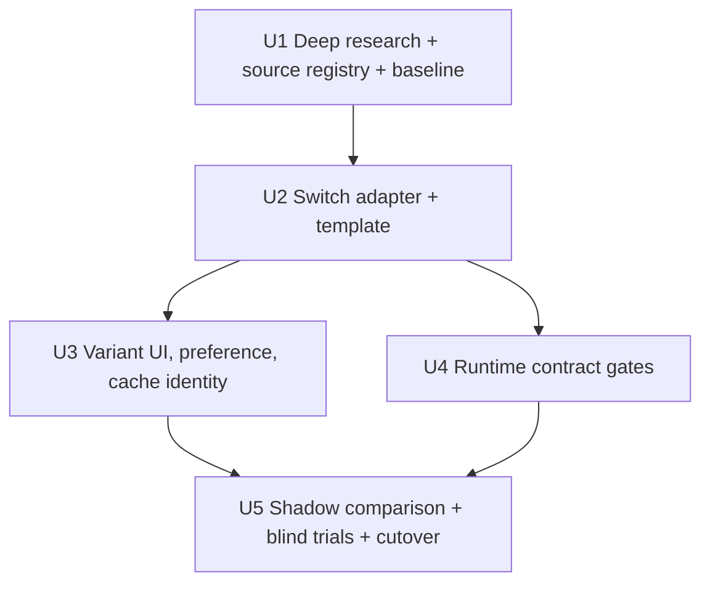

# Bean-Specific V60 Switch Recipe Engine

## Summary

Add the Hario V60 Switch as a variant of the existing V60 method, following the Kalita Wave 155/185 precedent: one canonical `v60` method key, a user-facing variant selector inside the brew modal (`Classic` / `Switch`), a persisted preference, and a dedicated deterministic adapter that owns the physical recipe. The Switch adapter generates hybrid valve-schedule recipes (percolation phase with valve open, immersion phase with valve closed) from bean evidence, roast level, process, dose, and grinder, reusing the evidence/intent layer built for Kalita and V60.

The default recipe structure is the owner-preferred two-pour hybrid: **pour 1 with the valve open (percolation), pour 2 with the valve closed (steep), then open to drain.** This is the Tetsu Kasuya / Coffee Chronicler structure. Temperature split, timing, ratio, and grind adapt per roast and process.

Like the Kalita and V60 engines, this starts research-first: the implementation must complete a full source-verification pass and source registry before any recipe parameter is coded. It ships in shadow/candidate mode with the GPT path as fallback and cuts over only after gates pass.

---

## Problem Frame

The app models the V60 as a single fast-draining cone with `hoffmann` and `kasuya-46` techniques. The Hario Switch is the same cone geometry with a ball valve that turns it into an immersion or hybrid brewer. It cannot be represented by the existing V60 engine because:

- The valve schedule (close/open timestamps) is the primary extraction dial. Research consensus: ~90% of extraction happens during the valve-closed immersion phase, so valve toggles must be first-class, precisely-timed steps, not pour annotations.
- Hybrid recipes commonly use two water temperatures (hot percolation phase, cooler immersion phase, e.g. Kasuya's 93°C → 70°C), which the current recipe shape does not carry.
- Grind runs 1-2 steps coarser than a classic V60 whenever valve-closed time exceeds ~60-90 seconds, and coarser again for dark roast or anaerobic process.
- `coffeeKnowledge.js` currently frames V60 as "fast-draining cone," which is wrong for the Switch and would mislead the AI explanation layer.

The Kalita 155/185 precedent showed the right shape for "one brewer, physical configurations within it": preference field + configuration key dimension + bespoke segmented control in the modal + deterministic adapter branching on the configuration. We mirror that exactly, with one difference: because the Switch changes step *structure* (valve actions, dual temps, steep phase), it gets a sibling adapter (`v60SwitchAdapter.js`) rather than branches inside `v60Adapter.js`, keeping the shipped V60 engine and its test suite untouched.

---

## Requirements

- R1. The Switch is a variant of the `v60` method key, not a new `BREW_METHODS` entry. Selection is a `Classic` / `Switch` segmented control in `HandBrewModal`, visible only when the recipe device is `v60`, persisted as `preferences.v60Variant` ('classic' default), mirroring `KalitaSizeSwitch` + `preferences.kalitaSize`.
- R2. **Research before parameters.** A dedicated research unit must verify every external source listed in this plan (fetch, extract exact parameters, resolve discrepancies between conflicting published versions), read the internal coffee references (World Atlas of Coffee notes, Last30Days research files per the standing rule), and produce `docs/data/v60-switch-source-registry.md` following the Kalita registry conventions (author, relationship, evidence tier, original vs adapted vs aggregated). No adapter parameter may be coded without a registry-backed source or an explicit "derived/interpolated" label.
- R3. The default recipe structure is the two-pour hybrid: valve open for pour 1 (percolation, roughly 40-50% of water), valve close, pour 2 to full water (immersion steep), then valve open to drain. Dual-temperature variants (cooler second pour) are roast-dependent refinements of this same template, not separate recipes.
- R4. Valve actions ("Close valve", "Open valve") are first-class timed steps in the recipe `steps[]` array with exact timestamps, phase labels (`percolation` / `immersion` / `drawdown`), and timer compatibility. A second water temperature, when used, is a structured field, not prose.
- R5. Roast-level and process presets drive parameters: light ≈ 1:16-1:17 hot both phases short steep; medium ≈ 1:15-1:16 with the classic large temp drop; dark ≈ 1:13-1:14 cooler immersion-forward long steep; anaerobic/experimental caps temperature (~88-91°C), coarsens grind, and lengthens ratio regardless of roast preset. Final numbers come from the verified source registry, not from this plan.
- R6. Grind is computed through the existing single-source micron model (`GRINDER_MICRON_SCALES`, `odeStepToMicrons`) with a Switch-specific coarser target driven by total valve-closed time; no new micron formulas anywhere (grind-calibration gate [2] scans all of `src/`).
- R7. Every candidate recipe satisfies the existing recipe contract: finite values, valid grinder output, monotonic water totals, strictly ascending timer steps, total duration after the last step, and passes the existing repair/scaling/timer/`buildTimerSteps` seams.
- R8. Cache identity includes the variant: `configurationKey` becomes e.g. `v60:02:standard-paper:switch:hot` vs the existing `v60:02:standard-paper`. Existing cached classic V60 recipes remain readable and are never invalidated or regenerated by this change. Engine/rules versions are Switch-specific.
- R9. Legacy GPT fallback remains available and explicitly marked; candidate failure never silently serves a classic V60 recipe as a Switch recipe or vice versa.
- R10. Recipe output carries structured reason codes and human-readable rationale (why this valve schedule, why this temp split, why this grind) with provenance, like the Kalita adapter's reason codes.
- R11. Reddit / community evidence (r/pourover, home-barista Switch threads) enters the research artifact as a dated, low-confidence gut check only, per the Kalita precedent.
- R12. Authorship stays accurate: Kasuya's hybrid is the primary named structure; Hoffmann's Switch recipes are a *different* structure (immersion-first) and must not be conflated; Coffee Chronicler's is a Kasuya-derived single-temp adaptation; aggregator compilations (mcjones.ca, timer.coffee, gota-style cards) are not independent corroboration.

---

## Scope Boundaries

- Hot mode only in this slice. Iced Switch (the Kasuya iced pattern exists in sources) is deferred until hot passes its gates, mirroring the Kalita hot→iced sequencing.
- No new `BREW_METHODS` device key, no onboarding changes (`R07Preferences` keeps listing "Hario V60"; the variant is a brew-modal concern like Kalita size).
- Pure-immersion mode (valve closed throughout, Clever-style) is recorded in the registry and adapter design but shipped as a deferred second template; the two-pour hybrid is the only generated structure in this slice.
- Do not touch the shipped classic `v60Adapter.js` decision logic, its registry, or its test suite except to thread the variant through routing.
- Do not modify `flashBrewTransform`/iced seams beyond safely rejecting Switch candidates from iced transform until iced is built (explicit unsupported marker, not a crash).
- No new Firestore collections; `preferences.v60Variant` is an additive preference field.

### Deferred to Follow-Up Work

- Iced Switch adapter + source registry.
- Pure-immersion "easy mode" template (novice one-tap steep).
- Tasting-feedback-driven valve-schedule revisions (waits on the same lineage prerequisites as Kalita).
- Any Settings-page surface for the variant (modal-only first, matching Kalita size).

---

## Context & Research

### Relevant Code and Patterns (verified against current source)

- **Kalita variant precedent:** `src/data/kalitaConfiguration.js` (frozen config table + normalizers), `src/lib/kalitaAdapter.js` (size drives grind/ratio/timing + reason codes + `configurationKey: kalita:${size}:wave-paper:hot`), `KalitaSizeSwitch` in `src/components/HandBrewModal.jsx:71-141` (rendered ~:522 gated on device), `handleKalitaSizeChange` in `src/hooks/useHandBrew.js:480-500` (persist preference → clear dose override → regenerate).
- **V60 engine to sit beside:** `src/lib/v60Adapter.js` (`V60_CONFIGURATION_KEY` is currently a flat const at :6 — must become variant-aware or the Switch key is minted by the new adapter), `src/lib/v60Generation.js` (`isDeterministicV60Hot` routing at :36-38), `src/data/v60SourceRegistry.js`.
- **Shared evidence/intent layer already exists:** `src/lib/recipeEvidence.js`, `src/lib/extractionIntent.js` — reuse, do not fork.
- **Preference storage:** defaults in `src/hooks/useUserProfile.jsx:9-12` (`kalitaSize: '185'` sits here; add `v60Variant: 'classic'`).
- **Cache/timing seams that hard-code `kalitaSize`:** `src/lib/handBrewCachePolicy.js:7-21`, `src/lib/brewTimingMemory.js:41-57,98,119` (literal field + allowlist; Switch brews will not match timing memory without an analogous field).
- **AI/prompt surfaces:** `src/lib/claude.js:24` `VALID_BREW_METHODS` (unchanged — key stays `v60`), `src/lib/coffeeKnowledge.js:219-320` (needs a Switch paragraph; current "fast-draining cone" framing contradicts immersion phase), `src/lib/handbrew.js` `BREW_DEVICE_CONFIGS` only if a legacy LLM fallback config is needed.
- **Gates:** `scripts/verify-grind-calibration.mjs` section [2] (no duplicate micron formulas, all of `src/` scanned) and [3] (`BREW_DEVICE_CONFIGS` must stay a plain literal); `scripts/verify-brew-params.mjs`; `package.json:24` `test:recipe-engine` chain expects a full per-engine test set (adapter, contract, source-registry, integration, runtime-contract, cutover tests) — the Switch ships an equivalent set.

### Internal references the research unit MUST read first (standing rule)

- `~/.claude/books/world-atlas-coffee.md` — brewing/extraction fundamentals.
- The Last30Days coffee research files referenced in the memory index (`reference_coffee_research_files`) — grind sizes, Fellow Ode/Opus calibration context.
- `docs/data/kalita-source-registry.md` and `docs/data/v60-source-registry.md` — registry format and evidence-tier conventions to mirror.
- `docs/plans/2026-08-01-001-feat-bean-specific-kalita-recipes-plan.md`, `docs/plans/2026-08-02-001-feat-bean-specific-v60-recipes-plan.md` — engine precedents.

### External sources to verify (research unit checklist — every row gets fetched and registered)

Preliminary research (2026-08-15 subagent sweep) found these; the research unit re-verifies each, extracts exact parameters, and records evidence tier:

| Source | What it claims | Known discrepancy to resolve |
| --- | --- | --- |
| Tetsu Kasuya hybrid via honestcoffeeguide.com | 20g:280g 1:14, 93°C open bloom+pour to 120g, close at 2:45, 70°C pour to 280g, open ~2:55-3:05 | Conflicts with comoricoffee timing below — find Kasuya's own published primary (YouTube/Instagram) and treat both articles as secondary |
| Tetsu Kasuya hybrid via comoricoffee.com | 20g:280g 1:14, 90°C, close at 1:15, 70°C to 280g, open 1:45 | Same recipe, materially different close/open times vs honestcoffeeguide |
| Kasuya "Super Hybrid" v2 via roastaroma.com + mcjones.ca | 20g:300g 1:15, closed bloom → open percolation → close 2:10 at 70-80°C → open 2:55 | Aggregator-sourced; verify against Kasuya's own channel |
| James Hoffmann Switch hybrid via unpacking.coffee | 20g:330g 1:16.5, 95°C, immersion-first (closed bloom+pour, stir, open 2:30) | Secondary transcription of his video — verify against the original video |
| James Hoffmann Switch immersion via beanbook.app | 15g:250g 1:16.7, 93.3°C, fine grind, 2:00 closed steep | Same |
| Coffee Chronicler via coffeechronicler.com + timer.coffee | 20g:320g 1:16, 92°C single temp, open pour 160g → close 0:30-0:45 → pour to 320g → open 2:00 | This is the closest published match to the owner-preferred default structure |
| Kurasu Switch journal (kurasu.kyoto) | Immersion recipe 15g:200g 1:13.3, 2:00 steep; Switch mechanics explainer | — |
| Kaldi's Coffee Switch guide | Hybrid recipe + "why Switch" rationale | — |
| mcjones.ca Switch recipe compilation | Named recipes: Sherry Hsu (16g:240g 90°C open→close 1:00→open 1:30), Lance Hedrick gong-fu, Emi Fukahori, Weihong Zhang competition + everyday, Kunie Inaba 2024 | Aggregator — verify at least Hedrick and one competition recipe against original sources |
| Hario official Switch materials | Manufacturer guidance, valve mechanics, intended capacity (03 size exists; confirm which size the app targets — 03/360ml is the common Switch) | Must confirm cone size: Switch ships as size 03; classic app assumption is 02. Affects configuration key and dose bounds |
| home-barista.com Switch grind/steep thread | Fine+short-steep vs coarse+long-steep tradeoff; ~90%-of-extraction-in-immersion claim | Community, low confidence — gut check tier |
| Reddit r/pourover Switch threads | Popularity, failure modes (stalling after long closed bloom, valve clogging) | Community, low confidence — gut check tier, dated artifact like `kalita-reddit-gut-check.md` |
| The Coffee Compass / Blind Coffee Roaster / Perfect Daily Grind anaerobic-brewing guides | Process overrides: 88-91°C cap, +100-150µm coarser, 1:16.5-1:17 | Not Switch-specific — applicable because immersion dominates extraction; label as theory tier |
| Barista Hustle drawdown lesson (already in Kalita registry) | Fines/bed-depth/agitation interaction for the drawdown phase | Theory tier, reusable |

Registry rules carried over from Kalita: aggregators (mcjones.ca, timer.coffee, beanbook, unpacking.coffee) are curated/adapted secondaries, never independent corroboration; primary = the author's own published recipe; discrepancies between secondaries are recorded and resolved toward the primary or explicitly marked unresolved with a conservative default.

### Key research findings feeding design (to be confirmed by the research unit)

- Immersion phase dominates extraction → valve-closed duration is the primary strength dial; drawdown mainly affects clarity/texture. Valve timestamps must be precise steps.
- Grind: baseline = app's standard V60 target, then coarser as valve-closed time grows (rule of thumb: +1 step past ~60-90s closed, +1-2 more for dark/anaerobic).
- Common ratio center of mass is 1:15; roast presets spread 1:13-1:17.
- Pitfalls to encode as guardrails: closed bloom >60s risks bed clog and 5-minute drawdowns; too-hot long immersion is the main astringency risk (the reason for Kasuya's 70°C second phase); drawdown time (45s-1:15+) must be budgeted into total time.

---

## Key Technical Decisions

- **Variant, not device.** `device` stays `'v60'`; `variant: 'switch'` rides on the recipe and preference, exactly as `kalitaSize` does. Chat allowlists, method menus, and bean-scan schemas keep working unchanged.
- **Sibling adapter.** `src/lib/v60SwitchAdapter.js` owns Switch physics (valve schedule, dual temps, steep-aware grind, drawdown budget) with its own engine/rules versions and reason codes (`SWITCH_HYBRID_DEFAULT`, `SWITCH_TEMP_SPLIT_MEDIUM`, `SWITCH_IMMERSION_COARSENED`, `SWITCH_CLOSED_BLOOM_CAPPED`, `DEFAULTED_V60_VARIANT`, ...). `v60Generation.js` routes on variant. The classic adapter is untouched.
- **One parametric template.** percolate(open) → close+pour+steep → open+drain, parameterized by `bloom_pct`, `phase1_water_pct`, `temp_phase1`, `temp_phase2`, `valve_close_time`, `steep_duration`, `grind_offset`. Roast preset table + process override layer reproduce Kasuya, Chronicler, and the owner-preferred two-pour recipe as parameter points. Hoffmann's immersion-first structure is registry evidence, not a generated template, in this slice.
- **Owner default = two-pour Chronicler-style structure**; the temp split (second pour cooler) engages per roast preset rather than always. Light roasts may run both phases hot; medium gets the signature drop.
- **Evidence precedence, shadow-first, reason codes, versioned candidates** — all inherited unchanged from the Kalita plan's decisions.
- **Timer copy treats valve actions as steps** ("Close the valve, pour to 280g", "Open the valve") so `BrewTimer` needs no structural change, only the steps contract.

---

## Open Questions

### Resolved During Planning

- **Variant-within-v60 vs new method key?** Variant, per owner direction and the Kalita precedent.
- **Which structure is default?** The two-pour open→closed hybrid (owner preference; also the most-cited signature Switch structure via Kasuya/Chronicler).
- **Iced?** Deferred; hot gates first.
- **New adapter or branch v60Adapter?** Sibling adapter; step structure differs too much to branch safely.

### Deferred to Implementation

- Exact preset numbers per roast/process — set only after the source registry is complete (R2).
- Switch cone size handling (03 vs 02) and dose bounds — resolve from Hario primary sources during research.
- Whether `temp_phase2` displays as a second kettle instruction step ("Cool kettle to 70°C") with its own timer slot or as step metadata — decide against real modal/timer rendering.
- Feature-flag/shadow mechanism — reuse whatever U6-era mechanism the Kalita/V60 cutovers established.

---

## Implementation Units

- U1. **Deep research pass, source registry, and baseline**

**Goal:** Verify every source before any parameter exists in code. This unit is deliberately larger than its Kalita counterpart, per owner direction.

**Requirements:** R2, R11, R12

**Files:**
- Create: `docs/data/v60-switch-source-registry.md`
- Create: `docs/data/v60-switch-reddit-gut-check.md`
- Create: `docs/data/v60-switch-recipe-evaluation-beans.json` (reuse the Kalita/V60 evaluation bean matrix where possible)
- Create: `docs/research/2026-08-15-v60-switch-methodology-brief.md`

**Approach:**
- Read the internal references first (World Atlas notes, Last30Days research files, both existing registries) per the standing rule.
- Fetch and verify every row of the external-source checklist above. For each: exact dose/water/ratio/temps/grind/valve schedule, author relationship (original/adapted/aggregated), evidence tier, and date.
- Resolve the Kasuya timing discrepancy (honestcoffeeguide vs comoricoffee) against Kasuya's own primary publication; if unresolved, record both and choose the conservative structure.
- Confirm Switch hardware facts from Hario primary sources (cone size, capacity, valve behavior) — this decides dose bounds and the configuration key.
- Produce the methodology brief: the parametric template, the roast preset table with registry-cited numbers, the process override layer, and the guardrails (closed-bloom cap, temp/steep astringency bound, drawdown budget). Every number cites a registry row or is labeled derived/interpolated.
- Reddit/home-barista artifact per the Kalita gut-check format: dated, linked, low confidence, failure modes highlighted.

**Verification:** every external claim in this plan's research section is either confirmed with a registry citation, corrected, or explicitly discarded in the brief. No orphan numbers.

---

- U2. **Deterministic Switch adapter**

**Goal:** Pure, reproducible Switch recipe generation from extraction intent + configuration.

**Requirements:** R3, R4, R5, R6, R7, R10

**Files:**
- Create: `src/lib/v60SwitchAdapter.js`
- Create: `src/data/v60SwitchConfiguration.js` (frozen literal: dose bounds, template constants — plain literal to keep gate [3]-style extraction viable)
- Create: `src/data/v60SwitchSourceRegistry.js` (executable registry mirroring `v60SourceRegistry.js` conventions)
- Create: `scripts/v60-switch-adapter.test.mjs`
- Create: `scripts/v60-switch-recipe-contract.test.mjs`
- Modify: `src/lib/v60Generation.js` (variant routing only)

**Approach:**
- Consume the existing `extractionIntent` output; no new evidence format.
- Implement the single parametric template with roast presets and process overrides from the U1 brief. Valve actions are steps with `phase` labels; dual temp emitted as structured `waterTemp` + `waterTemp2` (or a per-step temp field — decide against modal/timer rendering in U3).
- Grind via existing micron helpers only; Switch target = classic V60 target + closed-time-driven offset, clamped to `GRINDER_RANGES`.
- Guardrails as hard rules with reason codes: closed bloom ≤60s, steep duration bounded per roast, drawdown budget included in `totalBrewTimeSeconds`.
- Fail closed into the legacy fallback on any contract violation.

**Test scenarios:** byte-equivalent repeated generation; distinct light/medium/dark preset outputs; anaerobic override caps temp and coarsens grind with reason codes; valve steps strictly ascending and phase-labeled; monotonic water totals across both pours; guardrail negative controls (closed bloom forced >60s is clamped + coded); non-finite/malformed output rejected.

---

- U3. **Variant selector, preference, cache identity, routing**

**Goal:** The Kalita-pattern integration: visible variant control, persisted preference, correct cache keys, safe fallback.

**Requirements:** R1, R8, R9

**Files:**
- Modify: `src/hooks/useUserProfile.jsx` (add `v60Variant: 'classic'` default)
- Modify: `src/hooks/useHandBrew.js` (variant in generation inputs + cache checks; `handleV60VariantChange` mirroring `handleKalitaSizeChange` :480-500)
- Modify: `src/components/HandBrewModal.jsx` (`V60VariantSwitch` segmented control modeled on `KalitaSizeSwitch` :71-141, gated on `recipe.device === 'v60'`; provenance caption; dose bounds swap)
- Modify: `src/lib/handBrewCachePolicy.js` (thread variant like `kalitaSize`)
- Modify: `src/lib/brewTimingMemory.js` (variant field in snapshot/context allowlist)
- Modify: `src/lib/coffeeKnowledge.js` (Switch paragraph; fix the fast-draining-cone framing where it would misdescribe the Switch)
- Create: `scripts/handbrew-v60-switch-integration.test.mjs`

**Approach:** exact Kalita choreography — toggling the variant persists the preference, clears dose override, regenerates under the new `configurationKey`; classic-keyed cache entries never serve Switch requests and vice versa; legacy recipes without variant metadata read as classic.

**Test scenarios:** variant reaches the adapter and is stamped on the candidate; cache miss on variant flip; legacy cached classic recipes untouched and rendering; unknown persisted variant falls back to classic with a defaulted reason code; stale-request guard holds across a variant flip; timing memory records and matches on variant.

---

- U4. **Runtime contract gates (timer, scaling, iced rejection)**

**Goal:** Prove valve-step recipes survive every downstream consumer.

**Requirements:** R4, R7

**Files:**
- Create: `scripts/v60-switch-runtime-contract.test.mjs`
- Modify: `src/lib/recipeScaling.js` / `src/lib/flashBrewTransform.js` only if valve steps or dual temp need explicit carry-through or explicit iced-unsupported handling
- Extend: `scripts/verify-brew-params.mjs` with Switch negative controls
- Modify: `package.json` `test:recipe-engine` chain (add the Switch test set)

**Approach:** run candidates through `scaleRecipeForDose`, `buildTimerSteps`, and modal display derivation; assert valve steps keep timer validity at every supported dose; iced transform explicitly rejects Switch candidates with an unsupported marker (no crash, no silent classic-iced recipe); confirm grind-calibration gate [2]/[3] still pass with the new files.

---

- U5. **Shadow comparison, blind trials, cutover**

**Goal:** Evidence-gated rollout, Kalita-style.

**Requirements:** R7, R9, R10

**Files:**
- Create: `scripts/v60-switch-recipe-compare.mjs` (+ test)
- Create: `docs/data/v60-switch-shadow-report.md`
- Create: `docs/data/v60-switch-blind-trial-protocol.md`

**Approach:** compare candidate output against the registry's named recipes (does the medium preset reproduce Kasuya/Chronicler within tolerance?) and against the legacy GPT path for structural quality; blind trials on Tal's actual Switch across at least light washed, natural, and one dark/medium bean; reversible cutover flag; hot only.

---

## System-Wide Impact

- `useHandBrew` orchestration, request-token guards, and persistence are reused; the Switch adapter slots into the existing candidate seam beside `kalitaAdapter`/`v60Adapter`.
- No API, Firestore schema, or `VALID_BREW_METHODS` changes; chat and bean-scan surfaces see the same `v60` key.
- `coffeeKnowledge.js` prose change is additive and must keep `verify-brew-params.mjs` band assertions green.
- Unchanged invariants: canonical method keys, single micron model, legacy recipe readability, shared `displayRecipe`, deterministic flash-brew for all non-Switch devices.

---

## Risks & Dependencies

| Risk | Mitigation |
|------|------------|
| Secondary sources disagree on Kasuya's timings | U1 resolves against the primary; unresolved → conservative default + recorded conflict |
| Switch cone is size 03 while app assumes 02 | U1 hardware verification decides configuration key and dose bounds before code |
| Valve steps break timer/scaling assumptions | U4 runtime contract gates before any UI exposure |
| Cache collision between classic and Switch recipes | Variant in `configurationKey` + integration tests on flip/miss (U3) |
| Dual temperature confuses the modal/timer copy | Decide rendering in U3 against the real components; structured field either way |
| `coffeeKnowledge.js` edit trips verify gates | Run `verify-brew-params.mjs` + `verify-grind-calibration.mjs` in U3 before commit |
| Over-extraction guardrails too loose (long hot steeps) | Hard steep/temp bounds with reason codes + blind trials before cutover |

---

## Phased Delivery

- **Phase 0 — Research:** U1 (registry + methodology brief; gate: every source verified).
- **Phase 1 — Engine:** U2 (adapter + contract tests, byte-equivalent determinism).
- **Phase 2 — Product:** U3 + U4 (variant UI, cache identity, runtime gates, test-chain wiring).
- **Phase 3 — Evidence-gated rollout:** U5 (shadow report, blind trials on the real Switch, reversible cutover). Device sign-off from Tal before production channel, per house workflow.

---

## Success Metrics

- Source registry covers every checklist row with evidence tiers; zero uncited parameters in the adapter.
- Medium-roast default output reproduces the two-pour open→closed structure with a valve-close step and (when preset dictates) a cooler second pour.
- Repeated generation is byte-equivalent; all candidates pass or fail closed.
- Variant flip regenerates under a distinct configuration key with no legacy-recipe disturbance.
- Full `test:recipe-engine` chain green including the new Switch set; both verify gates green.
- Blind trials on the physical Switch across ≥3 bean profiles before cutover.

---

## Sources & References

- Precedents: `docs/plans/2026-08-01-001-feat-bean-specific-kalita-recipes-plan.md`, `docs/plans/2026-08-02-001-feat-bean-specific-v60-recipes-plan.md`, `docs/data/kalita-source-registry.md`, `docs/data/v60-source-registry.md`
- Current source: `src/lib/v60Adapter.js`, `src/lib/kalitaAdapter.js`, `src/hooks/useHandBrew.js`, `src/components/HandBrewModal.jsx`, `src/lib/brewMethods.js`, `src/lib/handbrew.js`
- External (pending U1 verification): honestcoffeeguide.com/brew-recipes/tetsu-kasuya-hybrid-method, comoricoffee.com/en/kasuyas-hario-switch-recipe-en, roastaroma.com (Super Hybrid v2), mcjones.ca/docs/recipes-for-switch, unpacking.coffee/recipes/23-james-hoffmann-hario-switch-hybrid, beanbook.app (Hoffmann immersion), coffeechronicler.com/hario-switch + timer.coffee, kurasu.kyoto/blogs/kurasu-journal/switch, kaldiscoffee.com Switch guide, Hario official materials, home-barista.com Switch thread, r/pourover threads, thecoffeecompass.com + theblindcoffeeroaster.com.au + perfectdailygrind.com anaerobic guides, baristahustle.com drawdown lesson
