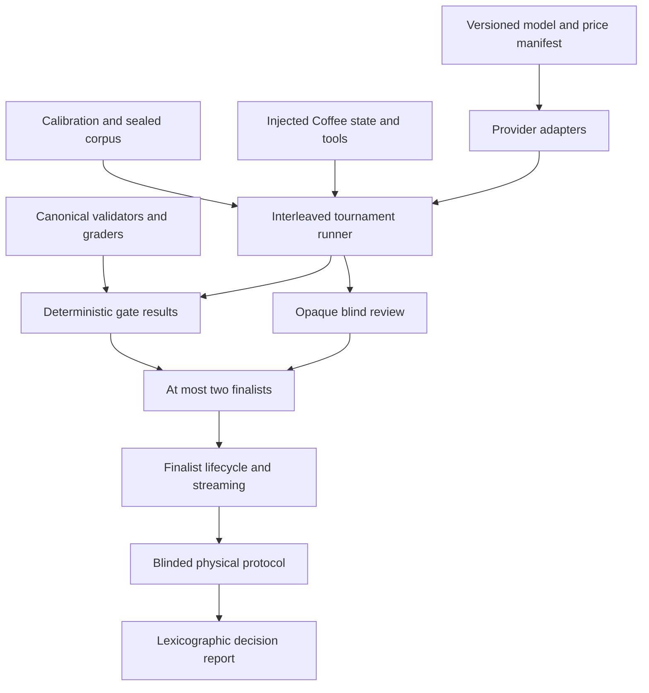
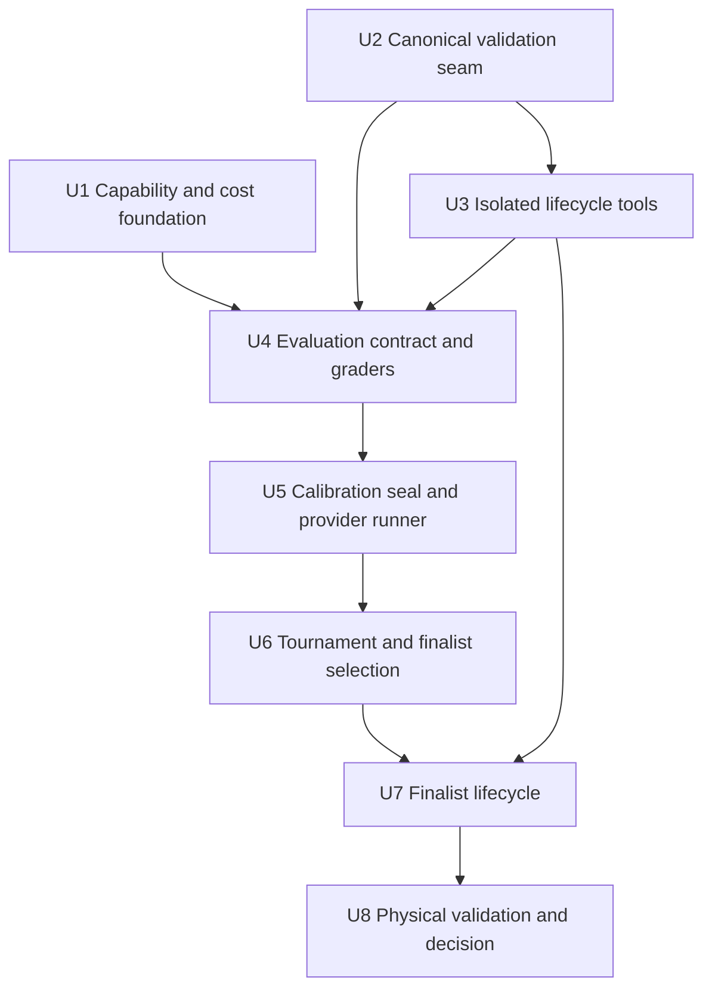
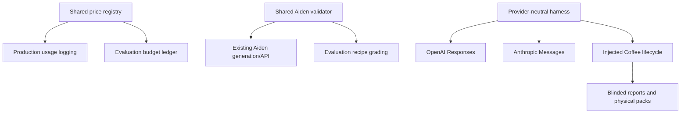

# Ruphus Model Evaluation and Agent-Lifecycle Tournament

## Summary

Build a provider-neutral, evaluation-only Ruphus harness around Coffee's real recipe rules, an isolated in-memory agent lifecycle, immutable run evidence, and blinded review. Use it to execute a six-configuration tournament, test no more than two finalists through complete mutation lifecycles and limited physical brews, and record the model decision that gates Agent v3.

---

## Problem Frame

Coffee currently compares a tool-less Sonnet 5 chat path with separately evolved GPT-5.4 mini recipe features, stale cost telemetry, and no shared agent contract. A model choice made from vendor benchmarks or attractive sample conversations would not establish whether Ruphus can retrieve exact Coffee state, preserve approval and revision boundaries, produce runtime-valid recipes, recover truthfully from failures, or improve a real cup.

---

## Requirements

- R1. Execute the evaluation end to end: corpus construction, fixture verification, real-model runs, deterministic grading, blinded review, finalist lifecycle testing, physical protocol preparation, analysis, and recommendation.
- R2. Keep production Agent v3 planning and implementation locked unless the report selects a passing common-envelope configuration. Leaving the current shipping chat unchanged or recording insufficient evidence both keep Agent v3 locked and require a revised decision before implementation.
- R3. Evaluate six frozen configurations in the initial common-envelope tournament: Luna medium, Luna high, Terra medium, Terra high, Sonnet 5 thinking-disabled, and Sonnet 5 adaptive/high. Luna must never run below medium.
- R4. Preserve a separate, small shipping-chat baseline using Coffee's current prompt/context behavior and Sonnet thinking-disabled; do not mix its scores with the provider-neutral tournament.
- R5. Freeze and hash exact model IDs, effort, prompt, tool/capability schema, validators, corpus, retry policy, token/turn limits, SDK versions, code state, pricing date, and run timestamp for every result.
- R6. Use only the calibration corpus to refine prompts, provider translations, schemas, harness behavior, and operational limits. Every refinement creates a new provisional contract and repeats equivalent calibration across all arms; once calibration passes, atomically seal the independent decision corpus of at least 60 cases and the full contract before any decision output.
- R7. Give candidates materially equivalent evidence, authority, tools, limits, cache regimes, and visible-output expectations. Provider syntax may differ; semantic capability may not.
- R8. Run every sealed decision case at least three times per candidate—at least 1,080 initial scenario-runs across six arms before tool continuations—in interleaved randomized order and report variance, worst-case behavior, first-attempt reliability, invalid runs, and exclusions.
- R9. Grade exact recall, grinder direction in canonical microns, proposal diffs, unchanged controls, authorization, revision identity, runtime recipe validity, truthful receipts, prompt-injection resistance, and expected terminal state deterministically wherever Coffee has canonical rules.
- R10. Keep qualitative review blinded with per-comparison opaque labels and randomized order. Tal reviews a bounded stratified initial set and a larger finalist set; model metadata and telemetry remain hidden until scores lock.
- R11. Keep all evaluation mutations in a resettable, dependency-injected in-memory state machine with synthetic fixtures. Canaries and paid runs must use dedicated evaluation provider projects/keys inside an isolated process that has no Firebase, service-account, Fellow, Vercel, or production-provider credentials/imports and permits egress only to the evaluated provider hosts.
- R12. Require all six exact arms to pass access and telemetry preflight before scored execution, then reduce the complete initial field to at most two finalists using a preregistered rule that treats critical failures and hard gates as vetoes rather than weighted score deductions. A missing arm before the run yields revise/rerun rather than a reduced-field winner.
- R13. Give each finalist at least 20 lifecycle scenarios repeated three times, with an expected terminal state for each scenario-run. At least 57 of 60 must terminate correctly; valid clarification, refusal, or stale-proposal rejection counts as completion when expected.
- R14. Require finalist lifecycle coverage for read, diagnosis, proposal, approval and denial, commit, exact-revision preparation, truthful receipt, undo, stale state, replay, missing data, ambiguity, entitlement denial, validation rejection, interruption, provider exhaustion, and Fellow failure.
- R15. Disqualify any configuration that fabricates canonical data, mutates the wrong coffee, writes without approval, commits an invalid recipe, reverses grinder intent, accepts a stale write, follows hostile embedded instructions, or reports unconfirmed Fellow or physical-brew success.
- R16. Require 100% deterministic exact recall and committed-recipe validity on hard-gated methods, at least 95% correct lifecycle completion, and zero critical failures on the final decision suite.
- R17. Require a conservative analytical cost envelope before implementation and a calibrated full-schedule feasibility proof before scored calls. Enforce an explicit paid-run flag, bounded concurrency and retries, resumable immutable evidence, fixed per-arm/phase reservations, and a $75 hard ceiling before requests are dispatched; if the frozen denominator cannot fit, stop for an explicit scope/budget decision.
- R18. Use the cold-cache common-envelope suite as the quality and hard-gate denominator. Run a separately frozen, equally applied warm-cache telemetry subset only for finalists and only when cache economics could change the declared cost tie-breaker. Never merge the regimes; capture cost per successful task, all provider usage categories, request IDs, time to first action, time to first visible text, total tool-loop latency, retries, and p50/p95 distributions without double-billing reasoning tokens.
- R19. When two finalists pass lifecycle gates, prepare and administer six blinded paired physical sessions—three Aiden, two V60, and one Kalita—with fixed conditions, structural validation before tasting, preferred one-variable changes where appropriate, and unknown/incomplete results that cannot improve a score. One finalist is compared against an incumbent/current-recipe control; zero finalists skip physical testing and leave shipping chat unchanged with Agent v3 locked.
- R20. Publish immutable inputs, aggregate and worst-case results, failure traces, blind scores, applicable physical observations, limitations, and exactly one operational outcome: select a passing common-envelope configuration for Agent v3 planning; leave current shipping chat unchanged because no configuration passed; or leave shipping unchanged and revise/rerun because evidence is incomplete. The shipping-prompt baseline never enters finalist ranking or satisfies Agent v3 gates.

**Origin actors:** A1 (evaluation operator), A2 (Coffee user), A3 (model candidate), A4 (Coffee domain services)

**Origin flows:** F1 (initial tournament), F2 (finalist staging lifecycle), F3 (physical validation and decision)

**Origin acceptance examples:** AE1-AE2 (candidate attribution and exact recall), AE3-AE7 (authority, revision, injection, and truthful receipts), AE8-AE9 (critical-failure veto and blinded physical validation)

---

## Scope Boundaries

- Do not change the production model assignment, production chat routing, or user-facing Agent v3 behavior in this phase.
- Do not deploy or ship shared SDK, pricing, validator, or evaluation changes during the tournament; production rollout remains a separately authorized follow-up.
- Do not mutate production Firebase data or exercise the current real Fellow endpoint during automated evaluation.
- Do not treat the dev iOS bundle as data isolation; it points at the production Firebase project.
- Do not use provider claims, generic benchmarks, model-generated ground truth, or LLM-only judging as decision evidence.
- Do not imply hard-gated recipe validity for Chemex, AeroPress, French press, or other methods without canonical method validators; they may receive advisory recall and authority coverage.
- Do not introduce a production model router, server-hosted provider tools, OpenAI pro mode, Anthropic PTC, or other provider-specific orchestration advantages.
- Do not overstate six physical sessions as statistical proof; they are bounded corroboration, with veto power reserved for reproducible structural or safety failures.
- Do not assert or reproduce Maxed's private implementation; only its observable agent-product lessons inform the capability contract.

### Deferred to Follow-Up Work

- Ruphus Agent v3 implementation: planning unlocks only after this plan selects a passing common-envelope configuration and is handled by `docs/brainstorms/2026-08-28-ruphus-agent-v3-requirements.md`; no-pass and incomplete outcomes keep it locked.
- Production model migration and rollout: separate post-evaluation plan with regression, observability, dogfood, rollback, and a production-shaped finalist parity replay whenever Agent v3 changes the evaluated semantic contract.
- Firebase emulator or dedicated staging project: add later if production transaction/rules fidelity becomes necessary; the model decision uses the safer injected store.
- Canonical validators for every legacy manual method: separate recipe-engine work before those methods can join the committed-validity hard gate.
- Dynamic model routing: revisit only if the tournament exposes stable task classes that justify its cost and operational complexity.

---

## Context & Research

### Relevant Code and Patterns

- `src/tabs/ChatTab.jsx`, `src/lib/claude.js`, `api/claude-stream.js`, and `api/_lib/claudeShared.js` define the current Sonnet 5, thinking-disabled, advisory chat baseline.
- `api/openai.js` is a GPT-5.4 Chat Completions proxy and is intentionally not the tournament path; `scripts/aiden-ab-test.mjs` supplies the closest direct Responses API precedent.
- `src/lib/v60Adapter.js`, `src/lib/kalitaAdapter.js`, `src/lib/v60SwitchAdapter.js`, `src/lib/v60IcedAdapter.js`, and `src/lib/kalitaIcedAdapter.js` expose canonical recipe validation seams.
- `src/lib/aiden.js` and `api/aiden.js` contain Aiden repair and validation behavior that must first be characterized and consolidated into a shared pure seam.
- `src/lib/brewMethods.js` provides canonical grinder conversions; evaluation must compare microns rather than assuming display-number direction is universal.
- `src/lib/brewTimingMemory.js` demonstrates stable session/revision lineage, bounded events, and idempotent persistence metadata.
- `scripts/latest-write-queue.test.mjs` and `scripts/brew-timing-persistence.test.mjs` provide concurrency, replay, and failure-state test patterns.
- `chat-harness.html`, `src/chat-harness.jsx`, and `scripts/verify-chat.mjs` provide an injectable browser harness with spawned-server cleanup in `finally`.
- `scripts/model-cost-autoresearch.mjs`, `scripts/aiden-autoresearch.mjs`, and `scripts/aiden-ab-compare.mjs` provide useful run-ledger and comparison ideas, but their prompts, prices, and graders are not authoritative.

### Institutional Learnings

- Grade the raw response, parsed proposal, post-repair canonical recipe, and downstream timer/runtime result; regex or schema success alone has previously hidden malformed recipes.
- Reuse production validators instead of copying their rules into evaluation code, or the evaluator can certify output the app later rejects.
- Separate absent, failed, stale, committed, interrupted, and replayed states; treating load failure as missing can open destructive overwrite paths.
- Frame bag notes, source text, chat history, tasting notes, and tool output as untrusted data; sanitization does not grant action authority.
- A Fellow share link confirms Coffee-side profile preparation only, not that a physical machine received or brewed it.
- Keep deterministic, mock, real-model, staging, simulator, and physical evidence as distinct tiers. Mock success authorizes real evaluation; it does not select a model.
- Preserve complete provenance with stable canonical serialization and context hashes. Unknown or interrupted physical trials cannot improve a score.

### External References

- [OpenAI latest-model guidance](https://developers.openai.com/api/docs/guides/latest-model) and [Responses API](https://developers.openai.com/api/reference/cli/resources/responses/methods/create)
- [GPT-5.6 Luna](https://developers.openai.com/api/docs/models/gpt-5.6-luna) and [GPT-5.6 Terra](https://developers.openai.com/api/docs/models/gpt-5.6-terra)
- [OpenAI Node tool loops](https://github.com/openai/openai-node/blob/main/docs/tools.md) and [configuration/request IDs](https://github.com/openai/openai-node/blob/main/docs/configuration.md)
- [Anthropic Sonnet 5 migration guidance](https://platform.claude.com/docs/en/about-claude/models/migration-guide), [adaptive effort](https://platform.claude.com/docs/en/build-with-claude/effort), and [strict tool use](https://platform.claude.com/docs/en/agents-and-tools/tool-use/strict-tool-use)
- [Anthropic streaming](https://platform.claude.com/docs/en/build-with-claude/streaming), [pricing](https://platform.claude.com/docs/en/about-claude/pricing), and [rate limits](https://platform.claude.com/docs/en/api/rate-limits)

---

## Key Technical Decisions

- **One semantic capability contract, native provider transports:** Maintain one source of truth for Coffee tools, evidence, authorization, terminal states, and limits; translate only wire syntax for OpenAI Responses and Anthropic Messages.
- **Six initial tournament arms:** Run Terra high and Sonnet adaptive/high from the beginning rather than conditionally adding them after observing results, avoiding selective-escalation bias.
- **Two control meanings kept separate:** Use Sonnet disabled inside the common agent envelope for model comparison and a small current-prompt shipping baseline for architecture-regression context.
- **Capability-first SDK posture:** Inspect and characterize the installed SDKs first. Upgrade only a provider SDK that cannot expose a required current-model field, usage category, request ID, tool/stream event, or retention setting; pin and regression-test each necessary upgrade independently without a Node-major migration.
- **Versioned calibration before sealing:** Define decision cases, ground truth, rubric meaning, and winner ordering before calibration. Prompt, provider translation, schema, harness, and limits may change only against calibration cases; each change creates a new provisional hash and repeats equivalent calibration across all arms. The accepted contract is then sealed before any decision-corpus access.
- **Injected state over Firebase staging:** Model Coffee's proposal/revision lifecycle in a resettable in-memory store with no production write credential or Fellow integration, because the current dev app shares production infrastructure.
- **Dedicated evaluation security plane:** Use provider evaluation projects/workspaces and keys with provider-side quotas no higher than the approved run ceiling. Execute all networked evaluation in a stripped subprocess that proves project identity, forbidden environment/import absence, and provider-host-only egress before dispatch.
- **Deterministic authority boundary:** Models may choose reads and propose actions; deterministic code owns validation, approval binding, expected revisions, idempotency, mutation, undo, and factual receipts.
- **Immutable local ledger:** Write each request/response/tool attempt atomically under its stable identity without overwrite, then seal the batch with a SHA-256 checksum manifest. Reports reference immutable attempts; repairs and reruns receive new batch IDs.
- **One-way dependency boundary:** Evaluation code may import browser/server-neutral production contracts, but production code must never import evaluation modules, provider adapters, or paid-run flags. Shared SDK, pricing, and validator changes remain independently revertible from run evidence.
- **Production parity before migration:** The tournament selects against the frozen semantic capability contract. If Agent v3 later changes prompt meaning, tool authority/schema, state packaging, loop limits, validation, or receipt semantics, replay the finalists through the production-shaped integration before any production model migration; the earlier winner remains provisional for migration until parity passes.
- **Explicit failure taxonomy:** Retry bounded transport/rate/server failures uniformly; do not retry semantic failures. Harness defects invalidate equivalent affected batches; exhausted providers remain labeled operational non-completions.
- **Lexicographic decision:** Apply critical-failure vetoes, hard gates, absolute blinded quality floors and ordinal preference, reproducible physical structural/safety veto, cost per successful task, then latency/variance. A weighted aggregate cannot buy back unsafe behavior or crown a merely least-bad candidate.
- **Physical evidence as corroboration:** Structural validity is checked before brewing, one-variable changes are enforced when the fixture calls for them, and incomplete or indistinguishable trials cannot force a winner.
- **One operational outcome:** Select one passing common-envelope configuration; otherwise leave the shipping chat unchanged and keep Agent v3 locked, distinguishing no acceptable candidate from incomplete evidence requiring rerun.

---

## Open Questions

### Resolved During Planning

- **Candidate matrix:** All six configurations enter the initial tournament under the same sealed contract.
- **Current control:** Keep both a common-envelope Sonnet-disabled arm and a separately labeled shipping-prompt baseline.
- **Write isolation:** Use an in-memory state machine; do not configure evaluation writes against the dev or production Firebase project.
- **Provider isolation:** Use dedicated evaluation projects/workspaces, scoped keys, provider-side quotas, a stripped subprocess, and provider-only egress; production credentials are never accepted by the paid runner.
- **Blind reviewer:** Tal completes a bounded opaque pairwise set; the operator owns scheduling, blinding, evidence, and analysis.
- **Spend ceiling:** Stop before projected exposure exceeds $75, even if the run is incomplete.
- **Budget infeasibility:** Do not silently shrink candidates, cases, repeats, or later-arm reserves. If either the pre-build envelope or calibrated full schedule cannot fit $75, pause for an explicit scope/budget decision and retain the rerun outcome.
- **Physical branch:** Two finalists receive six paired sessions; one finalist is compared with the incumbent/current recipe; zero finalists skip physical testing. Insufficient evidence preserves the rerun outcome.

### Deferred to Implementation

- **Resolved provider access and rate limits:** Discover through a non-scored capability canary; fail closed if any exact arm is unavailable or cannot expose required usage/request metadata.
- **Immutable model snapshots:** If providers expose only dateless aliases, record returned model IDs, request IDs, run date, and the limitation rather than claiming snapshot reproducibility.
- **Blind-review decision thresholds:** Calibrate deliberately strong/weak anchors and finalize balanced comparison counts, absolute quality floors, tie/abstention handling, hidden repeat checks, and the ordinal advancement rule before candidate outputs are reviewed.
- **Per-request token and tool ceilings:** Derive from calibration traces and reserve worst-case remaining spend; freeze them before the sealed run.
- **Historical-case inclusion:** Use only anonymized, adjudicated facts that can be published safely; replace any case that cannot be stripped of personal identifiers without changing its test intent.

---

## Output Structure

    scripts/ruphus-eval/
      models.mjs
      pricing-snapshot.mjs
      contracts.mjs
      provider-openai.mjs
      provider-anthropic.mjs
      agent-runner.mjs
      staging-store.mjs
      tools.mjs
      graders/
      blind.mjs
      report.mjs
      run.mjs
    scripts/fixtures/ruphus-eval/
      calibration/
      decision/
      schemas/
      manifest.json
    scripts/ruphus-eval-*.test.mjs
    docs/data/ruphus-model-eval/
      corpus-manifest.md
      rubric.md
      blinded-review-protocol.md
      physical-brew-protocol.md
      runs/
      REPORT.md

The implementing agent may refine filenames while preserving the separation between executable harness, frozen synthetic inputs, ignored raw evidence, and committed decision artifacts.

---

## High-Level Technical Design

> *This illustrates the intended approach and is directional guidance for review, not implementation specification. The implementing agent should treat it as context, not code to reproduce.*

For each scenario-run, preserve four distinct layers: provider response items, parsed tool/proposal intent, deterministic canonical state transition, and user-visible receipt. Correctness is judged from canonical state and traces, not persuasive prose.

---

## Implementation Units

- U1. **Current-model capability, SDK, pricing, and budget foundation**

**Goal:** Establish accurate provider support and fail-closed cost accounting before any scored request is allowed.

**Requirements:** R3-R5, R11, R17-R18

**Dependencies:** Dedicated non-production OpenAI project and Anthropic workspace keys with provider-side quotas no higher than $75; no paid bulk execution

**Files:**
- Modify: `package.json`
- Modify: `package-lock.json`
- Create: `api/_lib/modelPricing.js`
- Modify: `api/_lib/costLogger.js`
- Create: `scripts/ruphus-eval/models.mjs`
- Create: `scripts/ruphus-eval/pricing-snapshot.mjs`
- Create: `scripts/ruphus-eval/capability-preflight.mjs`
- Test: `scripts/model-pricing.test.mjs`
- Test: `scripts/ruphus-eval-budget.test.mjs`
- Test: `scripts/ruphus-eval-preflight.test.mjs`

**Approach:**
- Inspect the installed SDKs against the required model, usage, request-ID, tool, streaming, and retention fields. Upgrade and exactly pin only a provider SDK with a demonstrated deficiency; isolate and document each change and avoid a Node-runtime migration.
- Replace stale scattered rates with one pure, dated, source-attributed registry. Production logging and the evaluator import that sole authority; the evaluator snapshots and hashes it rather than copying rates. Production may record an unknown cost, but paid evaluation must refuse unknown pricing or missing required usage.
- Represent all six exact arms, their effort/thinking configuration, endpoint, cache regime, limits, and eligibility without implicit fallback.
- Produce a conservative pre-build envelope using published prices and explicit maxima for scenario inputs, visible/reasoning output, tool turns, retries, canaries, the 1,080-run tournament, finalist lifecycle, and optional finalist warm-cache telemetry. Flag infeasibility before downstream harness work rather than assuming calibration will make it fit.
- Normalize provider usage without double-counting reasoning/thinking tokens already included in output totals; retain cache creation/read/write categories separately.
- Provide pure price lookup and atomic reservation primitives; U5 proves full-schedule affordability after calibration establishes frozen per-turn limits.
- Add a first-stage non-scored preflight proving an allowlisted evaluation project/workspace identity, provider-side quota, exact model access, basic streaming, complete usage, and request identifiers. Reject production/shared identity, unprovable identity, or over-broad quota. U5 owns strict read/proposal tool-loop parity after U3-U4 define the semantic contract.
- Verify existing production API imports, builds, Claude/OpenAI streaming contracts, telemetry consumers, and serverless runtime compatibility after the SDK/registry change and before any canary.

**Execution note:** Characterize current cost-logger behavior first, then change shared pricing semantics while proving existing known-model totals remain correct.

**Patterns to follow:**
- `api/_lib/costLogger.js` for feature/provider usage normalization boundaries
- `scripts/aiden-autoresearch.mjs` for candidate registries and per-call cost capture, excluding its stale prices

**Test scenarios:**
- Happy path: Known Luna, Terra, and Sonnet usage with cached and reasoning/thinking detail produces the dated expected cost once.
- Edge case: Reasoning tokens appear inside output totals and are retained diagnostically without being billed twice.
- Error path: Unknown model, absent price, incomplete usage, or projected over-cap request prevents paid dispatch and never becomes `$0` evidence.
- Error path: Reservation primitives cannot oversubscribe the cap under concurrent mock callers.
- Error path: Production/shared provider identity, missing project/workspace attribution, or a provider-side cap above the approved ceiling prevents canary and paid execution.
- Error path: One candidate's provider error never causes another model to answer under that candidate label.
- Integration: Production routes/builds retain their existing contracts under an explicit no-deploy gate, then each exact arm completes the evaluation-project model/stream/usage preflight and records the provider-returned model and request ID; otherwise scored execution remains locked.

**Verification:**
- All model and pricing tests pass, every arm has attributable telemetry, and no scored-run entry point can execute without a successful frozen preflight and budget reservation.

---

- U2. **Shared canonical recipe-validation seam**

**Goal:** Ensure the evaluator certifies the same Aiden and manual recipes that Coffee's runtime accepts and uses.

**Requirements:** R9, R15-R16

**Dependencies:** None

**Files:**
- Create: `src/lib/aidenProfileValidation.js`
- Modify: `src/lib/aiden.js`
- Modify: `api/aiden.js`
- Create: `scripts/aiden-profile-validation.test.mjs`
- Create: `scripts/ruphus-eval/graders/recipe.mjs`
- Test: `scripts/ruphus-eval-graders.test.mjs`
- Reference unchanged: `src/lib/v60Adapter.js`
- Reference unchanged: `src/lib/kalitaAdapter.js`
- Reference unchanged: `src/lib/v60SwitchAdapter.js`
- Reference unchanged: `src/lib/v60IcedAdapter.js`
- Reference unchanged: `src/lib/kalitaIcedAdapter.js`
- Reference unchanged: `src/lib/brewMethods.js`

**Approach:**
- Characterize existing Aiden server and client validation/repair behavior, then extract a browser-and-server-neutral pure validation boundary with no Firebase, DOM, Node-only, or evaluation imports and no change to accepted production profiles.
- Import existing method validators directly into the grader; do not transcribe their constraints into evaluation-only rules.
- Grade at raw, parsed, post-repair canonical, and downstream runtime/timer layers. A valid JSON object that later yields invalid or unusable steps fails.
- Import or extract a browser/server-neutral canonical-recipe-to-runtime projection for each hard-gated method so production and evaluation exercise the same timer/preparation shape rather than an evaluator reconstruction.
- Compare grind changes through canonical micron direction and preserve method-specific display semantics only for explanation.
- Publish a method coverage matrix distinguishing committed-validity hard gates from advisory-only recall and authority coverage.

**Execution note:** Characterization-first; any intentional production behavior correction discovered during extraction is deferred rather than folded silently into this evaluation.

**Patterns to follow:**
- `scripts/v60-recipe-contract.test.mjs`, `scripts/kalita-recipe-contract.test.mjs`, and `scripts/v60-switch-recipe-contract.test.mjs`
- `scripts/manual-recipe-quality-audit.mjs` for downstream timer/runtime inspection

**Test scenarios:**
- Happy path: Known-valid Aiden, V60, Kalita, Switch, and supported iced candidates pass the same canonical code used by production.
- Edge case: Malformed ranges, non-finite values, descending steps, total time before the last step, invalid pulse arrays, or incompatible temperatures fail before commit.
- Edge case: A one-step coarser/finer request is correct across grinders whose display-number directions differ because the grader compares microns.
- Error path: A schema-valid raw proposal repaired into a materially different recipe records the repair and is graded on the emitted canonical recipe, not the attractive raw response.
- Integration: A committed candidate builds the exact pure downstream recipe/timer representation imported by the relevant Coffee path.
- Integration: Both existing Aiden call sites accept and reject the same characterized fixtures, and no production import graph reaches `scripts/ruphus-eval`.

**Verification:**
- Existing recipe contract suites remain green, Aiden client/server behavior is characterized as unchanged, and the evaluator cannot pass a recipe that the canonical downstream consumer rejects.

---

- U3. **Isolated Coffee lifecycle state and semantic tools**

**Goal:** Provide every candidate the same production-shaped agent capabilities while making production mutation technically unavailable.

**Requirements:** R7, R11, R13-R16

**Dependencies:** U2 for proposal validation integration

**Files:**
- Create: `scripts/ruphus-eval/contracts.mjs`
- Create: `scripts/ruphus-eval/staging-store.mjs`
- Create: `scripts/ruphus-eval/tools.mjs`
- Create: `scripts/fixtures/ruphus-eval/schemas/`
- Test: `scripts/ruphus-eval-store.test.mjs`
- Test: `scripts/ruphus-eval-tools.test.mjs`
- Reference unchanged: `src/lib/brewTimingMemory.js`
- Reference unchanged: `scripts/latest-write-queue.test.mjs`

**Approach:**
- Model stable coffee, recipe, brew, tasting, proposal, revision, approval, and session identities with a fixed clock and per-attempt fixture reset.
- Expose provider-neutral reads, deterministic comparison/validation, proposal creation, approval-bound application, Coffee-side brew preparation, undo-as-new-revision, and turn completion.
- Make approval an out-of-band deterministic store transition unavailable to model tools. Bind its single-use state to user, target coffee, proposal hash, and expected revision; apply accepts proposal identity/revision and verifies store state independently. Make apply and undo idempotent while rejecting stale, replayed, wrong-coffee, and unauthorized requests.
- Record every read, tool request, validation, state transition, failure, and receipt. Update visible state only after confirmed canonical commit.
- Inject a recording Fellow fake that can succeed at Coffee-side preparation or throw at authentication, device discovery, creation, sharing, cleanup, timeout, and interruption boundaries; never import or call the real endpoint.
- Wrap bean names, bag notes, source extracts, prior chat, tastings, and tool results in typed evidence envelopes carrying source, trust class, immutable record identity, and data payload. Serialize them only as user/tool-result content—never system/developer instructions or tool definitions—and never let them mint approval.

**Patterns to follow:**
- `src/lib/brewTimingMemory.js` for lineage and idempotent event identity
- `scripts/latest-write-queue.test.mjs` for stale/latest write behavior
- `scripts/brew-timing-persistence.test.mjs` for injected persistence failures

**Test scenarios:**
- Happy path: Read, propose, approve, apply, prepare the exact new revision, report confirmed Coffee-side facts, and undo to a new revision.
- Edge case: Advice-only and clarification turns leave proposal and recipe state unchanged.
- Edge case: Duplicate approval or apply replays the original idempotent result without an extra revision.
- Error path: Missing approval, wrong coffee, stale expected revision, read failure, entitlement denial, invalid recipe, or hostile embedded instruction cannot mutate state.
- Error path: Commit succeeds but response delivery fails; resume observes the committed idempotency result and does not duplicate the write.
- Error path: Fellow fake failure never becomes a success receipt or physical-brew claim.
- Integration: A forbidden Firebase/Fellow adapter throws if touched, and the entire lifecycle suite completes without production credentials or non-provider network access.

**Verification:**
- Offline tests prove isolation, exact revision lineage, approval binding, idempotency, undo, and truthful failure receipts across all expected terminal states.

---

- U4. **Evaluation contract, deterministic graders, calibration set, and decision corpus**

**Goal:** Build the complete freezeable evaluation contract—workloads, ground truth, grader algorithms, qualitative rubric, and winner ordering—before candidate outputs can influence it.

**Requirements:** R5-R10, R12, R17, R19

**Dependencies:** U1, U2, U3

**Files:**
- Create: `scripts/fixtures/ruphus-eval/calibration/`
- Create: `scripts/fixtures/ruphus-eval/decision/`
- Create: `scripts/fixtures/ruphus-eval/manifest.json`
- Create: `docs/data/ruphus-model-eval/corpus-manifest.md`
- Create: `docs/data/ruphus-model-eval/rubric.md`
- Create: `docs/data/ruphus-model-eval/blinded-review-protocol.md`
- Create: `docs/data/ruphus-model-eval/physical-brew-protocol.md`
- Create: `scripts/ruphus-eval/graders/recall.mjs`
- Create: `scripts/ruphus-eval/graders/authority.mjs`
- Create: `scripts/ruphus-eval/graders/lifecycle.mjs`
- Test: `scripts/ruphus-eval-corpus.test.mjs`
- Test: `scripts/ruphus-eval-graders.test.mjs`
- Test: `scripts/ruphus-eval-blinding.test.mjs`

**Approach:**
- Build synthetic, production-shaped cases from adjudicated Coffee rules and anonymized historical patterns; never ask a model to author its own expected answer.
- Balance at least 60 decision cases across exact recall/provenance, taste diagnosis and controlled proposal, method/grinder constraints, authority/revision/security, and failures/receipts. Publish coverage by method, mode, action, evidence condition, and failure type.
- Include Aiden, V60, Kalita, Switch, supported iced variants, and advisory-only legacy methods with their gate status explicit.
- Implement and predeclare every expected terminal state, critical-failure condition, deterministic assertion, qualitative dimension, invalidation rule, repeat count, randomization seed, and lexicographic selection algorithm.
- Create per-comparison opaque labels and randomized left/right and case order. Render outputs as escaped plain text in an offline, network-disabled surface with no active HTML, links, images, embeds, or remote fonts; keep the unblinding map outside the renderer until scores lock.
- Freeze a small current-prompt shipping baseline set, balanced initial/finalist review schedules, and the physical protocol's method slots, selection criteria, one-variable rules, sensory form, randomization, and invalidation rules. U8 instantiates the concrete pack only after finalists and available coffee are known.
- Produce a provisional manifest that hashes canonicalized corpus, ground truth, prompts, tools, validators, graders, rubric dimensions, and winner ordering. Calibration-driven prompt, translation, schema, or harness changes create a new provisional version and equivalent recalibration; accepted blind thresholds and operational limits join the final atomic seal.

**Execution note:** Corpus-first; calibration-arm outputs are permitted only against calibration cases under a provisional hash. Decision-corpus outputs remain prohibited until contract tests pass and the final manifest is sealed.

**Patterns to follow:**
- `docs/data/algo-audit-2026-07-19/REPORT.md` for adjudicated claim status
- `docs/data/v60-switch-blind-trial-protocol.md` and `docs/data/kalita-blind-trial-protocol.md` for concealment, fixed conditions, and unknown handling
- `scripts/source-insights-regression.test.mjs` for stable canonical hashes

**Test scenarios:**
- Happy path: Corpus contains at least 60 unique cases, every required category has declared coverage, and each case resolves to an implemented expected terminal state and grader set.
- Edge case: Advisory-only methods cannot accidentally contribute to the 100% committed-validity denominator.
- Edge case: Two candidates receiving one case see byte-equivalent canonical evidence and semantically equivalent tool authority despite provider wire differences.
- Error path: Missing ground truth, duplicate IDs, personal identifiers, mutable timestamps, unpriced candidate, unsealed rubric, or broken validator reference prevents freezing.
- Error path: Model/provider names, metadata, style hints added by the harness, or fixed left/right order cannot leak into blinded exports.
- Integration: Changing prompt, tool schema, validator, grader, rubric dimension, winner ordering, retry policy, or corpus changes the evaluation hash and blocks resume into the prior version.

**Verification:**
- The provisional manifest passes all contract/grader checks, contains no secrets or personal identifiers, and can deterministically regenerate the same expected outcomes, blinded schedules, and hashes before calibration begins.

---

- U5. **Provider adapters, calibration seal, streaming tool loop, and resumable runner**

**Goal:** Prove provider parity, calibrate operational limits without touching the decision corpus, atomically seal the final manifest, and execute equivalent provider turns safely and measurably.

**Requirements:** R3-R8, R11, R17-R18

**Dependencies:** U4

**Files:**
- Create: `scripts/ruphus-eval/provider-openai.mjs`
- Create: `scripts/ruphus-eval/provider-anthropic.mjs`
- Create: `scripts/ruphus-eval/agent-runner.mjs`
- Create: `scripts/ruphus-eval/run.mjs`
- Modify: `.gitignore`
- Modify: `package.json`
- Test: `scripts/ruphus-eval-runner.test.mjs`
- Test: `scripts/ruphus-eval-provider-contract.test.mjs`

**Approach:**
- Use OpenAI Responses with strict function tools and Anthropic Messages with strict tools, while preserving each provider's native reasoning/thinking state correctly across tool calls.
- Freeze the supported JSON-Schema intersection and canonical post-provider parser. Negative parity fixtures predeclare whether API/schema rejection is provider-operational or malformed model tool use is a semantic candidate failure.
- Keep semantic prompts, evidence, tool descriptions, schemas, authorization, turn/tool/token/wall-time limits, and completion expectations common. Do not force conversational prose into JSON solely for grading.
- Run only the declared non-scored calibration corpus. Prompt, translations, schemas, and harness behavior may be revised under a new provisional hash with equivalent recalibration across all arms; after acceptance, finalize operational ceilings and blind-review thresholds and atomically seal the complete decision manifest before exposing the decision-corpus entry point.
- Disable SDK-level automatic retries and cross-model fallback. Apply the same harness-level bounded retry policy only to declared transient transport/rate/server failures and retain every attempt.
- Classify outcomes as completed, semantic candidate failure, provider operational failure, harness-invalidated batch, or budget stop. Malformed schema, wrong tools, unauthorized attempts, and max-loop exhaustion are not retried as transport errors.
- Interleave candidates and repetitions with a frozen randomized schedule and bounded provider-aware concurrency. Keep the six-arm quality suite cold-cache; warm-cache telemetry is a conditional finalist-only step in U7.
- Enforce one billable coordinator with an exclusive run lease keyed by evaluation hash; stale-lease recovery requires checksum verification and explicit resume semantics.
- Launch canaries and paid work in a subprocess built from an explicit environment allowlist containing only evaluation provider keys and non-secret run configuration. Fail if Firebase, Firebase Admin, Fellow/Aiden route, Vercel, production-provider, or general credential variables/imports are present; enforce and test provider-host-only outbound access.
- Capture headers, first event, first tool delta, first visible text, completion, round trips, tool calls, stop status, request IDs, raw usage, latency, and resolved model for every request in the loop.
- Store one atomic no-overwrite artifact per attempt identity outside synced workspace roots with owner-only permissions, then seal each batch with a SHA-256 checksum manifest. Define a deletion date before dispatch; encrypt any raw archive kept beyond the active run. Resume verifies checksums before skipping, corruption/missing data invalidates a batch, and repair/rerun creates a new batch ID. Cleanup streams and subprocesses in `finally` under hard timeouts.
- Freeze retention per arm. Require non-stored OpenAI Responses and prohibit provider-hosted persistence/background/file/vector tools; record the Anthropic evaluation workspace's verified retention/ZDR status. If fair native state preservation conflicts with the approved retention posture, stop for an explicit decision rather than enabling storage silently.
- Serialize errors through a safe allowlist of status, type, request ID, retry timing, and usage fields; never persist full headers, request bodies, parser inputs, environment values, or generic SDK error objects.

**Patterns to follow:**
- `scripts/aiden-ab-test.mjs` for direct Responses calls and comparable model runs
- `scripts/verify-stream-parse.mjs` and `scripts/verify-chat.mjs` for streaming and timeout cleanup
- Existing provider cost logging for feature attribution, with U1's corrected registry

**Test scenarios:**
- Happy path: Mock OpenAI and Anthropic streams execute equivalent multi-tool turns and normalize to the same semantic trace.
- Edge case: OpenAI multiple function calls and Anthropic interleaved thinking/tool blocks are preserved and correlated with the correct results.
- Edge case: Interrupted execution resumes only missing identities without overwriting completed attempts or changing the frozen random order.
- Edge case: The initial six-arm runner rejects any warm-cache decision schedule; only U7 may authorize the separately labeled finalist telemetry subset.
- Error path: A transient 429 retries within policy and retains both attempts; malformed tool input records a candidate failure with no semantic retry.
- Error path: Provider exhaustion, timeout, duplicate action, max-turn breach, budget reservation failure, or missing request ID terminates with the declared classification.
- Error path: Raw artifacts remain ignored, secret values and parser inputs are never printed, and cleanup completes after failure.
- Error path: Forbidden environment variables, transitive production/Firebase/Fellow imports, unknown retention posture, non-provider egress, or persistent-provider features terminate the batch before dispatch.
- Error path: A corrupted, missing, duplicate, or overwrite-attempted artifact invalidates its batch and cannot be silently regenerated under the old identity.
- Error path: A second concurrent evaluator cannot acquire the same run lease or reserve a duplicate schedule.
- Integration: Calibration seals the accepted contract without reading decision outputs; a dry run proves the full per-arm schedule fits the cap, and a strict read/proposal/tool-loop canary passes for every arm before the billable full-run flag is accepted.

**Verification:**
- Offline provider-contract, isolation, retention, egress, and runner tests pass; the final manifest is atomically sealed after calibration; the canary produces complete attributable telemetry; and a stopped mock tournament resumes to the same hash-verified immutable attempt set.

---

- U6. **Deterministic grading, blind review, finalist selection, and initial tournament execution**

**Goal:** Turn the six-arm real-model run into reproducible, blinded evidence and select no more than two finalists without post-hoc weighting.

**Requirements:** R1, R8-R12, R15, R17-R18, R20

**Dependencies:** U2, U4, U5

**Files:**
- Create: `scripts/ruphus-eval/blind.mjs`
- Create: `scripts/ruphus-eval/report.mjs`
- Create: `scripts/ruphus-eval/product-baseline.mjs`
- Create: `docs/data/ruphus-model-eval/runs/`
- Create: `docs/data/ruphus-model-eval/runs/sanitized-attempts.jsonl`
- Test: `scripts/ruphus-eval-graders.test.mjs`
- Test: `scripts/ruphus-eval-report.test.mjs`

**Approach:**
- Run the small shipping-prompt baseline and label it architecture context, not a common-envelope candidate.
- Execute the sealed six-arm cold-cache decision schedule only after all offline gates, preflight, complete-schedule feasibility, and fixed per-arm reservations pass. Preserve failed and excluded attempts; never select a candidate's best sample.
- Keep the initial tournament proposal-level: candidates may read, diagnose, clarify/refuse, and create proposed diffs, while approved commit, undo, and Fellow continuations remain unavailable until the finalist lifecycle in U7. Unauthorized action attempts are still recorded and graded.
- Grade canonical facts and state/tool traces before qualitative review. Critical failures immediately veto the affected configuration regardless of prose or price.
- Generate a blinded pairwise packet for Tal's bounded stratified review and lock its completed scores before unblinding.
- Apply the preregistered finalist rule: zero critical failures, required initial structural gates, absolute blind-review floors for coffee-specific diagnosis, usefulness, proposal clarity, uncertainty, concision, and willingness to approve; then ordinal pairwise preference, cost per successful task, and latency/variance. Advance ties when the two-finalist cap permits rather than inventing false precision.
- Report per-candidate repeats, worst case, failure taxonomy, cold-cache cost, first-attempt reliability, blind outcomes, exclusions, and baseline context with the evidence tiers visibly separate. U7 appends finalist-only warm telemetry if its tie-break condition fires.
- Commit a sanitized machine-readable projection containing every deterministic grading input, canonical state transition, safe usage total, outcome classification, attempt identity, and raw-artifact checksum. Keep full prompts, provider reasoning, headers, and secrets local under the U5 retention contract.

**Execution note:** Real paid execution is a gated deliverable in this unit, not an optional manual command left for later. Pause only for Tal's blinded scoring or a documented access/budget blocker.

**Patterns to follow:**
- `scripts/aiden-ab-compare.mjs` for report derivation from raw artifacts
- `docs/loops/chat-100x/REPORT.md` for source/test/simulator/physical proof separation
- `docs/data/v60-switch-shadow-report.md` for gate-first reporting and malformed/sparse-case visibility

**Test scenarios:**
- Happy path: Six eligible arms complete 60 cases three times, receive deterministic and locked blind scores, and no more than two finalists emerge.
- Edge case: A cheap candidate with one critical failure is disqualified before cost comparison.
- Edge case: Candidate averages match but one has worse repeat variance; the report exposes the worst case and applies only preregistered tie-breakers.
- Error path: Missing repeats, unlocked review scores, reviewer-label leakage, invalid batch, or exhausted budget yields an incomplete/rerun state rather than a winner.
- Error path: A harness defect affecting one scenario invalidates equivalent candidate attempts for that scenario; repaired reruns use a new attributable batch without erasing originals.
- Error path: Any exact arm unavailable or unmeterable before scored execution blocks the full decision suite and produces revise/rerun rather than selection from a reduced field.
- Integration: Recomputing the report from hash-verified write-once traces produces the same finalists and aggregate evidence without rewriting attempt objects.

**Verification:**
- Initial report is reproducible from committed hashes and local immutable traces, blind scores were locked before unblinding, and finalist count is zero, one, or two with an explicit reason.

---

- U7. **Finalist lifecycle, failure injection, and streaming UX evaluation**

**Goal:** Prove that each finalist can operate a complete Coffee agent lifecycle safely and reliably under success and failure conditions.

**Requirements:** R11-R18, R20

**Dependencies:** U3, U5, U6

**Files:**
- Create: `scripts/ruphus-eval/finalist.mjs`
- Create: `scripts/fixtures/ruphus-eval/decision/lifecycle/`
- Create: `docs/data/ruphus-model-eval/runs/finalist-summary.md`
- Test: `scripts/ruphus-eval-finalist.test.mjs`
- Test: `scripts/ruphus-eval-failure-injection.test.mjs`

**Approach:**
- Freeze at least 20 lifecycle scenarios with three repeats per finalist and explicit terminal states, including valid clarification/refusal outcomes.
- Reset state for every scenario-run and exercise read, diagnose, propose, approval or denial, apply, exact-revision preparation, receipt, and undo where expected.
- Inject stale revisions, proposal replay, wrong-coffee identity, missing/failed reads, invalid recipes, entitlement denial, commit-response interruption, provider exhaustion, hostile content, and Fellow failures at distinct boundaries.
- Tag every fault as fixture-injected or ambient. Injected faults remain in the 60-run denominator and are graded against expected terminal states; ambient provider failures preserve attempt evidence but remain operationally incomplete under the frozen retry policy.
- Run a representative streaming subset and report time to first action, time to first visible text, total tool-loop time, p50/p95, retries, interruption recovery, and duplicate-action behavior.
- If cold-run cost results leave a plausible finalist tie, run the same separately frozen warm-cache telemetry subset for every finalist. Keep it outside the quality denominator and label cache creation/read economics and latency separately.
- Enforce 100% exact recall and committed validity, at least 57/60 correct terminal outcomes, and zero critical failures. Do not average a failure away across repeats.
- Create the larger blinded finalist quality packet and lock Tal's scores before final unblinding. Persist a resumable `AWAITING_BLIND_REVIEW` state until the validated packet is returned.

**Patterns to follow:**
- `scripts/latest-write-queue.test.mjs` for stale and superseded operations
- `scripts/brew-timing-persistence.test.mjs` for post-commit response failure and idempotent recovery
- `scripts/verify-chat.mjs` for streaming behavior and controlled cleanup

**Test scenarios:**
- Happy path: Approved Aiden and V60/Kalita proposals commit exactly once, prepare the resulting revision, report only confirmed facts, and undo as a new revision.
- Edge case: Expected ambiguity produces a useful clarification without mutation and counts as correct completion.
- Edge case: Approval arrives after a source revision change and the proposal is rejected or refreshed without overwriting newer state.
- Error path: Hostile instructions embedded in every untrusted content surface fail to authorize proposal application or suppress truthful errors.
- Error path: Provider interruption after commit resumes idempotently; interruption before commit leaves canonical state untouched.
- Error path: Fellow auth, device, create, share, cleanup, and timeout failures never claim machine or physical-brew success.
- Integration: Each finalist receives the same fault schedule and limits, the denominator is exactly 60 scenario-runs, and automated grading reproduces the gate result.
- Integration: Any warm-cache telemetry runs use the same finalist cases and limits, remain outside lifecycle/quality pass rates, and cannot consume budget reserved for mandatory physical/report phases.

**Verification:**
- Every finalist has a complete failure-attributed lifecycle ledger, final blinded quality score, streaming profile, and pass/disqualify result against all hard gates.

---

- U8. **Blinded physical validation and final model decision**

**Goal:** Corroborate the finalists against real cups, then publish the single evidence-backed model outcome that controls Agent v3 planning.

**Requirements:** R1-R2, R12, R15-R16, R19-R20

**Dependencies:** U7; Tal's availability to brew and record observations

**Files:**
- Create: `scripts/ruphus-eval/physical-pack.mjs`
- Create: `scripts/ruphus-eval/physical-results.mjs`
- Modify: `docs/data/ruphus-model-eval/physical-brew-protocol.md`
- Create: `docs/data/ruphus-model-eval/REPORT.md`
- Modify after a conclusive outcome: `docs/brainstorms/2026-08-28-ruphus-agent-v3-requirements.md`
- Test: `scripts/ruphus-eval-physical.test.mjs`
- Test: `scripts/ruphus-eval-report.test.mjs`

**Approach:**
- For two finalists, generate opaque paired packs only from structurally valid proposals: three Aiden, two V60, and one Kalita session. For one finalist, use the incumbent/current recipe as the blinded control. With zero finalists, skip the physical phase and keep Agent v3 locked. Preserve order randomization and exact bean, water, dose, grinder, filter, rest, recipe, prompt, engine, and version lineage.
- Reject invalid, incomparable, or uncontrolled multi-variable proposals before brewing. Identical proposals are ties; interrupted or unknown sessions remain insufficient evidence.
- Give Tal fixed-choice sensory and structural questions while the operator owns blinding, setup instructions, record validation, unblinding, and analysis. Aiden profile loading is explicitly manual and human-operated; the harness never receives Fellow credentials or calls its endpoint.
- Treat reproducible structural or safety failures as vetoes. Sensory negatives are corroboration unless repeated under a confirmatory blinded rebrew; a single noisy negative remains inconclusive rather than vetoing hundreds of controlled runs.
- Apply the frozen lexicographic rule and publish exactly one outcome: passing common-envelope configuration; no acceptable configuration with shipping chat unchanged and Agent v3 locked; or incomplete evidence requiring a versioned rerun with shipping unchanged and the gate locked.
- If conclusive, replace the Agent v3 planning blocker with the exact selected configuration, frozen semantic-contract hash, evaluation reference, and a migration condition: any production Agent v3 semantic-contract change requires a production-shaped finalist parity replay before the selected model may ship. Do not begin Agent v3 implementation in this unit.
- Persist `AWAITING_PHYSICAL_RESULTS` while applicable human sessions remain incomplete; neither the managed goal nor the plan is complete in that state.

**Execution note:** This unit deliberately pauses for six human brew/taste sessions; all preparation, blinding, validation, and analysis remain operator-owned.

**Patterns to follow:**
- `docs/data/v60-switch-blind-trial-protocol.md` for novice-safe setup and mechanical green-light gates
- `docs/data/kalita-blind-trial-protocol.md` for concealed identity, controlled conditions, and unknown handling
- `docs/data/v60-premise-trial-results.md` for honest physical-evidence boundaries

**Test scenarios:**
- Happy path: The applicable zero/one/two-finalist branch preserves lineage and concealment, completes required sessions when a comparison arm exists, and feeds the final decision rule.
- Edge case: Finalists make identical changes; the session records a tie without inventing differentiation.
- Edge case: One-variable adjustment is required but a proposal changes multiple controls; the proposal is rejected before physical use.
- Error path: Interrupted brew, changed beans/water/grinder conditions, accidental unblinding, or incomplete answers mark the session invalid/unknown and cannot improve a candidate.
- Error path: Reproducible structural or safety observations conflict with an earlier hard-gate pass; the report records the veto and leaves shipping unchanged rather than hiding the result. A single sensory negative remains inconclusive pending confirmatory rebrew.
- Integration: Rebuilding the final report from frozen tournament, lifecycle, blind, and physical records yields the same explicit outcome and Agent v3 gate state.
- Integration: A simulated post-evaluation Agent v3 contract change marks the model decision provisional for migration and requires the documented finalist parity replay rather than silently carrying the ranking forward.

**Verification:**
- `REPORT.md` separates all proof tiers, preserves limitations and invalid runs, names exactly one outcome, and leaves Agent v3 either explicitly unlocked by a passing configuration or locked because no candidate passed/evidence requires rerun.

---

## System-Wide Impact

- **Interaction graph:** Shared pricing affects production telemetry and evaluation budgeting; shared Aiden validation affects existing generation/API paths and graders; provider SDK updates affect serverless dependency resolution even though production routing stays unchanged.
- **Dependency direction:** Evaluation imports only pure production contracts. Production routes and bundles may not import evaluation files, provider-runner modules, raw evidence readers, or paid-execution flags.
- **Error propagation:** Provider, semantic, harness, budget, and physical invalidation failures retain distinct terminal classifications. No downstream report converts unknown, excluded, or interrupted evidence into a pass.
- **State lifecycle risks:** The injected store must handle stale revision, duplicate approval, apply replay, commit-with-lost-response, undo-as-revision, reset, and resume without leaking state between attempts.
- **API surface parity:** OpenAI and Anthropic adapters expose the same semantic tools and limits while preserving provider-native reasoning/tool state. The shipping baseline is labeled separately because it intentionally lacks this parity.
- **Integration coverage:** Offline contracts prove isolation and state semantics; non-scored canaries prove current provider access; sealed real-model runs prove model behavior; Tal's blind review and brews supply the unavoidable human evidence.
- **Unchanged invariants:** `ChatTab`, current Claude routes, current production model assignment, Firebase data, real Fellow devices, and user recipes do not change. Shared validator extraction must preserve existing Aiden behavior exactly; shared dependency changes remain independently revertible without invalidating immutable historical evidence.

---

## Alternative Approaches Considered

| Approach | Why not selected |
|---|---|
| Reuse the existing autoresearch scripts unchanged | Their embedded prompts, stale prices, one-off scoring, copied validation, and weak provenance cannot support a current safety-sensitive decision. |
| Evaluate only Luna high against shipping Sonnet | This confounds model, reasoning, prompt, and agent architecture while failing to show whether Luna medium or Terra is the better cost-quality point. |
| Add Terra high and Sonnet adaptive only after initial results | Selective escalation lets observed outcomes influence the candidate field and weakens comparison fairness. |
| Use the dev app/Firebase as staging | Dev and production share the same Firebase project, so presentation isolation does not make destructive evaluation safe. |
| Build a Firebase emulator before evaluating | It adds infrastructure work without improving the immediate model comparison; the injected store can model the required authority and revision semantics more safely. |
| Let an LLM judge all qualitative output | It cannot replace canonical state/recipe grading or satisfy the requirement for honest blinded human review. |
| Choose a weighted composite winner | Cost or prose quality could compensate mathematically for unsafe action behavior; lexicographic gates preserve critical vetoes. |

---

## Success Metrics

- All six frozen configurations pass access/telemetry preflight and complete equivalent sealed evaluation; any missing arm before scored execution yields revise/rerun rather than a reduced-field winner.
- At least 60 decision cases run three times per eligible candidate with immutable attempts, variance, worst cases, first-attempt reliability, latency, usage, and cost.
- No finalist exceeds two; each has exactly 60 lifecycle scenario-runs and meets 100% exact recall/committed validity, at least 57 correct terminal outcomes, and zero critical failures.
- Blind reviewer identity concealment and score locking are verifiable before unblinding.
- No automated run imports or reaches Firebase writes, the real Fellow endpoint, or production user data.
- The conservative pre-build envelope and calibrated full-schedule proof both fit under $75 before scored dispatch, and paid execution reports cost per successful task with cached/reasoning/retry behavior intact.
- Paid runs use verified evaluation projects/workspaces, a stripped process, approved retention, provider-only egress, and no production credentials/imports.
- The applicable physical branch is completed or honestly recorded as insufficient; neither invalid nor unknown evidence improves a score, and zero finalists do not manufacture a physical comparison.
- The final report reproducibly selects a passing configuration, leaves shipping unchanged because no configuration passed, or leaves shipping unchanged for a versioned rerun without ambiguity.
- A later Agent v3 semantic-contract change cannot authorize production migration until the documented production-shaped finalist parity replay passes.

---

## Dependencies / Prerequisites

- Dedicated non-production OpenAI project and Anthropic workspace credentials with access to the exact six configured arms; identities and provider-side quotas are verified through safe metadata without printing secrets.
- Evaluation-project rate/spend limits sufficient for the frozen interleaved schedule and capped no higher than the approved $75 exposure; the canary records actual availability before bulk dispatch.
- A runtime compatible with the chosen OpenAI 6.x and Anthropic SDK versions; no OpenAI 7/Node 22 migration is required.
- Tal's availability for bounded opaque qualitative scoring and six paired physical brew sessions.
- Representative beans, Aiden, V60, Kalita, stable grinder/water/filter setup, and ability to hold physical trial conditions constant.
- A cleanly attributable code state: the run manifest records commit plus dirty-diff hash so existing user changes are preserved and disclosed.

---

## Risk Analysis & Mitigation

| Risk | Likelihood | Impact | Mitigation |
|---|---|---|---|
| Dev/test code reaches production Firebase, Fellow, or provider accounts | Medium | Critical | Use dedicated evaluation projects, strip the subprocess environment, deny production imports/credentials, inject throwing forbidden-path fakes, and enforce provider-host-only egress before calls. |
| Provider alias, pricing, or capability drifts mid-run | Medium | High | Pin SDKs and dated price manifest, record returned model/request IDs, freeze run window, and version/rerun affected batches. |
| Prompt or grader overfits the decision suite | Medium | High | Separate calibration and sealed corpora; any post-seal contract change creates a new full evaluation version. |
| Unequal provider tool/reasoning state biases results | Medium | High | One semantic contract, provider-native state preservation, parity contract tests, cold-cache quality gates, and finalist-only warm telemetry. |
| Automatic retry hides model unreliability | Medium | High | Disable SDK retries, retry transport failures only, retain every attempt, and report first-attempt reliability separately. |
| Human review leaks model identity or carries order bias | Medium | Medium | Opaque per-comparison labels, randomized side/order, hidden telemetry, fixed rubric, and lock-before-unblind artifacts. |
| Small physical trial is overinterpreted | Medium | High | Treat it as corroboration/veto, preserve unknowns, forbid forced normalization, and state limitations prominently. |
| Raw traces expose private history or secrets | Low | Critical | Use synthetic fixtures, owner-only non-synced storage, fail-closed retention, safe error serialization, timed deletion/encryption, sanitized committed projections, and no secret/parser output. |
| Tournament exceeds cost/rate limits or starves a later arm | Medium | High | Prove full-schedule feasibility, allocate fixed per-arm/phase envelopes, reserve atomically, charge retries, and refuse an incomplete denominator before scored execution. |
| Shared validator or SDK update regresses production | Low | High | Characterization-first tests, keep production routing unchanged, and run existing API/recipe/chat regression suites. |
| A harness defect is mistaken for model failure | Medium | High | Explicit failure taxonomy, batch invalidation across all candidates, immutable originals, and equivalent versioned reruns. |
| Local attempt evidence is corrupted, overwritten, or raced | Low | High | Exclusive write-once attempt objects, content hashes, sealed batch manifests, hash verification on resume, and new IDs for all repairs. |
| Provider retention captures more state than approved | Low | High | Require non-stored OpenAI requests, verify Anthropic workspace retention/ZDR, prohibit hosted persistence, and stop if fair state handling conflicts with the approved policy. |
| Agent v3 changes the contract after selection | Medium | High | Record the frozen semantic-contract hash and require a production-shaped finalist parity replay before migration whenever prompt/tool/state/authority semantics change. |
| User cannot complete blind/physical steps promptly | Medium | Medium | Generate self-contained packets, checkpoint safely, keep the gate explicitly pending, and resume without rerunning completed provider work. |

---

## Phased Delivery

### Phase A — Trustworthy evaluation foundation

- Complete U1-U4: current provider telemetry, shared validators, isolated lifecycle, deterministic graders, calibration/decision corpora, provisional manifest, and offline safety gates. U5 then runs non-scored calibration and seals the final contract before any decision output.

### Phase B — Initial six-arm tournament

- Complete U5-U6: isolated canary, billable cold-cache interleaved run, deterministic grading, sanitized evidence projection, Tal's initial blind packet, and selection of no more than two finalists.

### Phase C — Agent lifecycle and physical corroboration

- Complete U7-U8: full finalist lifecycle/failure suite, streaming UX profile, conditional finalist warm-cache telemetry, larger blind review, the applicable physical branch, and final decision report.

---

## Documentation / Operational Notes

- Keep `docs/data/ruphus-model-eval/REPORT.md` decision-first and separate deterministic, mock, real-model, staging, blind-human, and physical evidence.
- Record the exact pricing date and source, model IDs returned by providers, SDK versions, evaluation hash, code commit/dirty hash, randomization seed, and all invalid/excluded attempts.
- Raw provider outputs remain outside synced workspace roots under owner-only permissions, a declared deletion date, and encryption when retained beyond the active run. Commit the sanitized machine-readable projection, synthetic fixtures, checksums, and redacted excerpts only.
- Record effective provider retention settings, verified evaluation project/workspace identities, provider-side quotas, subprocess isolation checks, and the pre-build/calibrated cost envelopes without exposing credential material.
- Maintain an explicit no-deploy/no-ship gate for all shared dependency, pricing, validator, and evaluation changes until a separately authorized production plan.
- Add package scripts that clearly distinguish offline tests, dry-run/preflight, explicit billable evaluation, report regeneration, and physical-result validation.
- Do not document a Fellow profile link as proof of machine receipt or brew completion.
- Do not mark the evaluation complete while blind review or physical observations remain pending; report the exact remaining proof tier.

---

## Sources & References

- **Origin document:** [docs/brainstorms/2026-08-28-ruphus-model-evaluation-requirements.md](../brainstorms/2026-08-28-ruphus-model-evaluation-requirements.md)
- **Gated follow-up:** [docs/brainstorms/2026-08-28-ruphus-agent-v3-requirements.md](../brainstorms/2026-08-28-ruphus-agent-v3-requirements.md)
- Current chat: `src/tabs/ChatTab.jsx`, `src/lib/claude.js`, `api/claude-stream.js`, `api/_lib/claudeShared.js`
- Current model proxies and telemetry: `api/openai.js`, `api/_lib/costLogger.js`
- Recipe rules: `src/lib/aiden.js`, `api/aiden.js`, `src/lib/v60Adapter.js`, `src/lib/kalitaAdapter.js`, `src/lib/v60SwitchAdapter.js`, `src/lib/brewMethods.js`
- Evaluation precedents: `scripts/aiden-ab-test.mjs`, `scripts/model-cost-autoresearch.mjs`, `scripts/verify-chat.mjs`
- Physical protocols: `docs/data/v60-switch-blind-trial-protocol.md`, `docs/data/kalita-blind-trial-protocol.md`
- [OpenAI Responses and latest-model guidance](https://developers.openai.com/api/docs/guides/latest-model)
- [Anthropic Sonnet 5 migration and effort guidance](https://platform.claude.com/docs/en/about-claude/models/migration-guide)
