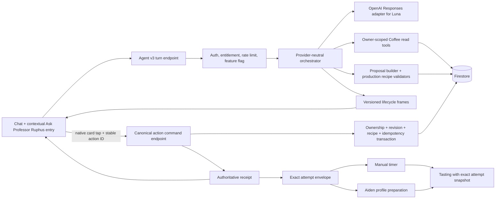

# Ruphus Agent v3 — Coffee-Native Chat, Recipe Actions, and Learning Loop

## Overview

Turn Ruphus from an advisory, marker-driven chat into a provider-neutral Coffee agent that can read canonical brew evidence, explain a diagnosis, render native Coffee artifacts, propose an exact recipe change, and let the user apply or test that change through deterministic app-owned commands. This plan ends at a dogfood-ready implementation and an explicit launch-decision evidence handoff; it does not silently authorize production rollout.

The first slice deliberately concentrates on the recipe-learning loop:

1. Enter Ruphus from a coffee, recipe, completed brew, tasting, or statistics context.
2. Discuss what happened using current owner-scoped Coffee evidence.
3. Render concise Ruphus prose plus a native exact-diff proposal card.
4. Let the user choose **Apply change**, **Brew once**, or **Keep current**.
5. Use the exact accepted revision in the manual timer or Aiden profile preparation.
6. Link the resulting attempt and tasting back to the proposal and recipe revision.
7. After a Brew once tasting, let the user promote that exact attempt to the active recipe ("Make this my recipe") so a good test cup never dead-ends.
8. Show truthful receipts, recovery states, and bounded undo, both in the transcript and on the bean's own recipe surface.

Decisions confirmed with Tal on 2026-08-29: Professor Ruphus prose is unbubbled in Agent v3 turns; Brew once can be promoted to the active recipe; free-tier users see the contextual entry buttons and hit the existing Pro paywall; proposals have no clock expiry (stale/superseded only).

Luna Medium powers development behind a non-production flag. The existing Sonnet chat remains the production behavior and fallback until the app-owned Apply seam passes a separately authorized bounded confirmation. This plan does not reopen the six-arm model evaluation.

## Requirements Trace

The origin document is authoritative. The plan preserves its actors A1-A6, flows F1-F6, requirements R1-R27, and acceptance examples AE1-AE14.

| Product outcome | Origin trace | Realized primarily in |
|---|---|---|
| Canonical owner-scoped discussion without writes | F1, R2-R5, AE1, AE13 | U1, U3 |
| Exact recipe proposal with unchanged controls | F2, R6, R16-R18, AE2 | U1, U3, U5 |
| Native-card-only persistent approval | F3, R7-R9, AE3-AE5 | U2, U5, U6 |
| Brew proposed recipe once without replacing active recipe | F4, R10-R12, R20, AE6 | U2, U6, U7 |
| Exact timer/Aiden handoff and truthful Fellow result | F5, R10-R14, AE7 | U1, U6 |
| Resume, stale detection, response-loss safety, and undo | F6, R18, R21-R24, AE5, AE8-AE9, AE14 | U2, U4, U6 |
| Max-inspired contextual transcript and accessible artifacts | R15-R20, AE1-AE2, AE10 | U5 |
| Development-only Luna rollout with production fallback | R1-R2, R25-R27, AE11 | U3, U8 |

## Context and Research

### Existing Coffee seams to preserve and strengthen

- `src/tabs/ChatTab.jsx` already owns a durable mounted transcript, streaming text, retry, marker parsing, recipe cards, contextual starters, photo input, and scroll/keyboard behavior. Its current recipe action is misleading: **Brew this** resolves a bean independently, and **Save to bean notes** appends prose rather than saving a canonical recipe.
- `src/lib/streamChat.js` already provides authenticated NDJSON transport, WebKit-compatible reader parsing, typed error mapping, retry-before-first-byte behavior, and upstream cancellation. Agent v3 should evolve this into a versioned lifecycle-frame protocol instead of replacing the proven transport mechanics.
- `src/hooks/useChatSession.js` already mirrors a rolling transcript locally and remotely, blocks remote saves before successful hydration, and recovers user-only interrupted turns. It currently flattens cards into text; Agent v3 needs versioned message and artifact references while preserving legacy readability.
- `api/_lib/cors-auth.js` and `api/_lib/checkEntitlement.js` provide the established Firebase Auth, CORS, entitlement, rate-limit, and fail-closed production patterns.
- `src/lib/aidenProfileValidation.js`, `src/lib/v60Adapter.js`, `src/lib/v60SwitchAdapter.js`, `src/lib/v60IcedAdapter.js`, `src/lib/kalitaAdapter.js`, `src/lib/kalitaIcedAdapter.js`, and `src/lib/brewTimerSteps.js` are the production validators/projections that define initial executable method support.
- `src/hooks/useAidenBrew.js` has useful latest-request cancellation and truthful modal recovery behavior, but its generation and Fellow push are still coupled. `src/lib/aiden.js` currently returns an out-of-scope `grindRecommendation` identifier after Fellow responds; that defect must be characterized and fixed before Agent v3 uses the handoff.
- `src/components/BrewTimer.jsx` freezes an effective recipe for the session, but `src/App.jsx` hands the tasting tab only `pendingTastingBeanId` (`App.jsx:61-88`, `TastingTab.jsx:167-183`). `src/tabs/TastingTab.jsx` therefore cannot seed the exact method, proposal, attempt, or recipe snapshot that was brewed.
- Brew provenance already exists on the bean, not the tasting: `bean.handBrewTimingMemory[]` (`src/lib/brewTimingMemory.js:31-69`, written by `useAppData.saveHandBrewTiming`, cap 24) records `sessionId, device, v60Variant, mode, doseGrams, actualElapsedMs, completionKind, lineage`. Tastings carry zero method or recipe fields (`tastingWizardSteps.js:133-147`). Agent v3 attempts must be the same object as timing sessions (attempt ID == timing `sessionId`), not a second parallel history.
- Recipe storage on the bean is: `aidenRecipe` (+ `aidenGrind`, `aidenLink`, `aidenIcedLink`), `handBrewRecipes.{v60|kalita|chemex|aeropress}` for hot, and a sibling map `handBrewIcedRecipes.{v60|kalita}` for iced. The legacy flat `handBrewRecipe` field is still dual-written with whatever device was generated last (`useHandBrew.js:435-439`, `QuickRecipeFlow.jsx:277`). V60 Switch is a variant stored inside `handBrewRecipes.v60`, not its own key.
- Direct client writers of those fields (all must go through the U2 command before protected-field rules land): `useHandBrew.js:435-439` (generation), `:614-618` (dose-only nested `userCoffeeGrams` write), `:272` (iced repair), `:488` (iced regenerate), `:532` (Kalita size change); `QuickRecipeFlow.jsx:277-279` and `:306-316`; `RotationTab.jsx:134-141` via `addBean`; `useAidenBrew.js:189-196`; `src/lib/beanBuilder.js:53-60`. Reader with legacy fallback: `src/lib/v60InventoryEvaluation.js:10`.
- Dev-only gating today is the compile-time `__APP_VARIANT__` define (`vite.config.js:6,14`, from `TMB_APP_VARIANT`) consumed by `devOfferings.js` and `SettingsPage.jsx`. There is no per-user feature allowlist; the only email allowlist is the admin gate in `api/fix-notes-summaries.js`.
- `ChatTab` today has no context header and no bean binding beyond fuzzy recipe-title matching (`ChatTab.jsx:668-678`); its scroller height is hardcoded (`calc(100dvh - 340px)` / `keyboardHeight + 200`). Assistant messages are currently bubbled with an avatar (`ChatMessage.jsx:184-202`); Agent v3 changes this deliberately (see UX spec).
- `firestore.rules` permits the legacy rolling chat document and owner bean/tasting writes. Agent v3 authority-bearing proposals, revisions, attempts, and receipts need server-only writes with owner-readable records.
- The offline evaluation modules under `scripts/ruphus-eval/` contain useful tested concepts—typed evidence, proposals, revisions, idempotency, stale-state checks, receipts, provider normalization, and untrusted-tool-output handling. They are evaluator code, not production dependencies. The production implementation should promote the minimum concepts into runtime-owned modules and leave the harness isolated.

### Coach Max / Maxed product evidence

The public Coach Max launch materials establish a useful observable product grammar:

- Enter coaching from the workflow the user is already performing.
- Keep user bubbles compact and visually subordinate.
- Present assistant coaching as concise unbubbled prose.
- Render the actual work product as a wide native card, chart, or scan artifact in the transcript.
- Preview an adjusted plan before the user chooses the state-changing action.
- Use historical data and deterministic aggregation as evidence, not model-invented analytics.

The current Maxed site independently shows AI suggestions with an explicit **Apply** action. The public `maxhir/gym-tracker` repository is only a hard-coded UI prototype; it has no Coach Max runtime, model, prompt, tool loop, database, or reusable production agent code. The design therefore uses public screenshots as product references and implements the architecture clean-room inside Coffee.

#### Visual reference set

| Reference | Product lesson used by Coffee |
|---|---|
| [Coach Max entry from Today](https://pbs.twimg.com/media/HQxcc3gWgAArtcr?format=webp&name=orig) | Contextual coaching begins inside the current task rather than a blank generic chat. |
| [Adjusted workout artifact](https://pbs.twimg.com/media/HQxcc3eXsAAuOon?format=webp&name=orig) | Assistant explanation and a wide actionable native artifact form one response. |
| [Body-scan artifact](https://pbs.twimg.com/media/HQxcc3eWkAA-Zkl?format=webp&name=orig) | Structured results belong in a purpose-built component, not prose or arbitrary model UI. |
| [History chart artifact](https://pbs.twimg.com/media/HQxcc3fXsAAR1Me?format=webp&name=orig) | Deterministic historical comparisons can live naturally inside the transcript. |
| [Current Maxed website](https://getmaxed.co/) | Proposal-before-commit remains visible through the explicit Apply pattern. |
| [Public gym-tracker prototype](https://github.com/maxhir/gym-tracker) | Visual-history reference only; no agent implementation is available to port. |

### External platform grounding

- OpenAI's current guidance favors the Responses API for reasoning and tool workflows and recommends starting GPT-5.6 Luna at medium effort. The provider adapter should remain stateless when storage is disabled, replay required response items explicitly, and preserve provider request/model/usage attribution.
- Firebase transactions provide the needed atomic read-check-write behavior and automatically retry on contention. Because Admin SDK writes bypass Firestore Security Rules, every server command must explicitly bind the authenticated UID and perform ownership, entitlement, revision, and proposal checks inside the command boundary.

## Key Technical Decisions

### D1. Model reads and proposes; Coffee persists and commits

Ruphus may call owner-scoped read tools and a proposal-construction tool that returns a validated candidate without writing. After validation, the Coffee orchestrator—not the provider tool—persists the non-authoritative proposal, binds it to the turn/artifact, and emits the artifact reference. A response loss after proposal persistence may leave a live (later superseded) proposal record, but never an active recipe, attempt, receipt, or external action. It cannot call Apply, Brew once, Keep current, Start attempt, Undo, Fellow preparation, or any other persistent/external action. The only v1 commit trigger is a user tap on a validated native artifact. Conversational “apply it” can resolve and focus the card but cannot mint authority.

This preserves agent parity without granting the agent more authority than the user-facing app: every action the transcript exposes is also an explicit app action backed by the same Coffee command, receipt, and recovery behavior.

Rejected alternative: allowing the model to dispatch mutation tools after interpreting prose approval. That makes ambiguous language part of the authorization boundary and weakens duplicate, stale, and response-loss guarantees.

### D2. Separate Agent v3 from the production legacy route

Add a versioned Agent v3 turn endpoint and client path instead of expanding `api/claude-stream.js` in place. When the non-production flag is off, `ChatTab` continues using the current Sonnet marker route unchanged. When the flag is on, it uses typed lifecycle frames and artifact references.

This creates a safe fallback and prevents a partially implemented agent protocol from changing the shipping chat. Shared transport, authentication, error mapping, and presentation primitives should still be reused.

### D3. Provider-neutral orchestration with a Luna adapter

The orchestrator consumes one provider-neutral turn/tool/event contract. Agent v3 initially implements only the OpenAI Responses adapter for Luna Medium and proves the internal boundary with injected provider fixtures. Sonnet remains the unchanged legacy route; an Anthropic Agent-v3 adapter is deferred until it has a real consumer and a separately approved parity smoke.

Automatic cross-provider fallback during a turn is rejected because it complicates context replay, costs, receipts, and debugging. A failed Agent v3 turn becomes interrupted/failed and offers an explicit return to the unchanged production chat.

### D4. Fixed native artifact registry

The model may select and populate only read/proposal artifact types: `coffee_context`, `current_recipe`, `recipe_proposal`, `brew_comparison`, `brew_history_chart`, and `data_gap`. Coffee validates those payloads, stores only safe references in the transcript, and chooses the React component, status copy, actions, formatting, accessibility, and lifecycle behavior. Authoritative `action_receipt`, `fellow_handoff_result`, and `undo_receipt` artifacts are constructed only from Coffee command results; model output requesting or imitating those types is inert.

Two registry entries from the origin document are retired here, and the origin should be updated to match: `recipe_diff` is folded into `recipe_proposal` as an expandable "all controls" section (one card, one identity, no second artifact to hydrate), and `action_confirmation` is cut. A card that looks actionable but cannot act will be tapped and will frustrate; prose plus programmatic scroll-focus of the real proposal card covers the "apply it" case. `data_gap` gains an `options[]` shape so it doubles as the scaffolded choice card used for symptom intake (see UX spec); it remains non-authoritative and its selection starts a new bound turn.

Arbitrary model-authored HTML, Markdown actions, component code, URLs, receipts, and unregistered JSON are inert or rejected. Assistant prose never supplies canonical values to an action handler.

### D5. Server-managed authority records with explicit recipe slots and legacy compatibility

Use server-written, owner-readable records for proposals, recipe revisions, brew attempts, terminal action receipts, and Agent-linked tasting provenance. Evolve the existing owner-scoped active chat-session document to store versioned turns and safe artifact references; it remains conversation continuity, not mutation authority. Continue mirroring the active recipe onto the bean's existing Aiden/manual fields so current timers, modals, and inventory UI continue working during migration.

Every executable recipe is bound to one canonical compatibility `slotKey` with exactly one production field path:

| `slotKey` | Production field path | Notes |
|---|---|---|
| `aiden` | `aidenRecipe` | Siblings `aidenGrind`, `aidenLink`, `aidenIcedLink` are projections of the same revision. `aidenLink`/`aidenIcedLink` stay `string | null` (existing URL consumers depend on that). Staleness is a separate field: the command writes `aidenLinkRevisionId` alongside the link; a link is stale when `aidenLinkRevisionId !== activeRevisionId`. Apply leaves the link in place, marks it stale by revision mismatch, and `prepare_attempt` rewrites both together |
| `v60_hot` | `handBrewRecipes.v60` | Classic and Switch are distinct validated variants stored in the same value (`v60Variant` inside the recipe); changing either supersedes the other |
| `v60_iced` | `handBrewIcedRecipes.v60` | Sibling map, not a `handBrewRecipes` key. Switch has no iced recipe (`handBrewIcedUnsupported`) |
| `kalita_hot` | `handBrewRecipes.kalita` | |
| `kalita_iced` | `handBrewIcedRecipes.kalita` | Includes `kalitaSize` |

The legacy flat `handBrewRecipe` field is **not** an alias and never competes with the slot map: it holds whatever device was generated last and routinely differs from the map. Precedence is fixed: the slot's map entry is canonical; `handBrewRecipe` is consulted only when the map entry is absent **and** its `device`, `mode`, `v60Variant`, and `kalitaSize` all match the requested slot; otherwise it is ignored. `legacy_recipe_ambiguous` is reserved for a selected entry that fails production validation. Treating the flat field as a competing alias would reject most existing beans and make the feature dead on arrival. Because `BeanDetailCard.jsx:725-743` still renders the flat field, the command also refreshes `handBrewRecipe` whenever the written slot's device equals the flat field's device, so that reader never shows a pre-Apply recipe.

Recipe identity versus dose: `userCoffeeGrams` is user state layered on a recipe, not part of recipe identity, so the canonical hash excludes it. But it lives inside the protected `handBrewRecipes` map, so the dose-only writer (`useHandBrew.js:614-618`) cannot stay direct once rules protect the map. It moves behind a `set_dose` command mode (no revision, updates the projection dose only). To close the race Codex identified (a 20 g proposal silently becoming 22 g before Apply while the source hash stays valid), every proposal snapshot binds the dose it was built from; Apply, Brew once, and Promote re-read the current dose and return `stale` with "Refresh proposal" if it differs. Dose drift is therefore a visible stale state, never a silent substitution. The Aiden `aidenGrind` override (written by `EditBeanModal`) is treated identically: excluded from identity, bound at proposal time, drift → stale, writer moves to `set_aiden_grind`.

A runtime legacy resolver maps the requested method/mode/variant to its slot, normalizes and validates the candidate, and records the selected path, variant, and canonical hash. It never chooses by current global brew preference.

Proposal creation transactionally snapshots/binds the validated legacy recipe as the base revision before the proposal exists, so Apply or Brew once cannot later snapshot a different recipe. There is no broad backfill.

The plan treats bean recipe fields as protected compatibility projections. Every recipe-changing writer—including current manual/Aiden generation and replacement paths—must use the shared server command with an expected slot revision/hash. Firestore rules deny direct client changes to those protected fields after the cutover. Consumers may continue reading the compatibility projection, but the command transaction guarantees it matches the active revision for that slot.

### D6. One canonical action boundary with explicit modes

One server command boundary handles `replace_active_recipe` for normal app generation, `apply_proposal`, `brew_once`, `keep_current`, `start_attempt`, `prepare_attempt`, `promote_attempt`, `set_dose`, `set_aiden_grind`, and `undo_revision`. The model cannot call any of these modes. Only the proposal- and attempt-derived modes are behind `agent_v3_mutation`; `replace_active_recipe`, `set_dose`, and `set_aiden_grind` are ordinary app paths under existing entitlements.

- **Apply change:** creates a new active revision and updates the bean compatibility projection.
- **Brew once:** creates an attempt from the proposal's exact validated recipe, leaves the active recipe unchanged, and immediately hands that attempt to the manual timer or two-phase Aiden preparation from the same explicit user action. The attempt remains canonical even if the downstream handoff fails; it does not create an active revision.
- **Promote attempt ("Make this my recipe"):** creates a new active revision from an attempt's immutable snapshot, with the same expected-slot-revision check, dose check, idempotency, and receipt as Apply. Preconditions enforced server-side: the attempt is owner-scoped, has status `tasted` (a completed attempt with a server-linked `tastingId` whose provenance references this attempt), and its snapshot hash differs from the slot's active hash (equal hash returns the existing revision, no write). Attempts that are `created`, `timer_started`, `cancelled`, `failed`, or completed-but-untasted are rejected with `promote_requires_tasting`. Offered on the post-tasting receipt and the tasting detail.
- **Set dose:** updates only `userCoffeeGrams` on the slot projection; no revision. Exists because the protected map blocks the direct dose writer.
- **Keep current:** closes the proposal idempotently with a no-recipe-change receipt. Rendered as a quiet text action, not a third button.
- **Supersede (automatic, not a user action):** proposals are keyed by `(coffeeId, slotKey)`. When a new proposal is persisted for that pair, older `proposed` proposals for the same pair move to `superseded` in the same transaction, so the transcript never holds two live Apply buttons for one coffee and slot. A proposal for a different coffee in the same slot is untouched.
- **Start attempt:** creates or starts an attempt from an already-applied active revision; Apply itself does not create an attempt.
- **Prepare attempt:** loads an existing attempt's canonical snapshot and performs the method-specific timer/Aiden preparation without changing recipe state.
- **Undo:** creates a reverting revision only if the applied revision is still active and no newer edit in the same compatibility slot would be overwritten.

At logical action start, the app creates a stable `actionId` and persists it with the artifact/local outbox. One owner-scoped action record contains the canonical request fingerprint, `pending | succeeded | failed` status, resulting record IDs, and receipt payload. It may transition from pending to one terminal result; terminal records are immutable. The same action ID/fingerprint returns the original result; the same ID with changed input returns `idempotency_conflict`.

The command validates UID, entitlement, method/slot support, proposal status, source revision/hash, exact complete recipe, idempotency identity, and current state before dispatch. Proposals have no clock expiry: a proposal is live until applied, kept, brewed, stale (source revision changed), or superseded. Staleness is the real safety signal; a timer would only add a confusing "expired overnight" state. Firestore-only mutations commit their invariant in one transaction. External preparation uses the same action identity plus the durable two-phase state from D7. Undo compares the exact target slot's active revision ID/hash and records parent, undo-of, and restored snapshot hashes; changes in an independent slot do not block it.

### D7. Attempt identity is the only bridge into brewing and tasting

Manual timer and Aiden preparation receive a server-resolved brew attempt containing the exact recipe snapshot, slot, method, coffee, proposal/revision identities, and attempt ID. They do not resolve the current bean recipe or regenerate one.

The attempt ID is the timer's existing `sessionId`. `brewTimingMemory` events gain `attemptId` and `revisionId` fields (nullable for legacy sessions), and `saveHandBrewTiming` carries them through unchanged. One brew history, two views: the bean's timing memory stays the fast local read the timer already uses; the server attempt record is the authority Ruphus and the tasting read. A manual brew started from the app's own Start button (not from chat) still gets an attempt when the mutation flag is on, so later coaching can compare chat-originated and app-originated brews on equal footing. The client passes only the attempt ID plus observed local completion/tasting data across the authority boundary; server commands reload the owner-scoped attempt and copy its canonical provenance and trimmed immutable snapshot into the resulting record.

Before timer/Aiden launch, the client stores an owner-keyed local attempt outbox record containing the stable attempt ID and safe display snapshot. It survives backgrounding/relaunch until canonical completion/tasting reconciliation. A missing/corrupt local record produces unavailable/data-gap behavior rather than falling back to the current bean recipe or global preference.

Fellow preparation is an external handoff result attached to the attempt. It uses a durable two-phase state (`preparing → prepared | uncertain | failed`) with any observed external profile/link identifiers persisted before retry. Fellow exposes no idempotent operation key (verified in `api/aiden.js`: create → share → delete-temp, with duplicate detection by profile title at `:175-183`). Therefore: (1) every attempt's Fellow profile title carries a unique attempt-derived suffix so a title lookup is unambiguous; (2) an `uncertain` result (timeout or response loss after the create call was dispatched) can only be resolved by a reconciliation step that lists profiles and matches that exact title; if found, Coffee records the observed `profileId` and continues to share; if not found, the attempt stays `uncertain` and the UI offers "Check Fellow again", never an automatic re-create; (3) if reconciliation cannot find the profile, the attempt stays `uncertain`; Coffee never promises a duplicate-free recreate because it cannot prove one. The user's only paths are "Check Fellow again" (re-run reconciliation) or "Send as a new profile", an explicit, labelled user choice that creates a new attempt-scoped profile title and is recorded as such in the receipt. The result never proves a machine update or physical brew.

### D8. Native-first hydration with canonical action revalidation

The app restores a local Agent v3 transcript immediately. Artifacts whose locally cached status is terminal (`applied`, `kept`, `superseded`, `unavailable`, `undone`, `attempt_tasted`, `promoted`, receipts) render at full fidelity from the local mirror with no skeleton; a quiet background reconcile corrects them if the server disagrees. Only artifacts with a non-terminal cached status (`proposed`, `applying`, `brewing`, `preparing`, `checking`) start in `checking` and are hydrated by stable ID from owner-scoped server records before their actions enable. This keeps every app open from flashing skeletons over old history. Remote-read failure is different from a missing record. Local history may remain readable offline while actions stay unavailable.

Open proposals are exempt from the 50-turn trim within a hard bound: at most one open proposal per `(coffeeId, slotKey)` (supersession guarantees this) and at most 8 retained exempt turns per session document. When the 9th open proposal would be retained, the oldest open proposal is closed server-side as `archived` (a system closure with no receipt; `kept` is reserved for the user's explicit Keep current) and its turn becomes trimmable. An archived proposal renders as a quiet "older suggestion" line if still visible. The bean detail surface shows a "Suggestion from Professor Ruphus" row that scrolls the transcript to the open proposal for that coffee. A live proposal record must never exist with no surface that can reach it.

Legacy marker messages remain display-only. Agent v3 never reconstructs executable proposals from flattened historical text.

Agent v3 evolves the existing owner-scoped `chatSessions/active` shape with protocol version, stable turn/message IDs, bounded text, terminal status, context reference, artifact references, and pending action IDs. The existing local-first/remote reconciliation behavior remains the ordering contract; authoritative artifact status is always re-read from server-owned proposal/action records. No parallel thread/message subsystem is introduced in this slice.

## High-Level Technical Design

This diagram establishes ownership and data flow; it is not an implementation prescription.



### Versioned turn and action protocols

The Agent v3 stream has an explicit protocol version and framed event families:

1. `turn_accepted`
2. `context_loading`
3. `text_delta`
4. `tool_started`
5. `tool_result`
6. `artifact_ready`
7. `awaiting_approval`
8. `turn_completed`
9. `turn_interrupted`, `turn_cancelled`, or `turn_failed`

These are turn-stream events only. Action execution is not hidden inside the turn stream: native-card actions use the canonical command endpoint and a separate action-event family—`action_accepted`, `action_checking`, `action_committed`, `action_failed`, or `action_stale`—then update the artifact through explicit `checking → applying → applied/failed/stale` states. Only `action_committed` carries a Coffee-authored receipt reference.

### Server-managed record relationships

```text
user
├── chatSessions/active → versioned bounded turns plus safe artifact references
├── proposal → slot + source revision/hash + exact validated before/after recipe
├── recipe revision → slot + immutable snapshot + parent/undo links + active/reverted status
├── brew attempt → proposal or revision source + exact snapshot + method + lifecycle
└── action record → request fingerprint + pending/terminal status + result IDs + authoritative receipt
```

The bean continues carrying the active recipe compatibility projection and its active revision ID. Authority resides in the server records and transaction, not in the client copy or transcript.

### Canonical relationship and lifecycle matrix

| Action | Required source | Recipe revision effect | Attempt effect | Proposal effect | Receipt |
|---|---|---|---|---|---|
| Create proposal | Bound slot + base revision/hash | Creates/binds base revision only when legacy recipe has none | None | `proposed` with exact before/after snapshots | Proposal-created artifact reference; no command authority |
| Apply change | Valid proposed proposal | Creates new active child revision in the same slot | None | `applied` | Applied revision ID, parent ID, before/after hashes |
| Brew once | Valid proposed proposal | None | Creates attempt from proposal snapshot, then opens manual timer or begins Aiden preparation | `attempt_created` | Attempt ID, preparation state, and unchanged active revision ID |
| Keep current | Valid proposed proposal | None | None | `kept` | No-change receipt |
| Start brew after Apply | Active applied revision | None | Creates not-yet-started attempt from that revision | Unchanged | Attempt-created receipt |
| Start manual timer | Existing attempt | None | `created → timer_started` | Unchanged | Preparation status bound to attempt |
| Prepare in Fellow | Existing Aiden attempt | None | `created → preparing → profile_prepared | uncertain | failed` | Unchanged | Coffee/Fellow-observed handoff result only |
| Promote attempt | Attempt with status `tasted` and a server-linked `tastingId`, snapshot hash ≠ slot active hash, bound dose unchanged | Creates new active child revision from the attempt snapshot | Unchanged; attempt gains `promotedRevisionId` | Unchanged | Promoted revision ID, parent ID, attempt ID, tasting ID, hashes |
| Set dose | Slot projection | None | None | Open proposal for this coffee+slot becomes `stale` on next action | Dose receipt |
| Undo | Still-active applied or promoted revision in target compatibility slot | Creates reverting child revision | None | Unchanged | Undo-of/restored revision IDs and hashes |

All records carry authenticated owner identity server-side. Proposal/revision/attempt links are nullable only where the matrix permits, and every recipe-bearing edge includes a canonical hash.

## UX and Interaction Specification

### Entry points

| Source surface | Context shown on entry | First turn | Slice |
|---|---|---|---|
| Bean detail (active or archived) | Coffee identity, active recipe revision per slot, current brewer | Scaffolded choice card: "Ask about this recipe" / "Something was off with my last cup" / "Compare to my last brew" | M1 |
| Tasting wizard reveal (found-vs-expected) | Tasting, its linked attempt and revision when present | Symptom picker seeded from the tasting's own axes (bitter / sour / thin / harsh / flat / great, plus "something else"); Professor Ruphus diagnoses after the pick | M1 |
| Tasting detail (saved tasting) | Same as reveal, plus promote when the tasting links a Brew once attempt | Same symptom picker | M2 |
| Recipe surface (hand-brew modal, Aiden modal) | Exact slot, method, and revision | "How would you adjust this?" with the same symptom picker | M2 |
| History/statistics | Selected metric, date range, included brews | "What changed?" | Gated behind M1/M2 loop proof |

The completed-brew entry point is deliberately **not** on the timer. The timer's completion path already hands off to the tasting wizard, and the natural moment to ask "how did this brew go?" is the wizard's reveal screen, where the user has just articulated the cup. The reveal entry carries the attempt ID (timer `sessionId`).

House rule (novice taster): the first agent turn is never an open question. Every entry opens with a scaffolded choice card (`data_gap` with `options[]`), so the user taps a symptom rather than composing a description. The composer remains available for free text at every step.

Free-tier users see every entry button. Tapping one opens the existing Pro paywall (`openPaywall({ feature: 'chat', promote: 'pro' })`), matching how the Chat tab already gates. The button never renders as disabled and never hides.

Every entry opens the same durable Chat transcript. A pinned context header makes the bound coffee/recipe/attempt visible and removable; it never silently changes when the active bean changes elsewhere. Removing the context returns to generic chat and collapses the header (transform/opacity only). If the bound bean is archived or deleted mid-conversation, the header shows that state and open proposals for it move to `unavailable`. Existing artifacts retain their original coffee/method/revision label after the user changes the composer context. A `data_gap` choice starts a new bound turn and does not rewrite an older proposal's target. Agent v3 is disabled in demo mode (`isDemo`); demo keeps the legacy route.

### Transcript hierarchy

```text
┌─────────────────────────────────────┐
│ Chat                        New chat│
│ El Diviso · V60 · rev 4          ✕  │  ← pinned canonical context (hairline row)
├─────────────────────────────────────┤
│                         My last cup │
│                     tasted bitter. │  ← compact right-aligned bubble (unchanged)
│                                     │
│ (avatar) The cup points toward      │
│  over-extraction. One lever:        │  ← ≤3 sentences, unbubbled
│  drop the water 2°C.                │
│                                     │
│ ┌─────────────────────────────────┐ │
│ │ V60 · one change                │ │
│ │ Temperature        94° → 92°    │ │  ← changed row, tabular, right-aligned
│ │ Ratio                    1:17   │ │
│ │ Grind (Ode Gen 2)         4.2   │ │  ← unchanged rows muted, grinder named
│ │ Dose                     15 g   │ │
│ │ All controls              ▾     │ │  ← expander replaces recipe_diff
│ │ [ Apply change ]  [ Brew once ] │ │  ← one accent CTA + one secondary
│ │          Keep current           │ │  ← quiet text action
│ └─────────────────────────────────┘ │
├─────────────────────────────────────┤
│ Ask Professor Ruphus…          Send │
└─────────────────────────────────────┘
```

Layout rules for this hierarchy:

- User bubbles stay exactly as shipped. Professor Ruphus prose in Agent v3 turns is unbubbled (avatar plus plain text) and capped at roughly three sentences before an artifact; long unbubbled prose beside bubbled user turns reads as a broken layout. Legacy-route turns keep the current bubbled look so the two routes are visually distinguishable during dogfood.
- The card is full-width within the transcript column (not the current `marginLeft: 38` / `maxWidth: 82%` recipe card). Hairline border, surface-ladder depth, no left stripe, no chips per row.
- The changed row shows old → new in tabular numerals, right-aligned. Unchanged rows show only the value in muted text; the word "unchanged" is never repeated per row. Grind is expressed in the user's grinder units with the grinder named. The card never shows a second temperature (single-kettle rule).
- One accent CTA per card (`Apply change`, using `GlassButton`), one secondary (`Brew once`), and `Keep current` as a quiet text action. All targets ≥44pt. Apply success fires `haptic.success`.
- Receipt cards are identity plus actions ("V60 · rev 5 · applied 9:41 AM"); the rationale lives in the prose above, never inside the card (no stat explained by prose).
- All user-facing copy says "Professor Ruphus", never bare "Ruphus".

### Artifact registry and primary actions

| Artifact | Authority/source | Purpose | Primary action |
|---|---|---|---|
| `coffee_context` | Validated model selection | Confirm the bound coffee/method/revision | Change or clear context |
| `current_recipe` | Validated model selection | Show canonical active parameters | Ask for an adjustment / Start brew |
| `recipe_proposal` | Coffee-persisted validated candidate | Explain bounded proposed recipe; "All controls" expander shows the full Coffee-computed diff | Apply change / Brew once / Keep current |
| `brew_comparison` | Coffee-computed data; model rationale | Compare linked attempts deterministically | Discuss one attempt |
| `brew_history_chart` | Coffee-computed data; model rationale | Show trend with denominator/range; validator refuses the chart below 4 attempts and renders a number instead | Focus a point or period |
| `data_gap` | Validated model selection | Scaffolded choice card: missing/ambiguous evidence, symptom intake, target selection | Pick an option / supply answer |
| `action_receipt` | Coffee command result only | Show authoritative Apply/Brew/Promote result | Applied: Start brew / Prepare in Fellow / Undo; Brew once: Resume or view attempt; after a Brew once tasting: Make this my recipe |
| `fellow_handoff_result` | Coffee/Fellow observed result only | Report only observed preparation/open result | Retry safely / Open Fellow |
| `undo_receipt` | Coffee command result only | Show canonical reverting revision | View restored recipe |

### Artifact state behavior

| State | Visible behavior | Actions |
|---|---|---|
| `checking` | Skeleton matching the card's real geometry (CLS = 0); only for non-terminal cached status | Disabled |
| `proposed` | Exact before/after | Apply, Brew once, Keep current |
| `applying` | One progress indicator; announce once | Disabled |
| `applied` | Receipt summary and active revision | Start brew/Prepare, View, Undo |
| `brewing` | Attempt identity and timer/handoff progress | View attempt; cancel only where supported |
| `attempt_tasted` | Brew once attempt has a linked tasting | Make this my recipe (promote), View tasting |
| `promoted` | Receipt for the promoted revision | View recipe, Undo |
| `prepared` | Truthful Coffee/Fellow preparation status | Open Fellow, Start tasting when appropriate |
| `stale` | Explain newer recipe exists | Refresh proposal, View current |
| `superseded` | Quiet note that a newer suggestion replaced it | Jump to newest proposal |
| `validation_rejected` | Name invalid field without leaking internals | Revise proposal / Keep current |
| `interrupted` | Preserve partial prose but no completion claim | Retry turn, Return to production chat |
| `failed` | Actionable, typed failure copy | Retry only when safe |
| `undone` | Restored revision receipt | View recipe |
| `unavailable` | Offline, deleted, or unauthorized record | Read-only explanation |

### Mobile and accessibility behavior

- Cards stack diffs and actions at narrow widths; no horizontal parameter table is required to remain readable.
- Every control has at least a 44-point target and an explicit accessible name including coffee, action, and status where needed.
- Dynamic Type may make cards taller but must not truncate changed values, units, status, or the primary action.
- After an action, focus moves once to the authoritative receipt or error heading. Status changes use one live-region announcement, not repeated streaming announcements.
- Clarification choices announce the newly pinned context before focus returns to the composer; terminal stale/superseded/failed states announce why the former action is unavailable and expose one recovery control.
- Reduced Motion removes decorative transitions while preserving state clarity.
- Chat remains mounted after first visit, but native keyboard and scroll effects continue to run only while the tab is active.

### Loading, motion, and layout rules (device-proven constraints)

- **The loader narrates the tool loop.** A contextual turn with reads can run 8-15s. Lifecycle frames map to `RuphusThinking` captions: `context_loading` → "Reading your recipe…", `tool_started(read_tastings)` → "Checking your last cups…", `tool_started(read_attempts)` → "Looking at how it brewed…", `tool_started(propose_recipe_change)` → "Working out one change…". One caption per frame, cross-faded, never repeated to the live region.
- **No layout shift when a card lands.** `artifact_ready` may fire mid-stream; the card is inserted only after `turn_completed`, or its geometry is reserved from the frame's declared type. A card popping in under streaming text fails the CLS = 0 law.
- **CSS for entrance, framer for interaction.** Cards enter via CSS keyframes and are visible by default; framer is used only for `whileTap` and `layoutId`. Framer mount animations are dead inside WKWebView portals (see lessons.md) and must never gate visibility.
- **Flex layout, not hardcoded heights.** `ChatTab` converts to a flex column (masthead / context header / scroller / composer) with `paddingBottom: keyboardHeight` on the scroller. The current `calc(100dvh - 340px)` breaks on SE-size screens once a header is pinned. Scroller gets `overscroll-behavior: contain`.
- **One shared `ArtifactAction` button** owns the six interactive states (default, hover, focus-visible, active, disabled, loading) and the 44pt target so eleven cards do not reimplement them.
- **Provenance is visible outside chat.** After Apply or Promote, the bean's recipe surface (hand-brew modal, Aiden modal, bean detail) shows a one-line strip: "Changed by Professor Ruphus · rev 5 · Undo". An Aiden bean whose `aidenLink` is stale after Apply shows "Profile not yet sent to Fellow" with Prepare as the action. Undo living only inside a scrolling transcript is undiscoverable.

## Implementation Units

Delivery is staged to prove value before the highest-cost migration:

1. **M1 — Read/propose dogfood (deliberately small):** the goal is a device-testable build that answers one question: does Tal find the diagnosis and the one-variable proposal useful? Scope is exactly: the contract subset of U1 (`contracts.js`, `artifactRegistry.js`, `legacyRecipeResolver.js`, `sanitizeEvidence.js`, and validator reuse for proposal validation only; the timer/Aiden projection work and the `pushToAiden` fix are execution concerns and move to M2); the proposal-persistence slice of U2 (no command endpoint); U3 read tools plus `propose_recipe_change`; U4 framed stream and hydration; U5 limited to the context header, `current_recipe`, `recipe_proposal` (actions rendered disabled with "Available soon" copy), and `data_gap` as the symptom picker; the lifecycle-caption loader; mutation-off U8. **M1 entry points are exactly two: bean detail and the tasting wizard reveal.** Tasting detail, recipe surfaces (hand-brew and Aiden modals), and history/statistics are M2 or later; any other mention of entry points in this document is subordinate to this sentence. Explicitly deferred out of M1: `brew_comparison`, `brew_history_chart`, receipts, undo, promote, provenance strip. Stop or redesign if groundedness, clarity, or usefulness misses the frozen M1 gate.
2. **M2 — Mutation dogfood:** the rest of U2, U6, and U7, including promote. Before enabling Apply/Brew once for any dogfood user, migrate every writer listed in Context and Research, deploy compatible clients, then protect projection fields. No live mutation runs against a partially cut-over writer set.
3. **M3 — Launch-decision handoff:** finish U8 proof gates and produce an explicit go/no-go/insufficient-evidence record. Production deployment remains a separate authorization.

Within those milestones, contract dependency is U1 → U2 → U3 → U4 → U5 → U6 → U7 → U8 where a later unit consumes an earlier contract. U5 consumes the render/action interface defined in U1 with injected no-op/test handlers; U6 supplies the production command handlers, avoiding a UI/action circular dependency.

### U1. Extract runtime contracts and characterize current recipe boundaries

**Origin trace:** F1-F2, R2-R6, R10-R14, AE1-AE2, AE6-AE7, AE13

**Goal:** Establish the small browser/server-neutral contract layer Agent v3 will trust and prove the exact behavior of current Chat, recipe adapters, timer projection, and Aiden preparation before changing their seams.

**Files:**

- Add `src/lib/ruphus/contracts.js`
- Add `src/lib/ruphus/artifactRegistry.js`
- Add `src/lib/ruphus/recipeProjection.js`
- Add `src/lib/ruphus/legacyRecipeResolver.js`
- Add `src/lib/ruphus/sanitizeEvidence.js`
- Update `src/lib/aiden.js`
- Reuse without evaluator imports: `src/lib/aidenProfileValidation.js`, `src/lib/v60Adapter.js`, `src/lib/v60SwitchAdapter.js`, `src/lib/v60IcedAdapter.js`, `src/lib/kalitaAdapter.js`, `src/lib/kalitaIcedAdapter.js`, `src/lib/brewTimerSteps.js`
- Add `scripts/ruphus-runtime-contracts.test.mjs`
- Extend `scripts/aiden-profile-validation.test.mjs`

**Approach:**

- Define versioned, deep-validated shapes for context references, evidence, semantic artifacts, proposals, recipe snapshots, lifecycle frames, command requests, attempt envelopes, and receipts.
- Define the render/action interface that U5 consumes with injected handlers and U6 implements, keeping UI construction independent from command wiring.
- Permit executable projections only for Aiden, V60, V60 Switch, V60 iced, Kalita, and Kalita iced. Advisory methods can produce prose/data-gap artifacts but never executable proposals.
- Resolve legacy recipe sources by canonical slot exactly as D5 specifies: the slot map entry is canonical; the flat `handBrewRecipe` is a fallback only when the map entry is absent **and** its `device`, `mode` (hot/iced), `v60Variant`, and `kalitaSize` all match the requested slot; record the exact selected field path/hash. `legacy_recipe_ambiguous` fires only when the selected entry fails production validation. There is no alias-disagreement rejection.
- Build the proposed recipe by applying an explicit bounded diff to a complete canonical starting recipe, then run the same production validator and timer/Aiden projection used by the app.
- Grind proposals are grinder-aware: the diff is expressed and validated in the user's grinder profile units (Ode/Opus/Brew Commons) through the existing grind calibration path, and the projection must pass `scripts/verify-grind-calibration.mjs` and `scripts/verify-brew-params.mjs` bands. Read `docs/data` coffee research files before touching any brew parameter logic (house rule). A proposal that introduces a second water temperature is rejected (single-kettle rule).
- Bound the tool loop: at most 4 tool calls per turn, a fixed byte cap on the dynamic evidence block, and a time-to-first-frame target recorded in telemetry. These limits are configuration and are part of the M1 gate.
- Sanitize and size-bound all dynamic prompt/tool/artifact fields, including marker-like dash runs and nested authority-shaped claims.
- Fix `pushToAiden` so its returned grind recommendation comes only from the validated input/result contract rather than an undefined identifier. Preserve the distinction between profile preparation/opening and physical machine success.
- Keep `scripts/ruphus-eval/` out of the production import graph; copy only the minimum proven concepts into runtime-owned code.

**Test scenarios:**

- Every supported method accepts its current canonical recipe and produces the same complete timer/Aiden projection as production.
- A Chemex/AeroPress/French Press proposal request produces advisory-only status and no executable recipe artifact.
- The flat `handBrewRecipe` is ignored whenever the slot map entry exists, and is used as fallback only when device, mode, variant, and Kalita size all match; a Switch flat recipe never binds a classic V60 proposal and vice versa; a different method slot is never selected because it matches the current global preference.
- A proposal changing temperature preserves ratio, grind, dose, phases, and method configuration exactly.
- Coercible strings, NaN, missing nested phases, unsupported method identity, extra authority keys, oversized evidence, and marker injection fail closed.
- Aiden push returns a valid provider response without throwing the existing undefined `grindRecommendation` error; malformed profiles still reject before network dispatch.

**Verification outcome:** A single runtime contract can prove that a proposed snapshot is complete, method-supported, action-safe, and exactly projectable before any provider, UI, or persistence work depends on it.

### U2. Add server-owned recipe revisions, proposals, attempts, receipts, and commands

**Origin trace:** F2-F4, F6, R6-R12, R20-R23, AE2-AE9

**Goal:** Create the canonical transactional boundary that makes Apply, Brew once, and Undo real while keeping the model and client outside persistence authority.

**Files:**

- Add `api/_lib/ruphusRepository.js`
- Add `api/_lib/recipeCommand.js`
- Add `api/recipe-command.js`
- Update `api/_lib/cors-auth.js` only if a reusable Agent-specific gate is needed
- Update `api/delete-account.js`
- Update `firestore.rules`
- Update `src/hooks/useAppData.js`
- Update `src/hooks/useHandBrew.js`
- Update `src/hooks/useAidenBrew.js`
- Update `src/components/QuickRecipeFlow.jsx`
- Update `src/tabs/RotationTab.jsx`
- Add `src/lib/recipeCommands.js`
- Add `scripts/ruphus-recipe-command.test.mjs`
- Add `scripts/firestore-ruphus-rules.test.mjs`

**Approach:**

- Add server-only write paths for proposals, immutable recipe revisions, brew attempts, and unified action/receipt records. Allow owner reads needed for hydration; deny direct client writes to authority records.
- Version the existing owner-scoped active chat-session shape with stable turn/message IDs, bounded text, terminal status, context references, safe artifact references, and pending action IDs. Do not add a parallel per-message repository.
- Use authenticated UID-derived document paths only. Ignore/reject client-supplied owner identity.
- Store proposal source revision/hash, complete before/after recipe snapshots, bounded diff, method, slot, and status (no expiry field).
- At proposal creation, transactionally bind a validated slot-specific legacy recipe as the base revision if needed. At action time, re-read current bean/revision/proposal/action state, validate the requested command, write immutable records, and update the bean compatibility projection where replacement/Apply/Undo requires it.
- Persist action ID, canonical request fingerprint, pending/terminal status, result IDs, and receipt in one action record so duplicate taps, cross-tab/relaunch retry, transaction retry, and response loss converge on the original result; changed input with a reused action ID rejects.
- Protected projection fields, expressed the only way Firestore rules can express them (top-level keys, since nested-path diffs are impractical): the bean update rule denies any client write whose `request.resource.data.diff(resource.data).affectedKeys()` intersects `['aidenRecipe','aidenGrind','aidenLink','aidenIcedLink','aidenLinkRevisionId','activeRevisionIds','handBrewRecipes','handBrewIcedRecipes','handBrewRecipe']`. Consequences accepted: the whole `handBrewRecipes`/`handBrewIcedRecipes` maps become server-written, so advisory-method generation (chemex, aeropress) also routes through `replace_active_recipe` with an advisory slot that gets a revision but exposes no Apply/Brew once in chat; the flat `handBrewRecipe` is server-maintained for legacy readers; the dose writer uses `set_dose`. The create rule treats the two groups differently: legacy recipe keys (`aidenRecipe`, `aidenGrind`, `aidenLink`, `aidenIcedLink`, `handBrewRecipes`, `handBrewIcedRecipes`, `handBrewRecipe`) may be present on create because a new bean has no revision to protect, and the base revision is bound lazily at first proposal as D5 describes; authority keys (`activeRevisionIds`, `aidenLinkRevisionId`) are denied on create as well as update so a client can never forge server metadata.
- Migrate every writer enumerated in Context and Research: `useHandBrew` generation, dose persist, iced repair, iced regenerate, Kalita size change; both `QuickRecipeFlow` save paths; `RotationTab`/`addBean`; `useAidenBrew`; `beanBuilder`; and `EditBeanModal.jsx:435-442`, which writes `aidenGrind` (user grind override) directly and must call a `set_aiden_grind` command mode (no revision; grind override is user state like dose, and an open Aiden proposal binds it the same way dose is bound). Add `src/lib/beanBuilder.js` and `src/components/EditBeanModal.jsx` to the file list.
- **Gating is per action origin, not per command.** `agent_v3_mutation` gates only proposal-derived and attempt-derived modes: `apply_proposal`, `brew_once`, `keep_current`, `start_attempt`, `prepare_attempt`, `promote_attempt`, `undo_revision`. The ordinary app paths `replace_active_recipe`, `set_dose`, and `set_aiden_grind` are always available under existing entitlements (Pro for generation, Ultra for Fellow push) regardless of any Agent flag, so turning the mutation flag off can never disable normal recipe generation or dose saving.
- Installed older clients and the rules cutover: an old client cannot show code it does not contain, and an OTA push does not prove every device took it. The rules flip therefore requires a real minimum-version strategy: (1) the command-capable client writes `clientVersion` on every bean update; (2) a server-side census reads the `clientVersion` field across beans updated in a 14-day compatibility window (this is new telemetry; `costLogger.js` records model usage only and is not reusable for it); (3) the rules flip is authorized only when every UID seen in that window is at or above the command-capable version, or when the remaining stragglers are explicitly accepted; (4) until then, rules stay permissive and the command transaction treats a direct legacy write to a protected key as `source_drift` (the next Apply/Brew once for that slot goes `stale`, never silent divergence). If the census cannot be produced, protected-field rules remain deferred and M2 runs with drift detection only. The friendly "Update the app" copy ships in the new client for its own future benefit, not as a mitigation for old ones.
- Add `promote_attempt`, `set_dose`, `set_aiden_grind`, and the `attempt: completed → tasted` transition so the post-tasting receipt can offer "Make this my recipe".
- Supersede older `proposed` proposals for the same `(coffeeId, slotKey)` inside the proposal-creation transaction; enforce the 8-open-proposal retention bound there too, closing the oldest as `archived` (system closure, no receipt, distinct from the user's `kept`).
- Extend the existing account-deletion purge to proposals, revisions, attempts, action records, Agent-linked tasting provenance, and owner-scoped Agent chat/cache metadata; prove the user cannot read them after deletion.

**Test scenarios:**

- Apply creates one new active revision, one receipt, and the exact bean compatibility projection; the proposal becomes applied.
- Brew once creates one attempt containing the proposed snapshot and leaves the active revision and bean recipe untouched.
- Keep current closes the proposal, produces one no-change receipt, and remains idempotent across response loss.
- Start attempt after Apply creates the attempt separately from the applied revision; preparation cannot run without that canonical attempt.
- Undo creates a reverting revision only while the applied revision remains current; a newer same-slot revision returns stale/conflict with no overwrite.
- Same-slot changes block undo while independent-slot changes do not. V60 classic and Switch correctly collide because both occupy the `handBrewRecipes.v60` slot.
- Duplicate requests, cross-tab/relaunch requests, transaction retries, and response loss return the same record identities without extra writes; fingerprint mismatch returns idempotency conflict.
- A legacy generator racing with Apply either commits first and makes Apply stale or loses the expected-slot comparison; active revision and projection never diverge.
- QuickRecipeFlow/Rotation/addBean and installed-client compatibility tests prove the command-capable build lands before protected-field rules; an old direct writer cannot silently drift the projection.
- Superseded, kept, denied, wrong-owner, wrong-method, malformed, and source-drift requests make zero persistent changes.
- Firestore rules permit owner reads of safe Agent records, deny other users, and deny all direct client writes to proposals/revisions/attempts/receipts.
- Account deletion removes the user's Agent records and owner-scoped trace/chat metadata without affecting another owner.

**Verification outcome:** Deterministic command tests prove the same exact revision is saved, brewed once, or reverted atomically and that neither model output nor a forged client payload can bypass current state.

### U3. Build the provider-neutral Agent v3 turn endpoint and Coffee tools

**Origin trace:** F1-F2, F6, R1-R7, R17, R23-R27, AE1-AE5, AE11, AE13

**Goal:** Produce grounded conversation and validated proposals through a bounded tool loop without granting mutation or external-action tools.

**Files:**

- Add `api/ruphus-agent.js`
- Add `api/_lib/ruphusOrchestrator.js`
- Add `api/_lib/ruphusContext.js`
- Add `api/_lib/ruphusTools.js`
- Add `api/_lib/ruphusProviders/openai.js`
- Add `api/_lib/ruphusPrompt.js`
- Update `api/_lib/modelPricing.js`
- Reuse `api/_lib/costLogger.js`, `api/_lib/cors-auth.js`, and `api/_lib/checkEntitlement.js`
- Add `scripts/ruphus-agent-endpoint.test.mjs`
- Add `scripts/ruphus-provider-contract.test.mjs`

**Approach:**

- Authenticate, entitlement-check, rate-limit, feature-gate, and bind every request to the decoded UID before reading user state or dispatching a provider.
- Preserve the existing chat access/metering policy for discussion and proposals; Apply/Brew once/Keep current/Undo do not invent a higher subscription tier, while Fellow preparation retains its existing Ultra requirement.
- Build a small current context from canonical server reads. Keep static instructions user-agnostic; place sanitized user evidence in a separate dynamic block with record IDs/hashes and bounded history.
- Construct every tool with the authenticated UID injected by the server boundary. Reject/ignore model-supplied owner fields and scope every coffee, recipe, tasting, proposal, revision, and attempt lookup to that UID.
- Expose only narrow owner-scoped read tools and a `propose_recipe_change` capability that returns a validated candidate without persistence. The orchestrator persists/binds the proposal after validation and before emitting its artifact. Do not expose Apply, Brew once, Keep current, Start attempt, Undo, Fellow, receipt, or physical-success tools.
- Normalize Luna/Responses into the provider-neutral text/tool/usage/request envelope. Enforce the exact configured model ID, bounded phases/tool calls/output, `store:false`, no hosted tools, and fail-closed unknown tool/schema/model behavior. Prove provider isolation with an injected fake adapter rather than building an unused second live adapter.
- Emit the versioned turn lifecycle frames from the orchestrator and append validated text/artifact references to the evolved active chat session. Coffee-only receipt artifacts are emitted only by action commands, never this turn endpoint.
- Log redacted attribution, latency, usage, cost, tool names, result status, and retry/recovery fields without raw secrets or unnecessary prompt bodies.

**Test scenarios:**

- A current-recipe question uses owner-scoped reads and returns prose plus a registered `current_recipe` artifact.
- Bitter V60 evidence yields a one-variable validated proposal; missing drawdown or ambiguous coffee yields `data_gap` and no proposal.
- A model request for Apply/Fellow/receipt/physical-success or an unknown tool is rejected/inert with zero command dispatches.
- Forged owner IDs and cross-owner record IDs fail for every read/proposal tool, not only the action command.
- Response loss after proposal persistence leaves only a non-authoritative proposal bound to the interrupted turn; it cannot activate a recipe or create an attempt.
- Marker-like or authority-shaped text inside bean notes cannot produce a control frame or trusted artifact.
- OpenAI and an injected provider fake produce the same internal lifecycle/artifact envelope, including request/model/usage attribution; no Anthropic production file is required in this slice.
- Luna/provider timeout after partial output becomes interrupted with no automatic cross-provider replay; pre-first-frame transient failure follows the bounded retry policy.

**Verification outcome:** The endpoint can discuss, read, and propose from real Coffee contracts while every persistent or external action remains absent from the model's capability surface.

### U4. Introduce the Agent v3 client stream, transcript model, and hydration

**Origin trace:** F6, R18, R21-R24, AE4-AE5, AE9, AE11, AE13-AE14

**Goal:** Make lifecycle frames and native artifact references durable across WebKit streaming, tab switches, reloads, offline use, retries, and sign-out.

**Files:**

- Add `src/lib/ruphus/streamAgent.js`
- Add `src/hooks/useRuphusActionOutbox.js`
- Update `src/hooks/useChatSession.js`
- Update `src/lib/offlineCache.js`
- Update `src/tabs/ChatTab.jsx`
- Update `firestore.rules`
- Add `scripts/ruphus-stream-protocol.test.mjs`
- Add `scripts/ruphus-thread-persistence.test.mjs`

**Approach:**

- Reuse authenticated fetch, `CapacitorWebFetch`, manual reader parsing, typed errors, and cancellation mechanics from `streamChat.js`, but parse versioned Agent frames rather than text markers.
- Treat arbitrary network chunks independently from frame boundaries; accept only registered frame types and monotonically valid lifecycle transitions.
- Retry only before the first accepted frame. Once text/tool/artifact output begins, preserve the interrupted turn and require an explicit user retry with the same logical turn identity.
- Extend `useChatSession` with an Agent-v3 version containing stable messages/turn IDs, turn status, context reference, artifact references, and pending action IDs. Keep legacy session normalization for the production fallback and old history; do not introduce a second chat-state owner.
- Hydrate local first; reconcile remote after. Keep actions in checking/unavailable until stable IDs resolve to canonical records. Block remote writes after remote-read failure and clear owner state on sign-out.
- Preserve the current 50-message display bound, blob cleanup, hidden-tab mounting, `isActive` keyboard gating, and scroll restoration.

**Test scenarios:**

- Every possible split inside a JSON frame, multiple frames in one chunk, malformed JSON, unknown frame, and out-of-order lifecycle transition behave deterministically.
- A fake frame embedded in `text_delta` remains text and cannot create an artifact/action.
- Pre-first-frame transient failure retries once; post-delta disconnect persists interrupted content and does not replay automatically.
- Local reload restores text and artifact references; remote failure remains distinguishable from an empty thread; successful reconciliation updates statuses without replacing newer local user intent.
- Relaunch during an action preserves the same action ID/fingerprint and resolves to the existing receipt rather than creating a second action.
- Legacy marker history remains readable but no reconstructed artifact becomes actionable.
- Sign-out clears the correct user's cache; another user's records never hydrate into the thread.

**Verification outcome:** A device can lose network, background, relaunch, or switch tabs without losing the conversation or incorrectly enabling an action from stale/partial data.

### U5. Build the Max-inspired contextual transcript and native artifact UI

**Origin trace:** F1-F4, F6, R15-R20, AE1-AE5, AE9-AE10

**Goal:** Deliver the visible product experience: Ruphus integrated into Coffee workflows, concise coaching, and native cards that clearly separate evidence, proposal, approval, and receipt.

**Files:**

- Refactor `src/tabs/ChatTab.jsx`
- Add `src/components/chat/RuphusContextHeader.jsx`
- Add `src/components/chat/RuphusMessage.jsx`
- Add `src/components/chat/ArtifactRenderer.jsx`
- Add `src/components/chat/artifacts/CoffeeContextCard.jsx`
- Add `src/components/chat/artifacts/CurrentRecipeCard.jsx`
- Add `src/components/chat/artifacts/RecipeProposalCard.jsx` (includes the "All controls" expander; no separate diff card)
- Add `src/components/chat/artifacts/BrewComparisonCard.jsx` (M2+)
- Add `src/components/chat/artifacts/BrewHistoryChartCard.jsx` (M2+)
- Add `src/components/chat/artifacts/DataGapCard.jsx` (choice card; symptom picker in M1)
- Add `src/components/chat/artifacts/ArtifactAction.jsx` (shared button owning the six interactive states)
- Add `src/components/chat/RuphusLifecycleCaption.jsx` (frame → loader caption mapping)
- Add `src/components/RecipeProvenanceStrip.jsx` (bean-surface "Changed by Professor Ruphus · rev N · Undo")
- Add `src/components/chat/artifacts/ActionReceiptCard.jsx` (M2)
- Add `src/components/chat/artifacts/FellowHandoffCard.jsx`
- Add `src/components/chat/artifacts/UndoReceiptCard.jsx`
- Update `src/App.jsx`
- Update `src/components/BeanDetailCard.jsx`
- Update `src/components/TastingDetailCard.jsx`
- Update `src/components/BrewTimer.jsx`
- Update `src/tabs/RotationTab.jsx`, `src/tabs/InventoryTab.jsx`, `src/tabs/TastingTab.jsx`, and `src/tabs/ArchiveTab.jsx` only where contextual entry actions belong
- Add `scripts/ruphus-artifact-ui.test.mjs`
- Add `scripts/verify-ruphus-agent-ui.mjs`

**Approach:**

- Add one app-level `openRuphus(contextRef, starterIntent)` navigation handoff so every surface enters the same transcript with a stable pinned context. Free users pass through `openPaywall({ feature: 'chat', promote: 'pro' })` first.
- Load the design bank (`/design`) before building: monochrome ramp plus one accent, hairline borders, surface-ladder depth, tabular nums right-aligned, CSS entrances, six interactive states. Match the Max-derived hierarchy without copying its styling: compact right-aligned user bubbles (unchanged); avatar plus unbubbled Professor Ruphus prose capped at ~3 sentences; full-width Coffee artifacts immediately below; one accent CTA per card.
- M1 builds exactly: context header, `current_recipe`, `recipe_proposal` with disabled actions, `data_gap` symptom picker, lifecycle-caption loader, two entry points. M2 adds receipts, Fellow result, undo, promote, provenance strip, recipe-surface entry. Comparison/chart and statistics/archive entry follow the loop-proof gate.
- Replace Agent v3 usage of the old `RecipeCard` actions. Keep the old component only for legacy transcript rendering until migration is complete.
- Convert `ChatTab` to a flex-column layout (masthead / context header / scroller / composer) with keyboard padding on the scroller; remove the hardcoded `calc(100dvh - …)` heights.
- Render all status/action combinations from the registry and state table, including checking, stale, superseded, applying, failed, interrupted, promoted, and undone, not only the success screenshot.
- Use existing Coffee tokens, `GlassButton`/`Btn`, `haptic`, motion/accessibility hooks, safe-area/keyboard layout, and tab mounting conventions. Charts are computed by Coffee from bounded attempt/tasting series; the model supplies selection/rationale, not arithmetic; fewer than 4 points renders a number.

**Test scenarios:**

- Enter from bean detail and the tasting reveal in the first slice; each pins the correct immutable context and opens with a scaffolded choice card, never an open question. A free-tier user reaches the paywall, not the transcript. History/statistics entry points add no parallel thread and remain gated until the core loop proof passes.
- A card inserted after streaming causes zero layout shift; loader captions change with lifecycle frames; the context header plus keyboard on an iPhone SE viewport leaves the composer and the last message visible.
- Legacy-route turns still render bubbled; Agent v3 turns render unbubbled; the two never mix within one turn.
- Proposal card displays one changed value and every unchanged control; prose mismatch cannot alter card values.
- Saying “apply it” focuses the intended proposal but triggers zero writes until the card is activated.
- Ambiguous target renders an accessible data-gap selection flow.
- Narrow viewport, safe areas, visible keyboard, large Dynamic Type, VoiceOver labels/focus, reduced motion, and hidden-tab keyboard events preserve usable layout and correct state.
- Loading, stale, superseded, offline, validation rejection, response loss, provider failure, applied, and undone states visually match their enabled-action contract.

**Verification outcome:** Simulator/browser visual proof shows the Max-inspired interaction hierarchy is present, all important non-happy states are understandable, and no displayed prose or legacy card can masquerade as command authority.

### U6. Connect native actions to exact manual and Aiden execution

**Origin trace:** F3-F5, R7-R14, R18, R20-R23, AE2-AE9

**Goal:** Make proposal cards actually change or test recipes, then hand the exact snapshot into brewing without regeneration or overstating external results.

**Files:**

- Add `src/hooks/useRuphusAction.js`
- Update `src/components/chat/artifacts/RecipeProposalCard.jsx`
- Update `src/components/chat/artifacts/ActionReceiptCard.jsx`
- Update `src/hooks/useHandBrew.js`
- Update `src/hooks/useAidenBrew.js`
- Update `src/lib/aiden.js`
- Update `api/aiden.js` or add a thin preparation endpoint that delegates to the canonical `prepare_attempt` command and accepts only a canonical attempt ID
- Update `src/components/BrewTimer.jsx`
- Update `src/App.jsx`
- Add `scripts/ruphus-action-integration.test.mjs`
- Extend `scripts/brew-timer-lifecycle.test.mjs`
- Extend `scripts/aiden-profile-validation.test.mjs`

**Approach:**

- On card activation, re-read proposal status through U2, move the artifact through checking/applying, reuse the locally persisted action ID/fingerprint, and render only the returned receipt.
- Apply updates the active revision but creates no attempt. **Brew once** creates a non-default attempt and, under the same stable parent action identity, immediately opens the manual timer or invokes two-phase Aiden preparation. There are no child-action records: response loss resumes from the single action record (which already holds the attempt ID as a result ID) plus the attempt's own lifecycle state (`created | timer_started | preparing | …`), and never recreates the attempt. **Start brew** after Apply creates or reuses one attempt from the applied revision. **Prepare in Fellow** after Apply first creates/reuses that same canonical attempt through `start_attempt`, then invokes `prepare_attempt`; the UI never sends a revision snapshot directly to Fellow.
- Add a direct “open exact prepared recipe” path to manual and Aiden hooks instead of invoking their current generation/resolution paths.
- Keep Aiden generation separate from exact-profile preparation. The server preparation boundary accepts only an owner-scoped attempt ID, reloads the canonical snapshot, constructs the allowlisted Fellow profile, and delegates through the same `prepare_attempt` state machine even if exposed by a compatibility endpoint. Persist `preparing` plus any observed external identifier; after response loss reconcile by the unique attempt-derived profile title (Fellow has no operation key) before any retry; unresolved reconciliation stays `uncertain`; only an explicit, labelled "Send as a new profile" user choice creates another profile. Report only link/preparation/open status supported by the response.
- Undo uses the receipt identity and disables itself on stale/newer state. Duplicate card taps share the in-flight action and final receipt.
- **Promote:** when a tasting is saved against a Brew once attempt, the attempt's receipt card (and the tasting detail) offers "Make this my recipe", which calls `promote_attempt` with the attempt ID and the expected slot revision. Apply on an Aiden slot leaves `aidenLink` as-is (`string | null`) and the mismatch `aidenLinkRevisionId !== activeRevisionId` marks it stale; the bean's "Open in Aiden" button reads that mismatch and shows "Profile not yet sent to Fellow" with Prepare as the action instead of opening the previous profile.
- Mount `RecipeProvenanceStrip` on the hand-brew modal, Aiden modal, and bean detail whenever the slot's active revision has Agent provenance.

**Test scenarios:**

- Apply a V60 temperature change, then start the timer; timer phases and displayed values exactly equal the committed revision.
- Apply alone creates no attempt; activating Start brew once creates exactly one attempt bound to the applied revision.
- Brew once on Kalita opens the timer from the proposal snapshot while the active bean recipe/hash remains unchanged.
- Apply an Aiden ratio change, then Prepare in Fellow; Coffee creates/reuses exactly one attempt, and the allowlisted Fellow payload equals that attempt's saved revision with no model metadata.
- Response loss after commit resolves to the existing receipt; rapid double tap creates no duplicate revision/attempt.
- A stale proposal, superseded proposal, entitlement denial, invalid recipe, offline action, and Fellow failure each preserve the prior recipe and expose the correct recovery action.
- A Fellow timeout after external creation enters `uncertain`; retry reconciles the existing identifier and makes no second create/share call.
- Undo succeeds once when safe and rejects after a newer revision in the same compatibility slot.

**Verification outcome:** End-to-end app integration proves that the exact card the user approved—not a re-resolved bean or regenerated recipe—is the recipe saved, timed, or prepared.

### U7. Preserve brew-attempt and tasting provenance

**Origin trace:** F4-F5, R10-R14, R21, AE6-AE7, AE14

**Goal:** Close the learning loop so later Ruphus advice is based on the method and recipe actually brewed.

**Files:**

- Update `src/App.jsx`
- Update `src/components/BrewTimer.jsx`
- Update `src/lib/brewTimingMemory.js`
- Update `src/lib/tastingWizardSteps.js`
- Update `src/components/tasting/TastingWizard.jsx`
- Update `src/tabs/TastingTab.jsx`
- Update `src/hooks/useAppData.js`
- Update `src/lib/offlineCache.js`
- Add `api/ruphus-tasting.js`
- Add `scripts/ruphus-tasting-provenance.test.mjs`
- Extend `scripts/brew-timing-persistence.test.mjs`

**Approach:**

- Replace the bean-ID-only completion handoff with an owner-keyed durable attempt outbox written before timer/Aiden launch and retained through completion/reconciliation.
- Unify with the existing timing memory: the attempt ID is the timer `sessionId`; `brewTimingMemory` events gain nullable `attemptId`/`revisionId`; `timingContextFromRecipe` carries them. No second brew-history structure.
- After a tasting saves against a Brew once attempt, transition the attempt to `tasted` so the promote affordance can appear (U6).
- The client hands the tasting flow only the attempt ID and observed completion/sensory fields. The server reloads the owner-scoped attempt, seeds method-aware expectations from its canonical method, and copies immutable coffee/proposal/revision/recipe provenance into the tasting.
- Agent provenance is server-enforced, not merely "marked": all Agent-linked fields live under one top-level `agentProvenance` map on the tasting (`attemptId`, `revisionId`, `proposalId`, `slotKey`, `snapshotHash`, `coffeeId`, `linkedAt`). The tasting create/update rules deny any client write whose `affectedKeys()` includes `agentProvenance`; the only writer is `api/ruphus-tasting.js`, which reloads the owner-scoped attempt by ID and copies the values from the server record. The same endpoint sets `attempt.status = tasted` and `attempt.tastingId` in one transaction, so `promote_attempt` can trust both sides of the link. A client that saves a tasting through the legacy `addTasting` path without the endpoint simply produces a tasting with no provenance; it can never forge one. Preserve the exact attempt identity through draft, save, reload, and edit.
- Persist provenance only for new Agent v3 attempts; do not invent a backfill for legacy tastings. Legacy and unknown records continue to render without method-aware assumptions.
- Include attempt/tasting links in owner-scoped context reads so Ruphus can compare the proposal, what was brewed, and the sensory outcome deterministically.

**Test scenarios:**

- Completed V60 Switch attempt opens tasting with V60 Switch—not the current global brew preference—and stores the exact revision snapshot.
- Relaunch after completion restores the same pending attempt from the local outbox; missing/corrupt outbox data renders unavailable/data-gap and never falls back to the bean's current recipe.
- Brew-once tasting points to the proposal/attempt while the active recipe remains a different revision.
- Aiden attempt records profile preparation separately from any physical-brew claim.
- Draft resume, offline relaunch, tasting edit, unknown method, deleted proposal, and legacy tasting preserve truthful available provenance without fabrication.
- Repeated Start tasting actions reuse the same attempt link and do not duplicate tasting records silently.
- Forged same-owner/cross-owner attempt IDs, altered snapshots, and provenance edits reject without creating or mutating a tasting.

**Verification outcome:** A saved tasting can be traced to one user, coffee, method, attempt, proposal/revision, and immutable brewed recipe snapshot, while legacy records remain compatible.

### U8. Add dogfood controls, telemetry, recovery, and bounded production evidence

**Origin trace:** F6, R1-R2, R23-R27, AE9, AE11

**Goal:** Exercise Luna-powered Agent v3 safely in development, measure the real experience, and define the exact proof needed before production model/mutation decisions.

**Files:**

- Add `src/lib/ruphus/featureFlags.js`
- Update `src/tabs/ChatTab.jsx`
- Update `api/ruphus-agent.js`
- Update `api/recipe-command.js`
- Update `api/_lib/costLogger.js`
- Add `scripts/ruphus-rollout-gates.test.mjs`
- Add `docs/data/ruphus-agent-v3/DOGFOOD-PROTOCOL.md`
- Add `docs/data/ruphus-agent-v3/LAUNCH-DECISION.md` after dogfood evidence exists
- Update `docs/data/ruphus-model-eval/FINAL-MODEL-DECISION.md` only after separately authorized live evidence changes its conclusion

**Approach:**

- Use two server-enforced runtime gates only: `agent_v3_access` selects the Agent-v3 experience for an authenticated allowlist, and `agent_v3_mutation` enables only the proposal- and attempt-derived command modes (`apply_proposal`, `brew_once`, `keep_current`, `start_attempt`, `prepare_attempt`, `promote_attempt`, `undo_revision`) for that subset; `replace_active_recipe`, `set_dose`, and `set_aiden_grind` are never gated by it. Concrete mechanism (no per-user allowlist exists today): server env vars `RUPHUS_AGENT_V3_UIDS` and `RUPHUS_AGENT_V3_MUTATION_UIDS` (comma-separated Firebase UIDs) checked in `cors-auth` after auth; the client's `__APP_VARIANT__ === 'dev'` build only decides whether to *request* the Agent v3 route. Missing env vars mean off. The validated model ID is configuration, not a third rollout gate. A forged client flag cannot bypass either gate. Production defaults remain legacy Sonnet and mutation-off. Demo mode never requests Agent v3.
- Provide an explicit in-chat recovery path back to the legacy production chat for interrupted/failed Agent v3 turns; never silently replay a partial turn into another provider.
- Record redacted turn/action traces sufficient to reconstruct provider/model, context IDs/hashes, tool selection, proposal validity, approval source, receipt, latency, usage/cost, retries, and failure/recovery—without raw credentials or unnecessary private content. Freeze a bounded retention period before dogfood, delete owner-scoped traces through the existing account-deletion path, and aggregate only metrics that no longer need raw record identifiers.
- Freeze the dogfood cases and pass/fail/insufficient rules before each stage. Run M1 read/propose scenarios first; stop or redesign before writer cutover if the advice is not grounded, understandable, and useful. Then run M2 mutation and learning-loop scenarios across supported methods and the full UI state matrix. This is a small product proof, not a new broad model tournament.
- Complete real proposal → brew → tasting → return-to-Ruphus loops so Agent v3 demonstrates learning value, not only schema validity. Record whether the advice was useful, whether the user trusted the explanation/action boundary, whether the next cup improved or was neutral/confounded, and whether they would continue using Ruphus.
- Treat source tests, build, browser/simulator UI, physical-device behavior, live-provider calls, Firebase writes, Fellow preparation, deployment, and shipped release as separate proof levels.

**Test scenarios:**

- Flag off leaves the existing Sonnet route, marker rendering, and production behavior unchanged.
- Development allowlisted flag on selects Luna Medium and the Agent v3 endpoint; missing/malformed configuration fails closed.
- Mutation flag off permits discussion/proposals but card actions remain visibly unavailable and make zero writes.
- Forged client access/mutation flags and stale allowlist state fail at the server before provider or command dispatch.
- Redacted telemetry binds proposal, user action, command receipt, provider request, latency, usage, and cost without prompt/secret leakage.
- Retention expiry and account deletion remove owner-scoped traces; aggregate counters contain no raw prompt or record identifiers.
- Provider failure, action response loss, app backgrounding, and feature-flag rollback preserve readable history and safe recovery.
- The bounded mutation confirmation includes at least one supported manual Apply, one Brew once, one stale rejection, one duplicate/response-loss replay, one undo, and one Aiden preparation receipt before any production mutation decision.
- The launch decision record reports each gate separately as `pass`, `fail`, or `insufficient_evidence`; it does not combine a pleasant conversation with unproven mutation or Fellow reliability.

**Verification outcome:** Coffee has a dogfood-ready Agent v3, stage-specific product and reliability evidence, and an explicit launch-decision handoff while the existing production chat remains recoverable and unchanged.

## System-Wide Impact

### Interfaces and entry points

- `ChatTab` changes from a marker/text-centric controller into a coordinator for a legacy route and a typed Agent v3 route. Component extraction in U5 is required to avoid concentrating transport, persistence, artifact rendering, commands, and navigation in one file.
- `App` gains a stable contextual handoff into Chat and a richer completed-attempt handoff into Tasting. Existing lazy mounting and hidden-chat behavior remain intact.
- Recipe generators/adapters remain authoritative for generation and validation; every active-recipe writer uses the new slot-aware command to make a validated snapshot active or brew it once.
- Manual and Aiden hooks gain exact-snapshot entry points in addition to their existing generate/research flows.
- Agent-linked tasting records gain server-managed immutable provenance copied from the canonical attempt; legacy records require no migration.

### Data lifecycle and integrity

- Proposal: `proposed → applied | attempt_created | kept | stale | superseded | rejected`; no clock expiry. Response loss may leave a live proposed record but cannot imply approval; the next proposal for the same `(coffeeId, slotKey)` supersedes it.
- Revision: immutable; one active revision per compatibility slot. V60 classic/Switch share the V60-hot slot; undo compares that exact slot and creates another revision. Revisions carry `source ∈ {apply, promote, replace, undo}`.
- Attempt, explicit legal branches (attempt ID == timer `sessionId`; external preparation and physical completion remain distinct):
  - `created → timer_started → completed | cancelled | failed` (manual)
  - `created → preparing → profile_prepared | uncertain | failed`, then `profile_prepared → completed | cancelled` (Aiden; `uncertain` resolves only through reconciliation to `profile_prepared` or `failed`)
  - `completed → tasted` (only via `api/ruphus-tasting.js`)
  - `tasted → promoted` (only via `promote_attempt`)
  - `cancelled`, `failed`, and untasted `completed` are terminal for promotion; nothing reaches `tasted` from them.

- Backend status → artifact status mapping (removes the overlap between proposal and attempt vocab):

  | Backend record/status | Artifact state shown |
  |---|---|
  | proposal `proposed` | `proposed` |
  | proposal `applied` / revision active | `applied` |
  | proposal `attempt_created`, attempt `created`/`timer_started`/`preparing` | `brewing` |
  | attempt `profile_prepared` | `prepared` |
  | attempt `completed` (untasted) | `brewing` with "Start tasting" action |
  | attempt `tasted` | `attempt_tasted` |
  | attempt `promoted` / promoted revision active | `promoted` |
  | proposal `kept` | `kept` (quiet) |
  | proposal `superseded` | `superseded` (quiet: "a newer suggestion replaced this") |
  | proposal `archived` | `unavailable` (quiet: "older suggestion archived"; never claims a replacement) |
  | proposal `stale` or dose/grind drift at action time | `stale` |
  | attempt `uncertain` | `failed` with "Check Fellow again" |
  | revision reverted | `undone` |
- Action record: stable across cross-tab/relaunch retry, binds one canonical request fingerprint to pending/terminal status, result IDs, and the Coffee-authored receipt. Terminal results are immutable and are the only source of action success in the transcript.
- Local transcript artifacts are references/caches. Canonical status comes from server records after hydration.
- Proposal-time slot-specific base revision creation avoids a risky backfill while protecting pre-Agent recipes.
- Local attempt outbox state preserves the exact pending attempt across relaunch but never supplies authoritative tasting provenance.

### Failure propagation

- Auth/entitlement/rate-limit failure occurs before provider or Firestore mutation.
- Context-read failure produces typed unavailable/data-gap behavior, not guessed evidence.
- Provider failure can interrupt a turn and may leave only a non-authoritative proposal (superseded by the next one); it cannot leave a hidden recipe/attempt/receipt write because mutation is a separate user action.
- Proposal validation failure prevents persistence and renders `validation_rejected`.
- Transaction conflict renders stale/conflict and offers refresh; it does not retry against changed user state as though approval still applied.
- Fellow failure updates only the handoff result and attempt state loaded server-side by attempt ID; it does not roll back a valid saved recipe or claim machine success.
- Remote hydration failure keeps local history readable and actions disabled.

### Security and privacy

- Server code derives UID from Firebase Auth and injects it into every repository/tool/command; model/client owner fields never select a path despite Admin SDK rule bypass.
- Dynamic evidence is sanitized, bounded, and separately attributable; prompt caching never contains user-specific records in the static block.
- Provider tools are allowlisted and read/proposal-only. Untrusted tool/model output is parsed into strict contracts before storage or rendering.
- Authority records are client-read/server-write. Client-supplied owner IDs, receipts, applied status, and physical/Fellow success claims are rejected.
- Trace storage is redacted and bounded; no provider keys, Firebase credentials, Fellow secrets, full raw prompts, or unnecessary tasting prose are logged.

### Performance and cost

- Context tools fetch only records relevant to the bound entity and bounded recent history rather than serializing the complete client app state.
- Static instructions remain user-agnostic for provider caching; dynamic evidence stays small and attributable.
- The evolved active chat-session document retains its existing bounded recent-history policy and stores only compact text plus artifact references; it does not grow authority JSON or unbounded analytics.
- Charts and comparisons use Coffee-computed aggregates so repeated model arithmetic does not add latency/cost or numerical drift.
- Telemetry records cold latency, time-to-first-frame, total turn latency, tool count, tokens, and cost for dogfood decisions.

## Risks and Dependencies

| Risk / dependency | Consequence | Mitigation / proof |
|---|---|---|
| Current active recipes have no revision history; the flat `handBrewRecipe` field disagrees with the slot map on most beans | Treating the flat field as an alias rejects most beans; a wrong precedence binds the wrong snapshot | Slot map is canonical, flat field ignored unless the map entry is absent; snapshot the base transactionally at proposal creation; no broad backfill. |
| Ten direct writers touch recipe fields, including a dose-only nested write that would silently drift the hash | Chat revision and bean projection could diverge or old clients could break | Migrate every writer enumerated in Context and Research; exclude `userCoffeeGrams` from the hash; deploy compatible clients before protected-field rules; test Apply-versus-legacy interleavings. |
| Apply on Aiden leaves `aidenLink` pointing at the old Fellow profile | Bean's "Open in Aiden" opens the wrong recipe with no warning | Link stays `string | null`; `aidenLinkRevisionId` mismatch marks it stale; provenance strip surfaces the state; Prepare refreshes both. |
| Brew once dead-ends after a good cup | Users cannot keep the recipe they just liked without a re-proposal | `promote_attempt` mode plus "Make this my recipe" on the tasted receipt. |
| Open-ended first turns violate the novice-taster rule | Tal has to compose a description of a cup he cannot yet describe | Every entry opens with a scaffolded symptom/choice card. |
| Firestore Admin bypasses rules | A server bug could cross user boundaries | Derive UID from auth, construct paths server-side, recheck ownership in repository/transaction tests, and deny client authority writes. |
| Chat persistence currently flattens cards | Relaunch could lose action identity | Evolve the existing bounded active-session schema, persist stable artifact/action IDs in its local mirror, revalidate actions server-side, and keep legacy text display-only. |
| WebKit streaming and backgrounding | Partial frames or duplicate retries | Manual framed reader, retry-before-first-frame only, stable turn IDs, upstream abort, interrupted persistence tests. |
| Model emits plausible but invalid recipe/action claims | Unsafe or misleading cards | Fixed registry, production validators/projections, no mutation tools, inert unknown output, canonical receipts only. |
| Aiden/Fellow response semantics vary | UI could claim more than Coffee knows or retry an external side effect | Preserve the weakest truthful preparation/open result, store two-phase preparation state/external identifiers, reconcile uncertain results before retry, and never infer physical success. |
| Contextual entry points or cross-tab actions fragment state | Users could lose the durable conversation or duplicate an action | One app-level context handoff, the evolved active chat session, and stable action IDs/outbox records across tabs and relaunch. |
| Client-carried attempt/tasting fields are altered | Tasting could be linked to the wrong recipe | Client sends attempt ID plus observations only; server copies immutable provenance from the owner-scoped canonical attempt. |
| UI scope grows into a full chat redesign | Delivery slows and core recipe loop remains unfinished | Ship the registry and states needed by the first recipe-learning slice; voice, arbitrary artifacts, and unsupported methods remain deferred. |
| Luna is not production-approved | Development accidentally changes shipping behavior | Two runtime gates (`agent_v3_access`, `agent_v3_mutation`), authenticated allowlist, validated config, legacy Sonnet default, and bounded stage-specific confirmation before rollout. |
| Existing browser-backed Kalita iced UI test is unstable | Full-suite noise can obscure Agent regressions | Keep Agent tests deterministic and targeted; report the known locator failure separately while still requiring new Agent visual/device proof. |

## Rollout and Verification Strategy

### Proof ladder

1. **Contract proof:** pure runtime, recipe projection, artifact, and command tests.
2. **Server proof:** auth, tool surface, transaction, idempotency, provider normalization, and Firestore rules tests with injected fakes/emulators.
3. **Client integration proof:** framed streaming, hydration, contextual navigation, exact action handoff, and tasting provenance tests.
4. **Rendered proof:** browser and iOS simulator capture of happy, loading, stale, failure, offline, large-text, and VoiceOver flows.
5. **Physical-device proof:** keyboard/safe-area/background/relaunch behavior and explicit Apply/Brew once interactions on the development build.
6. **Live-service proof:** separately authorized Luna turns, development Firebase records, and Fellow preparation using non-production/dogfood identity.
7. **Delivery proof:** dev OTA/TestFlight as appropriate; production remains unchanged until explicitly approved.

### Staged production decision gates

Freeze the exact case IDs and limits in `DOGFOOD-PROTOCOL.md` before evidence collection. Every stage ends in `pass`, `fail`, or `insufficient_evidence`; a later stage cannot compensate for a failed earlier safety gate.

| Gate | Minimum evidence | Zero-tolerance failures | Pass condition |
|---|---|---|---|
| M1 read/propose | At least 5 representative flows spanning current recipe, tasting diagnosis, missing evidence, unsupported method, and interrupted recovery | Cross-owner read, fabricated canonical fact, executable unsupported-method proposal, hidden write | All five complete; executable proposals pass production validators; Tal judges at least 4/5 explanations grounded and useful enough to continue |
| M2 mutation | One manual Apply, one Brew once, one Promote after a Brew once tasting, one stale rejection, one supersede, one response-loss/duplicate replay, one safe Undo | Hidden/duplicate write, stale overwrite, wrong snapshot in timer/Aiden, model/prose approval, irreconcilable projection drift | Every scheduled action reaches the expected receipt/state and exact revision/attempt identity survives card → command → brew path |
| Learning loop | At least 3 real proposal → brew → tasting → Ruphus follow-up loops, including manual and Aiden when available | Fabricated tasting provenance, repeated recommendation after contradictory evidence, unsupported physical-success claim | All loops retain exact provenance; Tal rates at least 2/3 follow-ups useful and would continue using the feature; neutral/confounded cups are reported rather than scored as success |
| Fellow preparation | One separately authorized Aiden preparation on the dogfood identity plus one injected uncertain-response recovery | Duplicate external profile/share, claim of machine update/physical brew without evidence | Exact attempt profile is prepared once, uncertain retry reconciles, and receipt uses only the weakest observed status |

Passing M1 may authorize proposal dogfood only. Passing M2 may authorize mutation dogfood only. Production model, production mutation, Fellow writes, deployment, and release each require an explicit launch decision outside this plan. Missing required evidence is `insufficient_evidence`, not an implied pass.

## Documentation

- The origin requirements were already revised on 2026-08-29 to match this plan (R6, R8, R17, R18, R20, R21, AE8, F6). Implementation must not edit them again unless discovery reveals a further product-contract change, in which case update both documents together.
- Add a short Agent v3 architecture note describing trust boundaries, record ownership, artifact registry, command authority, and proof levels.
- Document feature flags and the safe rollback to legacy chat.
- Document server-managed Firestore collections, retention, owner-read/client-write policy, and no-backfill behavior.
- Add a dogfood runbook with scenario IDs, evidence categories, cost/latency fields, and explicit production stop conditions.
- Keep the model decision report unchanged until new authorized live evidence genuinely changes the decision.

## Open Questions

### Resolved during planning

- **Where does persistent authority live?** In the authenticated server command and immutable receipt, never in model prose, tool output, or the client artifact.
- **Can “apply it” in prose commit?** No. It can focus the proposal; the native card tap is the only v1 approval source.
- **What happens to the existing production chat?** It remains the default/fallback route while Agent v3 is development-only.
- **Should evaluation modules be imported into production?** No. Promote the minimum contracts into runtime-owned modules and keep evaluator imports out of `src/` and `api/` production graphs.
- **Which methods are executable?** Aiden, V60, V60 Switch, V60 iced, Kalita, and Kalita iced only.
- **How are old recipes migrated?** Snapshot the valid slot-specific active recipe when the first executable proposal is created; no broad backfill.
- **How is the correct old recipe selected?** Resolve the requested canonical slot at proposal creation from the slot map (`handBrewRecipes.*`, `handBrewIcedRecipes.*`, `aidenRecipe`), record its exact field path/hash, and ignore the flat `handBrewRecipe` field unless the map entry is absent. Never consult the current preference.
- **Does Brew once save a second recipe?** No. It creates an attempt from the proposal snapshot, immediately hands that attempt to the timer/Aiden preparation, and leaves the active recipe unchanged. After the tasting, "Make this my recipe" promotes that exact attempt snapshot to the active revision (Tal, 2026-08-29).
- **Do proposals expire?** No clock expiry. Stale (source changed) and superseded (newer proposal, same coffee and slot) are the only closing signals besides user action (Tal, 2026-08-29).
- **Is Professor Ruphus prose bubbled?** Not in Agent v3 turns. Legacy-route turns keep the shipped bubble (Tal, 2026-08-29).
- **Do free users see the entry buttons?** Yes; they open the existing Pro paywall (Tal, 2026-08-29).
- **Is the attempt a new history?** No. Attempt ID is the timer `sessionId`; `brewTimingMemory` gains back-references.
- **Does Apply start a brew?** No. Apply creates the active revision; Start brew then creates the attempt. Brew once creates the attempt directly from the proposal.
- **What does Keep current do?** It closes the proposal through an idempotent no-change command/receipt and performs no recipe or attempt write.
- **How do retries converge?** A stable local action ID plus canonical request fingerprint maps every duplicate/cross-tab/relaunch retry to one receipt; changed-payload reuse conflicts.
- **Can the client author tasting provenance?** No. It sends an attempt ID and observations; the server copies immutable method/recipe/proposal/revision identity from the owner-scoped attempt.
- **Does Fellow preparation prove a brew?** No. It records only observed preparation/open status.
- **Can Coffee retry a lost Fellow create?** Not automatically. Fellow has no operation key, so `uncertain` resolves only through title-based reconciliation (unique attempt-derived title); an unresolved reconciliation stays `uncertain`; only an explicit, labelled "Send as a new profile" user choice creates another profile.
- **Who can write tasting provenance?** Only `api/ruphus-tasting.js`; rules deny any client write touching `agentProvenance`.
- **What does Promote require?** An attempt in `tasted` status with a server-linked tasting, unchanged bound dose, and a snapshot hash that differs from the active revision.
- **What exactly do the rules protect?** Top-level bean keys `aidenRecipe, aidenGrind, aidenLink, aidenIcedLink, aidenLinkRevisionId, activeRevisionIds, handBrewRecipes, handBrewIcedRecipes, handBrewRecipe` on update. On create, legacy recipe keys are allowed (no revision exists yet) but the authority keys `activeRevisionIds` and `aidenLinkRevisionId` are denied.

### Deferred to implementation evidence

- Confirm the strongest truthful Fellow status available consistently on web and iOS; use the weakest common receipt until proven otherwise.
- Tune final card spacing, motion, and chart density through simulator/physical-device QA without changing hierarchy or action semantics.
- Measure whether the bounded active-session recent-history window needs an archive/pagination product before adding one.
- Confirm the tool-loop budget (4 calls, evidence byte cap, time-to-first-frame) against real Luna latency in M1 and adjust the loader captions if turns routinely exceed ~10s.

## Sources and References

### Repository

- `docs/brainstorms/2026-08-28-ruphus-agent-v3-requirements.md`
- `docs/data/ruphus-model-eval/FINAL-MODEL-DECISION.md`
- `docs/plans/2026-04-12-003-fix-chat-history-lost-on-tab-switch-plan.md`
- `docs/plans/2026-04-12-006-feat-chat-intelligence-overhaul-plan.md`
- `docs/plans/2026-07-26-001-feat-brew-method-aware-tasting-plan.md`
- `docs/solutions/security-issues/llm-prompt-sanitization-patterns.md`
- `docs/solutions/logic-errors/native-profile-load-failure-indistinguishable-from-missing.md`
- `docs/solutions/database-issues/firestore-settings-phase2-write-patterns.md`
- `src/tabs/ChatTab.jsx`
- `src/lib/streamChat.js`
- `src/hooks/useChatSession.js`
- `src/hooks/useAidenBrew.js`
- `src/hooks/useHandBrew.js`
- `src/hooks/useAppData.js`
- `src/components/QuickRecipeFlow.jsx`
- `src/tabs/RotationTab.jsx`
- `src/lib/aiden.js`
- `src/lib/aidenProfileValidation.js`
- `src/lib/brewTimerSteps.js`
- `src/components/BrewTimer.jsx`
- `src/tabs/TastingTab.jsx`
- `api/_lib/cors-auth.js`
- `api/_lib/checkEntitlement.js`
- `api/delete-account.js`
- `firestore.rules`
- `scripts/ruphus-eval/contracts.mjs`
- `scripts/ruphus-eval/staging-store.mjs`
- `scripts/ruphus-eval/tools.mjs`
- `scripts/ruphus-eval/agent-runner.mjs`

### Coach Max / Maxed public evidence

- `/Users/talmeltzer/Documents/VIBE CODING/FORM/docs/research/coach-max-to-coffee-agent-portable-blueprint.md`
- `/Users/talmeltzer/Documents/VIBE CODING/FORM/docs/research/maxed-coach-clean-room-reconstruction.md`
- [Coach Max launch post](https://x.com/MaxHirsch13/status/2093149581605253140)
- [Maxed website](https://getmaxed.co/)
- [Maxed App Store listing](https://apps.apple.com/us/app/maxed-ai-smart-fitness-app/id6759180029)
- [Maxed Google Play listing](https://play.google.com/store/apps/details?id=co.getmaxed.maxed)
- [Maxed privacy policy](https://getmaxed.co/privacy)
- [Maxed terms](https://getmaxed.co/terms)
- [Public gym-tracker prototype](https://github.com/maxhir/gym-tracker)

### Official platform documentation

- [OpenAI latest model guide](https://developers.openai.com/api/docs/guides/latest-model)
- [OpenAI Responses API create reference](https://developers.openai.com/api/reference/cli/resources/responses/methods/create)
- [Firebase transactions and batched writes](https://firebase.google.com/docs/firestore/manage-data/transactions)
- [Firebase guidance on insecure rules and server access](https://firebase.google.com/docs/firestore/security/insecure-rules)

