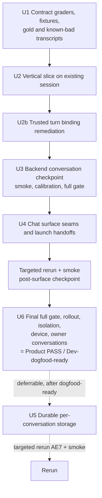
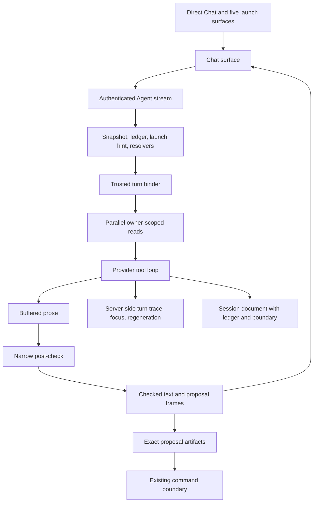

# feat: Reset Ruphus around natural conversation

## Summary

### September 8 owner-authorized acceptance amendment (controlling)

Engineering acceptance completed on product source `f086e1c`; see
`docs/data/ruphus-agent-v3/CONVERSATION-RESET-DECISION.md` for exact native,
seeded backend, visual and restoration evidence. Personal verdicts remain
pending; no personal product approval or production release is claimed.

This amendment supersedes conflicting physical-device, seeded-native-account,
and owner-verdict completion requirements below and in the origin document.
Engineering acceptance uses Tal's already-signed-in **Dev simulator account**,
not the seeded fake account. Do not use the phone. Preserve the existing login,
inventory, tasting records, and transcript; never uninstall, clear its container,
seed/reset this account, or add an authentication backdoor. Exercise native
journeys through supported UI and existing authenticated command seams. Capture
the original exact recipe before any test mutation, use the app's Undo command,
and verify canonical recipe values are restored. Do not manufacture brew or
tasting history, physical brew completion, or Fellow success.

Native engineering journeys cover direct Chat/typing, contextual entry, coffee
and method correction, an earned proposal, Brew once and return to the retained
card, natural-language permanent-save recovery, explicit save and Undo, relaunch
restoration, and New chat/Continue without deleting prior history. Use the
account's actual available records; fixture-only history/outage/age cases remain
seeded backend or rendered-harness evidence, never invented native evidence.

Keep seeded live backend evaluations and rendered harness results as separate
evidence categories. The unchanged final backend quality gate plus verified
native Dev journeys and environment isolation establish **Engineering PASS**.
R29 personal unscripted verdicts may remain pending and must not block remaining
engineering work or Engineering PASS. Do not label them passed or claim personal
product approval. Any newly observed reproducible engineering defect still
requires a fix and proportionate regression proof. Physical-device acceptance
is deferred by owner direction, not failed. Production remains out of scope.

The owner increased the cumulative testing ceiling from $45 to **$55 total**;
retain all existing spend and diagnostics. This is not a new $55 allowance.

Make Professor Ruphus a warm, experienced coffee friend in a natural multi-turn mobile conversation, and prove it with staged real-provider conversations, a blind calibrated judge, and unscripted owner conversations on a physical Dev device before touching heavier session or rollout architecture. Build the smallest vertical slice on the existing session model: remove the launch cage, deterministically bind high-confidence coffee references before model reasoning, give the model a compact rotation and setup snapshot and barista-language evidence with a bounded ledger, infer method by priority order, enforce a deliberately narrow runtime contract, and delete the user-visible failure seams. The first full gate is a backend conversation checkpoint, not a product claim. Product PASS (Dev-dogfood-ready) requires the Chat surface work, the explicit native proposal/action loop for the authorized Dev owner, a final full gate on the final code, proven environment identity, and the product owner's unscripted device conversations logged with zero bad verdicts and every fixture they produce passed at full cadence on the final code. Durable multi-session storage is deferrable until after that and never blocks proving or dogfooding. Everything stays behind the existing Dev-only gates; production is out of scope.

---

## Problem Frame

The current Agent path can stream typed artifacts and protect recipe mutations, but it still requires a pinned coffee, method, and slot before a turn can use Agent v3 (`src/lib/ruphus/contracts.js:96-101`), stores one rolling "active" thread, feeds the model record-shaped evidence, rewrites its prose mid-stream, emits cards for reads and gaps, and dumps the proposed recipe as JSON inside the proposal card. Every contextual launch surface injects a method and slot key today. The work-in-progress adds conversation replay, inventory listing, cross-coffee reads, plain-text rendering, preview routing, and native-build preflight, but it does not satisfy the conversation contract and has not been accepted as a tested baseline. Injected-provider tests have passed while real conversations failed; that gap is the core problem this plan closes, without replacing it with a Ruphus that sounds like a checklist.

---

## Requirements

This plan carries all requirements from the origin document (R1-R29), the Conversation Contract C1-C10 (with C6 split into C6a hard tokens and C6b context-sensitive phrases), runtime enforcement RT1-RT5, method priority M1-M6 including M1b, evidence model E1-E6, session behavior S1-S4, feel rubric G1-G8, catastrophic failures CF1-CF6, and acceptance fixtures AE1-AE14. Groupings preserve origin IDs.

- R1-R4. One coherent conversation with a launch clue of `{ coffeeRef?, surface, launchItem? }` (coffee-only for direct Chat, bean cards, and the unsaved tasting-wizard reveal; one temporary typed item hint for recipe, brew, and tasting-card surfaces, with a method required for a recipe and optional for a brew or tasting and never derived for a tasting from the coffee's recipes or profile), invisible mutable focus, age-based session boundaries (S1-S3), a new-chat boundary that clears the ledger and never deletes messages (S4), and resumable history.
- R5-R8. Automatic, parallel, owner-scoped retrieval (E1-E5) over a default 14-day history window that widens on request, older references, or corrections, with scoped absence and no unqualified absence claim over a bounded read; a trusted pre-model turn binder for high-confidence exact, ordinal, pronoun, and sole-alternative coffee references, with model-called `resolve_coffee` retained for fuzzy or unresolved language (E6); one named clarification only for genuine ambiguity; correction repair (C8).
- R9-R12. Method by priority order (M1, M1b, M2-M6) over recipe-slot identities (Aiden, V60 hot, V60 iced, Kalita hot, Kalita iced) with the mode rule (explicit user mode wins; M2-M5 may infer iced from the recent or only saved evidence; hot is only the final fallback and never overrides a sole or recent iced recipe); recorded evidence before questions with question limits (C3-C4); real back-and-forth; the coffee-friend voice (C1, C2, C5-C7).
- R13-R15. Earned, optional, card-only proposals (C9) with no recipe dump; explicit native Apply, Brew once, and Keep controls only when their existing command preconditions and authorized Dev mutation gate pass; unchanged exact-target and approval authority; unchanged safety, provenance, receipt, undo, and account-deletion boundaries.
- R16-R18. Staged real-provider evaluation gate with catastrophic and ordinary failure classes; exactly fourteen fixtures, eleven critical (AE1-AE10, AE14) and three supporting (AE11-AE13); polished text (C2, C6).
- R19-R21. Narrow runtime enforcement (RT1-RT5) with everything else graded in evaluation; outage degradation (E5); bounded ledger (E3).
- R22. Seven failure seams removed or replaced, including the proposal card's JSON dump.
- R23-R25. Direct-chat opening with truthful hydration states, photo handling, lifecycle captions within 1 second, and in-character retry.
- R26-R28. Fixture hygiene, non-printing secrets and redacted diagnostic retention, gold and known-bad transcripts for critical fixtures only, never shown to the scoring judge.
- R29. At least five unscripted owner conversations on the physical Dev device across at least three surfaces including at least one tasting surface, each logged with surface, date, failures, and a verdict of good, acceptable, or bad, recorded as their own evidence category, with every failure becoming a fixture (AE15 onward). Product PASS requires zero bad verdicts and every appended fixture run at full cadence and passed on the final code; a bad verdict or an unpassed appended fixture returns the work to a smoke regardless of catastrophic classification.

**Origin actors:** A1 (Coffee user), A2 (Professor Ruphus), A3 (Coffee app)

**Origin flows:** F1 (open or return), F2 (diagnose through conversation), F3 (change coffee or subject), F4 (move from discussion to recipe change), F5 (continue when evidence is unavailable)

---

## Scope Boundaries

### Deferred for later

- Additional Fellow, Aiden execution, or mutation capabilities beyond those already supported safely.
- Voice conversation, proactive background coaching, and expanded photo understanding beyond the existing description path.
- Final S1-S3 threshold tuning after the initial defaults (6 hours, 7 days) are exercised in focused UX dogfood.
- Durable per-conversation storage (U5) and any recent-conversations list, search, or rename. One Continue affordance is the whole disclosure surface for this reset. U5 may land after Dev-dogfood-ready and never blocks proving or dogfooding.
- Production-scale archive or pruning policy for user-visible chat history; this reset bounds each session and preserves account deletion but does not apply diagnostic-trace retention to conversations.
- Model or provider changes, considered only after the evaluation gate isolates remaining failures to model behavior.
- Production rollout, production data changes, and broad user enablement.

### Outside this product's identity

- Autonomous or unattended recipe mutation without explicit user approval.
- Isolated per-coffee bots that cannot hold one coherent conversation.
- A rigid troubleshooting questionnaire that asks for information Coffee already knows.
- A generic chatbot disconnected from authoritative Coffee records and actions.
- A proposal card as the mandatory output of every diagnosis.
- A Ruphus that satisfies graders by sounding like a form.
- Reproduction of or claims about Coach Max's private implementation.

### Deferred to Follow-Up Work

- Production Firebase rules deployment or production feature enablement: requires separate authorization after Dev evidence.
- General legacy-chat modernization and unrelated `ChatTab` cleanup: not required for the Agent reset.
- A new model comparison: run only if the same accepted fixtures isolate remaining failures to model behavior rather than missing context or contract.

---

## Context & Research

### 2026-08-31 Research Amendment

The first live smoke on commit `bec0506` exposed a contract-level gap that prompt tuning cannot close: after Ruphus had focused El Vergel, the user said "Now the other Colombia," the deterministic resolver could identify the sole alternative, but the model skipped the resolver and asked which Colombian coffee was meant. Current consumer-agent patterns reinforce the same correction: trusted app context is resolved before model reasoning, consequential actions remain explicit native confirmations, and clarifications are reserved for genuinely ambiguous choices. This amendment therefore replaces the model-only reference decision with a narrow trusted turn binder and completes the existing native proposal/action loop. It does not authorize a general text parser, autonomous mutation, new hardware behavior, production rollout, or broader operating-system agency.

### Relevant Code and Patterns

- `api/ruphus-agent.js` is the authenticated, allowlisted streaming boundary. It already injects the authenticated UID and constructs owner-scoped readers.
- `api/_lib/ruphusContext.js` currently requires a coffee ID and preloads one coffee's record-shaped evidence. This is the launch-cage seam and the place the rotation snapshot and ledger replace it.
- `src/lib/ruphus/contracts.js:96-101` (`validateContextRef`) requires `coffeeId`, `method`, and `slotKey` on every Agent context. This is the launch cage at the contract level and becomes the `launchContext` validator.
- The five contextual launch producers all build that caged shape today: the Rotation bean card at `src/tabs/RotationTab.jsx:694` (`{ coffeeId, coffeeName, method, mode, slotKey }`, starter "What should I change for this coffee?"); the Kalita/V60 recipe modal at `src/components/HandBrewModal.jsx:604` (`method`, `slotKey`, `revisionId`); the Aiden recipe modal at `src/components/AidenModal.jsx:481` (`method: 'aiden'`, `slotKey: 'aiden'`, `revisionId`); the tasting wizard reveal at `src/components/tasting/TastingWizard.jsx:509` (`method`, `mode`, `slotKey`, `tastingEvidence`); and the tasting detail card at `src/components/TastingDetailCard.jsx:84-99` (`method`, `mode`, `slotKey`, `userText`, `tastingEvidence`). The app-level handoff is `openRuphus` in `src/App.jsx:108-112`, which requires `coffeeId`; `ChatTab` consumes it at `src/tabs/ChatTab.jsx:1113-1131`, spreading the whole object into the Agent context (`:1120`). Pass-throughs sit at `src/tabs/TastingTab.jsx:249` and `src/tabs/RotationTab.jsx:577`, `:605`, `:705`.
- The browser harness `src/components/chat/RuphusBrowserHarness.jsx:28-29` (lazy-mounted from `src/main.jsx:411`, driven by `scripts/verify-ruphus-agent-ui.mjs:44-46`) also sets `method` and `slotKey` for its two entry buttons; it must speak the new shape and gain a direct-entry and delayed-hydration path.
- `api/_lib/ruphusTools.js` separates read/proposal capabilities from forbidden mutation tools. Confirmed seams: `read_coffee` returns an automatic `coffee_context` artifact (`api/_lib/ruphusTools.js:101`); a missing recipe returns a `data_gap` artifact titled "No executable recipe found" with a "Choose a brew method" option (`api/_lib/ruphusTools.js:106`, `:113`); tool descriptions speak in "canonical IDs" (`:131-132`).
- `api/_lib/ruphusOrchestrator.js` owns the bounded provider/tool loop, lifecycle frames, usage accounting, forbidden-tool rejection, and the authority-claim prose filter that rewrites model text mid-stream; it forwards provider text as `text_delta` frames as it arrives (`api/_lib/ruphusOrchestrator.js:34`). The filter is replaced by buffered delivery with a narrow post-check, not tuned.
- `api/_lib/ruphusPrompt.js` still grounds advice in "the selected coffee's canonical recipe" (`:13`). It becomes a persona-plus-exemplars prompt; prompt rules alone cannot guarantee resolution, method inference, or session behavior.
- `src/lib/ruphus/contracts.js` is the browser/server-neutral contract seam for lifecycle, context, artifacts, slots, and tool-call bounds. `coffee_context` and `data_gap` are registered artifact types (`src/lib/ruphus/contracts.js:15`, `src/lib/ruphus/artifactRegistry.js:6`, `:15`) with renderers `src/components/chat/artifacts/CoffeeContextCard.jsx` and `DataGapCard.jsx`; all are retired here.
- `src/components/chat/artifacts/RecipeProposalCard.jsx:3` is the exact home of both remaining card seams: the `ArtifactAction` labels fall back to "Available soon" whenever actions are unavailable, and an "All controls" `<details>` renders `<pre>{JSON.stringify(after, null, 2)}</pre>`, exposing internal keys (`coffeeGrams`, `waterTemp.celsius`, `grindSize.setting`, `ratio`). Both are deleted, not hidden.
- `src/tabs/ChatTab.jsx` derives focus from `coffee_context` frames (`src/tabs/ChatTab.jsx:870-873`) and renders "Continue in standard chat" recovery (`src/tabs/ChatTab.jsx:1321-1322`). Both are removed. Its intro is a fixed string (`INTRO_TEXT`, `:50`) seeded into message state (`introMessage()` `:58`, `:400`), excluded from persistence by content match (`:68`), and shown as an intro card while `isIntroState` (`:1265`, `:1325-1326`); the rotation-aware opening replaces this without ever entering the persisted thread before the user sends.
- `src/hooks/useAppData.js:30` owns a `loaded` flag (exported at `:472`) that can be satisfied by the local cache before the live snapshot arrives (`:128`). `src/main.jsx:269` destructures it as `dataLoaded` and gates the shell on it (`:340`, `:367`), but neither `App` nor `ChatTab` receives it; the direct opening therefore has no way to know whether the rotation it is about to describe is loaded.
- `src/components/chat/RuphusLifecycleCaption.jsx` maps a frame name or tool to a caption; it becomes the consumer of the fixed caption map keyed by read category.
- `src/hooks/useChatSession.js` and `src/lib/ruphus/session.js` provide local-first hydration for one `chatSessions/active` document. The vertical slice keeps this model; U5 later gives each conversation its own document.
- `src/lib/ruphus/legacyRecipeResolver.js` provides exact recipe-slot resolution and remains the proposal/action source of truth.
- `src/lib/gemini.js` provides the existing chat image-description path reused for R24.
- `scripts/ruphus-agent-endpoint.test.mjs`, `scripts/ruphus-thread-persistence.test.mjs`, `scripts/ruphus-runtime-contracts.test.mjs`, `scripts/ruphus-provider-contract.test.mjs`, `scripts/ruphus-stream-protocol.test.mjs`, `scripts/ruphus-artifact-ui.test.mjs`, and `scripts/verify-ruphus-agent-ui.mjs` are the direct existing test seams to extend.
- The existing `scripts/ruphus-eval/` model tournament is not the product gate; its frozen manifest stays untouched. Its provider-injection and non-printing key patterns are reused by the conversation runner.

### Institutional Learnings

- `docs/solutions/integration-issues/capgo-ota-overrides-local-builds-and-native-deploy-path.md`: native Dev evidence is invalid if Capgo replaces the bundled app; the installed Dev app must prove auto-update is disabled and the expected bundle is running.
- `docs/solutions/database-issues/firestore-settings-phase2-write-patterns.md`: never call an OTA or deployment live based only on CLI output; device evidence is a separate gate.
- `docs/solutions/runtime-errors/closure-rename-missed-body-references.md`: build success does not prove deferred React callbacks; exercise the actual chat, session, retry, and focus-change interactions.
- This branch's own history: endpoint, contract, and rendered-UI tests passed while dogfood conversations failed. Injected providers cannot stand in for the model, and scripted click-throughs cannot stand in for the owner talking to Ruphus.

### Current Worktree Baseline

- The worktree contains uncommitted candidate changes across Agent context, tools, prompt, provider, native API routing, rendering, and iOS build preflight.
- Execution preserves those changes, characterizes them against this plan, and keeps or revises them based on behavior. Their presence is not proof that any unit below is complete.
- This planning pass runs no tests and makes no runtime, simulator, provider, deployment, or production claim.

---

## Key Technical Decisions

- **Conversation proof first, architecture second:** The first full live gate (U3) runs on the existing single-session model and is a backend conversation checkpoint only. The Chat surface (U4) follows, then a targeted rerun and one final full gate on the final code, then environment and owner evidence (U6). Durable storage (U5) is deferrable past that and never masks or blocks a conversation result.
- **Launch cage removed at the contract level:** `launchContext` is `{ coffeeRef?, surface, launchItem? }`. Direct Chat, the bean card, and the unsaved tasting-wizard reveal pass a coffee reference and surface only; recipe, brew, and tasting-card surfaces may add one typed `launchItem` `{ kind, ref, method? }`, where `method` is a recipe-slot identity, required for kind recipe, optional for brew and tasting, and present on a tasting only when that tasting or its linked brew attempt recorded one (never derived from the coffee's recipes or profile). There is no `slotKey` field and no bare `method` anywhere in launch context; the validator rejects both, and reads cannot default a method or slot from launch context.
- **M1b is a hint, not a tier the surface owns:** `methodResolver` binds a `launchItem` method, when the item carries one, to the launch `coffeeRef` for the first topic only, states it once in passing, discards it on any coffee change or method correction, never transfers it to another coffee, and never treats it as write authority. A tasting item without a recorded method contributes the tasting as evidence but no method; inference continues at M2.
- **Compact rotation and setup snapshot instead of preloaded records:** Every turn carries the E1 snapshot (one setup line with default method, grinder, and units, then jars 1-3 with their saved recipe slots in display language, and counts) with opaque per-coffee reference keys mapped server-side to IDs. There is no separate profile-setup tool. The model never needs to speak an ID; a C6a token grader catches any that leak.
- **Domain-language tool results and a bounded ledger:** Tool results render as E2 barista summaries (structured fields retained for deterministic code); the E3 ledger is a field on the session document, replayed into later turns, cleared on new chat, rebuilt on stale resumption, and its named coffees are the pronoun universe.
- **Parallel reads with a budget:** One composite read fans out recipe, recent brews, and tastings concurrently over a default 14-day history window (the same window as M2) that widens when the user asks for or refers to older history or a correction implies it; the first turn's read includes a launch item by its ref regardless of the window; at most 6 reads and 2 tool rounds per turn; per-round timeout feeds E5 degradation. Empty or windowed results state their scope in domain language, and an unqualified absence claim over a bounded read is an ordinary evidence-scope failure.
- **Trusted turn binding before model reasoning:** Before each provider call, a narrow deterministic binder runs the existing owner-scoped `referenceResolver` against the complete allowed coffee inventory, bounded ledger, launch clue, and current user turn. It binds only high-confidence exact names, unique jar ordinals, established pronouns, sequence references, and a sole valid "other" alternative. A unique result becomes locked turn context with an opaque `coffeeRef`, is appended to the sanitized focus ledger, retires an incompatible launch hint, and must not be re-clarified by the model. A genuinely ambiguous result supplies bounded named candidates for one clarification. No confident result leaves the turn unbound and preserves model-called `resolve_coffee({ reference })` as the fuzzy/unknown fallback. The binder never infers a recipe mutation, never sees another owner's data, never rewrites model prose, and never performs broad intent classification. `methodResolver` implements M1-M6 from the locked coffee, launch hint, ledger evidence, recipes, brews, and setup line over recipe-slot identities (Aiden, V60 hot, V60 iced, Kalita hot, Kalita iced), returning `{ slot, displayName, tier }` or `{ ask: [candidates with display names] }`; an explicit user mode wins, M2-M5 may infer iced from the recent or only saved evidence, hot is only the final fallback when mode remains unspecified and the evidence does not distinguish it and never overrides a sole or recent iced recipe, and prose says "iced V60", never an internal slot key.
- **One shared contract module, two enforcement layers:** `src/lib/ruphus/conversationContract.js` holds the C1-C10 graders as pure functions used by tests, the conversation runner, and the runtime post-check. The runtime post-check applies only the RT2 triggers; everything else is evaluation. No in-stream prose mutation anywhere.
- **Buffer, then deliver:** The orchestrator buffers provider text until the post-check passes and emits `text_delta` frames only for checked text; the lifecycle caption covers the wait (visible within 1 second). One regeneration on an RT2 trigger; on a second failure, length or markup is delivered as is, and leak, JSON, or false-authority replies are replaced by one short in-character line. Every regeneration is written to the server-side trace and counts as an ordinary run failure.
- **Persona prompt, not a checklist:** `ruphusPrompt.js` is a persona, three short exemplar exchanges, and the essential hard rules (one question at most, do not ask for what the app knows, acknowledge a correction in one sentence, name the coffee when you switch, propose only after agreement, no markup, no machine words) plus the snapshot, ledger, and resolver blocks. It never contains graders, templates, from/to/delta phrasing rules, or token-echo instructions.
- **Invisible focus machinery:** Focus is derived server-side from successful reads and recorded in the server-side turn trace only. No streamed focus frame, no focus card, no persistent context header (`RuphusContextHeader` is retired), no client-derived focus from artifacts.
- **Proposals are earned, card-only, and explicitly actionable:** The proposal tool is callable only after the orchestrator has seen a substantive diagnosis reply and a user turn that asks for or agrees to a change; proposal-shaped prose is an RT2 trigger and CF6 in evaluation. The card shows only from → to rows in the user's units; the "All controls" JSON block is deleted. For the authorized Dev owner, the card exposes the existing app-owned Apply, Brew once, and Keep commands only when their exact proposal, slot, freshness, entitlement, and mutation-rollout preconditions pass. The model cannot invoke those commands, every action requires a user tap, stale or uncertain states disable duplicate action, and canonical receipts/recovery remain the truth.
- **Truthful direct opening:** `dataLoaded` flows from `useAppData` through `main.jsx` and `App` to `ChatTab`; `opening.js` returns the neutral greeting until it is true, then a rotation-aware line whose template is chosen by meaningful state, and never a rotation claim before data is loaded. The opening is recomputed per fresh open or new chat and is not persisted until the user sends.
- **In-character recovery:** Signed-in Agent failures show "Professor Ruphus lost the thread. Try again." Only demo mode uses the legacy route. No mode language anywhere.
- **New chat is a boundary, never a deletion:** U4 marks a boundary index on the existing active document; messages before it stay stored and reachable behind the one Continue affordance; the ledger clears. U5 later gives each conversation its own durable document behind the same affordance.
- **Blind, calibrated judge:** The judge sees the visible transcript, a one-line intent, and the fixture fact sheet only; never gold or known-bad transcripts. It must score gold ≥ 4.5 and known-bad ≤ 2.5 before any scoring counts, and the candidate must win a blind pairwise comparison against the known-bad transcript.
- **Staged cadence, one final full gate:** Smoke (11 runs, deterministic only) after any conversation change; one calibration run (36 runs) that never counts as PASS; full gates (64 runs) only after two consecutive clean smokes on the same commit (a smoke is clean with zero catastrophic failures and at most one of its 11 runs carrying an ordinary failure); targeted reruns after UI or session units; exactly one final full gate on the final code.
- **Evidence categories remain separate:** Source/tests, live-provider gate, rendered harness, simulator, physical device scripted, owner unscripted conversations, preview deployment, and production are reported independently and never inferred from one another.

---

## Open Questions

### Resolved During Planning

- **How can direct Chat use Agent v3 without a selected coffee?** Coffee is optional in the contract; the rotation and setup snapshot plus on-demand reads replace preloading.
- **How can a recipe screen help the first turn without caging it?** A typed `launchItem` hint (M1b) bound to the launch coffee, spoken once, discarded on any coffee change or method correction.
- **How can focus change without weakening action safety?** Focus lives in server-side turn state derived from reads and is never an authority input; proposals capture immutable exact targets.
- **How does a stale session stay resumable before the repository exists?** A boundary index on the active document plus one Continue affordance; new chat never deletes; multi-document storage follows in U5 whenever it lands.
- **Should the authority-claim filter be tuned?** No. Prose mutation is removed; buffered delivery with a narrow post-check and one regeneration replaces it.
- **How is enforcement kept from making Ruphus robotic?** Runtime checks only the RT2 triggers; the prompt is persona plus exemplars; C3-C5, C7, C8, and C10 are evaluation rules; regeneration is counted as a failure rather than relied on.
- **Where do the "Available soon" and JSON-disclosure seams live?** Both at `src/components/chat/artifacts/RecipeProposalCard.jsx:3`; both are deleted in U4.
- **Should the large model-evaluation tournament be expanded?** No. The conversation gate is a separate small runner; the tournament manifest stays frozen.
- **Is a separate conversation-eval test layer needed?** No. The runner's injected mode is its own plumbing self-test; the contract module has its own unit test.
- **Should current uncommitted fixes be discarded?** No. Treat them as candidate implementation and accept them only where the fixtures and unit tests prove the intended behavior.

### Deferred to Implementation

- **Grader and judge calibration:** The calibration run may reveal that a threshold, budget, or judge prompt is mis-set. Recalibration is recorded in the decision record; thresholds may not be lowered silently.
- **Fuzzy-match confidence values:** Tune from the fixture corpus while keeping exact and unique jar matches deterministic.
- **Caption map wording:** Final in-character captions per read category, validated by the C6 graders.
- **Opening template wording per state:** Final wording of the neutral, rotation-aware, and empty-rotation templates, validated by the C6 graders and the ≤ 40-word cap.
- **Current WIP reconciliation:** Decide file-by-file which uncommitted candidate changes survive after characterization exposes their behavior.

---

## High-Level Technical Design

> *This illustrates the intended approach and is directional guidance for review, not implementation specification.*

```mermaid
flowchart TB
    Entry[Direct Chat, or launch with coffee ref<br/>and optional typed item hint] --> Turn[Bounded Agent turn]
    Snapshot[Rotation and setup snapshot<br/>compact, ref keys] --> Turn
    Ledger[Evidence ledger<br/>bounded, replayed] --> Turn
    Turn --> Resolve[resolve_coffee tool and<br/>method resolver in trusted code]
    Resolve --> Reads[Parallel owner-scoped reads<br/>barista-language results]
    Reads --> Ledger
    Reads --> Buffer[Provider prose, buffered]
    Buffer --> Check[Narrow runtime post-check<br/>RT2 triggers only]
    Check --> Prose[Checked text_delta frames]
    Prose --> Card[Optional earned proposal card]
    Card --> Target[Immutable action target]
    Reads -. timeout .-> Degrade[Plain-language "couldn't check"]
    Degrade --> Buffer
```

The base turn carries bounded recent conversation, the rotation and setup snapshot, the ledger, and the launch hint when present. Detailed recipe, brew, and tasting evidence is read in parallel on demand and summarized in domain language. Focus follows successful reads and is spoken naturally. Prose is delivered only after the narrow post-check. Proposals bind their original exact target regardless of later conversation changes.

---

## Conversation Contract Enforcement

| Rule | Deterministic grader | Where enforced |
|------|----------------------|----------------|
| C1 length caps | Word count per reply by reply kind; the 160-word hard cap separately | Tests, runner; runtime post-check for the hard cap only (RT2a) |
| C2 shape | Markup, list, code fence, emoji, identifier, paragraph and sentence counts | Tests, runner; runtime post-check for markup and code fences only (RT2b) |
| C3 questions | Question-mark count, question-only detection, consecutive question-only, asks-for-held-data (compares question topic against ledger fields, exempting a question that names the coffee's method candidates under M6 conditions) | Tests, runner |
| C4 value | Presence of a number, coffee-specific noun, or directive verb after the opening | Tests, runner |
| C5 numbers | Unit and precision checks; a recommended change carries a direction and size in any natural wording (from/to/delta is one accepted pattern, never required) | Tests, runner |
| C6a hard machine tokens | Ref-key and hash patterns, IDs, JSON structures, code fences, tool names, internal field names, "as an AI" | Tests, runner, runtime post-check (RT2d, RT2e) |
| C6b context-sensitive phrases | Phrase list with a versioned natural-use allowlist ("recorded brew", "tasting session", "your grinder and kettle"); flags only uses outside the allowlist | Tests, runner (never runtime) |
| C7 tone | Exclamation count, apology count, banned praise and disclaimer phrases; engagement with the user's specifics is judged under G5, not token-echo counted | Tests, runner; judge covers warmth and listening |
| C8 correction repair | After a correction turn: acknowledgment present, prior wrong claim absent, ≤ 1 apology; silent use of the new fact is classified CF3 | Tests, runner |
| C9 proposal timing | Proposal frame ordering versus diagnosis reply, user agreement, unanswered question; proposal-shaped prose classified CF6 | Orchestrator gate, tests, runner; runtime post-check for proposal-shaped prose (RT2c) |
| C10 focus acknowledgment | Resolved coffee named at least once after a focus change (never exact-counted); no focus card, header, or frame | Tests, runner, rendered harness |
| Evidence scope (E4-E5) | An absence claim about a recipe, brew, or tasting is qualified by the window actually read; an unqualified absence claim where the fixture data holds the item is ordinary | Tests, runner |
| False authority claim | Statement that a change was made, saved, or sent with no approved action in the trace | Runtime post-check (RT2f), tests, runner |

Runtime behavior (RT1-RT5): provider text is buffered and never emitted as `text_delta` until the post-check passes; only RT2 triggers cause one regeneration with a short corrective instruction; on a second failure, length or markup is delivered as is (client Markdown stripping stays a fallback) and leak, JSON, or false-authority replies are replaced with one short in-character line; every regeneration or replacement is written to the server-side trace and counts as an ordinary run failure. Every grader labels its output as catastrophic (CF1-CF6) or ordinary so the runner's pass semantics are computed from one classification.

---

## Implementation Units



- U1. **Freeze the contract, fixtures, gold and known-bad transcripts**

**Goal:** Make C1-C10, RT2 triggers, and CF1-CF6 executable; freeze the Dev fixture manifest and the fourteen conversations; write gold and known-bad transcripts for the eleven critical fixtures; make the runner's injected mode the plumbing self-test, so every later unit is graded by the same code.

**Requirements:** R16-R19, R26, R28; AE1-AE14

**Dependencies:** None

**Files:**
- Create: `src/lib/ruphus/conversationContract.js`
- Create: `scripts/fixtures/ruphus-conversation/dev-account.json`
- Create: `scripts/fixtures/ruphus-conversation/cases.json`
- Create: `scripts/fixtures/ruphus-conversation/gold/AE01-aiden-jar1.md`, `AE02-el-virgil.md`, `AE03-method-infer.md`, `AE04-method-ask.md`, `AE05-watery-kalita.md`, `AE06-false-no-tastings.md`, `AE07-stale-session.md`, `AE08-reader-outage.md`, `AE09-proposal-timing.md`, `AE10-pronouns.md`, `AE14-launch-hint-vs-brew.md`
- Create: `scripts/fixtures/ruphus-conversation/known-bad/` with the same eleven file names
- Create: `scripts/ruphus-conversation-runner.mjs` (injected mode in U1; live mode and stages added in U3)
- Create/Test: `scripts/ruphus-conversation-contract.test.mjs`

**Approach:**
- Implement each contract rule as a pure grader over `{ reply, replyKind, priorReplies, userTurn, ledger, frames, trace }` returning structured violations, each labeled catastrophic (CF1-CF6) or ordinary; export the C6a token list, the C6b phrase list with its versioned allowlist, the RT2 trigger predicate (the exact subset the runtime uses), the evidence-scope grader (an absence claim about a recipe, brew, or tasting must be qualified by the window actually read; an unqualified absence claim where the fixture data holds the item is ordinary), and the caption and opening validators.
- Define the fixture account manifest with a content hash: coffees, jars 1-3, two Colombians including El Vergel, a coffee with Kalita and V60 recipes both brewed within 14 days, a coffee with one recipe, a coffee with a saved Kalita recipe whose most recent recorded brew within 14 days is V60 (AE14), a Kalita 155 attempt with drawdown/dose/grind, a tasting older than the default 14-day window, and a setup line (default method, grinder, units) drawn from the allowlisted profile. Dates are stored as offsets from run time. A fact-sheet generator renders the manifest as the judge's fact sheet.
- Define each case as scripted user turns with branch-aware answers, the launch context in the exact `{ coffeeRef?, surface, launchItem? }` shape, injected read outcomes for deterministic runs (including a timeout for AE8), expected focus per turn with each reference marked unambiguous or ambiguous (for CF1), allowed method tier, question allowance, proposal allowance, and prohibited outcomes.
- Write one gold and one known-bad transcript per critical fixture in Ruphus's voice and in the observed failure shapes respectively; both are human and judge-calibration references, never assertion targets, and never shown to the scoring judge. Supporting fixtures get neither.
- The runner's injected mode plays every case through the real orchestrator and tool contracts with an injected provider and prints a "plumbing only" label; there is no separate conversation-eval test layer.
- Characterize first: the current orchestrator must fail the known dogfood shapes (Aiden anchoring, El Virgil refusal, false no-tastings claim, exposed formatting, system language).

**Patterns to follow:**
- Provider injection and multi-round tool continuation in `scripts/ruphus-provider-contract.test.mjs`.
- Endpoint reader/provider fixtures in `scripts/ruphus-agent-endpoint.test.mjs`.

**Test scenarios:**
- Each grader has positive and negative cases, including a 161-word reply, a 150-word reply that is not an RT2 trigger, two consecutive question-only replies, a question asking for the recorded dose (fails C3) and a question naming two M6 method candidates (passes C3), a leaked ref key (C6a, CF5), "no record of that" (C6b flagged) versus "your recorded brew" (allowed), a JSON proposal in prose (CF6), a silent correction (CF3), a re-argued correction (ordinary), a proposal in a first reply, an unqualified "no tastings" reply over a 14-day read when the fixture holds an older tasting (evidence-scope, ordinary) versus "nothing in the last two weeks" (passes), and a reply naming the switched coffee twice (passes C10).
- The RT2 predicate returns true only for the six triggers and false for a C6b phrase, a two-question reply, and a missing coffee name.
- The fixture manifest hash check fails on any edit without a version bump.
- Every AE1-AE14 case is present, branch-aware answers resolve, and the case schema rejects a launch context with `slotKey`, a bare `method`, a `launchItem` without a typed `kind`, or a recipe `launchItem` without a method, and accepts a tasting `launchItem` without one.
- Every gold transcript passes all deterministic graders; every known-bad transcript trips at least the violation it was written to show.
- Characterization: the current implementation fails AE1, AE2, AE6, AE14, and the C2/C6a checks.

**Verification:**
- The contract module and corpus distinguish wrong identity, unnecessary or held-data questions, unsupported claims, style defects, leaked internals, and premature proposals, and label each as catastrophic or ordinary.
- Every origin fixture maps to at least one executable case; the injected runner labels its output as plumbing only.

- U2. **Build the smallest vertical slice on the existing session model**

**Goal:** Remove the launch cage, give the model the evidence model, infer method by priority including the M1b hint, enforce the narrow runtime contract with buffered delivery, and delete the server-side seams, all on the current `chatSessions/active` document.

**Requirements:** R1-R2, R4-R15, R19-R22; E1-E6; RT1-RT5; S4; F2-F5; AE1-AE6, AE8-AE11, AE14; the conversational turns of AE7 and AE12

**Dependencies:** U1

**Files:**
- Modify: `src/lib/ruphus/contracts.js`
- Modify: `src/lib/ruphus/artifactRegistry.js`
- Create: `src/lib/ruphus/referenceResolver.js`
- Create: `src/lib/ruphus/methodResolver.js`
- Create: `api/_lib/ruphusEvidence.js`
- Modify: `api/_lib/ruphusContext.js`
- Modify: `api/_lib/ruphusTools.js`
- Modify: `api/_lib/ruphusPrompt.js`
- Modify: `api/_lib/ruphusOrchestrator.js`
- Modify: `api/_lib/ruphusProviders/openai.js`
- Modify: `api/ruphus-agent.js`
- Modify: `src/lib/ruphus/session.js`
- Modify: `src/lib/ruphus/streamAgent.js`
- Test: `scripts/ruphus-reference-resolution.test.mjs`
- Test: `scripts/ruphus-method-resolution.test.mjs`
- Test: `scripts/ruphus-evidence.test.mjs`
- Test: `scripts/ruphus-agent-endpoint.test.mjs`
- Test: `scripts/ruphus-runtime-contracts.test.mjs`
- Test: `scripts/ruphus-provider-contract.test.mjs`
- Test: `scripts/ruphus-stream-protocol.test.mjs`
- Self-test: `scripts/ruphus-conversation-runner.mjs --mode=injected`

**Approach:**
- Contract: `validateContextRef` (`contracts.js:96-101`) becomes the `launchContext` validator for `{ coffeeRef?, surface, launchItem? }`: `surface` is required from a fixed set (direct, bean_card, recipe_kalita_v60, recipe_aiden, tasting_card, tasting_wizard); `launchItem` is optional and must be `{ kind: 'recipe' | 'brew' | 'tasting', ref, method? }` with `method` (a recipe-slot identity) required for kind recipe and optional for brew and tasting; `slotKey`, a bare `method`, and any recipe identity outside a typed `launchItem` are rejected. Add `ledger`, `rotationSnapshot`, and boundary shapes with byte caps. Retire `coffee_context` and `data_gap` artifact types (reject on emit, tolerate on read of old history). Legacy caged launches are rejected from this unit on; the in-app producers are converted in U4, and contextual in-app launches are not exercised between the two.
- Evidence (`ruphusEvidence.js`): build the E1 snapshot from the owner's coffees with opaque ref keys, each coffee's saved recipe slots in display language, and the setup line (default method, grinder, units from the existing allowlist, which excludes contact, subscription, consent, token, and integration fields); render E2 summaries for recipe, brews, and tastings in the user's units and grinder terms, with empty or windowed results stating their scope ("no tastings in the last two weeks"); implement the E3 ledger with eviction, the window each read covered, the "unavailable" entry kind, and the named-coffee list for pronouns; provide a composite parallel read with per-read timeouts and the E4 budget over a default 14-day window that widens when the user asks for or refers to older history or a correction implies it, and that includes a launch item by its ref on the first turn regardless of the window.
- Tools: `resolve_coffee({ reference })` (model-called fallback after trusted turn binding; deterministic matching inside; reuses the existing inventory listing when the snapshot is insufficient), `read_coffee_evidence` (composite, parallel), `read_recipe` (explicit recipe slot from the resolver only), and the existing `propose_recipe_change`. No `search_coffees` and no `read_profile_setup`. The existing `read_coffee` is replaced by `read_coffee_evidence`, and no read returns an artifact; a missing recipe returns a domain-language "has no Kalita recipe; has an iced V60 and Aiden" result, never a card. Tool descriptions use coffee language.
- Resolvers: `referenceResolver` handles exact refs, unique jar ordinals, normalized name/roaster/origin tokens, bounded close spelling, and pronouns from the ledger's named coffees; it returns one high-confidence match or a bounded named candidate set. U2b invokes it through the narrow trusted turn binder before the provider for supported high-confidence discourse forms, while the `resolve_coffee` tool remains the fallback for fuzzy or unresolved language. `methodResolver` implements M1, M1b, M2-M6 over the launch hint, ledger, recipes, brews, and setup line using recipe-slot identities and the mode rule (explicit user mode wins; M2-M5 may infer iced from the recent or only saved evidence; hot is only the final fallback and never overrides a sole or recent iced recipe), returning the slot plus its display name; the M1b hint applies only when the launch item carries a method, is bound to the launch `coffeeRef`, stated once, dropped on any coffee change or method correction, and never carried to another coffee; a tasting item without a recorded method yields no M1b method and inference continues at M2, never deriving a method from the coffee's recipes or profile.
- Prompt: persona, three short exemplar exchanges, the essential hard rules, and the snapshot, ledger, and resolver results as separate blocks. Remove "canonical" and "selected coffee" language. No graders, checklists, templates, from/to/delta rules, or token-echo instructions.
- Orchestrator: remove the authority-claim prose filter; buffer provider text and emit `text_delta` only after the RT2 post-check passes; one regeneration on a trigger, RT3 second-failure handling, RT5 trace recording; gate the proposal tool on C9 state; handle parallel tool calls in one round; keep unknown/forbidden-tool fail-closed behavior, usage attribution, and truthful interrupted accounting; record focus changes in the server-side turn trace only, with no streamed frame.
- Provider: support multiple tool calls per round and continuation; keep storage disabled and retries explicit.
- Session: store the ledger, last-activity timestamp, and boundary index on the existing active document; new chat advances the boundary and clears the ledger without deleting any message.

**Patterns to follow:**
- Owner injection and forged-owner rejection in `api/_lib/ruphusContext.js` and `api/_lib/ruphusTools.js`.
- Recipe-slot authority in `src/lib/ruphus/legacyRecipeResolver.js`.
- Evidence field allowlists and byte caps in `api/_lib/ruphusContext.js`.
- Multi-round Responses continuation in `api/_lib/ruphusProviders/openai.js`.
- Frame ordering in `src/lib/ruphus/streamAgent.js:6-10` (unchanged frame types; `text_delta` now arrives after the check).

**Test scenarios:**
- Covers AE1. A launch with `coffeeRef` for jar #3's coffee, surface `recipe_aiden`, and a recipe `launchItem` (Aiden) plus "jar #1" resolves the unique active jar #1 record through `resolve_coffee`; the Aiden hint is discarded and not carried to jar #1; "what should I change" runs M1-M6 for the jar #1 coffee.
- Covers AE2. "El Virgil" resolves El Vergel uniquely despite a second Colombian; "the Colombian one" yields two named candidates.
- Covers AE3-AE4. One recipe resolves at M3 without asking; two recipe slots brewed within 14 days return an ask with both display names (and that question passes C3); a general question on that coffee resolves at M4.
- M2 agreement rule. Several 14-day records that all name the same method resolve that method at M2 regardless of recency; records naming two or more methods yield no M2 answer, so a general question continues to M4 and a change request or method-dependent recommendation continues to M6.
- Covers AE5 branch A. Recorded drawdown, dose, and grind produce a diagnosis reply with zero questions; branch B produces one discriminating question.
- Covers AE6. The first read covers 14 days, misses the older tasting, and its result states that two-week scope; after the user references the older tasting the widened read finds it, the ledger records both reads with their windows, and an unqualified "no tastings" reply over the first read is graded as an evidence-scope failure.
- Covers AE8. A tastings timeout yields an "unavailable" ledger entry and a reply that says it couldn't check; the next turn's read succeeds and the ledger updates.
- Covers AE9. The proposal tool is rejected before a diagnosis reply and user agreement, accepted after, and its artifact captures exact coffee, recipe slot, and source recipe; a later focus change does not alter it.
- Covers AE10. After A then B are named in the ledger, "that one" resolves to B and "the first one" to A through `resolve_coffee` with the ledger's named coffees; a pronoun with no named coffee returns no match rather than a guess.
- Covers AE11. No match returns an empty result and the reply contains no C6a token or unallowed C6b phrase.
- Covers AE14. A launch with surface `recipe_kalita_v60` and a Kalita recipe `launchItem` on a coffee whose latest brew is V60 resolves M1b Kalita for the first topic, stated once; the user's "I brewed it on the V60" resolves M1 V60, the hint is dropped, and it is absent from every later resolver result; a bare `method: 'kalita'` in launch context is rejected; the same hint never applies after a coffee change.
- Covers AE7 conversational turns. A session whose last activity is 14 days old, resumed through the endpoint, rebuilds the ledger before the first reply and does not treat the old troubleshooting as ongoing; a new chat advances the boundary and clears the ledger without deleting a message.
- Covers AE12 conversational turns. A starter-prompt turn with surface `direct` and no `coffeeRef` runs through the endpoint against the snapshot; the opening itself never reaches the provider.
- Tasting hint without a method. A tasting `launchItem` with no method on a coffee whose only recipe is Aiden yields no M1b method; the resolver continues at M2 and never derives Aiden from the recipe; the first turn's composite read still includes that tasting by ref when it is older than 14 days.
- Mode rule. A coffee whose only saved recipe is iced V60 resolves the iced V60 slot at M3 and hot never overrides it; an explicit "the hot one" wins; with no saved recipe, no brew, and a default method whose mode is unspecified, the hot slot is the final fallback; resolver output carries slot and display name, and prose says "iced V60", never an internal slot key.
- Snapshot and ledger byte caps hold with 20 coffees; the setup line is present and contains no sensitive profile field; ref keys never appear in prose (grader).
- Security: forged owner fields and cross-owner refs fail for every read.
- Error paths: unknown or mutation tool, exceeded loop, malformed arguments, or a false authority claim after regeneration all fail the turn truthfully with zero command dispatch and no prose mutation.
- Runtime enforcement: no `text_delta` frame is emitted before the post-check passes; each RT2 trigger (161 words, a code fence, proposal-shaped prose, a leaked ref key, a tool name, a false "I've saved that") triggers exactly one regeneration; a C6b phrase or a two-question reply does not; a second overlength failure is delivered and traced; a second leak failure is replaced by the in-character line and traced.
- Focus is present in the server-side trace and absent from the frame stream.

**Verification:**
- All U1 cases pass through the real orchestrator and tool contracts with the injected provider (plumbing proof, labeled as such).
- Tool traces show parallel reads within budget and retrieval preceding every claim about history.

- U2b. **Bind high-confidence coffee references before provider reasoning**

**Goal:** Close the live `AE10` failure without adding a broad natural-language framework: when Coffee can uniquely resolve the user's coffee reference, the provider receives that target as locked context before it chooses tools or prose.

**Requirements:** R5-R8, R11, R19; E3, E6; C3, C8, C10; AE1, AE2, AE10, AE14

**Dependencies:** U2

**Files:**
- Create: `api/_lib/ruphusTurnBinder.js`
- Modify: `api/_lib/ruphusContext.js`
- Modify: `api/_lib/ruphusPrompt.js`
- Modify: `api/_lib/ruphusTools.js`
- Modify: `api/ruphus-agent.js`
- Modify/Test: `scripts/ruphus-reference-resolution.test.mjs`
- Modify/Test: `scripts/ruphus-u2-runtime.test.mjs`
- Modify/Test: `scripts/ruphus-agent-endpoint.test.mjs`
- Modify/Test: `scripts/ruphus-conversation-contract.test.mjs`

**Approach:**
- Build one pure binder over `{ userText, coffees, ledger, launchContext }`. It recognizes only exact coffee names, unique jar ordinals, established `this`/`that`/`first`/`back` references, and a sole valid `other` alternative after excluding the current focus. It delegates candidate selection to the existing `referenceResolver`; it does not diagnose coffee, infer arbitrary intent, or fuzzy-match unsupported prose.
- Run it after owner-scoped context assembly and before the first provider dispatch. A unique result adds a safe enumerable `turnBinding: { status: 'locked', coffeeRef, coffeeName }`, non-enumerable server identity, sanitized `coffee_focus` ledger entry, and trace metadata. The prompt states that the locked coffee is authoritative for this turn and may not be re-clarified; reads use its opaque ref. A changed coffee retires the launch hint.
- A genuinely ambiguous result adds `turnBinding: { status: 'ambiguous', candidates: [{ coffeeRef, coffeeName }] }` and permits exactly one named clarification. No match omits the block and leaves `resolve_coffee` available to the model for fuzzy language such as a misspelled name.
- If the model still calls `resolve_coffee` for the locked reference, the tool returns the same target and cannot contradict it. Persist the resulting focus with the existing bounded ledger/session path.

**Test scenarios:**
- After El Vergel is the latest focus, `Now the other Colombia` locks the sole other Colombian coffee before the first provider call and the reply does not ask which Colombian coffee was meant.
- The next `that one` stays on the newly locked coffee; `back to the first one` returns to El Vergel.
- `the Colombian one` with two valid candidates and no established focus remains ambiguous and produces one named clarification.
- `El Virgil` remains an unbound fuzzy case for model-called `resolve_coffee` and still resolves through that tool.
- Cross-owner refs never enter the binder; provider-visible context contains opaque refs and allowed names only; the focus ledger remains within its existing authoritative byte/entry bounds.
- A coffee switch drops an incompatible launch hint and cannot change an already-issued proposal target.

**Verification:**
- The endpoint test captures the first provider request and proves the locked target is present before any tool call.
- The live AE10 transcript is rerun in the next authorized smoke and cannot pass by weakening the clarification or wrong-target graders.

- U3. **Run the staged real-provider gate to a backend conversation checkpoint**

**Goal:** Prove the conversation with the real model and real Dev reads before the Chat surface changes. The result is a backend conversation checkpoint, not Product PASS.

**Requirements:** R16-R19, R26-R28; AE1-AE14; G1-G8; CF1-CF6

**Dependencies:** U2b

**Files:**
- Create: `scripts/seed-ruphus-dev-fixture.mjs`
- Modify: `scripts/ruphus-conversation-runner.mjs` (live mode; `--stage=smoke|calibration|full|targeted`; catastrophic/ordinary pass semantics; smoke ledger keyed by commit)
- Create: `scripts/ruphus-conversation-judge.mjs`
- Create: `docs/data/ruphus-agent-v3/conversation-eval/README.md`
- Create: `docs/data/ruphus-agent-v3/CONVERSATION-RESET-DECISION.md`
- Modify: `package.json` (scripts only)

**Approach:**
- Seed the frozen manifest into the dedicated Dev fixture UID with dates rewritten relative to run time; verify the manifest hash before every run; never touch production.
- Run fixtures as full conversations through the real endpoint, provider, and Dev Firestore, with scripted branch-aware user turns and launch contexts exactly as the app would send them. Stages: smoke (one run of each of the 11 critical fixtures, deterministic graders only; clean when zero catastrophic failures occur and at most one of its 11 runs carries an ordinary failure); calibration (3 per critical, 1 per supporting, 36 runs, judge calibrated first, never PASS); full (5 per critical, 3 per supporting, 64 runs, judge and pairwise), allowed only after two consecutive clean smokes on the same commit; targeted (named fixtures at full cadence plus one smoke). A per-run cost cap and hard stop apply to every stage. AE7 and AE12 are graded by their conversational turns, with session age and the direct surface injected exactly as the app would send them; their opening, hydration, boundary, and Continue assertions are rendered-harness evidence deferred to the post-surface checkpoint (U4) and required for Product PASS (U6), never for this checkpoint.
- Apply the U1 graders to every reply and the tool trace; classify every violation as catastrophic (CF1-CF6) or ordinary; record latency per turn against the RT4 budgets (caption ≤ 1s; checked reply ≤ 8s p50 / 15s p90 including regeneration; read round ≤ 1.5s p90; any turn > 25s ordinary).
- Judge each transcript with a different model family using a frozen, versioned prompt: inputs are the visible transcript, the one-line fixture intent, and the generated fact sheet only. Before scoring counts, the judge scores the eleven gold and eleven known-bad transcripts blind in randomized order and must place every gold ≥ 4.5 and every known-bad ≤ 2.5; otherwise the judge version is fixed and recalibrated. For each critical run, a blind pairwise comparison against the known-bad transcript must be won by the candidate.
- Compute pass/fail per the origin semantics: a run is clean with zero catastrophic and zero ordinary failures; a critical fixture passes with ≥ 4/5 clean runs and ≥ 4/5 runs at judge mean ≥ 4.0, no dimension < 3, and a pairwise win; a supporting fixture passes with ≥ 2/3 clean runs; a full gate passes only with zero catastrophic failures across all 64 runs, every fixture passing, and ≥ 58/64 clean runs (counts for the fourteen-fixture set; fixtures appended under R29 extend them by the same 5-per-critical, 3-per-supporting formula). Raising a threshold is free; lowering one is a recorded decision.
- Inject keys and Dev auth non-printingly; redact UIDs, emails, and tokens from stored transcripts; keep raw prompts only as redacted diagnostics for 30 days; store run artifacts under `docs/data/ruphus-agent-v3/conversation-eval/<run-id>/` with the stage, commit, and classification of every failure.
- Record the decision with exact numbers and the label "Backend conversation checkpoint PASS" or "FAIL"; the record states explicitly that this is not Product PASS.

**Patterns to follow:**
- Non-printing key handling and provider adapters in `scripts/ruphus-eval/`.
- Evidence category separation in `docs/plans/2026-08-29-001-feat-ruphus-agent-v3-plan.md`.

**Test scenarios:**
- Seeding is idempotent, refuses a non-Dev project, and fails on a manifest hash mismatch.
- The runner refuses to start without a cost cap, never prints a secret, and redacts transcripts (asserted against a canary token).
- Stage rules: a calibration run can never emit PASS; a full stage refuses to start without two consecutive clean smokes recorded for the current commit, where a smoke with one ordinary failure counts as clean and a smoke with two ordinary failures or any catastrophic failure does not; a targeted stage requires named fixtures and always appends a smoke.
- Pass semantics: a synthetic result set with one catastrophic failure and otherwise perfect runs yields FAIL; 4/5 clean with one ordinary failure yields a fixture pass; 57/64 clean yields FAIL.
- Branch-aware turns follow the model's actual question; an unexpected branch is recorded, not forced.
- Judge: output is schema-validated; a judge failure marks the run insufficient rather than passed; a calibration miss blocks scoring; pairwise order is randomized and the judge input contains no gold, known-bad, trace, or grader text (asserted).
- A synthetic failing transcript trips each CF1-CF6 condition and each ordinary class, including the M6 exemption not being flagged as a held-data question and an unqualified absence claim over a bounded read tripping evidence-scope.
- AE7 and AE12 runs grade conversational turns only and record their opening, hydration, boundary, and Continue assertions as rendered-harness evidence not yet run, never as passed.

**Verification:**
- The decision record reports per-fixture clean-run rates, catastrophic count, judge scores, pairwise results, latency percentiles, cost, stage, and commit, and marks the backend conversation checkpoint PASS or FAIL. U4 may proceed on FAIL only for work that does not touch conversation behavior, and nothing downstream may be declared accepted until the checkpoint passes.

- U4. **Remove the user-visible seams, convert the launch handoffs, and complete native proposal actions**

**Goal:** Make the Chat surface match the contract: truthful direct opening under hydration, in-character captions and retry, stale and new-chat boundaries on the existing session, card-only proposals with no placeholder actions or JSON dump, explicit Apply/Brew once/Keep controls backed by the existing app-owned command boundary, invisible focus, photo handling, and the five launch surfaces sending `{ coffeeRef?, surface, launchItem? }`.

**Requirements:** R2-R4, R13, R18, R22-R25; S1-S4; F1, F4-F5; AE1 (launch path), AE7 and AE12 (rendered-harness assertions), AE9, AE13, AE14

**Dependencies:** U2b; U3 backend checkpoint must pass before U4 is accepted

**Files:**
- Modify: `src/main.jsx` (forward `dataLoaded` to `App`)
- Modify: `src/App.jsx` (`openRuphus` accepts the new shape; pass `dataLoaded` to `ChatTab`)
- Modify: `src/tabs/ChatTab.jsx`
- Modify: `src/tabs/RotationTab.jsx` (bean-card launch at `:694`: coffee reference and surface only)
- Modify: `src/components/HandBrewModal.jsx` (`:604`: recipe `launchItem` whose method is the displayed recipe's slot identity, Kalita or V60, hot or iced)
- Modify: `src/components/AidenModal.jsx` (`:481`: recipe `launchItem` with method Aiden)
- Modify: `src/components/tasting/TastingWizard.jsx` (`:509`: coffee reference and surface only; wizard results as starter-turn user evidence)
- Modify: `src/components/TastingDetailCard.jsx` (`:84-99`: tasting `launchItem` by ref, with the recorded method only when present)
- Modify: `src/components/chat/RuphusBrowserHarness.jsx` (`:28-29`: new shape; add direct entry and a delayed-hydration toggle)
- Modify: `src/components/chat/RuphusMessage.jsx`
- Modify: `src/components/chat/ArtifactRenderer.jsx`
- Modify: `src/components/chat/artifacts/RecipeProposalCard.jsx` (delete the "All controls" `<pre>` JSON block and the "Available soon" labels)
- Modify: `src/components/chat/artifacts/ActionReceiptCard.jsx`
- Modify: `src/hooks/useRuphusAction.js`
- Modify: `src/lib/recipeCommands.js`
- Modify: `src/components/chat/RuphusLifecycleCaption.jsx`
- Delete or retire: `src/components/chat/RuphusContextHeader.jsx`, `src/components/chat/artifacts/CoffeeContextCard.jsx`, `src/components/chat/artifacts/DataGapCard.jsx`
- Create: `src/components/chat/RuphusOpening.jsx`
- Create: `src/components/chat/RuphusContinuePrevious.jsx`
- Create: `src/lib/ruphus/opening.js`
- Create: `src/lib/ruphus/captions.js`
- Modify: `src/lib/ruphus/session.js`
- Modify: `src/hooks/useChatSession.js`
- Modify: `src/lib/ruphus/streamAgent.js`
- Modify/Test: `scripts/ruphus-artifact-ui.test.mjs`
- Modify/Test: `scripts/verify-ruphus-agent-ui.mjs`
- Test: `scripts/ruphus-thread-persistence.test.mjs`
- Test: `scripts/ruphus-session-boundary.test.mjs`

**Approach:**
- Route signed-in, enabled Chat turns through Agent v3 with or without a coffee clue; demo mode keeps the legacy route. Launch handoff passes `{ coffeeRef?, surface, launchItem? }` only, and `ChatTab` (`:1120`) no longer spreads arbitrary launch fields into the Agent context.
- Launch producers: the bean card (`RotationTab.jsx:694`) sends `{ coffeeRef, surface: 'bean_card' }`; the Kalita/V60 modal (`HandBrewModal.jsx:604`) sends surface `recipe_kalita_v60` with `launchItem: { kind: 'recipe', ref, method }` where `method` is the displayed recipe's slot identity (Kalita or V60, hot or iced); the Aiden modal (`AidenModal.jsx:481`) sends surface `recipe_aiden` with a recipe `launchItem` (method Aiden); the tasting detail card (`TastingDetailCard.jsx:84-99`) sends surface `tasting_card` with `launchItem: { kind: 'tasting', ref }`, adding `method` only when that tasting or its linked brew attempt recorded one and never deriving it from the coffee's recipes or profile, and keeps passing the user's own words as the starter text; the unsaved tasting wizard reveal (`TastingWizard.jsx:509`) sends `{ coffeeRef, surface: 'tasting_wizard' }` only, with its scores, flavors, one-word summary, and notes entering the starter turn as the user's own evidence, never as a tasting ref or method. No producer sends `slotKey`, `mode`, `revisionId`, or a bare `method`. `App.jsx:108-112` requires `coffeeRef` for contextual launches.
- Harness: `RuphusBrowserHarness.jsx` entry buttons send the new shape, and the harness adds a direct-entry button and a delayed-hydration toggle that flips `dataLoaded` after mount.
- Opening: `dataLoaded` flows `useAppData` → `main.jsx:269` → `App` → `ChatTab`; `opening.js` returns the neutral greeting while `dataLoaded` is false (no rotation claim), the rotation-aware line once loaded with coffees (template chosen by meaningful state: jar count, days off roast, last brew recency), or the empty-rotation invitation once loaded and empty; all ≤ 40 words, no provider call. `RuphusOpening.jsx` renders it outside message state, replacing the fixed `INTRO_TEXT` intro card (`ChatTab.jsx:50`, `:58`, `:1325-1326`); it is recomputed on each fresh open or new chat and enters the persisted thread only when the user sends. Starter prompts are retained.
- Captions: fixed map by read category in `captions.js`, consumed by `RuphusLifecycleCaption.jsx`, visible within 1 second of send, rotation ≥ 2s, validated by the C6 graders; interrupted turn shows "Professor Ruphus got cut off" with one Try again.
- Recovery: replace "Continue in standard chat" (`ChatTab.jsx:1321-1322`) with "Professor Ruphus lost the thread. Try again." No route switch for signed-in users.
- Boundaries: `session.js` computes S1-S3 from the injected clock and last activity; S3 renders the opening with one Continue affordance showing date and first line; continuing rebuilds the ledger. New chat (S4) advances the boundary index on the existing active document and clears the ledger; messages before the boundary are never deleted and remain behind the same Continue affordance. This is complete in U4; U5 changes storage, not behavior.
- Cards: `RecipeProposalCard.jsx` shows only the changed values as from → to rows in the user's units; the "All controls" `<details>`/`<pre>` JSON block is deleted; the "Available soon" labels and disabled placeholders are deleted. When the authorized Dev mutation gate and exact proposal preconditions pass, the card exposes one primary control plus the relevant secondary choices from Apply, Brew once, and Keep; when they do not pass, the card remains informative without implying an unavailable action. Each tap dispatches the existing idempotent app-owned command, disables duplicate submission, preserves the proposal target across later focus changes, handles stale/uncertain results truthfully, and replaces the proposal state with a canonical receipt/recovery state. The model never dispatches a command. No card renders for reads, gaps, or focus; remove the `coffee_context` focus derivation at `ChatTab.jsx:870-873`.
- Photos: reuse the existing description path; append the description to the turn as user evidence; never send image bytes to the agent provider.
- Keep user bubbles, unbubbled Ruphus prose, keyboard behavior, and native artifact rendering consistent with the existing design; keep defensive Markdown stripping as a fallback only.
- Keep pure session, opening, and caption logic outside render callbacks.

**Patterns to follow:**
- Existing app-level `ruphusLaunch` handoff in `src/App.jsx` and `src/tabs/ChatTab.jsx`.
- Local-first hydration and user-touched-thread guard in `src/hooks/useChatSession.js`.
- Typed artifact rendering in `src/components/chat/ArtifactRenderer.jsx`.
- Native safe-area, keyboard, and mobile/desktop harness conventions in `scripts/verify-ruphus-agent-ui.mjs`.

**Test scenarios:**
- Launch handoffs: each of the five producers yields exactly its specified shape (bean card: coffee and surface only; recipe modals: recipe `launchItem` with the displayed recipe's slot identity as its method; tasting card: tasting `launchItem` by ref, with `method` only when the tasting or its linked attempt recorded one; tasting wizard reveal: coffee and surface only, with the wizard's scores, flavors, one-word summary, and notes in the starter turn as user evidence); a tasting without a recorded method on a coffee that has an Aiden recipe sends no method hint; no handoff contains `slotKey`, `mode`, `revisionId`, or a bare `method`; a legacy caged object is rejected by the contract.
- Direct Chat with Agent enabled and no clue sends an Agent turn with surface `direct` and no `coffeeRef`.
- Covers AE12 branch A (rendered-harness assertions). With `dataLoaded` true, the opening names the rotation, arrives without a network call, and falls back to the invitation on an empty rotation.
- Covers AE12 branch B (rendered-harness assertions). With `dataLoaded` false at mount, the neutral greeting renders and the DOM never contains an empty-rotation statement; when `dataLoaded` flips, the rotation-aware line replaces it; nothing is persisted until the user sends; new chat recomputes.
- Covers AE7 (rendered-harness assertions). 14-day return shows the opening and Continue affordance; continuing shows the prior thread and a rebuilt ledger; 2-hour return resumes silently; 3-day return resumes visibly; new chat leaves every prior message stored and reachable behind Continue.
- Covers AE9. A proposal card stays bound to its original coffee after a focus change; the authorized Dev owner can Apply, Brew once, or Keep only through the exact app-owned action callbacks; an unauthorized, stale, or already-settled proposal cannot dispatch.
- Covers AE13. A photo produces a description in the turn and no image bytes in the agent request.
- Covers AE14 launch path. The Kalita/V60 modal launch reaches the endpoint with a recipe `launchItem` whose method is the displayed recipe's slot identity and no `slotKey` field.
- DOM: the rendered proposal card contains no `<pre>` element and none of the internal key names `coffeeGrams`, `waterTemp`, `celsius`, `grindSize`, `setting`, or a bare `ratio` key; no "Available soon" text exists anywhere; enabled action labels match their actual command; settled receipts expose only valid next actions; no `coffee_context`, `data_gap`, or focus frame renders anything; no context header exists; the DOM never contains "standard chat."
- Interrupted turn shows the in-character retry once, does not duplicate bubbles, and does not label partial output complete.
- Captions never contain C6a tokens or unallowed C6b phrases; the first caption appears within 1 second; rotation cadence is honored.
- Runtime interaction: exercise New chat, Continue previous, Try again, and focus-change callbacks so deferred closure errors cannot hide behind a build.
- Mobile and desktop layouts, keyboard open/closed, long and short Ruphus text remain usable with accessible names and native-sized targets.

**Verification:**
- The rendered harness proves context-free entry, truthful opening under delayed hydration, natural focus switching in prose only, stale and new-chat boundaries without deletion, card-only proposals with no placeholder actions or JSON, correct enabled/disabled action states with injected command callbacks, in-character recovery, and no real writes. Focused command integration tests separately prove the Dev action dispatch and receipt transitions.
- Post-surface checkpoint: a targeted rerun (AE1, AE7, AE9, AE12, AE13, AE14, and any fixture whose surface changed, at full cadence) plus one smoke passes after U4 lands, and the AE7 and AE12 rendered-harness assertions (opening, hydration, boundary, Continue) pass in the harness; these assertions count here and toward Product PASS, never toward the U3 backend checkpoint.

- U5. **Add the durable per-conversation repository (deferrable)**

**Goal:** Give each conversation its own durable document so older conversations stay reopenable across devices, without changing conversation behavior. This unit is scheduled after Dev-dogfood-ready and never blocks proving or dogfooding the conversation.

**Requirements:** R3-R4, R14-R15; S3-S4; F1; AE7

**Dependencies:** Product PASS declared in U6 (may be started earlier but is never a prerequisite of U6)

**Files:**
- Create: `api/_lib/ruphusSessionRepository.js`
- Modify: `src/lib/ruphus/session.js`
- Modify: `src/hooks/useChatSession.js`
- Modify: `src/lib/ruphus/contracts.js`
- Modify: `api/_lib/ruphusOrchestrator.js`
- Modify: `api/ruphus-agent.js`
- Modify: `src/components/chat/RuphusContinuePrevious.jsx`
- Test: `scripts/ruphus-session-boundary.test.mjs`
- Test: `scripts/ruphus-thread-persistence.test.mjs`
- Test: `scripts/ruphus-agent-endpoint.test.mjs`
- Test: `scripts/firestore-ruphus-rules.test.mjs`

**Approach:**
- Persist Agent conversations under stable conversation IDs through the authenticated server boundary with stable turn/message IDs, the ledger, last activity, and artifact references. Keep owner reads and the existing client-deny rule for non-legacy session writes; no production rules deployment.
- Load the single most recent prior conversation for the Continue affordance; the local user-selected or new conversation takes precedence over a later remote result; a late hydrate never replaces a conversation the user already started. No recent-conversations list, search, rename, bulk deletion, or history screen.
- Keep `chatSessions/active` readable; migrate its content, split at recorded boundaries, once without deleting it until the new documents are durably visible.
- Merge turn completion by stable IDs in a transaction so replays do not duplicate or erase.
- Account deletion continues to cover all conversation documents.

**Patterns to follow:**
- Versioned normalization and local-first reconciliation in `src/lib/ruphus/session.js` and `src/hooks/useChatSession.js`.
- Transaction ordering and idempotent identity handling in `api/_lib/ruphusRepository.js`.
- Existing owner-read/server-write collections in `firestore.rules`.

**Test scenarios:**
- New chat creates a different conversation document and leaves the prior one readable and reopenable behind Continue.
- Legacy data hydrates once, splits at boundaries, and does not duplicate after relaunch.
- Local-first hydrate displays cached content, then merges a newer remote conversation without replacing input created after hydration began.
- Two completions for the same turn ID produce one assistant message and one artifact reference; concurrent distinct turns merge by identity.
- A proposal created before a focus switch retains its exact coffee, recipe slot, and source recipe.
- Security: owners read their conversations, clients cannot mint or modify server-owned documents, other owners cannot read them.
- Account deletion includes all conversation documents.

**Verification:**
- Relaunch, new chat, stale return, and retry preserve the right conversation without weakening action identity.
- A targeted rerun (AE7 at full cadence plus one smoke) passes after U5 lands; no Firestore rules deployment or production mutation is required.

- U6. **Final gate, Dev-only rollout, environment isolation, device evidence, and owner conversations**

**Goal:** Produce separately categorized evidence that the accepted conversation works in the installed Dev app against the isolated preview backend, and declare Product PASS (Dev-dogfood-ready) only when the final full gate, environment identity, scripted device pass, and the owner's unscripted conversations all hold, without changing production or claiming unrun paths.

**Requirements:** R15-R16, R27, R29 and all success criteria; F1-F5

**Dependencies:** U3 backend checkpoint PASS; U4 landed with its post-surface checkpoint passed. U5 is not required.

**Files:**
- Create: `docs/data/ruphus-agent-v3/CONVERSATION-RESET-RUNBOOK.md`
- Modify: `docs/data/ruphus-agent-v3/CONVERSATION-RESET-DECISION.md`
- Modify/Test: `scripts/ruphus-rollout-gates.test.mjs`
- Modify/Test: `scripts/assert-ios-build-env.mjs`
- Modify/Test: `scripts/ios-build-env.test.mjs`
- Modify: `src/lib/apiBase.js`
- Modify: `package.json`
- Modify/Test: `scripts/verify-ruphus-agent-ui.mjs`
- Append: `scripts/fixtures/ruphus-conversation/cases.json` (AE15 onward from owner-conversation failures, with manifest version bump)

**Approach:**
- Keep Agent access and recipe-action mutation access restricted to the approved Dev UID, with both server-side access and mutation allowlists required for Apply, Brew once, and Keep. Lifecycle closure remains available only through its existing exact attempt identity; no other mutation mode is added.
- Integrate the current preview-routing work so every native Dev Agent, proposal, tasting-provenance, and Aiden preparation request uses the isolated preview backend without dropping deployment-protection query parameters.
- Fail a native Dev build before Vite when required Firebase configuration is absent; never let the blank-screen failure masquerade as an Agent defect.
- Require the installed Dev bundle to prove the Dev bundle ID and name, preview backend, and disabled Capgo auto-update before device evidence counts.
- Run exactly one final full gate (64 runs) with the U3 runner on the final commit; any later code change restarts the cycle at a smoke.
- Run the simulator and physical-device pass on the critical fixtures as a scripted click-through against the seeded fixture account; record pass, fail, or insufficient evidence per category.
- Owner conversations (R29): the product owner holds at least five unscripted conversations in the installed Dev app on a physical device across at least three of the six surfaces (direct Chat, bean card, Kalita/V60 recipe, Aiden recipe, tasting card, tasting wizard reveal), including at least one tasting surface, against Dev data only. Each conversation is logged with surface, date, every failure observed, and the owner's verdict (good, acceptable, or bad); at least one earned proposal exercises an available native action or records why no action was appropriate; every failure is written as a new fixture (AE15 onward) with a manifest version bump and run at its set's full cadence on the final code. A bad verdict or any appended fixture not yet passed at full cadence on the final code returns the work to a smoke and blocks Dev-dogfood-ready regardless of catastrophic classification. This category is never inferred from the scripted click-through.
- Keep dogfood action scope narrow: only the existing Apply, Brew once, and Keep recipe commands for the approved Dev UID; no autonomous command, Fellow success claim, physical-brew claim, Firebase rules deployment, production Vercel, or production Capgo.
- Authenticate through the signed-in Dev app or non-printing injection; never persist a token in fixtures, output, screenshots, or the decision record.
- Diagnostic traces stay at 30 days redacted; user-visible conversation history is product data and is never expired by the telemetry TTL.

**Patterns to follow:**
- Access/mutation allowlists in `api/_lib/ruphusRollout.js` and `src/lib/ruphus/featureFlags.js`.
- Preview/native URL selection in `src/lib/apiBase.js`.
- Dev bundle and updater separation in `capacitor.config.ts` and the Capgo lesson document.

**Test scenarios:**
- Rollout: an unlisted UID receives no Agent or recipe-action access; the approved UID receives Agent access and only the enumerated Apply, Brew once, and Keep mutation modes; all other mutation modes remain unavailable.
- Environment: preflight rejects every missing Firebase variable and prints no secret values.
- Routing: every Ruphus-related native Dev API client preserves the preview host and protection query; production and web behavior unchanged.
- Bundle isolation: Dev configuration names `com.talmeltzer.coffeehub.dev`, displays `2manybeans Dev`, and disables Capgo auto-update for the verified build.
- Simulator and device: direct opening (loaded and delayed), stale return, new chat then Continue, jar and name switch, watery Kalita, recipe launch hint then V60 correction, and post-proposal topic change behave as in the gate, with no C6a token or placeholder action on screen.
- Owner conversations: the log lists at least five conversations across at least three surfaces, including a tasting surface, on a physical device with the Dev bundle identity proven, each with surface, date, failures, and a verdict; every logged failure maps to an appended fixture ID with a full-cadence pass recorded on the final commit; the decision record refuses Dev-dogfood-ready if the count, surface spread, tasting surface, device identity, or a verdict is missing, if any verdict is bad, or if any appended fixture lacks that pass.
- Decision record: any unrun category remains `insufficient_evidence`, never an implied pass; the final full gate is on the final commit.

**Verification:**
- The decision document reports exact status for source/tests, live-provider gate (with stage and commit), rendered harness, simulator, physical Dev device scripted pass, owner unscripted conversations, preview deployment, and production.
- Product PASS (Dev-dogfood-ready) is declared only when the final full gate passed on the final code, the AE7 and AE12 rendered-harness assertions passed at the post-surface checkpoint, environment identity is proven, the scripted device pass holds, and R29 owner conversations are logged with zero bad verdicts and every appended fixture (AE15 onward) run at full cadence and passed on the final code; production remains untouched.

---

## Traceability

| Goal | Requirements | Acceptance evidence | Units |
|------|--------------|---------------------|-------|
| Warm coffee-friend voice, phone-sized, not enforced into a form | R12, R18, R19 (C1-C7, RT1-RT5) | Deterministic graders on every run; regeneration counted as failure; G1, G6, G7 | U1, U2, U3 |
| Uses account data without being asked | R5, R21, E1-E5 | AE1, AE5, AE6, AE10; evidence-before-claim and evidence-scope graders; G2 against the fact sheet | U2, U2b, U3 |
| Infers the obvious, asks the genuine | R6, R7, R9, R10, M1-M6, E6 | AE2, AE3, AE4, AE5, AE10, AE11; locked-turn and unnecessary-clarification assertions; C3 graders with the M6 exemption; G3 | U1, U2, U2b, U3 |
| Launch hint helps once, then disappears | R2, M1b | AE1, AE14; launch-shape tests; contract rejection of `slotKey` and bare method | U1, U2, U4 |
| Accepts corrections and topic switches | R2, R8, R11, C8, C10 | AE1, AE2, AE6, AE9, AE10, AE14; locked-turn trace; G5 | U2, U2b, U3, U4 |
| Proposal only when earned, optional, actionable, no recipe dump | R13, R14, C9 | AE5, AE9; orchestrator gate; card DOM and action-integration assertions; canonical receipts; G8 | U2, U3, U4 |
| Honest under outages | R20, E5 | AE8 | U2, U3 |
| Sessions feel resumable, never deleted | R3, R4, S1-S4 | AE7 conversational turns (runner, U3); AE7 opening, boundary, and Continue assertions (rendered harness, U4); boundary tests | U2, U3, U4, U5 |
| Direct opening is truthful under hydration | R23 | AE12 starter-prompt turn (runner, U3); AE12 branches A and B opening and hydration assertions (rendered harness, U4); harness toggle | U3, U4 |
| No machine leaks | R2, R18, R22, R25, C6a, C6b | Seam table; DOM assertions; token and phrase graders | U2, U4 |
| Photos handled truthfully | R24 | AE13 | U4 |
| Proven, not assumed | R16, R17, R26-R28 | Staged gate; blind calibrated judge; decision record | U1, U3, U6 |
| Proven on the owner's phone | R29 | Owner conversation log with verdicts (zero bad); derived fixtures AE15+ passed at full cadence on the final code | U6 |
| Safety unchanged, production untouched | R14, R15, R27 | Zero-dispatch assertions; rollout tests; decision record | U2, U5, U6 |

---

## System-Wide Impact



- **Interaction graph:** Direct Chat and the five launch surfaces feed one Agent conversation with a coffee-only or item-hinted clue; the endpoint assembles the snapshot, ledger, hint, and owner-scoped resolver inputs; the trusted turn binder locks a unique coffee or exposes genuine ambiguity before provider reasoning; tools read in parallel and return domain language; the provider emits prose and, when earned, a proposal; prose is buffered, checked once, then streamed; the session document records the turn, ledger, and boundary; focus and regeneration go to the server-side trace. Existing action commands consume proposal identity only after an explicit native tap.
- **Error propagation:** Reference ambiguity becomes one named question; a read timeout becomes a plain-language "couldn't check" and an unavailable ledger entry; an RT2 failure becomes one regeneration, then delivery or a truthful line; provider or stream failures retain interrupted state with an in-character retry; session persistence failure leaves local display recoverable and is never labeled complete.
- **State lifecycle risks:** Launch hint, focus, ledger, session age, boundary, partial turn, proposal target, `dataLoaded`, local cache, and remote session can drift independently. Coffee-only or hinted clues bound to one coffee, read-derived focus, bounded ledgers, boundary indexes that never delete, stable IDs, late-hydration guards, and an opening that waits for `dataLoaded` prevent silent rebinding, false claims, or loss.
- **API surface parity:** Web and native Dev clients use the same contracts; native Dev alone selects the protected preview base; legacy chat and production routing remain unchanged.
- **Integration coverage:** Unit tests cannot prove the provider, real reads, native identity, Capgo behavior, or how the owner actually talks; U3 proves the backend conversation, U4's rerun proves it through the surface, U6 proves the environment and the owner's experience, each reported separately.
- **Unchanged invariants:** Authenticated UID remains server-derived; model tools remain read/proposal-only; recipe validators and exact slot resolution remain the source of truth; cards display command availability but do not themselves authorize writes; command, receipt, provenance, undo, account deletion, Fellow, and physical-success boundaries do not expand.

---

## Risks & Dependencies

| Risk | Mitigation |
|------|------------|
| Turn binding selects the wrong coffee | The binder admits only high-confidence forms through the owner-scoped resolver, records a locked target before provider dispatch, leaves fuzzy language to the model-called fallback, and exposes bounded named candidates for genuine ambiguity; a wrong coffee after an unambiguous reference is catastrophic (CF1). |
| Launch hint becomes a new cage | Hint is typed, bound to the launch coffee, spoken once, discarded on any coffee change or method correction, never write authority; AE1 and AE14 gate it. |
| Snapshot or reads bloat context or leak fields | Snapshot capped at 12 lines including the setup line; E4 read budget; allowlist; byte caps; no whole-account dump; no separate profile tool. |
| Model echoes ref keys or internal words | C6a token grader includes ref-key and hash patterns; runtime post-check regenerates once; a delivered leak is catastrophic (CF5). |
| Enforcement makes Ruphus robotic | Runtime checks only RT2 triggers; C6b, C3-C5, C7, C10 are evaluation rules; prompt is persona plus exemplars; regeneration counts as failure so it cannot be leaned on; judge dimensions G1 and G5 catch template speech. |
| Prompt-only fixes pass injected tests but fail real dialogue | Staged live gate with the real provider; injected runs are labeled plumbing and cannot satisfy R16. |
| Full gate after every change is too slow and costly | Staged cadence: 11-run smoke by default, one 36-run calibration, 64-run full gates only after two clean smokes, targeted reruns after UI/session units, exactly one final full gate. |
| Thresholds mis-set on first run | The calibration run never counts as PASS; recalibration is recorded; thresholds may not be lowered silently; a mis-set budget is isolated before any model change. |
| LLM judge drift, leniency, or leakage | Different model family, frozen versioned prompt, blind inputs (no gold, known-bad, trace, or grader text), calibration against gold and known-bad before every scoring pass, pairwise versus known-bad, rationales stored. |
| Latency budget missed with buffering plus parallel reads | Caption within 1 second covers the buffer; per-round timeouts feed E5 degradation; budgets measured per turn including regeneration; a systemic miss fails the gate and is isolated before provider changes. |
| Working focus accidentally becomes action authority | Proposal tool requires exact coffee and recipe slot from resolvers and captures immutable source identity; focus is server-side trace only. |
| Direct opening asserts an empty rotation before data loads | `dataLoaded` is passed explicitly to `ChatTab`; neutral greeting until loaded; AE12 branch B and the harness toggle assert it. |
| New chat on one document loses history | The boundary index never deletes; prior messages stay reachable behind Continue; U5 changes storage only. |
| Session migration loses or duplicates conversation | Stable IDs, transactional merge, legacy read compatibility, local-first race tests, no deletion until durable replacement is visible. |
| Scripted evidence passes while the owner's real conversations fail | R29 owner conversations on a physical device are a required, separately recorded category with a verdict per conversation; every failure becomes a fixture, a bad verdict or an unpassed appended fixture returns the work to a smoke, and Product PASS needs zero bad verdicts. |
| Current uncommitted fixes conflict with the design | Characterize first; keep or revise per unit tests. |
| Dev app silently runs stale or production code | Firebase preflight, preview URL assertion, Dev bundle identity, disabled Capgo auto-update, installed-bundle verification. |
| Polished prose masks evidence errors | Catastrophic classes for wrong identity, fabricated evidence, silent reversal, and hidden writes regardless of judge score. |
| Evaluation leaks a secret or retains raw private text | Non-printing injection, canary redaction test, redacted transcripts, 30-day redacted diagnostics only, cost cap. |

---

## Phased Delivery

### Phase 1: Contract and vertical slice

- U1 makes the contract executable, freezes fixtures with gold and known-bad transcripts for the eleven critical cases, and characterizes the current implementation as failing.
- U2 lands the smallest vertical slice on the existing session model with buffered delivery and the narrow post-check.
- U2b binds high-confidence coffee references before provider reasoning and proves the live AE10 failure shape at the endpoint boundary.

### Phase 2: Backend conversation checkpoint

- U3 runs smokes, one calibration run, and the first full gate, grading AE7 and AE12 by their conversational turns only. The result is the backend conversation checkpoint; nothing downstream is accepted until it passes, and failures are isolated to context, contract, or model before any architecture or provider change.

### Phase 3: Surface and post-surface checkpoint

- U4 removes the user-visible seams, converts the five launch surfaces and the harness, and lands the truthful opening and boundaries; a targeted rerun plus smoke, together with the AE7 and AE12 rendered-harness assertions, establishes the post-surface checkpoint.

### Phase 4: Product PASS

- U6 runs the final full gate on the final code, environment isolation, simulator, scripted physical-device evidence, and the owner's unscripted conversations, then declares Product PASS (Dev-dogfood-ready) or records exactly what is missing.

### Phase 5: Durable storage (deferrable)

- U5 adds durable per-conversation storage behind the same Continue affordance after Dev-dogfood-ready, followed by a targeted rerun on AE7 plus a smoke. It never blocks Phases 2-4.

---

## Alternative Approaches Considered

- **Prompt-only correction:** Rejected; the prompt already says launch context is not exclusive, yet mandatory coffee context, record-shaped evidence, and missing resolvers still produce anchoring and contradiction.
- **Prompt as a checklist of the contract:** Rejected; it produces template speech that satisfies graders and fails the friend test. Persona, three exemplars, and essential hard rules only.
- **Send the full account snapshot on every turn:** Rejected; the compact rotation and setup snapshot plus on-demand parallel reads gives the model orientation without privacy, token, or anchoring cost.
- **A separate profile-setup tool:** Rejected; the setup line in the snapshot carries the default method, grinder, and units without another read.
- **Model-called resolution as the only resolver:** Rejected after live AE10 evidence; the model can skip the tool and re-clarify a uniquely resolvable reference. High-confidence discourse forms are bound before provider reasoning, while fuzzy and unknown language remains model-called.
- **A generalized regex intent parser:** Rejected; the trusted binder recognizes only the enumerated coffee-reference forms, delegates selection to the existing deterministic resolver, and never diagnoses, chooses a method, or authorizes an action.
- **Keep mutating prose in-stream to strip authority claims:** Rejected; it produces mangled sentences and hides the failure. Buffered delivery with a narrow post-check and one counted regeneration is honest and testable.
- **Stream unchecked text and correct afterward:** Rejected; a visible retraction is worse than a one-second caption.
- **Show the gold transcript to the judge:** Rejected; it invites prose matching and leniency. The judge is blind and calibrated against gold and known-bad instead.
- **Run the full 64-conversation gate after every change:** Rejected; smoke, calibration, full, and targeted stages keep proof strong and iteration affordable.
- **Keep a persistent context header for focus, or stream a focus frame:** Rejected; both narrate machinery. Focus is spoken naturally and traced server-side.
- **Let the launch surface pass a method or slot:** Rejected; only a typed, temporary `launchItem` hint may carry a method, and it dies on the first correction.
- **Build the session repository and rollout work before proving the conversation:** Rejected; architecture and deployment evidence masked a failed conversation once already.
- **A recent-conversations list in this reset:** Rejected; one Continue affordance is enough; lists, search, and rename are deferred.
- **Ship with disabled "Available soon" actions or a collapsed JSON block:** Rejected; a card shows only what works and only the change in the user's units.
- **Create a generalized agent framework:** Rejected; existing endpoint, tools, contracts, streaming, and action boundaries are sufficient seams.

---

## Success Metrics

- Backend conversation checkpoint and final full gate PASS at the stated semantics: zero catastrophic failures (CF1-CF6) across all 64 runs; every critical fixture ≥ 4/5 clean runs with judge mean ≥ 4.0, no dimension < 3, and a pairwise win; every supporting fixture ≥ 2/3 clean; ≥ 58/64 runs clean.
- Judge calibrated before every scoring pass: every gold transcript ≥ 4.5 and every known-bad ≤ 2.5.
- Latency within budget: lifecycle caption ≤ 1s; checked reply ≤ 8s p50 / 15s p90 including regeneration; read round ≤ 1.5s p90.
- Regeneration rare enough that clean-run thresholds hold without it; no delivered reply is a replacement line in accepted runs.
- Method questions only in M6 conditions; no question ever asks for data the account holds; hot never overrides a sole or recent iced recipe; a launch hint never survives a coffee change or method correction.
- Watery Kalita branch A diagnoses from recorded numbers with no question; branch B asks exactly one; both support a challenge before an optional earned proposal.
- No user-visible text contains C6a tokens, unallowed C6b phrases, markup, JSON, a recipe dump, placeholder actions, or mode-switch language, in gate runs, the rendered harness, or on device.
- Direct opening (loaded and delayed), stale return, Continue previous, new chat without deletion, interruption, retry, and proposal-target stability pass rendered, simulator, and device gates.
- At least five unscripted owner conversations across at least three surfaces, including a tasting surface, on the physical Dev device, each logged with surface, date, failures, and a verdict; zero bad verdicts; every failure captured as a fixture and every appended fixture run at full cadence and passed on the final code.
- Production remains unclaimed and unchanged.

---

## Documentation / Operational Notes

- `docs/brainstorms/2026-08-30-ruphus-conversation-first-reset-requirements.md` remains the product source of truth, including the Conversation Contract, runtime enforcement, method priority, evidence model, session behavior, seam table, fixtures, rubric, staged gate, and completion semantics.
- `docs/brainstorms/2026-08-28-ruphus-agent-v3-requirements.md` and `docs/plans/2026-08-29-001-feat-ruphus-agent-v3-plan.md` remain historical and safety references; this plan supersedes their conversational assumptions and acceptance priority.
- The dogfood runbook must list exact environment, account scope, backend identity, mutation state, scenario evidence, the owner-conversation log format, and stop conditions before any live run.
- The authorized 30-day retention applies to redacted diagnostic traces and evaluation prompts in the Dev preview environment. It never expires user-visible conversation history.
- The decision record must never collapse source, deterministic tests, live-provider gate, rendered harness, simulator, physical device scripted pass, owner unscripted conversations, preview deployment, and production into one "working" claim; must state the gate stage and commit for every result; must distinguish the backend conversation checkpoint from Product PASS; and must record any threshold recalibration.
- Production Vercel, production Capgo, Firebase rules deployment, cloud coffee mutation, and production app installation remain unauthorized by this plan.

---

## Sources & References

- **Origin document:** [docs/brainstorms/2026-08-30-ruphus-conversation-first-reset-requirements.md](../brainstorms/2026-08-30-ruphus-conversation-first-reset-requirements.md)
- Historical requirements: [docs/brainstorms/2026-08-28-ruphus-agent-v3-requirements.md](../brainstorms/2026-08-28-ruphus-agent-v3-requirements.md)
- Historical implementation plan: [docs/plans/2026-08-29-001-feat-ruphus-agent-v3-plan.md](2026-08-29-001-feat-ruphus-agent-v3-plan.md)
- Dev OTA lesson: [docs/solutions/integration-issues/capgo-ota-overrides-local-builds-and-native-deploy-path.md](../solutions/integration-issues/capgo-ota-overrides-local-builds-and-native-deploy-path.md)
- Runtime-interaction lesson: [docs/solutions/runtime-errors/closure-rename-missed-body-references.md](../solutions/runtime-errors/closure-rename-missed-body-references.md)
