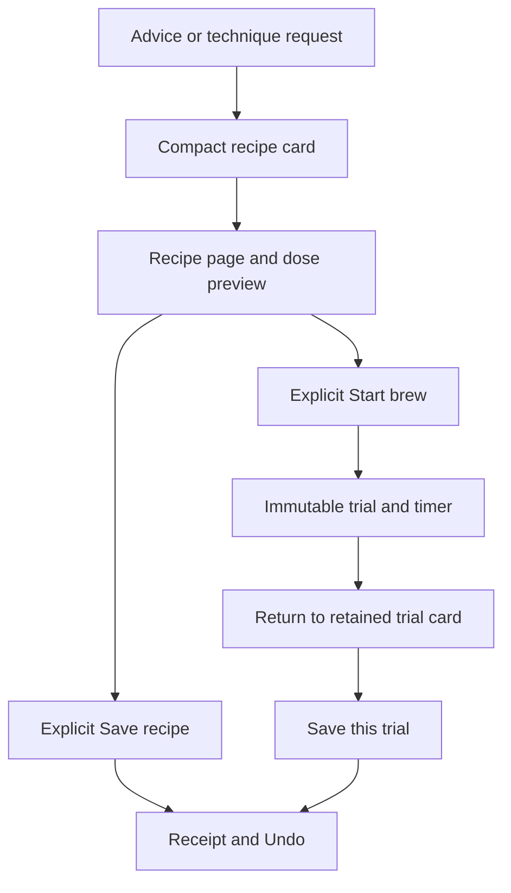

# Ruphus recipe-first coaching and technique exploration

## Summary

Make a useful recommendation lead naturally to a compact, expandable recipe card. Users can choose their coffee dose on the recipe page before starting a trial or saving, while Ruphus can also suggest a genuinely different, source-backed hot V60 technique through the same flow.

---

## Problem Frame

The September 8 owner example recommended changing 13 g to 14 g even though the user often brews 20 g. That ties a strength adjustment to one serving size. Trying a suggestion also enters the timer prematurely, and ordinary dose-editing paths can persist changes rather than behave as a safe preview. Technique exploration is not represented by the current single-control proposal contract.

This is a bounded extension, not another conversation reset. The user's confirmed scope supersedes the old requirement for agreement before preparing a preview; explicit authority to change a saved recipe remains intact. Historical engineering acceptance is baseline evidence, not proof for these new behaviors.

---

## Requirements

- R1. For a strength adjustment, communicate a concrete target ratio before example gram amounts. Temperature/grind remain valid alternatives when the symptom supports them; do not force ratio changes for every complaint or claim extraction is guaranteed unchanged.
- R2. Once coffee, brewer, recipe and recommendation are sufficiently resolved, deliver a separate compact recipe card in the same turn without asking for another yes. Ask a discriminating question only when its answer changes the recommendation. Pure discussion must not generate unsolicited cards on every turn.
- R3. Opening a card or choosing to try it opens the recipe page, never starts a timer, prepares hardware, changes the saved recipe, or claims a brew occurred.
- R4. Recipe-page dose editing preserves the intended ratio and technique within supported brewer/source bounds. Water quantities, pour instructions, numeric targets and timer data must describe the same recipe. Reject unsupported doses visibly; never silently switch brewer, technique or dose.
- R5. Start brew explicitly creates the trial from the exact reviewed configuration. Save explicitly makes that reviewed recipe permanent. Preserve trial recovery, later promotion, exact-target stale checks, idempotency and Undo.
- R6. A request for a different hot V60 technique retrieves supported alternatives, excludes the current technique family when identifiable, explains the difference and source/adaptation, and produces the same adjustable recipe preview. If no executable alternative exists, explain that honestly without fabricating a timed recipe.
- R7. Cards, selected preview dose and trial identity survive leaving/returning and relaunch. Chat, recipe page, timer and subsequent tasting refer to the same version; old cards never silently rebind to another coffee.
- R8. Verify deterministic, rendered, live-provider and signed-in Dev simulator journeys separately. Preserve login and data, undo test recipe changes, retain diagnostic evidence, and spend only within the existing cumulative testing authorization.

---

## Scope Boundaries

- Recipe-first previews cover the existing supported hot manual V60, V60 Switch and Kalita routes. Extend only to existing iced routes whose complete water/ice accounting and timing contracts can be preserved; otherwise keep the existing iced flow and explicitly disable unsupported preview edits. Never reinterpret iced total beverage ratio as hot extraction ratio.
- New technique exploration starts with hot standard V60, the user's concrete request and the existing multi-family source registry. Other brewers may still receive normal conversational advice; do not advertise executable technique selection for them in this slice.
- No Aiden/Fellow preparation redesign, new authentication mechanism, production release, Firebase project/rules migration, account copying, model tournament, broad chat redesign, or new recipe research corpus.
- Do not touch production, use the phone as a prerequisite, erase simulator login, or delete/stage diagnostic ledgers and report directories.

### Deferred to Follow-Up Work

- Expanding technique exploration to additional brewer families and admitting new sources with independent source-fidelity review.
- OS intents, proactive notifications, general-purpose recipe editing and a standalone technique browsing section.

---

## Context & Research

### Existing patterns and concrete constraints

- `api/_lib/ruphusTools.js` supports dose, water, grind, temperature and ratio controls. Dose regeneration uses existing engines, but ratio currently becomes a shallow ratio patch: that is not sufficient to guarantee a coherent executable schedule.
- `api/ruphus-agent.js`, `api/_lib/ruphusPrompt.js` and `api/_lib/ruphusOrchestrator.js` gate proposals on prior diagnosis/agreement. `src/lib/ruphus/conversationContract.js` C9 also requires agreement. These must change together, not just the prompt.
- `src/components/chat/artifacts/RecipeProposalCard.jsx` already carries before/after snapshots, actions, status and full steps. Extend this artifact rather than add another parallel recipe-card family.
- `src/hooks/useHandBrew.js` opens attempt snapshots and dispatches `timer_started` on opening. Its ordinary dose path persists bean fields. `src/components/HandBrewModal.jsx` owns timer presentation; both must distinguish preview from active attempt and ordinary saved-recipe editing.
- `src/lib/recipeScaling.js` provides pure display scaling, but copies timing unchanged. `src/lib/v60Adapter.js` uses physical dose profiles and technique selection that can override preferences. `src/lib/kalitaAdapter.js` and `src/data/kalitaConfiguration.js` validate brewer size/dose: current Wave 155 range is 12–20 g. Neither blind scaling nor silent default-engine reselection meets R4.
- `api/_lib/ruphusCommandService.js`, `api/_lib/ruphusRepository.js`, `src/hooks/useRuphusAction.js` and `src/hooks/useRuphusAttemptOutbox.js` provide canonical actions and recovery. Preserve their owner/slot/revision binding instead of implementing writes in chat.
- `src/data/v60SourceRegistry.js` and `docs/data/v60-source-registry.md` distinguish executable sources, app adaptations and incomplete reference-only records. The current registry, not model recollection or a technique label alone, determines eligibility.
- The project uses React/Capacitor, Vite, Firebase and Vercel. Reuse the current JavaScript modules, artifact protocol, theme and existing test harnesses; no new framework is needed.

### Institutional learnings

- `docs/solutions/runtime-errors/react-lazy-inside-render-destroys-state.md`: stable component identity matters for preserving dose/expanded state across rerenders.
- `docs/solutions/logic-errors/native-profile-load-failure-indistinguishable-from-missing.md`: unavailable evidence is not missing evidence; failures must not trigger fallback writes or silently replace a recipe.
- Prior research's useful product principle remains conversation plus native app actions, not unrestricted model mutation. No claim about Coach Max's private implementation is required for this design.

### Research boundary

Planning uses the existing source registries and engine implementations, not newly verified external brewing claims. Implementation must reconcile source-catalog work on other branches before reusing it; do not merge another feature wholesale. Any new source admission requires primary-source verification and is outside this slice.

---

## Key Technical Decisions

| Decision | Rationale and boundary |
|---|---|
| Ratio intent is separate from serving dose | A strength adjustment remains meaningful at 13 g or 20 g. Show rounded gram totals as examples; retain sufficient precision for canonical calculations. |
| Preview is not approval | Persisting a proposal for recovery is allowed; changing the active recipe, creating a trial or preparing hardware still requires the corresponding native action. |
| Shared deterministic preview calculation | Client renders quickly; server recomputes and validates before issuing an actionable proposal. A client recipe/hash is never write authority. No provider call per dose tap. |
| Start creates the immutable attempt | Opening/editing a preview must not create a falsely started trial. Once started, the attempt snapshot is frozen; editing it creates a fresh preview, not a rewrite of brew history. |
| Two recipe-change intents | A diagnostic adjustment changes one independent control with necessary derived quantities. A requested technique experiment may change the whole source-consistent schedule and explicitly shows that broader diff. |
| Extend existing artifacts and recipe page | Keep familiar navigation, receipts, save and Undo instead of introducing a separate editor or chat-only recipe system. |

### Directional interaction design

This illustrates the intended approach and is directional guidance for review, not implementation specification.

Card summary: coffee, brewer, recommendation or technique name, primary ratio/change and one clear “View recipe” control. Expansion uses a short theme-consistent transition with reduced-motion support; opening the recipe page retains a clear return to chat. Save/Start live on the recipe page, not as three competing primary buttons on the collapsed card. A completed card becomes an appropriate receipt, not a vanished suggestion.

---

## Implementation Units

Sequence: U1 → U2 → U3; U4 follows U1/U2; U5 integrates U2/U3/U4; U6 accepts the complete flow. U3 and U4 can be developed independently after shared preview contracts stabilize, but shared tool/contract files need a single integration owner. Repository instructions currently require sequential execution in the main task.

- U1. **Canonical ratio and dose preview calculation**

**Goal:** One deterministic, validated recipe projection for advice, display and execution.

**Requirements:** R1, R4, R6. **Dependencies:** None.

**Files:** Create `src/lib/ruphus/recipePreview.js`; modify `src/lib/recipeScaling.js`, `src/lib/v60Adapter.js`, `src/lib/v60SwitchAdapter.js`, `src/lib/kalitaAdapter.js` only where required; test `scripts/ruphus-recipe-preview.test.mjs` (new), `scripts/recipe-scaling.test.mjs`, `scripts/v60-dose-scaling-provenance.test.mjs`, `scripts/v60-switch-adapter.test.mjs`, `scripts/kalita-adapter.test.mjs`.

**Approach:** Keep original source recipe, chosen diagnostic intent/technique and requested dose distinct. Generate water and complete steps together. Retain chosen technique and fixed diagnostic controls; if crossing a dose profile requires changing grind, temperature or technique, explain the conflict instead of silently changing them. Preserve source/adaptation metadata. Do not rewrite the general legacy scaler for unrelated consumers. Characterize existing scaling first.

**Test scenarios:**
- Happy path: a 1:16 target gives 208 g at 13 g and 320 g at 20 g; final pour totals and copy agree, original object unchanged.
- Edge: fractional ratio rounding, repeated dose changes, invalid/nonfinite dose, Wave 155 at 20 g and above its maximum; reject rather than clamp or switch to 185.
- Edge: technique-specific dose profile transition either preserves an explicitly supported adaptation or reports unsupported; timing is not multiplied blindly.
- Error: unavailable/malformed recipe, missing ratio, incomplete timed source; no executable fake fallback.
- Integration: preview, persisted derived proposal and timer all validate to the same schedule, including supported iced water/ice totals if enabled.

**Verification:** Derived recipe passes the existing brewer validators and every displayed quantity has a canonical counterpart.

- U2. **Server-validated preview versions and action binding**

**Goal:** Adjustable previews without accidental saved-recipe writes.

**Requirements:** R3–R5, R7. **Dependencies:** U1.

**Files:** Create `api/ruphus-preview.js`; modify `api/_lib/ruphusRepository.js`, `api/_lib/ruphusCommandService.js`, `api/_lib/ruphusRollout.js`, `src/lib/ruphus/contracts.js`, `src/lib/recipeCommands.js`; test `scripts/ruphus-preview-endpoint.test.mjs` (new), `scripts/ruphus-action-integration.test.mjs`, `scripts/ruphus-repository-transaction.test.mjs`, `scripts/ruphus-rollout-gates.test.mjs`.

**Approach:** Authenticated preview preparation accepts an existing owner-bound proposal and supported configuration, not arbitrary recipe JSON. Recompute from the trusted base and immutable intent, then create/reuse a derived proposal bound to the exact base revision and configuration. Keep rapid dose edits local; prepare the latest version before Start/Save, and retain its identifier for idempotent retry. Reuse existing proposal persistence and action commands. Preview preparation uses existing Dev access/entitlement gates and abuse limits; action rollout gates remain authoritative for writes.

**Test scenarios:**
- Happy path: prepare at 20 g, then Save or brew_once uses precisely that server-validated proposal; active recipe is unchanged by preparation alone.
- Edge: duplicate preparation/action, response loss, older response arriving after a newer dose, or a retry after relaunch cannot create duplicate trials or apply the previous dose.
- Error: forged owner, arbitrary steps/technique, stale base revision, invalid configuration, denied access; fail closed without bean mutation.
- Integration: memory and Firestore repository paths preserve equivalent read-check-write ordering; promote and Undo restore the correct snapshots.

**Verification:** No client-supplied snapshot can bypass source validation, and a preparation response is never reported as a save.

- U3. **Compact card, recipe-page editing and explicit timer start**

**Goal:** One continuous native-feeling preview → brew/save → return experience.

**Requirements:** R2–R5, R7. **Dependencies:** U1, U2.

**Files:** Modify `src/components/chat/artifacts/RecipeProposalCard.jsx`, `src/components/chat/artifacts/ActionReceiptCard.jsx`, `src/components/chat/ArtifactRenderer.jsx`, `src/tabs/ChatTab.jsx`, `src/App.jsx`, `src/tabs/RotationTab.jsx`, `src/components/HandBrewModal.jsx`, `src/hooks/useHandBrew.js`, `src/hooks/useRuphusAction.js`, `src/hooks/useRuphusAttemptOutbox.js`; test `scripts/ruphus-artifact-ui.test.mjs`, `scripts/ruphus-u6-integration.test.mjs`, `scripts/ruphus-trial-recovery.test.mjs`, `scripts/verify-ruphus-agent-ui.mjs`.

**Approach:** Introduce explicit preview mode in the existing recipe page. Its dose input uses U1 and must bypass ordinary persistDose/updateBean paths. Persist owner-scoped draft configuration and artifact identity using the established recovery pattern, without storing credentials. Start prepares the latest proposal, creates an attempt, and only then starts the timer; dispatch timer_started at the real start transition, never on modal open. Failure leaves the reviewed recipe visible with a truthful retry. Existing attempts reopen as immutable recipes with an explicit resume/start action, not automatic timer execution. Editing an old trial creates a new preview.

**Test scenarios:**
- Happy path: same-turn compact card opens recipe page; 13 →20 g updates all quantities; closing causes zero active-recipe writes and zero timer-start commands.
- Integration: explicit Start freezes the reviewed dose; return to chat retains the trial; later natural-language save request recovers that exact trial and its native Save control; promote/Undo work.
- Edge: background/relaunch, keyboard open, rapid dose taps followed immediately by Start, repeated taps, switching coffee while a preview loads, and opening an old card after a newer suggestion.
- Error: failed preparation/start/save retains preview and login; stale cards require refresh, not silent rebase.
- Visual: small iPhone and desktop, large text, VoiceOver labels/focus return, reduced motion, scroll anchoring, composer not covering card controls. No animation resets a draft or starts a timer.

**Verification:** Opening and adjusting are side-effect-free for domain recipes; only the explicit chosen action causes its named transition.

- U4. **Supported hot V60 technique exploration**

**Goal:** A genuinely different executable technique, not a renamed default or invented schedule.

**Requirements:** R4, R6. **Dependencies:** U1, U2.

**Files:** Create `src/lib/ruphus/techniqueOptions.js`; modify `src/data/v60SourceRegistry.js`, `src/lib/v60Adapter.js`, `api/_lib/ruphusTools.js`, `src/lib/ruphus/contracts.js`, `api/_lib/ruphusRollout.js`; test `scripts/ruphus-technique-options.test.mjs` (new), `scripts/v60-source-registry.test.mjs`, `scripts/v60-selector-counterexamples.test.mjs`, `scripts/ruphus-u2-runtime.test.mjs`, `scripts/ruphus-provider-contract.test.mjs`.

**Approach:** Expose a bounded read tool for eligible alternatives with stable source/family identities, supported brewer/dose ranges and concrete differences. Resolve the current recipe first. When no current V60 exists, discussion can compare alternatives against a clearly labeled engine default, but must not pretend that default is a saved recipe: actionable proposals require the existing canonical base specified in U2. Offer the existing V60 recipe-generation route before preparing an actionable experiment; creating an entirely new recipe slot from chat is outside this slice. A technique experiment selects an eligible ID; server derives the full validated recipe. Explicit selection must not fall through to automatic preference selection. Update tool schemas, allowlists, tracing and read budgets together. Reference-only sources may be discussed but cannot create timer-ready cards.

**Test scenarios:**
- Happy path: “interesting V60 technique for Jar #1” produces one eligible different family, source/adaptation explanation and preview; “another one” excludes the current offered technique in the active conversation.
- Edge: unknown current technique is disclosed, not falsely compared; missing V60 recipe with Aiden present never imports Aiden parameters or creates an actionable proposal without a canonical V60 base; exact-source dose versus adapted 20 g are labeled accurately.
- Error: unsupported brewer, no alternative, unsupported dose, incomplete Kurasu record, invented source ID or malicious source text cannot become executable proposals.
- Integration: alternate schedule shows its full changes, can be scaled within support, tried, saved and undone through U2/U3 without bypassing single-control diagnostic rules.

**Verification:** Different means a different executable technique family; supported source parameters and app adaptations remain distinguishable.

- U5. **Conversational readiness and ratio-first coaching**

**Goal:** Useful advice and a ready-to-view recipe arrive naturally, without redundant permission dialogue.

**Requirements:** R1, R2, R6, R7. **Dependencies:** U2, U3, U4.

**Files:** Modify `api/ruphus-agent.js`, `api/_lib/ruphusPrompt.js`, `api/_lib/ruphusOrchestrator.js`, `api/_lib/ruphusTools.js`, `src/lib/ruphus/conversationContract.js`, `scripts/fixtures/ruphus-conversation/cases.json`; test `scripts/ruphus-agent-endpoint.test.mjs`, `scripts/ruphus-conversation-contract.test.mjs`, `scripts/ruphus-runtime-contracts.test.mjs`, `scripts/ruphus-conversation-runner.test.mjs`.

**Approach:** Replace agreement-before-preview with target-bound recommendation readiness, distinguishing a diagnostic adjustment from an explicit technique request. Do not derive readiness merely from prior reply word count or a bare yes. A sufficient current-turn symptom may yield advice and preview immediately; unresolved conditional diagnosis still asks one useful question. Update C9 and affected fixtures with an explicit versioned behavior amendment; retain no raw JSON, no duplicate cards, correct-target and no-autonomous-write checks. Keep response prose brief and the card a separate artifact; do not repeatedly restate the full recipe. Existing retry, session and method-binding contracts remain active.

**Test scenarios:**
- Happy path: “thin but sweet, not sour” + known Kalita yields ratio-first advice and a coherent card in one turn; 13 g is an example, not a required permanent dose.
- Edge: vague weakness prompts one discriminating question when needed; answer advances to advice/card; a pure explanatory follow-up or “no, leave it” does not duplicate a card.
- Integration: technique exploration emits the same card family; coffee/method correction invalidates pending readiness but never rebinds an existing card.
- Error: unavailable recipe yields useful bounded discussion and truthful unavailability, no fabricated actionable numbers or fallback to Aiden.

**Verification:** Prompt, endpoint, tools, orchestrator and evaluator agree about preview readiness versus mutation authority.

- U6. **Integrated visual and native Dev acceptance**

**Goal:** Prove the owner's exact new journeys before another testing handoff.

**Requirements:** R1–R8. **Dependencies:** U1–U5.

**Files:** Modify `scripts/verify-ruphus-agent-ui.mjs`, `scripts/ruphus-dev-live-action-check.mjs`, `scripts/fixtures/ruphus-conversation/cases.json`, `docs/data/ruphus-agent-v3/CONVERSATION-RESET-RUNBOOK.md`; create `docs/data/ruphus-agent-v3/RECIPE-FIRST-ACCEPTANCE.md`.

**Approach:** Characterize and replace only the old expectations intentionally superseded by this plan. Keep historical ledgers/reports immutable. Run deterministic and rendered checks first; then budgeted real-provider journeys; then actual signed-in Dev simulator UI and canonical readback. Preserve current login, capture pre-test recipe state, and Undo every deliberate save. Seeded backend evidence stays separate from native owner-account evidence; personal feel verdict remains pending without blocking engineering.

**Acceptance journeys:**
- Watery/sweet Kalita → ratio advice + card → preview at 13 g then 20 g → close without mutation → reopen at 20 g → explicit trial → return → save trial → Undo → verify original recipe restored.
- V60 technique request → confirmed different family/source → preview and dose adjustment → start/return → save/Undo; existing Aiden recipe remains unchanged.
- Relaunch during preview and after trial; original login, transcript, draft and receipts remain usable. No physical brew or tasting is claimed by a simulated timer.
- Network loss and repeated action taps never create a false save, wrong-dose timer or duplicate attempt; stale active-recipe change blocks mutation until reviewed refresh.

**Verification:** Record commit/build/backend identity, actual observations, screenshots/video, canonical before/after/Undo readback, cost and remaining gaps. All four journeys must pass on the current integrated build. Browser mocks alone cannot close native or live-provider gates.

---

## System-Wide Impact

- **State lifecycle:** Local draft is editable; server proposal is a validated version; attempt is immutable; saved revision is explicitly committed. Bind each to owner, coffee, exact slot, base revision and configuration. Restore draft only for that identity; logout must not expose it to another account.
- **Failure propagation:** Preserve the last valid preview while showing invalid/pending state; disable Start/Save until current configuration validates. A lost command response is reconciled by action ID before retry. An old response cannot override a newer selection.
- **Compatibility:** Version new preview/technique intent metadata and return only server-permitted actions. Old stored proposals and receipts remain readable. New actions require advertised backend capability; unsupported clients show existing safe read-only content, never silently fall back to legacy chat or auto-start.
- **API parity:** Client dose controls and model recommendations use the same validated recipe capabilities. Model tools remain read/propose only; app commands own mutation. Review schema, tool-name allowlist, usage accounting and artifact rendering together.
- **Unchanged invariants:** Owner isolation, selected-slot drift checks, entitlement/rollout checks, canonical revision/receipt authority, Undo, no fabricated physical success, production isolation, simulator login and evidence preservation.

---

## Risks, Decisions and Operational Notes

| Risk | Required treatment |
|---|---|
| Ratio label changes but executable water does not | U1 validates the complete recipe and U2 recomputes it before action. |
| Dose control silently writes the saved bean | U3 preview mode bypasses ordinary persistent editing; test canonical no-write readback. |
| Source engine reselects the default during scaling | Lock the chosen supported family; fail visibly when a configuration is unsupported. |
| Technique experiment is blocked by one-control rules | Typed experiment path derives a complete validated source recipe, never arbitrary model steps. |
| Previous evaluation rejects automatic previews | Amend C9 and affected fixture expectations explicitly without lowering authority/target correctness gates. |
| Testing exceeds the cumulative budget | Read existing spend and reservations before live calls; no new budget is implied by this plan. |

Resolved during planning: preview creation is non-mutating to saved recipes; Start creates a trial; Save persists the reviewed serving dose and recipe intent using existing saved-dose conventions; changing dose on a started trial creates a new preview. V60 technique exploration is a bounded first slice, not an all-brewer catalog.

Deferred to implementation: exact animation timing after visual inspection; which existing source families meet every executable/dose constraint after registry reconciliation; whether an iced route satisfies the complete preview contract. These are implementation checks, not permission to silently expand supported routes.

Dev rollout must deploy compatible backend capability before enabling the updated client flow, with old-proposal read compatibility. Use existing Dev shipping safeguards; no production deployment is authorized. Keep source/test, live-provider, rendered, simulator and human-feel evidence distinct. Do not claim “Coach Max quality” from green tests alone.

---

## Sources & References

- Primary product authority: September 8 owner feedback, screenshot and explicit scope confirmation in this task.
- Historical boundaries, not an unchanged origin: `docs/brainstorms/2026-08-30-ruphus-conversation-first-reset-requirements.md`, `docs/plans/2026-08-30-001-feat-ruphus-conversation-reset-plan.md`.
- Recipe source authority: `src/data/v60SourceRegistry.js`, `docs/data/v60-source-registry.md`, `src/data/kalitaConfiguration.js`.
- Existing execution/recovery authority: `api/_lib/ruphusCommandService.js`, `api/_lib/ruphusRepository.js`, `docs/data/ruphus-agent-v3/CONVERSATION-RESET-RUNBOOK.md`.
