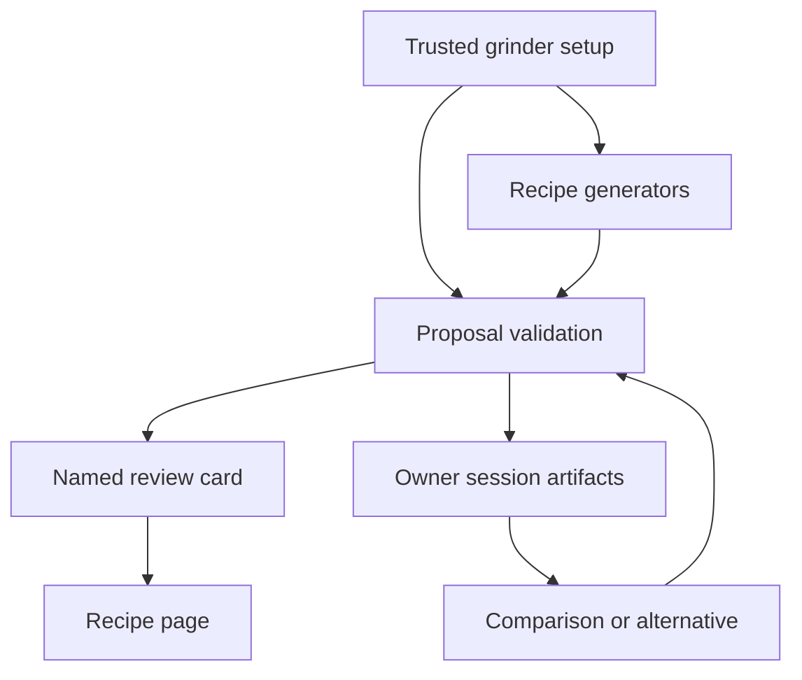

# Physical grinder clicks and coherent technique conversation

## Problem and origin

Tal's September 9 recording shows a real chain: sour Kalita advice creates an impossible Ode 5.6 → 5.5 proposal; asking for a different recipe repeats it; a V60 coarse-pulse proposal is reduced to a ratio card; the follow-up explanation describes another technique. Tal explicitly approved planning and implementing all four repairs and specified the app convention `.0, .2, .6` for the three clicks per numbered interval. This is app notation, not a claimed Fellow decimal standard.

Build on `2026-09-08-001-feat-ruphus-recipe-first-coaching-plan.md`; preserve its recipe-first, dose-scaling, explicit save/start, durable review, and Dev-only boundaries.

## Requirements

- R1: New Ode recommendations use 31 physical positions, 1 through 11, labelled whole number / .2 / .6. One click finer than 5.6 is 5.2, not 5.5. Arithmetic uses click positions, not decimal increments.
- R2: Generator, proposal, micron approximation, and review agree. Invalid model numbers must be repaired into an explicit actionable directional adjustment or returned as recoverable tool feedback, never persisted as impossible settings. Unknown grinders must not inherit Ode assumptions.
- R3: Asking for another recipe cannot yield an identical proposal labelled new. Supported V60 alternatives exclude already offered families. Other brewers retain bounded coaching; do not invent source-backed families to fill a gap.
- R4: Technique cards and recipe review identify the actual source-backed technique by recognizable name, with adaptation truth and secondary numeric changes. The card remains a review, not a save.
- R5: Comparison and follow-up reference the exact owner-scoped displayed proposal and its before/after, not another eligible alternative. New-chat boundaries and coffee/method changes prevent stale cross-target carry.
- R6: Preserve login, existing records, explicit mutation controls, sensory-answer handling, and unrelated dirty files. Verify deterministic, rendered, and live/native evidence separately within the existing $55 total paid-test cap.

## Research findings and decisions

| Finding | Decision |
|---|---|
| `brewMethods.js` lists .1/.2; five adapters round continuous values to tenths | Centralize physical Ode conversion and apply it to newly generated recipes. Do not rewrite historical stored labels or hashes. |
| `patchForChange` extracts any decimal; executable validation checks shape | Enforce known-grinder constraints at the proposal boundary, including full-patch inputs. Correct micron/description metadata with the reviewed setting. |
| Provider replay drops artifacts; session retains only technique exclusion IDs | Recover a bounded safe projection of recent proposal artifacts from authoritative session state. Distinguish saved source from unsaved suggestion. |
| Card ignores `techniqueExperiment.name` and prioritizes ratio | Give experiment identity precedence and show ratio as secondary. Reuse existing review component and motion. |

Historical recipes are not migrated. Values such as 5.8 stay historical evidence; any new Ode adjustment must land on a physical position. Existing ambiguous .2 values are not silently remapped from old .1/.2 notation. Source-exact qualitative grind remains qualitative. Approximate microns remain approximate and are not hardware calibration claims.

## Implementation units

### U1 — Physical grinder contract

**Goal:** R1/R2/R6. **Dependencies:** none.

**Files:** `src/lib/brewMethods.js`; V60, V60 Switch, V60 iced, Kalita, Kalita iced adapters; `api/_lib/ruphusTools.js`; `api/_lib/ruphusPrompt.js`; focused grinder/runtime tests and existing grinder verification scripts.

**Approach:** Introduce shared position conversion/quantization for Ode. Audit Aiden and flash-brew consumers of the shared registry, retaining their whole-number interval intent. Use the authenticated setup grinder, never user prose, for proposal enforcement. Keep non-Ode behavior unchanged. Include valid nearby settings in recoverable feedback; no generic connection failure for an invalid grind suggestion.

**Scenarios:** 5.6 finer → 5.2; 5 finer → 4.6; 4.6 coarser → 5; invalid 4.3; bounds 1/11; historical off-grid baseline; all five adapters; unknown/non-Ode grinder; source-exact qualitative values; micron consistency; invalid full-patch bypass; no-op rejection.

**Verification:** physical-step regression suite plus real tool proposal chain, existing adapter/grinder suites. Source review confirms no cloud migration.

### U2 — Exact proposal continuity and alternatives

**Goal:** R3/R5/R6. **Dependencies:** U1 for shared tool integration.

**Files:** `api/ruphus-agent.js`, `api/_lib/ruphusTools.js`, `api/_lib/ruphusPrompt.js`, `src/lib/ruphus/techniqueOptions.js`, endpoint and technique runtime tests.

**Approach:** Recover bounded owner-session proposal summaries with opaque coffee references and safe recipe projections. Include current proposal identity, before/after, and actual technique in provider context. Keep canonical saved-recipe reads distinct. Track previously offered results for duplicate prevention, preserving retry idempotency. Comparison does not create a new proposal; alternative requests use existing source exclusions or honestly explain the lack of another supported choice.

**Scenarios:** Kasuya proposal → comparison remains Kasuya; 'another one' excludes Kasuya; duplicate Kalita after-state is not reissued as new; ordinary replay/retry remains safe; switched coffee/slot and new chat cannot borrow an old suggestion; malicious client-supplied artifacts cannot bind authority; multiple cards keep latest matching proposal clear.

**Verification:** endpoint first-provider-request assertions and tool integration tests, not prompt snapshots alone.

### U3 — Named recipe review

**Goal:** R4/R5. **Dependencies:** U2 metadata contract.

**Files:** `src/components/chat/artifacts/RecipeProposalCard.jsx`, existing recipe review surface if needed, `src/lib/ruphus/techniqueOptions.js`, recipe-first rendered harness and fixture.

**Approach:** Show recognizable source technique name above numeric differences; retain coffee/brewer identity, one View recipe action, unchanged-save copy, accessible touch targets, and current animation/reduced-motion behavior. Review and card must use the same identity.

**Scenarios:** technique plus ratio change; ordinary grind-only card; older artifact fallback; narrow mobile layout; expanded recipe identity; no automatic timer or save.

**Verification:** rendered mobile/desktop screenshots and interaction assertions.

### U4 — Whole-chain acceptance and Dev handoff

**Goal:** R1–R6. **Dependencies:** U1–U3.

**Files:** focused tests/harnesses; a scoped acceptance record under `docs/data/ruphus-agent-v3/`; Dev build configuration only through the existing guarded workflow.

**Approach:** Replay the supplied conversation through real tools, then bounded live provider checks and the signed-in Dev simulator where available. Inspect proposal → recipe → dose scaling → return → comparison/another. Preserve login/data and restore any deliberately changed recipe. Check paid ledger before calls. No production deployment or phone dependency.

**Verification:** targeted suites, lint, build, visual checks, exact backend/build identity and explicit unrun categories. Report actual outcomes, not 'perfect' based on unit tests.

## System-wide impact

Shared registry affects Aiden/iced display and conversions; targeted compatibility tests are mandatory. Proposal metadata must not count as a second recipe control. No new collection, auth seam, model provider, or external source corpus is needed. Execution is sequential in the existing isolated feature worktree because tool/prompt files overlap and repository instructions map delegation to main-thread work.

## Review and operational boundaries

Review once for coherence, feasibility, UX, and trust boundaries before implementation. Highest-risk findings to resolve: ambiguous historical notation, duplicate handling versus retries, and source-family mismatch. Keep diagnostic ledgers/report directories untouched. Existing unrelated `ios/App/GoogleService-Info.plist` modification is not part of this repair.

## Sources

- User recording `ScreenRecording_09-09-2026 08-46-50_1.MP4` and explicit `.2/.6` convention.
- Fellow Ode Gen 2 product specification: https://fellowproducts.com/products/ode-brew-grinder-gen-2 (31 positions).
- Existing audited `src/data/v60SourceRegistry.js`; no invented timings or new source admissions.
- `docs/solutions/logic-errors/grind-size-display-toggle-unwired.md`: reuse centralized display/conversion helpers.
