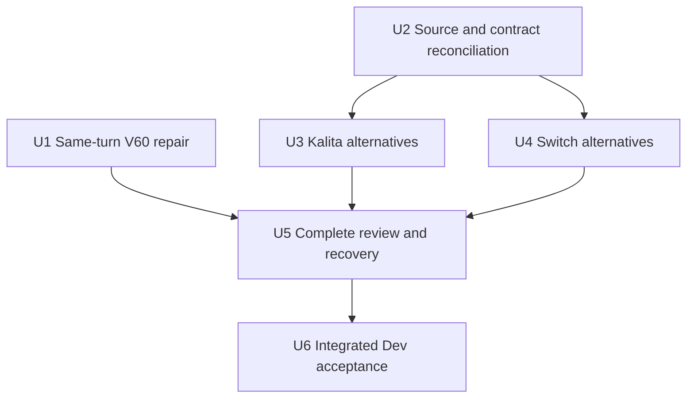

# Natural technique exploration

## Summary

An explicit request for an interesting technique should receive a short, named recommendation and a compact recipe card together. “Another one,” “the first one,” changing dose, trying a brew and saving it should stay attached to the right coffee, brewer and recipe. Extend this experience to Kalita 155/185 and genuine Switch techniques using existing research before admitting new material.

This is a follow-up to the [recipe-first plan](2026-09-08-001-feat-ruphus-recipe-first-coaching-plan.md) and [grinder/continuity repair](2026-09-09-001-fix-ruphus-clicks-and-technique-continuity-plan.md), not a replacement of either. Origin: Tal's September 10 screenshot and confirmed request to remove the extra recipe-request turn, improve wording, add Kalita and Switch options, audit existing data and cover edge cases. Planning does not authorize deployment or implement this document.

---

## Problem and verified baseline

The screenshot shows a successful named V60 suggestion, followed by a separate user request before the card appears. The later message says “Prepared” and “adapted schedule” instead of simply helping the user brew. Earlier failures show why prompt-only improvements are insufficient.

Read-only baseline: `codex/ruphus-recipe-first` at `f603631`. Preserve its same-target concurrent-read repair: re-reading a recipe must not discard offered techniques. Existing dirty `ios/App/GoogleService-Info.plist` is unrelated and must remain untouched.

| Surface | What exists | What is missing |
|---|---|---|
| Standard V60 hot | Four executable option families in `src/lib/ruphus/techniqueOptions.js`; source-derived proposals | Reliable same-turn card, broader conversational selection and source reconciliation |
| Kalita hot | Parametric engine and research for 155/185 | Its four internal pattern names are not four named author recipes; chat rejects this exploration route |
| Switch hot | Single-temperature Switch 03 adapter and extensive research | Named options; exact variant binding; source-faithful valve/timing execution |
| Iced | Existing V60/Kalita engines and separate source research | Audit which options are genuinely guided-ready; never infer hot-to-iced transfer |
| Source foundation | Separate worktree at `9f1b547`, source records and event-based guidance | Not integrated into this Ruphus branch; its historical test/deploy evidence is not this branch's acceptance |

The source-foundation worktree is `Coffee-App-Build-source-foundation`, branch `codex/manual-brew-source-foundation`. Its latest guided-timing document supersedes earlier admission counts: **source-admitted is not timer-ready**. Reuse selected modules and fixtures deliberately, not a wholesale merge of its app, authentication, persistence or deployment changes. The [research inventory](../research/2026-09-10-ruphus-technique-inventory.md) records evidence and remaining source gaps.

---

## Requirements and boundaries

- **R1 Same-turn usefulness.** A resolved, supported technique request produces one concise explanation and one separate compact recipe card without requiring “yes” or “give me the recipe.” No claim of preparation without a persisted, valid artifact. Ordinary questions/comparisons do not automatically produce new cards.
- **R2 Real alternatives.** Name the method/author and explain the meaningful difference using trusted recipe facts. Different dose, rename or temperature variation alone is not a different technique family. Do not promise taste outcomes or claim a comparison against an unknown saved technique.
- **R3 Exact equipment.** Bind coffee, brewer, size, variant, filter, hot/iced mode and source revision. Standard V60 and ribbed Switch are distinct even when sharing `v60_hot`; Kalita 155 and 185 are distinct even when sharing `kalita_hot`. “Switch” as a verb is not equipment selection.
- **R4 Faithful executable recipes.** Preserve author facts separately from explicit app adaptations. Every intermediate action has a supported timed cue or a precisely anchored immediate action; final drain may be conditional. Incomplete references remain useful reading, never invented timer schedules.
- **R5 Adjustable, practical previews.** Ratio leads strength advice; dose is a serving choice. Preserve named technique on supported dose changes, update all quantities together, respect phase capacity and real grinder increments. Reject incompatible changes with a usable explanation rather than silently clamping or changing equipment.
- **R6 Continuous conversation.** “Another,” “the first,” “compare those,” “use this for Jar #2,” corrections, exhausted options and new-chat boundaries behave predictably. Read-only lookup may not erase selection; ambiguous selection asks one useful clarification.
- **R7 Explicit action and durability.** View opens recipe details, not a timer. Start and Save remain explicit existing commands. Cards/trials survive navigation and relaunch; later Save targets the actual reviewed/tried version, with stale checks, receipts and Undo.
- **R8 Truthful recovery.** A source limitation, capacity problem or proposal validation error is not “couldn't reach the AI.” Keep useful prose and existing cards, offer the appropriate recovery, and never replay a mutation automatically.
- **R9 Prove the whole journey.** Separate source fidelity, deterministic runtime, rendered UI, live provider and authenticated native Dev evidence. Preserve login/data, undo test recipe changes, retain diagnostics and obey the cumulative testing budget.

### Explicit scope

Implement hot standard V60 02, Kalita 155/185 and the existing ribbed Switch 03 product configuration. Audit all existing V60/Kalita iced routes; expose only already-supported routes with complete guidance. Switch 02, MUGEN Switch, Kasuya-model V60 and Switch iced are research/reference coverage, not silently enabled hardware or modes. No new equipment picker or additional brewing-device support in this plan.

Preserve the prior single-temperature Switch workflow. Dual-temperature Devil/God recipes can be explained as equipment-dependent references, but do not label the existing single-temperature approximation as the original. No broad default-recipe replacement, account migration, Aiden/Fellow changes, live web-research agent, new database collection family or standalone recipe marketplace. Do not rewrite saved history or import source-foundation's alternative accepted-revision persistence system.

Missing saved recipe: preserve the existing boundary from the September 8 plan. Explain/show the source as a non-actionable reference and offer the existing recipe-generation entry for that exact configuration; do not create a new recipe slot from chat or substitute an Aiden base. Existing unavailable data is a retry case, not proof the recipe is missing.

---

## Product behavior

Example shape, not a mandatory scripted response:

> “Try Kurasu's Wave 155 approach: a second wetting pour followed by a gentle centre pour. Here's the recipe to review.”

Then a separate compact card: coffee + **Kalita 155**, **Kurasu Wave 155**, ratio/dose, **View recipe**. Details disclose original/adapted status, steps and source. Avoid the blanket current “Adapted for your dose” label when nothing changed. Keep administrative language and repetitive disclaimers out of the chat; the card can say once that the saved recipe is unchanged.

The card enters with a short existing-theme transition, respects reduced motion and keeps the user's scroll position if they are reading older content. It must not be hidden beneath the composer. View opens the existing recipe page with dose selection and explicit Start/Save; no unsolicited modal. Returning lands at the originating card. A reference-only option is visibly non-executable, not a disabled mystery button.

“Another one” chooses a different eligible family for the current configuration, excluding saved family and successfully delivered families in this session. A retry does not consume another option. An explicit “show Kurasu again” can repeat. After exhaustion say what remains: revisit, compare or discuss a reference. Do not recycle the last option while calling it new. New chat clears conversational exclusions, not recipe history.

---

## Technical decisions

| Decision | Reason |
|---|---|
| Repair first-card delivery independently | The existing V60 case is already supported; its fix should not wait for Switch source admission. |
| One technique option contract, existing artifacts/commands | Avoid three parallel chat implementations and a second write authority. |
| Selective source-foundation reuse | Its originals and timing semantics are valuable; importing its entire app would conflict with the active Ruphus flow. |
| Explicit original/adaptation/readiness fields | Source omissions must not become fabricated author claims, and a valid source is not necessarily a guided recipe. |
| Existing persistence owns proposals and attempts | Copy the canonical schedule into immutable existing snapshots, not another accepted-recipe store. |
| Source-specific generation and validation | Generic Kalita's minimum 93°C rejects Kurasu's 92°C; generic Switch heuristics cannot validate every immersion method. Do not weaken every legacy validator globally. |

Use stable source/family IDs and source revisions, exact configuration, supported dose policy, timing format/version and an adaptation ledger. Existing `v60_technique` artifacts remain readable; normalize them at one server boundary into the extended contract rather than changing history. Legacy snapshots retain legacy timer dispatch. Newly admitted source schedules use versioned source timing end-to-end, including immutable attempts and restoration.

An option is eligible only when source admission, timed readiness, equipment compatibility, adaptation policy and current action-base checks all pass. Raw model recipe JSON or a source name is never write authority. Client dose edits are local; the server recomputes the final reviewed proposal before Start/Save. Preserve the exact existing owner/revision checks and `f603631` read concurrency invariant.

Treat an existing slot with the wrong hardware configuration as lacking the requested configuration, not a valid base. No implicit V60-to-Switch or 155-to185 replacement follows from slot equality. Client capability flags select only among server-supported formats; they cannot bypass ownership, access, entitlement, source validation or mutation rollout gates. Keep source text as data, validate external source links for safe rendering, and do not place raw personal records in model traces.

For source-native millilitres versus grams, retain units and do not label volume ratios as mass ratios. If a scale-based app adaptation is needed, make that a separately documented policy and fixture before admission; do not silently replace 360mL with 360g. Unknown temperature can remain qualitative or be a clearly labeled app starting point from trusted context; never manufacture an original temperature or convert an unknown grinder's settings to Ode numbers.

---

## Implementation units

Repository instructions currently require sequential work in the main task. Logical independence is documented for later scheduling, not permission to spawn agents. U1 is independently shippable; U3/U4 share only the stabilized U2 contract. U5 integrates them; U6 verifies the product.

### U1 — Same-turn card and natural language

**Covers:** R1, R2, R6, R8. **Dependencies:** none; use current eligible V60 catalog.

**Paths:** `api/_lib/ruphusOrchestrator.js`, `api/_lib/ruphusPrompt.js`, `api/_lib/ruphusTools.js`, `api/ruphus-agent.js`, `src/lib/ruphus/conversationContract.js`; existing endpoint/runtime/conversation tests plus new `scripts/ruphus-technique-conversation.test.mjs`.

Characterize the screenshot's initial request and extra-turn path. Enforce target-bound readiness for an explicit technique request through the orchestration contract, not only prompt wording or broad regexes. When a valid option is selected, complete deterministic proposal preparation inside the current bounded turn. If the provider gives prose but omits the card, complete the selected valid proposal without another user permission turn; if no selection exists, use one bounded existing continuation or respond with honest recovery. Do not choose a method from untrusted prose. Update tool-round accounting and failure classification together, retaining cancellation and cost limits.

**Scenarios:** first “interesting V60” request gives one named card; information-only question gives none; interrupted preparation retry gives the same artifact; concurrent recipe read retains options; cancellation adds no late card; invalid option yields helpful response rather than a network error. “Prepared” with no artifact is rejected. Existing sourness follow-up and ratio-first behavior remain covered.

**Exit:** deterministic frame-level tests cover actual artifact output, not string presence; one rendered owner-example conversation demonstrates the card appearing without another message. This is not yet live-provider or full feature acceptance.

### U2 — Reconcile source inventory and shared contract

**Covers:** R2–R5, R8. **Dependencies:** none; precedes adding new executable families.

**Paths:** selectively port scoped records from `src/data/manualSources/{kalita,switch,v60}.js`, source contract/timing primitives from `src/lib/manualRecipeContract.js`, `manualGuidance.js`, `manualSourceTiming.js` and the pure projection logic of `manualSourceAdapter.js`; integrate `src/lib/ruphus/techniqueOptions.js`, `recipePreview.js`, `src/lib/ruphus/contracts.js`, `api/_lib/ruphusTools.js`, `api/ruphus-preview.js`. New `scripts/ruphus-technique-source-fidelity.test.mjs`, `scripts/fixtures/ruphus-techniques/primary-cases.json`; extend preview/provider contract tests.

Record a selective-port manifest pinned to source-foundation `9f1b547`: paths, dependency closure, preserved active behavior and excluded persistence/UI modules. Reconcile duplicate IDs deliberately and keep old artifact compatibility. Catalog only these scoped families; no new generic framework or import of all manual brewers. Independently transcribe source fixtures, not generated expectations from the implementation registry. Include source URL, locator/access date, native units, timing anchors, hardware/filter, unknowns, provenance, meaningful family differences and timer eligibility.

Correct the old HARIO/Partners row from the primary page. Finish the research gaps identified in the inventory before calling those candidates executable. Distinguish changes permitted by the author, app-calculated scaling and unverified hardware transfers. Source completeness work is an explicit deliverable, not a hidden assumption left to the model.

**Scenarios:** Kurasu 92°C survives; Vibrant observation-only intermediate pour refuses guided execution; wrong clock anchor and invented timing fail independent fixtures; missing source revision invalidates a new action without deleting history; size/filter/mode mismatch refuses; legacy `v60_technique` still reads; forged source/steps cannot create a proposal.

**Exit:** per-configuration readiness table and integration manifest are committed with evidence. Source count, family count and selectable count are separate. A candidate not admitted remains a named gap, never silently counted as an alternative.

### U3 — Kalita 155/185 and existing iced options

**Covers:** R2–R6. **Dependencies:** U2.

**Paths:** `src/data/manualSources/kalita.js` (scoped import), `src/lib/ruphus/techniqueOptions.js`, `recipePreview.js`, `src/lib/kalitaAdapter.js`, `src/data/kalitaConfiguration.js`, relevant iced registry/adapter; extend `scripts/ruphus-technique-options.test.mjs`, new `scripts/ruphus-kalita-techniques.test.mjs` and U2 fidelity fixtures.

Use named source schedules rather than relabeling the existing heuristic patterns. Initial targets: Kurasu 155 plus Ozone's source-supported smaller Wave version; 185 Ozone plus source-foundation's Onyx candidates where reverified and appropriate. Preserve the distinction between a specific coffee recipe and a general technique adapted to Tal's coffee. Do not promise a fixed number of distinct families until schedule comparison is complete: Ozone and Onyx Monarch may share a pulse family despite different authors.

Admission target is at least two meaningfully distinct guided choices per hot Kalita size at supported source/example doses. If research cannot satisfy it, keep that route's expansion explicitly incomplete while completing other units. “Another” at a particular dose may honestly exhaust sooner. For iced, reconcile Kurasu/Yamatoya/Little Waves and existing records against source-foundation's later readiness gate; preserve currently saved iced recipes, but do not promote an incomplete source into a new technique card.

**Scenarios:** Kurasu's wetting/centre pattern differs from a verified pulse alternative; 155 cannot become 185 on dose change; same family is not reoffered under another author; Kurasu iced after-brew chilling differs from server ice; extraction water, ice and optional serving ice do not collapse into one ratio; unknown Ode generation in an original stays unknown; source dose, 20g if supported, boundary and just-outside-boundary each exercised.

**Exit:** eligible named options generate coherent full schedules, preserve source identity on preview/Save/Start and provide usable exhaustion/reference responses.

### U4 — Real Switch techniques and valve-safe guidance

**Covers:** R2–R6, R8. **Dependencies:** U2.

**Paths:** `src/data/manualSources/switch.js` (scoped import), `src/data/v60SwitchSourceRegistry.js`, `v60SwitchConfiguration.js`, `src/lib/v60SwitchAdapter.js`, `src/lib/ruphus/techniqueOptions.js`, `recipePreview.js`, method/turn binding; new `scripts/ruphus-switch-techniques.test.mjs`, existing method-resolution and source-fidelity tests.

Start with the source-foundation HARIO/Matt Winton 03 hybrid. Research/admit a genuinely different single-temperature full-immersion route, checking primary video/text and hardware; Kurasu/HARIO immersion are leads, not already-approved 03 originals. Coffee Chronicler and Partners are additional hybrid candidates; missing temperature/equipment details must be preserved or handled as explicit validated adaptations. Target at least one immersion and one hybrid guided choice for supported 03 doses; absence of evidence keeps this expansion incomplete, not an excuse to invent a method.

Model valve states/actions explicitly. Validate peak retained liquid with conservative residual-water/grounds/headspace allowances, not just total throughput. HARIO lists 03 practical capacity as 360mL; that is not permission to fill an already occupied bowl with another 360mL. Replace silent alternative-preview water clamping with a supported lower dose suggestion; no silent ratio change or unsourced bypass. Source-specific immersion timing must not be rejected by old default-hybrid duration heuristics.

**Scenarios:** regular V60 request stays regular; explicit Switch retires regular focus; “switch to Jar #2” does not select hardware; all open/close cues persist through dose change, preview, timer and relaunch; pure immersion is not just a renamed hybrid; 03 vs02 vsMUGEN is enforced; excessive retained volume rejected before Start; omitted temperature remains truthful; iced or dual-temperature requests get useful reference guidance rather than an invalid card.

**Exit:** supported Switch options survive exact-source execution and recovery with visible valve directions. No claim of physical brew or sensory validation from software tests.

### U5 — Complete preview, timing, continuity and recovery integration

**Covers:** R1–R8. **Dependencies:** U1–U4; U1 can release independently.

**Paths:** `src/components/chat/artifacts/RecipeProposalCard.jsx`, `ActionReceiptCard.jsx`, `src/tabs/ChatTab.jsx`, `src/components/HandBrewModal.jsx`, `src/hooks/useHandBrew.js`, `useRuphusAction.js`, `useRuphusAttemptOutbox.js`, `src/lib/ruphus/proposalContinuity.js`, session helpers, `api/_lib/ruphusCommandService.js`, `ruphusRepository.js`. Selectively adapt source-foundation's `ManualSourceBrewTimer.jsx`/`useManualSourceBrewTimer.js` behind existing timer-version dispatch. Extend artifact, preview, trial-recovery, action, timer and browser tests.

Track successfully delivered technique IDs and exact proposal references in existing owner-scoped session/artifact state. Resolve named/ordinal selection against those artifacts, not only most-recent method focus. Cross-coffee requests derive fresh proposals against the new base; old cards remain bound to the original. Preserve historical snapshots and source schedule versions through existing commands, without adding source-foundation's separate save system.

For a superseded card, “the first one” opens that historical recipe for inspection; an explicit request to use it prepares a fresh proposal only after current-base/source validation, with any differences visible. Never reactivate the old action ID or silently rebase its snapshot. If references span multiple coffees or sessions, ask which one. Bound selection memory using the existing session policy and persisted artifacts; no unlimited second transcript store.

Source schedules must bypass the current generic recipe-preview regeneration path when that would reselect a heuristic Kalita/Switch template. Typed numeric quantities, prose, timing and valve actions derive from the same source projection; do not regex-rewrite source-native units. Do not infer that a timer cue has physically opened a valve: the app instructs, and records only supported user/timer events. Post-action clocks start from the actual confirmed event; restoration must not replay completed actions.

**Scenarios:** first-card visibility at 320px and large text; keyboard/composer overlap; reduced motion and focus return; 13→20g then immediate Start uses latest validated revision; read-only preview creates no trial/save; saving later selects exact trial; rapid taps/response loss idempotent; another coffee's saved slot cannot be overwritten; stale source/base requires explicit refresh; expired options still allow historical read; new chat resets exclusions only; timer failure leaves recipe visible; API/domain error does not erase conversation or trigger legacy-chat regression.

**Exit:** whole journeys, not isolated cards, work with old and new snapshot formats. Every new format accepted by the API has a client rendering/timer path before emission is enabled.

### U6 — Integrated acceptance and guarded Dev handoff

**Covers:** R1–R9. **Dependencies:** U5 (or U1 for the narrow initial milestone).

**Paths:** `scripts/verify-ruphus-agent-ui.mjs`, `scripts/ruphus-dev-live-action-check.mjs`, new `scripts/fixtures/ruphus-techniques/conversation-cases.json`; new `docs/data/ruphus-agent-v3/TECHNIQUE-EXPLORATION-ACCEPTANCE.md` and update `docs/data/ruphus-agent-v3/CONVERSATION-RESET-RUNBOOK.md`. Do not overwrite frozen historical evaluation fixtures; version new behavioral cases.

Acceptance matrix must include: normal V60 first card → another → compare → first again; Kalita155 →185 correction; Switch hybrid →immersion; dose editing →Start →return →later Save →Undo; reference-only and absent recipe; exhausted options; disconnect/retry; same-slot different variant; relaunch with historical cards. Verify server snapshot, UI recipe, timer and post-Undo saved state agree.

Run deterministic/source fixtures and rendered integration before paid work. Use the already-signed-in Dev simulator account through supported seams, preserve login/data and restore any changed recipe; seeded backend fixtures remain separate evidence. Before any paid call reread the authoritative cumulative ledger in the original `feat-ruphus-agent-v3` worktree, reserve within the existing $55 total authorization and account for every call. Do not use a stale copied ledger or reset accounting. No model tournament or broad reruns when focused cases suffice. Personal sensory/unscripted verdicts remain pending without blocking engineering tasks.

For an authorized Dev rollout, use the shipping/iOS skills and verify installed asset fingerprint, backend revision, Firebase project and app variant as one coherent release. Never alternate independent branches on the same Dev channel and infer the phone has both. Preserve production, Capgo guards, login and diagnostics. Roll back Dev code/config to the last known compatible pair if required; do not roll back user data or delete source history. Source format capability must gate rollout so older clients cannot start unsupported schedules; unavailable action capabilities remain readable with an update explanation.

**Exit:** report exact evidence per layer and per configuration, remaining unsupported sources, cumulative spend and Dev build/backend identity. Green unit tests or an uploaded bundle alone are not “ready for you to use.”

---

## Risks, confidence and completion

The highest risk is integrating two independently evolved recipe/timer architectures, followed by insufficient source-ready alternatives and same-slot hardware collisions. U2 settles those contracts before U3/U4; U5 forbids parallel persistence. Reusing source records alone is not enough if preview or timer later regenerates the old default.

High confidence: first-card repair, exact-target extension, existing native action reuse and source inventory. Conditional confidence: number of meaningful guided alternatives at every dose, especially Switch03 full immersion. Research admission is explicit work with a failure outcome; the plan never makes invented timing the way to achieve coverage. No implementation, test rerun, deployment or provider spending is claimed by this planning document.

Completion requires R1–R9 evidence and stated hot coverage targets, or a user-approved scope amendment if primary-source gaps remain. Partial milestones are useful but are not full-plan completion. Existing recipe defaults and supported legacy routes must not regress while new options are introduced.

### Planning review

Sequential review under the repository's no-subagent mapping covered coherence, feasibility, design, product scope, security and adversarial cases. Clarifications incorporated: pure source projection dependency, same-slot/wrong-hardware base refusal, safe selection of superseded cards, client capability versus server authority, and explicit acceptance fixture paths. No independent-agent review or runtime test is claimed. Remaining research gates are the named source-admission tasks above; they must not be reported as already solved.
